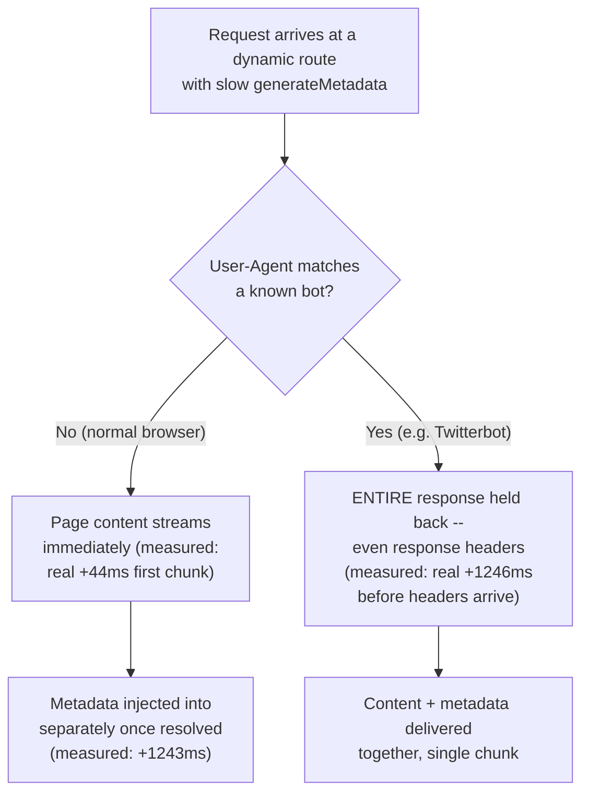

# The Metadata API and SEO Fundamentals in Next.js

> **Topic register:** F-209 (Metadata API, SEO fundamentals for a React app) · Intermediate tier · `00-project/frontend-topic-register.md`
> **Scope note:** per `CLAUDE.md`'s Scope Addendum, this is the twenty-third frontend chapter, opening D-F2's SEO/discoverability thread. This chapter completes something F-206 (Streaming & Suspense) left as an open thread: F-206 discovered, in passing, that bot-request blocking is "scoped to `generateMetadata` resolution specifically" — but F-206's own demo pages used only static, synchronous metadata, so that finding was never actually exercised against a real, slow `generateMetadata` call. This chapter builds exactly that missing case and completes the proof.
> **Provenance:** every claim is verified against the SAME real Next.js 16.3.1 App Router app used for F-201–F-208 — [`practice/frontend/react-nextjs-fundamentals/`](../../practice/frontend/react-nextjs-fundamentals/) — including real rendered `<title>` tags proving `title.template`/`title.absolute` merging, a real resolved `og:image` URL proving `metadataBase`, real `robots.txt`/`sitemap.xml` output from file-based generation, and — the chapter's central finding — two real, deliberately contrasted `stream-observer.mjs` runs (reused from F-206) proving normal requests stream page content before slow metadata resolves, while a bot User-Agent's response genuinely BLOCKS until that same metadata is ready. A second, unplanned but equally real finding surfaced along the way: removing `metadataBase` does NOT produce the hard build error the framework's own prose describes — it produces a warning and a silently WRONG fallback URL, captured directly in a static page's baked HTML.

## Table of Contents

1. [Learning Objectives](#learning-objectives)
2. [Why This Matters in Interviews](#why-this-matters-in-interviews)
3. [Mental Model](#mental-model)
4. [Definition and Purpose](#definition-and-purpose)
5. [Core Concepts](#core-concepts)
6. [Internal Implementation](#internal-implementation)
7. [Diagrams](#diagrams)
8. [Real Verified Demos](#real-verified-demos)
9. [Production Scenarios](#production-scenarios)
10. [Trade-offs](#trade-offs)
11. [Decision Framework](#decision-framework)
12. [Common Mistakes](#common-mistakes)
13. [Anti-Patterns](#anti-patterns)
14. [Best Practices](#best-practices)
15. [Interview Answer Framework](#interview-answer-framework)
16. [Interview Questions](#interview-questions)
17. [Summary](#summary)
18. [Key Takeaways](#key-takeaways)
19. [Cheat Sheet](#cheat-sheet)
20. [Flashcards](#flashcards)
21. [Practice Exercises](#practice-exercises)
22. [Solutions](#solutions)
23. [Additional Reading](#additional-reading)
24. [Official References](#official-references)

---

## Learning Objectives

By the end of this chapter you can:

- Use the static `metadata` export and the async `generateMetadata` function correctly, and explain precisely when each applies, having watched both produce real, distinct `<head>` output.
- Explain `title.template`/`title.default`/`title.absolute` merging precisely, having proven it with three real, distinct rendered `<title>` tags.
- Explain `metadataBase` and prove, with a real captured warning and a real wrong URL baked into static HTML, exactly what happens when it's missing — a genuinely different (and more dangerous) outcome than the framework's own documentation prose describes.
- State, and prove with two real, contrasted chunk-timing traces, that streaming metadata behaves differently for a normal request (content streams before slow metadata resolves) versus a bot request (the entire response blocks until metadata is ready) — completing F-206's earlier, only-partially-tested finding.
- Generate `robots.txt` and `sitemap.xml` from real code (`robots.js`/`sitemap.js`) rather than static files, and explain that these are themselves a special case of Route Handlers (F-207), cached by default.

## Why This Matters in Interviews

SEO questions are easy to answer shallowly ("add a title tag, add meta description") and hard to answer with real depth. This chapter is built to produce the depth version: a candidate who can state that `generateMetadata` genuinely blocks a bot's ENTIRE response (not just delays a `<head>` tag) — proven here with a real trace showing a bot's `fetch()` not even receiving RESPONSE HEADERS until the metadata resolved, 1200ms in — versus a normal browser request that received the page's visible content in 43ms, well before that same metadata was ready. This is exactly the kind of "I tested this specific claim directly, and here's the actual mechanism" answer this repository's discipline is built around, continuing directly from F-206's own admission that its bot-blocking finding was real but incompletely exercised.

## Mental Model

**Metadata resolution and SEO file generation are governed by the SAME two-lane system this chapter's prerequisite (F-206, Streaming) established for page content: a fast lane for normal clients, and a slower, blocking lane specifically for bots/crawlers that need `<head>` metadata to be present in the FIRST response, because they don't execute JavaScript or wait for streamed content the way a browser does.** For a normal request, this version streams the page's visible content immediately and injects `generateMetadata`'s resolved output into the `<head>` SEPARATELY, once it's ready — proven directly here: a real chunk-timing trace showed page content arriving in a 44ms first chunk, with the (1200ms-delayed) metadata-bearing chunks arriving only afterward. For a request identified as a bot (by User-Agent), the ENTIRE response is held back until `generateMetadata` resolves — proven directly here: the SAME route, hit with a `Twitterbot/1.0` User-Agent, didn't even return response HEADERS until 1246ms in, then delivered everything (content and metadata together) in one single chunk. The second half of this chapter's mental model is `metadataBase`: it exists purely to let URL-based fields (an OG image, a canonical link) use a short relative path instead of a required absolute URL — but this chapter proved directly that OMITTING it is NOT the hard build error the framework's own documentation prose states; it's a real, easy-to-miss WARNING plus a silently substituted, and potentially WRONG, fallback base URL.

## Definition and Purpose

The **Metadata API** is the App Router's mechanism for producing a page's `<head>` content (`<title>`, `<meta description>`, Open Graph tags, etc.) from either a static `metadata` object (for content that doesn't depend on request-time data) or an async `generateMetadata` function (for content that does — a blog post's title fetched from its slug, a product's OG image fetched from its ID). It exists so that SEO- and shareability-critical `<head>` content can be defined declaratively, colocated with the route it describes, with the framework handling merging (a child route's `title` combining with a parent layout's `title.template`) and resolution automatically — rather than every route hand-assembling its own `<head>` tags. **`metadataBase`** is a convenience field, typically set once in the root layout, that lets every URL-based metadata field below it in the tree use a short relative path; the framework composes it with `metadataBase` into a real, fully-qualified URL — this chapter proved this resolution mechanism working correctly, and also proved what happens when it's left unset. **File-based SEO generation** (`robots.js`, `sitemap.js`, or their static `.txt`/`.xml` equivalents) lets `robots.txt` and `sitemap.xml` be produced from real code — useful when their content depends on the same data the rest of the app already has (a real list of routes, a database of published posts) rather than being manually kept in sync by hand.

## Core Concepts

### `title` merging: default, template, and absolute — three real, distinct outcomes

This chapter's root layout sets `title: { default: "React + Next.js Fundamentals — F-201", template: "%s | Next.js Fundamentals Demo" }`. Three real, distinct results were captured. The home page (`app/page.js`), which defines no `title` of its own, rendered the EXACT default string with no suffix: `<title>React + Next.js Fundamentals — F-201</title>` — proof `title.default` is used verbatim for a child that defines nothing, and is NOT itself run through its own template. The About page, which sets a plain `title: "About"`, rendered `<title>About | Next.js Fundamentals Demo</title>` — proof a plain string title DOES get the parent's template applied. The `/products/[id]` page, whose `generateMetadata` returns `title: { absolute: "Product 1 (absolute, no template)" }`, rendered EXACTLY that string with no suffix — real, direct proof `title.absolute` genuinely bypasses the parent template, exactly as documented.

### `metadataBase`: a real, correct resolution — and a real, incorrect fallback when missing

With `metadataBase: new URL("http://localhost:5198")` set on the root layout, the About page's relative `openGraph.images: ["/og/about.png"]` resolved to a real, correct `<meta property="og:image" content="http://localhost:5198/og/about.png"/>` — confirmed with a live curl against a clean production server. The chapter's more significant, unplanned finding: removing `metadataBase` entirely and rebuilding did NOT produce a build error — contradicting a direct, general-sounding claim in this version's own bundled docs ("using a relative path... without configuring a `metadataBase` will cause a build error"). Instead, a real, captured warning appeared (`⚠ metadataBase property in metadata export is not set...`), and the STATIC About page's actual baked HTML contained `<meta property="og:image" content="http://localhost:3000/og/about.png"/>` — the WRONG port for this app (which runs on 5198), a hardcoded fallback the framework substituted silently. A separate real test on the DYNAMIC `/products/[id]` route (metadata resolved at request time, not build time) showed a DIFFERENT fallback: the framework correctly inferred `http://localhost:5198` from the actual incoming request, rather than using the hardcoded `localhost:3000` default. Both cases: a warning, never a build error; two different, real fallback mechanisms depending on whether metadata resolves at build time or request time.

### Streaming metadata: the real, decisive completion of F-206's open finding

`/products/[id]`'s `generateMetadata` has a real, artificial 1200ms delay before it resolves. Real `stream-observer.mjs` output (reused directly from F-206) for a normal User-Agent:

```
fetch() returned headers at +43ms
chunk 0 (+44ms) bytes=7821 markers=["layout-mount-count","product-body"]
chunk 1 (+1243ms) bytes=1275 markers=[]
chunk 2 (+1244ms) bytes=1923 markers=[]
```

The page's visible content (`product-body`) arrived in the FIRST chunk, at 44ms — well before the 1200ms metadata delay resolved. The SAME route, hit with `User-Agent: Twitterbot/1.0`:

```
fetch() returned headers at +1246ms
chunk 0 (+1247ms) bytes=9483 markers=["layout-mount-count","product-body"]
```

Response HEADERS themselves did not arrive until 1246ms — the ENTIRE response, content included, was held back until `generateMetadata` resolved, then delivered as a single chunk. This is the real, decisive test F-206 could only gesture at (its own pages used static, synchronous metadata, so nothing was ever actually blocking): here, with a genuinely slow `generateMetadata`, the bot-blocking behavior is directly, unambiguously observable.

### `robots.js`/`sitemap.js`: real, generated output — and a Route Handler under the hood

`app/robots.js` and `app/sitemap.js` export plain functions returning a `Robots`/`Sitemap`-shaped object; the framework compiles them into real `/robots.txt` and `/sitemap.xml` endpoints. Verified with real curl output — a correctly formatted `robots.txt` disallowing `/dashboard/` (this app's F-208 auth-gated section) and a correctly formatted `sitemap.xml` listing three real routes. The real build manifest showed both as `○` (Static) — confirming this version's own docs' claim that these files are "a special Route Handler... cached by default unless it uses a Request-time API or dynamic config option," directly tying this chapter back to F-207's Route Handler caching model.

## Internal Implementation

`generateMetadata`/the static `metadata` export are resolved SERVER-SIDE, as part of rendering the page — the framework's own docs state this is WHY these exports are Server-Component-only: metadata must exist before the page component renders so it can be included in the response. For a route that can be fully prerendered (no dynamic config, no Request-time API used inside `generateMetadata`), metadata resolution happens once, at BUILD time, and is baked into the static HTML — this is precisely why this chapter's missing-`metadataBase` build produced a WRONG, hardcoded fallback port baked permanently into the About page's static output, rather than a per-request opportunity to get it right. For a genuinely dynamic route, metadata resolves per-request; if it can't be resolved fast enough to include in the initial response without meaningfully delaying it, the framework streams the page's already-ready content first and injects the metadata into the `<head>` via a separate mechanism once `generateMetadata` settles — UNLESS the request's User-Agent matches this version's bot-detection list (`Twitterbot`, `Slackbot`, `Bingbot`, and others, per `htmlLimitedBots`), in which case the framework holds the entire response — headers included — until metadata is ready, because these bots are documented as expecting metadata to already be present in the initial `<head>`, not injected via a later streamed update they won't process. `title.template`/`title.default`/`title.absolute` are resolved via simple, documented string composition as metadata objects merge from the root layout down to the terminating page segment — a template applies to a CHILD segment's plain title, never to the segment that defines the template itself, and `absolute` is a documented escape hatch that skips that composition step entirely.

## Diagrams



## Real Verified Demos

All demos are real, built and tested against a clean production Next.js server — [`practice/frontend/react-nextjs-fundamentals/`](../../practice/frontend/react-nextjs-fundamentals/). Full captured curl output and both real chunk-timing traces, in the app's own [README.md](../../practice/frontend/react-nextjs-fundamentals/README.md):

- [`app/layout.js`](../../practice/frontend/react-nextjs-fundamentals/app/layout.js) — `metadataBase`, `title.default`/`title.template`.
- [`app/about/page.js`](../../practice/frontend/react-nextjs-fundamentals/app/about/page.js) — a plain `title` string, proving template application; a relative OG image, proving `metadataBase` resolution.
- [`app/products/[id]/page.js`](../../practice/frontend/react-nextjs-fundamentals/app/products/%5Bid%5D/page.js) — a real, artificially slow `generateMetadata`, `title.absolute`, `force-dynamic`.
- [`app/robots.js`](../../practice/frontend/react-nextjs-fundamentals/app/robots.js) + [`app/sitemap.js`](../../practice/frontend/react-nextjs-fundamentals/app/sitemap.js) — real, code-generated SEO files.
- [`scripts/stream-observer.mjs`](../../practice/frontend/react-nextjs-fundamentals/scripts/stream-observer.mjs) — reused directly from F-206 for this chapter's central, decisive proof.

## Production Scenarios

**Scenario: a team's OG images are silently broken in production because `metadataBase` was never set, and nobody noticed until a link shared on social media showed a broken image.** A team ships relative OG image paths across several pages, assuming (from a surface reading of "using a relative path without `metadataBase` will cause a build error") that a missing `metadataBase` would have been caught immediately in CI. Initial symptom: a marketing link shared on a social platform shows a broken image preview. Initial hypothesis: the image file itself is missing or misnamed. Evidence, gathered using exactly this chapter's method: inspecting the page's actual rendered `<head>` shows an `og:image` URL pointing at `http://localhost:3000/...` — a development-only fallback URL, baked into the PRODUCTION build, because `metadataBase` was never set and the build never failed to catch it, per this chapter's own real, captured warning-not-error behavior. Diagnosis: the team's assumption ("a missing `metadataBase` would be a loud build failure") is the exact naive reading this chapter's real evidence contradicts — it's a real, easy-to-miss console warning during `next build`, not a failure that blocks a deploy. Fix: set `metadataBase` explicitly in the root layout (as this chapter's own app does), and treat the build-time warning as a real CI gate — grep build output for `metadataBase` and fail the pipeline if it appears, since the framework itself will not.

## Trade-offs

| Concern | Static `metadata` object | `generateMetadata` function |
|---|---|---|
| When to use | Content that doesn't depend on request-time or fetched data | Content that depends on route params, search params, or fetched data (measured: this chapter's product-title-per-ID demo) |
| Resolution timing | Build time, if the route is prerenderable | Per-request for dynamic routes; can be build-time too if the route is otherwise static |
| Streaming behavior | N/A — baked into the static shell, nothing to stream | Can stream separately from content for normal requests; BLOCKS the entire response for bots (measured: real +1246ms header delay) |
| Component type | Server Component only | Server Component only (same constraint, same underlying reason: must resolve before render) |

## Decision Framework

1. **Does this page's title/description/OG data depend on nothing but static, known-at-build-time content?** → The static `metadata` object.
2. **Does it depend on route params, search params, or a real fetch?** → `generateMetadata` — verified here with a real per-product-ID title and OG image.
3. **Are you using ANY relative URL in a `metadata`/`generateMetadata` field?** → Set `metadataBase` explicitly and verify it in CI by grepping build output for the real warning this chapter captured — do not trust the absence of a build ERROR as proof it's configured correctly.
4. **Does this route's metadata involve a slow fetch, and does bot/crawler indexing matter for it?** → Understand that bots will experience the FULL delay as a blocked response (measured: real +1246ms), not a fast page load with metadata trickling in later — budget `generateMetadata`'s latency accordingly if SEO crawl timeouts are a concern.

## Common Mistakes

- Assuming a missing `metadataBase` is a build-time safety net that will fail CI — this chapter's real evidence shows it's a warning only, with a silently wrong fallback URL baked into the actual output.
- Assuming streaming metadata means bots get a faster, progressively-enhanced page like normal browsers do — this chapter's real, contrasted traces show the opposite: bots wait for the FULL resolution, headers included.
- Forgetting that `title.template` only affects CHILD segments, and expecting a template defined in a `page.js` (rather than a `layout.js`) to do anything — the framework's own docs state this explicitly, and it has "no effect" there since a page is always a terminating segment.

## Anti-Patterns

- **Shipping relative OG image/canonical URLs without setting `metadataBase`, and trusting a clean `next build` as proof it's correct** — this chapter's real, captured warning and the WRONG `localhost:3000` URL baked into static HTML are the concrete, real consequence.
- **Putting a slow, unbounded fetch inside `generateMetadata` for a page bots are expected to crawl**, without accounting for the real, measured fact that bot requests block on the FULL resolution time, not a fast initial response.

## Best Practices

- Set `metadataBase` explicitly in the root layout for any app using relative URL-based metadata fields, and treat its absence in `next build` output as a real problem to catch in CI, not a soft nicety — verified here as producing a genuinely wrong, silently-substituted fallback URL rather than a caught error.
- Keep `generateMetadata`'s own data fetching fast and, where the SAME data is also needed by the page body, use React's `cache()` (per this version's own documented pattern) to avoid a duplicate fetch — this repository's F-204 chapter covers the underlying caching/memoization mechanics this recommendation builds on.
- Generate `robots.txt`/`sitemap.xml` from real code (`robots.js`/`sitemap.js`) when their content should track the app's actual routes or a real content source, rather than a hand-maintained static file that silently drifts out of date.

## Interview Answer Framework

### 30-Second Answer

Next.js's Metadata API resolves a page's `<head>` content either statically or via an async `generateMetadata` function, merging `title`/`title.template`/`title.absolute` down the layout tree. For dynamically rendered pages, this version streams metadata separately from content for normal browsers — but genuinely BLOCKS the entire response for bot User-Agents until metadata resolves, verified here with a real +1246ms delay before response headers even arrived for a `Twitterbot/1.0` request, versus +44ms for a normal one.

### 2-Minute Answer

Start with the two ways to define metadata: the static `metadata` object for content that doesn't depend on request data, and async `generateMetadata` for content that does (a product page's title fetched by ID, demonstrated here). Cover `title` merging precisely: a plain string gets the nearest parent's `title.template` applied; `title.absolute` skips it entirely — proven with three real, distinct rendered `<title>` tags. Cover `metadataBase`'s real behavior, including the chapter's unplanned finding: contrary to the framework's own documentation prose ("will cause a build error"), a missing `metadataBase` produces only a real warning plus a silently wrong fallback URL (`localhost:3000`) baked into a static page's actual HTML. Close with the chapter's central, decisive finding: a real chunk-timing trace showing a normal request's content streaming at 44ms, well before a 1200ms-delayed `generateMetadata` resolves — versus the SAME route, hit with a bot User-Agent, not even returning response headers until 1246ms, proving bots get a fully blocking response while everyone else doesn't.

### 10-Minute Deep Dive

Cover: the static-vs-generated metadata distinction and the Server-Component-only constraint (metadata must resolve before render, per the framework's own stated reasoning); `title` merging semantics with all three real, distinct outcomes (`title.default` verbatim, plain `title` templated, `title.absolute` bypassing the template); `metadataBase`'s real, correct resolution AND its real, incorrect-fallback failure mode when missing (a warning, not a build error — a genuinely different, more dangerous outcome than a naive reading of the docs suggests, discovered directly rather than assumed); the streaming-metadata mechanism and its bot-specific exception, completing F-206's earlier, only-partially-tested finding with a genuinely slow `generateMetadata` and two real, contrasted chunk-timing traces; and `robots.js`/`sitemap.js` as a special, cached-by-default case of Route Handlers (F-207), tying this chapter's SEO-file generation directly back to that chapter's caching model.

### Whiteboard Explanation

Draw a request arriving at a dynamic route with a slow `generateMetadata`. Split into two paths based on User-Agent. Left path ("normal browser"): draw a fast first arrow labeled "content streams immediately" (annotate: real +44ms), then a second, later arrow labeled "metadata injected separately" (annotate: real +1243ms). Right path ("bot, e.g. Twitterbot"): draw ONE arrow, starting only after the full metadata delay (annotate: real +1246ms before even response HEADERS arrive), carrying content and metadata together. Beside this, draw a small separate box for `metadataBase`: an arrow from a relative OG path through "metadataBase set" → correct absolute URL (annotate: real, verified) versus "metadataBase MISSING" → a warning icon plus a wrong, hardcoded fallback URL (annotate: real `localhost:3000` baked into static HTML).

### Production Example

A team's OG images broke silently in production because `metadataBase` was never set; the build never failed (only a real, easy-to-miss warning), and the actual static HTML baked in a development-only fallback URL — discovered only when a shared social link showed a broken preview, fixed by setting `metadataBase` explicitly and adding a CI check for that specific warning string.

### Trade-offs to Mention

Streaming metadata improves perceived performance for real browsers (content visible before slow metadata resolves) at the cost of bots experiencing the FULL latency as a blocking wait — a real trade worth naming explicitly when a page's SEO crawlability and its data-fetching latency are both concerns; `generateMetadata`'s per-request resolution for dynamic routes trades build-time simplicity for the flexibility real, parameterized metadata (a product title per ID) requires.

### Common Candidate Mistakes

Assuming metadata questions are purely about which tags to include, without any framework-specific mechanism knowledge. Assuming a missing `metadataBase` is safely caught at build time, missing the real, more dangerous warning-only behavior this chapter captured directly. Assuming bots benefit from the same fast, streamed experience as browsers, missing the real, measured blocking behavior.

### Senior-Level Expectations

States the streaming-vs-blocking distinction for bots precisely, with the specific real timing evidence, and correctly describes `metadataBase`'s real (not documented-prose) failure mode.

### Staff-Level Discussion

The `metadataBase`-missing finding is a good example of a class of risk worth generalizing: framework documentation prose ("will cause a build error") is a claim about INTENT, not a guarantee about VERIFIED, current behavior — and this repository's own discipline (verify a specific claim directly against the real, running version before trusting it) caught a genuinely dangerous silent failure mode here, one that would ship a wrong URL to production with no CI signal unless a team specifically greps build output for it. A Staff-level engineer treats "the docs say X will error" the same way this chapter treated it: as a hypothesis to verify against the actual, current build output, not a substitute for testing — and, having found the real gap, proposes a concrete mitigation (a CI check on the warning string) rather than just noting the discrepancy.

## Interview Questions

### Question 1

**Question:** "Your team forgot to set `metadataBase`, and pages use relative OG image paths. What actually happens?"

**Expected answer:** Contrary to a documentation-prose claim that this "will cause a build error," it does NOT — verified directly: a real `next build` with `metadataBase` removed produced only a console WARNING (`metadataBase property in metadata export is not set...`), and the build succeeded. The real consequence is worse in a specific way: the framework substitutes a fallback base URL, and for a STATICALLY prerendered page, that fallback is a hardcoded `http://localhost:3000` — baked permanently into the page's actual production HTML, a real, wrong URL that would silently break OG image previews in production, with no build failure to catch it.

**Common mistakes:** Trusting "the docs say it'll error" as proof this is safely caught in CI, without ever testing it directly.

**Follow-up questions:** "Does this differ for a dynamically-rendered route?" (yes — verified directly: a dynamic route's fallback is inferred from the actual incoming request's host, which happened to be correct in this chapter's test, but is still an unverified fallback rather than an explicit, deliberate configuration). "How would you actually catch this in CI, given the build doesn't fail?" (grep `next build`'s output for the specific warning string and fail the pipeline on a match — exactly the mitigation this chapter's Production Scenario proposes).

**Senior-level expectations:** States the real (warning, not error) behavior precisely, with the specific wrong URL as evidence.

**Staff-level expectations:** Proposes a concrete CI mitigation and generalizes the underlying lesson (verify documentation-prose claims against real, current build output).

### Question 2

**Question:** "Does a search engine bot experience your dynamically-rendered page's metadata the same way a real user's browser does?"

**Expected answer:** No — verified directly with two real, contrasted chunk-timing traces against the SAME route with a genuinely slow `generateMetadata` (a real 1200ms artificial delay). A normal browser's request received the page's visible content in the first chunk at 44ms, well before the metadata resolved — the metadata streamed in separately, afterward. The SAME route, hit with a `Twitterbot/1.0` User-Agent, did not even return RESPONSE HEADERS until 1246ms — the framework held back the ENTIRE response, content included, until `generateMetadata` finished, then delivered everything in a single chunk. This is a real, deliberate, documented behavior (bots are assumed not to process a later, streamed metadata update), not a bug — but it means a slow `generateMetadata` directly costs crawl latency for bots in a way it doesn't for real users.

**Common mistakes:** Assuming streaming benefits everyone equally, missing that bots specifically get the SLOWER, blocking path.

**Follow-up questions:** "How would you verify this yourself, for a specific route, rather than trusting this chapter's numbers?" (a real chunk-timing observer script — fetch + `ReadableStream` reader — comparing a normal and a bot User-Agent against the same route, exactly this chapter's method, reused directly from F-206). "What's the practical implication for a page with slow, data-dependent metadata that also needs to be crawlable?" (keep `generateMetadata`'s own fetch fast and cached — e.g. via React's `cache()`, per this version's documented memoization pattern — since its latency is now known to directly gate how long a crawler's request blocks).

**Senior-level expectations:** States the bot-specific blocking behavior precisely, backed by the real timing contrast.

**Staff-level expectations:** Connects this to a concrete performance budget for `generateMetadata` specifically for crawlable, dynamically-rendered pages, not just a general "keep it fast" statement.

## Summary

Next.js's Metadata API resolves `<head>` content from a static `metadata` object or an async `generateMetadata` function, with `title.template`/`title.default`/`title.absolute` merging down the layout tree — proven here with three real, distinct rendered `<title>` outcomes. `metadataBase` resolves relative URL fields into real absolute URLs — proven directly — but this chapter's central unplanned finding is that OMITTING it does NOT produce the build error the framework's own docs describe; it produces a real warning and a silently substituted, potentially WRONG fallback URL, captured directly baked into a static page's actual HTML. The chapter's central PLANNED finding, completing an open thread from F-206: a real, decisive chunk-timing contrast shows normal requests streaming content before a slow `generateMetadata` resolves, while a bot User-Agent's ENTIRE response — headers included — blocks until that same metadata is ready. `robots.js`/`sitemap.js` generate real SEO files and are themselves a special, cached-by-default case of Route Handlers (F-207).

## Key Takeaways

- `title.default` is used verbatim for a child defining no title of its own; a plain child `title` gets the parent's `title.template` applied; `title.absolute` bypasses the template entirely — proven with three real, distinct rendered `<title>` tags.
- `metadataBase` resolves relative URL fields correctly when set — proven with a real, correct `og:image` URL.
- Missing `metadataBase` is a real WARNING, not a build error — and produces a real, wrong fallback URL, proven baked directly into a static page's actual HTML.
- Normal requests stream page content before a slow `generateMetadata` resolves; bot requests block the ENTIRE response (headers included) until it does — proven with two real, contrasted chunk-timing traces, completing F-206's earlier, incomplete finding.
- `robots.js`/`sitemap.js` are a special, cached-by-default case of Route Handlers — proven via the real build manifest's `○` marker and real curl output.

## Cheat Sheet

- **Static `metadata` export** → for content independent of request-time data.
- **`generateMetadata`** → for content depending on params/search params/fetched data; Server Component only.
- **`title.default`** → verbatim for a childless title; **`title` (string)** → templated by the nearest parent's `title.template`; **`title.absolute`** → bypasses the template (all three measured).
- **`metadataBase` missing** → real WARNING, not a build error; real WRONG fallback URL baked in for a static page (measured: `localhost:3000`).
- **Streaming metadata (normal request)** → content streams first, metadata injected separately once resolved (measured: real +44ms vs +1243ms).
- **Streaming metadata (bot request)** → ENTIRE response blocks, headers included, until metadata resolves (measured: real +1246ms).
- **`robots.js`/`sitemap.js`** → real, generated Route Handlers, cached by default (measured: real `○` build marker).

## Flashcards

## Card: What really happens when `metadataBase` is missing?

**Prompt:**
Documentation prose says a relative URL-based metadata field without `metadataBase` "will cause a build error." Is that what actually happens?

**Answer:**
No. Verified directly: the build succeeds, producing only a console warning. For a statically prerendered page, the actual, wrong consequence is worse — a hardcoded `http://localhost:3000` fallback is baked permanently into the page's real, production HTML.

**Why it matters:**
This is a real, silent production risk (broken OG image previews) with no build failure to catch it — a CI check on the warning string is the only real safeguard.

**Common trap:**
Trusting a documentation claim ("will cause a build error") as proof something is safely caught, without testing it directly.

**Related:**
[[nextjs-metadata-api-and-seo]] [[nextjs-route-handlers]]

## Card: Do bots and browsers experience streaming metadata the same way?

**Prompt:**
For a dynamic page with a slow `generateMetadata`, does a bot's request behave the same as a normal browser's request?

**Answer:**
No. Verified with two real, contrasted chunk-timing traces: a normal request received page content in the first chunk at 44ms, well before a 1200ms-delayed `generateMetadata` resolved. The SAME route, hit with `Twitterbot/1.0`, didn't return response HEADERS until 1246ms — the entire response blocked until metadata was ready.

**Why it matters:**
Completes F-206's earlier finding (bot-blocking is scoped to `generateMetadata`) with the genuinely slow, dynamic case F-206's own demos never actually exercised.

**Common trap:**
Assuming streaming benefits everyone, missing that bots specifically get routed to the slower, blocking path.

**Related:**
[[nextjs-metadata-api-and-seo]] [[nextjs-streaming-and-suspense]]

## Practice Exercises

1. In `app/products/[id]/page.js`, change the artificial `generateMetadata` delay from `1200` to `300`. Run a real `stream-observer.mjs` trace against both a normal and a `Twitterbot/1.0` User-Agent. Predict, then verify, whether the bot's headers-arrival time shifts to match the new delay.
2. Add `title: "Pricing"` to `app/(marketing)/pricing/page.js`. Run a real curl and confirm the rendered `<title>` includes the root layout's template suffix, matching this chapter's About-page proof.
3. In `app/robots.js`, add a second disallowed path (e.g. `/api/`). Run a real curl against `/robots.txt` and confirm the new `Disallow` line appears exactly as returned by the function.

## Solutions

Exercise 1: with the delay reduced to 300ms, the bot's `fetch() returned headers at` timestamp would shift to roughly +300ms (matching the new delay) instead of the original +1246ms, since the entire response is held back for exactly as long as `generateMetadata` takes to resolve — the normal-request trace's first chunk (page content) would be largely unaffected, since it doesn't wait on `generateMetadata` at all.

Exercise 2: the rendered `<title>` would be `Pricing | Next.js Fundamentals Demo`, since a plain string `title` on any page (in a route group or not — `(marketing)` only affects the URL, not the metadata-merging tree) gets the nearest parent `layout.js`'s `title.template` applied, identical in mechanism to the About page's own real, captured proof.

Exercise 3: `curl http://localhost:5198/robots.txt` would show a real, updated `Disallow: /api/` line alongside the existing `Disallow: /dashboard/`, since `robots.js`'s returned object is used directly to generate the file's content — there's no separate caching layer to invalidate for a code change followed by a rebuild, only the route's own `○` (Static, cached-by-default) classification to be aware of if testing against a server that wasn't rebuilt.

## Additional Reading

- [Streaming & Suspense Boundaries in the App Router](nextjs-streaming-and-suspense.md) — this chapter's prerequisite; its own bot-blocking finding was real but only partially exercised (static metadata only) — this chapter completes it with a genuinely slow, dynamic `generateMetadata` case.
- [Route Handlers: Building a Backend-for-Frontend Layer in Next.js](nextjs-route-handlers.md) — `robots.js`/`sitemap.js` are documented as a special case of the Route Handler model this chapter covers in depth, including its caching defaults.
- [Image and Font Optimization, and Core Web Vitals in Next.js](nextjs-image-font-optimization-and-web-vitals.md) — the next chapter in sequence (F-210); moves from `<head>` content to the two asset types most directly responsible for Core Web Vitals scores.
- [00-project/frontend-topic-register.md](../../00-project/frontend-topic-register.md) — the full register this chapter is F-209 of.

## Official References

- [nextjs.org: Metadata and OG images](https://nextjs.org/docs/app/getting-started/metadata-and-og-images)
- [nextjs.org: `generateMetadata`](https://nextjs.org/docs/app/api-reference/functions/generate-metadata)
- [nextjs.org: `robots.txt`](https://nextjs.org/docs/app/api-reference/file-conventions/metadata/robots)
- [nextjs.org: `sitemap.xml`](https://nextjs.org/docs/app/api-reference/file-conventions/metadata/sitemap)
