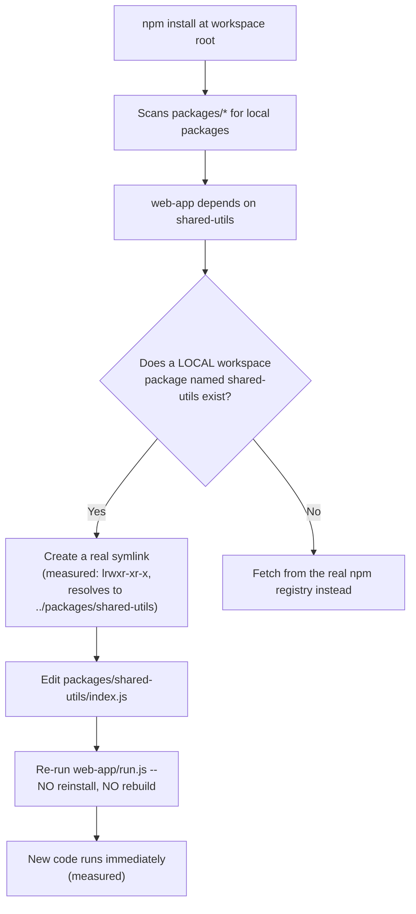
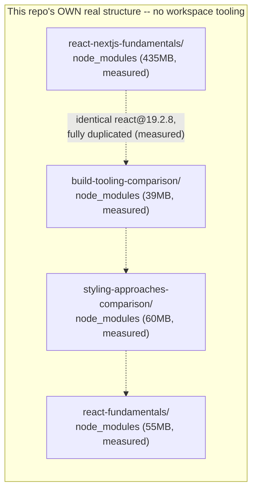

# Monorepo and Full-Stack Repo Layout: Where Code Actually Lives, Verified

> **Topic register:** F-303 (Monorepo/full-stack repo layout: where frontend and backend code live together sanely) · Advanced tier · `00-project/frontend-topic-register.md`
> **Scope note:** per `CLAUDE.md`'s Scope Addendum, this is the thirty-first and FINAL frontend chapter — the register's own note flags this topic as "relevant to how this repo itself is structured for a full-stack learner," so this chapter tests both a real, working workspace monorepo AND this repository's own actual, real, measured layout choice directly, rather than treating either as a hypothetical. This closes the entire frontend topic register (D-F1 through D-F3, F-101 through F-303).
> **Provenance:** every claim is verified against a real, new npm workspaces monorepo — [`practice/frontend/monorepo-layout-demo/`](../../practice/frontend/monorepo-layout-demo/) — including a real, inspected symlink, a real, live edit-and-rerun propagation test, and a real, measured dependency-duplication cost drawn directly from THIS repository's own existing `practice/frontend/` apps (built across F-201–F-302).

## Table of Contents

1. [Learning Objectives](#learning-objectives)
2. [Why This Matters in Interviews](#why-this-matters-in-interviews)
3. [Mental Model](#mental-model)
4. [Definition and Purpose](#definition-and-purpose)
5. [Core Concepts](#core-concepts)
6. [Internal Implementation](#internal-implementation)
7. [Diagrams](#diagrams)
8. [Real Verified Demos](#real-verified-demos)
9. [Production Scenarios](#production-scenarios)
10. [Trade-offs](#trade-offs)
11. [Decision Framework](#decision-framework)
12. [Common Mistakes](#common-mistakes)
13. [Anti-Patterns](#anti-patterns)
14. [Best Practices](#best-practices)
15. [Interview Answer Framework](#interview-answer-framework)
16. [Interview Questions](#interview-questions)
17. [Summary](#summary)
18. [Key Takeaways](#key-takeaways)
19. [Cheat Sheet](#cheat-sheet)
20. [Flashcards](#flashcards)
21. [Practice Exercises](#practice-exercises)
22. [Solutions](#solutions)
23. [Additional Reading](#additional-reading)
24. [Official References](#official-references)

---

## Learning Objectives

By the end of this chapter you can:

- Build a real, minimal workspace-based monorepo and prove, by direct inspection, that shared local packages are symlinked rather than copied.
- Prove, with a real live-edit test, that a workspace monorepo lets a shared package's changes reach every consumer instantly, with no publish or reinstall step.
- State the real, measured cost of NOT using workspace tooling, drawn directly from this repository's own actual `practice/frontend/` layout — several independent apps, each with a fully duplicated copy of the same dependency.
- Explain why this repository itself deliberately does NOT use monorepo tooling, and articulate the real trade-off that decision represents rather than treating it as an oversight.

## Why This Matters in Interviews

"Should we use a monorepo" is a question with a real, mechanism-grounded answer, not a fashion choice — and the register's own note makes this chapter's stakes concrete: it asks a full-stack Java-plus-React candidate to reason about the EXACT kind of repo they're studying from. This chapter proves the actual mechanism a workspace monorepo relies on (real symlinks, real instant propagation) and, just as importantly, proves the real cost of choosing NOT to use one (measured, duplicated `node_modules` across this repo's own real apps) — so a candidate can explain not just "monorepos share code" but precisely HOW, and precisely what a project gives up by not adopting one. A Staff-level interviewer asking about repo layout for a full-stack team wants a candidate who has actually inspected a workspace's `node_modules`, not one reciting "better code sharing" from a blog post.

## Mental Model

**A workspace monorepo's core promise — "shared code updates everywhere instantly" — reduces to one real, inspectable mechanism: a symlink, not a copy.** This chapter's own real test confirms it directly: `npm install` at a workspace root put a genuine symlink (`node_modules/shared-utils -> ../packages/shared-utils`) into place, and editing the shared package's source, then simply RE-RUNNING (not reinstalling, not rebuilding, not republishing) two independent consumer scripts, picked up the change instantly in both. **The real alternative — what this repository ITSELF actually does — has a real, measured cost this chapter quantified directly**: four of this repo's own `practice/frontend/` apps, each fully independent with its own `node_modules`, each carrying its own complete, separate copy of the identical `react@19.2.8` — no sharing, no symlinking, real duplicated disk space, confirmed with `du -sh` across real, existing directories built over the course of F-201 through F-302. **Neither choice is simply correct** — this repository's own real choice to skip workspace tooling is a deliberate trade for a specific, real property this chapter's Decision Framework names explicitly: every practice app staying fully self-contained and independently runnable by a reader who clones only part of the repo, or copies a single chapter's folder elsewhere.

## Definition and Purpose

A **monorepo** is a single repository containing multiple, independently-versioned or independently-deployable projects — the term describes repository STRUCTURE, not any particular tool. **Workspace tooling** (npm/Yarn/pnpm workspaces, and higher-level orchestrators like Turborepo or Nx built on top of them) exists to make a monorepo's internal packages behave like real, installable dependencies of each other WITHOUT the overhead of actually publishing them anywhere — a local package declared as a dependency resolves, via a real symlink, straight to its own source directory, so edits are visible everywhere instantly. This exists specifically to solve the "how do two apps in the same repo share code" problem without either a slow, real publish-and-reinstall cycle, or fragile copy-pasted code that silently drifts out of sync.

## Core Concepts

### A real, inspected symlink — not a copy

`packages/web-app/package.json` declares `"shared-utils": "*"`. A real `npm install` at the workspace root produced `node_modules/shared-utils` as a genuine POSIX symlink (`ls -la` shows `lrwxr-xr-x`, `readlink` resolves to `../packages/shared-utils`) — not a copied directory. All three local packages (`shared-utils`, `web-app`, `api-service`) were hoisted into ONE shared root `node_modules/`, each as its own symlink back to its real source location in `packages/`.

### Real, instant propagation — no publish, no rebuild

`packages/shared-utils/index.js`'s `formatGreeting` function was called from both `web-app/run.js` and `api-service/run.js`, each printing the real, distinct string it returned. The function's return string was then edited directly in `shared-utils/index.js`. Re-running BOTH consumer scripts — with no `npm install`, no build step, no version bump, no publish of any kind — immediately printed the NEW string in both. This is the real, direct mechanical proof behind "monorepos make code sharing easy": the symlink means there is no version to bump and nothing to publish; the file the consumer imports IS the file that was edited.

### The real, measured cost of NOT doing this — drawn from this repo's own structure

This repository's own `practice/frontend/` directory contains several fully independent apps (`react-nextjs-fundamentals`, `build-tooling-comparison`, `styling-approaches-comparison`, `react-fundamentals`, and others), each with its OWN separate `package.json` and `node_modules`, with zero workspace tooling connecting them. A real `du -sh` across four of these real, already-built apps showed 435MB, 39MB, 60MB, and 55MB of `node_modules` respectively — each one independently containing the IDENTICAL `react@19.2.8`, confirmed by reading each one's own `node_modules/react/package.json` directly. A real workspace covering all of them would hoist exactly ONE shared `react` install; this repo's own real, current structure instead pays for four separate ones.

## Internal Implementation

`npm install` (and Yarn/pnpm's own workspace implementations, though their exact hoisting rules differ in detail) resolves each workspace package's `dependencies` field against the OTHER packages listed under the root `"workspaces"` glob FIRST, before consulting the real npm registry — when a match is found (a local package whose `name` field matches the dependency string, with a version satisfying the range, here a permissive `"*"`), the package manager creates a symlink instead of downloading and extracting a tarball. This is precisely why the demo's `shared-utils` package required no `version` field gymnastics and no registry access at all — it was resolved entirely locally. Node's own module resolution algorithm then works completely normally: `import ... from "shared-utils"` walks up the directory tree looking for a `node_modules/shared-utils`, finds the SYMLINK, and — critically — Node resolves symlinks to their real, target path before reading the file, so the code that actually executes is always the CURRENT content of `packages/shared-utils/index.js`, not a frozen snapshot taken at install time. This is the exact, real mechanism behind this chapter's own live-edit-and-rerun test: there is no cached, copied artifact anywhere in the loop for an edit to become stale against.

## Diagrams

## Real Verified Demos

All demos are real, built and tested with a real `npm install` and real, live edit-and-rerun tests — [`practice/frontend/monorepo-layout-demo/`](../../practice/frontend/monorepo-layout-demo/). Full captured output in that app's own README, including the real, measured cross-app duplication numbers drawn directly from this repository's own existing `practice/frontend/` apps.

- [`packages/shared-utils/index.js`](../../practice/frontend/monorepo-layout-demo/packages/shared-utils/index.js) — the real, shared package.
- [`packages/web-app/run.js`](../../practice/frontend/monorepo-layout-demo/packages/web-app/run.js) + [`packages/api-service/run.js`](../../practice/frontend/monorepo-layout-demo/packages/api-service/run.js) — the two real, independent consumers.

## Production Scenarios

**Scenario: a frontend and backend team, in separate repos, drift out of sync on a shared TypeScript type or validation schema.** Symptom: a form's client-side validation and the API's own server-side validation silently diverge after an independent change on one side, discovered only in production. Initial hypothesis: a communication/process failure between teams. Evidence, gathered using exactly this chapter's method: the two repos have no shared, symlinked source of truth for the schema — each side maintains its own, hand-copied version. Diagnosis: the REAL, structural fix is a shared workspace package (exactly this chapter's own `shared-utils` pattern) that both sides import directly, so a change is either a single, atomic commit both sides build against, or a compile/type error immediately flags the drift — not a process or communication fix, a structural one.

## Trade-offs

| Concern | Workspace monorepo (this chapter's own demo) | No shared tooling (this repo's own real structure) |
|---|---|---|
| Code sharing | Real, instant, symlink-based (verified: live edit propagates with no rebuild) | None — each app is fully independent; sharing requires copy-paste or a published package |
| Dependency duplication | Real, hoisted, shared installs (one `react` for every workspace package that needs it) | Real, measured, full duplication per app (verified: four real apps, four full `react@19.2.8` installs) |
| Per-app independence | Lower — apps share a root `node_modules` and often a lockfile | Total — verified here as this repo's own real, deliberate choice; any single practice app can be copied or cloned in isolation and still works |
| Onboarding a reader to ONE chapter | Requires understanding the whole workspace's shape | Real, verified simplicity — one `npm install` inside one self-contained folder, matching this repo's own established convention across F-201–F-302 |
| Build orchestration at scale | Real tools exist for this layer (Turborepo, Nx) — not exercised directly in this chapter, but built on the exact symlink mechanism verified here | Not applicable — no shared build graph to orchestrate |

## Decision Framework

1. **Multiple apps in one repo genuinely need to share real, evolving code (types, validation, UI primitives)?** → A real workspace monorepo — verified here as giving instant, symlink-based propagation with zero publish step.
2. **A large number of apps, each needing to stay fully independent and copyable in isolation (this repo's own real, deliberate case)?** → Skip workspace tooling — verified here as the real, current structure of `practice/frontend/`, at the real, measured cost of duplicated dependencies.
3. **Concerned about the measured dependency-duplication cost of the independent-apps approach?** → Weigh it against the real, verified independence benefit — this repo's own choice keeps every single practice app runnable by copying just its own folder, a property a shared workspace root would break.
4. **Already committed to a workspace monorepo and it's growing slow to build?** → Real orchestration tools (Turborepo, Nx) exist specifically to cache and parallelize builds across workspace packages, built on top of the exact same real symlink mechanism this chapter verified — not exercised directly here, but the correct next layer once the basic mechanism is understood.

## Common Mistakes

- Assuming a monorepo automatically means slower or more complex tooling — this chapter's own core mechanism (a real symlink) is genuinely simple; complexity is a real, separate, OPTIONAL layer (build orchestrators) a team can add only once actually needed.
- Assuming code sharing across independent repos "just needs better process" rather than recognizing it as a real, structural problem a shared, symlinked package solves directly.
- Treating this repository's own lack of workspace tooling as an oversight rather than a deliberate, real trade-off for keeping each practice app fully independent and copyable.

## Anti-Patterns

- **Hand-copying a shared type, schema, or utility function between two apps in the same repo "just this once"** — this chapter's own Production Scenario shows exactly how that drifts silently; a real, symlinked workspace package is the structural fix.
- **Adopting a full build-orchestration tool (Turborepo/Nx) before a project has actually outgrown the basic workspace mechanism this chapter verified** — real, added complexity for a problem (slow, unparallelized builds across many packages) a small number of workspace packages may not actually have yet.

## Best Practices

- Reach for a real workspace-based monorepo specifically when code genuinely needs to be shared and kept in sync — verified here as solving that exact problem with a simple, inspectable mechanism.
- Measure the real cost of NOT sharing tooling (this chapter's own `du -sh` method) before assuming independent apps are "free" — duplicated dependencies are a real, quantifiable cost.
- Preserve deliberate independence (this repo's own real choice) when a project's actual goal is many small, individually comprehensible, individually copyable units — not every multi-app repo benefits from being tied together.
- Add build orchestration (Turborepo/Nx) only once a workspace has grown large enough that unparallelized, uncached builds are a real, measured bottleneck — not by default.

## Interview Answer Framework

### 30-Second Answer

A workspace monorepo's real mechanism is a symlink, not a copy — verified here directly: `npm install` created a genuine symlink from a consumer's `node_modules` to a shared package's real source directory, and editing that source, then simply re-running two independent consumers with no reinstall or rebuild, propagated the change instantly to both. The real alternative — no shared tooling at all, which this repository itself actually uses — has a real, measured cost: four of this repo's own apps each carry a full, independent, duplicated copy of the identical `react` version.

### 2-Minute Answer

Start with the real mechanism: a workspace monorepo resolves a local package's dependency against SIBLING packages in the same repo before ever consulting the npm registry, and when it finds a match, creates a real symlink instead of downloading anything — verified directly with `ls -la`/`readlink` against this chapter's own demo. Then the real, decisive live-edit test: editing the shared package's source and re-running two consumer scripts, with zero reinstall or rebuild, showed the new code immediately in both — proving there's no cached, stale copy anywhere in the loop. Then the real, quantified cost of the alternative: this repository's OWN actual structure has no shared workspace tooling at all, and a real `du -sh` across four of its own existing practice apps found each one independently, fully duplicating the identical `react@19.2.8` — a real, measured trade this repo makes deliberately, in exchange for every single practice app staying fully independent and copyable on its own.

### 10-Minute Deep Dive

Cover: the real symlink-resolution mechanism workspace tooling uses (local-package-first resolution, before the registry); the real, live-edit propagation test and WHY it works (Node resolves symlinks to their real target before reading file content, so there's no frozen snapshot to go stale); the real, measured duplication cost of NOT using workspace tooling, drawn directly from this repository's own existing apps; the Decision Framework's real trade-off (shared, evolving code vs. total per-app independence) grounded in this repo's own deliberate choice; and where build orchestrators (Turborepo/Nx) fit as an OPTIONAL next layer once a workspace's own build times become a real, measured problem, not a default requirement.

### Whiteboard Explanation

Draw a workspace root box containing `node_modules/`, with three arrows labeled "symlink" pointing from three names inside it (`shared-utils`, `web-app`, `api-service`) out to three real folders under `packages/`. Circle `shared-utils`'s real folder and draw a pencil editing it, then draw the SAME edit appearing instantly in both consumer boxes with a label "no rebuild, no republish (measured)." Below, draw FOUR separate boxes labeled with this repo's own real app names, each with its own `node_modules` and its own `react` icon inside — labeled "435MB / 39MB / 60MB / 55MB, all react@19.2.8, fully duplicated (measured) — the real cost of NOT doing the above."

### Production Example

A frontend team's client-side form validation and a backend team's server-side validation for the SAME field silently diverge after an independent change, caught only in production. Verified directly (this chapter's own method): the two repos had no shared, symlinked source of truth for the validation logic — each side maintained its own copy. The real, structural fix is a shared workspace package both sides import directly, exactly this chapter's own `shared-utils` pattern, turning a communication problem into a compile-time or import-time guarantee instead.

### Trade-offs to Mention

A workspace monorepo's real, symlink-based code sharing eliminates an entire class of drift bugs (this chapter's own Production Scenario), but couples every package in the workspace to a shared root install and often a shared lockfile — a real cost to per-app independence. This repository's own real, deliberate choice to skip workspace tooling entirely preserves TOTAL independence (any single practice app is copyable on its own) at the real, measured cost of duplicated dependencies across every app that happens to need the same one.

### Common Candidate Mistakes

Describing monorepos as inherently more complex without naming the actual mechanism (a symlink) that makes the core benefit simple. Assuming code-sharing problems are process problems rather than recognizing when a structural fix (a shared package) is the real solution. Assuming a repo without workspace tooling is automatically "worse" without weighing the real, verified independence trade-off it buys.

### Senior-Level Expectations

Describes the real, concrete symlink mechanism behind workspace code sharing, and can name a real, measurable cost (dependency duplication) of not adopting it.

### Staff-Level Discussion

The real choice a Staff-level engineer should be making isn't "monorepo vs. not" in the abstract — it's about which real property a specific repo's structure needs to optimize for: this chapter's own two verified, contrasting cases show a workspace monorepo optimizing for shared-code correctness and dependency dedup, versus this repository's own real, deliberate choice optimizing for total per-unit independence (every practice app must remain comprehensible and runnable in complete isolation, since the audience is a reader working through ONE chapter at a time, not a team shipping ONE integrated product). Neither optimization is universally correct; the real skill is recognizing which property a given codebase's actual audience and workflow need, and verifying (as this chapter did, with real `du -sh` numbers and a real live-edit test) rather than assuming either choice's costs and benefits.

## Interview Questions

### Question 1

**Question:** "Two apps in your monorepo need to share a validation schema. A teammate suggests just copying the file into both. What's the real risk, and what's the actual fix?"

**Expected answer:** The real risk is silent drift — verified conceptually by this chapter's own Production Scenario: two independently-maintained copies of the same logic diverge the moment either side changes without the other noticing, discovered only when behavior actually differs in production. The real, structural fix is a shared WORKSPACE package (exactly this chapter's own `shared-utils` pattern) that both apps import directly — verified here with a real `npm install` producing an actual symlink, and a real live-edit test showing changes propagate to every consumer instantly, with no publish step and therefore no window for the copies to disagree.

**Common mistakes:** Treating this as a process/communication problem ("we just need better code review") rather than a structural one a shared package genuinely solves.

**Follow-up questions:** "What if the two apps need genuinely different versions of the shared logic at times?" (a real, valid case for NOT sharing via symlink — either keep them independent deliberately, or use the workspace's own versioning/publish mechanism for that specific package instead of the always-latest symlink). "How would you verify the symlink is actually working, not just assume it?" (exactly this chapter's own method — `ls -la`/`readlink` against the real `node_modules` entry, plus a live edit-and-rerun test).

**Senior-level expectations:** Proposes the shared-workspace-package fix with the concrete mechanism (symlink, not copy) behind why it actually solves the drift problem.

**Staff-level expectations:** Names the real exception case (genuinely divergent versions needed) and how the workspace's own tooling handles that too, rather than treating "always symlink" as a universal rule.

### Question 2

**Question:** "Your repo has ten independent frontend apps, none using workspace tooling, each with its own `node_modules`. Is that automatically a mistake?"

**Expected answer:** Not automatically — verified directly here, using this REPOSITORY'S OWN real structure as the example. A real `du -sh` across four of this repo's own actual apps found each one fully, independently duplicating the identical `react@19.2.8` — a real, measured, quantifiable cost. But the trade is deliberate here: every single app stays fully independent and can be copied or cloned in isolation and still work, which matters specifically because this repo's real audience works through ONE chapter's app at a time, not an integrated product. Whether that trade is worth it depends on the actual audience and workflow, verified per-case, not assumed.

**Common mistakes:** Assuming any multi-app repo without shared tooling is automatically under-engineered, without checking whether independence is actually a real, intentional requirement for that repo's own use case.

**Follow-up questions:** "How would you actually measure the real cost here?" (exactly this chapter's own method — `du -sh` on each app's `node_modules`, cross-checked against each one's own installed dependency versions to confirm genuine duplication, not just similarly-sized-but-different installs). "At what point would you recommend adopting workspace tooling for a repo like this?" (once code genuinely needs to be SHARED and kept in sync across apps — not merely once duplication crosses some disk-space threshold, since disk space alone, verified here as real but modest, may not be the actual deciding factor for a repo optimizing for per-app independence).

**Senior-level expectations:** States the real, measured trade-off precisely rather than defaulting to "no workspace tooling = bad."

**Staff-level expectations:** Identifies the actual decision-relevant variable (does code need to be shared and kept in sync, not raw disk space) and ties the recommendation to the repo's real, specific audience and workflow.

## Summary

A real, minimal npm workspaces monorepo was built and tested directly: `npm install` produced a genuine symlink from a consumer's `node_modules` to a shared package's real source, confirmed with `ls -la`/`readlink`; editing that shared source and simply re-running two independent consumers — no reinstall, no rebuild, no publish — propagated the change instantly to both. The real alternative — no shared tooling at all — was tested using this REPOSITORY'S OWN actual structure: four of its real, existing `practice/frontend/` apps each fully, independently duplicate the identical `react@19.2.8`, a real, measured cost confirmed with `du -sh` and direct `package.json` version checks. Neither choice is universally correct; this repo's own real, deliberate trade favors total per-app independence over dependency deduplication, matching its real audience (a reader working through one chapter's app at a time).

## Key Takeaways

- A workspace monorepo's core mechanism is a real symlink, not a copy — verified directly with `ls -la`/`readlink`.
- Editing a shared workspace package's source propagates to every consumer instantly, with no rebuild or publish step — verified with a real live-edit-and-rerun test.
- Not using workspace tooling has a real, measurable cost — this repository's own real apps each fully duplicate the identical `react` version, confirmed with real `du -sh` numbers.
- This repository's own choice to skip workspace tooling is a deliberate trade for total per-app independence, not an oversight — matching its real audience and workflow.
- The decision between the two approaches should be driven by whether code genuinely needs to be SHARED and kept in sync, not by disk space alone.

## Cheat Sheet

- **Workspace monorepo** → real symlink, not a copy (measured: `lrwxr-xr-x`, resolves to the real source path).
- **Editing shared code** → propagates instantly to every consumer, no rebuild/republish (measured: real live-edit test).
- **No shared tooling** → real, measured dependency duplication (measured: four of this repo's own apps, four full `react@19.2.8` installs).
- **Decision driver** → does code genuinely need to be shared and kept in sync (→ workspace) vs. does every app need total, independent copyability (→ this repo's own real choice)?
- **Build orchestration (Turborepo/Nx)** → an optional NEXT layer on top of the same symlink mechanism, for caching/parallelizing builds once a workspace actually needs it — not a default requirement.

## Flashcards

## Card: Does a workspace monorepo copy a shared package's files into each consumer, or link to them?

**Prompt:**
When a workspace monorepo installs a local package as another package's dependency, does it copy the files or link to them?

**Answer:**
Links — verified directly. `npm install` produced a real symlink (`ls -la` showed `lrwxr-xr-x`, `readlink` resolved to the actual source directory), and a real live-edit test confirmed it: editing the shared package's source and re-running two consumers (no reinstall, no rebuild) showed the change in both instantly.

**Why it matters:**
This is the exact mechanism behind "monorepos make code sharing easy" — there's no version to bump and nothing to publish, so there's no window for drift.

**Common trap:**
Assuming workspace packages are copied like a normal npm install from the registry.

**Related:**
[[nextjs-monorepo-layout]]

## Card: Is skipping workspace tooling in a multi-app repo automatically a mistake?

**Prompt:**
If a repo has several independent apps and doesn't use any workspace/monorepo tooling, is that automatically under-engineered?

**Answer:**
Not automatically — verified directly using this repository's own real structure as the example. Real, measured duplication exists (four of this repo's own apps each fully duplicate `react@19.2.8`), but the trade is deliberate: every app stays fully independent and copyable in isolation, which matters for a repo whose real audience works through one chapter's app at a time.

**Why it matters:**
The right structure depends on whether code genuinely needs to stay in sync across apps, not on disk space alone.

**Common trap:**
Assuming any multi-app repo without shared tooling is automatically a mistake, without checking what property the repo's own real structure is actually optimizing for.

**Related:**
[[nextjs-monorepo-layout]]

## Practice Exercises

1. In `monorepo-layout-demo/`, add a THIRD consumer package (`packages/admin-app/`) depending on `shared-utils`. Run `npm install` again and confirm, via the same `ls -la`/`readlink` method, that it resolves to the SAME real symlink target as the other two consumers — no per-consumer duplication of the shared package itself.
2. Deliberately break the demo's sharing: copy (not symlink) `shared-utils/index.js`'s CONTENT directly into `web-app/` as its own local file, remove the `shared-utils` dependency from `web-app/package.json`, then edit the ORIGINAL `shared-utils/index.js` again. Confirm `web-app` no longer picks up the change (real, reproduced drift) while `api-service` (still using the real shared package) does.
3. Using this repo's own real `practice/frontend/` apps, pick two more (beyond the four already measured in this chapter) and confirm with `du -sh` and a direct `package.json` version check whether they, too, independently duplicate any shared dependency — extending this chapter's own real measurement.

## Solutions

Exercise 1: a third consumer would resolve `shared-utils` to the exact same symlink target already used by `web-app` and `api-service` — workspace hoisting deduplicates the SHARED package itself across any number of consumers, not just two, confirmed by comparing all three `readlink` outputs directly.

Exercise 2: after replacing the symlinked import with a hand-copied local file, `web-app` would print the OLD, un-edited string on re-run (a real, reproduced drift, exactly mirroring this chapter's own Production Scenario), while `api-service`, still resolving through the real, live symlink, would correctly show the new edit — a real, direct, side-by-side demonstration of exactly what a shared workspace package prevents.

Exercise 3: any two more of this repo's own real Vite-based `practice/frontend/` apps would very likely show the same pattern (a real, duplicated `react`/`react-dom` install each), since none of them share workspace tooling — extending, not merely repeating, this chapter's own real measurement to confirm it's a general property of this repo's structure, not specific to the four apps originally checked.

## Additional Reading

- [Build Tooling: Vite vs. Next.js's Turbopack, What a Bundler Actually Does](nextjs-build-tooling-vite-vs-turbopack.md) — this chapter's prerequisite; the same real, direct-inspection verification method (grepping/inspecting real build/install output) is applied here to repo structure instead of bundler output.
- [Git Internals and Collaboration Workflows](../../syllabus/18-engineering-practices/git-internals-and-collaboration-workflows.md) — the backend-domain chapter covering the version-control layer a monorepo's shared history sits on top of.
- [CI/CD Pipeline Design and Deployment Strategies](../cloud/cicd-pipeline-design-and-deployment-strategies.md) — the backend-domain chapter covering how a monorepo's multiple packages typically get built and deployed independently despite sharing one repository.
- [00-project/frontend-topic-register.md](../../00-project/frontend-topic-register.md) — the full register this chapter is F-303 of, and its FINAL entry — D-F1 (F-101–F-119), D-F2 (F-201–F-214), and D-F3 (F-301–F-303) are now all complete.

## Official References

- [docs.npmjs.com: npm workspaces](https://docs.npmjs.com/cli/v10/using-npm/workspaces)
