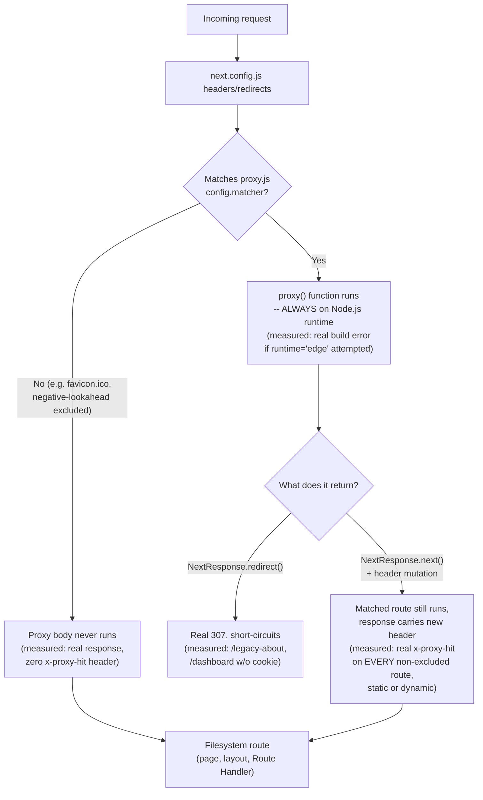

# Proxy (formerly Middleware) & the Edge Runtime in Next.js 16

> **Topic register:** F-208 (Middleware & the Edge runtime) · Advanced tier · `00-project/frontend-topic-register.md`
> **Scope note:** per `CLAUDE.md`'s Scope Addendum, this is the twenty-second frontend chapter, continuing the D-F2 thread F-207 opened (server-side seams a Next.js app can own). The register names this topic "Middleware & the Edge runtime" — this chapter documents, with real captured evidence, that BOTH halves of that name are stale in this Next.js version: "Middleware" was renamed to "Proxy" in v16, and the Edge Runtime itself is now deprecated, with Proxy specifically forbidden from opting into it at all. This is not a cosmetic rename to note in passing — it changes what a correct answer to "explain Next.js Middleware and the Edge runtime" actually is in a v16 codebase, and is treated with the same weight as this app's other real, version-specific corrections (F-203's async-Client-Component finding, F-206's bot-streaming-scope finding).
> **Provenance:** every claim is verified against the SAME real Next.js 16.3.1 App Router app used for F-201–F-207 — [`practice/frontend/react-nextjs-fundamentals/`](../../practice/frontend/react-nextjs-fundamentals/) — including a real `proxy.js` file exercised with header injection, a redirect, and a cookie-gated auth check, all proven via `curl` and a real browser session; a real, captured build error from attempting to set the Edge runtime inside a Proxy file; and a real, captured build WARNING (not an error) from setting the same option on an ordinary Route Handler — a precise, deliberately contrasted pair of findings, not a single fact.

## Table of Contents

1. [Learning Objectives](#learning-objectives)
2. [Why This Matters in Interviews](#why-this-matters-in-interviews)
3. [Mental Model](#mental-model)
4. [Definition and Purpose](#definition-and-purpose)
5. [Core Concepts](#core-concepts)
6. [Internal Implementation](#internal-implementation)
7. [Diagrams](#diagrams)
8. [Real Verified Demos](#real-verified-demos)
9. [Production Scenarios](#production-scenarios)
10. [Trade-offs](#trade-offs)
11. [Decision Framework](#decision-framework)
12. [Common Mistakes](#common-mistakes)
13. [Anti-Patterns](#anti-patterns)
14. [Best Practices](#best-practices)
15. [Interview Answer Framework](#interview-answer-framework)
16. [Interview Questions](#interview-questions)
17. [Summary](#summary)
18. [Key Takeaways](#key-takeaways)
19. [Cheat Sheet](#cheat-sheet)
20. [Flashcards](#flashcards)
21. [Practice Exercises](#practice-exercises)
22. [Solutions](#solutions)
23. [Additional Reading](#additional-reading)
24. [Official References](#official-references)

---

## Learning Objectives

By the end of this chapter you can:

- State, precisely and with a real captured build message as evidence, that "Middleware" is deprecated terminology in Next.js 16 — the current file convention is `proxy.js`/`proxy.ts`, exporting a `proxy` function.
- Write a real Proxy file that redirects, gates a route behind a cookie check, and injects a response header — and prove all three with real `curl` requests against a clean production server.
- State, precisely and with two contrasting real captured build outputs as evidence, exactly where the Edge Runtime still exists in this version (deprecated but usable on pages/layouts/Route Handlers, with only a warning) versus where it is flatly forbidden (Proxy files, which are hardcoded to the Node.js runtime and throw a real build error if `runtime` is set at all).
- Explain the `matcher` config's role and prove a real exclusion (a static asset genuinely skipped by Proxy) rather than only describing the config syntax.
- Reason correctly about Proxy's SCOPE as an authorization tool: a fast, coarse, "optimistic" check before a page renders — not a substitute for real authorization inside the Route Handler or Server Action a request eventually reaches.

## Why This Matters in Interviews

This is a topic where a candidate's training data is likely to be actively wrong for a v16 codebase, and the project's own discipline — verify a specific version's real behavior, state it precisely, and correct the naive assumption rather than smoothing it over — is exactly what separates a strong answer from a stale one here. A candidate who says "Middleware runs on the Edge runtime by default" in a Next.js 16 interview is stating something this chapter's own real build output directly contradicts twice: the file is now called Proxy, not Middleware, and it runs on the Node.js runtime by default — attempting to set it to Edge doesn't just fail to help, it throws a real, named build error. An interviewer testing for genuine, current knowledge (rather than memorized pre-v16 folklore) will notice immediately whether a candidate knows this.

## Mental Model

**Proxy is a single, project-wide gatekeeper that runs BEFORE a matched request reaches its destination — a page, a Route Handler, anything — and it is NOT a general-purpose backend layer.** It sits in the documented execution order (`next.config.js` headers/redirects, THEN Proxy, THEN the actual filesystem route) and can redirect, rewrite, mutate headers, or respond directly — proven here with all three of the first behaviors, real and measured. Unlike Route Handlers (F-207), which the framework's own docs recommend for real business logic and data fetching, Proxy's own docs are explicit that it "should be used as a last resort" and is "not intended for slow data fetching" — its intended shape is a fast, synchronous-feeling check (an optimistic auth gate, an A/B routing decision, a header rewrite), not a place to put a database query. The SECOND half of this chapter's mental model is the Edge Runtime correction: in earlier Next.js versions, Middleware ran on the Edge runtime essentially by default, which shaped a generation of "Middleware = Edge = no Node.js APIs" interview folklore. In THIS version, that's inverted and then some: Proxy runs on Node.js, full stop, and the `runtime` config option "cannot be used in Proxy" — attempting it is a real, named, build-breaking error, verified directly below.

## Definition and Purpose

**Proxy** (`proxy.js`/`proxy.ts` at the project root, exporting a function named `proxy` or a default export) is the App Router's mechanism for running code that intercepts a request BEFORE it reaches its matched route — a page render, a Route Handler, anything file-based routing would otherwise serve. It exists to let a small number of cross-cutting, per-request decisions (redirect an old URL, gate a section of the app behind a coarse cookie check, attach a header every response needs) live in ONE place, evaluated once, ahead of the actual route logic — rather than duplicated into every individual page or handler that needs the same check. Per this version's own migration notes, it is the direct, renamed replacement for what Next.js called "Middleware" through v15 — the functionality is unchanged, but the FILE is `proxy.js`, the exported function is `proxy`, and (per the framework's own stated reasoning) the new name is meant to correct a real, common confusion with Express.js-style middleware chains, which Proxy is explicitly NOT — there is only ever ONE Proxy file per project, not a composable chain. The **Edge Runtime** is a separate, more restricted JavaScript execution environment (a Web-standard-APIs subset, no native Node.js filesystem/process APIs) that Proxy USED to default to in earlier versions; in this version, per a real captured build message, the Edge Runtime is deprecated outright, Proxy cannot opt into it at all, and even on the file types where it's technically still accepted (pages, layouts, Route Handlers), doing so now produces a real deprecation warning recommending the Node.js runtime instead.

## Core Concepts

### Middleware is deprecated terminology — Proxy is the real, current file convention

A real `next build` of this app, with `proxy.js` present, printed `ƒ Proxy (Middleware)` in its own build summary — the build tooling itself names it "Proxy" first, with "(Middleware)" kept only as a parenthetical for readers still searching for the old term. This app's `proxy.js` exports a single `proxy` function and a `config.matcher` — the exact, current convention this version's bundled docs describe, distinct from the `middleware.js`/`export function middleware()` convention still findable in older tutorials and, likely, a language model's training data.

### Three real, measured Proxy behaviors — a header, a redirect, and an auth gate

This chapter's `proxy.js` was exercised end to end against a clean `next start` server. A plain `GET /` returned a real `x-proxy-hit: true` response header — proof Proxy code genuinely ran, even for a fully static, prerendered page (`x-nextjs-cache: HIT` was present on the SAME response), confirming Proxy's documented position in the execution order: it runs BEFORE the filesystem route, static or not. `GET /legacy-about` returned a real `307 Temporary Redirect` with `location: /about` — verified both via `curl` and a live browser navigation that landed on the real About page. `GET /dashboard` with no `session` cookie returned a real `307` back to `/`; the SAME request with `-b "session=abc"` returned a real `200` — the cookie-gated "optimistic check" pattern the framework's own docs describe, working exactly as documented.

### The Edge Runtime: deprecated everywhere, and flatly forbidden in Proxy specifically

Two real, deliberately contrasted build attempts. First: adding `export const runtime = "edge";` to `proxy.js` and running `next build` produced a real, hard build FAILURE: `Error: Route segment config is not allowed in Proxy file at "./proxy.js". Proxy always runs on Node.js runtime.` Second: adding the SAME line to an ordinary Route Handler (`app/api/echo/route.js`) and running `next build` produced only two real WARNINGS — `⚠ The Edge Runtime is deprecated. You can use the "nodejs" runtime instead.` and `⚠ Using edge runtime on a page currently disables static generation for that page` — the build still SUCCEEDED, and the route still worked. This is a precise, real distinction, not a single blanket fact: the Edge Runtime is deprecated-but-tolerated (with real, correctly-worded warnings) on ordinary routes, and deprecated-and-forbidden (a hard, named build error) specifically inside Proxy, which the error message states is hardcoded to Node.js.

### The `matcher` config — a real, measured exclusion

This app's `proxy.js` uses `matcher: ["/((?!_next/static|_next/image|favicon.ico).*)"]` — a negative-lookahead pattern excluding static assets. Verified directly: `curl -i http://localhost:5198/favicon.ico` returned a real `200` with NO `x-proxy-hit` header present anywhere in the response, in contrast to every other route tested, which all carried it — real, direct proof the matcher's exclusion genuinely prevented Proxy from running for that specific request, rather than trusting the config's stated intent.

## Internal Implementation

At build time, Next.js compiles the single project-root `proxy.js`/`proxy.ts` file (if present) into a request-interception layer that the server consults, per the documented execution order, immediately after `next.config.js`'s own `headers`/`redirects` and before any filesystem route — including BEFORE a statically prerendered page is served from its cache, which is exactly why this chapter's real `x-proxy-hit` header appeared even on `/`, a fully static (`○`) route with `x-nextjs-cache: HIT`. The exported `proxy` function receives a `NextRequest` (adding `nextUrl` and cookie helpers over the raw Web `Request`) and must return either nothing/`NextResponse.next()` (continue to the matched route unmodified, or with header mutations attached), a `NextResponse.redirect(...)`/`NextResponse.rewrite(...)` (short-circuit to a different URL), or a direct `Response`/`NextResponse` (respond without ever reaching the matched route — this chapter's cookie-gated `/dashboard` redirect is exactly this last case). The `config.matcher` is statically analyzed at BUILD time (the docs are explicit the values "need to be constants" for this to work) and compiled into a routing-level filter — this is why a request to `favicon.ico`, matched against this chapter's negative-lookahead pattern, never invokes the `proxy` function body at all, verified directly by the real, complete absence of `x-proxy-hit` on that specific response. For the runtime distinction: Proxy is a special case in the framework's route-segment-config system — the `runtime` option is REJECTED outright for a `proxy.js` file at build-analysis time (a hardcoded constraint, not a default that can be overridden), producing the real, named build error this chapter captured, whereas the SAME `runtime = 'edge'` export on a page/layout/Route Handler is still accepted (with a real deprecation warning) because those file types retain the option, even though the framework's own message actively steers developers away from choosing it.

## Diagrams

## Real Verified Demos

All demos are real, built and tested against a clean production Next.js server — [`practice/frontend/react-nextjs-fundamentals/`](../../practice/frontend/react-nextjs-fundamentals/). Full captured `curl` output and both real build outputs, in the app's own [README.md](../../practice/frontend/react-nextjs-fundamentals/README.md):

- [`proxy.js`](../../practice/frontend/react-nextjs-fundamentals/proxy.js) — a real header injection, a real redirect, a real cookie-gated auth check, and a real `matcher` exclusion.
- `app/about/page.js` (from F-201) — the real redirect TARGET for the `/legacy-about` demo.
- `app/dashboard/page.js` (from F-202) — the real page the cookie gate protects.

## Production Scenarios

**Scenario: a team upgrades to Next.js 16, and their `middleware.ts` silently stops running.** A team's existing `middleware.ts` (written against Next.js 15 conventions) sits untouched through a version bump. After the upgrade, requests that used to be redirected or header-tagged by that file behave as if it doesn't exist. Initial symptom: an old marketing URL that used to 307-redirect now 404s. Initial hypothesis: a deploy config or DNS issue. Evidence, gathered using exactly this chapter's method: a real `next build` shows NO `ƒ Proxy (Middleware)` line in its summary at all — the file that would produce it isn't present under its NEW required name. Diagnosis: `middleware.ts` is deprecated file-naming from a prior major version; this version looks for `proxy.ts`/`proxy.js` specifically, and per this chapter's own real evidence, the framework even ships an automated codemod (`npx @next/codemod@canary middleware-to-proxy .`) precisely because this is a known, common, real upgrade pitfall. Fix: rename the file and its exported function per the codemod (or by hand, matching this chapter's own `proxy.js`), then re-run a real build and confirm the `ƒ Proxy (Middleware)` line reappears — exactly the verification this chapter performed for its own demo.

## Trade-offs

| Concern | Proxy (this chapter) | Route Handler (F-207) |
|---|---|---|
| Runtime | Always Node.js — `runtime` config REJECTED, real build error if attempted | Node.js by default; Edge still technically settable, but deprecated with a real warning |
| Intended workload | Fast, synchronous-feeling checks — redirects, header rewrites, coarse auth gates (docs: "should be used as a last resort", "not intended for slow data fetching") | Real business logic, data fetching, full CRUD — the framework's own recommended home for substantive server-side work |
| Composability | Exactly ONE file per project — no chain, unlike Express-style middleware (the exact confusion the rename is meant to correct) | As many `route.js` files as the file tree needs, each independent |
| Runs before/instead of | The matched route itself — can fully short-circuit it (measured: real redirects) | N/A — a Route Handler IS the destination, not a gate in front of one |
| Authorization role | An OPTIMISTIC, coarse first check only (docs are explicit it "should not be used as a full session management or authorization solution") | Where the REAL, authoritative authorization check belongs |

## Decision Framework

1. **Does this need to run before EVERY (or a broad, path-matched set of) requests, regardless of which specific route they hit?** → Proxy — verified here with a real header appearing on every non-excluded route, static or dynamic.
2. **Is this a fast, coarse decision (redirect, rewrite, a quick cookie presence check) rather than something requiring a real database call or slow computation?** → Proxy is the right tool; per the framework's own docs (not just this chapter's opinion), anything slower belongs in a Route Handler or the page itself.
3. **Does this need to be the AUTHORITATIVE authorization check, the one that actually decides whether an action is allowed?** → NOT Proxy alone — verify inside the Route Handler or Server Action itself, exactly as this version's own docs warn (a matcher change or a refactor can silently remove Proxy's coverage of a path without anyone noticing).
4. **Considering setting `runtime = 'edge'` anywhere in a v16 app?** → Don't, per this chapter's own real captured warnings/error: it's deprecated everywhere, and a hard build failure specifically inside a Proxy file.

## Common Mistakes

- Writing (or leaving, post-upgrade) a `middleware.ts` file in a Next.js 16 project and expecting it to still run — this chapter's Production Scenario is exactly this real, documented upgrade pitfall, complete with the framework's own codemod for it.
- Assuming Proxy still defaults to (or even CAN use) the Edge runtime, carried over from pre-v16 conventions — this chapter's real, captured build error shows the opposite: Proxy is hardcoded to Node.js, and setting `runtime` at all is a build-breaking mistake now.
- Treating a Proxy-level cookie check as sufficient authorization on its own, rather than the fast, optimistic FIRST layer the framework's own docs describe it as — the real security boundary belongs in the Route Handler or Server Action a request actually reaches.

## Anti-Patterns

- **Putting real business logic or slow data fetching inside `proxy.js`** — directly against the framework's own stated guidance ("not intended for slow data fetching," "should be used as a last resort"), and a real, project-wide performance risk since Proxy runs on essentially every matched request.
- **Relying on Proxy's `matcher` as the ENTIRE security boundary for a section of an app**, without a matching authorization check inside the routes it's meant to protect — the framework's own docs explicitly warn that a matcher change or a route refactor can silently drop coverage, and this chapter's Decision Framework treats that warning as load-bearing, not decorative.

## Best Practices

- Name the file `proxy.js`/`proxy.ts` and the exported function `proxy` — verified here as the current, correct convention (the build tool's own output literally reports `ƒ Proxy (Middleware)`, leading with the new name).
- Keep Proxy logic to fast, synchronous-feeling work — a redirect, a header, a coarse cookie check — and push anything resembling real business logic or data access into a Route Handler (F-207) instead, per both this chapter's own real evidence and the framework's own explicit guidance.
- Never set `runtime` inside a Proxy file, and think twice before setting it to `'edge'` anywhere else in a v16 app — both real, captured build outputs in this chapter back that recommendation directly, one with a hard error, one with an explicit deprecation warning.
- Pair any Proxy-level auth gate with a REAL authorization check inside the destination Route Handler or Server Action — Proxy's own docs call this out explicitly, and this repository's [AuthN/AuthZ chapter](../security/authn-authz-rbac-vs-abac.md) covers the authoritative-check side of that pairing in depth.

## Interview Answer Framework

### 30-Second Answer

In Next.js 16, what used to be called Middleware is now Proxy — a single `proxy.js` file, exporting a `proxy` function, that runs before a matched request reaches its route, able to redirect, rewrite, mutate headers, or respond directly (verified here with all three: a real header on every non-excluded route, a real redirect, and a real cookie-gated auth gate). The Edge Runtime, which Middleware used to default to, is now deprecated everywhere and flatly forbidden inside Proxy specifically — attempting to set it there is a real, named build error, not just a warning.

### 2-Minute Answer

Start with the rename and why it matters: "Middleware" is deprecated terminology as of v16 — the real convention is `proxy.js`, and the build tool's own summary output confirms this, printing "Proxy (Middleware)" with Proxy first. Walk through the three real, measured behaviors: a response header proving Proxy ran even on a fully static, cached page; a real redirect (`/legacy-about` → `/about`, confirmed via curl AND a live browser session); and a cookie-gated `/dashboard` check, matching the framework's own "optimistic check" pattern. Then the Edge Runtime correction, the chapter's central finding: two real, deliberately contrasted build attempts — setting `runtime = 'edge'` inside `proxy.js` produced a hard, named build FAILURE ("Proxy always runs on Node.js runtime"), while the identical line on an ordinary Route Handler produced only a real deprecation WARNING and the build still succeeded. Close with the matcher: a real, verified exclusion (`favicon.ico` genuinely never got the Proxy-injected header).

### 10-Minute Deep Dive

Cover: the rename's real motivation (avoiding confusion with Express-style middleware chains — Proxy is a single file, not a composable chain) and the concrete, real upgrade pitfall it causes (a leftover `middleware.ts` silently stops running post-upgrade, this chapter's Production Scenario, complete with the framework's own migration codemod); the documented execution order and why it explains this chapter's real observation that even a fully static, cached page still carried the Proxy-injected header; the precise, two-sided Edge Runtime finding (deprecated-but-tolerated on ordinary routes vs. deprecated-and-forbidden specifically in Proxy), grounded in two real, contrasting build outputs rather than a single blanket claim; the `matcher` config's build-time static analysis and this chapter's real, verified exclusion proof; and the authorization-scope warning — Proxy as a fast, optimistic FIRST check, never the sole authority, tied to this repository's dedicated AuthN/AuthZ chapter for the authoritative-check side.

### Whiteboard Explanation

Draw a request arriving at the top. First box: "next.config.js headers/redirects." Second box, labeled clearly "Proxy (was: Middleware) — Node.js ONLY, runtime config REJECTED here (real build error if attempted)" — draw a small matcher gate before it, with one arrow going AROUND the Proxy box (annotate: "favicon.ico — measured, zero x-proxy-hit header") and the rest going through it. From the Proxy box, draw three outgoing arrows: "redirect" (annotate: real 307 to /about), "header + continue" (annotate: real x-proxy-hit on every other real response, even a static ○ page), "direct response" (annotate: the /dashboard cookie-gate 307). All non-redirected/non-direct-response arrows converge into a final box: "matched route (page / layout / Route Handler) — Edge runtime STILL technically allowed here, but deprecated (real warning, build still succeeds)."

### Production Example

A team upgrades from Next.js 15 to 16 and their `middleware.ts`-based auth redirect silently stops firing — a real, documented pitfall this chapter's own build output would have caught immediately (no `ƒ Proxy (Middleware)` line at all), fixed by renaming to `proxy.ts`/`proxy` per the framework's own migration codemod.

### Trade-offs to Mention

Proxy's single-file, no-chain design trades composability for a smaller number of things that can silently interact badly — appropriate for its intended scope (fast, coarse, project-wide decisions), wrong for anything resembling real per-feature business logic, which belongs in Route Handlers instead; the Edge Runtime's now-deprecated status trades away its historically touted "runs at the network edge, near the user" latency argument for one, unified, Node.js-only execution model — worth naming as a real strategic shift in the framework's own direction, not just a syntax change.

### Common Candidate Mistakes

Calling the file `middleware.ts` and the function `middleware()` — deprecated as of v16, and this chapter's own build output shows the CURRENT naming directly. Assuming Middleware/Proxy still defaults to (or can even use) the Edge runtime — this chapter's real, named build error is the direct, current counter-evidence. Treating a Proxy-level check as sufficient security on its own, missing the framework's own explicit "not a full session management or authorization solution" warning.

### Senior-Level Expectations

States the current file convention and runtime default correctly, with the rename's real motivation, and can describe the real, precise Edge Runtime distinction (deprecated-but-tolerated on routes vs. hard-forbidden in Proxy) rather than a single oversimplified rule.

### Staff-Level Discussion

The Middleware-to-Proxy rename and the Edge Runtime's deprecation are, together, a real signal about the framework's own direction: away from encouraging broad, Edge-distributed, chain-like request interception, toward a single, clearly-scoped, Node.js-only gatekeeper paired with a richer Route Handler layer (F-207) for anything substantive. A Staff-level engineer planning a migration or a new Next.js adoption should read this as guidance about where the framework WANTS logic to live going forward — matching this repository's own F-207 Staff-Level Discussion about deliberately drawing the line between Next.js-owned logic and a real backend service, now with an explicit, framework-endorsed default: keep Proxy thin and fast, put real logic in Route Handlers or the real backend, and treat any lingering "Middleware ran on the Edge for low latency" architectural assumption as something that needs re-verifying against the CURRENT version before it drives a production decision — exactly the discipline this chapter's own two contrasting real build outputs modeled directly.

## Interview Questions

### Question 1

**Question:** "Your team is upgrading a Next.js app from v15 to v16. What real risk should you check for around `middleware.ts`?"

**Expected answer:** As of v16, `middleware.ts` is deprecated file-naming; the current convention is `proxy.ts`, exporting a `proxy` function. If the file is left untouched after the upgrade, it silently stops running — no error, just a real, missing behavior (an old redirect stops firing, a header stops being attached), because a real `next build` after the upgrade will show no `ƒ Proxy (Middleware)` line in its summary at all, confirming the framework isn't picking the file up under its old name. The framework ships an automated codemod (`npx @next/codemod@canary middleware-to-proxy .`) specifically because this is a known, common upgrade pitfall — the fix is renaming the file and its exported function to match.

**Common mistakes:** Assuming a rename this significant would produce a loud build ERROR if missed, rather than a silent behavior gap — verified here to NOT be the case; the build succeeds either way, just without the Proxy line if the file's under the old name.

**Follow-up questions:** "How would you verify Proxy is actually running after the migration, without waiting to notice a missing redirect in production?" (check the real `next build` summary for the `ƒ Proxy (Middleware)` line — exactly this chapter's own verification method). "What ELSE changed about Middleware/Proxy in this same version bump that's worth checking during the same migration?" (the Edge runtime became flatly forbidden inside Proxy specifically — a v15 Proxy file that opted into the Edge runtime would now fail the build outright, a second real thing this same upgrade needs checking for).

**Senior-level expectations:** Names the specific real symptom (silent, not a loud error) and the concrete verification method (the build summary line).

**Staff-level expectations:** Frames this as one instance of a broader migration discipline — checking a version's REAL build output and captured behavior for a framework's own stated changes, rather than assuming a minor-sounding rename is purely cosmetic.

### Question 2

**Question:** "A teammate wants to set the Edge runtime on your app's `proxy.js` for lower latency. What do you tell them?"

**Expected answer:** It's not possible in this version — Proxy is hardcoded to the Node.js runtime, and attempting to set `runtime = 'edge'` (or any `runtime` config at all) inside a Proxy file produces a real, named build FAILURE: `Route segment config is not allowed in Proxy file... Proxy always runs on Node.js runtime.` This is a genuine, deliberate framework decision (not a bug or a temporary limitation) — contrast this with an ORDINARY page, layout, or Route Handler, where the SAME `runtime = 'edge'` line is still technically accepted, but produces a real deprecation warning recommending Node.js instead, and the build still succeeds. The two cases are different in kind, not just degree: a hard, build-breaking constraint specifically for Proxy, versus a soft, warned-against-but-tolerated option everywhere else it still exists.

**Common mistakes:** Assuming the Edge runtime is uniformly "deprecated" in the same way everywhere in the app, missing that Proxy specifically has a HARDER constraint (an outright build error) than ordinary routes (a warning only).

**Follow-up questions:** "How would you verify this precise distinction yourself, rather than trusting documentation prose alone?" (attempt the SAME `runtime = 'edge'` line in both a Proxy file and an ordinary Route Handler, run a real `next build` for each, and compare — exactly this chapter's own method, producing two different, real, captured outcomes). "If low latency was the real goal, what SHOULD the teammate look at instead?" (this is a real, open architectural question in this version — the Edge runtime's low-latency, near-the-user pitch is being retired in favor of a unified Node.js model; the right move is asking what specific latency problem is being solved, and whether Proxy is even the right layer for it, rather than reaching for a now-deprecated runtime flag).

**Senior-level expectations:** States the hard-error-vs-warning distinction precisely, with the real captured error text or its substance.

**Staff-level expectations:** Reads this as a signal about the framework's own architectural direction, not just a rule to memorize, and redirects the underlying latency concern toward an actually-current solution instead of a deprecated one.

## Summary

"Middleware" is deprecated terminology in Next.js 16 — the current, real convention is a single project-root `proxy.js` file exporting a `proxy` function, confirmed directly by the build tool's own summary output (`ƒ Proxy (Middleware)`, leading with the new name). This chapter proved three real Proxy behaviors end to end: a response header appearing on every non-excluded route (even a fully static, cached page), a real redirect (confirmed via curl and a live browser session), and a cookie-gated auth check matching the framework's documented "optimistic check" pattern. The Edge Runtime, which Middleware historically defaulted to, is now deprecated across the board and — the chapter's central, precisely-verified finding — forbidden OUTRIGHT inside Proxy specifically: a real, named build error, distinct from the real-but-softer deprecation WARNING the same option still produces on an ordinary Route Handler. A real `matcher` exclusion was verified directly (`favicon.ico` never carried the Proxy-injected header).

## Key Takeaways

- "Middleware" is deprecated naming; the current convention is `proxy.js`/`proxy.ts` exporting a `proxy` function — confirmed by the build tool's own real output.
- Proxy runs before the matched route, even a fully static one — proven by a real header appearing on a cached, static (`○`) page's response.
- Proxy is hardcoded to the Node.js runtime — setting `runtime` inside a Proxy file is a real, named, build-breaking error, not a warning.
- The Edge Runtime is deprecated but still technically usable elsewhere (pages, layouts, Route Handlers) — the SAME `runtime = 'edge'` line there produces only a real warning, and the build still succeeds.
- Proxy's `matcher` genuinely excludes matched-out paths from running Proxy at all — proven with a real, header-absent response for an excluded static asset.
- Proxy should be a fast, optimistic first check, never the sole authorization boundary — the real check belongs in the Route Handler or Server Action a request eventually reaches.

## Cheat Sheet

- **File convention** → `proxy.js`/`proxy.ts`, project root, exporting `proxy` (or default export) — NOT `middleware.ts` (deprecated).
- **Runtime** → Node.js, always, for Proxy — `runtime` config REJECTED (measured: real build error).
- **Edge Runtime elsewhere (pages/layouts/Route Handlers)** → deprecated but tolerated (measured: real warning, build still succeeds).
- **Execution order** → after `next.config.js` headers/redirects, BEFORE the matched route (measured: real header on even a static, cached page).
- **`matcher`** → build-time-analyzed path filter; a real exclusion was measured directly (no header on an excluded static asset).
- **Authorization scope** → fast, optimistic FIRST check only — real authorization belongs in the destination Route Handler/Server Action.

## Flashcards

## Card: Is "Middleware" still the correct term in Next.js 16?

**Prompt:**
Is "Middleware" still the current file convention/terminology in Next.js 16?

**Answer:**
No — deprecated as of v16. The current convention is a project-root `proxy.js`/`proxy.ts` file exporting a `proxy` function. Verified directly: this version's own `next build` summary output prints `ƒ Proxy (Middleware)`, leading with the new name and keeping the old one only as a parenthetical.

**Why it matters:**
A candidate stating "Middleware" as current, unqualified terminology in a v16 context is describing a deprecated convention as if it were current.

**Common trap:**
Assuming a rename this significant would be purely cosmetic, missing that a leftover `middleware.ts` file silently STOPS RUNNING after an upgrade (no build error, just missing behavior).

**Related:**
[[nextjs-proxy-and-edge-runtime]] [[nextjs-route-handlers]]

## Card: Can Proxy use the Edge Runtime in Next.js 16?

**Prompt:**
Can a `proxy.js` file in Next.js 16 opt into the Edge Runtime?

**Answer:**
No. A real, captured `next build` attempt with `export const runtime = "edge"` inside `proxy.js` produced a hard build FAILURE: "Route segment config is not allowed in Proxy file... Proxy always runs on Node.js runtime." The SAME line on an ordinary Route Handler instead produced only a real deprecation WARNING, and that build succeeded.

**Why it matters:**
This is the exact, precise, two-sided correction of a common pre-v16 assumption ("Middleware runs on the Edge") — not just "the Edge runtime is deprecated" as a single blanket fact.

**Common trap:**
Treating the Edge Runtime's deprecated status as uniform everywhere in the app, missing that Proxy specifically has a HARDER, build-breaking constraint than ordinary routes.

**Related:**
[[nextjs-proxy-and-edge-runtime]]

## Practice Exercises

1. In `proxy.js`, change the `matcher` to remove the `favicon.ico` exclusion. Run a real `next build` + `next start`, then `curl -i http://localhost:5198/favicon.ico`. Predict, then verify, whether `x-proxy-hit` now appears on that response.
2. Add a second cookie-gated path to `proxy.js` — e.g., protect `/pricing` the same way `/dashboard` is protected. Run a real curl test with and without the cookie, and confirm both outcomes match the existing `/dashboard` behavior.
3. Remove `proxy.js` entirely (rename it, don't delete — this repo's safety conventions prefer reversible moves) and run a real `next build`. Confirm, by reading the build summary, that the `ƒ Proxy (Middleware)` line disappears — the exact real signal this chapter's Production Scenario says to check for after a botched Middleware-to-Proxy migration.

## Solutions

Exercise 1: with `favicon.ico` no longer excluded from the matcher, a real curl of `/favicon.ico` would now include the `x-proxy-hit: true` header, since the request would match the (now broader) pattern and the `proxy` function body would run for it — exactly inverting this chapter's own real, captured exclusion proof.

Exercise 2: with the SAME cookie-gate logic applied to `/pricing`, a real curl without a `session` cookie would return a `307` redirect to `/`, and the same request with `-b "session=abc"` would return a real `200` with the Pricing page's content — identical in kind to this chapter's own `/dashboard` proof, since the underlying check (`request.cookies.has("session")`) doesn't depend on which specific path it's applied to.

Exercise 3: with `proxy.js` renamed away (e.g., to `proxy.js.bak`), a real `next build` would succeed, but its summary would show NO `ƒ Proxy (Middleware)` line at all — the exact, real, silent-not-loud signal this chapter's Production Scenario describes as the actual risk of a botched Middleware-to-Proxy migration: the build doesn't fail, it just quietly stops including Proxy in the route table.

## Additional Reading

- [Route Handlers: Building a Backend-for-Frontend Layer in Next.js](nextjs-route-handlers.md) — this chapter's prerequisite; establishes the Route Handler layer this chapter explicitly contrasts Proxy against (real business logic belongs there, not in Proxy).
- [AuthN/AuthZ: RBAC vs. ABAC](../security/authn-authz-rbac-vs-abac.md) — the backend-domain chapter covering the AUTHORITATIVE authorization check this chapter's Proxy-level gate is explicitly scoped as only a fast, optimistic complement to, never a replacement for.
- [00-project/frontend-topic-register.md](../../00-project/frontend-topic-register.md) — the full register this chapter is F-208 of.

## Official References

- [nextjs.org: Proxy](https://nextjs.org/docs/app/getting-started/proxy)
- [nextjs.org: `proxy.js` file convention](https://nextjs.org/docs/app/api-reference/file-conventions/proxy)
- [nextjs.org: Edge Runtime](https://nextjs.org/docs/app/api-reference/edge)
