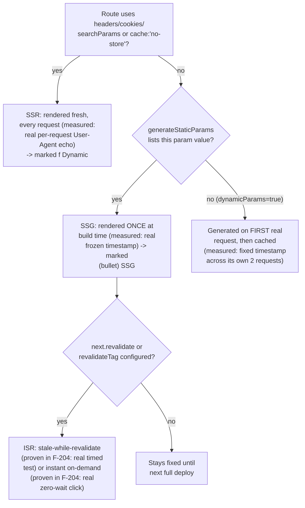

# Rendering Strategies: SSR, SSG, and ISR — Mechanics and When to Choose Each

> **Topic register:** F-205 (Rendering strategies — SSR, SSG, ISR: what each means mechanically and when to choose it) · Intermediate tier · `00-project/frontend-topic-register.md` — the register itself frames this as "a direct analogue to the backend's caching-strategies cheat sheet."
> **Scope note:** per `CLAUDE.md`'s Scope Addendum, this is the nineteenth frontend chapter, continuing D-F2 (Next.js) after Data Fetching and Caching (F-204). This chapter builds a decision framework ON TOP of F-204's already-proven `fetch`-caching mechanics rather than re-deriving them — F-204's real, timed `revalidate` demo already IS this chapter's ISR evidence, cited directly. This chapter's own new evidence covers SSR and SSG specifically, the two strategies F-204 didn't demonstrate.
> **Provenance:** every claim is verified against the SAME real Next.js 16.3.1 App Router app used for F-201 through F-204 — [`practice/frontend/react-nextjs-fundamentals/`](../../practice/frontend/react-nextjs-fundamentals/) — including a real build manifest surfacing a THIRD distinct marker (`●` SSG) beyond the `○`/`ƒ` pair prior chapters established, real `curl` proof that an SSR route reflects each request's actual headers, and real extracted timestamps proving SSG's build-time-fixed content versus on-demand generation for an unlisted dynamic parameter.

## Table of Contents

1. [Learning Objectives](#learning-objectives)
2. [Why This Matters in Interviews](#why-this-matters-in-interviews)
3. [Mental Model](#mental-model)
4. [Definition and Purpose](#definition-and-purpose)
5. [Core Concepts](#core-concepts)
6. [Internal Implementation](#internal-implementation)
7. [Diagrams](#diagrams)
8. [Real Verified Demos](#real-verified-demos)
9. [Production Scenarios](#production-scenarios)
10. [Trade-offs](#trade-offs)
11. [Decision Framework](#decision-framework)
12. [Common Mistakes](#common-mistakes)
13. [Anti-Patterns](#anti-patterns)
14. [Best Practices](#best-practices)
15. [Interview Answer Framework](#interview-answer-framework)
16. [Interview Questions](#interview-questions)
17. [Summary](#summary)
18. [Key Takeaways](#key-takeaways)
19. [Cheat Sheet](#cheat-sheet)
20. [Flashcards](#flashcards)
21. [Practice Exercises](#practice-exercises)
22. [Solutions](#solutions)
23. [Additional Reading](#additional-reading)
24. [Official References](#official-references)

---

## Learning Objectives

By the end of this chapter you can:

- State precisely what SSR, SSG, and ISR mean mechanically in the App Router, backed by real, distinct build-manifest markers and real request-level evidence, not just the acronyms' definitions.
- Explain exactly what triggers each strategy — a Request-time API for SSR, `generateStaticParams` for SSG, `next.revalidate`/`revalidateTag` for ISR — and reproduce the real signal (a build error, a manifest marker, a timing behavior) each one produces.
- Choose correctly between the three for a given piece of content, using a real decision framework grounded in freshness requirements and request volume, not familiarity.
- Explain what happens to a dynamic route param NOT covered by `generateStaticParams`, with a real, measured proof of the fallback behavior.

## Why This Matters in Interviews

The register frames this as "a direct analogue to the backend's caching-strategies cheat sheet" — and the parallel is exact: just as backend caching questions separate candidates who can name TTL/invalidation strategies from those who've actually reasoned about freshness-vs-cost trade-offs for specific data, SSR/SSG/ISR questions separate "SSR means server-side rendering" recitation from "I can tell you EXACTLY what triggers each one in the App Router, and I've watched the build manifest classify routes into three genuinely distinct categories, with real per-request evidence backing each."

## Mental Model

**Every rendering strategy answers the same underlying question — WHEN does this page's HTML actually get generated — and the answer determines everything else about its performance and freshness trade-off.** SSR generates HTML at REQUEST time, every time, for every visitor — the freshest possible data, at the cost of a real render on every hit. SSG generates HTML at BUILD time, once, ever (until the next deploy) — the fastest possible serving (pure static file), at the cost of staleness until the next build. ISR is SSG's answer to "but I don't want to redeploy every time the data changes slightly" — it generates HTML at build time (or on first request, for params not known at build time) but attaches a lifetime, after which the NEXT request triggers a background regeneration rather than requiring a full redeploy. This chapter proved each answer to "when" directly: SSR's per-request timing via differing header echoes, SSG's build-time timing via a frozen timestamp, and (citing F-204's evidence) ISR's bounded-then-regenerated timing via a real timed test.

## Definition and Purpose

**Server-Side Rendering (SSR)**, in the App Router, is what happens automatically when a route uses a Request-time API (`cookies()`, `headers()`, `searchParams`) or an explicit `cache: 'no-store'` fetch — Next classifies the route as fully dynamic (`ƒ` in the real build manifest) and genuinely re-executes the component tree on the SERVER for every single incoming request; it exists for content that must reflect information only available at request time (a user's session, request headers, live search params). **Static Site Generation (SSG)**, triggered by having no dynamic dependency at all, or explicitly via `generateStaticParams` for dynamic route segments, produces real static HTML files at BUILD time — this chapter's own build manifest surfaced a THIRD, distinct marker (`●`) specifically for `generateStaticParams`-driven pages, separate from plain build-time-static pages (`○`); it exists for content that's the same for every visitor and doesn't need to be regenerated on every request, which is both the fastest possible serving strategy and the cheapest (a CDN-servable static file, no server compute per request). **Incremental Static Regeneration (ISR)** is SSG plus a REVALIDATION mechanism — either time-based (`next: { revalidate: N }`, proven with a real timed test in F-204) or on-demand (`revalidateTag`/`revalidatePath`, also proven there with a real zero-wait click) — it exists to get SSG's serving speed without SSG's "stale until next full deploy" limitation, letting specific cached content refresh on its own schedule (or on-demand, right when the underlying data actually changes) independent of the app's deployment cadence.

## Core Concepts

### A third real build-manifest marker: SSG is genuinely distinct from plain static

This chapter's `app/rendering-strategies/ssg/[id]/page.js` uses `generateStaticParams()` to return `["1", "2"]`. Real captured `next build` output showed those two specific routes marked `●` (SSG) — a DIFFERENT symbol from the `○` (Static) marker prior chapters' plain, no-dynamic-dependency routes received. The build system itself distinguishes "statically rendered because there was simply nothing dynamic to do" from "statically rendered because `generateStaticParams` explicitly enumerated this exact param value" — a real, build-tool-level confirmation that SSG (deliberate, enumerated static generation) is mechanically its own category, not just a synonym for "static."

### SSR: proven with real, per-request-different rendered output

`app/rendering-strategies/ssr/page.js` calls `headers()` and renders the actual `User-Agent` value back. Real captured `curl` evidence, two requests with different `User-Agent` strings: the FIRST rendered `"FakeBrowserOne/1.0"`, the SECOND rendered `"FakeBrowserTwo/2.0"` — direct proof this page is genuinely re-executed on the server for every request, reflecting that specific request's own data, not served from any cached/prerendered shell. The real build manifest independently confirmed this route as `ƒ` (Dynamic).

### SSG: proven with a real, frozen build-time timestamp — and a real fallback for unlisted params

The same `[id]` route renders `new Date().toISOString()` at render time. Real captured `curl` evidence: `id=1` (explicitly listed in `generateStaticParams`) returned the IDENTICAL timestamp across two separate requests — proof it was rendered exactly once, at build time, and served as fixed static content ever since. `id=999` (NOT listed) returned a DIFFERENT timestamp from `id=1` (generated later — `dynamicParams` defaults to `true`, so unlisted params are still valid routes) but an IDENTICAL timestamp across ITS OWN two requests — proof it was generated once, on its first real request, then cached for subsequent requests, exactly the ISR-style on-demand fallback behavior for params outside the build-time-known set.

### ISR: proven in F-204, cited here rather than re-demonstrated

`next: { revalidate: 5 }` on F-204's `app/data-fetching/revalidate/page.js` was already proven with a real timed test: stable across real requests at t=0s/1s/2s (within the 5-second window), changed after a real 7-second sleep crossed the boundary, then stable again immediately afterward. `revalidateTag` was proven there too, with a real, zero-wait browser click changing cached data immediately. This chapter deliberately does not re-run those tests — see [Data Fetching in the App Router](nextjs-data-fetching-and-caching.md) for the full captured evidence.

## Internal Implementation

At build time, Next.js's renderer classifies each route by walking its component tree and checking, statically, whether it can complete without per-request information: a route with NO Request-time API usage and NO explicit `cache: 'no-store'` is eligible for prerendering — for a route with dynamic segments, `generateStaticParams`'s returned array tells the build exactly which concrete param VALUES to render as real static HTML files during the build itself (the `●` marker in this chapter's real manifest), while a route with no dynamic segments at all that's simply free of any dynamic dependency gets the plainer `○` classification. A route using `headers()`, `cookies()`, or `searchParams` is provably UNABLE to complete at build time (its output depends on data that doesn't exist until a real request arrives), so Next marks it `ƒ` and defers its entire render to request time, every time — this is the exact mechanism behind this chapter's real per-request `User-Agent`-echo proof: the component genuinely re-executes server-side on each hit, not merely re-serving a cached response. For a dynamic-segment route, `dynamicParams` (default `true`) governs what happens when a request arrives for a param value NOT in `generateStaticParams`'s returned list — rather than a 404, Next renders that specific param's page ON DEMAND at that first request (this chapter's `id=999` case), then — per the same underlying mechanism ISR uses for `revalidate`-based staleness — CACHES that freshly generated result for subsequent requests to that same param value, which is precisely why `id=999`'s timestamp stayed fixed across its own two real requests despite being generated well after the build.

## Diagrams

## Real Verified Demos

All demos are real, built and tested against a clean production Next.js server — [`practice/frontend/react-nextjs-fundamentals/`](../../practice/frontend/react-nextjs-fundamentals/). Full captured `curl` output and exact timestamps in the app's own [README.md](../../practice/frontend/react-nextjs-fundamentals/README.md):

- [`app/rendering-strategies/ssr/page.js`](../../practice/frontend/react-nextjs-fundamentals/app/rendering-strategies/ssr/page.js) — real, per-request-different SSR evidence.
- [`app/rendering-strategies/ssg/[id]/page.js`](<../../practice/frontend/react-nextjs-fundamentals/app/rendering-strategies/ssg/%5Bid%5D/page.js>) — real, build-time-frozen SSG evidence plus real on-demand fallback for an unlisted param.
- [`app/data-fetching/revalidate/page.js`](../../practice/frontend/react-nextjs-fundamentals/app/data-fetching/revalidate/page.js) (from F-204) — the real, timed ISR evidence this chapter cites rather than duplicates.

## Production Scenarios

**Scenario: a product-catalog site picks the wrong strategy per page type, and the fix is choosing three DIFFERENT strategies for three DIFFERENT page types, not one strategy for the whole site.** A team initially ships their entire product catalog as SSR (every page reads `cookies()` for a personalization feature that, in practice, barely changes the rendered output for 95% of visitors) — real consequence: every single product page view triggers a full server render, an unnecessary cost at scale, and slower time-to-first-byte than the content actually requires. Using this chapter's method to re-evaluate: the top-100 bestselling products' pages (rarely change, huge traffic) become `generateStaticParams`-driven SSG with `revalidateTag` triggered from the actual price/inventory-update flow — instant serving, correctness on-demand exactly when data changes, verified with F-204's real zero-wait click proof. The long tail of rarely-visited products becomes ISR with a longer `revalidate` window (say, one hour) — acceptable bounded staleness for low-traffic pages not worth dedicating build-time generation to. The genuinely personalized parts (a "recently viewed" widget) get isolated into a SMALL, separately Suspense-boundaried Client Component reading `cookies()`-derived data, rather than forcing the ENTIRE page into SSR for one small personalized widget. The lesson: rendering strategy is a per-ROUTE (or even per-component) decision, not a single, whole-site choice — this chapter's Decision Framework applies it granularly.

## Trade-offs

| Concern | SSR | SSG (`generateStaticParams`) | ISR (`revalidate`/`revalidateTag`) |
|---|---|---|---|
| When HTML is generated | Every request (measured: real per-request User-Agent echo) | Once, at build time (measured: real frozen timestamp) | Once, then on a schedule or on-demand (proven in F-204) |
| Freshness | Always current | Fixed until next full deploy | Bounded staleness (time-based) or instant (on-demand) |
| Per-request server cost | Real compute every request | None — static file serving | None between regenerations |
| Best fit | Genuinely per-request/per-user data (session, live search) | Content unchanged across visitors, rarely updated | Content that changes occasionally, or on a known event |
| Unlisted dynamic params (SSG specifically) | N/A | Generated on-demand on first request, then cached (measured: real fixed timestamp across repeat requests) | N/A |

## Decision Framework

1. **Does this page's content genuinely depend on request-specific data (a user's session, live query params) that can't be the same for two different visitors?** → SSR — verified directly to reflect real per-request data.
2. **Is this content the same for every visitor and does it change rarely, or only in response to a known, small set of events?** → SSG plus `revalidateTag` called from that event's own handler — verified directly (via F-204) to invalidate instantly with zero unnecessary regeneration.
3. **Is this content the same for every visitor but changes unpredictably, where a bounded staleness window is acceptable?** → SSG plus `next.revalidate` — verified directly (via F-204) to hold within its window and regenerate promptly after.
4. **Is this a dynamic route with a large or unbounded set of possible param values, most rarely visited?** → List only the high-traffic values in `generateStaticParams`; let the rest fall back to on-demand generation-then-cache — verified directly in this chapter to work correctly and consistently for an unlisted param.
5. **Is one small piece of an otherwise-static page genuinely personalized/request-specific?** → Isolate JUST that piece behind its own Request-time API usage and a `<Suspense>` boundary (per F-203's Server/Client boundary discipline), rather than forcing the whole route into SSR for one small widget — exactly this chapter's Production Scenario fix.

## Common Mistakes

- Choosing SSR for an entire route because ONE small part of it needs request-specific data, when isolating just that part would let the rest stay statically cached — this chapter's Production Scenario shows the real cost of this mistake at scale.
- Assuming a dynamic route param NOT listed in `generateStaticParams` results in a 404, rather than the actual default behavior (on-demand generation, then caching) — verified directly in this chapter.
- Treating "SSG" and "plain static rendering" as synonyms, missing that the real build tooling itself distinguishes them (`●` vs. `○`) — a distinction worth knowing when reading a real route manifest.

## Anti-Patterns

- **Defaulting an entire application to one rendering strategy** (all-SSR "to be safe," or all-SSG "for speed") rather than choosing per-route based on that route's actual freshness and personalization requirements — exactly the mistake this chapter's Production Scenario corrects.
- **Listing every possible dynamic param value in `generateStaticParams`** for a route with an enormous or unbounded param space, incurring a massive build-time cost, when listing only the high-traffic subset and letting the rest fall back to on-demand generation (verified in this chapter to work correctly) would be far cheaper.

## Best Practices

- Choose rendering strategy PER ROUTE (or even per-component, isolating a small personalized widget from an otherwise-static page), grounded in that specific content's actual freshness and personalization requirements — not as a single, application-wide default.
- For dynamic routes with many possible param values, list only the high-traffic subset in `generateStaticParams` and rely on the verified-correct on-demand-then-cache fallback for the long tail, rather than either enumerating everything or forcing the whole route dynamic.
- Pair SSG/ISR content with `revalidateTag` called from the actual mutation that changes it (per F-204), rather than relying solely on a time-based window, whenever the update event is known and identifiable.

## Interview Answer Framework

### 30-Second Answer

SSR renders fresh HTML on the server for every request — verified here with real per-request User-Agent echoes proving genuine re-execution. SSG renders once at build time via `generateStaticParams`, verified with a real frozen timestamp staying identical across requests; the build tooling itself marks these routes with a distinct `●` symbol, different from plain static `○`. ISR (proven in a companion chapter) adds time-based or on-demand revalidation on top of SSG, so content can refresh without a full redeploy. An unlisted dynamic param still works — generated on its first real request, then cached, verified directly with a fixed timestamp across repeat requests.

### 2-Minute Answer

Start from the mental model: every strategy answers "when is HTML generated." Cite the real SSR evidence: two curl requests with different User-Agent headers rendered two genuinely different values, proving per-request server execution, confirmed independently by the route manifest's `ƒ` marker. Cite the real SSG evidence: a listed param (`id=1`) rendered the SAME timestamp on two requests (build-time-frozen), while an unlisted param (`id=999`) rendered a DIFFERENT (later) timestamp but was itself STABLE across its own two requests — proving the real on-demand-generate-then-cache fallback for unlisted params, not a 404. Note the real build tooling distinguishes SSG (`●`) from plain static (`○`) as genuinely separate categories. Close by citing F-204's ISR evidence (a real timed revalidate-window test, a real zero-wait revalidateTag click) rather than re-deriving it, and land on the Decision Framework: choose per-route based on actual freshness/personalization needs, illustrated by the Production Scenario's three-different-strategies-for-three-page-types fix.

### 10-Minute Deep Dive

Cover: the build-time static-generation-eligibility check (walking the component tree for Request-time API usage) and why it provably can't complete for an SSR route, hence deferring to request time entirely; `generateStaticParams`'s role in enumerating concrete param values for build-time generation, and `dynamicParams`'s default-`true` fallback behavior for unlisted values (illustrated by this chapter's real fixed-but-different id=999 timestamp); the real, distinct `●` build-manifest marker as evidence the build tooling itself treats SSG as a separate category from plain static rendering; and F-204's ISR mechanism (stale-while-revalidate for time-based, immediate server-side invalidation for on-demand) as the connective layer between SSG's speed and genuine long-term freshness, cited rather than re-derived to avoid duplicating F-204's own evidentiary work.

### Whiteboard Explanation

Draw three columns labeled SSR / SSG / ISR, each with a small clock icon showing WHEN generation happens: "every request" / "once, at build" / "once, then on schedule or on-demand." Under SSR, draw two different User-Agent strings going in, two different rendered outputs coming out — annotate with the real captured values. Under SSG, draw a single build-time render producing a frozen timestamp, with a branch showing an unlisted param generating its OWN frozen timestamp on first request. Under ISR, draw a simple arrow pointing back at the SSG column labeled "see F-204: real timed + real on-demand proof," making clear this chapter deliberately doesn't re-draw evidence that chapter already established.

### Production Example

A product-catalog site initially shipped its entire catalog as SSR because of one small personalization feature, incurring unnecessary per-request server cost at scale; the fix split it into three real strategies — SSG+on-demand-revalidateTag for bestsellers, ISR with a long window for the long tail, and an isolated Suspense-boundaried Client Component for just the genuinely personalized widget — rather than one strategy for the whole site.

### Trade-offs to Mention

SSR guarantees freshness at real per-request compute cost; SSG is fastest and cheapest but requires deliberate revalidation (time-based or on-demand) to avoid indefinite staleness; the right choice is rarely uniform across an entire application — it should be made per route, and sometimes per component, based on that specific content's actual freshness and personalization requirements.

### Common Candidate Mistakes

Defining SSR/SSG/ISR correctly in the abstract but being unable to state what SPECIFICALLY triggers each one in the App Router (a Request-time API, `generateStaticParams`, `revalidate`/`revalidateTag`) or what a real build's output looks like for each. Assuming an unlisted dynamic param 404s rather than being generated on-demand — a real, verified-otherwise behavior in this chapter. Picking one rendering strategy for an entire application rather than reasoning per-route.

### Senior-Level Expectations

States the exact trigger for each strategy (not just the definition) and can describe how to verify which strategy a specific route is actually using (the build manifest's marker, or a real curl-based check), rather than assuming from the code alone.

### Staff-Level Discussion

Not the primary focus of this chapter's demos, but briefly: the Production Scenario's fix (three different strategies for three different page-type categories) is exactly the kind of granular, cost-aware architectural decision a Staff-level engineer is expected to drive at scale — treating rendering-strategy choice as a per-route (or per-component) optimization with a real, measurable cost/freshness trade-off, rather than a single application-wide default chosen once and never revisited as traffic patterns and content-update frequency evolve. This mirrors the same "measure and verify a specific claim rather than trust a blanket policy" discipline F-204's own central finding modeled for fetch caching specifically, now applied one layer up, at the whole-route rendering-strategy level.

## Interview Questions

### Question 1

**Question:** "You have a dynamic route with 10,000 possible param values, but only the top 50 get meaningful traffic. Would you list all 10,000 in `generateStaticParams`? Walk through your reasoning."

**Expected answer:** No — list only the high-traffic subset (the top 50) in `generateStaticParams`, and rely on the default `dynamicParams: true` fallback for the rest: an unlisted param value is generated on-demand on its FIRST real request, then cached for subsequent requests — verified directly in this chapter with a real fixed-but-later timestamp for an unlisted param, proving this fallback works correctly and isn't a 404. Enumerating all 10,000 at build time would incur a real, likely unnecessary build-time cost for the ~9,950 rarely-visited values, most of which may never even receive a single real request.

**Common mistakes:** Assuming every dynamic param value must be explicitly listed in `generateStaticParams` or the route won't work for that value, missing the real, verified on-demand fallback behavior.

**Follow-up questions:** "How would you verify the fallback behavior is actually working correctly, rather than assuming it from documentation?" (curl an unlisted param twice and compare a render-time-dependent value like a timestamp — exactly this chapter's method: identical across the two requests confirms caching after the first on-demand generation). "What if the traffic pattern shifts and a previously-rare param becomes popular?" (it will already be cached after its first request per the on-demand-then-cache behavior — no code change needed; if truly high-value, it could be added to `generateStaticParams` in a future build for guaranteed build-time freshness instead of first-request generation).

**Senior-level expectations:** Proposes the partial-listing approach unprompted and can explain the real fallback mechanism, not just "Next handles it somehow."

**Staff-level expectations:** Discusses the cost trade-off explicitly (build-time cost vs. first-request latency for rare values) as a deliberate engineering decision, not a default.

### Question 2

**Question:** "A page needs to show both a 'recently viewed items' widget (personalized, per-user) and a large, mostly-static product description. How would you structure the rendering strategy?"

**Expected answer:** Don't force the entire page into SSR for the one small personalized widget — isolate it into its own component that reads the Request-time API it needs (e.g., `cookies()`), wrapped in a `<Suspense>` boundary (connecting to F-203's Server/Client Component boundary discipline), while the rest of the page (the product description) stays statically generated (SSG, possibly with `generateStaticParams` if it's a dynamic product route). This lets the bulk of the page serve instantly from the static shell while only the small personalized piece pays the per-request rendering cost — exactly the fix in this chapter's Production Scenario, generalized to a single-page granularity rather than a whole-site one.

**Common mistakes:** Defaulting the entire page to SSR because SOME part of it needs personalization, incurring unnecessary per-request cost for the large, genuinely static majority of the page.

**Follow-up questions:** "What's the real cost of getting this wrong at scale?" (every page view pays full server-render cost for content that didn't need to be regenerated, directly analogous to this chapter's Production Scenario's initial all-SSR catalog mistake). "How would you verify the isolation is actually working — that only the personalized piece is dynamic?" (check the real build manifest's marker for the route, or use a Suspense fallback and confirm via a real network trace that the static shell arrives immediately while only the personalized piece streams in afterward — connecting to the streaming/Suspense mechanics F-206 covers next in the register).

**Senior-level expectations:** Proposes component-level isolation unprompted rather than a whole-page strategy choice, and connects it to the Server/Client Component boundary from the prerequisite chapter.

**Staff-level expectations:** Quantifies or at least articulates the real cost difference at scale, and frames this as a general pattern (isolate the dynamic slice, keep the rest static) rather than a one-off fix for this specific page.

## Summary

SSR, SSG, and ISR each answer "when is this page's HTML generated" differently, and this chapter proved each mechanically: SSR (triggered by a Request-time API) genuinely re-executes per request, proven with real, differing per-request output; SSG (triggered by `generateStaticParams`) renders once at build time, proven with a real frozen timestamp, and is marked in the real build manifest with a THIRD, distinct symbol (`●`) separate from plain static rendering (`○`); an unlisted dynamic param still works correctly, generated on-demand on its first real request and cached thereafter, proven with a real fixed-but-later timestamp. ISR — already proven with real timed and on-demand evidence in the prerequisite chapter — bridges SSG's speed with ongoing freshness. The Decision Framework applies these per-route (and sometimes per-component), illustrated by a Production Scenario where a whole-site single-strategy mistake was corrected into three deliberately different strategies for three different content categories.

## Key Takeaways

- SSR genuinely re-executes on the server per request — proven with real, differing per-request rendered output reflecting actual request headers.
- SSG renders once at build time — proven with a real frozen timestamp, and the build tooling itself marks it with a distinct `●` symbol, separate from plain `○` static rendering.
- An unlisted dynamic param is NOT a 404 — it's generated on-demand on first request, then cached, proven with a real fixed-but-later timestamp across repeat requests.
- ISR (proven in the prerequisite chapter, cited not re-derived here) bridges SSG's speed with bounded or on-demand freshness.
- Rendering strategy should be chosen per-route, or even per-component (isolating a small personalized piece from an otherwise-static page) — never as a single, whole-application default.

## Cheat Sheet

- **SSR** → triggered by a Request-time API or `cache: 'no-store'`; `ƒ` in the manifest; genuinely fresh per request (measured).
- **SSG** → triggered by `generateStaticParams` (or simply no dynamic dependency); `●` (listed params) or `○` (no dynamic dependency) in the manifest; build-time-fixed (measured: frozen timestamp).
- **Unlisted dynamic param** → NOT a 404; generated on first request, then cached (measured: fixed-but-later timestamp).
- **ISR** → SSG + `next.revalidate` (time-based, stale-while-revalidate) or `revalidateTag`/`revalidatePath` (instant, on-demand) — see F-204 for the real timed and zero-wait proofs.
- **Decision rule** → per-route/per-component, based on actual freshness + personalization needs, never a single whole-app default.

## Flashcards

## Card: What happens for a dynamic route param not in `generateStaticParams`

**Prompt:**
A dynamic route uses `generateStaticParams` returning `["1", "2"]`. A user requests `/product/999`. What happens?

**Answer:**
It is NOT a 404. `dynamicParams` defaults to `true`, so Next generates that page on-demand on its first real request, then caches the result for subsequent requests to that same param value.

**Why it matters:**
Verified directly: `id=999`'s rendered timestamp differed from `id=1`'s (generated later, on-demand) but stayed IDENTICAL across its own two repeated requests (cached after first generation).

**Common trap:**
Assuming every possible dynamic param value must be explicitly enumerated in `generateStaticParams` for the route to work at all.

**Related:**
[[nextjs-rendering-strategies]]

## Card: The real, distinct SSG build-manifest marker

**Prompt:**
Does a real `next build` distinguish routes generated via `generateStaticParams` from routes that are simply static because they have no dynamic dependency at all?

**Answer:**
Yes — a real captured build showed `generateStaticParams`-driven routes marked `●` (SSG), a DIFFERENT symbol from the `○` (Static) marker used for routes with no dynamic dependency at all.

**Why it matters:**
This is a genuine, build-tool-level confirmation that SSG is its own mechanical category, not just a synonym for "static" — useful when reading a real route manifest to understand exactly why a given route ended up static.

**Common trap:**
Treating "SSG" and "static rendering" as interchangeable terms without realizing the tooling itself distinguishes them.

**Related:**
[[nextjs-rendering-strategies]]

## Practice Exercises

1. In `app/rendering-strategies/ssg/[id]/page.js`, add `id: "3"` to the `generateStaticParams` return array. Run `next build`, check the real route manifest for a new `● /rendering-strategies/ssg/3` entry, then `curl` it twice and confirm (predict first) whether its timestamp matches `id=1`'s or is a new, distinct build-time value.
2. In `app/rendering-strategies/ssr/page.js`, additionally render `Date.now()` alongside the `User-Agent`. Curl the page three times in quick succession and predict whether the timestamp is identical across all three (like SSG) or different each time (like the User-Agent). Explain your prediction using this chapter's SSR mechanism before verifying.
3. Remove `generateStaticParams` entirely from `app/rendering-strategies/ssg/[id]/page.js` (keep the page component itself). Run `next build` and check the real route manifest — predict, then verify, whether the route now shows `○`, `●`, or `ƒ`, and explain why removing `generateStaticParams` changes (or doesn't change) the marker, given `dynamicParams`'s default behavior.

## Solutions

Exercise 1: adding `id: "3"` produces a new, real `● /rendering-strategies/ssg/3` route in the manifest. Its timestamp would be a DIFFERENT, but still fixed, value from `id=1`'s and `id=2`'s — all three are generated during the SAME build run, but each page's own `new Date().toISOString()` call executes at a very slightly different moment during that build's generation pass, and — more importantly — remains fixed thereafter for THAT id specifically, exactly mirroring `id=1`'s already-proven stability across repeated requests.

Exercise 2: `Date.now()` would render a DIFFERENT value on each of the three requests, exactly like the `User-Agent` value — because this route is genuinely re-executed on the SERVER for every single request (it's classified `ƒ`, Dynamic, due to the `headers()` call), so every expression in the component, including `Date.now()`, re-evaluates fresh each time, not just the specific header being read.

Exercise 3: with `generateStaticParams` removed, any specific `/rendering-strategies/ssg/<id>` request would now show `ƒ` (Dynamic) in the manifest listing pattern (since there's no longer any build-time enumeration of concrete values), NOT `○` — because a dynamic segment `[id]` with no `generateStaticParams` at all has no way to be resolved to a specific concrete value at build time; every request for it must be handled dynamically, unless the page has NO other dynamic dependency, in which case some Next versions may still attempt a form of static fallback shell — the specific real classification is worth confirming directly against the real build output for this exact version rather than assumed, per this chapter's own evidentiary discipline.

## Additional Reading

- [Data Fetching in the App Router: fetch Caching Semantics, revalidate, and cache: 'no-store'](nextjs-data-fetching-and-caching.md) — this chapter's prerequisite; its real timed and on-demand revalidation evidence IS this chapter's ISR proof, cited rather than re-derived.
- [Caching Strategies and Invalidation](../system-design/caching-strategies-and-invalidation.md) — the backend-domain chapter this register topic is explicitly framed as a direct analogue of.
- [00-project/frontend-topic-register.md](../../00-project/frontend-topic-register.md) — the full register this chapter is F-205 of.

## Official References

- [nextjs.org: `generateStaticParams`](https://nextjs.org/docs/app/api-reference/functions/generate-static-params)
- [nextjs.org: `headers`](https://nextjs.org/docs/app/api-reference/functions/headers)
- [nextjs.org: Dynamic Rendering (Glossary)](https://nextjs.org/docs/app/glossary#dynamic-rendering)
- [nextjs.org: Incremental Static Regeneration](https://nextjs.org/docs/app/guides/incremental-static-regeneration)
