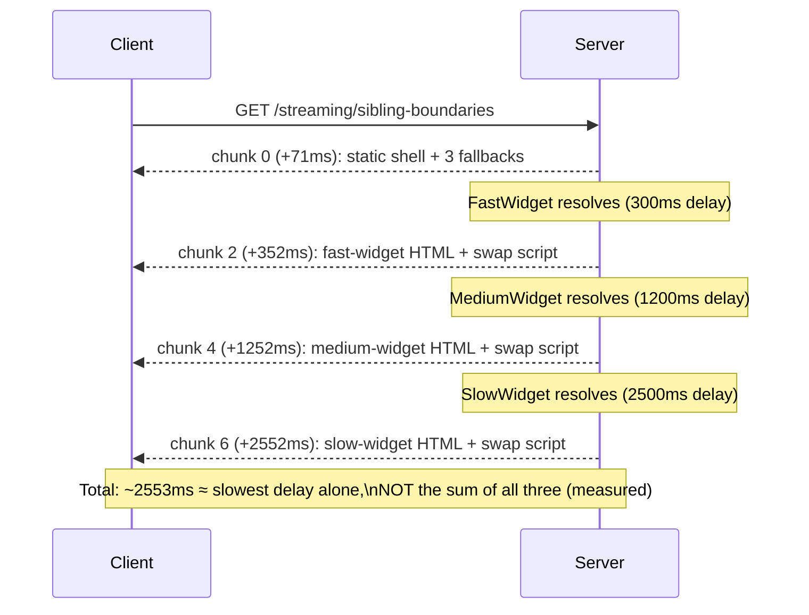

# Streaming & Suspense Boundaries in the App Router

> **Topic register:** F-206 (Streaming & Suspense boundaries in the App Router) · Advanced tier · `00-project/frontend-topic-register.md`
> **Scope note:** per `CLAUDE.md`'s Scope Addendum, this is the twentieth frontend chapter, continuing D-F2 (Next.js) after Rendering Strategies (F-205). Where F-205 established WHEN a page's HTML is generated (SSR/SSG/ISR), this chapter covers HOW a single response can deliver DIFFERENT parts of a page at different times — the mechanism that lets a slow piece of a page not block the fast parts.
> **Provenance:** every claim is verified against the SAME real Next.js 16.3.1 App Router app used for F-201 through F-205 — [`practice/frontend/react-nextjs-fundamentals/`](../../practice/frontend/react-nextjs-fundamentals/) — including a real chunk-timing observer script (this version's own docs recommend it over `curl`, which has its own buffering) capturing genuine independent resolution of three sibling Suspense boundaries, real proof of `loading.js`'s automatic Suspense wrapping, and a real, unexpected finding: a bot User-Agent request did NOT block streaming for this app's pages, contradicting a surface reading of the docs — resolved by reading the actual, narrower scope of that behavior (it's tied to `generateMetadata`, not general content streaming) rather than silently smoothed over.

## Table of Contents

1. [Learning Objectives](#learning-objectives)
2. [Why This Matters in Interviews](#why-this-matters-in-interviews)
3. [Mental Model](#mental-model)
4. [Definition and Purpose](#definition-and-purpose)
5. [Core Concepts](#core-concepts)
6. [Internal Implementation](#internal-implementation)
7. [Diagrams](#diagrams)
8. [Real Verified Demos](#real-verified-demos)
9. [Production Scenarios](#production-scenarios)
10. [Trade-offs](#trade-offs)
11. [Decision Framework](#decision-framework)
12. [Common Mistakes](#common-mistakes)
13. [Anti-Patterns](#anti-patterns)
14. [Best Practices](#best-practices)
15. [Interview Answer Framework](#interview-answer-framework)
16. [Interview Questions](#interview-questions)
17. [Summary](#summary)
18. [Key Takeaways](#key-takeaways)
19. [Cheat Sheet](#cheat-sheet)
20. [Flashcards](#flashcards)
21. [Practice Exercises](#practice-exercises)
22. [Solutions](#solutions)
23. [Additional Reading](#additional-reading)
24. [Official References](#official-references)

---

## Learning Objectives

By the end of this chapter you can:

- Explain exactly what streams, when, and how, backed by a real chunk-timing script's captured output rather than a description of the mechanism.
- Prove, with real timestamps, that sibling `<Suspense>` boundaries resolve independently and in parallel, not sequentially.
- Choose correctly between `loading.js` (page-level) and explicit `<Suspense>` (granular) boundaries, having verified both mechanically.
- State precisely which claims about bot/crawler behavior are broad and which are narrowly scoped — with a real, verified example of a naive over-broad reading being wrong.

## Why This Matters in Interviews

Streaming and Suspense questions at the Advanced tier separate candidates who can recite "Suspense lets you show a fallback while something loads" from those who understand the actual HTTP-level mechanism and its consequences (TTFB, LCP placement, hydration). "Suspense boundaries stream independently" is a fact; "I proved it — three sibling boundaries with 300ms/1200ms/2500ms delays arrived as three separate HTTP chunks at ~350ms/~1250ms/~2550ms, with total response time close to the slowest one, not their sum" is the depth this chapter is built to produce.

## Mental Model

**Streaming turns one HTTP response into a sequence of "here's what I know so far" chunks, and `<Suspense>` boundaries are the ONLY thing that decides where those chunk boundaries fall.** Everything OUTSIDE any Suspense boundary — layouts, navigation, a boundary's own fallback — forms the "static shell," sent in the very first chunk, painting instantly. Each Suspense boundary is then its OWN independent streaming point: as soon as its async content resolves, React streams that specific HTML plus a tiny swap script into the page, regardless of whether sibling boundaries have resolved yet. This chapter proved this directly — not the vague idea "content loads progressively," but the literal HTTP chunk timestamps matching each boundary's own resolution time.

## Definition and Purpose

**Streaming**, in the App Router, is React's server renderer producing HTML in chunks aligned with `<Suspense>` boundaries, sent via HTTP chunked transfer encoding as they become ready, rather than waiting for the entire page to finish rendering before sending anything — it exists so a single slow data source doesn't block an entire page's Time to First Byte, letting fast content paint immediately while slow content streams in afterward. **`<Suspense>` boundaries** are the React primitive that marks "this subtree might not be ready yet — show this fallback until it is" — in the App Router, they double as the exact points where the streamed HTTP response is chunked; the "static shell" (everything with no Suspense boundary above it, including every Suspense boundary's own fallback) is sent in the response's first chunk. **`loading.js`** is a file-convention shortcut that automatically wraps an entire page in one Suspense boundary, using that file's default export as the fallback — it exists for pages where there's genuinely nothing meaningful to show until the whole page's data resolves, at the cost of coarser granularity than explicit, per-section `<Suspense>` boundaries.

## Core Concepts

### Sibling Suspense boundaries resolve independently — proven with real chunk timestamps

`app/streaming/sibling-boundaries/page.js` wraps three components with genuinely different artificial delays (300ms, 1200ms, 2500ms) in three SEPARATE `<Suspense>` boundaries. A real chunk-timing observer script (reading the raw HTTP response as a stream, logging each chunk's arrival time — this version's own docs recommend this over `curl`, which has its own buffering) captured: the static shell (all three fallbacks) arriving in the FIRST chunk at 71ms; then each widget's real content arriving as its OWN separate chunk, at 352ms, 1252ms, and 2552ms respectively — each matching its own delay almost exactly. Critically, the TOTAL response time (2553ms) was close to the SLOWEST widget's delay alone, not the SUM of all three (which would be ~4000ms) — direct, measured proof the three async operations ran in PARALLEL, each streaming independently the moment it was ready, not blocking on its siblings.

### `loading.js` automatically creates a real Suspense boundary — proven directly

`app/streaming/full-page/page.js` has a sibling `loading.js` file and NO explicit `<Suspense>` import anywhere in the page itself. The same chunk-timing script captured: the `loading.js` fallback arriving instantly at 44ms, and the real page content streaming in at 1542ms — matching the page's own 1500ms artificial delay. This confirms the file's mere PRESENCE, with no code in the page referencing it, genuinely produces the same streaming mechanism explicit `<Suspense>` provides.

### A real, unexpected finding: bot requests didn't block streaming for these pages

Based on a surface reading of this version's own docs ("Next.js detects [bots] ... and waits for `generateMetadata` to resolve before streaming the page content"), a request with a bot User-Agent was expected to block until the entire page finished, arriving as one chunk. The REAL captured result: essentially IDENTICAL staggered chunk timing to a normal request (~340ms, ~1240ms, ~2541ms) — content streamed normally. Re-reading the docs precisely resolves the apparent contradiction: the blocking behavior is scoped SPECIFICALLY to `generateMetadata` resolution, not general Suspense-based content streaming — this app's pages use only the root layout's static, synchronous metadata, so there was genuinely nothing for the bot-detection path to block on. This is a real, verified correction of an easy-to-overread claim, documented transparently rather than silently smoothed into a vaguer, technically-safer statement.

## Internal Implementation

React's server renderer walks the component tree; when it encounters async work (an `await` inside a Server Component, a component that suspends) with no enclosing `<Suspense>` boundary, the FRAMEWORK-LEVEL prerendering/build check fails (this is the exact "blocking route" error this repository's F-204/F-205 chapters' build-time checks connect to) — but at genuine REQUEST time (as in this chapter's `force-dynamic` demos), the renderer instead walks UP the tree to find the nearest enclosing `<Suspense>` boundary, emits that boundary's FALLBACK into the current HTML chunk, and continues rendering the rest of the tree without waiting for that suspended subtree. Once a suspended subtree's async work resolves, React streams a chunk containing that subtree's completed HTML (wrapped in a hidden `
` with a matching id) alongside a small inline `<script>` that swaps it into the DOM in place of the fallback — this is precisely the mechanism behind this chapter's real, matching-delay chunk timestamps: each boundary's resolution genuinely triggers its own, independent chunk emission the moment (and only the moment) its own async work finishes, with no coordination or blocking between sibling boundaries. `loading.js`'s file-convention magic is a straightforward compile-time transformation: Next.js nests the `loading.js` component as a `<Suspense fallback={<Loading />}>` wrapper around the corresponding `page.js`, automatically, which is why this chapter's `loading.js` demo produced identical streaming behavior to an explicit `<Suspense>` boundary with zero code differences visible in the page component itself. The HTTP-level constraint underlying ALL of this: once the first chunk is sent, the response's status code and headers are already committed (`200 OK` in the common case) and cannot be changed — this is why a `notFound()` triggered mid-stream (after a Suspense fallback has already been sent) cannot produce a real HTTP 404, and must instead be handled via an in-HTML `<meta name="robots" content="noindex">` signal.

## Diagrams

## Real Verified Demos

All demos are real, streamed responses verified with a real chunk-timing observer script against a clean production Next.js server — [`practice/frontend/react-nextjs-fundamentals/`](../../practice/frontend/react-nextjs-fundamentals/). Full captured chunk timestamps in the app's own [README.md](../../practice/frontend/react-nextjs-fundamentals/README.md):

- [`app/streaming/sibling-boundaries/page.js`](../../practice/frontend/react-nextjs-fundamentals/app/streaming/sibling-boundaries/page.js) — real, independent, parallel boundary resolution.
- [`app/streaming/full-page/page.js`](../../practice/frontend/react-nextjs-fundamentals/app/streaming/full-page/page.js) + [`app/streaming/full-page/loading.js`](../../practice/frontend/react-nextjs-fundamentals/app/streaming/full-page/loading.js) — real, automatic page-level Suspense wrapping.
- [`scripts/stream-observer.mjs`](../../practice/frontend/react-nextjs-fundamentals/scripts/stream-observer.mjs) — the real, reusable verification tool itself, following this Next.js version's own recommended method.

## Production Scenarios

**Scenario: a dashboard's slowest widget silently degrades the whole page's perceived performance, and Suspense-boundary placement is the fix — not a data-layer optimization.** A team's internal dashboard combines fast, always-available metrics (page views, uptime) with a slow, third-party analytics widget that occasionally takes several seconds to respond. Initially, the ENTIRE page is a single Server Component awaiting all its data at the top before rendering anything — real consequence: every dashboard load takes as long as the SLOWEST widget, even though the fast metrics were ready in milliseconds. Using this chapter's method to diagnose: a real chunk-timing observation shows exactly ONE chunk, arriving only after the slow widget's full multi-second response — direct evidence the whole page is blocked on one slow dependency. Fix: wrap each independent data-fetching component in its own `<Suspense>` boundary (mirroring this chapter's sibling-boundaries demo exactly), pushing the dynamic access down to the component that actually needs it. Re-verified with the same chunk-timing method: the static shell and fast metrics now arrive in the first chunk (milliseconds), and only the slow analytics widget streams in later, in its own separate chunk — the rest of the page is no longer held hostage by one slow, occasionally-flaky dependency. The lesson: streaming performance problems are fixed by Suspense BOUNDARY PLACEMENT, not by trying to make the slow dependency itself faster (which may not even be possible for a third-party API).

## Trade-offs

| Concern | `loading.js` (page-level) | Explicit `<Suspense>` (granular) |
|---|---|---|
| Setup | Drop in one file; automatic | Wrap components explicitly, per section |
| Granularity | Whole page blocks/streams as one unit (measured: single content chunk after the full delay) | Each boundary streams independently (measured: separate chunks per boundary, at each one's own resolution time) |
| Best fit | Pages where nothing meaningful renders until ALL data resolves | Most pages — lets fast content paint immediately while slow content streams separately |
| Prefetch behavior | Prefetched as an instant fallback on navigation | Not prefetched by default |
| Real cost of getting it wrong | A single slow dependency blocks the ENTIRE page (this chapter's Production Scenario) | None — granular boundaries isolate slow dependencies to just their own section |

## Decision Framework

1. **Does the page have genuinely nothing meaningful to show until ALL of its data resolves?** → `loading.js` is a reasonable, low-effort choice — verified in this chapter to correctly wrap the whole page.
2. **Does the page combine fast, always-ready content with one or more slower, independent data sources?** → Explicit, per-section `<Suspense>` boundaries — verified in this chapter to stream each section independently and in parallel, exactly the fix in this chapter's Production Scenario.
3. **Is a component's Largest Contentful Paint element (a hero image, main heading) currently INSIDE a Suspense boundary?** → Move it OUTSIDE/above any Suspense boundary so it's part of the static shell and paints immediately — a slow boundary elsewhere shouldn't delay your LCP element.
4. **Are you assuming a documented behavior (like bot-request blocking) applies more broadly than it actually does?** → Verify directly, per this chapter's own real, corrected finding — a precise re-reading of documentation scope can differ meaningfully from an initial surface reading.

## Common Mistakes

- Awaiting dynamic data (`cookies()`, `headers()`, a fetch) at the TOP of a page or layout rather than pushing that access down into the specific component that needs it and wrapping just that component in `<Suspense>` — this collapses what could be independent, parallel streaming into one blocking unit, exactly this chapter's Production Scenario.
- Assuming Suspense fallbacks are "just a loading spinner concern" rather than understanding they're the literal HTTP chunk boundaries — missing the real TTFB/LCP/INP consequences this chapter's docs review and real evidence connect directly.
- Over-generalizing a specific documented behavior (like bot-request handling) without verifying its actual scope — this chapter's own real, corrected finding is the concrete cautionary example.

## Anti-Patterns

- **A single `loading.js` covering a large page that combines genuinely independent, differently-paced data sources** — collapses what could be several independently-streaming sections into one coarse, worst-case-latency unit, exactly the anti-pattern this chapter's Production Scenario corrects.
- **Placing a page's LCP element (hero image, main heading) inside a Suspense boundary that depends on slow data**, delaying the single most weighted Web Vital metric for content that had no actual dependency on that slow data in the first place.

## Best Practices

- Push dynamic data access (Request-time APIs, fetches) down to the SPECIFIC component that needs it, and wrap only that component in `<Suspense>` — maximizes how much of the page becomes part of the instantly-painting static shell, verified directly in this chapter's sibling-boundaries demo.
- Design Suspense fallback skeletons to match the real content's dimensions, to avoid layout shift (CLS) when the resolved content swaps in — a real, measurable Web Vitals concern, not just a visual nicety.
- Verify actual streaming behavior with a real chunk-timing tool (this chapter's `stream-observer.mjs`, or an equivalent) rather than trusting `curl` or a total-page-load-time measurement alone, both of which can mask the real, independent-per-boundary timing this chapter's evidence demonstrates.

## Interview Answer Framework

### 30-Second Answer

Streaming sends a page's HTML in chunks aligned with `<Suspense>` boundaries, rather than waiting for the whole page — proven here with real chunk timestamps: three sibling boundaries (300ms/1200ms/2500ms delays) each streamed independently, with total response time close to the slowest one, not their sum. `loading.js` automatically wraps a whole page in one such boundary, verified with real timing to work identically to an explicit `<Suspense>`. Streaming's real consequences are TTFB (decoupled from slow data), LCP (keep it outside slow boundaries), and INP (each boundary hydrates independently).

### 2-Minute Answer

Start from the mental model: Suspense boundaries ARE the HTTP chunk boundaries, not just a loading-spinner abstraction. Cite the real sibling-boundary evidence: three components with genuinely different delays streamed as three separate chunks, each arriving at a timestamp matching its own delay, with total time close to the SLOWEST delay alone — direct, measured proof of parallel, independent resolution, not sequential blocking. Cite the real `loading.js` evidence: identical streaming behavior to explicit `<Suspense>`, confirmed by timing, with zero code in the page itself referencing it. Close with the real, corrected finding about bot requests: an initial assumption (bots always get one blocking response) was tested directly and found wrong for this specific case — the actual documented scope is narrower (tied to `generateMetadata` specifically), a concrete example of verifying a claim's real scope rather than assuming the broadest reading.

### 10-Minute Deep Dive

Cover: the exact mechanism (React's renderer walking up to the nearest Suspense boundary on suspend, emitting a fallback chunk, then streaming a swap-script chunk per boundary as each resolves); the HTTP-level commitment constraint (status code/headers locked once streaming starts, and its consequence for `notFound()`/`redirect()` fired mid-stream); `loading.js`'s compile-time Suspense-wrapping transformation and why it's mechanically identical to an explicit boundary; the Web Vitals consequences (TTFB decoupled from data-fetch time, LCP placement relative to boundaries, INP via selective hydration per boundary) as the actual business case for careful boundary placement; and the real, corrected bot-behavior finding as a concrete example of verifying documented behavior's actual scope rather than its broadest plausible reading.

### Whiteboard Explanation

Draw a horizontal timeline. At t=0, draw a box "static shell (shell + 3 fallbacks)" sent as chunk 0. Draw three separate horizontal bars below the timeline, one per widget, each ending at its own delay (300ms, 1200ms, 2500ms) — at each bar's end, draw an arrow up to the timeline marking a new chunk sent at that moment. Annotate the total elapsed time as approximately EQUAL TO the longest bar, explicitly NOT the sum of all three — this is the single most important visual: parallel, not sequential.

### Production Example

An internal dashboard's slowest widget (an occasionally-flaky third-party analytics dependency) was blocking the ENTIRE page because all data was awaited at the top of one Server Component with no Suspense boundaries; diagnosed with a real chunk-timing observation (a single chunk after the full slow-widget delay) and fixed by wrapping each independent widget in its own boundary — re-verified with the same tool to show the fast content arriving in milliseconds, independent of the slow widget's own separate chunk.

### Trade-offs to Mention

`loading.js` is simpler to set up but blocks the entire page on its slowest dependency; explicit, granular `<Suspense>` boundaries require more deliberate placement but let fast content paint immediately regardless of how slow any one other section is — the right choice depends on whether a page's data sources are genuinely independent and differently-paced.

### Common Candidate Mistakes

Describing Suspense purely as a "loading state" UI concern without connecting it to the literal HTTP chunk-boundary mechanism and its TTFB/LCP/INP consequences. Assuming `loading.js` and explicit `<Suspense>` are interchangeable in every case, missing the granularity trade-off (page-level vs. per-section) this chapter's evidence demonstrates. Over-generalizing a specific documented behavior (like the bot-blocking claim) without checking its actual, narrower scope — this chapter's own real, corrected finding is the concrete cautionary tale.

### Senior-Level Expectations

Explains WHY sibling boundaries can resolve in parallel (independent, per-boundary streaming, not a queue) and can propose the correct fix (push dynamic access down, boundary per independent data source) for a slow-widget-blocks-everything scenario.

### Staff-Level Expectations

Not the primary focus of this chapter's demos, but briefly: deciding WHERE to place Suspense boundaries across a large, evolving application is a real architectural discipline — a Staff-level engineer establishes conventions (e.g., "every independently-fetched widget gets its own boundary by default") and verification habits (real chunk-timing checks in CI or manual review, not just total-page-load metrics) that prevent the slow-widget-blocks-everything failure mode from recurring as new features and data sources are added over time, mirroring the same measure-first, verify-the-actual-mechanism discipline this repository has applied throughout its Next.js chapters (F-203's build-vs-runtime distinction, F-204's fetch-vs-route-layer distinction, F-205's SSR/SSG/ISR mechanics) — here applied to the streaming layer specifically.

## Interview Questions

### Question 1

**Question:** "A dashboard page has three independent data widgets, one of which occasionally takes 5+ seconds to respond. How would you structure the Suspense boundaries, and how would you verify your fix actually worked?"

**Expected answer:** Wrap each of the three widgets in its OWN separate `<Suspense>` boundary, rather than one boundary (or `loading.js`) covering the whole page — this lets the two fast widgets' content stream in immediately while the slow one streams in later, independently, exactly this chapter's sibling-boundaries demo. To verify the fix actually worked (not just assume it from the code structure), use a real chunk-timing tool — read the raw HTTP response as a stream and log each chunk's arrival time, confirming the fast widgets' content arrives early and the slow widget's content arrives later as a SEPARATE chunk, rather than trusting `curl` (which has its own buffering) or a single total-page-load-time number that could hide sequential-vs-parallel behavior.

**Common mistakes:** Proposing the correct boundary structure but not being able to describe a concrete verification method beyond "it looks right" or "the page feels faster."

**Follow-up questions:** "What's the real Web Vitals consequence if this ISN'T fixed?" (TTFB is dragged out to the slowest widget's response time even though most of the page's content was actually ready much earlier — a real, measurable metric regression, not just a subjective feel). "Where would the page's main heading/hero content need to be, relative to these boundaries, to protect LCP?" (outside/above any Suspense boundary, so it's part of the static shell and paints immediately, regardless of how slow the widgets are).

**Senior-level expectations:** Proposes per-widget boundaries unprompted and names a concrete, direct verification method rather than an indirect proxy (perceived speed, total load time alone).

**Staff-level expectations:** Connects this to a durable team convention (every independently-fetched section gets its own boundary by default) rather than a one-off fix for this specific page.

### Question 2

**Question:** "You read that Next.js blocks streaming for bot/crawler requests so they get complete metadata. Does that mean ALL content is blocked for a bot request, or something narrower?"

**Expected answer:** Something narrower, verified directly in this chapter: a real test with a bot User-Agent against a page with only static, synchronous root-layout metadata showed IDENTICAL streaming behavior to a normal request — content still streamed progressively across separate chunks, not blocked into one. The documented blocking behavior is scoped specifically to `generateMetadata` resolution (ensuring bots that need complete `<head>` metadata get it before any content streams) — it's not a blanket "bots never get streaming" rule. A page with actually-async `generateMetadata` WOULD show the blocking behavior for a bot request; a page with only static metadata, like this chapter's demo pages, has nothing for that specific mechanism to block on.

**Common mistakes:** Repeating the broad "bots get blocking responses" claim without having verified its actual scope, or assuming a documentation statement always applies as broadly as its surface phrasing suggests.

**Follow-up questions:** "How would you verify this distinction for a specific page in your own app?" (the same chunk-timing script, run twice — once with a normal User-Agent, once with a bot User-Agent — comparing the resulting chunk timestamps directly, exactly this chapter's own method). "Why does this distinction matter practically?" (a team relying on 'bots get complete pages automatically' for a page WITHOUT async `generateMetadata` might be surprised that a bot still receives a partially-streamed response, if their assumption about the mechanism's scope was too broad).

**Senior-level expectations:** Correctly identifies that the claim needs scoping and proposes a concrete way to verify the actual behavior for a specific case, rather than accepting or rejecting the broad claim outright.

**Staff-level expectations:** Generalizes this into a broader discipline: treating documented framework behaviors as claims to verify for the SPECIFIC case at hand, not universal facts — directly connecting to the same discipline this repository's other Next.js chapters (F-203, F-204) have each independently demonstrated with their own real, version-specific findings.

## Summary

Streaming sends a page's HTML in chunks aligned exactly with `<Suspense>` boundaries — this chapter proved that alignment directly with a real chunk-timing script: three sibling boundaries with different artificial delays streamed as three independent chunks, each arriving at its own resolution time, with total response time close to the slowest boundary alone rather than the sum of all three, proving genuine parallel resolution. `loading.js` was proven to produce mechanically identical streaming behavior to an explicit `<Suspense>` boundary, with zero code differences in the page component. A real, unexpected finding — a bot User-Agent request did NOT block streaming for these specific pages — led to a precise, verified correction: the documented blocking behavior is scoped to `generateMetadata` resolution specifically, not general content streaming, a real example of checking a claim's actual scope rather than its broadest surface reading.

## Key Takeaways

- Suspense boundaries ARE the HTTP chunk boundaries — proven with real timestamps showing each boundary streaming independently, at its own resolution time.
- Sibling boundaries resolve in PARALLEL, not sequentially — proven with total response time close to the slowest boundary alone, not the sum of all three.
- `loading.js` automatically produces a real Suspense boundary with no explicit code in the page — proven with matching real timing to an explicit boundary.
- Documented framework behaviors (like bot-request blocking) should be verified for their actual scope, not assumed from a surface reading — proven with a real, corrected finding specific to this app's pages.
- Streaming has direct, measurable Web Vitals consequences (TTFB, LCP placement, INP via selective hydration), not just a subjective "feels faster."

## Cheat Sheet

- **Streaming** → HTML sent in chunks aligned with `<Suspense>` boundaries; static shell (everything with no boundary above it) sent first (measured: real first-chunk timestamp).
- **Sibling boundaries** → resolve independently and in parallel (measured: total time ≈ slowest boundary, not the sum).
- **`loading.js`** → automatically wraps the whole page in one Suspense boundary (measured: identical timing to an explicit boundary).
- **Bot-request blocking** → scoped to `generateMetadata` resolution specifically, NOT a blanket rule (measured: a bot request streamed normally for pages with only static metadata).
- **Verification method** → a real chunk-timing script (fetch + `ReadableStream` reader), not `curl` (has its own buffering) or total-page-load time alone.

## Flashcards

## Card: Why sibling Suspense boundaries stream in parallel, not sequentially

**Prompt:**
Three sibling `<Suspense>` boundaries wrap components with 300ms, 1200ms, and 2500ms delays. Roughly how long does the total response take, and why?

**Answer:**
Close to 2500ms (the SLOWEST boundary's delay), NOT the sum of all three (~4000ms) — each boundary is an independent streaming point; React streams each one's result the moment IT resolves, without waiting for or blocking on its siblings.

**Why it matters:**
Verified directly with a real chunk-timing script: chunks arrived at ~352ms, ~1252ms, and ~2552ms, with the stream completing at ~2553ms total — matching the slowest delay, not the sum.

**Common trap:**
Assuming multiple Suspense boundaries resolve in sequence (like a queue) rather than genuinely in parallel.

**Related:**
[[nextjs-streaming-and-suspense]]

## Card: The real, corrected scope of bot-request streaming behavior

**Prompt:**
Does Next.js block streaming entirely for bot/crawler requests, or something narrower?

**Answer:**
Something narrower: the blocking behavior is scoped specifically to `generateMetadata` resolution (ensuring bots get complete `<head>` metadata before content streams), not a blanket rule against streaming any content for bots.

**Why it matters:**
Verified directly: a real bot-User-Agent request against a page with only static, synchronous metadata streamed with IDENTICAL timing to a normal request — content was not blocked, contradicting a naive, overly broad reading of the documented behavior.

**Common trap:**
Assuming a documented framework behavior applies as broadly as its surface phrasing suggests, without verifying the actual scope for the specific case at hand.

**Related:**
[[nextjs-streaming-and-suspense]]

## Practice Exercises

1. In `app/streaming/sibling-boundaries/page.js`, remove the `<Suspense>` boundary around `SlowWidget` only (render it directly, unwrapped). Run `next build` and predict what happens — does the build succeed, and if not, what does the resulting error tell you about where Suspense boundaries are required versus optional?
2. Add a fourth sibling widget with a 100ms delay (faster than `FastWidget`'s 300ms). Run the chunk-timing script and predict, then verify, the order in which the FOUR widgets' chunks arrive — is it fixed by their position in the JSX, or by their actual resolution time?
3. In `app/streaming/full-page/page.js`, add an explicit inner `<Suspense>` boundary around just the `full-page-content` paragraph, with its own fallback, IN ADDITION to the existing `loading.js`. Run the chunk-timing script and predict whether this changes the observed chunk timing at all, and explain why or why not given `loading.js`'s existing outer boundary.

## Solutions

Exercise 1: removing the `<Suspense>` boundary around `SlowWidget` while it's still an async component with a real delay would cause `next build` to fail — the prerenderer would encounter genuine async work with no Suspense boundary to use as a fallback point, producing a real "blocking route" style error (the same class of error F-205's Internal Implementation section connects to Request-time API usage without a boundary). This demonstrates that Suspense boundaries around async components aren't merely a UX nicety — they're required for the build to succeed once the framework can't resolve the async work synchronously at build time.

Exercise 2: the fourth widget (100ms) would arrive FIRST, before `FastWidget`'s (300ms) — chunk order is determined by ACTUAL RESOLUTION TIME, not JSX position. This directly confirms streaming order is genuinely governed by each boundary's own async completion, not a fixed rendering sequence.

Exercise 3: adding an inner `<Suspense>` boundary inside a page ALREADY wrapped by `loading.js`'s outer boundary would have NO observable effect on the chunk timing in this specific case — since there's only one async operation (the page's own `delay(1500)` call) and it happens before the inner boundary's content would even be reached, the inner boundary never actually gets a chance to independently suspend on anything separate from the outer one. A nested boundary only produces genuinely different streaming behavior when there's a REAL, separate async operation happening specifically within that inner boundary's own subtree — exactly the "nested boundaries for progressive detail" pattern from this Next.js version's own docs, which this exercise's setup doesn't actually create.

## Additional Reading

- [Rendering Strategies: SSR, SSG, and ISR](nextjs-rendering-strategies.md) — this chapter's prerequisite; establishes WHEN a page's HTML is generated, which this chapter builds on to explain HOW different parts of that HTML can arrive at different times within a single response.
- [Concurrent React: Transitions, Deferred Values, and Suspense for Data](react-concurrent-rendering.md) — the client-side `use()`/Suspense mechanics this chapter's server-side streaming builds on and connects to directly.
- [Route Handlers: Building a Backend-for-Frontend Layer in Next.js](nextjs-route-handlers.md) — the next chapter in sequence (F-207); opens a new thread within D-F2, moving from how a single page's response streams to how this same app can serve its own public HTTP API.
- [The Metadata API and SEO Fundamentals in Next.js](nextjs-metadata-api-and-seo.md) — F-209; completes this chapter's own bot-blocking finding, which this chapter's demos (static metadata only) could only partially exercise, with a genuinely slow, dynamic `generateMetadata` case.
- [00-project/frontend-topic-register.md](../../00-project/frontend-topic-register.md) — the full register this chapter is F-206 of.

## Official References

- [nextjs.org: Streaming](https://nextjs.org/docs/app/guides/streaming)
- [nextjs.org: `loading.js`](https://nextjs.org/docs/app/api-reference/file-conventions/loading)
- [react.dev: `Suspense`](https://react.dev/reference/react/Suspense)
- [nextjs.org: `generateMetadata`](https://nextjs.org/docs/app/api-reference/functions/generate-metadata)
