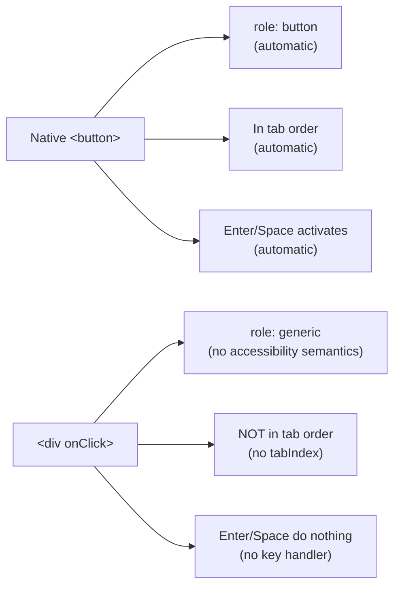

# React Accessibility: Semantic HTML, ARIA, Keyboard Navigation, and Focus Management

> **Topic register:** F-116 (Accessibility — semantic HTML, ARIA, keyboard navigation, focus management) · Intermediate tier, frequently interview-relevant for Staff-level frontend · `00-project/frontend-topic-register.md`
> **Scope note:** per `CLAUDE.md`'s Scope Addendum, this is the tenth frontend chapter, continuing the register in sequence after Error Boundaries (F-115).
> **Provenance:** every claim is verified against a real, running React 19.2.8 + Vite 8.2.1 app at [`practice/frontend/react-accessibility/`](../../practice/frontend/react-accessibility/), including a real accessibility-tree role check, real keyboard-only navigation via `document.activeElement`, and real, resolved `aria-describedby` id association.

## Table of Contents

1. [Learning Objectives](#learning-objectives)
2. [Why This Matters in Interviews](#why-this-matters-in-interviews)
3. [Mental Model](#mental-model)
4. [Definition and Purpose](#definition-and-purpose)
5. [Core Concepts](#core-concepts)
6. [Internal Implementation](#internal-implementation)
7. [Diagrams](#diagrams)
8. [Real Verified Demos](#real-verified-demos)
9. [Production Scenarios](#production-scenarios)
10. [Trade-offs](#trade-offs)
11. [Decision Framework](#decision-framework)
12. [Common Mistakes](#common-mistakes)
13. [Anti-Patterns](#anti-patterns)
14. [Best Practices](#best-practices)
15. [Interview Answer Framework](#interview-answer-framework)
16. [Interview Questions](#interview-questions)
17. [Summary](#summary)
18. [Key Takeaways](#key-takeaways)
19. [Cheat Sheet](#cheat-sheet)
20. [Flashcards](#flashcards)
21. [Practice Exercises](#practice-exercises)
22. [Solutions](#solutions)
23. [Additional Reading](#additional-reading)
24. [Official References](#official-references)

---

## Learning Objectives

By the end of this chapter you can:

- Explain, and prove with a real keyboard-navigation test, why semantic HTML elements are keyboard-accessible by default while a `div`-based imitation is not, even with identical click behavior.
- Implement a real focus trap and focus-return pattern for a modal dialog, and verify each behavior independently rather than assuming a library "handles accessibility."
- Wire `aria-invalid` and `aria-describedby` correctly for form validation, and verify the association actually resolves to real content, not just visual proximity.
- Recognize accessibility as a set of independently verifiable technical claims (role exposure, focus order, ARIA attribute resolution) rather than a vague, unverifiable "it should be accessible" goal.

## Why This Matters in Interviews

Accessibility is simultaneously one of the most frequently SKIPPED topics in frontend interview prep and one of the most reliable differentiators at Staff level — a candidate who can only say "use semantic HTML and add ARIA labels" reads identically to one who's never actually built an accessible component, while a candidate who can walk through this chapter's real keyboard-navigation and focus-management evidence demonstrates they've actually verified accessibility claims rather than assumed them, which is exactly the kind of rigor Staff-level frontend interviews are designed to surface.

## Mental Model

**Accessibility is not a single property you either have or don't — it's a set of independently verifiable technical facts: does this element expose the right ROLE to assistive technology, is it reachable via KEYBOARD alone, does FOCUS move and return in a way a non-visual user can track, and are error/state ASSOCIATIONS (like a form error linked to its field) real, resolvable relationships rather than just visual proximity.** Every demo in this chapter picks one of these facts and proves it directly (an accessibility-tree role, a `document.activeElement` check, a resolved `aria-describedby` id) rather than asserting "this is accessible" as an unverifiable claim — the same evidence-based discipline this repository applies to every other technical claim.

## Definition and Purpose

**Semantic HTML** means using elements for their intended purpose (`<button>` for actions, `<nav>` for navigation, `<label>` for form labels) rather than generic `
`/`` elements styled to look the same — it exists because browsers and assistive technology derive an element's ROLE, keyboard behavior, and default announcements from its actual tag, for free, with zero extra code. **ARIA** (Accessible Rich Internet Applications) is a set of HTML attributes (`role`, `aria-*`) that supplement or override the accessibility information an element exposes — it exists for the cases semantic HTML alone can't cover: custom widgets with no native HTML equivalent, or associating supplementary information (like an error message) with a control. **Keyboard navigation** refers to a page's usability using only Tab, Shift+Tab, Enter, Space, and arrow keys, with no mouse — it exists because a meaningful population of users (motor-impaired users, screen-reader users, and simply power users) never uses a mouse at all. **Focus management** is the deliberate control of where keyboard focus goes as the UI changes (e.g., when a modal opens, closes, or content is dynamically inserted) — it exists because, unlike a sighted mouse user who can visually reorient instantly, a keyboard/screen-reader user's only sense of "where am I" IS the current focus position, so mismanaging it causes genuine disorientation, not just inconvenience.

## Core Concepts

### Semantic HTML: keyboard accessibility is a default, not a feature you add

`SemanticVsDivButtonDemo.jsx` places a real `<button>` next to a `
` styled identically, both wired to the same kind of click handler. Real captured evidence: the accessibility tree exposes the real button with `role: "button"`; the div is exposed only as `role: "generic"` — not even recognized as interactive. A real keyboard test confirms the consequence directly: clicking the real button (establishing keyboard focus there), then pressing Tab, moved focus straight to the NEXT element on the page (`"Open Modal"`), completely skipping the div — it never received focus at all. Yet clicking the div directly with a mouse still worked (`clicks: 1`), proving the bug is invisible to any purely visual or mouse-driven QA pass. This is the direct, measured cost of choosing a styled `div` over a real `<button>`: identical appearance, identical mouse behavior, silently broken keyboard/screen-reader access.

### Focus management: enter, trap, and return — three separately verified behaviors

`FocusTrapModalDemo.jsx` implements a real, minimal focus trap for a modal dialog. Real captured sequence, each step verified via `document.activeElement`: opening the modal moved focus to the FIRST focusable element inside it (the input) automatically; pressing Tab from the LAST focusable element (the Close button) wrapped focus back to the FIRST (the input) instead of escaping to the page behind the modal — the trap held; pressing Escape closed the modal AND returned focus to the exact element that opened it (the trigger button), rather than letting focus silently fall back to `<body>`. All three are genuinely separate mechanisms (auto-focus on open, Tab-boundary interception, explicit focus restoration on close) that happen to be commonly bundled together under the single phrase "focus management" — this chapter verifies each independently rather than treating "the modal works" as one unverifiable claim.

### ARIA form-error association: a real, resolvable relationship, not visual proximity

`AccessibleFormErrorDemo.jsx` toggles `aria-invalid` based on real validity and sets `aria-describedby` to the error message's real `id` only when invalid. Real captured evidence after typing an invalid value and blurring the field: `aria-invalid="true"`, `aria-describedby="username-error"`, and — critically — resolving that id via `document.getElementById` returned the actual error text (`"Username must be at least 3 characters"`). This is the exact mechanism a screen reader uses to announce the error alongside the field on focus; a visually-adjacent `
` with no `aria-describedby` link would look identical to a sighted user but announce nothing extra to a screen-reader user — the association has to be a real, resolvable relationship, not just layout proximity.

## Internal Implementation

Browsers build an internal **accessibility tree** — a parallel structure to the DOM, computed largely from each element's tag, attributes, and ARIA properties — which is what screen readers and other assistive technology actually consume, not the visual rendering. A native `<button>` is mapped to `role: button` in this tree automatically, along with default keyboard behavior (focusable via Tab because it's in the browser's default focus order, activatable via Enter/Space because the browser wires that up natively) — none of this is React-specific; it's browser/HTML platform behavior React inherits for free when you render real semantic elements. A `
` has no such defaults: no default role beyond `generic`, no default tab-order inclusion (`tabIndex` is unset, meaning "not in the tab order" for non-interactive elements), and no built-in Enter/Space activation — replicating a button's accessibility from a `div` requires manually adding `role="button"`, `tabIndex={0}`, and `onKeyDown` handlers for both Enter and Space, real extra work with real ways to get subtly wrong, which is precisely why using the native element is the default recommendation rather than a stylistic preference. Focus trapping works by intercepting the `Tab`/`Shift+Tab` `keydown` event specifically AT the first and last focusable elements inside the trap and calling `preventDefault()` plus manually moving focus, since the browser's native Tab-order traversal has no built-in concept of "stay within this subtree" — it's implemented in application code, not a platform feature.

## Diagrams

## Real Verified Demos

All three demos are real, running React 19/Vite code — [`practice/frontend/react-accessibility/`](../../practice/frontend/react-accessibility/), verified live via a real accessibility-tree inspection, real keyboard-only navigation, and a real resolved ARIA id association. Full captured sequences in the app's own [README.md](../../practice/frontend/react-accessibility/README.md):

- [`SemanticVsDivButtonDemo.jsx`](../../practice/frontend/react-accessibility/src/demos/SemanticVsDivButtonDemo.jsx) — real accessibility-tree role contrast and real keyboard-skip proof.
- [`FocusTrapModalDemo.jsx`](../../practice/frontend/react-accessibility/src/demos/FocusTrapModalDemo.jsx) — real, independently-verified enter/trap/return focus behaviors.
- [`AccessibleFormErrorDemo.jsx`](../../practice/frontend/react-accessibility/src/demos/AccessibleFormErrorDemo.jsx) — real, resolved `aria-describedby` association.

## Production Scenarios

**Scenario: a "keyboard trap" bug reported by a single user turns out to affect an entire user segment.** A support ticket reports that a user "gets stuck" on a settings page and can't reach the Save button. Initial hypothesis: a rare browser bug, low priority (wrong — every keyboard-only and screen-reader user hits this identically). Evidence: reproducing with a real keyboard-only test (exactly this chapter's `document.activeElement` verification method) shows a custom dropdown widget, built from `div`s with `onClick` handlers and no `tabIndex`/keyboard support, is entirely unreachable via Tab — worse, a DIFFERENT custom widget nearby has a broken, hand-rolled focus trap that never releases focus once entered, genuinely stranding keyboard users inside it. Diagnosis, directly traceable to this chapter: the dropdown needs the semantic-HTML-first fix (a real `<button>`/`<select>` base, or full ARIA+keyboard-handler parity if a fully custom widget is unavoidable); the broken trap needs the same three-behaviors-independently-verified discipline this chapter's modal demo demonstrates (confirm enter, trap boundaries, AND an actual escape/release path all separately). Trade-off made explicit to the team: retrofitting accessibility onto already-shipped custom widgets is real, non-trivial work — the cheaper long-term fix is defaulting to native elements and well-tested patterns (like this chapter's modal) from the start, rather than treating accessibility as a later audit-and-patch phase.

## Trade-offs

| Concern | Native semantic element | Custom `div`-based widget with full ARIA + keyboard handling |
|---|---|---|
| Keyboard accessibility | Free, by default | Must be manually implemented (tabIndex, key handlers, role) |
| Risk of subtle bugs | Low — platform-tested | Real — easy to miss an edge case (e.g., only Enter, not Space) |
| Styling flexibility | Sometimes constrained by native rendering | Full control |
| Best fit | Anything with a native HTML equivalent (buttons, links, form fields) | Genuinely novel widgets with no native equivalent (e.g., a custom slider, a rich combobox) — and only with real, tested ARIA + keyboard parity |

## Decision Framework

1. **Does a native HTML element already do what you need (a button, a link, a form control)?** → Use it directly; don't rebuild its accessibility from scratch with a styled `div`.
2. **Building something genuinely custom with no native equivalent?** → Follow the WAI-ARIA Authoring Practices pattern for that widget type, and verify EACH accessibility behavior independently (role exposure, keyboard reachability, activation keys) — don't assume adding `role="button"` alone is sufficient without also adding `tabIndex` and key handlers.
3. **Introducing a modal, drawer, or any UI that should temporarily "own" focus?** → Implement and separately verify all three focus-management behaviors: focus moves in on open, Tab is trapped within its boundaries, focus is explicitly returned to the trigger on close.
4. **Showing a validation error or supplementary info tied to a specific field?** → Use a real `aria-describedby`/`aria-invalid` (or `aria-errormessage`) association with a resolvable id — verify it resolves to real content, not just that the error text is visually nearby.

## Common Mistakes

- Building interactive custom widgets from `div`/`span` elements without adding `tabIndex`, keyboard handlers, and the correct `role` — verified in this chapter to be silently, completely unreachable via keyboard despite working perfectly with a mouse.
- Implementing a modal's focus trap or auto-focus behavior but never verifying the FULL set of behaviors (entry, trap boundaries, AND return-on-close) — a partially-working focus implementation (e.g., traps but never returns focus) is a genuine, disorienting bug for keyboard users, not a minor gap.
- Displaying a form error visually near its field without an `aria-describedby` link — sighted users see the association; screen-reader users get nothing extra, since visual proximity carries no accessibility-tree information on its own.

## Anti-Patterns

- **Treating accessibility as a final "audit pass" applied after a feature ships**, rather than a set of properties (semantic elements, keyboard reachability, focus management) baked in from the start — retrofitting a custom `div`-based widget with real ARIA and keyboard parity after the fact is genuinely more work than starting with the native element or the correct pattern.
- **Adding `role="button"` to a `div` without also adding `tabIndex={0}` and key handlers for Enter/Space**, producing a widget that's now correctly ANNOUNCED as a button to a screen reader but still completely unreachable via keyboard — a half-fix that can be more confusing than no ARIA at all, since it now claims to be something it doesn't fully behave as.

## Best Practices

- Default to native semantic HTML elements for anything with a native equivalent; reach for ARIA + custom keyboard handling only for genuinely novel widgets.
- Verify accessibility claims the same way this chapter does: a real accessibility-tree role check, a real `document.activeElement` keyboard-navigation trace, a real resolved ARIA id — not a visual inspection alone.
- For any UI that temporarily owns focus (modals, drawers), implement and separately verify entry, trap, and return — treat these as three distinct, independently testable behaviors, not one bundled "focus management" checkbox.

## Interview Answer Framework

### 30-Second Answer

Accessibility is a set of independently verifiable facts, not a vague quality: does the element expose the right role, is it keyboard-reachable, does focus move and return correctly, are error associations (`aria-describedby`) real and resolvable. Native semantic HTML gets keyboard accessibility for free; custom `div`-based widgets need role, `tabIndex`, and key handlers added manually, and are easy to get subtly wrong.

### 2-Minute Answer

Start from the mental model: accessibility claims should be verified, not assumed. Cite the real semantic-HTML evidence: a `
` and a real `<button>` look and behave identically to a mouse user, but the accessibility tree shows the div as `role: generic` (not even interactive), and a real keyboard test confirms Tab skips it entirely. Cover focus management as three separate, separately-verified behaviors (auto-focus on modal open, Tab trapped at the boundaries, focus explicitly returned to the trigger on close) using this chapter's real `document.activeElement` trace. Close with the ARIA form-error demo: `aria-invalid`/`aria-describedby` proven to resolve to real, actual error text, not just visual proximity.

### 10-Minute Deep Dive

Cover: how browsers compute the accessibility tree from tags/attributes, and why native elements get keyboard behavior "for free" while `div`s need everything (role, tabIndex, key handlers) added manually and are easy to get subtly wrong (e.g., handling Enter but forgetting Space); the specific mechanism behind focus trapping (intercepting Tab/Shift+Tab at boundary elements, since the browser has no native "stay within this subtree" concept); why focus RETURN on close matters as much as the trap itself (without it, focus silently falls to `<body>`, disorienting a keyboard user); and the general discipline of verifying accessibility claims with concrete tools (accessibility tree inspection, `document.activeElement` traces, ARIA id resolution) rather than visual inspection, which misses everything covered in this chapter.

### Whiteboard Explanation

Draw two boxes side by side: "Native &lt;button&gt;" with three checkmarked arrows to "role: button," "in tab order," "Enter/Space activates" all labeled "automatic." Draw "&lt;div onClick&gt;" with three X'd-out arrows to the same three properties, each labeled "must be added manually" — visually showing that identical-looking elements have completely different accessibility defaults.

### Production Example

A support ticket about a user "getting stuck" on a settings page turned out to be a real, complete keyboard trap: a custom `div`-based dropdown was entirely unreachable via Tab, and a nearby custom widget's hand-rolled focus trap never released focus — both fixed by defaulting to native elements/tested patterns and verifying each accessibility behavior independently, rather than assuming a visually-working widget was accessible.

### Trade-offs to Mention

Native elements get accessibility for free but sometimes constrain styling; fully custom widgets offer complete visual control but require real, easy-to-get-wrong manual work (role, tabIndex, key handlers, focus management) to reach the same baseline — the trade-off is styling freedom against a real, ongoing correctness burden.

### Common Candidate Mistakes

Describing accessibility only in terms of adding `alt` text and `aria-label`s, without mentioning keyboard reachability or focus management at all. Assuming a `role="button"` attribute alone makes a `div` fully keyboard-accessible, without recognizing `tabIndex` and key handlers are separately required. Treating "the modal opens and closes correctly" as proof the modal is accessible, without having verified the trap or the focus-return behavior specifically.

### Senior-Level Expectations

Names the specific technical mechanisms (accessibility tree, tab order, ARIA id resolution) rather than vague "make it accessible" statements, and proposes concrete verification methods for each claim.

### Staff-Level Discussion

Accessibility is explicitly called out in the register as frequently interview-relevant at Staff level specifically because it's a domain where teams commonly accumulate real legal/compliance risk (many jurisdictions have enforceable accessibility requirements) alongside genuine user-facing harm, and because retrofitting it late is measurably more expensive than building it in from the start — a Staff-level engineer is often the one establishing a team-wide convention (default to semantic HTML, a documented/tested pattern library for necessary custom widgets, and accessibility checks as part of code review rather than a separate, easily-deprioritized audit phase) rather than treating each component's accessibility as an individual contributor's ad hoc decision.

## Interview Questions

### Question 1

**Question:** "A custom dropdown widget in your codebase is built entirely from styled `div` elements with `onClick` handlers. It works fine when you click it. What's likely broken, and how would you verify it?"

**Expected answer:** Almost certainly broken: keyboard reachability (no `tabIndex`, so it's not in the tab order at all) and activation (no `onKeyDown` handler for Enter/Space). Verify directly by clicking elsewhere on the page to establish a known focus position, then pressing Tab and checking `document.activeElement` to see whether focus ever lands on the widget — exactly this chapter's method, not a visual guess.

**Common mistakes:** Assuming "it works when I click it" is sufficient evidence of general accessibility, without separately testing keyboard reachability.

**Follow-up questions:** "If you add `role="button"` and `tabIndex={0}`, is it now fully accessible?" (closer, but still needs an `onKeyDown` handler for Enter AND Space specifically — a native button responds to both, and a custom widget claiming `role="button"` should match that expectation). "How would you verify your fix, not just assume it works?" (the same `document.activeElement`-based keyboard trace, before and after the fix).

**Senior-level expectations:** Identifies both the missing tab-order inclusion AND the missing key-handler as separate issues, and proposes a concrete verification method.

**Staff-level expectations:** Frames this as a reason to default to native elements or a tested widget pattern library going forward, not just a one-off fix to this dropdown.

### Question 2

**Question:** "You've implemented a modal that traps focus correctly — Tab cycles within it and never escapes. Is that sufficient for good focus management? What else would you check?"

**Expected answer:** Not sufficient on its own — also need: (1) focus moves INTO the modal automatically when it opens (otherwise a keyboard user has to blindly Tab through the whole page first to reach it), and (2) focus is explicitly RETURNED to the element that opened the modal when it closes (otherwise focus silently falls back to `<body>`, and the user has no idea where they are). All three are separate, independently verifiable behaviors, demonstrated in this chapter with three separate `document.activeElement` checks.

**Common mistakes:** Treating "the trap works" as equivalent to "focus management is done," missing the entry and return behaviors entirely.

**Follow-up questions:** "What would the user experience be like if focus-return were missing?" (after closing the modal, keyboard focus would be on `<body>` or wherever it happened to land, forcing the user to Tab from the very beginning of the page again to find their place — genuinely disorienting, not just a minor inconvenience). "How would you verify all three behaviors are actually working, rather than assuming your implementation is correct?" (three separate, explicit `document.activeElement` checks — on open, at the trap boundary, and on close — exactly as this chapter's demo does).

**Senior-level expectations:** Names all three behaviors (entry, trap, return) unprompted and can describe how to verify each independently.

**Staff-level expectations:** Connects incomplete focus management to real, measurable user harm (disorientation, task abandonment) rather than treating it as a minor technical gap.

## Summary

Accessibility is a set of independently verifiable technical facts, not a vague quality — this chapter proved three of them directly: semantic HTML elements get keyboard accessibility for free (a real `
` was proven completely unreachable via Tab despite identical mouse behavior), focus management for a modal requires three separately verified behaviors (entry, trap, and explicit return — all confirmed via real `document.activeElement` traces), and ARIA associations like `aria-describedby` need to resolve to real content, not just visual proximity (confirmed by resolving the id to actual error text). The unifying discipline across all three: verify, don't assume.

## Key Takeaways

- Native semantic HTML elements get keyboard accessibility (correct role, tab-order inclusion, Enter/Space activation) for free; `div`-based imitations need all of it added manually and are easy to get subtly wrong.
- A `div onClick` "button" can be PROVEN unreachable via keyboard (real Tab test skipped it entirely) while still working perfectly for a mouse user — the exact gap that survives purely visual QA.
- Focus management for temporary-focus-owning UI (modals) is three separate behaviors — entry, trap, and return — each independently verifiable, not one bundled claim.
- ARIA associations (`aria-describedby`) need to be real, resolvable id relationships, verified by actually resolving the id to content — not just visually-adjacent text.
- Verify accessibility claims with concrete tools (accessibility tree, `document.activeElement`, ARIA id resolution), the same evidence-based discipline applied to every other technical claim in this repository.

## Cheat Sheet

- **Semantic HTML first** → native elements get role, tab-order, and key-activation for free.
- **Custom widget?** → must manually add `role`, `tabIndex`, AND key handlers (Enter + Space) — verify each.
- **Modal/drawer focus** → three separate behaviors: entry (auto-focus in), trap (Tab stays within), return (focus back to trigger on close).
- **Form errors** → `aria-invalid` + `aria-describedby` pointing at a REAL, resolvable id, not just visually nearby text.
- **Verify, don't assume** → accessibility tree role, `document.activeElement` traces, resolved ARIA ids.

## Flashcards

## Card: Why div-based buttons fail keyboard users

**Prompt:**
A `
` styled to look exactly like a button works fine with a mouse. What's actually broken, and why does it matter?

**Answer:**
It's not in the default tab order (no `tabIndex`) and has no keyboard activation (no `onKeyDown` for Enter/Space) — a `
` has neither by default, unlike a native `<button>`. It's completely unreachable to a keyboard-only or screen-reader user, despite looking and working identically for a mouse user.

**Why it matters:**
Verified directly: a real Tab-key test skipped the div entirely, jumping straight to the next element, while the div's own click handler still fired correctly on a mouse click.

**Common trap:**
Assuming "it works when I click it" is sufficient evidence the widget is generally accessible.

**Related:**
[[react-accessibility]]

## Card: The three separate parts of modal focus management

**Prompt:**
What are the three separate, independently-verifiable behaviors that make up "good focus management" for a modal?

**Answer:**
(1) Focus moves INTO the modal automatically when it opens. (2) Tab is trapped at the modal's boundaries — cycling within it, never escaping to the page behind. (3) Focus is explicitly RETURNED to the element that opened the modal when it closes.

**Why it matters:**
Verified independently: each behavior was confirmed with its own real `document.activeElement` check — a modal that gets one or two of these right but not all three is still a genuinely broken experience for keyboard users.

**Common trap:**
Treating "the trap works" as proof that focus management overall is correct, without separately checking entry and return.

**Related:**
[[react-accessibility]]

## Practice Exercises

1. In `SemanticVsDivButtonDemo.jsx`, add `tabIndex={0}` to the div but do NOT add any `onKeyDown` handler. Predict, before testing, whether the div now receives focus via Tab, and whether pressing Enter on it while focused triggers the click handler.
2. In `FocusTrapModalDemo.jsx`, remove the `useEffect` that calls `firstFocusableRef.current?.focus()` on mount, leaving the Tab-trapping `handleKeyDown` logic unchanged. Predict what happens immediately after clicking "Open Modal," before the user presses any key.
3. In `AccessibleFormErrorDemo.jsx`, change `aria-describedby={isInvalid ? ERROR_ID : undefined}` to always be set to `ERROR_ID`, regardless of `isInvalid`, while leaving the error `
` itself still conditionally rendered (only shown when invalid). Predict what a screen reader would announce when the field is valid and focused, and explain the mismatch this creates.

## Solutions

Exercise 1: adding `tabIndex={0}` alone WOULD make the div receive focus via Tab (it's now explicitly included in the tab order), but pressing Enter (or Space) while focused would do NOTHING — native `<button>` elements have browser-built-in key handling that translates Enter/Space presses into a click event automatically; a `div`, even with `tabIndex`, has no such built-in behavior, so `onKeyDown` must be added manually to actually fire the click handler on those keys. This demonstrates that `tabIndex` and key-activation are two SEPARATE pieces of manual work, not one.

Exercise 2: without the auto-focus effect, clicking "Open Modal" would render the modal in the DOM, but keyboard focus would remain wherever it already was (on the "Open Modal" button itself, since that's what was just clicked) — the Tab-trapping logic would technically still work once the user starts tabbing FROM that position, but a screen-reader user would get no automatic indication that a new dialog has appeared and become the active context; they'd have to manually discover it, which defeats much of the purpose of a modal dialog's expected behavior.

Exercise 3: with `aria-describedby` always pointing at `ERROR_ID` even when the error `
` isn't rendered, the attribute would reference an id that DOESN'T EXIST in the DOM when the field is valid — a broken, unresolvable reference. A screen reader encountering this would either announce nothing extra (silently failing) or, depending on the specific assistive technology, potentially produce confusing behavior trying to resolve a reference to a non-existent element. This demonstrates why the association itself (setting `aria-describedby`) must be conditioned on the SAME state as the referenced content's existence — they have to change together, not independently.

## Additional Reading

- [React Error Boundaries and Error Handling Strategy](react-error-boundaries.md) — this chapter's prerequisite.
- [React Forms: Controlled vs. Uncontrolled, Validation Strategy, and React Hook Form / Zod](react-forms.md) — this chapter's `aria-invalid`/`aria-describedby` demo directly extends that chapter's validation-timing material with the accessibility-specific wiring.
- [00-project/frontend-topic-register.md](../../00-project/frontend-topic-register.md) — the full register this chapter is F-116 of.

## Official References

- [MDN: ARIA](https://developer.mozilla.org/en-US/docs/Web/Accessibility/ARIA)
- [W3C WAI-ARIA Authoring Practices Guide](https://www.w3.org/WAI/ARIA/apg/)
- [react.dev: Common components (and props) — including ARIA/accessibility-relevant props](https://react.dev/reference/react-dom/components/common#common-props)
