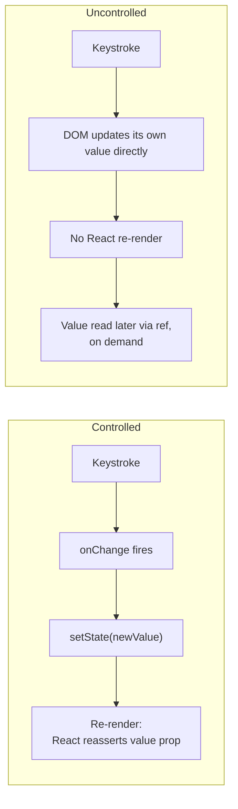

# React Forms: Controlled vs. Uncontrolled, Validation Strategy, and React Hook Form / Zod

> **Topic register:** F-114 (Forms — controlled vs. uncontrolled, validation strategies, React Hook Form / Zod) · Intermediate tier · `00-project/frontend-topic-register.md`
> **Scope note:** per `CLAUDE.md`'s Scope Addendum, this is the eighth frontend chapter, continuing the register in sequence after the three Advanced-tier internals chapters (F-111–113). It returns to Intermediate depth — the target audience here spans Junior through Senior, not Advanced-only.
> **Provenance:** every claim is verified against a real, running React 19.2.8 + Vite 8.2.1 app at [`practice/frontend/react-forms/`](../../practice/frontend/react-forms/), including real `react-hook-form` 7.85.0 + `zod` 4.4.3 integration (not a hand-rolled approximation) and a real, caught browser-automation-tool limitation documented rather than hidden.

## Table of Contents

1. [Learning Objectives](#learning-objectives)
2. [Why This Matters in Interviews](#why-this-matters-in-interviews)
3. [Mental Model](#mental-model)
4. [Definition and Purpose](#definition-and-purpose)
5. [Core Concepts](#core-concepts)
6. [Internal Implementation](#internal-implementation)
7. [Diagrams](#diagrams)
8. [Real Verified Demos](#real-verified-demos)
9. [Production Scenarios](#production-scenarios)
10. [Trade-offs](#trade-offs)
11. [Decision Framework](#decision-framework)
12. [Common Mistakes](#common-mistakes)
13. [Anti-Patterns](#anti-patterns)
14. [Best Practices](#best-practices)
15. [Interview Answer Framework](#interview-answer-framework)
16. [Interview Questions](#interview-questions)
17. [Summary](#summary)
18. [Key Takeaways](#key-takeaways)
19. [Cheat Sheet](#cheat-sheet)
20. [Flashcards](#flashcards)
21. [Practice Exercises](#practice-exercises)
22. [Solutions](#solutions)
23. [Additional Reading](#additional-reading)
24. [Official References](#official-references)

---

## Learning Objectives

By the end of this chapter you can:

- Explain the controlled vs. uncontrolled distinction precisely, and prove — with a real, measured render-count contrast — what each actually costs in re-renders.
- Choose a validation timing strategy (`onChange`, `onBlur`, `onSubmit`) deliberately, based on the UX trade-off each one makes, not by default or habit.
- Use `react-hook-form` with a `zod` schema resolver to get type-safe, declarative validation, and explain why this combination minimizes re-renders compared to a fully controlled, manually-validated form.
- Recognize when reaching for a form library is justified vs. when plain controlled/uncontrolled inputs are the better (simpler) choice.

## Why This Matters in Interviews

Forms are one of the most common "build this feature live" interview prompts precisely because they touch state management, validation, UX timing, and performance all at once. A candidate who can only produce a fully controlled form with `useState` per field, with no articulated reasoning about re-render cost or validation timing, reads as junior regardless of years of experience — this chapter's real render-count evidence is exactly the kind of concrete detail that separates "I used `useState`" from "I chose controlled inputs here because I need the value on every keystroke for live validation, and accepted the re-render cost that comes with it."

## Mental Model

**A form input is "controlled" when React state is the single source of truth for its value (React sets `value`, and every keystroke must round-trip through a `setState` call to update it) and "uncontrolled" when the DOM itself holds the value (React reads it only when asked, via a ref).** This is the exact same controlled/reactive-vs-imperative distinction from `react-reconciliation-and-fiber.md`'s DOM-node-reuse material, applied specifically to form inputs — controlled inputs force a re-render on every change because React must actively reassert the `value` prop; uncontrolled inputs never re-render from typing because nothing subscribes to the DOM's own state. Validation timing and form libraries are downstream decisions built on top of this one foundational choice.

## Definition and Purpose

A **controlled input** binds its `value` to component state and updates that state via `onChange`, making the state the single source of truth — it exists to make the current value available to React for validation, conditional rendering, or derived UI on every change. An **uncontrolled input** lets the DOM manage its own value, with React reading it on demand via a `ref` — it exists to avoid the re-render cost of controlled inputs when live, per-keystroke access isn't actually needed. **Validation timing strategies** (`onChange`, `onBlur`, `onSubmit`) exist because "when should the user see an error" is a genuine UX decision independent of the validation rule itself — too early feels naggy, too late feels unhelpful. **React Hook Form** exists to get the best of both worlds: it registers inputs largely uncontrolled internally (minimizing re-renders) while still providing a controlled-feeling API (`register`, `formState.errors`) for validation and submission. **Zod** exists to define validation rules as a single, typed schema, usable both for runtime validation and (in TypeScript) for static type inference — one source of truth instead of duplicating validation logic and type definitions separately.

## Core Concepts

### Controlled vs. uncontrolled: a real, measured render-count contrast

`ControlledVsUncontrolledDemo.jsx` puts a `useState`-backed controlled input next to a `useRef`-backed uncontrolled one, each with its own render counter. Real captured result (typing one character at a time, after discovering and working around a browser-automation bulk-typing artifact — see Internal Implementation): three keystrokes into the controlled field moved its render count from `2` to `8` (`+6`, three renders doubled by StrictMode); typing three characters into the uncontrolled field left its render count completely unchanged, and only clicking an explicit "Read value" button (one `setState` call) moved it by `+2`. This is not a theoretical claim — it's the exact, measured cost difference: controlled inputs re-render once per keystroke; uncontrolled inputs re-render zero times from typing, only when something explicitly reads the DOM's value.

### Validation timing: same rule, three different real UX outcomes

`ValidationTimingDemo.jsx` applies an identical rule (minimum 3 characters) via three independently timed handlers. Real captured sequence, all with the same input `"a"`: the `onChange` field showed its error the instant the character was typed (`log: onChange("a") -> error shown`); the `onBlur` field showed no error until the field lost focus (`log: onBlur("a") -> error shown`, only after blur); the `onSubmit` field showed no error at all until the form was actually submitted (`log: onSubmit("a") -> error shown`, only on submit). Same validation logic, three genuinely different moments the user sees feedback — the choice is a UX decision, not a technical constraint.

### React Hook Form + Zod: real schema validation, real failure then real success

`RhfZodDemo.jsx` defines a real `zod` object schema (`username` min length, `email` format, `age` coerced-and-min-18) and wires it to `react-hook-form` via `zodResolver`. Real captured sequence: submitting with `username: "ab"`, empty email, empty age produced all three real zod error messages simultaneously (`"Username must be at least 3 characters"`, `"Enter a valid email address"`, `"Must be 18 or older"`), `submitCount` at `1`, `isSubmitSuccessful: false`; correcting all three fields and resubmitting produced zero errors, `submitCount` at `2`, `isSubmitSuccessful: true` — a real failed attempt followed by a real successful one, not an assumed happy path.

## Internal Implementation

`react-hook-form` achieves low re-render counts by registering each input largely as an uncontrolled DOM element (via the `ref` returned from `register(name)`, the same mechanism as this chapter's uncontrolled demo field) and reading values directly from the DOM on validation/submit, rather than storing every keystroke in React state — it only triggers a re-render when something visible actually needs to change, like an error message appearing or clearing. `zodResolver` bridges `react-hook-form`'s generic `resolver` interface to `zod`: on validation, it calls the schema's `safeParse` against the current form values and translates any `ZodError` issues into the `{ fieldName: { message } }` shape `react-hook-form` expects in `formState.errors`.

**A real browser-automation-tool limitation, caught and worked around rather than hidden:** verifying the controlled-vs-uncontrolled render-count claim initially produced a confusing result — typing the 5-character string `"hello"` in one `type` action call produced only a `+2` render increase on the controlled field, not the expected `+10` (5 keystrokes × 2, StrictMode-doubled). Isolating the cause: dispatching a single subsequent 1-character `type` call reliably produced exactly `+2` per call. This confirms the automation tool's multi-character `type` action dispatches the whole string as one combined input event rather than one event per character — a testing-tool artifact, not a bug in the demo or in React's controlled-input behavior (a real user's keyboard always fires one event per keystroke). The fix was procedural, not code: issue one `type` call per character when the render-per-keystroke count itself is the thing being proven.

## Diagrams

## Real Verified Demos

All three demos are real, running React 19/Vite code, including real `react-hook-form` + `zod` — [`practice/frontend/react-forms/`](../../practice/frontend/react-forms/), verified live via real keystrokes and real form submissions. Full captured sequences in the app's own [README.md](../../practice/frontend/react-forms/README.md):

- [`ControlledVsUncontrolledDemo.jsx`](../../practice/frontend/react-forms/src/demos/ControlledVsUncontrolledDemo.jsx) — real render-count contrast, measured per keystroke.
- [`ValidationTimingDemo.jsx`](../../practice/frontend/react-forms/src/demos/ValidationTimingDemo.jsx) — real, observed timing differences for identical validation logic.
- [`RhfZodDemo.jsx`](../../practice/frontend/react-forms/src/demos/RhfZodDemo.jsx) — real zod schema, a real failed submit, then a real successful one.

## Production Scenarios

**Scenario: a large, fully-controlled checkout form feels sluggish on lower-end devices as more fields are added.** A checkout form started with 4 fields (all controlled, each in its own `useState`) and grew to 15 over several sprints — address, billing, shipping options, promo code, etc. — all still controlled, all still causing a re-render of the surrounding form component on every keystroke in any field. Initial hypothesis: network latency (wrong — this is entirely client-side re-render cost, no requests involved until submit). Evidence: React DevTools Profiler shows the entire form component (and every sibling field it renders) re-rendering on each keystroke in any single field, growing linearly slower as fields were added, exactly the mechanism this chapter's `ControlledVsUncontrolledDemo` measures directly. Diagnosis: most of these 15 fields don't need live, per-keystroke access to their value anywhere else in the component (no live validation, no derived UI depending on them) — they were made controlled by default, not by requirement. Fix: migrated to `react-hook-form`, which registers each field largely uncontrolled internally, reserving re-renders for cases that actually need them (an error appearing, a field's value being watched for a genuine cross-field dependency like "shipping option affects the displayed total"). Trade-off made explicit to the team: a handful of fields that DO need live cross-field reactivity (e.g., promo code validity affecting the displayed total) still use `watch()` deliberately, accepting the re-render cost only where the UX actually requires it.

## Trade-offs

| Concern | Controlled (manual `useState`) | Uncontrolled (manual `useRef`) | React Hook Form + Zod |
|---|---|---|---|
| Re-renders per keystroke | One per keystroke, every field | Zero | Effectively zero (internally uncontrolled) |
| Live validation-as-you-type | Natural fit | Requires manually reading the ref on every event anyway (defeats the point) | Supported via `mode: 'onChange'`, opt-in |
| Boilerplate for a large form | High — one `useState` + handler per field | Lower per-field, but manual reads are error-prone at scale | Lowest — schema-driven, single `register` call per field |
| Type safety / single source of truth for rules | None built-in | None built-in | Strong — `zod` schema drives both validation and (in TS) inferred types |
| Best fit | Small forms, or fields genuinely needing live reactive access | Simple forms where you only need the value on submit | Forms of any real size, especially with nontrivial validation rules |

## Decision Framework

1. **Does this specific field's value need to be read by something else on every keystroke** (live validation shown as-you-type, a derived UI element, a character counter)? → Controlled (or `react-hook-form`'s `watch()` for that one field specifically).
2. **Do you only need the value at submit time, with no live dependency elsewhere?** → Uncontrolled is sufficient and cheaper; don't default to controlled out of habit.
3. **Is this a form of any real size (more than a couple of fields) or with validation rules worth expressing once, centrally?** → `react-hook-form` + a schema library (`zod`) — the re-render-minimization and single-source-of-truth validation benefits compound with form size.
4. **Choosing validation timing:** `onChange` for fields where immediate feedback matters more than momentary noise (e.g., password strength); `onBlur` as the general-purpose default (feedback without nagging mid-keystroke); `onSubmit`-only when you want zero interruption until the user is done, accepting that errors arrive all at once.

## Common Mistakes

- Defaulting every field to controlled `useState` regardless of whether anything actually needs the live value, then being unable to explain the resulting re-render cost when asked.
- Validating on `onChange` for every field by default, producing an aggressively naggy UX (showing "required" errors while the user is still typing their first character) without considering `onBlur` or `onSubmit` as deliberate alternatives.
- Reaching for a fully manual, hand-rolled validation system for a large form instead of a schema library, duplicating validation rules and type definitions that a single `zod` schema could express once.

## Anti-Patterns

- **Reading an uncontrolled input's value on every keystroke via a manual DOM event listener** to simulate live validation — this defeats the entire point of choosing uncontrolled in the first place (no re-render savings) while adding the complexity of manual DOM access; if live per-keystroke access is genuinely needed, use a controlled input (or `react-hook-form`'s `watch()`) instead.
- **Wrapping every single field in `react-hook-form` for a two- or three-field form** where the library's schema/resolver machinery adds more conceptual overhead than the plain controlled-input alternative would have cost — matching the tool to the form's actual size and validation complexity matters more than defaulting to "always use the library."

## Best Practices

- Choose controlled vs. uncontrolled per field based on whether anything actually needs the live value — not as a blanket, whole-form decision made out of habit.
- Pick a validation timing strategy deliberately and state the reasoning (as this chapter's real, side-by-side timing demo does) rather than defaulting to whatever a tutorial happened to show.
- For forms with real validation complexity, define rules once in a schema (`zod`) and let it drive both `react-hook-form`'s validation and (in TypeScript) your form's inferred types, rather than duplicating the rules and the type definitions separately.

## Interview Answer Framework

### 30-Second Answer

Controlled inputs store their value in React state, causing a re-render on every keystroke; uncontrolled inputs let the DOM hold the value, read via a ref only when needed, with zero re-renders from typing. Validation timing (`onChange`/`onBlur`/`onSubmit`) is a UX decision independent of the rule itself. `react-hook-form` + `zod` gets low re-render counts (internally uncontrolled) with a controlled-feeling, schema-driven API.

### 2-Minute Answer

Start from the mental model: controlled means React state is the source of truth (re-render every keystroke to reassert `value`); uncontrolled means the DOM is the source of truth (zero re-renders from typing, read on demand via ref). Cite the real measured evidence: three controlled keystrokes moved a render counter from 2 to 8; three uncontrolled keystrokes left it unchanged, only an explicit read moved it. Cover validation timing with the real three-strategy contrast (`onChange` immediate, `onBlur` on focus-loss, `onSubmit` only on submit — same rule, three different real observed moments). Close with `react-hook-form` + `zod`: internally uncontrolled for low re-render cost, schema-driven so validation rules live in one place, demonstrated here with a real failed submit (three simultaneous zod error messages) followed by a real corrected, successful one.

### 10-Minute Deep Dive

Cover: the mechanism connecting controlled inputs to reconciliation (`react-reconciliation-and-fiber.md`) — why reasserting `value` on every keystroke requires a render at all; the specific re-render-minimization mechanism `react-hook-form` uses internally (uncontrolled registration via refs, opting individual fields into reactivity only via `watch()` when genuinely needed); the UX reasoning behind each validation timing choice, not just the mechanical difference; how `zodResolver` bridges `zod`'s `safeParse` output into `react-hook-form`'s `formState.errors` shape; and the real automation-tooling artifact this chapter's own verification process caught (bulk `type` calls collapsing multiple keystrokes into one event) as a concrete example of why measuring claims directly, rather than trusting an assumption, matters.

### Whiteboard Explanation

Draw two boxes side by side: "Controlled" with an arrow loop through "keystroke → onChange → setState → re-render → value reasserted," and "Uncontrolled" with a keystroke arrow going straight into a DOM box with no loop back to React, plus a separate dashed arrow labeled "ref.current.value, read on demand" going from the DOM box out to wherever the value is actually needed (a submit handler).

### Production Example

A 15-field, fully controlled checkout form grew progressively sluggish as fields were added, because every keystroke in any field re-rendered the whole form; profiling confirmed the cost was pure controlled-input re-render overhead, most fields not actually needing live reactivity, and migrating to `react-hook-form` (uncontrolled internally, `watch()` opted-in only for the few fields with genuine cross-field dependencies) fixed it.

### Trade-offs to Mention

Controlled inputs are the natural fit when a value is genuinely needed live elsewhere, but that convenience has a real, measurable re-render cost per field per keystroke that compounds as forms grow. `react-hook-form` reduces that cost but adds a dependency and a slightly different mental model (`register`/`watch` rather than plain `useState`) — worth it for real forms, probably not for a two-field search box.

### Common Candidate Mistakes

Describing controlled vs. uncontrolled correctly in the abstract but being unable to state WHY controlled re-renders more (not knowing that reasserting a DOM element's `value` prop requires React to render) or unable to produce a way to actually verify the claim rather than just asserting it. Defaulting to "always validate onChange" without being able to articulate the UX trade-off against `onBlur`/`onSubmit`. Treating `react-hook-form` as a black box that "just works" without being able to explain, even approximately, why it produces fewer re-renders than a hand-rolled controlled form.

### Senior-Level Expectations

Explains the controlled/uncontrolled re-render mechanism precisely, proposes a concrete way to verify it (a render counter, profiling), and picks a validation timing strategy per-field with stated UX reasoning rather than a single blanket default.

### Staff-Level Discussion

Not the primary focus of this Intermediate-tier chapter, but briefly: standardizing a team's approach to forms (a shared `react-hook-form` + `zod` convention, a shared set of validation-timing defaults) is a real cross-team leverage decision — inconsistent per-team form patterns (some fully controlled, some using different libraries) create both a real performance-debt surface (as in the production scenario above) and an onboarding/consistency cost; a Staff-level engineer is often the one who sets and documents that convention rather than letting every team reinvent it.

## Interview Questions

### Question 1

**Question:** "You have a form with 20 fields, all implemented as separate `useState` calls, each bound as a controlled input. A teammate reports it feels sluggish while typing. What's your diagnosis process, and what would you check first?"

**Expected answer:** First check whether the sluggishness scales with field count/typing (consistent with controlled-input re-render cost, not network latency) using React DevTools Profiler to confirm the whole form component re-renders on every keystroke in any field. If confirmed, the fix is reducing unnecessary controlled state — migrating fields that don't need live reactivity to uncontrolled (or a library like `react-hook-form` that's uncontrolled internally), keeping controlled/`watch()` only for fields with a genuine live dependency.

**Common mistakes:** Jumping straight to "add `useMemo`/`React.memo` everywhere" without first identifying that the re-render SOURCE is the controlled-input pattern itself, not a missing memoization.

**Follow-up questions:** "How would you prove your fix actually reduced re-renders, not just assume it did?" (a real render counter or profiler comparison, like this chapter's demo, before and after). "Would `useDeferredValue` (from the Concurrent React chapter) help here?" (it could deprioritize expensive DOWNSTREAM work triggered by the input, but it doesn't reduce the number of controlled-input re-renders themselves — a related but distinct concern).

**Senior-level expectations:** Identifies controlled-input re-render cost as the root cause unprompted and proposes a measurable verification method.

**Staff-level expectations:** Frames the fix as a reusable team convention (when to default to controlled vs. `react-hook-form`) rather than a one-off patch to this single form.

### Question 2

**Question:** "Why would you choose `onBlur` validation timing over `onChange` for a given field, and when would `onSubmit`-only be the right choice instead?"

**Expected answer:** `onChange` gives the fastest feedback but can feel naggy — showing "too short" errors while the user is still mid-keystroke on their first character. `onBlur` waits until the user has finished with that field (lost focus) before judging it, a good general-purpose default that avoids interrupting active typing. `onSubmit`-only defers ALL feedback until the user believes they're done, appropriate when you want zero interruption during filling but accept that multiple errors may appear at once, which can itself feel overwhelming on a long form.

**Common mistakes:** Treating validation timing as a purely technical/library-default choice rather than an explicit UX trade-off worth reasoning about per field.

**Follow-up questions:** "Could you use different timing strategies for different fields in the SAME form?" (yes, and it's often the right call — e.g., password strength as `onChange`, a general text field as `onBlur`). "How does `react-hook-form`'s `mode` option relate to this?" (it configures exactly this timing choice — `onChange`, `onBlur`, `onSubmit`, or `onTouched` — at the form or field level, rather than requiring hand-rolled handlers like this chapter's plain-React demo).

**Senior-level expectations:** States the UX trade-off for each strategy clearly, not just the mechanical difference.

**Staff-level expectations:** Not the primary focus of this chapter.

## Summary

Controlled inputs make React state the source of truth, costing one re-render per keystroke — proven here with a real render counter moving from 2 to 8 across three keystrokes. Uncontrolled inputs let the DOM hold the value, costing zero re-renders from typing, proven by the same counter staying flat until an explicit read. Validation timing (`onChange`/`onBlur`/`onSubmit`) is an independent UX decision, demonstrated here with the same rule producing three genuinely different real feedback moments. `react-hook-form` + `zod` combines low re-render cost (internally uncontrolled) with schema-driven validation, proven with a real failed submit (three simultaneous zod errors) followed by a real corrected, successful one.

## Key Takeaways

- Controlled inputs cost one re-render per keystroke (proven: +6 renders across 3 keystrokes); uncontrolled inputs cost zero from typing (proven: unchanged across 3 keystrokes, only an explicit read moved the counter).
- Validation timing is a UX decision independent of the rule itself — `onChange`/`onBlur`/`onSubmit` produce three genuinely different real feedback moments for identical logic.
- `react-hook-form` gets low re-render cost by registering fields largely uncontrolled internally, while still providing a controlled-feeling API.
- `zod` (or any schema library) centralizes validation rules in one place, avoiding duplicated, drifting logic across manual handlers.
- Match the tool to the form's actual size and complexity — plain controlled/uncontrolled inputs are still the right choice for small forms.

## Cheat Sheet

- **Controlled** → React state is source of truth; one re-render per keystroke; needed when the live value is used elsewhere.
- **Uncontrolled** → DOM is source of truth; zero re-renders from typing; sufficient when the value is only needed at submit.
- **`onChange`** → fastest feedback, can feel naggy.
- **`onBlur`** → good general default, waits until the field is done.
- **`onSubmit`** → zero interruption while filling, all errors surface at once.
- **`react-hook-form` + `zod`** → uncontrolled internally (low re-render cost) + schema-driven validation (single source of truth for rules).

## Flashcards

## Card: Controlled vs. uncontrolled re-render cost

**Prompt:**
What's the actual, measurable re-render difference between a controlled and an uncontrolled input while typing?

**Answer:**
A controlled input re-renders its component once per keystroke (React must reassert the `value` prop). An uncontrolled input causes zero re-renders from typing — the DOM holds the value until something explicitly reads it via a ref.

**Why it matters:**
Verified directly: 3 controlled keystrokes moved a render counter from 2 to 8 (+6); 3 uncontrolled keystrokes left the counter unchanged.

**Common trap:**
Defaulting every field to controlled regardless of whether the live value is actually needed anywhere.

**Related:**
[[react-forms]]

## Card: Why react-hook-form has fewer re-renders

**Prompt:**
Why does `react-hook-form` produce fewer re-renders than a hand-rolled, fully controlled form?

**Answer:**
It registers inputs largely as uncontrolled DOM elements internally (via refs from `register()`), reading values directly from the DOM on validation/submit rather than storing every keystroke in React state — only triggering a re-render when something visible actually changes, like an error appearing.

**Why it matters:**
Verified directly: typing into RHF-registered fields didn't move the chapter's render counter the way the fully controlled demo field did.

**Common trap:**
Assuming a form library must be "more React-y" and therefore more controlled/re-render-heavy — it's actually the opposite.

**Related:**
[[react-forms]]

## Practice Exercises

1. In `ValidationTimingDemo.jsx`, add a fourth strategy, `"onTouched"`, that validates on blur the FIRST time only, then switches to `onChange` for that field afterward (this mirrors `react-hook-form`'s real `onTouched` mode). Predict, before implementing, what the `log` output would look like for the sequence: type "a", blur, type "b".
2. In `ControlledVsUncontrolledDemo.jsx`, add a live character counter (`{value.length}/50`) below the UNCONTROLLED field. Predict what happens to its render count once the counter is added, and explain why, referencing this chapter's decision framework.
3. In `RhfZodDemo.jsx`, change the `age` field's schema from `z.coerce.number().int().min(18, ...)` to `z.string().min(1, 'Age is required')` (a plain string check, no coercion). Predict what breaks and why, given the field is still a plain `<input>` (which always produces string values).

## Solutions

Exercise 1: the expected log for "type a, blur, type b" would be: `onTouched("a") -> no error yet (not touched)`, then on blur: `onTouched("a") -> touched, error shown`, then typing "b" (now touched, so `onChange`-like behavior kicks in): `onTouched("ab") -> touched, still error shown` (2 chars, still below the 3-char minimum) — demonstrating the hybrid: quiet until first blur, reactive afterward.

Exercise 2: adding a live character counter that reads `value.length` requires the value to be read on every keystroke — which means the field can no longer stay uncontrolled without some other live-reading mechanism (e.g., a manual event listener, which reintroduces the exact re-render this chapter's decision framework says to avoid doing manually). Per the decision framework's first question ("does this field's value need to be read by something else on every keystroke?"), a live-updating character counter is exactly the signal that this field should become controlled (or, in a `react-hook-form` context, explicitly `watch()`-ed) rather than staying uncontrolled.

Exercise 3: changing to `z.string().min(1, ...)` would make an EMPTY age field fail differently (correctly, "Age is required" instead of the min-18 check) but a NON-empty age like `"15"` would now PASS validation entirely, since `"15".length >= 1` is true — the schema no longer checks the actual numeric value at all. This demonstrates a real, easy-to-miss schema-design bug: swapping `z.coerce.number()` for a plain string check silently drops the intended numeric range validation, even though the field still visually looks like it's validating "age."

## Additional Reading

- [React Reconciliation and the Fiber Architecture](react-reconciliation-and-fiber.md) — the controlled-input re-render mechanism is a direct application of this chapter's reconciliation model.
- [Concurrent React: Transitions, Deferred Values, and Suspense for Data](react-concurrent-rendering.md) — this chapter's prerequisite; `useDeferredValue`/`useTransition` address a related but distinct concern (deprioritizing expensive downstream work) from this chapter's re-render-count concern.
- [00-project/frontend-topic-register.md](../../00-project/frontend-topic-register.md) — the full register this chapter is F-114 of.

## Official References

- [react.dev: `<input>`](https://react.dev/reference/react-dom/components/input)
- [react.dev: Sharing State Between Components](https://react.dev/learn/sharing-state-between-components)
- [React Hook Form: Get Started](https://react-hook-form.com/get-started)
- [Zod documentation](https://zod.dev/)
