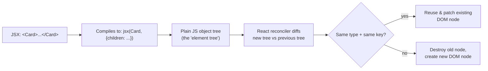
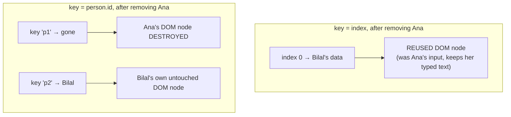

# React Fundamentals: JSX, Components, Props, and State

> **Topic register:** F-101–F-104 (JSX/virtual DOM, props/composition, `useState`, events/conditional rendering/lists) · Beginner tier · `00-project/frontend-topic-register.md`
> **Scope note:** per `CLAUDE.md`'s Scope Addendum, this chapter targets Junior/Mid depth deliberately — the frontend domain spans the full beginner-through-expert ladder, unlike the Java backend domain's near-exclusive Senior/Staff focus. Advanced React (hooks beyond `useState`, performance, concurrent features, fiber internals) is tracked separately as F-105 onward.
> **Provenance:** every claim in this chapter is verified against a real, running React 19.2.8 + Vite 8.2.1 app at [`practice/frontend/react-fundamentals/`](../../practice/frontend/react-fundamentals/), started with `npm run dev`, interacted with via a real browser (clicks, typed input, DOM inspection), not just described. Console confirmed clean; production build (`npm run build`) confirmed clean.

## Table of Contents

1. [Learning Objectives](#learning-objectives)
2. [Why This Matters in Interviews](#why-this-matters-in-interviews)
3. [Mental Model](#mental-model)
4. [Definition and Purpose](#definition-and-purpose)
5. [Core Concepts](#core-concepts)
6. [Internal Implementation](#internal-implementation)
7. [Diagrams](#diagrams)
8. [Real Verified Demos](#real-verified-demos)
9. [Production Scenarios](#production-scenarios)
10. [Trade-offs](#trade-offs)
11. [Decision Framework](#decision-framework)
12. [Common Mistakes](#common-mistakes)
13. [Anti-Patterns](#anti-patterns)
14. [Best Practices](#best-practices)
15. [Interview Answer Framework](#interview-answer-framework)
16. [Interview Questions](#interview-questions)
17. [Summary](#summary)
18. [Key Takeaways](#key-takeaways)
19. [Cheat Sheet](#cheat-sheet)
20. [Flashcards](#flashcards)
21. [Practice Exercises](#practice-exercises)
22. [Solutions](#solutions)
23. [Additional Reading](#additional-reading)
24. [Official References](#official-references)

---

## Learning Objectives

By the end of this chapter you can:

- Explain what JSX actually compiles to, and why React can patch the DOM instead of re-rendering the whole page from scratch.
- Build components that communicate via props (parent → child) and composition (`children`), and explain why props are read-only from the child's side.
- Use `useState` correctly, including the fact that state belongs to a component *instance*, not its function definition.
- Reproduce, from memory, the real bug that array-index keys cause in a dynamic list, and explain exactly why it happens.

## Why This Matters in Interviews

Every React interview, from a first screen to a Staff-level system-design round that happens to touch the frontend, assumes these fundamentals are automatic. The single most common practical filter is the list-key question — not "what is a key" (most candidates can define it), but "why does using the array index as a key sometimes break things," which requires actually understanding what a key is *for* (DOM node identity across renders), not just that React "wants" one. Getting this wrong in a live-coding round is a fast, visible signal.

## Mental Model

**JSX is not HTML and not magic — it's syntax sugar for building a tree of plain JavaScript objects describing what the UI should look like; React's job is to compare that tree to the previous one and make the smallest possible set of real changes to the actual DOM.** Once that clicks, props, state, and keys stop being separate rules to memorize: props are just how one node's description feeds into building its children's descriptions; state is data a component instance remembers across those tree-comparisons; and a `key` is the one piece of information React needs to know *which* previous DOM node a given tree node corresponds to — without it, React falls back to matching by position, which is exactly what goes wrong when a list's positions shift.

## Definition and Purpose

**React** is a JavaScript library (not a full framework — it has no built-in router, no built-in HTTP client) for building user interfaces out of composable, reusable components, each described declaratively (what the UI should look like for a given state) rather than imperatively (step-by-step DOM manipulation). It was open-sourced by Facebook in 2013 specifically to make *rebuilding an entire UI on every state change* cheap and predictable, by never touching the real DOM directly during that rebuild — the virtual DOM diffing process exists purely to make declarative rendering fast enough to be practical, not as a feature interviewers should expect you to praise as an end in itself. **JSX** exists so that describing a UI tree in JavaScript doesn't require deeply nested `createElement()` calls — it is optional (React works without it) but is the near-universal convention.

## Core Concepts

### JSX compiles to plain object descriptions, not DOM nodes

`practice/frontend/react-fundamentals/src/demos/JsxBasics.jsx` renders a JSX element (`<p className="plain-object">Built WITH JSX syntax</p>`) directly next to a hand-built plain object with the same shape (`{ type: 'p', props: { className: 'plain-object', children: '...' } }`), rendered as JSON. They describe the same thing. Neither is a DOM node — React turns descriptions like this into real DOM nodes the first time, then **reuses and patches** those same DOM nodes on subsequent renders instead of discarding and recreating them, which is the entire performance rationale for the whole model.

### Props flow one direction and are read-only

`PropsAndComposition.jsx`'s `Avatar` component receives `initials` and `color` as props from its parent and never modifies them — React has no built-in mechanism for a child to write back into a prop, by design; a child that wants to affect a parent's data does so by calling a function the parent passed down as a prop (an event-handler-shaped prop), not by mutating anything.

### Composition (`children`) lets a component wrap arbitrary content without knowing what it is

The same file's `Card` component takes a `title` prop and a `children` prop and renders both — the two `<Card>` usages in the demo pass completely different content as children (an `Avatar` plus text in one case, a `<button>` in the other), and `Card` itself never imports or references either. This is React's answer to "how do you build a generic wrapper" without inheritance.

### `useState`: state lives with the component instance, not the function

`CounterState.jsx` renders three separate `<Counter label="A" />` / `B` / `C` elements, each calling `useState(0)` independently. Clicking `A`'s `+1` button three times and reading the live DOM confirms `A: 3, B: 0, C: 0` — each JSX usage of `<Counter />` is a distinct component *instance* with its own state slot, even though all three instances share the exact same function definition. This is the direct answer to "why doesn't calling `useState` in a function just create one global variable" — it doesn't, because React tracks state per call-site-in-the-tree, not per function.

### Events, conditional rendering: no special syntax, just JavaScript

`EventsAndConditional.jsx` uses `status === 'loading' && <p>...</p>` for conditional rendering — this is a plain JavaScript `&&` short-circuit expression evaluated inside JSX's `{}` escape hatch, not React-specific syntax. `onClick={() => setStatus('loading')}` is an ordinary event handler; React wraps the native browser event in a `SyntheticEvent` for cross-browser consistency, but the handler-invocation model is unchanged from plain DOM event listeners.

### The index-as-key bug, reproduced and measured

`ListKeysPitfall.jsx` is this chapter's centerpiece. Two lists render the identical three-person array; one uses `key={index}`, the other `key={person.id}`. Each row has an **uncontrolled** `<input defaultValue="">` (deliberately not `value`+`onChange`, so its typed text is stored in the DOM node itself, independent of React's state).

Real, captured sequence (verified via direct `input.value` inspection, before and after, not just visual reading):

```
Typed "NOTE-FOR-ANA" into Ana's input in BOTH lists.

before_removal:
  index list: Ana="NOTE-FOR-ANA", Bilal="", Carmen=""
  id list:    Ana="NOTE-FOR-ANA", Bilal="", Carmen=""

Clicked "Remove first person" on BOTH lists.

after_removal:
  index list: Bilal="NOTE-FOR-ANA"   <- BUG: the DOM input node for position 0
                                        got reused for Bilal (now at index 0),
                                        and its typed text stayed with it.
  id list:    Bilal=""               <- correct: React destroyed the DOM node
                                        keyed "p1" along with Ana; Bilal's own
                                        node (key "p2") was never touched.
```

`key` is React's instruction for "this DOM node corresponds to *this* piece of data, across renders." With `key={index}`, after removing the first item every remaining item's index shifts down by one — so React is told "position 0 is still position 0's node," and reuses Bilal's row into what was Ana's DOM node, textbox included. With `key={person.id}`, Ana's DOM node is tied to the identity `"p1"`, which no longer exists after removal — React destroys that exact node and never confuses it with Bilal's.

## Internal Implementation

React builds an in-memory tree (informally "the virtual DOM," though React's own docs now avoid that term in favor of describing the reconciliation algorithm directly) from the object descriptions JSX compiles to. On each render, React's reconciler walks the new tree alongside the previous one and, for each node, decides: same type + same key → reuse and patch the existing DOM node's attributes/children; different type or different key → destroy the old DOM node and create a new one. For a list, this comparison happens per-key across siblings — which is precisely why `key` only needs to be unique among *siblings*, not globally, and why an unstable or absent key (React falls back to index automatically, with a console warning, if no `key` prop is given at all) makes that per-item identity ambiguous exactly when the list's order or membership changes.

## Diagrams





## Real Verified Demos

All five demos are real, running React 19/Vite code — [`practice/frontend/react-fundamentals/`](../../practice/frontend/react-fundamentals/), verified live in a browser (`npm run dev`, clicks and typed input via browser automation, DOM state read directly via `input.value`, console confirmed clean, `npm run build` confirmed a clean production build):

- [`JsxBasics.jsx`](../../practice/frontend/react-fundamentals/src/demos/JsxBasics.jsx) — JSX next to the equivalent plain object.
- [`PropsAndComposition.jsx`](../../practice/frontend/react-fundamentals/src/demos/PropsAndComposition.jsx) — a reusable `Card` composed with different children.
- [`CounterState.jsx`](../../practice/frontend/react-fundamentals/src/demos/CounterState.jsx) — three independent `useState` instances, isolation confirmed by clicking.
- [`EventsAndConditional.jsx`](../../practice/frontend/react-fundamentals/src/demos/EventsAndConditional.jsx) — event-driven conditional rendering.
- [`ListKeysPitfall.jsx`](../../practice/frontend/react-fundamentals/src/demos/ListKeysPitfall.jsx) — the index-as-key bug, reproduced and measured (see [README.md](../../practice/frontend/react-fundamentals/README.md) for the full captured sequence).

## Production Scenarios

**Scenario: an editable-notes feature ships with a subtle data-corruption bug that only appears when users delete rows.** A team builds a task list where each row has an inline "notes" text field (an uncontrolled input, added for a quick performance win since it avoids a re-render on every keystroke). The list is rendered with `key={index}` because it was the first thing that made the console warning disappear during development. In production, whenever a user deletes a task from the middle of the list, the notes typed into rows *below* the deleted one silently reattach to the wrong tasks — invisible in casual testing (since testers rarely type into a row and then delete a different row above it in the same session), but a real, reported data-integrity bug once real users started reordering and deleting freely. The fix (switching to a stable `key={task.id}`) is a one-line change; the actual cost was the incident investigation, since the bug reproduced only under a specific interaction order and looked, from the bug report, like a backend data-corruption issue rather than a frontend rendering one.

## Trade-offs

| Concern | Controlled input (`value` + `onChange`) | Uncontrolled input (`defaultValue`) |
|---|---|---|
| Source of truth | React state | The DOM itself |
| Re-render cost | Re-renders on every keystroke (usually negligible, can matter at scale) | No re-render per keystroke |
| Validation/formatting-as-you-type | Straightforward (derive from state) | Requires manual DOM reads (`ref.current.value`) |
| Interacts with `key` reuse bugs | Immune — React owns and re-sets the value from state every render | Exposed — DOM-owned value persists across a reused node, as shown above |

## Decision Framework

1. **Rendering a list that can be reordered, filtered, or have items removed from the middle?** → use a stable, unique-per-item `key` (a real ID), never the array index.
2. **Is the list provably static in order and length for its entire lifetime (e.g., a fixed set of tabs defined at compile time)?** → index-as-key is technically safe there, but a stable key costs nothing and removes the question entirely — default to a real key.
3. **Building a form field where you need the typed value on every keystroke (live validation, character counters)?** → controlled input.
4. **Building a field where you only need the value on submit, and keystroke-level re-renders are a measured performance concern?** → uncontrolled input with a `ref`, understanding the key-reuse risk this chapter demonstrates.

## Common Mistakes

- Using the array index as `key` for any list that can reorder, filter, or have items removed — the single most common React interview red flag.
- Believing JSX "is" HTML rendered directly, rather than compiled syntax describing a JS object tree.
- Mutating props directly inside a child component (`props.value = ...`) instead of calling a callback prop the parent provided.
- Assuming `useState`'s initial value re-runs the initializer function on every render — it only runs once, on the component instance's first render (a two-line demo away from this chapter's current scope, tracked as a follow-up under F-105).

## Anti-Patterns

- **Prop drilling as a first resort** — threading a prop through four intermediate components that don't use it themselves, purely to reach a deeply nested consumer. Composition (passing the consumer itself as `children` further up) or Context (F-108, tracked separately) usually beats this once it's past two or three levels.
- **Defining a component inside another component's render body** — creates a brand-new component *type* on every parent render, defeating any reuse/patching React could otherwise do for that subtree, and resetting all of its internal state every time the parent re-renders.

## Best Practices

- Always pass a stable, data-derived `key` for list items — an ID from your data, not the loop index.
- Keep components small and composed via `children` rather than building single giant components with many conditional branches for different "modes."
- Treat props as immutable from the child's perspective; communicate upward only via callback props.
- Reach for `useState` first; only introduce more complex state tooling (Context, external stores) once prop drilling or cross-component sharing actually becomes a real problem, not preemptively.

## Interview Answer Framework

### 30-Second Answer

JSX compiles to plain JS objects describing a UI tree; React diffs that tree against the previous one and patches only what changed in the real DOM. Props flow one-way, parent to child, and are read-only. `useState` gives a component instance its own memory across renders. `key` tells React which previous DOM node a list item corresponds to — using the array index breaks this whenever the list's order or membership changes, because positions shift but the index-based key doesn't reflect that.

### 2-Minute Answer

Walk through the mental model (declarative description → diffing → minimal DOM patch), then props/composition as the one-way data flow mechanism, then `useState` as per-instance memory (the three-independent-counters proof point), then land on the key bug with the concrete before/after: an uncontrolled input's typed text staying attached to the wrong row after a deletion, because the DOM node got reused across different underlying data when keyed by position instead of identity.

### 10-Minute Deep Dive

Cover: JSX-to-object compilation and why virtual-DOM diffing exists (making declarative re-rendering cheap enough to be practical); the reconciler's same-type-same-key reuse rule and why it operates per-sibling, not globally; the controlled-vs-uncontrolled input trade-off and how it interacts with the key-reuse bug specifically (an uncontrolled input's DOM-owned value is what makes the bug visible — a controlled input, whose value React re-sets from state every render, would mask the same underlying node-reuse mistake); and a real production scenario where the bug shipped silently because it only reproduces under a specific interaction order.

### Whiteboard Explanation

Draw three boxes in a row labeled "Ana (key=0)", "Bilal (key=1)", "Carmen (key=2)" under a heading "BEFORE removal, index keys." Below it, draw the same three boxes shifted left with new labels "Bilal (key=0)", "Carmen (key=1)" under "AFTER removing Ana" — circle the fact that "key=0" pointed to Ana before and Bilal after: same key, different data, so React treats it as the SAME node. Redo the same two rows with real IDs (`p1`, `p2`, `p3`) instead of positions, and show `p1`'s box getting crossed out entirely on removal while `p2`/`p3`'s boxes are untouched.

### Production Example

A task-list app renders editable notes per row with an uncontrolled input, keyed by array index. Deleting a task from the middle of the list causes notes typed into later rows to silently reattach to the wrong task — reported as a data-integrity bug, investigated as a possible backend issue before being traced to the frontend's key choice, fixed by switching to `key={task.id}`.

### Trade-offs to Mention

Index keys are strictly simpler when a list's order and membership are truly fixed for its whole lifetime, but that condition is rarely true and rarely verified — defaulting to real IDs costs nothing and removes an entire class of bug. Uncontrolled inputs avoid per-keystroke re-renders but expose exactly this kind of DOM-node-reuse bug; controlled inputs cost a re-render per keystroke but keep React, not the DOM, as the single source of truth.

### Common Candidate Mistakes

Saying "index keys are bad" without being able to explain the actual mechanism (DOM node reuse by position); confusing props (parent-to-child, read-only) with state (owned by the component itself); believing JSX requires React to re-create every DOM node on every render (the entire point of the diffing model is that it doesn't).

### Typical Follow-Ups

"When IS an index key actually fine?" (a genuinely static list — no reordering, filtering, insertion, or removal, ever, for the component's lifetime). "How would you fix this bug in code you didn't write, without seeing it fail first?" (audit every `.map()` rendering a list for `key={index}` and check whether that list's order/membership can change). "What's the difference between what happens here with a controlled vs. an uncontrolled input?" (a controlled input's `value` is reset by React from state on every render regardless of node reuse, which happens to mask the same underlying reconciliation behavior — the bug is about DOM node identity either way, but only visibly manifests with DOM-owned state).

### Senior-Level Expectations

For this chapter's beginner/mid scope: correctly explains the mechanism (not just the rule) behind the index-key bug, and can state precisely when index keys are actually safe.

### Staff-Level Discussion

Not the primary target of this chapter (see the Scope Addendum), but briefly: at organizational scale, "never use index as key" is a lint-rule-enforceable policy (`eslint-plugin-react`'s `react/no-array-index-key`) rather than something to rely on code review catching case-by-case — the kind of decision that belongs in a shared ESLint config rather than a wiki page, since the failure mode is silent and interaction-order-dependent.

## Interview Questions

### Question 1

**Question:** "What's actually wrong with using the array index as a `key` in a React list, and when is it actually fine?"

**Expected answer:** Using the index as key ties the key to a position, not the underlying data's identity. When the list's order or membership changes (an item removed, inserted, or reordered), the same index now refers to different data, and React — trusting the key — reuses the DOM node for what it believes is "the same" list item, carrying over any DOM-owned state (uncontrolled input values, focus, CSS transition state) to the wrong data. It's fine only when the list's order and membership are genuinely fixed for the component's entire lifetime.

**Common mistakes:** Reciting "it's bad practice" without explaining the DOM-node-reuse mechanism; not being able to state the specific condition under which it's actually safe.

**Follow-up questions:** "Would this bug still happen with a controlled input instead of uncontrolled?" "How would you catch this in code review or CI before it ships?"

**Senior-level expectations (relative to this chapter's beginner/mid scope):** Explains the mechanism unprompted, not just the rule; correctly reasons about the controlled-vs-uncontrolled follow-up.

**Staff-level expectations:** Frames it as a lint-enforceable policy decision rather than a per-PR review item.

### Question 2

**Question:** "You render three `<Counter />` components with the same function definition. Why does clicking one not affect the others?"

**Expected answer:** `useState` doesn't attach state to the function definition — React tracks state per component *instance*, keyed by that instance's position in the rendered tree. Three JSX usages of `<Counter />` are three separate instances, each with its own independent state slot, even though they share identical code.

**Common mistakes:** Vague answers like "React just handles it" without the instance-vs-definition distinction; confusing this with closures/scoping in plain JavaScript.

**Follow-up questions:** "What would happen if `<Counter />` were rendered conditionally and then removed and re-added?" (state resets — a new instance is created, since the previous one was unmounted).

**Senior-level expectations:** States the instance/position-in-tree model unprompted.

**Staff-level expectations:** Not the focus of this chapter's scope.

## Summary

React's entire model follows from one idea: describe the UI declaratively as a tree of plain objects, and let React figure out the minimal real DOM changes needed to match a new description to the previous one. Props and composition are how that description flows and combines across components; `useState` is how a component instance remembers things across re-descriptions; and `key` is the one piece of information React needs to correctly match tree nodes to DOM nodes when a list's shape changes — get it wrong, and DOM-owned state silently attaches to the wrong data, exactly as measured in this chapter's central demo.

## Key Takeaways

- JSX compiles to plain object descriptions; React reuses/patches existing DOM nodes rather than rebuilding them from scratch on every render.
- Props flow one direction (parent → child) and are read-only from the child; `children` is how composition without inheritance works.
- `useState` state belongs to a component instance (its position in the tree), not its function definition — proven directly by three independent counters.
- Array-index keys cause real, measured DOM-node-reuse bugs the moment a list's order or membership changes; stable, data-derived keys don't.

## Cheat Sheet

- **JSX** → compiles to object descriptions, not DOM nodes.
- **Props**: parent → child, read-only, one direction.
- **Composition**: `children` prop, lets a wrapper stay ignorant of its contents.
- **`useState`**: per-instance memory, not per-function.
- **`key`**: identity across renders for list items — use a stable ID, never the array index, unless the list provably never reorders/filters/inserts/removes.
- **Controlled input**: `value` + `onChange`, React owns the value. **Uncontrolled**: `defaultValue`/`ref`, DOM owns the value — and is what makes the key-reuse bug visible.

## Flashcards

## Card: Why index keys break on list changes

**Prompt:**
Why does using the array index as a React list `key` cause bugs when items are removed or reordered?

**Answer:**
The key ties DOM-node identity to POSITION, not the underlying data. When positions shift, React reuses the DOM node for "the same index" even though the data there is now different — carrying over any DOM-owned state (like an uncontrolled input's typed value) to the wrong item.

**Why it matters:**
The single most common React interview red flag; measured directly in this chapter's demo.

**Common trap:**
Reciting "it's bad practice" without explaining the mechanism.

**Related:**
[[react-fundamentals-jsx-components-props-and-state]]

## Card: useState and component instances

**Prompt:**
If three components render the same function definition and each calls `useState(0)`, do they share state?

**Answer:**
No — each JSX usage is a separate component instance with its own state slot. State belongs to the instance's position in the render tree, not the function definition.

**Why it matters:**
Explains why reusable components work correctly without manual state isolation.

**Common trap:**
Assuming `useState` behaves like a module-level or closure-shared variable.

**Related:**
[[react-fundamentals-jsx-components-props-and-state]]

## Practice Exercises

1. In `ListKeysPitfall.jsx`, change the removal button to remove the SECOND person instead of the first, and re-run the same note-typing reproduction. Predict which list breaks and how before running it.
2. Add a fourth demo component, `ControlledVsUncontrolled.jsx`, with two inputs side by side — one controlled, one uncontrolled — and a button that clears both via a single click. Explain why the controlled one clears correctly with a simple `setState('')` while the uncontrolled one needs a `ref.current.value = ''` instead.
3. Modify `CounterState.jsx` so `<Counter />` is conditionally rendered based on a toggle button. Toggle it off and back on, and confirm (by reading the DOM) that the count resets to 0 — explain why in terms of mount/unmount, not just "it resets."

## Solutions

Exercise 1: removing the SECOND person (Bilal) shifts Carmen from index 2 to index 1 while Ana (index 0) is untouched — so the index-keyed list's bug now surfaces on Carmen's note, not Ana's, while Ana's own note (typed at index 0, still index 0 after the removal) stays correctly attached. The id-keyed list is unaffected either way, since removal always destroys the exact keyed node regardless of which position it was in.

Exercise 2: a controlled input's displayed value is `value={state}` — setting `state` to `''` and letting React re-render is sufficient, since React owns and re-renders the input's value from state every time. An uncontrolled input's displayed value lives in the DOM node itself, set once at mount via `defaultValue` and never touched by React again — clearing it requires directly setting `inputRef.current.value = ''`, bypassing React's render cycle entirely.

Exercise 3: toggling the counter off unmounts the `<Counter />` instance entirely — its `useState` slot is destroyed along with it. Toggling it back on mounts a brand-new instance, which calls `useState(0)` fresh, hence the count starts at 0 again. This is different from a component that stays mounted and merely re-renders, where state persists across renders by design.

## Additional Reading

- [00-project/frontend-topic-register.md](../../00-project/frontend-topic-register.md) — the full React/Next.js topic register this chapter is F-101–104 of.

## Official References

- [react.dev: Describing the UI](https://react.dev/learn/describing-the-ui)
- [react.dev: Rendering Lists](https://react.dev/learn/rendering-lists) — the official `key` guidance this chapter's central demo verifies empirically.
- [react.dev API Reference](https://react.dev/reference/react)
