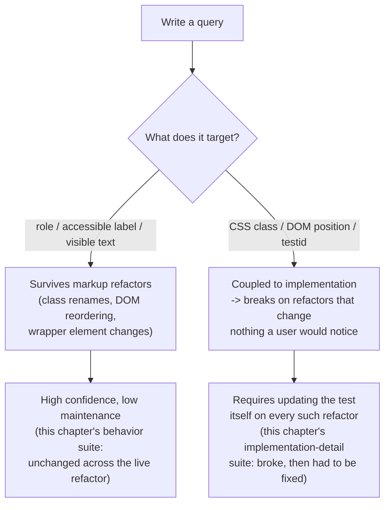

# React Testing: RTL Philosophy, Mocking, and E2E with Playwright

> **Topic register:** F-118 (Testing — React Testing Library philosophy, Jest/Vitest, mocking, Playwright/Cypress for E2E) · Advanced tier · `00-project/frontend-topic-register.md` — noted there as a direct parallel to the backend [`test-strategy-and-test-doubles.md`](../testing/test-strategy-and-test-doubles.md) chapter.
> **Scope note:** per `CLAUDE.md`'s Scope Addendum, this is the twelfth frontend chapter, continuing the register in sequence after Performance (F-117).
> **Provenance:** every claim is verified against a real, running React 19.2.8 + Vite 8.2.1 app at [`practice/frontend/react-testing/`](../../practice/frontend/react-testing/), including a real Vitest/React Testing Library suite, a real live-refactor that broke one query strategy and not another, and a real Playwright run against a real Chromium instance that caught a genuine locator bug mid-session.

## Table of Contents

1. [Learning Objectives](#learning-objectives)
2. [Why This Matters in Interviews](#why-this-matters-in-interviews)
3. [Mental Model](#mental-model)
4. [Definition and Purpose](#definition-and-purpose)
5. [Core Concepts](#core-concepts)
6. [Internal Implementation](#internal-implementation)
7. [Diagrams](#diagrams)
8. [Real Verified Demos](#real-verified-demos)
9. [Production Scenarios](#production-scenarios)
10. [Trade-offs](#trade-offs)
11. [Decision Framework](#decision-framework)
12. [Common Mistakes](#common-mistakes)
13. [Anti-Patterns](#anti-patterns)
14. [Best Practices](#best-practices)
15. [Interview Answer Framework](#interview-answer-framework)
16. [Interview Questions](#interview-questions)
17. [Summary](#summary)
18. [Key Takeaways](#key-takeaways)
19. [Cheat Sheet](#cheat-sheet)
20. [Flashcards](#flashcards)
21. [Practice Exercises](#practice-exercises)
22. [Solutions](#solutions)
23. [Additional Reading](#additional-reading)
24. [Official References](#official-references)

---

## Learning Objectives

By the end of this chapter you can:

- Explain React Testing Library's core philosophy ("test behavior, not implementation") precisely enough to defend it with a real, reproducible example of what it prevents.
- Choose correctly between a query that survives a refactor and one that doesn't, having watched a real refactor break one and not the other.
- Mock an async dependency with `vi.mock`, and verify both a component's resulting behavior AND the interaction itself (what was called, with what arguments).
- Write and run a real Playwright E2E test, and reason about what an E2E test can catch that a component test cannot (and the reverse).

## Why This Matters in Interviews

Testing questions separate candidates who've internalized a philosophy from candidates who've memorized an API. "I use React Testing Library" is a tooling fact; "I query by role and label because that's what survives a refactor that doesn't change user-facing behavior, and I watched a class-name-based query break on exactly that kind of refactor" is the difference this chapter is built to produce — directly mirroring the backend's [test-strategy-and-test-doubles.md](../testing/test-strategy-and-test-doubles.md), which asks the same question about mocks and test doubles rather than DOM queries.

## Mental Model

**Every testing decision in this chapter answers one question: does this test verify something a USER (or a real dependency) actually cares about, or does it verify an incidental detail of the current implementation?** A query by CSS class or DOM position cares about implementation; a query by role or accessible label cares about what a user perceives — the same distinction, at a different layer, as choosing to mock a payment gateway's INTERFACE (call it, verify it was called correctly) rather than its INTERNAL retry logic. Testing Library's `getByRole`/`getByLabelText` and Playwright's `page.getByRole` both exist specifically to make "test like a user" the path of least resistance, not an extra discipline you have to remember to apply.

## Definition and Purpose

**React Testing Library (RTL)** is a testing utility built on `@testing-library/dom` whose stated guiding principle is "the more your tests resemble the way your software is used, the more confidence they can give you" — it deliberately makes implementation details (component internals, state, class names) harder to query than user-facing output (accessible roles, labels, visible text), because a test coupled to implementation breaks on refactors that change nothing a user would notice, producing false negatives that erode trust in the suite. **Vitest** is this repository's unit/component test runner (Jest-API-compatible, Vite-native, used throughout this chapter instead of Jest per the register's naming), providing `describe`/`it`/`expect`, a `jsdom` environment, and `vi.fn()`/`vi.mock()` for test doubles. **Mocking** replaces a real dependency (a network call, a timer, a third-party module) with a controllable stand-in so a test can isolate the component under test — the same purpose the backend's Mockito-based mocks serve, addressed in identical terms in `test-strategy-and-test-doubles.md`. **End-to-end (E2E) testing** with Playwright (or Cypress) drives a REAL browser against a REAL running app, verifying the fully integrated system — routing, real network requests, real CSS, real browser APIs — that a component test's `jsdom` environment does not exercise at all.

## Core Concepts

### Behavior vs. implementation-detail queries: proven with a real live refactor

`LoginForm.behavior.test.jsx` queries via `screen.getByLabelText('Username')` and `screen.getByRole('button', { name: 'Log in' })`. `LoginForm.implementation-detail.test.jsx` queries via `container.querySelectorAll('.field-wrap input')`, addressing fields by class name and array position. Both suites passed identically against the original markup. `LoginForm.jsx` was then edited live — the wrapper class renamed `.field-wrap` → `.input-group`, and the two fields reordered — a pure markup change with zero effect on what a user sees or can do. Re-running immediately: the implementation-detail test FAILED (`Unable to fire a "change" event - please provide a DOM element`, because `.field-wrap` no longer matched anything and `inputs[0]` was `undefined`); the behavior test suite passed WITHOUT modification. This is not a hypothetical illustration — it is a real class of bug this chapter reproduced on demand.

### Mocking proves interaction, not just return value

`UserProfile.test.jsx` mocks `fetchUser` with `vi.mock('../api/fetchUser', () => ({ fetchUser: vi.fn() }))`, then configures it per-test with `mockResolvedValue`/`mockRejectedValue`. One assertion checks the resulting behavior (`await screen.findByText('Ada Lovelace')`); a separate assertion checks the interaction itself: `expect(fetchUser).toHaveBeenCalledWith(42)`. The interaction assertion is the one a stub-only approach (hard-coding a returned value with no call-tracking) cannot make — exactly the same "what a mock proves beyond a stub" point `test-strategy-and-test-doubles.md` makes for `PaymentService`'s retry logic on the backend.

### A real Playwright run caught a genuine bug this chapter didn't plan for

`e2e/login.spec.js` drives a real installed Chromium against the real Vite dev server (`npx playwright install chromium`, then `playwright test` with a `webServer` config). The first real run: one test passed, one failed with `strict mode violation: getByRole('alert') resolved to 2 elements`. This was not staged — `UserProfile` genuinely calls `fetch('/api/users/7')` against a dev server with no backend, which genuinely rejects and renders its OWN `role="alert"` element on the same page, so an unscoped `page.getByRole('alert')` genuinely matched two real elements. Fixed by scoping the locator to the login form itself (`page.getByRole('form', { name: 'login' }).getByRole('alert')`); the re-run passed both tests. This is exactly the class of integration surprise a component test (which renders `LoginForm` in isolation, with no `UserProfile` sibling) structurally cannot catch.

## Internal Implementation

Testing Library's `render()` (in `jsdom`) mounts a React tree into a detached DOM node and returns query functions scoped to that container; `screen` is a pre-bound set of the same queries against `document.body`, which is what most of this chapter's tests use. Its queries are deliberately prioritized (`getByRole` first, then `getByLabelText`, `getByPlaceholderText`, `getByText`, and `getByTestId` explicitly last-resort) — a priority order that IS the "test behavior" philosophy encoded directly into the API's ergonomics, not just stated in documentation. `@testing-library/user-event` dispatches sequences of real DOM events (`keydown`/`keypress`/`input`/`keyup` per character typed, not one synthetic `change` event) to more closely approximate actual browser input than `fireEvent` does, which is why `LoginForm.behavior.test.jsx` uses `userEvent.type` while the implementation-detail suite uses the lower-level `fireEvent.change` directly. `vi.mock(path, factory)` intercepts the module system at import time (hoisted above other imports by Vitest, mirroring Jest's `jest.mock` hoisting) so every import of `fetchUser` anywhere in the tested module graph resolves to the mock, not the real implementation — no real `fetch()`, and therefore no real network dependency or non-determinism, ever runs in that suite. Playwright's `webServer` config in `playwright.config.js` starts (and tears down) the real dev server itself before running specs, and drives an actual browser process (Chromium here) via the Chrome DevTools Protocol — every DOM query, click, and assertion in `e2e/login.spec.js` happens against a REAL rendered page, not a `jsdom` approximation, which is precisely why it caught a real cross-component alert collision a `jsdom`-only component test never would have rendered together in the first place.

## Diagrams

## Real Verified Demos

All demos are real, executed test suites — [`practice/frontend/react-testing/`](../../practice/frontend/react-testing/), including a real live-refactor experiment and a real Playwright/Chromium run. Full captured terminal output in the app's own [README.md](../../practice/frontend/react-testing/README.md):

- [`LoginForm.behavior.test.jsx`](../../practice/frontend/react-testing/src/demos/LoginForm.behavior.test.jsx) vs. [`LoginForm.implementation-detail.test.jsx`](../../practice/frontend/react-testing/src/demos/LoginForm.implementation-detail.test.jsx) — real before/after refactor proof.
- [`UserProfile.test.jsx`](../../practice/frontend/react-testing/src/demos/UserProfile.test.jsx) — real `vi.mock`-based async mocking, behavior AND interaction assertions.
- [`e2e/login.spec.js`](../../practice/frontend/react-testing/e2e/login.spec.js) — real Playwright/Chromium run, including the genuine locator bug it caught and the fix.

## Production Scenarios

**Scenario: a routine icon-library swap breaks 40 "passing-looking" tests overnight, and the team stops trusting the suite.** A team migrates their icon components from one library to another; the visual result and all user-facing behavior are identical, but the new library renders different wrapper `div`s and class names. CI goes red across ~40 tests. Initial hypothesis: the migration introduced real regressions. Evidence, gathered using this chapter's method: every failing test queries by class name (`.icon-wrapper`, `.btn-icon-left`) or DOM structure, none by role or accessible name; manually clicking through the actual app shows every one of those 40 features working correctly for a real user. Diagnosis: the tests were coupled to implementation details that were never contractually meaningful — exactly what this chapter's live `.field-wrap` → `.input-group` refactor demonstrated on a smaller scale. Immediate mitigation: triage the 40 failures as false negatives, not regressions, unblocking the release. Permanent remediation: rewrite the failing queries to `getByRole`/`getByLabelText` equivalents, and add this chapter's principle (query by role/label first, testid last-resort only) as an explicit code-review checklist item, so the NEXT unrelated visual refactor doesn't repeat the same false-alarm cost. Prevention's real cost is cultural, not technical: a team that has been burned by false negatives starts distrusting red CI in general, which is a far more dangerous failure mode than the original brittle tests.

## Trade-offs

| Concern | Component tests (Vitest + RTL) | E2E tests (Playwright) |
|---|---|---|
| Environment | `jsdom` — fast, no real browser, no real network | Real browser, real dev/staging server |
| Speed | Milliseconds per test (this chapter's 6 tests: ~200ms total) | Seconds per test (this chapter's 2 tests: ~1.3s total, plus server startup) |
| What it can catch | Component logic, rendering, local state, mocked-dependency interaction | Cross-component integration, real routing, real network behavior, real browser quirks — this chapter's real locator-collision bug was only visible here |
| What it can't catch | Anything only observable when multiple real components/routes/network calls interact together | Fine-grained internal logic branches better isolated with a mock |
| Flakiness risk | Low — deterministic, mocked dependencies | Higher — real timing, real network, real browser; mitigated but not eliminated by Playwright's auto-waiting |
| Typical volume in a healthy suite | Many (the base of the testing pyramid) | Few, covering critical user journeys only |

## Decision Framework

1. **Am I querying by something a user (or screen reader) would actually perceive, or by an implementation detail?** → Prefer `getByRole`/`getByLabelText`/visible text; reach for `getByTestId` only when no accessible query genuinely exists — the same priority order RTL's own API encodes.
2. **Does the behavior I'm testing depend on a real network call, a real timer, or another real external dependency?** → Mock it with `vi.mock`/`vi.fn`, and assert both the resulting behavior AND (when the interaction itself matters, e.g. "was the retry called twice") the call arguments.
3. **Does the thing I need confidence about only exist when multiple real components/pages/network calls interact together?** → That's an E2E concern, not a component-test concern — this chapter's cross-component alert collision is the concrete example of a bug structurally invisible to an isolated component test.
4. **Am I about to add another E2E test for something a much cheaper, much faster component test could already cover?** → Reconsider; E2E tests are for critical journeys, not exhaustive coverage — the testing-pyramid trade-off applies here exactly as it does on the backend.

## Common Mistakes

- Reaching for `getByTestId` or a CSS-class query as the default, rather than the explicit last resort RTL's own query-priority order recommends — proven costly in this chapter's live refactor, where the class-based query broke and the role/label-based one didn't.
- Mocking a dependency and only asserting on the resulting return value/render, never on the mock's call arguments — missing exactly the class of bug (wrong retry count, wrong id passed) an interaction assertion like `toHaveBeenCalledWith` is built to catch.
- Writing E2E tests for logic a component test could verify far faster and more deterministically, inflating CI time and flakiness risk for no added confidence.
- Letting Vitest's default file-include glob (`*.spec.js` as well as `*.test.js`) collide with Playwright's own `*.spec.js` convention — this chapter's own `npm run test` genuinely tried to execute a Playwright spec as a Vitest test on first run (`Playwright Test did not expect test() to be called here`) until an explicit `exclude: ['e2e/**']` was added to `vite.config.js`.

## Anti-Patterns

- **Snapshot-testing entire component trees as the primary test strategy.** A snapshot diff on an unrelated markup change (like this chapter's class rename) produces the same false-negative noise as an implementation-detail query, but with even less signal about WHAT specifically changed or whether it matters to a user.
- **An E2E suite as the only tests in a codebase ("ice-cream-cone" from `test-strategy-and-test-doubles.md`, applied to the frontend).** Slow, flaky, and expensive to run; a component-test base with a small, critical-path E2E layer on top gives far more confidence per second of CI time.

## Best Practices

- Default to RTL's own query priority order (role → label → text → testid-as-last-resort) as a team convention, not a per-test judgment call — it's the mechanism, proven in this chapter, that keeps tests decoupled from markup refactors.
- When mocking an async dependency, assert the interaction (call count, call arguments) whenever the interaction itself is part of the contract being tested, not only the eventual rendered output.
- Reserve E2E tests for genuinely cross-cutting, critical user journeys, and be deliberate about locator scoping — this chapter's real `getByRole('alert')` collision is a concrete reminder that a page can contain more than the one component a test author had in mind.

## Interview Answer Framework

### 30-Second Answer

React Testing Library's philosophy is "test behavior, not implementation" — query by role/label/text, not class names or DOM structure, because implementation-detail queries break on refactors that change nothing a user would notice. Mocking (`vi.mock`) isolates a component from real dependencies and lets you verify both outcome and interaction. E2E tests (Playwright) drive a real browser against a real app, catching integration issues — like a locator matching an unrelated component's alert — that isolated component tests structurally cannot see.

### 2-Minute Answer

Start from the mental model: does a query/test care about what a user perceives, or an implementation detail? Cite the real evidence: a live refactor (renaming `.field-wrap` to `.input-group`, reordering two fields) broke a class-name-based test with a real `Unable to fire a "change" event` error, while a role/label-based test needed zero changes. Cover mocking: `vi.mock` replaced a real `fetchUser` call, and the suite asserted both the resulting UI state (loading → name) and the interaction (`toHaveBeenCalledWith(42)`) — the second being something a stub-only approach can't verify. Close with E2E: a real Playwright run against real Chromium caught a genuine `strict mode violation` — two `role="alert"` elements on the same page — that a component test (rendering `LoginForm` alone) never would have produced together, fixed by scoping the locator to the form.

### 10-Minute Deep Dive

Cover: RTL's query-priority API as philosophy-encoded-into-ergonomics, not just documented guidance; the exact mechanism of the live refactor experiment (why `.field-wrap` disappearing left `inputs[0]` `undefined`, producing a real, specific error rather than a vague failure); `userEvent` vs. `fireEvent`'s event-fidelity difference and why that matters for realistic keystroke-driven behavior; `vi.mock`'s import-time interception and hoisting; the return-value-vs-interaction distinction for mocks, directly parallel to the backend's Mockito `verify()` discussion in `test-strategy-and-test-doubles.md`; and Playwright's `webServer`-managed real-browser architecture, illustrated by the genuine cross-component locator collision this chapter's own test suite produced and then fixed.

### Whiteboard Explanation

Draw a triangle (the testing pyramid): many component tests at the base, few E2E tests at the top. Beside the base, draw two competing query styles pointing at the same rendered `<input>` — one labeled "role/label" with an arrow to "survives refactor," one labeled "class name" with an arrow to "breaks on refactor" — and annotate it with the real captured error string (`Unable to fire a "change" event`) as the concrete proof. At the top of the triangle, draw a browser icon with two components inside it (`LoginForm` and `UserProfile`) and a single shared "role=alert" collision arrow between them, labeled with the real Playwright error.

### Production Example

A team's icon-library migration broke ~40 tests that queried by class name/DOM structure despite zero user-facing behavior change, eroding trust in CI until the failures were correctly triaged as false negatives and the queries rewritten to role/label-based equivalents — the same failure mode this chapter reproduced directly and at much smaller scale.

### Trade-offs to Mention

Component tests are fast and deterministic but can't see cross-component/integration issues; E2E tests see the real integrated system but cost more time and carry more flakiness risk — a healthy suite uses many of the former and few, critical-path instances of the latter.

### Common Candidate Mistakes

Describing RTL as "just React's version of Enzyme" without articulating the philosophical difference (Enzyme historically made implementation-detail access, like component instance state, easy — RTL deliberately makes it hard). Treating `vi.mock`/`jest.mock` as interchangeable with a manual stub object without mentioning the interaction-assertion capability that's the actual reason to reach for a full mock. Writing E2E tests as a superset replacement for component tests rather than a distinct, smaller layer.

### Senior-Level Expectations

Explains WHY implementation-detail queries are risky with a concrete failure mode (not just "it's best practice"), and can describe a real or plausible scenario (like this chapter's icon-migration Production Scenario) where that risk materialized.

### Staff-Level Discussion

Not the primary focus of this chapter's demos, but briefly: a Staff-level engineer treats a brittle, class-name-coupled test suite as an organizational trust problem, not just a technical one — repeated false negatives train a team to ignore red CI, which is strictly worse than having no tests at all, because it creates false confidence. Establishing query-priority conventions, code-review checks, and E2E-suite scope discipline (few, critical-path tests, not exhaustive coverage) are the kind of low-glamour, high-leverage interventions that prevent that trust erosion at the team or org level, mirroring the measure-first and mock-discipline cultures this repository has established on both the JVM testing side (`test-strategy-and-test-doubles.md`) and the frontend performance side (`react-performance.md`'s render-counter verification habit).

## Interview Questions

### Question 1

**Question:** "A teammate's test queries an element with `container.querySelector('.btn-primary')`. What's your concern, and what would you suggest instead?"

**Expected answer:** Concern: the test is coupled to a CSS class, an implementation detail with no guaranteed relationship to user-facing behavior — a purely cosmetic refactor (renaming the class, restructuring wrapper elements) can break the test with zero actual regression, producing a false negative. Suggest replacing it with a query by role and accessible name (e.g. `getByRole('button', { name: 'Save' })`), which targets what a user (or assistive technology) actually perceives and is far more resistant to markup-only refactors — citing, if pressed, a concrete example of exactly this class of breakage (this chapter's `.field-wrap` → `.input-group` rename genuinely broke a class-based query with zero behavior change).

**Common mistakes:** Framing this as a purely stylistic preference ("RTL recommends it") rather than explaining the concrete failure mode it prevents.

**Follow-up questions:** "When IS `getByTestId` appropriate?" (when no accessible role/label genuinely exists for the element being tested — RTL's own docs list it explicitly as the last-resort query, not a forbidden one). "How would you migrate an existing suite full of implementation-detail queries without a risky big-bang rewrite?" (incrementally, file by file, ideally alongside otherwise-planned refactors, treating query-style debt like any other tech debt with a migration plan rather than a mandate).

**Senior-level expectations:** Explains the WHY (implementation coupling → false negatives) unprompted, with a concrete example, not just a rule to follow.

**Staff-level expectations:** Frames repeated false negatives as an organizational trust cost, and proposes a durable prevention mechanism (lint rule, code-review checklist, migration plan) rather than a one-off fix.

### Question 2

**Question:** "You need to test a component that fetches data from an API on mount. Walk through your approach, including what you would and wouldn't verify."

**Expected answer:** Mock the fetch dependency (`vi.mock`) rather than hitting a real network — real component tests should be deterministic and fast, not dependent on network availability or an external service's actual state. Verify the resulting behavior across states (loading → success, loading → error), using `findBy*` queries for the async transition rather than arbitrary waits. Additionally verify the INTERACTION when it's part of the actual contract being tested — e.g., that the fetch function was called with the correct id (`toHaveBeenCalledWith(id)`), not just that SOME data eventually rendered, since a wrong-id bug could otherwise render successfully-looking-but-wrong data and pass a return-value-only test.

**Common mistakes:** Testing against a real network call (flaky, slow, and dependent on external state) instead of mocking. Verifying only the final rendered output and never the call arguments, missing wrong-argument bugs entirely.

**Follow-up questions:** "How is this different from what you'd verify in an E2E test for the same feature?" (E2E would additionally exercise the REAL network layer/backend contract and any cross-component integration — the component test's mock only proves the component reacts correctly to different fetch OUTCOMES, not that the real fetch call itself is correctly formed against a real backend). "What's a concrete case where mocking hid a real bug from you?" (any scenario where the mock's shape silently drifted from the real API's actual response shape — a class of risk contract testing, covered on the backend in `../testing/contract-testing-for-services.md`, exists specifically to catch).

**Senior-level expectations:** Distinguishes what a mocked component test proves from what only an E2E or contract test can prove, unprompted.

**Staff-level expectations:** Connects the mock-drift risk to the broader need for contract or E2E coverage at team/org scale, not just per-component test design.

## Summary

RTL's "test behavior, not implementation" philosophy was proven directly in this chapter: a live, purely cosmetic markup refactor broke a class-name-based query test with a real, specific error, while a role/label-based query test needed zero changes. Mocking with `vi.mock` isolates components from real dependencies and — critically — lets tests verify the INTERACTION (call arguments), not just the resulting output. A real Playwright E2E run caught a genuine cross-component locator collision that no isolated component test could structurally have produced, then was fixed by scoping the locator correctly. Component tests and E2E tests occupy different, complementary layers of the testing pyramid, each catching a different class of bug.

## Key Takeaways

- Query by role/label/text, not CSS class or DOM position — proven here with a real refactor that broke the latter and not the former.
- `vi.mock` lets a test assert the INTERACTION (`toHaveBeenCalledWith`) as well as the resulting behavior — the same "what does a mock prove beyond a stub" point the backend testing chapter makes.
- Component tests (fast, deterministic, `jsdom`) and E2E tests (slower, real browser, real integration) catch different bug classes — this chapter's cross-component alert collision was only visible to the E2E layer.
- A "passing-looking" implementation-detail-heavy suite that breaks on cosmetic refactors erodes team trust in CI — a real organizational cost, not just a technical inconvenience.
- Locator scoping matters in E2E tests exactly because a real page can contain more than the one component a test author had in mind — proven by a real, unplanned `strict mode violation`.

## Cheat Sheet

- **Query priority** → role → label → text → testid (last resort). Class/DOM-position queries break on cosmetic refactors — proven here.
- **`vi.mock`** → replaces a real dependency; assert BOTH resulting behavior and call arguments (`toHaveBeenCalledWith`) when the interaction is part of the contract.
- **Component tests** → fast, `jsdom`, deterministic; can't see cross-component/integration issues.
- **E2E (Playwright)** → real browser, real server; catches integration bugs component tests structurally cannot, at higher time/flakiness cost — scope locators carefully.
- **Pyramid** → many component tests, few critical-path E2E tests, not the inverse.

## Flashcards

## Card: Why class-name/DOM-position queries are risky

**Prompt:**
A test queries an element with `container.querySelector('.field-wrap input')`. What's the concrete risk, and what happened when this chapter tested it directly?

**Answer:**
The query is coupled to markup, not user-facing behavior — a purely cosmetic refactor can break it with zero real regression. Verified directly: renaming `.field-wrap` to `.input-group` (plus reordering two fields) made `inputs[0]` `undefined`, producing a real `Unable to fire a "change" event - please provide a DOM element` error — while a role/label-based test on the same component needed zero changes through the same refactor.

**Why it matters:**
This is the concrete mechanism behind "test behavior, not implementation" — not just a stated principle.

**Common trap:**
Treating query style as a stylistic preference rather than a real, demonstrated source of false-negative test failures.

**Related:**
[[react-testing]]

## Card: What a mock proves beyond a stub, on the frontend

**Prompt:**
`fetchUser` is mocked and a component test asserts the final rendered output. What additional assertion makes this a genuine interaction check, not just a return-value check?

**Answer:**
`expect(fetchUser).toHaveBeenCalledWith(42)` — asserting the mock was called with the CORRECT arguments, not just that it eventually returned something the component rendered. A wrong-id bug could otherwise still render successfully-looking (but wrong) data and pass a return-value-only test.

**Why it matters:**
Directly parallels the backend's Mockito `verify()` point in `test-strategy-and-test-doubles.md` — the interaction itself is often the real bug surface.

**Common trap:**
Mocking a dependency and only checking the resulting UI state, never the call arguments.

**Related:**
[[react-testing]]

## Practice Exercises

1. In `LoginForm.jsx`, change the `error` paragraph's `role="alert"` to a plain `
`. Predict which of the two `LoginForm` test files (`behavior` or `implementation-detail`) would break, and why, given each one's query strategy.
2. In `UserProfile.test.jsx`, remove the `vi.mocked(fetchUser).mockReset()` call from `beforeEach`. Predict what would happen to the "shows an error message when fetchUser rejects" test if it ran AFTER the "shows a loading state..." test in file order, and explain the mechanism (mock state leaking between tests).
3. In `e2e/login.spec.js`, revert the second test's locator back to the unscoped `page.getByRole('alert')` this chapter's README documents as having genuinely failed. Run `npm run test:e2e` and confirm you reproduce the exact `strict mode violation` error captured in the README, then explain in one sentence why a component test rendering `LoginForm` alone could never have produced this specific failure.

## Solutions

Exercise 1: the BEHAVIOR test would break — `screen.getByRole('alert')` depends on the `role="alert"` attribute existing; removing it means there's no longer an element with that role to query, and `getByRole('alert')` would throw a "unable to find an accessible element" error. The IMPLEMENTATION-DETAIL test wouldn't directly break from this specific change (it doesn't query the error element at all in this chapter's version) — but this itself illustrates the deeper point: `role="alert"` isn't just a testing convenience, it's a real accessibility attribute (screen readers announce it), so this exercise shows that a role-based query failing here is actually flagging a REAL accessibility regression, not a testing false-negative — the query strategy and the accessibility contract are the same underlying thing.

Exercise 2: without the reset, `fetchUser`'s mock implementation from the PRIOR test (`mockResolvedValue({ id: 7, name: 'Ada Lovelace' })`) would still be active when the "rejects" test runs, because `vi.mock` factories persist their mock function across tests within a file unless explicitly reset — the "rejects" test's own `mockRejectedValue` call happens before `render`, so in this specific ordering it would still correctly overwrite the prior mock before use. The real risk `mockReset()` guards against is a DIFFERENT ordering or an added test that forgets to configure the mock at all — it would then silently inherit whatever the previous test left behind, a classic source of order-dependent test flakiness.

Exercise 3: reverting the locator reproduces `strict mode violation: getByRole('alert') resolved to 2 elements` exactly, because `UserProfile` (rendered alongside `LoginForm` in the same real page) genuinely renders its own `role="alert"` element when its mocked-nonexistent backend fetch fails. A component test rendering `LoginForm` in isolation never mounts `UserProfile` at all, so there is structurally no second `role="alert"` element for such a test to ever collide with — this is specifically an INTEGRATION-level bug, visible only when the real, fully composed page is tested together, which is precisely what distinguishes E2E coverage from component coverage.

## Additional Reading

- [React Performance: Profiling, Memoization Strategy, Virtualization, and Code-Splitting](react-performance.md) — this chapter's prerequisite domain area (measure-first discipline, applied here to test confidence instead of runtime performance).
- [Test Strategy, the Pyramid, and Test Doubles](../testing/test-strategy-and-test-doubles.md) — the backend chapter this one directly parallels, per the register's own note.
- [00-project/frontend-topic-register.md](../../00-project/frontend-topic-register.md) — the full register this chapter is F-118 of.

## Official References

- [testing-library.com: Guiding Principles](https://testing-library.com/docs/guiding-principles/)
- [Vitest: Guide](https://vitest.dev/guide/)
- [Playwright: Getting Started](https://playwright.dev/docs/intro)
- [testing-library.com: React Testing Library](https://testing-library.com/docs/react-testing-library/intro/)
