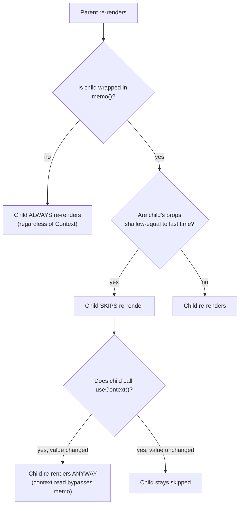

# React Memoization and Context: useMemo, useCallback, useContext

> **Topic register:** F-107 (`useMemo`/`useCallback`: what they actually prevent, when they don't help) and F-108 (`useContext` and the Context API) · Intermediate tier · `00-project/frontend-topic-register.md`
> **Scope note:** per `CLAUDE.md`'s Scope Addendum, this chapter continues at Junior/Mid depth. `useReducer` (F-109) and custom hooks (F-110) are tracked separately as the next batch in this cluster.
> **Provenance:** every claim is verified against a real, running React 19.2.8 + Vite 8.2.1 app at [`practice/frontend/react-memo-and-context/`](../../practice/frontend/react-memo-and-context/), interacted with via a real browser. One demo's first draft contained a genuine modeling mistake, caught by running it and seeing a result that contradicted the intended lesson — documented below as real content, not corrected silently.

## Table of Contents

1. [Learning Objectives](#learning-objectives)
2. [Why This Matters in Interviews](#why-this-matters-in-interviews)
3. [Mental Model](#mental-model)
4. [Definition and Purpose](#definition-and-purpose)
5. [Core Concepts](#core-concepts)
6. [Internal Implementation](#internal-implementation)
7. [Diagrams](#diagrams)
8. [Real Verified Demos](#real-verified-demos)
9. [Production Scenarios](#production-scenarios)
10. [Trade-offs](#trade-offs)
11. [Decision Framework](#decision-framework)
12. [Common Mistakes](#common-mistakes)
13. [Anti-Patterns](#anti-patterns)
14. [Best Practices](#best-practices)
15. [Interview Answer Framework](#interview-answer-framework)
16. [Interview Questions](#interview-questions)
17. [Summary](#summary)
18. [Key Takeaways](#key-takeaways)
19. [Cheat Sheet](#cheat-sheet)
20. [Flashcards](#flashcards)
21. [Practice Exercises](#practice-exercises)
22. [Solutions](#solutions)
23. [Additional Reading](#additional-reading)
24. [Official References](#official-references)

---

## Learning Objectives

By the end of this chapter you can:

- Explain exactly what `useMemo` skips, and prove it with a real recompute counter that only moves when the actual dependency changes.
- Explain why `React.memo` is silently defeated by an inline function or object prop, and fix it with `useCallback`/`useMemo`, with a real before/after render count.
- Use `useContext` to avoid prop drilling, and correctly state what it does and does not do for re-render performance.
- State, from a real reproduced result, the two SEPARATE things needed to stop an unrelated Context consumer from re-rendering — and why either one alone is insufficient.

## Why This Matters in Interviews

`useMemo`/`useCallback` are the most over-used and under-understood hooks in real-world React codebases — candidates who reach for them everywhere "for performance" without being able to explain what they actually prevent are a common and easy-to-spot pattern. `useContext` questions almost always converge on one specific, frequently-wrong claim: "Context causes unnecessary re-renders" stated as if it's Context's fault alone, when the real mechanism involves `memo` too — this chapter's central demo exists specifically to get that exact nuance right, with a real, previously-wrong first attempt corrected in front of you.

## Mental Model

**`useMemo` and `useCallback` are not performance hooks in general — they are referential-equality hooks: they make React return the SAME object/function reference across renders when nothing relevant changed, which only matters because something else downstream (an expensive recomputation, or `React.memo`'s prop comparison) cares about that reference staying stable.** `useContext` is not a performance tool at all — it's a plumbing tool, an alternative to passing props through every intermediate component; whether a Context consumer re-renders unnecessarily is governed by the exact same mechanism as anything else in React (did this component's inputs change?), and `memo` is the only thing that makes "did the value change" the actual question instead of "did the parent re-render."

## Definition and Purpose

**`useMemo(fn, deps)`** returns the memoized result of calling `fn`, only re-invoking `fn` when a value in `deps` has changed since the last render (compared via `Object.is`) — it exists to avoid re-running expensive computations on renders where nothing they depend on actually changed. **`useCallback(fn, deps)`** is the same idea applied to the function itself: it returns the *same function reference* across renders as long as `deps` are unchanged, rather than creating a brand-new function object every render (which JavaScript does by default for any function literal). **`React.memo(Component)`** wraps a component so React skips re-rendering it when its props are shallowly equal to the previous render's props — this is the actual consumer of the reference stability `useCallback`/`useMemo` provide; without a `memo`-wrapped component (or another shallow-equality check) downstream, a stable reference from `useCallback` has no effect on anything. **`useContext(Context)`** reads the current value of a Context from the nearest matching `<Context.Provider>` above it in the tree, re-rendering the reading component whenever that Provider's value changes — it exists to avoid manually threading a value through every intermediate component that doesn't itself need it.

## Core Concepts

### `useMemo` skips recomputation — proven by a counter that lives inside the computation itself

`ExpensiveMemoDemo.jsx` runs the identical expensive `expensiveSumOfSquares` function two ways: once wrapped in `useMemo(() => ..., [n])`, once called plainly on every render. Both increment a `useRef`-based counter *inside the function itself*, giving real ground truth for how many times each version actually ran — not how many times the component rendered.

Real captured sequence: after 2 clicks on an unrelated state update, then 1 click that actually changes `n`, the memoized version's counter moved from 2 (mount) to 4 — incrementing only on the one relevant click. The non-memoized version's counter moved from 2 to 8 — incrementing on every single render, including the two clicks that had nothing to do with it. This is the entire value proposition of `useMemo` in one measured comparison: it is not "faster" in some vague sense, it is *precisely as selective as its dependency array*.

### `React.memo` is defeated by any new reference — including a harmless-looking inline function

`MemoizedChildDemo.jsx` renders two `memo()`-wrapped children. `ChildWithInlineHandler` receives `onClick={() => console.log('clicked A')}` — a fresh arrow function literal, and therefore a fresh function *reference*, on every single parent render. `ChildWithCallbackHandler` receives a `useCallback`-produced handler with an empty dependency array, so it receives the exact same reference every time.

Real captured sequence: after 2 clicks on an unrelated parent re-render trigger, Child A's render count went from 2 to 6 (memo compared old vs. new `onClick` reference, found them unequal every time, and re-rendered anyway — `memo` provided zero benefit). Child B stayed at 2 the entire time — `memo`'s shallow comparison saw the identical function reference and correctly skipped the re-render.

### Prop drilling vs. Context: a structural difference, not a performance one

`PropDrillingVsContextDemo.jsx` delivers the identical `theme` value to a third-level-deep component two ways: through three components that each receive and re-pass a `theme` prop they never use themselves, versus through `useContext(ThemeContext)`, where the two intermediate components (`ContextLevel1`, `ContextLevel2`) never mention `theme` at all. Both approaches deliver the correct value — verified directly, both show `theme` correctly reflecting the live state. The difference is entirely about code structure and maintainability (how many files need to change if a new value needs to reach that same deep component), not about performance — a common, real interview misconception is treating Context as inherently faster or slower than props for this.

### The real re-render cost of Context — and a genuine mistake caught by running the demo

This is the chapter's central result. `ContextRerenderCostDemo.jsx`'s first draft memoized nothing — no consumer was wrapped in `memo()`. Running it produced a real, captured result that contradicted the intended lesson: incrementing an unrelated `count` state re-rendered **every** consumer in **both** a "combined context" scenario and a "split into two contexts" scenario, including consumers that only ever read an unrelated `flag` value that never changed. The context-splitting "fix" appeared to do nothing.

The reason, once diagnosed: by default, **every descendant component re-renders whenever its parent re-renders, entirely independent of Context** — this is React's baseline behavior for any non-memoized component, with or without Context involved at all. Splitting a context into narrower pieces cannot possibly help if nothing downstream is memoized, because the re-render was never caused by the context's value in the first place; it was caused by ordinary parent-to-child re-render propagation.

The fix: wrap every consumer in `memo()`. Re-run, real result: incrementing `count` moved the combined-context `FlagConsumer`'s render count from 2 to 4 (its context's value object — `{ count, flag }` — is a new reference every time `count` changes, so even though `flag` itself didn't change, the *object* did, and `memo` correctly sees a changed prop-equivalent via `useContext`, which bypasses `memo`'s own prop check entirely). The split-context `FlagConsumer`, subscribing only to a `FlagContext` whose value (`flag` alone) genuinely never changed, stayed at render count 2 — completely unaffected by the six other re-renders happening around it in the same interaction.

**Two separate mechanisms, both required together:** `memo()` blocks re-renders caused by a re-rendering *parent*; splitting Context (so a consumer only subscribes to the specific value it actually needs) blocks re-renders caused by an *unrelated field changing inside a shared context value*. Neither one alone is sufficient, and the demo's own first draft is direct proof that the "just split your contexts" advice, given without memoizing consumers, doesn't actually change anything measurable.

## Internal Implementation

`useMemo` and `useCallback` store their last-computed value/function alongside their dependency array in the fiber's hook list; on each render, React compares the new dependency array to the stored one element-by-element via `Object.is`, and only calls the factory function (for `useMemo`) or returns a new reference (for `useCallback`, which internally is a thin wrapper around `useMemo(() => fn, deps)`) if any element differs. `React.memo` wraps a component in a higher-order component that performs a shallow comparison (`Object.is` per prop, one level deep, not deep equality) between the previous and next props objects before deciding whether to bail out of re-rendering that subtree — critically, this comparison is bypassed entirely for any value read via `useContext` inside that component, since a Context read is not a prop and is tracked through a completely separate subscription mechanism tied directly to the nearest `Provider`'s value.

## Diagrams

## Real Verified Demos

All four demos are real, running React 19/Vite code — [`practice/frontend/react-memo-and-context/`](../../practice/frontend/react-memo-and-context/), verified live in a browser via direct DOM reads after real clicks. Full captured numbers in the app's own [README.md](../../practice/frontend/react-memo-and-context/README.md):

- [`ExpensiveMemoDemo.jsx`](../../practice/frontend/react-memo-and-context/src/demos/ExpensiveMemoDemo.jsx) — F-107a, memoized vs. non-memoized recompute counts.
- [`MemoizedChildDemo.jsx`](../../practice/frontend/react-memo-and-context/src/demos/MemoizedChildDemo.jsx) — F-107b, `memo` defeated by an inline handler, fixed by `useCallback`.
- [`PropDrillingVsContextDemo.jsx`](../../practice/frontend/react-memo-and-context/src/demos/PropDrillingVsContextDemo.jsx) — F-108a, structural comparison.
- [`ContextRerenderCostDemo.jsx`](../../practice/frontend/react-memo-and-context/src/demos/ContextRerenderCostDemo.jsx) — F-108b, the chapter's centerpiece: a real modeling mistake (no memoization anywhere) caught by running the demo, then fixed, with both before-and-after real results preserved in the file's own comment and in the README.

## Production Scenarios

**Scenario: a dashboard's sidebar re-renders on every keystroke of an unrelated search box, and the team initially "fixes" it by splitting a Context that was never the actual cause.** A dashboard app has a single `AppStateContext` holding `{ user, searchQuery, sidebarCollapsed }`. Every keystroke in a search input updates `searchQuery`, and the team notices the sidebar (reading only `sidebarCollapsed`) re-renders on every keystroke, causing a visible stutter. The first fix attempted — splitting `AppStateContext` into three separate contexts — has no measurable effect, exactly mirroring this chapter's own first-draft demo, because the `Sidebar` component was never wrapped in `memo()`; it was re-rendering because its parent (which owns all the app state) re-renders on every keystroke, a cause entirely unrelated to Context. The actual fix required both: splitting `sidebarCollapsed` into its own context AND wrapping `Sidebar` in `memo()` — only then did the unrelated keystrokes stop causing sidebar re-renders. The team's initial diagnosis (blaming Context alone) cost a day of ineffective refactoring before profiling with React DevTools' Profiler revealed the real cause.

## Trade-offs

| Concern | `useMemo`/`useCallback` everywhere | Applied selectively | Context (any granularity) |
|---|---|---|---|
| Helps when | A downstream `memo`'d component or genuinely expensive computation depends on reference stability | Same, but without the constant overhead of memoizing cheap values | Avoiding prop drilling through components that don't use the value |
| Costs | Memory for the cached value + a comparison on every render — for cheap computations, this can cost more than the recomputation itself | Requires judgment about what's actually expensive/reference-sensitive | Re-renders every non-memoized consumer on any parent re-render, and every consumer (memoized or not) whose specific context value changed |
| Common mistake | Wrapping every value "for performance" without a `memo`'d consumer or genuine expense downstream — pure overhead, zero benefit | — | Assuming splitting contexts alone fixes re-renders, without memoizing consumers |

## Decision Framework

1. **Is this computation genuinely expensive (measurable, not assumed) AND does something downstream depend on the result not recomputing unnecessarily?** → `useMemo`.
2. **Is this function passed as a prop to a `memo()`-wrapped component (or into another hook's dependency array where reference stability matters)?** → `useCallback`. If neither is true, a plain inline function is simpler and costs nothing meaningful.
3. **Are re-renders of a component actually a measured problem (via React DevTools Profiler), not a guess?** → only then consider `memo()`, and remember it alone doesn't fix Context-driven re-renders of unrelated fields.
4. **Is a value needed by a component several levels deep, with intermediate components that don't use it themselves?** → `useContext`, primarily for code structure — treat any re-render benefit as a separate concern requiring `memo()` and/or context splitting, verified, not assumed.

## Common Mistakes

- Wrapping values in `useMemo`/functions in `useCallback` "for performance" without ever pairing them with a `memo()`'d consumer or a genuinely expensive computation — pure overhead with zero measurable benefit, the most common real-world misuse of both hooks.
- Assuming `React.memo` alone protects a component from Context-driven re-renders — it doesn't; a `useContext` read inside a memoized component still re-renders that component whenever its subscribed context value changes, regardless of the memo wrapper.
- Assuming splitting a Context into narrower pieces fixes unnecessary re-renders on its own, without also memoizing the consuming components — this chapter's own central demo is direct, reproduced proof that this assumption is wrong.
- Passing a fresh object or array literal as a Context's `value` on every render (`<Context.Provider value={{ a, b }}>` without `useMemo`) — even genuinely unrelated context changes elsewhere will look like a "new value" to every consumer, since the object reference itself is new every time.

## Anti-Patterns

- **Memoizing everything reflexively** — treating `useMemo`/`useCallback` as a default habit rather than a response to a measured problem; for cheap computations and components with no `memo()` boundary, this adds real overhead (the comparison itself, plus retained memory) for zero benefit.
- **Splitting Context without memoizing consumers** — the exact mistake this chapter's central demo made and caught; a context-splitting refactor that isn't paired with `memo()` on the consuming components accomplishes nothing measurable.
- **A single giant "app state" Context holding everything** — guarantees that any state change anywhere re-renders every consumer of that context, unless every single consumer is both memoized AND the context is granular enough that unrelated fields don't share a Provider.

## Best Practices

- Reach for `useMemo`/`useCallback` only after identifying an actual expensive computation or a `memo()`-wrapped consumer that needs reference stability — not reflexively.
- When splitting a Context for performance reasons, always pair it with `memo()` on the consuming components — one without the other accomplishes nothing, verified directly in this chapter.
- Keep Context values granular — prefer several narrow contexts (`UserContext`, `ThemeContext`, `SearchContext`) over one large combined state object, specifically because it makes the `memo()`-plus-splitting fix actually effective when needed.
- Use React DevTools' Profiler to confirm a re-render problem is real and measure the fix's actual effect, rather than assuming either the problem or the fix based on intuition.

## Interview Answer Framework

### 30-Second Answer

`useMemo` skips recomputing an expensive value when its dependencies haven't changed; `useCallback` does the same for function references, which matters specifically because it lets `React.memo`'d children skip re-rendering. `useContext` avoids prop drilling but is not itself a performance optimization — a Context consumer re-renders whenever its subscribed value changes, and `memo()` is what's needed on top to stop it from ALSO re-rendering just because its parent did.

### 2-Minute Answer

Walk through `useMemo`/`useCallback` as referential-equality tools whose value only exists in combination with something that cares about that reference (an expensive computation, or a `memo`'d child's prop comparison), with the concrete counter-based proof (memoized: 2→4, non-memoized: 2→8 across the same clicks). Then land on Context: explain that a consumer's re-render has two separate causes — parent re-renders (fixed by `memo()`) and its own subscribed value changing (fixed by splitting contexts) — and that this chapter's own demo initially got this wrong by only fixing one of the two, producing a result that looked like context-splitting "didn't work," until `memo()` was added and the fix became measurable.

### 10-Minute Deep Dive

Cover: the `Object.is`-based dependency comparison shared by `useMemo`/`useCallback`; why `useCallback` is implemented as a thin wrapper over `useMemo`; `React.memo`'s shallow prop comparison and why an inline function/object prop defeats it every time; prop drilling vs. Context as a structural (not performance) choice; the two-mechanism nature of Context re-render costs (parent-propagation vs. subscribed-value-change) with the real before/after numbers from this chapter's central demo; and the concrete production scenario of a team wasting a day "fixing" the wrong cause before profiling revealed the real one.

### Whiteboard Explanation

Draw a tree: `Parent` at top, with a `Provider` wrapping two children, `ConsumerA` and `ConsumerB`. Draw an arrow from `Parent`'s own state to itself re-rendering. From `Parent` re-rendering, draw arrows straight down to both `ConsumerA` and `ConsumerB` labeled "always, unless memo()'d" — this is cause #1, unrelated to Context. Separately, draw an arrow from the `Provider`'s value directly to only `ConsumerA` (say `ConsumerA` reads that specific field), labeled "only if ConsumerA's context read changed" — this is cause #2. The point of the diagram: two arrows into each consumer, two different fixes, and both need addressing for a consumer to actually stay still when unrelated things change.

### Production Example

A dashboard sidebar re-rendered on every keystroke in an unrelated search box; the team's first fix (splitting the shared Context) had no effect because the sidebar wasn't memoized, so it was re-rendering purely because its parent re-rendered on every keystroke — a cause entirely independent of Context. The actual fix required both splitting the context AND wrapping the sidebar in `memo()`.

### Trade-offs to Mention

`useMemo`/`useCallback` cost a comparison and retained memory on every render — free for genuinely expensive computations paired with `memo`'d consumers, pure overhead otherwise. Fine-grained Context splitting improves the ceiling for avoiding unnecessary re-renders but adds more Provider nesting and more pieces to reason about — worth it specifically when paired with memoized consumers that actually benefit, not as a blanket default.

### Common Candidate Mistakes

Claiming "Context causes unnecessary re-renders" as if it's Context's fault alone, without mentioning that a non-memoized consumer would re-render on every parent update regardless of Context; recommending `useMemo`/`useCallback` reflexively without identifying what specifically benefits from the stable reference; not knowing that a `useContext` read inside a `memo()`'d component bypasses the memo comparison entirely when the subscribed value changes.

### Typical Follow-Ups

"You split a Context into two, but a consumer still re-renders on unrelated changes. What did you miss?" (the consumer isn't wrapped in `memo()`, so it's still re-rendering purely because its parent re-renders — context splitting alone doesn't address that cause). "Does `useCallback` make a function 'faster'?" (no — it doesn't change the function's own execution speed at all; it only affects whether the *same reference* is handed to something downstream that compares references, like `memo` or a `useEffect` dependency array). "If a `memo()`'d component reads three different contexts, does it re-render if only one of their values changes?" (yes — a Context read is an independent subscription; any one of the three changing triggers a re-render, regardless of the other two).

### Senior-Level Expectations

For this chapter's Junior/Mid scope: correctly separates the two distinct causes of an unwanted consumer re-render (parent propagation vs. subscribed-value change) and can state which hook/pattern fixes which.

### Staff-Level Discussion

Not the primary target of this chapter, but briefly: at organizational scale, the "split context without memoizing consumers accomplishes nothing" mistake is common enough in real codebases that it's worth a documented team convention (e.g., "any new Context must ship with its primary consumers wrapped in `memo()`, verified via Profiler before merge") rather than relying on each engineer rediscovering it independently — mirroring how this chapter's own first-draft mistake would have shipped as an incorrect lesson if it hadn't been caught by actually running the demo instead of trusting the design on paper.

## Interview Questions

### Question 1

**Question:** "You wrap a component's props-consuming child in `React.memo`, but it still re-renders every time the parent re-renders. What are the two most likely causes, and how would you distinguish them?"

**Expected answer:** Either (1) one of the props being passed is a new reference every render (an inline function, object, or array literal) — fixable with `useCallback`/`useMemo` on the parent side; or (2) the child reads a Context via `useContext` whose value is genuinely changing — this bypasses `memo`'s prop comparison entirely and is not fixable by `memo` alone; it requires splitting the context or memoizing the Provider's value. Distinguish by checking: does the child receive any object/function props (check reference stability), and does it call `useContext` anywhere (check whether that specific context's value is actually changing).

**Common mistakes:** Assuming `memo` alone should always work and concluding it's "broken" rather than checking these two specific causes.

**Follow-up questions:** "If the child reads three different contexts, which one is responsible?" "How would you verify your fix actually worked, rather than assuming it did?"

**Senior-level expectations:** Names both causes unprompted and describes a concrete verification method (Profiler, or a render counter like this chapter's demos).

**Staff-level expectations:** Frames this as a team-convention/documentation problem given how easy it is to fix only half the issue and assume it's resolved.

### Question 2

**Question:** "What's the actual difference between `useMemo` making a component 'faster' and what it really does?"

**Expected answer:** `useMemo` doesn't make anything intrinsically faster — it skips re-running a computation when its dependencies are unchanged, returning a cached previous result instead. Whether that translates into a perceptible speed improvement depends entirely on whether the computation was actually expensive and whether it would have re-run unnecessarily without memoization. For a cheap computation, the memoization overhead (dependency comparison, cache storage) can exceed the cost of just recomputing it.

**Common mistakes:** Treating `useMemo` as a general performance switch to flip on, rather than a targeted tool with its own real cost.

**Follow-up questions:** "How would you decide whether a given computation is worth memoizing?" (measure it — React DevTools Profiler or a simple timing check, not intuition).

**Senior-level expectations:** States the overhead trade-off unprompted, not just the skip-recomputation mechanism.

**Staff-level expectations:** Not the focus of this chapter's scope.

## Summary

`useMemo` and `useCallback` are referential-equality tools whose value is entirely conditional on something downstream caring about that stability — an expensive computation, or `React.memo`'s shallow comparison — proven here with a real recompute counter that only moved on the relevant change. `useContext` is fundamentally a structural tool for avoiding prop drilling, not a performance mechanism, and a Context consumer's unnecessary re-renders have two genuinely separate causes (parent propagation and subscribed-value changes) that require two separate fixes (`memo()` and context splitting) — a fact this chapter's own first-draft demo initially got wrong by fixing only one, producing a real, captured result that contradicted the intended lesson until the mistake was found and corrected.

## Key Takeaways

- `useMemo`'s value is conditional: verified directly, a memoized computation's counter moved only on its actual dependency change (2→4), while an unmemoized version moved on every render (2→8) across the identical sequence of clicks.
- `React.memo` is defeated by any new prop reference, including a harmless-looking inline arrow function — verified directly (6 vs. 2 render counts across the same clicks).
- Context re-render cost has two separate causes — parent propagation (fixed by `memo()`) and subscribed-value change (fixed by splitting contexts) — and fixing only one, verified directly, accomplishes nothing measurable on its own.
- A `useContext` read inside a `memo()`'d component bypasses `memo`'s prop comparison entirely; the component still re-renders whenever that specific context's value changes.

## Cheat Sheet

- **`useMemo(fn, deps)`**: skips recomputing `fn`'s result when `deps` unchanged. Only useful if the computation is genuinely expensive OR the result's reference stability matters downstream.
- **`useCallback(fn, deps)`**: same idea for function references. Only useful paired with `memo()` or another reference-sensitive consumer (e.g., an effect's dependency array).
- **`React.memo(Component)`**: skips re-render if props are shallowly equal. Bypassed entirely by `useContext` reads inside the component.
- **`useContext`**: structural tool, not a performance one. Re-renders on its own subscribed value changing, independent of `memo`.
- **Unwanted consumer re-render, two causes**: (1) non-memoized + parent re-rendered → fix with `memo()`. (2) subscribed context value changed → fix by splitting contexts. Both often needed together.

## Flashcards

## Card: Two causes of Context re-renders

**Prompt:**
A memo()'d Context consumer still re-renders when an unrelated field changes. What's the likely context-related cause?

**Answer:**
The context's value is a single combined object; even though the specific field the consumer reads didn't change, the object REFERENCE did (recreated on every render, or because a sibling field changed) — `useContext` sees a "new" value and re-renders regardless of `memo`.

**Why it matters:**
This chapter's central, real, caught modeling mistake — verified with real before/after render counts.

**Common trap:**
Assuming `memo()` alone should have prevented this.

**Related:**
[[react-usememo-usecallback-and-usecontext]]

## Card: useCallback without memo

**Prompt:**
Does wrapping a function in useCallback help if the component receiving it as a prop isn't wrapped in React.memo?

**Answer:**
No — with no `memo()` boundary, the child re-renders whenever its parent re-renders regardless of prop reference stability. `useCallback` alone provides zero measurable benefit without a `memo`'d consumer.

**Why it matters:**
The single most common real-world misuse of `useCallback`.

**Common trap:**
Treating `useCallback` as inherently beneficial rather than conditionally useful.

**Related:**
[[react-usememo-usecallback-and-usecontext]]

## Practice Exercises

1. In `ContextRerenderCostDemo.jsx`, remove `memo()` from just `FlagConsumerSplit` (leave everything else as-is) and predict, before running it, what its render count will do when "Increment count" is clicked.
2. In `MemoizedChildDemo.jsx`, change `ChildWithCallbackHandler`'s `useCallback` dependency array from `[]` to include a value that changes on every render (e.g., a fresh object literal). Predict whether `memo` still helps.
3. In `ExpensiveMemoDemo.jsx`, reduce `n`'s initial value from 2,000,000 to 10. Explain, in terms of this chapter's own trade-off discussion, whether `useMemo` is still worth using at that scale.

## Solutions

Exercise 1: without `memo()`, `FlagConsumerSplit` reverts to re-rendering on every parent re-render regardless of Context — clicking "Increment count" would make its render count climb (matching `CountConsumerSplit`'s count) instead of staying fixed, exactly reproducing the demo's own original, uncorrected mistake in miniature.

Exercise 2: adding an always-changing dependency to `useCallback`'s array makes it return a NEW function reference every render, identical in effect to not using `useCallback` at all — `memo` would then see a changed prop every time and stop helping, matching Child A's original (unfixed) behavior.

Exercise 3: at `n = 10`, the computation is trivially cheap — the overhead of `useMemo`'s own dependency comparison and cached-value storage very likely costs more than just recomputing the sum directly. This is a real instance of this chapter's own "memoizing everything reflexively" anti-pattern; the honest answer is that `useMemo` is not worth using here, and demonstrating that judgment is itself the point of the exercise.

## Additional Reading

- [React Hooks: useEffect and useRef](react-hooks-useeffect-and-useref.md) — this chapter's prerequisite.
- [00-project/frontend-topic-register.md](../../00-project/frontend-topic-register.md) — the full register this chapter is F-107–108 of.

## Official References

- [react.dev: useMemo](https://react.dev/reference/react/useMemo)
- [react.dev: useCallback](https://react.dev/reference/react/useCallback)
- [react.dev: useContext](https://react.dev/reference/react/useContext)
- [react.dev: memo](https://react.dev/reference/react/memo)
