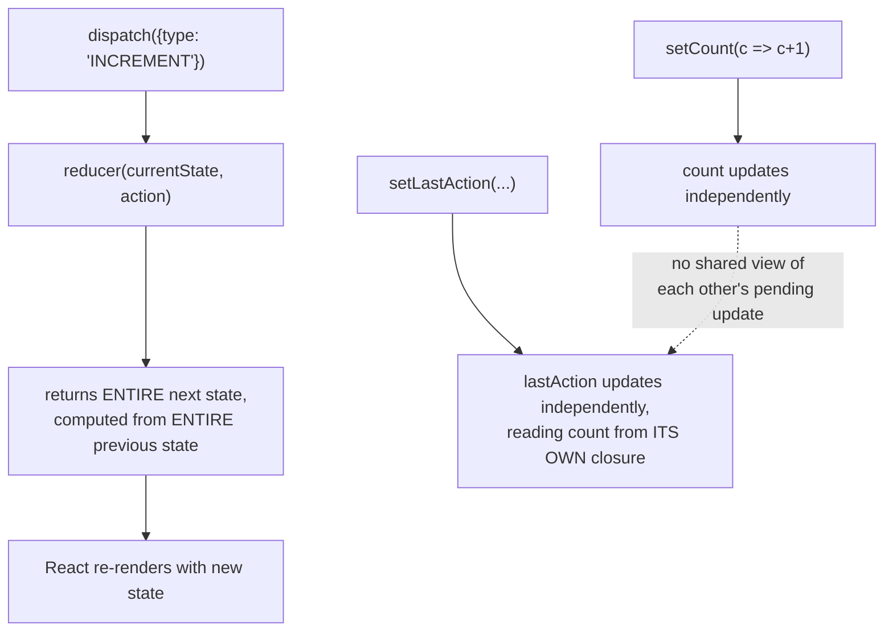

# React useReducer and Custom Hooks

> **Topic register:** F-109 (`useReducer`, when it beats `useState`) and F-110 (custom hooks: design, naming, composition rules) · Intermediate tier · `00-project/frontend-topic-register.md`
> **Scope note:** per `CLAUDE.md`'s Scope Addendum, this chapter continues at Junior/Mid depth and closes out the full "React Hooks" cluster (F-105 through F-110) started in `react-hooks-useeffect-and-useref.md`. The next frontend batch moves into component patterns (F-111) and beyond.
> **Provenance:** every claim is verified against a real, running React 19.2.8 + Vite 8.2.1 app at [`practice/frontend/react-reducer-and-custom-hooks/`](../../practice/frontend/react-reducer-and-custom-hooks/). Both `useReducer` bugs in this chapter were made deterministic by design (not timing-dependent), and the debounce demo captured all three states of its lifecycle — immediate, mid-flight lagging, and settled — not just a before/after snapshot.

## Table of Contents

1. [Learning Objectives](#learning-objectives)
2. [Why This Matters in Interviews](#why-this-matters-in-interviews)
3. [Mental Model](#mental-model)
4. [Definition and Purpose](#definition-and-purpose)
5. [Core Concepts](#core-concepts)
6. [Internal Implementation](#internal-implementation)
7. [Diagrams](#diagrams)
8. [Real Verified Demos](#real-verified-demos)
9. [Production Scenarios](#production-scenarios)
10. [Trade-offs](#trade-offs)
11. [Decision Framework](#decision-framework)
12. [Common Mistakes](#common-mistakes)
13. [Anti-Patterns](#anti-patterns)
14. [Best Practices](#best-practices)
15. [Interview Answer Framework](#interview-answer-framework)
16. [Interview Questions](#interview-questions)
17. [Summary](#summary)
18. [Key Takeaways](#key-takeaways)
19. [Cheat Sheet](#cheat-sheet)
20. [Flashcards](#flashcards)
21. [Practice Exercises](#practice-exercises)
22. [Solutions](#solutions)
23. [Additional Reading](#additional-reading)
24. [Official References](#official-references)

---

## Learning Objectives

By the end of this chapter you can:

- Reproduce, deterministically, two real bug classes that `useReducer` structurally prevents and several `useState` calls don't: an incomplete reset, and a value derived from stale state during a rapid double-update.
- State precisely when `useReducer` is the better choice over multiple `useState` calls, and when it's unnecessary complexity.
- Write a custom hook following the naming and composition rules React itself relies on to recognize it as a hook.
- Explain why a custom hook's state is per-calling-instance, not shared globally — and extract a genuinely reusable piece of logic (debouncing) from this cluster's own `useEffect` material into one.

## Why This Matters in Interviews

`useReducer` questions are a reliable filter for whether a candidate has actually hit the specific pain points that make multiple `useState` calls awkward, versus reciting "useReducer is for complex state" without being able to name a concrete failure mode. Custom hooks are where a candidate's understanding of every other hook gets tested at once — a well-designed custom hook demonstrates working knowledge of the Rules of Hooks, dependency arrays, and cleanup, all in one artifact; a bad one (missing cleanup, wrong naming, hidden global state) reveals gaps just as clearly.

## Mental Model

**`useReducer` exists for exactly one structural reason: it gives you one place — the reducer function — where the ENTIRE next state is computed from the ENTIRE previous state and one action, atomically; several independent `useState` calls give you several independent places, each of which only sees its own previous value, which is exactly where bugs creep in the moment two pieces of state need to agree with each other.** A custom hook is not a new kind of thing — it's just a plain JavaScript function that happens to call other hooks, and it inherits its state-per-instance behavior directly from whichever underlying hook (`useState`, `useReducer`, etc.) it's built on, which is why "does calling this hook twice share state?" always reduces to "no, for the same reason two `<Counter />` instances don't."

## Definition and Purpose

**`useReducer(reducer, initialState)`** returns `[state, dispatch]`, where `state` is the current value and `dispatch(action)` triggers `reducer(currentState, action)` to compute the next state — it exists as an alternative to `useState` specifically for state whose updates are better expressed as a fixed set of named transitions ("actions") than as ad-hoc setter calls, and for state where one field's new value legitimately depends on another field's new value in the same update. **A custom hook** is any function whose name starts with `use` and which itself calls one or more built-in (or other custom) hooks — it exists purely for code reuse: extracting a piece of stateful logic (not just a pure computation, which a plain function would suffice for) so it can be used identically across multiple components, each getting its own independent instance of that logic's state.

## Core Concepts

### The reset bug: `useReducer`'s reset can't forget a field, because it doesn't enumerate fields

`FormResetBugDemo.jsx` builds the identical three-field form two ways. The `useState` version's reset handler must explicitly call each field's setter — real, captured proof: after filling `phone` with sample data and clicking Reset, the `useState` version left `phone: "555-0100"` behind (the reset handler, written before `phone` was added to the component, was never updated). The `useReducer` version's `RESET` action simply returns `initialFormState` — the object that already defines every field — so clicking Reset there correctly cleared `phone` along with everything else. This isn't a coincidence of careful coding; it's structural: there is no separate "list of fields to reset" for a reducer's `RESET` case to have forgotten.

### The stale-derivation bug: two `useState` setters in one handler can't see each other's pending updates

`CounterStaleReadDemo.jsx` derives `lastAction` from `count` inside the same click handler that updates `count`. The bug is made deterministic (not dependent on click timing, which is unreliable to control precisely via browser automation) by calling the increment logic twice within one handler — both calls share the same closure, guaranteeing staleness on the very first click. Real captured result: the `useState` version showed `count: 2` but `lastAction: "incremented to 1"` — wrong, because both calls' `setLastAction` read the SAME closed-over `count` value from before either call ran. The `useReducer` version showed `count: 2, lastAction: "incremented to 2"` — correct, because each `dispatch` call's reducer invocation receives the actual latest state (React applies queued reducer calls sequentially, each building on the previous one's result), with no closure involved at all.

### Custom hooks are ordinary functions with one convention that unlocks real tooling

`hooks/useToggle.js` is nine lines: a `useState` plus a `useCallback`-wrapped toggler, returned as a pair. The `use` naming prefix isn't stylistic — it's how both the React runtime's internal hook-call bookkeeping and the `eslint-plugin-react-hooks` linter recognize this function as subject to the Rules of Hooks (must be called unconditionally, at the top level, only from components or other hooks). `UseToggleDemo.jsx` renders two `<Panel />` components each calling `useToggle(false)` independently — real captured proof: toggling Panel A produced `Panel A: OPEN, Panel B: CLOSED`, confirming the hook's state lives with each calling component instance, not with the `useToggle` function itself (the same instance-vs-definition lesson from `react-fundamentals-jsx-components-props-and-state.md`'s `useState` counters, now shown to apply identically to custom hooks built on top).

### A genuinely useful custom hook: extracting debounce logic already covered elsewhere in this cluster

`hooks/useDebouncedValue.js` wraps the exact `useEffect` setup-and-cleanup pattern from `react-hooks-useeffect-and-useref.md` (a `setTimeout` cleaned up via `clearTimeout`) into one reusable unit. `DebouncedSearchDemo.jsx` captured all three states of its lifecycle in one real sequence: typing produced an immediate `raw` value update; reading the DOM with zero wait immediately after a second burst of typing showed `debounced` still holding the PREVIOUS value (genuinely lagging, not yet committed); after a further 1-second wait, `debounced` caught up and the commit counter (which only increments when the debounced value actually changes) moved from 1 to 2 — proving a whole burst of rapid changes produces exactly one debounced commit, not one per keystroke.

## Internal Implementation

`useReducer` is not a fundamentally different mechanism from `useState` internally — in React's source, `useState` is implemented as a thin wrapper around a reducer that just replaces the entire state with whatever is passed to its setter (a "replace" reducer). The real difference is where the state-transition logic lives: with `useReducer`, it lives in one named function outside the component, testable in isolation and exhaustively enumerable (`switch` cases), whereas with several `useState` calls, transition logic is scattered across however many event handlers touch that state, each capable of drifting out of sync with the others as the component grows. A custom hook has no special runtime representation at all — when a component calls `useToggle()`, React's hook-call bookkeeping (a linked list per fiber, in call order) simply sees the `useState` and `useCallback` calls INSIDE `useToggle` as if they were called directly in the component, at that exact position in the sequence — which is precisely why the Rules of Hooks (no conditional hook calls) apply transitively through any custom hook exactly as they do to built-in ones.

## Diagrams

## Real Verified Demos

All four demos are real, running React 19/Vite code — [`practice/frontend/react-reducer-and-custom-hooks/`](../../practice/frontend/react-reducer-and-custom-hooks/), verified live via direct DOM reads. Full captured sequences in the app's own [README.md](../../practice/frontend/react-reducer-and-custom-hooks/README.md):

- [`FormResetBugDemo.jsx`](../../practice/frontend/react-reducer-and-custom-hooks/src/demos/FormResetBugDemo.jsx) — F-109a, a real, reproduced incomplete-reset bug.
- [`CounterStaleReadDemo.jsx`](../../practice/frontend/react-reducer-and-custom-hooks/src/demos/CounterStaleReadDemo.jsx) — F-109b, a deterministic (not timing-dependent) stale-derivation bug.
- [`hooks/useToggle.js`](../../practice/frontend/react-reducer-and-custom-hooks/src/hooks/useToggle.js) + [`UseToggleDemo.jsx`](../../practice/frontend/react-reducer-and-custom-hooks/src/demos/UseToggleDemo.jsx) — F-110a, custom hook instance isolation.
- [`hooks/useDebouncedValue.js`](../../practice/frontend/react-reducer-and-custom-hooks/src/hooks/useDebouncedValue.js) + [`DebouncedSearchDemo.jsx`](../../practice/frontend/react-reducer-and-custom-hooks/src/demos/DebouncedSearchDemo.jsx) — F-110b, a real custom hook, all three lifecycle states captured.

## Production Scenarios

**Scenario: a multi-step checkout form silently ships stale totals after a promo code is applied.** A checkout form tracks `subtotal`, `discount`, and `total` as three separate `useState` values. When a promo code is applied, the handler calls `setDiscount(newDiscount)` and, on the next line, `setTotal(subtotal - discount)` — reading `discount` from the closure, which still holds the OLD value at that point in the same handler, exactly mirroring this chapter's `CounterStaleReadDemo`. The displayed total is correct-looking (it was already correct before the promo code) until the NEXT re-render triggered by anything else finally recomputes it — meaning a user who applies a promo code and immediately screenshots or completes checkout in a fast flow can see a total that hasn't caught up, an intermittent, timing-dependent bug that's hard to reproduce in manual QA. The fix: consolidate `subtotal`, `discount`, and `total` into one `useReducer`, where a single `APPLY_PROMO` action computes all three consistently from the previous state in one step.

## Trade-offs

| Concern | Several `useState` calls | `useReducer` |
|---|---|---|
| Simple, independent fields | Simple, direct, no boilerplate | Overkill — a reducer with one field and one action type is unnecessary ceremony |
| Fields that must update together consistently | Error-prone — each setter only sees its own previous value | Correct by construction — one function computes the whole next state |
| Reset / "return to a known state" | Must enumerate every field in the reset handler, easy to forget a new one | Trivial and complete — `return initialState` |
| Testability of transition logic | Scattered across event handlers | One pure function, easily unit-tested in isolation |

## Decision Framework

1. **Are the state fields genuinely independent (changing one never needs to consider another's current value)?** → `useState`, one per field, is simpler.
2. **Does any update need to read another field's CURRENT or JUST-CHANGING value to compute correctly?** → `useReducer` — this is the exact bug class this chapter reproduces.
3. **Does "reset to initial" or "reset to a known state" need to be reliably complete as the component grows new fields over time?** → `useReducer`'s `initialState`-returning reset is structurally safer than a hand-maintained list.
4. **Is a piece of stateful logic (not just a computation) needed identically in more than one component?** → extract a custom hook; if it's just a pure calculation with no hooks inside, a plain function suffices and doesn't need the `use` prefix or Rules-of-Hooks treatment at all.

## Common Mistakes

- Reaching for `useReducer` reflexively for simple, independent state — it adds real ceremony (action types, a switch statement) with no benefit over `useState` when fields don't need to interact.
- Deriving one piece of `useState`-managed state from another inside the same handler without realizing both setters see independent, potentially-stale closures — the exact bug reproduced deterministically in this chapter.
- Forgetting to update every `useState`-based "reset" handler when a new field is added to a form or similar multi-field component.
- Naming a function `use...` when it doesn't actually call any hooks internally (or, the reverse: calling hooks inside a function that ISN'T named `use...`, which the linter can't verify follows the Rules of Hooks).

## Anti-Patterns

- **A giant reducer handling completely unrelated pieces of state "for consistency"** — reducers are for state that genuinely needs to update together; forcing unrelated state into one reducer just to have "one useReducer" trades independent-field simplicity for unnecessary coupling.
- **A custom hook that secretly shares state across all its call sites** (e.g., via a module-level variable instead of `useState`) — silently breaks the fundamental expectation (proven in this chapter and throughout this cluster) that each call site gets independent state; a legitimate exception is a hook deliberately built for cross-component shared state (e.g., wrapping a Context), which should be named and documented as such explicitly.
- **A custom hook without cleanup for anything it subscribes to or schedules** — the exact `useEffect` mistake covered in `react-hooks-useeffect-and-useref.md` doesn't go away just because the effect is now hidden inside a custom hook; if anything it's more dangerous, since the leak is one layer removed from the component using it.

## Best Practices

- Reach for `useReducer` the moment two or more pieces of related state need to change together consistently, or when a form/component's "reset" needs to reliably stay complete as fields are added.
- Name custom hooks with the `use` prefix always, and only when they actually call other hooks — this is what makes the Rules-of-Hooks linter actually protect the function.
- Keep custom hooks focused on one piece of reusable logic (`useToggle`, `useDebouncedValue`) rather than bundling multiple unrelated concerns into one hook.
- When extracting a custom hook from existing component logic, preserve the same cleanup discipline the logic already had (or should have) as a plain `useEffect` — extraction doesn't relax that requirement.

## Interview Answer Framework

### 30-Second Answer

`useReducer` consolidates state transitions into one function that computes the entire next state from the entire previous state and an action — useful specifically when multiple `useState` calls would need to reference each other's just-updated values, which they structurally can't do safely. A custom hook is just a function starting with `use` that calls other hooks internally, existing purely for reuse — each calling component gets its own independent instance of that hook's state, exactly like any other hook.

### 2-Minute Answer

Walk through the reset-bug demo (a `useState`-based reset handler forgetting a newly-added field vs. a reducer's complete `initialState`-returning reset) and the stale-derivation demo (two setters in one handler, one reading the other's pre-update closure value, made deterministic via a double-call rather than relying on click timing). Then define a custom hook precisely: a `use`-prefixed function calling other hooks, whose state lives per calling instance — demonstrated with two independent `useToggle` panels — and give one genuinely useful example (`useDebouncedValue`, reusing the cluster's own `useEffect` cleanup pattern) with its full captured lifecycle: immediate raw update, transient lag, single settled commit.

### 10-Minute Deep Dive

Cover: why `useState` is internally a special case of a reducer (a "replace" reducer), and what that implies about when `useReducer`'s extra structure actually earns its keep; the precise mechanism of the stale-derivation bug (each `useState` setter's functional-update form only sees ITS OWN prior value, never a sibling setter's pending change, whereas a reducer's dispatched actions apply sequentially against the true latest state); the Rules of Hooks and why the `use` naming convention is load-bearing for tooling, not just style; and a full custom-hook example (`useDebouncedValue`) built directly on the effect-cleanup material from the previous chapter in this cluster, with real captured evidence of all three states in its lifecycle (immediate, lagging, settled).

### Whiteboard Explanation

Draw two boxes side by side: "useState A" and "useState B", each with its own arrow labeled "sees only its own previous value." Draw a dotted line between them labeled "NO visibility into each other's pending update." Below, draw a single box "reducer(state, action)" with ONE arrow in (full previous state + action) and ONE arrow out (full next state) — label it "one function, one atomic computation, both fields agree by construction."

### Production Example

A checkout form's `subtotal`/`discount`/`total` tracked as three separate `useState` values; applying a promo code reads `discount` from a stale closure while computing `total` in the same handler, producing an intermittent, hard-to-reproduce stale-total bug in fast checkout flows — fixed by consolidating the three fields into one `useReducer` with a single `APPLY_PROMO` action.

### Trade-offs to Mention

`useReducer` adds real ceremony (action types, a switch statement, dispatch calls instead of direct setters) that's wasted overhead for genuinely independent state — it earns its complexity specifically when fields need to agree with each other or when reset-completeness matters as a component grows. Custom hooks add a layer of indirection that's worth it for logic reused across 2+ components, but extracting a hook used in exactly one place purely for "organization" can make the logic harder to trace, not easier.

### Common Candidate Mistakes

Recommending `useReducer` as a blanket "better" choice without naming the specific structural reason (cross-field consistency, complete resets); not knowing that `useState`'s functional updater form doesn't solve cross-setter staleness (it only solves same-setter staleness across rapid calls to the SAME setter); assuming a custom hook automatically shares state across every component that calls it, rather than giving each call site its own instance.

### Typical Follow-Ups

"If `setCount(c => c+1)`'s functional form fixes staleness for `count` itself, why doesn't it fix `lastAction` in this chapter's demo?" (because `lastAction`'s update reads `count` from the render closure directly, not through a functional updater on `count`'s own setter — the functional form only protects the SAME piece of state across rapid updates to itself, not a DIFFERENT piece of state derived from it). "Can two components using the same custom hook communicate with each other through it?" (not by default — each call site gets independent state; shared cross-component state requires the hook to be explicitly built on top of Context or an external store, and should be named/documented to make that non-default behavior obvious).

### Senior-Level Expectations

For this chapter's Junior/Mid scope: correctly identifies which specific structural property of `useReducer` (atomic whole-state computation) fixes each bug demonstrated, rather than a vague "reducers are more organized" answer.

### Staff-Level Discussion

Not the primary target of this chapter, but briefly: at organizational scale, a shared library of well-tested custom hooks (`useDebouncedValue`, `useToggle`, and similar) is a common, effective way to prevent the exact bug classes covered in this entire hooks cluster (missing cleanup, stale closures, incomplete resets) from being independently rediscovered and re-fixed by every team — the same argument this repository's Java-backend material makes for CI-enforceable policy over case-by-case vigilance, applied to a frontend team's internal hooks package instead of a lint rule.

## Interview Questions

### Question 1

**Question:** "You have `const [subtotal, setSubtotal] = useState(...)` and `const [total, setTotal] = useState(...)`, and one handler does `setSubtotal(newValue); setTotal(newValue - discount);`. What's the bug, and how would useReducer fix it?"

**Expected answer:** `discount` (and potentially `subtotal` itself, depending on what else reads it) is read from the handler's closure — if this same handler needs to reflect a value that was ALSO just updated in this same call (e.g., if `discount` were being updated here too), the read would be stale, since neither setter has any visibility into the other's pending update. A `useReducer` combining `subtotal`, `discount`, and `total` into one state object, updated via a single dispatched action, computes all three from the true previous state in one atomic step, with no cross-setter staleness possible.

**Common mistakes:** Assuming `setTotal`'s functional updater form (`setTotal(t => ...)`) would fix this — it wouldn't, because the staleness is about reading `discount`/`subtotal` from the closure, not about `total`'s own previous value.

**Follow-up questions:** "Would wrapping both `setSubtotal` and `setTotal` calls in functional updater form fix this?" (no — functional updaters only protect a setter's OWN value across rapid calls to itself, not visibility into a sibling setter's pending change). "How would you verify your fix actually works?" (a deterministic reproduction like this chapter's double-call pattern, not relying on click timing).

**Senior-level expectations:** Correctly rejects the "just use functional updates" false fix and explains why it doesn't address this specific bug.

**Staff-level expectations:** Frames this as a case for a shared, tested custom hook or reducer pattern across a team's forms, not a one-off fix.

### Question 2

**Question:** "What makes a function a 'hook,' technically? Is it just the `use` prefix?"

**Expected answer:** The `use` prefix is a NAMING convention that React's tooling (and to some extent, React itself, in newer versions, for certain checks) relies on to apply the Rules of Hooks — but what actually makes it behave like a hook is that it calls other hooks internally (`useState`, `useEffect`, etc.), which is what ties it into React's per-fiber, per-call-order hook bookkeeping. A function named `useFoo` that calls no hooks internally is just a regular function with a misleading name; the linter can't meaningfully check it, and it doesn't need to follow the Rules of Hooks at all.

**Common mistakes:** Treating the `use` prefix as the mechanism itself, rather than as a convention that lets tooling recognize a function that already, structurally, needs the Rules of Hooks applied to it.

**Follow-up questions:** "Does a custom hook need to return anything specific?" (no — it can return anything, or nothing; `useToggle` returns a pair, `useDebouncedValue` returns a single value, both are equally valid).

**Senior-level expectations:** Distinguishes naming convention from mechanism unprompted.

**Staff-level expectations:** Not the focus of this chapter's scope.

## Summary

`useReducer` and custom hooks both extend the same core lesson this entire hooks cluster has built toward: React's hooks give each component instance its own independent, well-scoped state, and the specific hook you reach for should match the actual shape of the problem — `useReducer` when updates need to agree with each other atomically (proven here with two deterministic, real bugs that plain `useState` can't structurally prevent), and a custom hook when a genuine piece of reusable stateful logic (not just a pure calculation) needs to exist identically across multiple components, each still getting its own independent copy.

## Key Takeaways

- `useReducer`'s reset is structurally complete (`return initialState`) where a `useState`-based reset handler must be manually kept in sync with every field — verified directly with a real, reproduced incomplete-reset bug.
- Two `useState` setters updating together in one handler can't safely read each other's just-requested new values; `useReducer`'s single reducer function can, because it receives the true previous state directly — verified with a deterministic (not timing-dependent) double-update reproduction.
- A custom hook's state lives per calling component instance, exactly like `useState` itself — verified directly with two independent `useToggle` panels.
- A well-designed custom hook (`useDebouncedValue`) can extract and reuse a real `useEffect` pattern (setup + cleanup) from elsewhere in the same codebase — verified with all three states of its lifecycle captured in one real sequence: immediate, lagging, settled.

## Cheat Sheet

- **`useReducer`**: use when state fields must update together consistently, or when "reset to known state" needs to stay complete as fields grow. Overkill for simple, independent fields.
- **Reset bug**: `useState` reset handlers must list every field manually; `useReducer`'s reset is just `return initialState`.
- **Stale-derivation bug**: a `useState` setter's functional form only protects ITS OWN value, never a sibling setter's pending update — `useReducer` fixes this because the reducer sees the true previous state directly.
- **Custom hook**: a `use`-prefixed function calling other hooks; state is per-calling-instance, same as any other hook, unless deliberately built on Context/external store for sharing.
- **Rules of Hooks**: apply transitively through custom hooks — no conditional calls, top-level only.

## Flashcards

## Card: useReducer vs. useState for related fields

**Prompt:**
Why can useReducer correctly derive one field from another during the same update, when two separate useState setters can't?

**Answer:**
A reducer receives the FULL previous state as an argument and computes the FULL next state in one function call — no closures involved. Two useState setters each only see their own previous value; neither has visibility into the other's pending update in the same handler.

**Why it matters:**
Verified with a real, deterministic double-update reproduction: useState version showed count=2 but lastAction="incremented to 1" (wrong); useReducer version showed count=2, lastAction="incremented to 2" (correct).

**Common trap:**
Assuming a functional setState updater (`setX(x => ...)`) fixes cross-field staleness — it only fixes same-field staleness.

**Related:**
[[react-usereducer-and-custom-hooks]]

## Card: Custom hook naming convention

**Prompt:**
What actually makes a function behave as a React hook — is the `use` prefix itself the mechanism?

**Answer:**
No — the prefix is a naming CONVENTION that lets tooling (the Rules-of-Hooks linter) and React recognize the function as one that calls other hooks internally. The actual mechanism is that it calls hooks like useState/useEffect, tying it into React's per-fiber hook-call bookkeeping.

**Why it matters:**
A `useFoo` function that calls no hooks is just a regular function with a misleading name — no Rules-of-Hooks protection applies or is needed.

**Common trap:**
Treating the naming convention as the mechanism itself.

**Related:**
[[react-usereducer-and-custom-hooks]]

## Practice Exercises

1. In `FormResetBugDemo.jsx`, add a fourth field (`company`) to both the `useState` version (as a new `useState` call) and the `useReducer` version (as a new key in `initialFormState`). Predict, before running it, whether Reset correctly clears `company` in each version.
2. In `CounterStaleReadDemo.jsx`, change `StateBasedCounter`'s `incrementOnce` to use a functional updater for `lastAction` too (`setLastAction(la => ...)`) instead of reading `count` directly. Explain why this does NOT fix the bug.
3. Write a new custom hook, `usePrevious(value)`, that returns the value from the PREVIOUS render (using a `useRef` updated in a `useEffect`). Use it in a small demo showing a value alongside its previous render's value.

## Solutions

Exercise 1: the `useState` version's Reset still won't clear `company` (the handler wasn't updated to call a `setCompany('')` that doesn't exist yet in the reset function, reproducing the same bug class with the new field) — this is exactly the point of the exercise, demonstrating the bug generalizes to any newly-added field, not just `phone`. The `useReducer` version correctly clears `company` automatically, since it's now part of `initialFormState`, which `RESET` already returns wholesale.

Exercise 2: `setLastAction(la => ...)` only gives access to `lastAction`'s OWN previous value inside the updater — it still has no way to read `count`'s pending new value, since that's a completely separate piece of state managed by a separate `useState` call. The bug is about `lastAction` needing to know something about `count`, not about `lastAction`'s own staleness, so a functional updater on `lastAction` alone cannot fix it — only combining both fields into one reducer (or otherwise passing the ACTUAL new count value into the `setLastAction` call directly) can.

Exercise 3: `usePrevious` would be roughly `function usePrevious(value) { const ref = useRef(); useEffect(() => { ref.current = value; }); return ref.current; }` — on each render, it returns whatever `ref.current` was set to during the PREVIOUS render's effect (since the effect runs after render, but reads happen during render, `ref.current` always lags by exactly one render), a real, minimal example of a genuinely useful, small custom hook reusing this cluster's `useRef`/`useEffect` material directly.

## Additional Reading

- [React Hooks: useEffect and useRef](react-hooks-useeffect-and-useref.md) — cleanup discipline reused directly in `useDebouncedValue`.
- [React Memoization and Context](react-usememo-usecallback-and-usecontext.md) — this chapter's prerequisite.
- [00-project/frontend-topic-register.md](../../00-project/frontend-topic-register.md) — the full register this chapter is F-109–110 of; closes the React Hooks cluster (F-105–110).

## Official References

- [react.dev: useReducer](https://react.dev/reference/react/useReducer)
- [react.dev: Reusing Logic with Custom Hooks](https://react.dev/learn/reusing-logic-with-custom-hooks)
