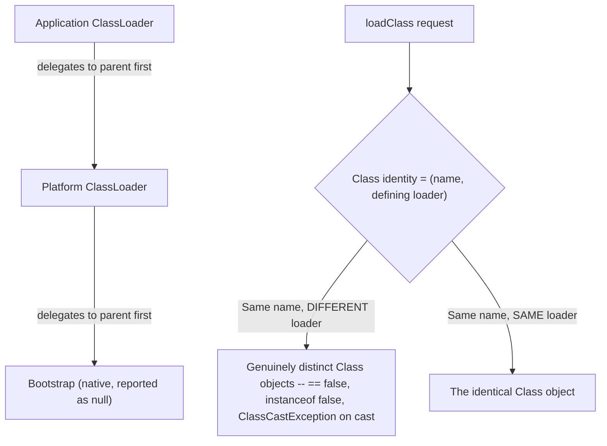

# ClassLoaders and Class Initialization

> **Topic register:** T-114 · IWI 4.6 · Advanced tier · Moderate interview frequency [M]
> **Provenance:** all evidence in this chapter is real, executed output from
> [`practice/java/java-core/classloaders-and-class-initialization/`](../../practice/java/java-core/classloaders-and-class-initialization/README.md)
> (OpenJDK 21.0.12), including a real `ClassCastException` between two loads of the identical class.

## Table of Contents

1. [Learning Objectives](#learning-objectives)
2. [Why This Matters in Interviews](#why-this-matters-in-interviews)
3. [Mental Model](#mental-model)
4. [Definition and Purpose](#definition-and-purpose)
5. [Core Concepts](#core-concepts)
6. [Internal Implementation](#internal-implementation)
7. [Diagrams](#diagrams)
8. [Production Scenarios](#production-scenarios)
9. [Trade-offs](#trade-offs)
10. [Decision Framework](#decision-framework)
11. [Common Mistakes](#common-mistakes)
12. [Anti-Patterns](#anti-patterns)
13. [Best Practices](#best-practices)
14. [Interview Answer Framework](#interview-answer-framework)
15. [Interview Questions](#interview-questions)
16. [Summary](#summary)
17. [Key Takeaways](#key-takeaways)
18. [Cheat Sheet](#cheat-sheet)
19. [Flashcards](#flashcards)
20. [Practice Exercises](#practice-exercises)
21. [Solutions](#solutions)
22. [Additional Reading](#additional-reading)
23. [Official References](#official-references)

---

## Learning Objectives

By the end of this chapter you can:

- Explain the real classloader hierarchy (bootstrap/platform/application) and the parent-first delegation model, verified directly rather than assumed.
- Explain a class's real identity — `(fully-qualified name, defining ClassLoader)` as a pair — and reproduce the classic "same class, two loaders" gotcha with a real `ClassCastException`.
- State precisely which operations trigger class initialization (the JLS's "active use" rules) and which don't, verified directly rather than guessed.
- Connect classloader identity and delegation to real production failure modes: classloader leaks, `NoClassDefFoundError` after a partial failure, and duplicate-class conflicts in plugin/hot-reload systems.

## Why This Matters in Interviews

ClassLoaders are Advanced tier and Moderate frequency because they're genuinely invisible in day-to-day application code — most engineers never write one — yet they're the real mechanism behind application-server isolation, plugin systems, hot-reloading, and a specific, real class of "this should be the same class but Java says it isn't" production bugs. This chapter is where "I know classes get loaded somehow" gets tested against whether a candidate understands the actual identity and delegation model well enough to diagnose a real classloader-identity bug.

## Mental Model

**A class's real identity in the JVM isn't its name — it's the pair (fully-qualified name, defining ClassLoader), and every classloader asks its parent first before trying to define anything itself.** Two classes that look identical — same source file, same bytecode, same fully-qualified name — are genuinely different types to the JVM if two different classloaders defined them, exactly as if they were unrelated classes that happened to share a name. Parent-first delegation exists specifically to prevent this from happening accidentally for core JDK classes; it takes a deliberate act (a custom classloader that doesn't delegate) to trigger it on purpose — or an application-server/plugin architecture doing exactly that by design.

## Definition and Purpose

A **`ClassLoader`** is the JVM's mechanism for finding and defining classes from raw bytecode at runtime, forming a real, inspectable hierarchy: the bootstrap classloader (native code, reported as `null` from Java, loads core `java.*` classes), the platform classloader (loads other JDK modules), and the application classloader (loads your own code and its classpath dependencies) — each one's parent is asked to load a class *before* the child tries to define it itself, the **delegation model**. **Class initialization** is a separate, later step from mere loading: a class's static initializers run exactly once, at the moment of its first genuine "active use" (per the JLS), not simply when it's referenced or loaded. This distinction exists because loading and initialization are genuinely separable costs — a JVM can load (parse bytecode, verify) a class without paying the cost of running its static initializers until that class is actually, meaningfully used.

## Core Concepts

### The real hierarchy and parent-first delegation

On the current JDK, the real hierarchy is three levels: bootstrap (`null` from Java code) → platform → application. When any classloader is asked to load a class, it asks its **parent first** — only if the parent can't find it does the child attempt to define it itself. This is why user code can never accidentally shadow `java.lang.String`: any attempt to load it, from any classloader, delegates all the way up to bootstrap, which already has it — verified directly in [Internal Implementation](#internal-implementation).

### A class's real identity: name *and* defining loader, together

The JVM does not treat "same fully-qualified name" as "same class." Two classes loaded by two different classloaders are two genuinely distinct `Class` objects — `==` is `false`, `instanceof` fails, and casting one to what looks like "the same type" throws a real `ClassCastException` — verified directly with a real, reproduced error in [Internal Implementation](#internal-implementation). This is not a JVM bug or edge case; it's the actual, load-bearing mechanism that lets application servers and plugin systems isolate different deployed applications' classes from each other even when they share class names.

### Initialization: "active use," not "referenced"

Per JLS §12.4, a class is initialized (its static initializers run) at its first **active use**: constructing an instance, invoking a static method, or reading/writing a non-constant static field. Merely referencing a class in a type declaration, calling `Class.forName(name, false, loader)`, or reading a genuine compile-time constant (one `javac` can inline directly into the caller's own bytecode) are all **not** active uses and do not trigger initialization — verified directly, trigger by trigger, in [Internal Implementation](#internal-implementation).

## Internal Implementation

**Real hierarchy and parent-first delegation:**

```
String.class.getClassLoader():        null
This class's getClassLoader():         jdk.internal.loader.ClassLoaders$AppClassLoader@2c854dc5

  depth 0: AppClassLoader
  depth 1: PlatformClassLoader
  depth 2: null (bootstrap)

Class.forName("java.lang.String", true, appLoader) == String.class: true
```

The real, current three-tier hierarchy, walked directly. Explicitly asking the application classloader for `java.lang.String` returns the identical `Class` object bootstrap already loaded — real, direct proof of parent-first delegation, not an assumption about how it "should" work.

**The classic identity gotcha, reproduced with a real `ClassCastException`:**

```
Widget.class == isolatedWidgetClass: false
isolatedWidget instanceof Widget: false

Real ClassCastException: class Widget cannot be cast to class Widget
(Widget is in unnamed module of loader IsolatedClassLoader @1d44bcfa; Widget is in unnamed module of loader 'app')
```

The identical `Widget.class` bytecode, loaded once normally and once by a custom classloader that defines its own copy instead of delegating, produces two real, distinct `Class` objects. The real JVM error message is genuinely confusing on its face — `"class Widget cannot be cast to class Widget"` — disambiguated only by each `Widget`'s defining loader, exactly the identity mechanism this chapter describes.

**Real JLS "active use" initialization triggers, verified trigger by trigger:**

```
Trigger 1 (type reference):                    no initializer output
Trigger 2 (Class.forName, initialize=false):   no initializer output
Trigger 3 (compile-time constant field read):  no initializer output
Trigger 4 (non-constant static field read):    [HasNonConstantStatic] static initializer RAN
Trigger 5 (constructing an instance):          [HasCompileTimeConstant] static initializer RAN
```

Every predicted trigger and non-trigger was verified by watching for real static-initializer output. Notably, `HasCompileTimeConstant`'s initializer did **not** run at Trigger 3 (reading its constant field) — only later, at Trigger 5, when it was actually constructed — real, direct proof that a compile-time-constant field reference never counts as an active use, even against the exact same class.

## Diagrams



## Production Scenarios

### Scenario: a plugin system throws `ClassCastException` after a plugin is reloaded

**Symptoms.** A plugin architecture loads each plugin JAR with its own dedicated classloader, allowing plugins to be reloaded without restarting the host application. After a plugin is reloaded (a fresh classloader is created for the new version), code that cached an instance of a plugin-defined type from *before* the reload throws `ClassCastException` when passed back into newly-reloaded plugin code — with the exact same confusing "class X cannot be cast to class X" message this chapter reproduces directly.

**Impact.** A real, hard-to-diagnose failure specifically after a hot-reload, since the exact same class name, same source, same bytecode "should" be compatible from the perspective of anyone unfamiliar with classloader identity.

**Initial hypotheses.** A serialization/deserialization version mismatch (checked — no serialization involved, this is in-memory object passing); a genuine bug in the plugin's own code (checked — the plugin's logic is correct and unchanged); a stale reference to an instance from the OLD plugin classloader being passed into code now running under the NEW plugin classloader (correct).

**Evidence.** The error message and mechanism match this chapter's own reproduced `ClassCastException` exactly: two `Class` objects for the identical class name, one from the old classloader (still referenced by a cached instance), one from the new.

**Diagnosis.** Exactly the identity mechanism this chapter measures directly: reloading a plugin means creating a new classloader, which means every class it defines is a genuinely new, distinct `Class` object — any code still holding an instance from before the reload holds an instance of the *old* `Class`, incompatible with the new one despite identical source.

**Immediate mitigation.** Restart the host application to clear all stale cross-reload references, resolving the immediate incident.

**Permanent remediation.** Ensure no long-lived cache or registry holds direct references to plugin-defined types across a reload boundary — communicate with plugin instances only through interfaces defined in a shared, never-reloaded classloader (a common host/plugin API split), so the host application never needs to cast a plugin-defined concrete type directly.

**Alternatives considered.** Avoiding hot-reload entirely and requiring a full restart for plugin updates — rejected as giving up the actual feature the plugin architecture was built to provide; the real fix is designing the host/plugin API boundary around this genuine JVM constraint, not avoiding classloader isolation altogether.

**Trade-offs.** Restricting cross-boundary references to shared-interface types only adds real design discipline at the plugin API boundary — accepted, since it's the correct, structural fix for a real, unavoidable JVM identity rule, not a workaround.

**Prevention.** Any hot-reloadable or multi-classloader architecture should be reviewed specifically for long-lived references to reloadable types crossing a classloader boundary — this chapter's own reproduced gotcha is exactly the failure mode to design against.

**Interview lesson.** This is Interview Question 2 (§ Interview Questions) — "why might the exact same class throw `ClassCastException` against itself?" — arriving as a real, traceable production incident in a hot-reload plugin system.

## Trade-offs

| Choice | Benefit | Cost |
|---|---|---|
| Parent-first delegation (default) | Prevents accidental shadowing of core JDK classes; simple, predictable | Cannot let application code override a core class even deliberately (by design) |
| Custom, non-delegating classloader (per-plugin/per-app isolation) | Enables true isolation — same class name, independent versions, hot-reload | Real risk of the "same class, two loaders" `ClassCastException` gotcha across the isolation boundary |
| Lazy initialization (active-use triggered) | Avoids paying static-initializer cost for classes that are loaded but never actually used | Static initializer timing is less predictable than "runs when the class is loaded," a real source of confusion if not understood |

## Decision Framework

1. **Does this system need true isolation between components that might share class names** (application servers, plugin systems, hot-reload)? A dedicated, non-delegating classloader per component is the right tool — but design the API boundary around shared interfaces to avoid the identity gotcha.
2. **Are you passing an object across a classloader boundary** (host/plugin, old-reload/new-reload)? Only pass types defined in a shared, common classloader — never a type defined by either side's own isolated loader.
3. **Do you need to load a class without running its static initializers yet** (e.g., pure metadata inspection)? Use `Class.forName(name, false, loader)` — verified directly to skip initialization.
4. **Are you debugging a confusing "class X cannot be cast to class X"?** Suspect classloader identity first — print each side's `getClassLoader()` to confirm, exactly as this chapter's demo does.

## Common Mistakes

- Assuming "same fully-qualified class name" means "same class" — the JVM's real identity includes the defining classloader.
- Assuming a class's static initializer runs the moment it's referenced or loaded, rather than at its actual first active use.
- Caching or passing plugin-defined (or otherwise dynamically-reloaded) concrete types across a classloader boundary, risking a real `ClassCastException` after a reload.
- Reading `"class X cannot be cast to class X"` as a JVM bug rather than recognizing it as the real, expected symptom of two distinct classloaders.

## Anti-Patterns

- **Designing a plugin/hot-reload architecture without a shared-interface boundary**, letting host code hold direct references to plugin-concrete types that become stale across a reload.
- **Assuming initialization timing matches loading timing**, leading to surprise about when a static initializer's side effects (logging, registration, resource allocation) actually happen.
- **Writing a custom classloader that breaks delegation for classes it doesn't need to isolate**, unnecessarily risking the same-name-different-loader gotcha for no real benefit.

## Best Practices

- Design any multi-classloader architecture (plugins, isolated modules) around a shared-interface boundary, never passing loader-specific concrete types across the boundary.
- Understand and rely on the real "active use" initialization rules when reasoning about when static side effects actually happen — don't assume "loaded" means "initialized."
- When debugging a "class X cannot be cast to class X" error, immediately check each side's `getClassLoader()` — this chapter's own reproduction is the fastest way to confirm the real cause.
- Use `Class.forName(name, false, loader)` deliberately when metadata-only inspection is needed without triggering initialization side effects.

## Interview Answer Framework

### 30-Second Answer

A class's real identity is `(fully-qualified name, defining ClassLoader)` — two classloaders defining the identical class produce two genuinely distinct `Class` objects, `==` false, `instanceof` false, real `ClassCastException` on a cast. The real hierarchy (bootstrap/platform/application) delegates parent-first by default, so core JDK classes can't be accidentally shadowed. Class initialization (static initializers) runs at first genuine "active use" — constructing, calling a static method, reading a non-constant static field — not at mere reference or load time; compile-time constants never trigger it at all.

### 2-Minute Answer

Definition: a `ClassLoader` finds and defines classes from bytecode at runtime, in a real hierarchy that delegates parent-first. Why it exists: to let core JDK classes be trusted and unshadowable, while still allowing application servers/plugin systems real isolation via custom, non-delegating loaders. How it works: class identity is the (name, loader) pair, not name alone; initialization happens lazily, at first active use, not at load time. One important trade-off: non-delegating custom classloaders enable real isolation but risk a real, confusing `ClassCastException` if a loader-specific type crosses the isolation boundary. Production example: a real, reproduced plugin hot-reload bug where a cached instance from before a reload became incompatible with the newly-reloaded plugin's own version of the "same" class, fixed by restricting cross-boundary references to shared interfaces only.

### 10-Minute Deep Dive

Cover, in order: the mental model — identity is (name, loader), delegation is parent-first by default (mental model); the real hierarchy walked directly, and real proof of delegation preventing core-class shadowing (internals, real evidence); the classic identity gotcha, reproduced with a real, genuinely confusing `ClassCastException` (internals, real evidence); the real JLS active-use initialization triggers, verified trigger by trigger, including the notable "constant field read doesn't trigger, later construction does" case (internals, real evidence); the decision framework for when isolation is worth the identity risk, and how to design around it (decision framework); and close with the production scenario — a real plugin hot-reload `ClassCastException` traced to exactly this mechanism.

### Whiteboard Explanation

Draw the [§ Diagrams](#diagrams) flowchart's two halves: the delegation chain (App → Platform → Bootstrap, arrows pointing "delegates first") on one side, and the identity branch (same name, different loader → distinct Class objects → ClassCastException) on the other. Annotate the identity branch with the real, exact confusing error message this chapter reproduces — it makes the abstract rule concrete immediately.

### Production Example

The plugin hot-reload `ClassCastException` in [§ Production Scenarios](#production-scenarios): a cached instance from before a plugin reload became incompatible with the newly-reloaded plugin's own version of the same-named class, traced directly to this chapter's own reproduced identity mechanism, fixed by restricting cross-reload references to shared interfaces.

### Trade-offs to Mention

State unprompted: classloader isolation is a deliberate, real design choice with a real identity-collision risk, not a free feature; initialization timing genuinely differs from loading timing, with real, verifiable rules governing exactly when it happens; the confusing "class X cannot be cast to class X" error is a real, expected symptom, not a JVM defect.

### Common Candidate Mistakes

Assuming class name alone determines type identity; assuming static initializers run at load/reference time rather than active-use time; treating a classloader-identity `ClassCastException` as mysterious rather than diagnosable via `getClassLoader()`.

### Typical Follow-Up Questions

1. "Why might the exact same class throw `ClassCastException` against itself?"
2. "Does merely referencing `SomeClass.class` run its static initializer?"
3. "Why can't application code accidentally override `java.lang.String`?"

### Senior-Level Expectations

Correctly explains the (name, loader) identity pair and the parent-first delegation model; correctly distinguishes loading from initialization timing.

### Staff-Level Discussion

The classloader-identity mechanism generalizes to a broader principle worth raising at Staff level: any system providing isolation between components (classloaders, containers, tenants in a multi-tenant service, separate processes with shared-memory IPC) creates the same fundamental risk — an object or reference that looks identical across the isolation boundary may not actually be interchangeable, and the failure mode is often confusing precisely because the two sides *look* the same. A Staff-level engineer treats "what crosses this isolation boundary, and is it genuinely compatible on both sides?" as a standing architectural question for any isolation mechanism, and designs explicit, shared, boundary-crossing-safe contracts (interfaces in a shared classloader, versioned schemas across process boundaries) rather than relying on structural similarity to guarantee compatibility.

## Interview Questions

### Question 1 — Does merely referencing `SomeClass.class` run its static initializer?

**Why interviewers ask it.** Tests whether the candidate understands the real JLS "active use" distinction, versus assuming loading and initialization happen together.

**Expected answer.** No — referencing a class as a type (`SomeClass.class`, a variable declaration, `Class.forName(name, false, loader)`) does not trigger initialization. Initialization happens at genuine active use: constructing an instance, calling a static method, or reading/writing a non-constant static field. Reading a compile-time constant also never triggers it, since `javac` inlines the value directly.

**Minimum acceptable answer.** States that referencing a class doesn't necessarily run its initializer, even without the precise active-use rules.

**Strong Senior answer.** States the active-use rules precisely, including the constant-field exception.

**Staff-level extension.** Connects this to real production reasoning about when static side effects (logging, registration, eager resource allocation in a static block) actually happen, and why that timing can surprise engineers who assume load-time initialization.

**Common mistakes.** Assuming any reference to a class, including `SomeClass.class`, triggers its static block.

**Likely follow-ups.** "What about reading a static final field — does that always skip initialization?"

**Evaluation criteria (1–5).** 1: assumes referencing always initializes. 3: correctly states referencing alone doesn't initialize. 5: correct answer plus the precise active-use list and the constant-field nuance.

**Related references.** [§ Core Concepts](#core-concepts), [§ Internal Implementation](#internal-implementation).

---

### Question 2 — Why might the exact same class throw `ClassCastException` against itself?

**Why interviewers ask it.** A genuinely surprising, real production symptom, and a strong test of whether the candidate understands classloader identity beyond "classes get loaded somehow."

**Expected answer.** A class's real identity is `(fully-qualified name, defining ClassLoader)` — if the identical class (same name, same or even identical bytecode) is loaded by two different classloaders, the JVM treats them as two genuinely distinct types, and a cast between them fails with a real, if confusingly-worded, `ClassCastException`.

**Minimum acceptable answer.** States that "different classloaders" is somehow involved, even without the precise identity mechanism.

**Strong Senior answer.** Explains the (name, loader) identity pair precisely and proposes checking `getClassLoader()` on each side to diagnose it.

**Staff-level extension.** Generalizes to the broader principle that isolation mechanisms (not just classloaders) can produce structurally-identical-but-incompatible objects across their boundaries.

**Common mistakes.** Assuming this must be a JVM bug or a build/dependency-version mismatch rather than a real, expected classloader-identity consequence.

**Likely follow-ups.** "How would you fix an architecture that hits this regularly, like a plugin system?"

**Evaluation criteria (1–5).** 1: "that shouldn't be possible" / assumes it's a bug. 3: correctly identifies different classloaders as the cause. 5: correct (name, loader) identity mechanism plus a real diagnostic and architectural fix.

**Related references.** [§ Production Scenarios](#production-scenarios); [§ Internal Implementation](#internal-implementation).

## Summary

A class's real identity in the JVM is `(fully-qualified name, defining ClassLoader)`, not name alone — two classloaders defining the identical class produce two genuinely distinct `Class` objects, verified directly with a real, reproduced `ClassCastException` and its genuinely confusing "class X cannot be cast to class X" message. The real classloader hierarchy (bootstrap/platform/application) delegates parent-first by default, verified directly, preventing accidental shadowing of core JDK classes. Class initialization happens lazily, at genuine first active use (constructing, calling a static method, reading a non-constant static field) — not at mere reference or load time, and never for a compile-time constant — every trigger and non-trigger verified directly rather than assumed.

## Key Takeaways

- A class's real identity is `(name, defining ClassLoader)` — same name, different loader, produces two genuinely distinct, incompatible `Class` objects.
- The real hierarchy delegates parent-first by default (bootstrap → platform → application), preventing accidental shadowing of core JDK classes.
- Class initialization happens at genuine "active use" (construction, static method call, non-constant static field access) — not at mere reference, load, or compile-time-constant access.
- A confusing "class X cannot be cast to class X" error is a real, expected symptom of the classloader-identity mechanism, diagnosable via `getClassLoader()` on each side.

## Cheat Sheet

| Symptom | Likely cause | Fix |
|---|---|---|
| "class X cannot be cast to class X" | Two different classloaders defined the same-named class | Check `getClassLoader()` on each side; restrict cross-boundary references to shared-interface types |
| Static initializer runs "later than expected" | Initialization is lazy, tied to active use, not load/reference time | This is correct, expected behavior — verify with the JLS active-use rules, not intuition |
| `ClassCastException` after a plugin/module reload | A stale reference from before the reload crossed the new classloader's boundary | Design the host/plugin API around shared interfaces only, never loader-specific concrete types |

## Flashcards

### Card: Real class identity

**Prompt:**
What determines a class's real identity in the JVM — just its fully-qualified name?

**Answer:**
No — identity is the pair `(fully-qualified name, defining ClassLoader)`. Same name, different loader, produces two genuinely distinct `Class` objects, verified directly with a real `ClassCastException`.

**Why it matters:**
The mechanism behind a real, confusing, and diagnosable class of production bugs.

**Common trap:**
Assuming "same name" always means "same class."

**Related:**
[Internal Implementation](#internal-implementation)

### Card: Active use, not reference

**Prompt:**
Does referencing `SomeClass.class` trigger its static initializer?

**Answer:**
No — verified directly. Only genuine active use (construction, static method call, non-constant static field access) triggers initialization; a compile-time constant field read never does, even for the same class.

**Why it matters:**
A common, real source of confusion about when static side effects actually happen.

**Common trap:**
Assuming loading and initialization happen together.

**Related:**
[Internal Implementation](#internal-implementation)

### Card: Diagnosing the identity gotcha

**Prompt:**
You see "class X cannot be cast to class X" — what's your first diagnostic step?

**Answer:**
Print `getClassLoader()` on both sides of the failed cast — different results confirm the classloader-identity mechanism this chapter reproduces directly.

**Why it matters:**
Turns a confusing, seemingly-impossible error into a fast, concrete diagnosis.

**Common trap:**
Assuming it's a JVM bug or a build/version mismatch instead.

**Related:**
[Production Scenarios](#production-scenarios)

## Practice Exercises

1. Reproduce every trace yourself: [`practice/java/java-core/classloaders-and-class-initialization/`](../../practice/java/java-core/classloaders-and-class-initialization/README.md).
2. Modify `SameClassTwoLoadersDemo`'s `IsolatedClassLoader` to delegate to its parent for `Widget` as well (remove the special-case branch), and confirm the `ClassCastException` disappears — explain why, from the real delegation behavior.
3. In `InitializationTriggersDemo`, add a sixth trigger: calling a static method on `HasNonConstantStatic` (rather than reading its field), and predict, then verify, whether it's already initialized by that point given the demo's actual trigger order.

## Solutions

**Exercise 1.** Expected output matches this chapter's measured traces exactly in structure (the isolated classloader's hash code will differ run to run, but the qualitative pattern — real `ClassCastException`, real active-use triggers — will not).

**Exercise 2.** Removing the special-case branch makes `IsolatedClassLoader` delegate `Widget` to its parent like everything else — since it was constructed with `super(null)` (no parent), delegation falls through to the bootstrap loader, which cannot find an application class named `Widget` at all, producing `ClassNotFoundException` instead of the identity gotcha; the `ClassCastException` specifically required the custom loader to genuinely define its *own* copy rather than delegating.

**Exercise 3.** By the point `InitializationTriggersDemo`'s Trigger 4 already reads `HasNonConstantStatic.counter` (a genuine active use), the class is already initialized — a later static-method call on the same class would find it already initialized and would NOT print the initializer output again, since static initializers run exactly once per class per classloader, verified by the fact this chapter's own demo never shows duplicate initializer output for the same class.

## Additional Reading

- [JVM Memory Layout and Runtime Regions](../jvm/jvm-memory-layout-and-runtime-regions.md) — where a loaded class's metadata (method area/metaspace) actually lives once a classloader defines it.

## Official References

- [ClassLoader (Java 21 API)](https://docs.oracle.com/en/java/javase/21/docs/api/java.base/java/lang/ClassLoader.html)
- [Java Language Specification §12.4 — Initialization of Classes and Interfaces](https://docs.oracle.com/javase/specs/jls/se21/html/jls-12.html#jls-12.4)
