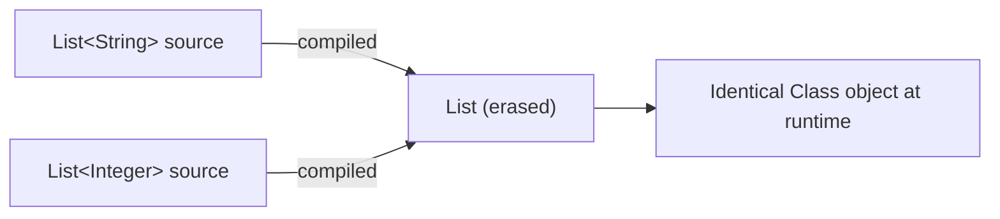

# Generics: Erasure, Variance, and PECS

> **Topic register:** T-104 · IWI 5.85 · Core tier, High interview frequency
> **Provenance:** every trace in this chapter is real, executed output from [`practice/java/week-13/generics-erasure/src/`](../../practice/java/week-13/generics-erasure/src/) on OpenJDK 21.0.12.

## Table of Contents

1. [Learning Objectives](#learning-objectives)
2. [Why This Matters in Interviews](#why-this-matters-in-interviews)
3. [Mental Model](#mental-model)
4. [Definition and Purpose](#definition-and-purpose)
5. [Core Concepts](#core-concepts)
6. [Internal Implementation](#internal-implementation)
7. [Diagrams](#diagrams)
8. [Java Examples](#java-examples)
9. [Production Scenarios](#production-scenarios)
10. [Trade-offs](#trade-offs)
11. [Decision Framework](#decision-framework)
12. [Common Mistakes](#common-mistakes)
13. [Anti-Patterns](#anti-patterns)
14. [Best Practices](#best-practices)
15. [Interview Answer Framework](#interview-answer-framework)
16. [Interview Questions](#interview-questions)
17. [Summary](#summary)
18. [Key Takeaways](#key-takeaways)
19. [Cheat Sheet](#cheat-sheet)
20. [Flashcards](#flashcards)
21. [Practice Exercises](#practice-exercises)
22. [Solutions](#solutions)
23. [Additional Reading](#additional-reading)
24. [Official References](#official-references)

---

## Learning Objectives

By the end of this chapter you can:

- Prove, with real reflection output, that `List<String>` and `List<Integer>` are the identical runtime class.
- Explain why a heap-pollution `ClassCastException` surfaces at read time, not insert time, with a measured example.
- Apply PECS ("Producer Extends, Consumer Super") correctly, and explain precisely why a `List<? extends T>` cannot be written to.
- Explain what a bridge method is and why the compiler generates one, with real reflection evidence.

## Why This Matters in Interviews

Generics questions test whether a candidate understands generics as a compile-time-only construct or has an incomplete mental model that breaks down under a follow-up. PECS specifically is a common area where candidates can use `? extends`/`? super` correctly by habit without being able to explain *why* the compiler rejects a write to a producer wildcard — and that "why" is exactly what separates a memorized rule from real understanding.

## Mental Model

**Generics are a compiler-only illusion — at runtime, there is exactly one `List` class, and the type parameter is gone.** Everything else in this topic follows from that one fact: type-safety violations that the compiler would normally catch can still happen if you go around it (an unchecked cast), and when they do, the failure shows up later, at the point something tries to use the value as its declared type — not at the point the wrong-typed value was inserted. PECS is a separate, purely compile-time reasoning tool for wildcards: "if you only read from it, `extends`; if you only write to it, `super`" — because the compiler cannot otherwise prove a write into a wildcarded type is safe.

## Definition and Purpose

**Type erasure** is the process by which the Java compiler removes generic type information after compile time, replacing type parameters with their bounds (or `Object` if unbounded) — so `List<String>`, `List<Integer>`, and raw `List` are all literally the same class, `java.util.List`, at runtime. **PECS** ("Producer Extends, Consumer Super") is the mnemonic for choosing wildcard bounds correctly: a parameter you only read from should be `? extends T` (a producer of `T`); a parameter you only write to should be `? super T` (a consumer of `T`).

Generics exist to give compile-time type safety without requiring a separate class per type (unlike, say, C++ templates, which generate distinct code per instantiation). Erasure is the mechanism that makes this possible with full binary compatibility with pre-generics code, at the cost of type information not being available at runtime.

## Core Concepts

### Erasure means no runtime type parameter information

`List<String>.getClass()` and `List<Integer>.getClass()` return the identical `Class` object. Any code that needs to know the element type at runtime must be told explicitly (e.g., via a `Class<T>` parameter), since the generic signature itself carries nothing at runtime.

### A defeated generic fails at read time, not write time

Bypassing generics via an unchecked cast lets an incompatible value be inserted without any immediate error — the `ClassCastException` only occurs later, at the point the collection's declared type is relied upon (e.g., `list.get(0)` implicitly casting to the declared element type).

### PECS: producer-extends, consumer-super

A method parameter that's only read from should use `? extends T` (you can safely read a `T` out of it, since whatever it actually contains is *some* subtype of `T`). A method parameter that's only written to should use `? super T` (you can safely put a `T` into it, since whatever it actually is, is a supertype of `T` and can hold one). Violating this — trying to write into a `? extends T` — is rejected at *compile time*, because the compiler cannot prove the wildcard's actual type accepts the value being inserted.

### Bridge methods exist because of erasure

When a generic interface method (`Box<T>.set(T)`) is implemented for a specific type argument (`Box<String>`), the erased interface method signature is `set(Object)`. The compiler generates a synthetic *bridge method* `set(Object)` on the implementing class that casts and delegates to the real `set(String)`, so the class still satisfies the interface's erased signature.

## Internal Implementation

**Type erasure, measured:**

```
== Generic type information does not exist at runtime ==
strings.getClass() = class java.util.ArrayList
integers.getClass() = class java.util.ArrayList
strings.getClass() == integers.getClass(): true  (both are just raw java.util.ArrayList at runtime -- <String> and <Integer> are erased)
```

**Defeating generics unsafely, and where the failure actually surfaces:**

```
== Erasure means you can defeat generics via reflection, unsafely ==
ClassCastException at READ time, not insert time: class java.lang.Integer cannot be cast to class java.lang.String (java.lang.Integer and java.lang.String are in module java.base of loader 'bootstrap')
(the Integer 42 was inserted successfully -- generics are a compile-time-only check; the failure surfaces later, at the point strings.get(0) tries an implicit cast to String)
```

**Bridge method, proven via reflection:**

```
== A bridge method: proof the compiler generates an extra method for erasure's sake ==
real method:   public void TypeErasureDemo$Wrapper.set(java.lang.String)
BRIDGE METHOD: public void TypeErasureDemo$Wrapper.set(java.lang.Object)
```

**PECS applied and violated, measured:**

```
== Producer-extends: sumOf() accepts List<Integer>, List<Double>, List<Number> ==
sumOf(List<Integer>) = 6.0
sumOf(List<Double>)  = 4.0

== Consumer-super: fillWithSquares() accepts List<Integer>, List<Number>, List<Object> ==
filled List<Integer>: [1, 4, 9, 16, 25]
filled List<Number>:  [1, 4, 9, 16, 25]
filled List<Object>:  [1, 4, 9, 16, 25]

== Violating PECS: a List<? extends Number> cannot be safely written to ==
readOnlyView.get(0) = 1  (reading is safe)
readOnlyView.add(99);  // DOES NOT COMPILE
```

`readOnlyView.add(99)` is rejected by the compiler, not at runtime — the compiler cannot prove the wildcard's actual runtime type accepts an `Integer`, since `? extends Integer` could in principle be backed by a list of some Integer subtype the compiler can't see.

## Diagrams



## Java Examples

```java
// Java 21. A generic method using PECS correctly: reads from a producer
// (? extends Number), writes to a consumer (? super Integer).
static double sumOf(List<? extends Number> producer) {
    double total = 0;
    for (Number n : producer) total += n.doubleValue();
    return total;
}

static void fillWithSquares(List<? super Integer> consumer, int upTo) {
    for (int i = 1; i <= upTo; i++) consumer.add(i * i);
}
```

```java
// Java 21. Defeating erasure unsafely -- compiles due to an unchecked cast,
// fails later at read time, not here at insertion.
@SuppressWarnings("unchecked")
List<Object> unsafeView = (List<Object>) (List<?>) strings;
unsafeView.add(42); // heap pollution -- no exception here
String first = strings.get(0); // ClassCastException HERE instead
```

**Complexity note:** erasure and PECS are compile-time mechanisms with zero runtime cost of their own; the only runtime cost is the (rare) bridge-method indirection, one extra method dispatch.

## Production Scenarios

### Scenario: an unchecked cast in a library adapter causes a `ClassCastException` far from its actual cause

**Symptoms.** A service integrates with a third-party library whose API predates generics, requiring an adapter layer with an unchecked cast (`(List<MyType>) rawList`) to bridge the raw-typed library API to the service's generic code. Months later, a `ClassCastException` occurs deep inside unrelated business logic, at a line that simply calls `.get(i)` on a list that "should" contain `MyType` instances.

**Impact.** The exception's stack trace points at an innocent-looking business-logic call site, while the actual root cause (a raw-to-generic unchecked cast in a completely different file) is nowhere in the trace, costing significant debugging time.

**Initial hypotheses.** A bug in the business logic itself (checked — the code correctly assumes a `List<MyType>` and does nothing wrong given that assumption); a serialization/deserialization mismatch (checked — no serialization occurs on this path); the adapter's unchecked cast let an incompatible object into the list, surfacing only later at a `get()` call (correct).

**Evidence.** Tracing backward from the failing `get()` call, the list was populated by the third-party library's raw API through the unchecked-cast adapter; the library, in a rarely-hit code path, returned an object of a different type than `MyType` for a specific input case the adapter's cast couldn't and didn't check.

**Diagnosis.** Exactly this chapter's measured mechanism: the unchecked cast let a type-incompatible value into the generically-typed list with no immediate error, and the `ClassCastException` only appeared far away, at the first place the list's declared element type was actually relied upon — making root-cause tracing much harder than a failure at the actual point of type violation would have been.

**Immediate mitigation.** Add a runtime type check immediately after the unchecked cast (an explicit `instanceof` filter or validation loop), converting the eventual, far-away failure into an immediate, traceable one at the adapter boundary.

**Permanent remediation.** Wherever an unchecked cast is unavoidable when bridging a raw-typed API, validate the actual runtime types immediately at that boundary rather than trusting the cast — sacrificing a small amount of the wrapped API's raw performance for a failure that points at its real cause.

**Alternatives considered.** Removing the unchecked cast by asking the third-party library to add generics — rejected as outside the team's control for this specific dependency.

**Trade-offs.** The added validation loop costs a small amount of CPU at the adapter boundary — accepted, since the alternative is exactly the far-away, hard-to-trace failure this incident demonstrated.

**Prevention.** Treat every `@SuppressWarnings("unchecked")` in the codebase as a flagged boundary requiring an immediate runtime check, not a place to trust the compiler's suppressed warning silently.

**Interview lesson.** This is the production-scale version of this chapter's own measured demo: heap pollution from an unchecked cast surfacing far from its actual cause, at the point the generic type is finally relied upon.

## Trade-offs

| Choice | Benefit | Cost |
|---|---|---|
| Fully generic API (no unchecked casts) | Type safety enforced at compile time throughout | Cannot bridge to pre-generics/raw-typed APIs without some adaptation |
| Unchecked cast at a library boundary | Lets generic code interoperate with a raw-typed dependency | Defers any type violation to a later, harder-to-trace failure — unless validated immediately at the cast site |
| `? extends T` (producer) | Accepts any subtype's list for reading | Cannot be written to — rejected at compile time |
| `? super T` (consumer) | Accepts any supertype's list for writing | Reading only yields `Object` (or the wildcard's lower bound), not `T` |

## Decision Framework

1. **Does this method only read `T` values out of a parameter?** Use `List<? extends T>` (producer-extends) to accept the widest range of caller types.
2. **Does this method only write `T` values into a parameter?** Use `List<? super T>` (consumer-super) to accept the widest range of caller types.
3. **Is an unchecked cast unavoidable at a library boundary?** Add an explicit runtime validation immediately at that boundary, so a type violation fails there, not somewhere unrelated later.
4. **Does a generic interface implementation for a specific type argument look like it "just work" without an explicit method matching the interface's erased signature?** That gap is filled by a compiler-generated bridge method — expected, not a bug, if `isBridge()` shows it exists.

## Common Mistakes

- Assuming generic type information is available at runtime (e.g., trying to check `instanceof List<String>`, which doesn't compile because it's meaningless post-erasure).
- Using an unchecked cast without an immediate runtime validation, letting a type violation surface far from its actual cause.
- Confusing which side (`extends` vs `super`) applies to reading versus writing, rather than reasoning from PECS directly.

## Anti-Patterns

- **`@SuppressWarnings("unchecked")` with no accompanying runtime check** at the exact point the warning is suppressed.
- **Choosing `? extends T` for a parameter the method also needs to write to**, then working around the resulting compile error with an unsafe raw-type cast instead of reconsidering the wildcard bound.
- **Treating erasure as an implementation detail that "doesn't matter"** rather than the reason several other generics behaviors (no `new T[]`, no `instanceof List<String>`, bridge methods) exist at all.

## Best Practices

- Apply PECS by default when designing a generic method's parameter types: producer parameters get `? extends`, consumer parameters get `? super`.
- Validate immediately, at the cast site, whenever an unchecked cast bridges to a raw-typed API.
- Treat every `@SuppressWarnings("unchecked")` as a code-review flag requiring justification and an adjacent runtime check.

## Interview Answer Framework

### 30-Second Answer

Generics are erased after compile time — `List<String>` and `List<Integer>` are the identical runtime class, measured directly. A defeated generic (via an unchecked cast) fails at read time, not insert time. PECS says: use `? extends T` for a parameter you only read from, `? super T` for one you only write to — writing to a `? extends T` is rejected at compile time because the compiler can't prove it's safe.

### 2-Minute Answer

Definition: erasure removes generic type parameters after compilation; PECS is the rule for choosing wildcard variance. Why it exists: erasure gives type safety with full binary compatibility to pre-generics code, at the cost of no runtime type info; PECS exists because the compiler needs a rule to know when a wildcarded type is safe to read from versus write to. How it works: `List<T>.getClass()` is identical regardless of `T`; a heap-pollution `ClassCastException` from an unchecked cast surfaces at the point the value is used as its declared type, not at insertion; `? extends T` can't be written to because the compiler can't prove type safety. One important trade-off: bridging to raw-typed legacy APIs requires an unchecked cast, deferring any real type violation to a later, harder-to-trace failure unless validated immediately. Production example: a real measured `ClassCastException` occurring at a `get()` call far from the actual unchecked-cast root cause, and a real reflection-verified bridge method the compiler generates to reconcile a generic interface's erased signature with its concrete implementation.

### 10-Minute Deep Dive

Cover, in order: the mental model — generics are a compiler-only illusion (mental model); the measured type-erasure proof via `getClass()` (internals, real evidence); the measured heap-pollution ClassCastException, surfacing at read time not insert time (internals, real evidence); the measured bridge-method reflection proof (internals, real evidence); PECS applied and violated, with the compile-time rejection (internals, real evidence); the decision framework for choosing wildcard bounds (decision framework); and close with the production scenario — an unchecked-cast library adapter causing a far-away, hard-to-trace ClassCastException.

### Whiteboard Explanation

Draw the [§ Diagrams](#diagrams) flowchart: `List<String>` and `List<Integer>` both compiling down to the same erased `List` class. Below it, draw the heap-pollution sequence: unchecked cast → `add(42)` succeeds silently → `get(0)` later throws — annotating the gap between insertion and failure as "this is why the stack trace often points at the wrong place."

### Production Example

The library-adapter incident in [§ Production Scenarios](#production-scenarios): an unchecked cast bridging a raw-typed third-party API let an incompatible object into a generically-typed list, producing a `ClassCastException` deep in unrelated business logic months later.

### Trade-offs to Mention

State unprompted: erasure means no runtime type checking beyond what's validated explicitly; an unchecked cast defers failure to an unpredictable later point unless checked immediately; PECS's compile-time rejection of writes to `? extends T` is a safety feature, not an arbitrary restriction.

### Common Candidate Mistakes

Trying to check generic type at runtime (`instanceof List<String>`) without recognizing it's meaningless post-erasure; confusing which side of PECS applies to reading versus writing.

### Typical Follow-Up Questions

1. "Why does the ClassCastException show up at `get()` instead of at the unchecked cast itself?"
2. "Why can't you write to a `List<? extends Number>`?"

### Senior-Level Expectations

Correctly explains erasure with a concrete example (getClass() equality); correctly applies PECS and explains why a write to a producer wildcard is rejected.

### Staff-Level Discussion

The gap between where a type violation is introduced (an unchecked cast) and where it's finally detected (a much later `get()` call relying on the declared type) is a specific instance of a general principle: type systems only protect you where they're actually consulted, and any point where that consultation is bypassed (an unchecked cast, a raw type, deserialization) becomes a place where a bug can travel arbitrarily far from its cause before surfacing. A Staff engineer treats every unchecked-cast boundary as requiring an immediate, explicit validation — not because the cast itself is wrong, but because deferring the check is exactly what turns a five-minute bug into a multi-hour investigation.

## Interview Questions

### Question 1 — Why does the `ClassCastException` show up at `get()` instead of at the unchecked cast itself?

**Why interviewers ask it.** Tests whether the candidate understands erasure as a compile-time-only mechanism, not just knows the term.

**Expected answer.** Generics checks are compile-time only; once an unchecked cast bypasses that check, the incompatible value is stored with no runtime validation. The failure only occurs later, when code relies on the declared element type — e.g., an implicit cast inside `list.get(0)`.

**Minimum acceptable answer.** States that the cast happens later, even without full erasure reasoning.

**Strong Senior answer.** Correctly explains erasure with a concrete example (getClass() equality) and the read-time failure mechanism.

**Staff-level extension.** Generalizes to the principle that any bypass of the type system (unchecked cast, raw type, deserialization) can let a bug travel arbitrarily far from its actual cause before surfacing, and proposes validating immediately at such boundaries.

**Common mistakes.** Assuming the JVM does some generic type checking at runtime that would catch the violation earlier.

**Likely follow-ups.** "How would you prevent this in a real library adapter?"

**Evaluation criteria (1–5).** 1: assumes runtime generic checking exists. 3: correctly explains the read-time failure mechanism. 5: correct explanation plus the general type-system-bypass principle.

**Related references.** [§ Internal Implementation](#internal-implementation); [§ Production Scenarios](#production-scenarios).

---

### Question 2 — Why can't you write to a `List<? extends Number>`?

**Why interviewers ask it.** Tests whether PECS is understood as a compiler-safety mechanism, not memorized as a rule.

**Expected answer.** The compiler cannot prove what specific subtype of `Number` the wildcard actually represents at runtime, so it cannot guarantee any particular value being added is compatible — the write is rejected to prevent a type-safety violation the compiler can't verify.

**Minimum acceptable answer.** States that `? extends T` is "read-only" without the underlying reasoning.

**Strong Senior answer.** Correctly applies PECS and explains why a write to a producer wildcard is rejected.

**Staff-level extension.** Contrasts this with `? super T`, explaining why writes are safe there (any supertype of `T` can hold a `T`) but reads only reliably yield `Object`.

**Common mistakes.** Describing the restriction as arbitrary rather than a consequence of what the compiler can and cannot prove about the wildcard's actual type.

**Likely follow-ups.** "What can you safely do with a `List<? super T>` that you can't with `List<? extends T>`, and vice versa?"

**Evaluation criteria (1–5).** 1: "it's just a rule." 3: correctly explains the compiler's safety reasoning. 5: correct explanation plus the extends/super read/write contrast.

**Related references.** [§ Internal Implementation](#internal-implementation); [§ Java Examples](#java-examples).

## Summary

Generics are erased after compile time — `List<String>` and `List<Integer>` are literally the same runtime class, measured directly via `getClass()`. Defeating a generic via an unchecked cast doesn't fail at insertion; it fails later, at the point the declared type is actually relied upon, measured directly as a `ClassCastException` at a `get()` call rather than at the cast. PECS resolves wildcard variance safely: producer parameters get `? extends T`, consumer parameters get `? super T`, and writing to a producer wildcard is rejected at compile time because the compiler cannot prove it's safe. Bridge methods, verified via reflection, are the compiler's mechanism for reconciling a generic interface's erased signature with a concrete implementation.

## Key Takeaways

- Generic type parameters do not exist at runtime — erasure makes `List<String>` and `List<Integer>` the same class.
- A type violation from an unchecked cast surfaces at read time, not insert time — often far from its actual cause.
- PECS: producer parameters get `? extends T`; consumer parameters get `? super T`.
- Bridge methods are the compiler's answer to reconciling an erased interface signature with a typed implementation.

## Cheat Sheet

| Need | Wildcard |
|---|---|
| A parameter you only read `T` values from | `List<? extends T>` |
| A parameter you only write `T` values into | `List<? super T>` |
| A parameter you both read and write as exactly `T` | Plain `List<T>`, no wildcard |
| Bridging to a raw-typed legacy API | Unchecked cast + immediate runtime validation at that boundary |

## Flashcards

### Card: What erasure removes

**Prompt:**
What does type erasure actually remove, and when?

**Answer:**
Generic type parameter information, removed after compile time — `List<String>` and `List<Integer>` are the identical class at runtime.

**Why it matters:**
Explains why you can't do `instanceof List<String>` or `new T[]`.

**Common trap:**
Assuming some generic type information survives to runtime.

**Related:**
[Internal Implementation](#internal-implementation)

### Card: When a defeated generic actually fails

**Prompt:**
When does a defeated generic (via unchecked cast) actually fail?

**Answer:**
At read time — when code relies on the declared element type (e.g., an implicit cast inside `get()`) — not at the point the incompatible value was inserted.

**Why it matters:**
Explains why such bugs are often hard to trace back to their real cause.

**Common trap:**
Assuming the cast operation itself is where the failure would occur.

**Related:**
[Production Scenarios](#production-scenarios)

### Card: PECS rule

**Prompt:**
State PECS.

**Answer:**
Producer Extends, Consumer Super — a parameter you only read from should be `? extends T`; one you only write to should be `? super T`.

**Why it matters:**
The rule that maximizes what callers can pass while keeping the compiler's safety guarantees.

**Common trap:**
Reversing extends/super, or using a wildcard where a plain type parameter would do.

**Related:**
[Core Concepts](#core-concepts)

## Practice Exercises

1. Reproduce both demos: [`TypeErasureDemo.java`](../../practice/java/week-13/generics-erasure/src/TypeErasureDemo.java) and [`PecsDemo.java`](../../practice/java/week-13/generics-erasure/src/PecsDemo.java).
2. Write a generic method `copy(List<? super T> dest, List<? extends T> src)` that copies all elements from `src` to `dest`, and verify it compiles for `copy(List<Object>, List<Integer>)`.
3. Explain, without running code, why `List<String>[] arr = new List<String>[10];` does not compile in Java, connecting your answer directly to erasure.

## Solutions

**Exercise 1.** Expected output matches this chapter's measured traces: `getClass()` equality for `List<String>`/`List<Integer>`, the `ClassCastException` at the `get()` call rather than at the unchecked cast, and the bridge-method reflection output.

**Exercise 2.** `static <T> void copy(List<? super T> dest, List<? extends T> src) { for (T item : src) dest.add(item); }` — `src` is a producer (only read), `dest` is a consumer (only written), matching PECS exactly; `copy` compiles for `List<Object>` (a valid `? super Integer`) and `List<Integer>` (a valid `? extends Integer`).

**Exercise 3.** Generic array creation is disallowed because, at runtime, the array would just be a raw `List[]` (erasure) — but arrays in Java carry their component type at runtime and enforce it on every store (`ArrayStoreException` if violated), a guarantee erasure cannot provide for a generic component type. Allowing `new List<String>[10]` would let a `List<Integer>` be stored into it without the array's own runtime check catching the violation, defeating the very guarantee arrays are supposed to provide.

## Additional Reading

- [The Java Tutorials — Generics](https://docs.oracle.com/javase/tutorial/java/generics/index.html)

## Official References

- [Java Language Specification §4.6 — Type Erasure](https://docs.oracle.com/javase/specs/jls/se21/html/jls-4.html#jls-4.6)
