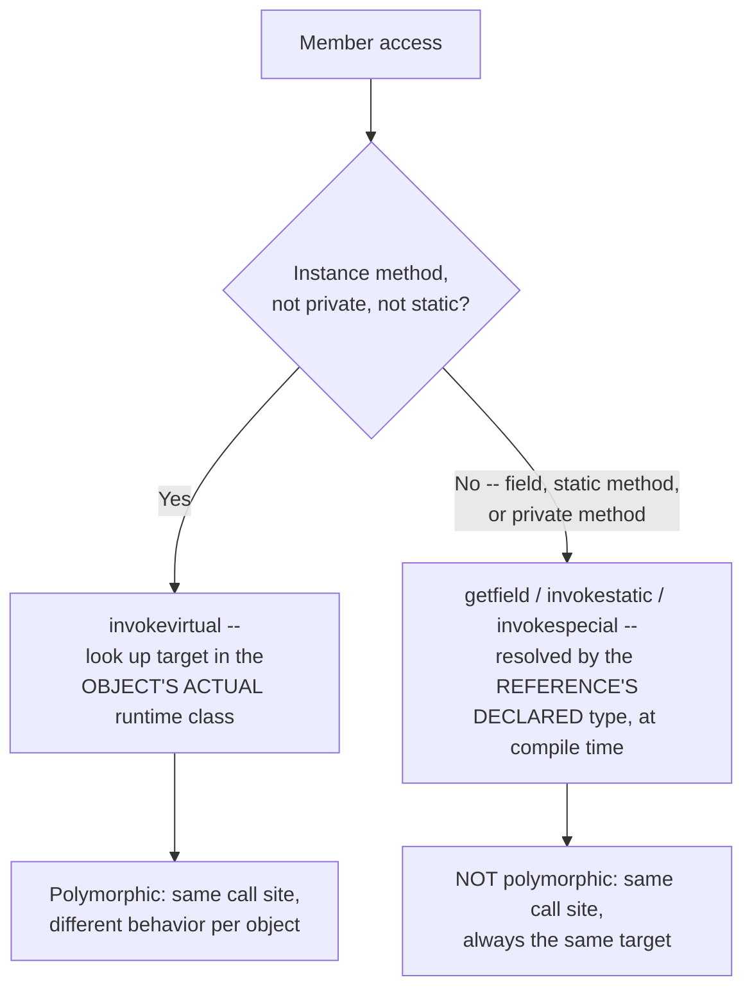

# Polymorphism and Dynamic Dispatch Mechanics

> **Topic register:** T-102 · IWI 5.6 · Foundation tier, Very High interview frequency
> **Provenance:** every trace in this chapter is real, executed output from [`practice/java/oop-fundamentals/polymorphism/src/`](../../practice/java/oop-fundamentals/polymorphism/src/) on OpenJDK 21.0.12.

## Table of Contents

1. [Learning Objectives](#learning-objectives)
2. [Why This Matters in Interviews](#why-this-matters-in-interviews)
3. [Mental Model](#mental-model)
4. [Definition and Purpose](#definition-and-purpose)
5. [Core Concepts](#core-concepts)
6. [Internal Implementation](#internal-implementation)
7. [Diagrams](#diagrams)
8. [Java Examples](#java-examples)
9. [Production Scenarios](#production-scenarios)
10. [Trade-offs](#trade-offs)
11. [Decision Framework](#decision-framework)
12. [Common Mistakes](#common-mistakes)
13. [Anti-Patterns](#anti-patterns)
14. [Best Practices](#best-practices)
15. [Interview Answer Framework](#interview-answer-framework)
16. [Interview Questions](#interview-questions)
17. [Summary](#summary)
18. [Key Takeaways](#key-takeaways)
19. [Cheat Sheet](#cheat-sheet)
20. [Flashcards](#flashcards)
21. [Practice Exercises](#practice-exercises)
22. [Solutions](#solutions)
23. [Additional Reading](#additional-reading)
24. [Official References](#official-references)

---

## Learning Objectives

By the end of this chapter you can:

- State precisely which member accesses are dynamically dispatched (instance methods) and which are statically resolved (overloads, fields, static methods), and why the distinction exists in the JVM's instruction set.
- Reproduce, with real output, all four of the classic polymorphism gotchas: overload resolution ignoring the runtime type, field hiding, static method hiding, and a constructor invoking an overridable method before subclass state is initialized.
- Explain the `invokevirtual` vs. `invokestatic`/`invokespecial` distinction well enough to predict which bytecode instruction a given call compiles to.
- Identify, unprompted, the constructor-calls-overridable-method pitfall as a design smell, and name the fix.

## Why This Matters in Interviews

"Explain polymorphism" is one of the most reliably asked, and most reliably shallow-answered, questions in a Java interview — nearly every candidate can recite "a subclass can override a method," and almost none can explain *which* member accesses are actually polymorphic and which only look like they should be. Interviewers use the field-hiding and static-hiding variants specifically because they separate candidates who understand the underlying dispatch mechanism from candidates who've memorized "polymorphism means overriding" as a slogan. This is Foundation tier precisely because the mechanism it tests (virtual dispatch via a per-class method table) is the assumed substrate under every later discussion of inheritance, interfaces, and framework proxying (including this handbook's own [`@Transactional` proxy mechanics](../spring/transactional-proxy-mechanics-and-propagation.md), which depends on exactly this distinction between virtual and non-virtual dispatch).

## Mental Model

**Only instance method calls are looked up by "what is this object, right now" — everything else (fields, static methods, overload selection) is decided once, at compile time, by the type written in the source code, and never revisited.** Every one of this chapter's "gotchas" is the same single fact applied in a place a candidate didn't expect it: a field read, a static call, or an overload choice all use the *declared* type of the reference, not the *actual* type of the object it happens to point to — only `instanceRef.instanceMethod()` looks past the reference to ask the object itself.

## Definition and Purpose

**Polymorphism**, in the specific sense the JVM implements it, is dynamic method dispatch: a call to a non-static, non-private instance method is resolved at runtime by consulting the actual object's class, not the compile-time type of the reference used to make the call. The JVM implements this via `invokevirtual`, which looks up the target method in the receiving object's class (walking up the class hierarchy if needed) rather than baking in a fixed target at compile time. This exists so that code written against a supertype or interface (`List<String> list = ...`) automatically calls whichever concrete implementation's methods are appropriate, without the caller needing to know or check the concrete type — the mechanism that makes interfaces, abstract classes, and framework extension points (a custom `RowMapper`, a `Comparator`, an overridden Spring bean method) actually work.

Every other kind of member access — field reads, static method calls, and overload resolution among several same-named methods — is resolved entirely at compile time, based on the reference's *declared* type. These compile to different bytecode instructions (`getfield`/`putfield` for instance fields with the field's offset baked in; `invokestatic` for static calls; a specific overload's `invokevirtual`/`invokespecial` selected before the program ever runs) that have no equivalent of `invokevirtual`'s runtime class lookup.

## Core Concepts

### Overriding is dynamic; overloading is static

Overriding (a subclass redefining an inherited instance method with the identical signature) is resolved by the object's runtime class via `invokevirtual`. Overloading (multiple methods with the same name but different parameter types) is resolved entirely at compile time, by the *declared* types of the arguments — the compiler picks one specific overload and bakes that choice into the bytecode before the program runs, regardless of what the arguments' actual runtime types later turn out to be.

### Fields are never polymorphic

There is no virtual dispatch for field access. A field read compiles to `getfield`, which is resolved by the reference's declared type at compile time. A subclass that declares a field with the same name as a superclass field does not override it — it **hides** it. Both fields exist simultaneously in the object's memory layout; which one a given expression sees depends purely on the declared type of the reference used to read it.

### Static methods are hidden, not overridden

A `static` method call compiles to `invokestatic`, resolved by the declared type at compile time — there is no vtable lookup at all, because static methods aren't associated with any particular instance. A subclass "redefining" a static method with the same signature hides the superclass's version rather than overriding it, exactly like field hiding.

### Private methods aren't polymorphic either

A `private` method can never be dispatched virtually — it isn't visible outside its own class, so there's no possibility of a subclass overriding it in the sense this chapter means. A subclass method with the identical signature is an entirely unrelated method that happens to share a name, resolved via `invokespecial` at the call site inside the class that declared it, not `invokevirtual`. (This is also why, as [`@Transactional`: Proxy Mechanics](../spring/transactional-proxy-mechanics-and-propagation.md) covers, `@Transactional` has no effect on `private` methods: a CGLIB proxy can only intercept a call that arrives via `invokevirtual` through the proxy, and a `private` method never does.)

### Dynamic dispatch is active during construction, before subclass state exists

`invokevirtual`'s runtime lookup applies during object construction too — if a superclass constructor calls an overridable method, the subclass's override runs, even though the subclass's own field initializers haven't executed yet (field initializers run *after* the `super()` call returns, not before it starts). The override can observe subclass fields still at their default value (`null`, `0`, `false`), a classic, easy-to-miss correctness bug.

## Internal Implementation

**Overriding resolved by runtime type, overloading resolved by declared type — measured:**

```
== Overriding: resolved by RUNTIME type ==
reference.speak() = Woof  (Dog's override runs, even though the reference's declared type is Animal)

== Overloading: resolved by DECLARED (compile-time) type ==
describe(reference) = some animal: Woof  (picks the Animal overload -- the compiler never looks at the runtime object)
describe((Dog) reference) = a dog specifically: Woof  (an explicit cast changes the DECLARED type, so overload resolution picks differently -- same object, same runtime type, different compile-time type)
```

**Field hiding, measured** — the identical object, read through two differently-typed references, sees two different values for the same field name:

```
== Field access is resolved by the REFERENCE's declared type, not the object's runtime type ==
d.label (declared type Derived)   = Derived-label
baseRef.label (declared type Base) = Base-label  (same object as d, but sees Base's field -- fields are hidden, not overridden)
((Derived) baseRef).label          = Derived-label  (casting the reference back to Derived reveals Derived's field again)
```

**Static method hiding, measured:**

```
== Static methods are resolved by DECLARED type, never the runtime object ==
reference.category() = generic vehicle  (declared type is Vehicle, so Vehicle's static method runs -- compare this to speak() above, which correctly picked Dog)
Car.category()        = car
Vehicle.category()     = generic vehicle
```

**Constructor calling an overridable method, measured:**

```
== Constructing a SalesReport ==
Report() constructor running -- about to call describe()...
describe() returned: title=null

== After construction completes ==
report.describe() now returns: title=Q3 Sales  (title is now properly initialized)
```

**A worth-naming subtlety this last demo's own construction required:** the field `title` was deliberately built via `new StringBuilder("Q3 Sales").toString()` rather than a bare string literal (`private final String title = "Q3 Sales";`). A `final` field initialized directly from a compile-time constant expression (a plain string or primitive literal) is itself a *compile-time constant* per the JLS, and `javac` is permitted to inline that constant at every read site — which would have silently masked this exact pitfall by printing `"Q3 Sales"` even before the field was really initialized, instead of demonstrating the real uninitialized-state read. This is itself a real, separate gotcha worth knowing: `final` alone doesn't guarantee you're observing genuine runtime field-read behavior if the initializer happens to be a compile-time constant.

## Diagrams



## Java Examples

```java
// Java 21. Overriding: resolved by the object's ACTUAL runtime class via
// invokevirtual, regardless of the reference's declared type.
class Animal {
    String speak() { return "..."; }
}
class Dog extends Animal {
    @Override
    String speak() { return "Woof"; } // dynamically dispatched
}

// Overloading: resolved at compile time by the reference's DECLARED type.
// This looks similar but uses an entirely different mechanism.
class Zoo {
    static String describe(Animal a) { return "some animal: " + a.speak(); }
    static String describe(Dog d) { return "a dog specifically: " + d.speak(); }
}
```

```java
// Java 21. Field hiding vs. method overriding, side by side -- same
// inheritance relationship, opposite polymorphic behavior.
class Base {
    String label = "Base-label";       // NOT polymorphic -- getfield, resolved by reference type
    String describe() { return label; } // IS polymorphic -- invokevirtual, resolved by runtime type
}
class Derived extends Base {
    String label = "Derived-label";    // hides Base.label, does not override it
    @Override
    String describe() { return label; } // overrides Base.describe() -- Derived's own label is used HERE
}
```

**Complexity note:** every mechanism in this chapter is `O(1)` — a single vtable slot lookup for `invokevirtual`, a fixed offset for `getfield`, a fixed target address for `invokestatic`/`invokespecial`. The chapter's value is entirely in *which* mechanism applies to which kind of member access, not in any algorithmic cost.

## Production Scenarios

### Scenario: a base-class validation framework silently skips validation for every subclass

**Symptoms.** A shared `AbstractValidator` base class's constructor calls a `getRules()` method that subclasses override to supply their specific validation rules. After a refactor consolidates several subclasses to build their rule list via a field initializer (`private final List<Rule> rules = buildRules();`) instead of a constructor body, validation silently stops enforcing any rules for every affected subclass — no exception, records that should be rejected are accepted.

**Impact.** Invalid records pass validation and propagate downstream, discovered only when a data-quality audit flags records that should have been rejected at the point of entry.

**Initial hypotheses.** `buildRules()` itself has a logic bug (checked — calling it directly, after construction, returns the correct rule list); the validation-invocation code has a bug (checked — it correctly calls `getRules()` and iterates the result); the base constructor's call to `getRules()` runs before the subclass field is initialized (correct).

**Evidence.** Adding a log line inside `getRules()` shows it returns an empty list the one time it's called from `AbstractValidator`'s constructor — but returns the correct, populated list when called again afterward. This is exactly this chapter's `ConstructorDispatchPitfallDemo` mechanism: the field's initializer (`buildRules()`) runs *after* `super()` returns, so `AbstractValidator()`'s call to the overridden `getRules()` observes the subclass field still at its default value (`null`, then defensively treated as "no rules" by the iterating code).

**Diagnosis.** The base class's constructor calls an overridable method whose result depends on subclass state that isn't initialized yet at that point in construction — the exact structural pitfall this chapter measures directly, previously masked because the pre-refactor code built the rule list inside an explicit constructor body (which happened to run after the base constructor completed in the old design) rather than a field initializer.

**Immediate mitigation.** Revert the affected subclasses to building their rule list in an explicit constructor, after calling `super()`, restoring the previous (accidentally correct) ordering.

**Permanent remediation.** Remove the base constructor's call to an overridable method entirely; replace it with either a two-phase pattern (construct, then call an explicit `init()` method after full construction completes) or a constructor parameter (`AbstractValidator(List<Rule> rules)`, with each subclass passing its own already-built list via `super(buildRules())`, which — since `buildRules()` here is `static` or otherwise doesn't depend on instance state — sidesteps the ordering problem entirely).

**Alternatives considered.** Making `getRules()` `final` in the base class and having each subclass instead override a protected field-setting hook — rejected as adding indirection without removing the underlying "base constructor observes not-yet-initialized subclass state" risk if that hook itself depended on subclass fields.

**Trade-offs.** The constructor-parameter fix requires every subclass's rule-building logic to not depend on `this` (since it runs before `this` is fully an instance of the subclass) — acceptable here since rule lists were already static, data-only structures.

**Prevention.** Treat any base-class constructor calling a non-`final`, non-`private` method as a design-review flag by default, and prefer passing pre-built state through the constructor parameter list over calling back into overridable methods during construction.

**Interview lesson.** This is [Interview Question 2](#interview-questions)'s scenario at real production scale: a refactor that moved logic from "runs after full construction" to "runs during construction" silently reintroduced a well-known but easy-to-forget ordering pitfall.

## Trade-offs

| Choice | Benefit | Cost |
|---|---|---|
| Instance method (virtual dispatch) | Callers work correctly against any subtype without knowing the concrete class — the entire point of polymorphism | Each call has an (usually negligible) vtable-lookup indirection versus a fixed call target |
| `final` instance method | Guarantees no subclass can change behavior — predictable, inlinable by the JIT | Removes the extension point entirely; can't be used where subclass customization is genuinely needed |
| Field access via a getter (virtual) instead of a public field (non-virtual) | Subclasses can override the getter's behavior (e.g., lazy computation, validation) | Extra indirection versus a direct field read; only matters if that flexibility is actually used |
| Calling an overridable method from a constructor | None real — this is a pitfall, not a legitimate design choice, in virtually every case | Subclass overrides observe a partially-constructed object; a well-known, easy-to-reintroduce bug class |

## Decision Framework

1. **Does this member need to behave differently for different subtypes, selected at runtime?** Use a non-`final`, non-`private` instance method — this is the only mechanism that's actually polymorphic.
2. **Is this a field, a static method, or a private method that a subclass seems to be "customizing"?** It isn't — it's hiding, resolved by the declared type of whatever reference is used. Don't design around an expectation of polymorphic behavior here.
3. **Is a base-class constructor calling a method a subclass might override?** Don't, unless the method is `final` or otherwise provably independent of any subclass-declared instance state — prefer a constructor parameter or an explicit post-construction initialization step instead.
4. **Is a `final` field's apparent "runtime behavior" actually just a compile-time-inlined constant?** Check whether the initializer is a compile-time constant expression (a bare literal) before treating a `final` field's read as proof of genuine runtime field access.

## Common Mistakes

- Assuming a subclass field with the same name as a superclass field overrides it, the way a method would.
- Assuming a "static override" in a subclass is dispatched dynamically like an instance method.
- Calling an overridable instance method from a superclass constructor, without recognizing the subclass isn't fully constructed yet.
- Believing overload resolution considers the runtime type of the arguments, rather than their declared (compile-time) type.

## Anti-Patterns

- **Relying on field hiding for polymorphic behavior**, e.g., a subclass redeclaring a field expecting code that reads it through a supertype reference to see the subclass's value.
- **Calling a non-`final` instance method from a constructor**, especially one whose behavior plausibly depends on subclass-declared fields.
- **Designing an API around overload resolution to behave differently for different runtime types** (e.g., expecting `process(Animal)` vs. `process(Dog)` to be chosen based on what the object actually is at runtime, rather than the static type of the expression passed in).

## Best Practices

- Use instance methods, not fields, for anything that genuinely needs to vary by subtype.
- Mark methods `final` by default unless subclass customization is an intentional part of the design — this documents intent and prevents accidental field/static-hiding confusion from looking like a real override.
- Never call a non-`final` instance method from a constructor; if subclass-specific setup is needed, use a constructor parameter or a separate, explicitly-invoked initialization method called after construction completes.
- When in doubt about whether a member access is polymorphic, ask: "is this a plain instance method call, with no `static`, `private`, or `final` involved?" — if not, it isn't polymorphic.

## Interview Answer Framework

### 30-Second Answer

Only instance method calls are dynamically dispatched — resolved by the object's actual runtime class via `invokevirtual`. Fields, static methods, and overload selection are all resolved at compile time by the reference's *declared* type, and a subclass member with the same name/signature in those cases hides rather than overrides.

### 2-Minute Answer

Definition: polymorphism, mechanically, is `invokevirtual`'s runtime lookup of the target method in the object's actual class. Why it exists: so code written against a supertype or interface works correctly for any concrete subtype without a type check. How it works: instance methods get this treatment; fields, static methods, and overload resolution do not — they're all fixed at compile time by the declared type. One important trade-off: calling an overridable method from a constructor invokes the subclass's override before the subclass's own fields are initialized, a real and easy-to-reintroduce bug class. Production example: a measured demo showing a base constructor's call to an overridden method observing `null` for a subclass field whose initializer hadn't run yet.

### 10-Minute Deep Dive

Cover, in order: the mental model — only instance methods are looked up on the actual object, everything else is fixed by declared type (mental model); the measured override-vs-overload contrast (internals, real evidence); the measured field-hiding and static-method-hiding demos, both showing the identical object producing different answers depending on reference type (internals, real evidence); the constructor-dispatch pitfall, measured directly, plus the compile-time-constant subtlety that nearly masked it (internals, real evidence + a genuine secondary gotcha); and close with the production scenario — a refactor that moved rule-building into a field initializer and silently broke validation for every subclass via exactly this ordering pitfall.

### Whiteboard Explanation

Draw the [§ Diagrams](#diagrams) flowchart: "member access" branching on "instance method, not private, not static?" — yes goes to `invokevirtual` / "looked up on the actual object," no goes to `getfield`/`invokestatic`/`invokespecial` / "fixed by the reference's declared type." Circle the "yes" branch and label it "this is the only branch that's actually polymorphism."

### Production Example

The validation-framework incident in [§ Production Scenarios](#production-scenarios): a refactor moved subclass rule-building from an explicit post-`super()` constructor body into a field initializer, and the base class's constructor — which calls the overridden `getRules()` — started observing the not-yet-initialized field, silently disabling validation for every affected subclass.

### Trade-offs to Mention

State unprompted: only instance methods are dynamically dispatched; fields and static methods are hidden, not overridden, by same-named subclass members; calling an overridable method from a constructor is a real, well-documented pitfall, not a hypothetical one; a `final` field initialized from a bare literal can be compile-time-inlined, which can mask what looks like a runtime field read.

### Common Candidate Mistakes

Claiming all subclass members "override" their superclass counterpart regardless of whether it's a field, static method, or instance method; not recognizing that a constructor calling an overridable method runs the subclass's version before subclass fields are set.

### Typical Follow-Up Questions

1. "If a subclass hides a field instead of overriding it, what actually happens in memory — are there one or two copies of that field?"
2. "Why does a `final` field sometimes seem to defeat a demonstration of this pitfall?"
3. "How does this connect to why `@Transactional` doesn't work on `private` methods?"

### Senior-Level Expectations

Correctly distinguishes overriding (dynamic) from field/static hiding and overload resolution (both static); identifies the constructor-calling-an-overridable-method pattern as a bug class, not just a curiosity.

### Staff-Level Discussion

This chapter's mechanism — "only one specific kind of member access consults the object's actual runtime identity; everything else is fixed by the compile-time type of the expression used to reach it" — recurs throughout the JVM ecosystem, not just in hand-written inheritance hierarchies. Proxy-based frameworks (Spring's `@Transactional`, Hibernate's lazy-loading proxies, any CGLIB- or JDK-dynamic-proxy-based library) work *only* through `invokevirtual` call sites, which is precisely why they silently fail on `private`, `final`, or self-invoked (`this.method()`) calls — the same underlying dispatch rule this chapter establishes from first principles, reappearing as a specific, high-value gotcha in [`@Transactional`: Proxy Mechanics, Rollback Rules, and Propagation](../spring/transactional-proxy-mechanics-and-propagation.md). A Staff-level engineer recognizes this as one mechanism showing up twice, not two unrelated facts to memorize separately.

## Interview Questions

### Question 1 — A subclass redeclares a field with the same name as one in its superclass. What happens when you read that field through a superclass-typed reference versus a subclass-typed reference?

**Why interviewers ask it.** Tests whether the candidate actually knows field access isn't polymorphic, versus assuming everything inheritance-related behaves like method overriding.

**Expected answer.** Both fields exist simultaneously; field access is resolved by the reference's *declared* type at compile time, not the object's runtime type — a superclass-typed reference sees the superclass's field, a subclass-typed reference (or a cast) sees the subclass's field, regardless of what the actual object is.

**Minimum acceptable answer.** States that fields aren't polymorphic, even without precisely explaining the compile-time resolution mechanism.

**Strong Senior answer.** Correctly explains that both fields coexist and access is resolved by declared reference type.

**Staff-level extension.** Connects this to the underlying `getfield` vs. `invokevirtual` bytecode distinction, and names the general rule (only instance methods are virtually dispatched).

**Common mistakes.** Assuming the subclass's field "overrides" the superclass's, the way a method would.

**Likely follow-ups.** "Does the same thing happen with static methods?"

**Evaluation criteria (1–5).** 1: assumes field hiding behaves like method overriding. 3: correctly explains declared-type resolution. 5: correct explanation plus the `getfield`/`invokevirtual` mechanism.

**Related references.** [§ Core Concepts](#core-concepts); [§ Internal Implementation](#internal-implementation).

---

### Question 2 — A superclass constructor calls a method that a subclass overrides. What could go wrong?

**Why interviewers ask it.** A well-known but frequently forgotten pitfall; tests whether the candidate recognizes it as a design smell to actively avoid, not just a piece of trivia.

**Expected answer.** The subclass's override runs during the superclass constructor's execution, before the subclass's own field initializers have run — so the override can observe subclass fields still at their default value (`null`, `0`, `false`), producing subtle, hard-to-diagnose bugs.

**Minimum acceptable answer.** States that this "can cause problems," even without precisely explaining the initialization-order mechanism.

**Strong Senior answer.** Correctly explains that field initializers run after `super()` returns, so the override sees a partially-constructed subclass.

**Staff-level extension.** Proposes a concrete fix (constructor parameter, or an explicit post-construction `init()` step) and states why simply marking the method `final` is only a partial fix (it prevents override-related surprises but doesn't help if the method still depends on state the superclass constructor sets differently than intended).

**Common mistakes.** Not recognizing this as a real, recurring bug pattern rather than a one-off trivia question.

**Likely follow-ups.** "How would you redesign this to avoid the problem entirely?"

**Evaluation criteria (1–5).** 1: doesn't know this is a real hazard. 3: correctly explains the initialization-order mechanism. 5: correct explanation plus a concrete redesign.

**Related references.** [§ Internal Implementation](#internal-implementation); [§ Production Scenarios](#production-scenarios).

## Summary

Only instance method calls are dynamically dispatched, via `invokevirtual`'s runtime lookup on the object's actual class — this is the entirety of what "polymorphism" mechanically means in the JVM. Fields, static methods, and overload resolution are all resolved at compile time by the declared type of the reference or arguments involved, and same-named subclass members in those categories hide rather than override — measured directly, with the identical object producing different answers depending purely on which reference type was used to access it. Dynamic dispatch remains active during construction, which is exactly what makes a superclass constructor calling an overridable method a real, well-documented pitfall: the override runs before the subclass's own fields are initialized.

## Key Takeaways

- Only non-`static`, non-`private` instance methods are dynamically dispatched (`invokevirtual`, resolved by the object's actual class).
- Fields and static methods are hidden by same-named subclass members, not overridden — resolved by the reference's declared type at compile time (`getfield`/`invokestatic`).
- Overload resolution among several same-named methods is decided at compile time by the declared types of the arguments, never revisited at runtime.
- A superclass constructor calling an overridable method runs the subclass's override before the subclass's own field initializers execute — a real bug class, not a hypothetical.
- A `final` field initialized from a bare compile-time-constant literal can be inlined by the compiler, which can mask what otherwise looks like a genuine runtime field read.

## Cheat Sheet

| Member kind | Dispatch | Bytecode |
|---|---|---|
| Instance method (not `private`, not `final` doesn't matter for this row) | Dynamic — resolved by the object's actual runtime class | `invokevirtual` |
| `private` instance method | Static — not visible for override at all | `invokespecial` |
| `static` method | Static — resolved by declared type | `invokestatic` |
| Field (instance or static) | Static — resolved by declared type | `getfield` / `getstatic` |
| Overloaded method selection | Static — resolved by declared argument types at compile time | Baked in as a specific target before runtime |

## Flashcards

### Card: What's actually polymorphic in Java

**Prompt:**
Which kinds of member access are dynamically dispatched in Java?

**Answer:**
Only non-`static`, non-`private` instance method calls — resolved via `invokevirtual` by the object's actual runtime class.

**Why it matters:**
Fields, static methods, and overload resolution are all resolved at compile time by declared type, despite superficially looking like they should behave polymorphically too.

**Common trap:**
Assuming any subclass member with the same name as a superclass member is "overriding" it.

**Related:**
[Core Concepts](#core-concepts)

### Card: Field hiding vs. method overriding

**Prompt:**
If a subclass declares a field with the same name as a superclass field, does it override the field?

**Answer:**
No — it hides it. Both fields exist; which one is read depends entirely on the declared type of the reference used, not the object's actual class.

**Why it matters:**
The most commonly missed contrast with method overriding, which behaves the opposite way.

**Common trap:**
Expecting a superclass-typed reference to see the subclass's field value, the way it would see an overridden method's behavior.

**Related:**
[Internal Implementation](#internal-implementation)

### Card: The constructor-calls-overridable-method pitfall

**Prompt:**
What can go wrong if a superclass constructor calls a method the subclass overrides?

**Answer:**
The subclass's override runs before the subclass's own field initializers execute, so it can observe those fields still at their default (`null`/`0`/`false`) value.

**Why it matters:**
A real, recurring production bug pattern, not just trivia — measured directly in this chapter.

**Common trap:**
Not recognizing this as a design smell to actively avoid in code review.

**Related:**
[Production Scenarios](#production-scenarios)

## Practice Exercises

1. Reproduce all four demos: [`OverrideVsOverloadDemo.java`](../../practice/java/oop-fundamentals/polymorphism/src/OverrideVsOverloadDemo.java), [`FieldHidingDemo.java`](../../practice/java/oop-fundamentals/polymorphism/src/FieldHidingDemo.java), [`StaticMethodHidingDemo.java`](../../practice/java/oop-fundamentals/polymorphism/src/StaticMethodHidingDemo.java), [`ConstructorDispatchPitfallDemo.java`](../../practice/java/oop-fundamentals/polymorphism/src/ConstructorDispatchPitfallDemo.java).
2. Modify `ConstructorDispatchPitfallDemo` to make `title` `final` and initialize it directly from the string literal `"Q3 Sales"` (no `StringBuilder`). Run it and explain, precisely, why the output changes.
3. Redesign `Report`/`SalesReport` to eliminate the constructor-dispatch pitfall using a constructor parameter instead of calling `describe()` from `Report()`'s constructor body.

## Solutions

**Exercise 1.** Expected output matches this chapter's four measured traces exactly, including `title=null` during construction in the fourth demo.

**Exercise 2.** With `private final String title = "Q3 Sales";`, the field becomes a compile-time constant per the JLS (a `final` field initialized directly from a literal), and `javac` is permitted to inline that literal at every read site — so `describe()`'s `return "title=" + title;` gets compiled as if it read `"title=Q3 Sales"` directly, bypassing an actual field read entirely. The constructor-time call then prints `title=Q3 Sales` even though, mechanically, the "real" field still isn't initialized yet at that point — the pitfall becomes invisible, not fixed.

**Exercise 3.** A correct redesign passes the built value in: `abstract class Report { private final String description; Report(String description) { this.description = description; } String describe() { return description; } }` and `class SalesReport extends Report { SalesReport() { super("title=" + new StringBuilder("Q3 Sales")); } }` — the subclass builds its own value and passes it to `super(...)` before any `describe()` call can happen, and `describe()` no longer needs to be overridable at all, removing the pitfall structurally rather than papering over it.

## Additional Reading

- Joshua Bloch, *Effective Java*, Item 16 ("In public classes, use accessor methods, not public fields") and Item 19 ("Design and document for inheritance or else prohibit it")

## Official References

- [The Java Language Specification, SE 21 — Chapter 8: Classes](https://docs.oracle.com/javase/specs/jls/se21/html/jls-8.html)
- [The Java Virtual Machine Specification, SE 21 — Chapter 6: The Java Virtual Machine Instruction Set](https://docs.oracle.com/javase/specs/jvms/se21/html/jvms-6.html)
