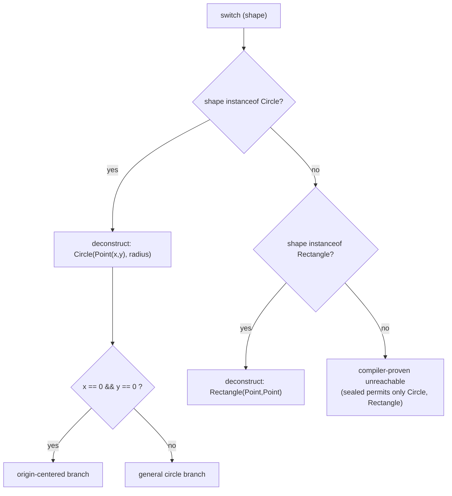

# Records, Sealed Types, and Pattern Matching

> **Topic register:** T-110 · IWI 4.4 · Core tier · Moderate interview frequency
> **Scope note:** this chapter covers the JDK 14→21 data-modeling and control-flow features (records, sealed types, pattern matching). It deliberately does not re-derive [Streams and Collectors](streams-and-collectors.md) (T-107, already covered) or [Virtual Threads](../concurrency/virtual-threads.md) (T-410, already covered) — those are the other two headline "modern Java" topics and have their own chapters.
> **Provenance:** every trace in this chapter is real, executed output from [`practice/java/records-sealed-pattern-matching/src/`](../../practice/java/records-sealed-pattern-matching/src/) on OpenJDK 21.0.12, including one genuine `javac` compile error captured on purpose.

## Table of Contents

1. [Learning Objectives](#learning-objectives)
2. [Why This Matters in Interviews](#why-this-matters-in-interviews)
3. [Mental Model](#mental-model)
4. [Definition and Purpose](#definition-and-purpose)
5. [Java Version Timeline](#java-version-timeline)
6. [Core Concepts](#core-concepts)
7. [Internal Implementation](#internal-implementation)
8. [Diagrams](#diagrams)
9. [Java Examples](#java-examples)
10. [Production Scenarios](#production-scenarios)
11. [Trade-offs](#trade-offs)
12. [Decision Framework](#decision-framework)
13. [Common Mistakes](#common-mistakes)
14. [Anti-Patterns](#anti-patterns)
15. [Best Practices](#best-practices)
16. [Interview Answer Framework](#interview-answer-framework)
17. [Interview Questions](#interview-questions)
18. [Summary](#summary)
19. [Key Takeaways](#key-takeaways)
20. [Cheat Sheet](#cheat-sheet)
21. [Flashcards](#flashcards)
22. [Practice Exercises](#practice-exercises)
23. [Solutions](#solutions)
24. [Additional Reading](#additional-reading)
25. [Official References](#official-references)

---

## Learning Objectives

By the end of this chapter you can:

- Explain exactly what a record's compiler-generated canonical constructor, `equals()`, `hashCode()`, and `toString()` do, and why a record's `hashCode()` is **not** guaranteed to equal `Objects.hash()` of the same components — with measured proof.
- State why a sealed hierarchy lets the compiler prove switch exhaustiveness, and reproduce the real compile error when that proof fails.
- Use nested record patterns to deconstruct a data structure directly in a `switch` case label, including guarded (`when`) patterns and explicit `case null`.
- Explain the version each feature became final/stable (JDK 14 preview → JDK 16/17/21 final) well enough to state on the spot whether a codebase on a given JDK version can use it.

## Why This Matters in Interviews

These features show up two ways in Senior/Staff loops: directly ("what's the difference between a record and a class with the same fields?", "why does `sealed` matter here?"), and indirectly, embedded in system-design or code-review discussions where a candidate who reaches for a record/sealed-hierarchy/pattern-match combination signals current, idiomatic Java fluency versus someone still writing Java 8 patterns in 2026. The most common failure mode isn't "hasn't heard of records" — it's overclaiming what they do (assuming `hashCode()` matches `Objects.hash()`, assuming records can extend a class, assuming sealed alone gives runtime safety without pattern matching).

## Mental Model

**A record is a class that trades away extensibility and manual boilerplate for a compiler-enforced, transparent, immutable data carrier; a sealed type trades away open extensibility for a compiler-provable closed set of subtypes; pattern matching is what lets code consume both without an `instanceof`-and-cast ceremony.** All three exist to let the compiler prove things about your data shape at compile time that used to be either undocumented conventions or runtime risks — a record can't accidentally gain a setter, a sealed switch can't silently miss a case, and a `case null` can't be forgotten without the compiler saying so.

## Definition and Purpose

- **Record** (JDK 16, JEP 395): a restricted class form declared `record Name(Type comp1, Type comp2, ...)` whose components implicitly generate private final fields, a canonical constructor, public accessor methods (`comp1()`, not `getComp1()`), and `equals()`/`hashCode()`/`toString()` derived from every component. A record is implicitly `final`, implicitly extends `java.lang.Record`, and therefore cannot extend any other class — it can still implement interfaces.
- **Sealed classes/interfaces** (JDK 17, JEP 409): a type declared `sealed ... permits A, B, C` restricts which classes may directly extend or implement it to an explicit, compiler-known list. Every permitted subtype must itself be declared `final`, `sealed` (with its own further-restricted `permits`), or `non-sealed` (reopening extension from that point).
- **Pattern matching for `instanceof`** (JDK 16, JEP 394): `obj instanceof Type name` both tests the type and binds a narrowed local variable in one expression, eliminating the classic test-then-cast pair.
- **Pattern matching for `switch`, record patterns, and `case null`** (JDK 21, JEP 441 and JEP 440): `switch` can match on type patterns, record deconstruction patterns (with arbitrary nesting), guarded patterns (`when` clause), and an explicit `null` case — with the compiler checking exhaustiveness against sealed hierarchies.

Together they exist to close a specific, long-standing gap: before JDK 14, expressing "this value is exactly one of these N shapes, and I want the compiler to make sure I've handled all of them" required either a `visitor` pattern (verbose, ceremony-heavy) or a `switch` on an `enum`/type tag plus manual casting (unchecked, silently incomplete). Records + sealed types + pattern matching is Java's answer to algebraic data types, arriving roughly 25 years after languages like ML and Haskell shipped the same idea, and it directly displaces one of the GoF patterns covered in [Design Patterns Applied](../architecture/design-patterns-applied.md): a sealed hierarchy with an exhaustive switch is frequently a smaller, compiler-checked replacement for a Visitor.

## Java Version Timeline

| Feature | Preview | Final/stable |
|---|---|---|
| `instanceof` pattern matching | JDK 14 (JEP 305) | JDK 16 (JEP 394) |
| Records | JDK 14 (JEP 359) | JDK 16 (JEP 395) |
| Sealed classes/interfaces | JDK 15 (JEP 360) | JDK 17 (JEP 409) |
| Pattern matching for `switch`, record patterns, `case null` | JDK 17→20 (JEP 406/427/433/432) | JDK 21 (JEP 441, JEP 440) |

A codebase pinned to JDK 11 (a common long-term-support floor in 2026-era enterprise shops) has **none** of this available without `--enable-preview` on a newer JDK — this is a real, frequently-asked "can we use this at work" question, not a trivia point. Everything demonstrated in this chapter compiles and runs on stable JDK 21 with no preview flags.

## Core Concepts

### Records are not just "less typing"

A record's canonical constructor can be replaced by a **compact constructor** — `Range { if (lo > hi) throw ...; }` — that runs validation or normalization logic *before* the implicit field assignments the compiler still inserts. The compact constructor cannot skip assigning a component; it can only intercept and transform the incoming arguments. This is the one place a record still lets you enforce an invariant, and it is the mechanism interviewers probe most: "how do you validate a record?"

### Records generate `equals`/`hashCode`, but not the exact formula you might assume

`RecordFundamentalsDemo` measures this directly:

```
p1.hashCode() == p2.hashCode() = true          // equal instances -> equal hash, as required
Independently derived hash matches: false      // p1.hashCode() != Objects.hash(3, 4)
```

Records guarantee the `equals`/`hashCode` *contract* (equal objects have equal hashes), but the JLS does not specify the exact hashing formula, and it is not `Objects.hash(components...)`. Assuming otherwise is a real, catchable interview mistake — candidates who say "a record's hashCode is just `Objects.hash()` of the fields" are describing the common `equals`/`hashCode`-generation convention for *hand-written* classes (which is what most IDEs generate), not what `javac` actually emits for records.

### Sealed types make exhaustiveness a compile-time property, not a code-review checklist

`SealedTypesDemo` declares `sealed interface Shape permits Circle, Rectangle, Triangle`, all three record implementations. The `area()` switch has no `default` branch and still compiles — because the compiler can enumerate every possible `Shape` value from the `permits` clause and confirm every one is handled.

Deleting the `Triangle` case and recompiling produces a real, captured error (see [`sealed-exhaustiveness-compile-error.txt`](../../practice/java/records-sealed-pattern-matching/src/sealed-exhaustiveness-compile-error.txt)):

```
Broken.java:9: error: the switch expression does not cover all possible input values
        return switch (shape) {
               ^
1 error
```

This is the practical payoff: a `sealed` hierarchy converts "did every branch remember to handle the new subtype?" from a runtime `NullPointerException`/silent-fallthrough risk (or a `default: throw new IllegalStateException()` you hope gets exercised) into a **build failure** the moment someone adds `Ellipse implements Shape` without updating every switch over it.

### Pattern matching for `switch`: type patterns still need every case spelled out

`PatternMatchingDemo.describe()` switches on `Object` with `case Integer i`, `case String s`, `case Long l`, plus a `default`. Feeding it `3.14` (a `Double`) falls through to `default` — pattern-matching `switch` does not do implicit widening or "closest match" reasoning; it is exact type testing per case, same as a chain of `instanceof` checks, just with less ceremony and (when the selector type is sealed) compiler-checked completeness.

### Guarded patterns and `case null` remove two historically separate footguns

Before JDK 21, a `switch` on a boxed type threw `NullPointerException` on a `null` selector with no compile-time warning, and combining a type check with an extra condition needed a pattern *and* a separate `if`. `PatternMatchingDemo.grade()` and `.describeNullable()` show both fixed:

```java
case Integer s when s >= 90 -> "A";      // pattern + guard, one case label
case null -> "was null -- handled explicitly, no NullPointerException";
```

A genuine build error was hit while writing this demo and is worth keeping as a teaching point: `case Integer s when s >= 90` does **not** compile against an `int score` selector — `javac` reports `incompatible types: pattern of type Integer is not applicable at int`. Type patterns require the selector's *static* type to already be a reference type (or the pattern type must be it or a supertype); switching on a primitive `int` does not implicitly box for pattern purposes. The fix used here was changing the parameter to `Integer score` (an autoboxing call site, not a pattern-matching workaround) — worth knowing cold, since it is exactly the kind of thing a live-coding interview surfaces.

### Record patterns: deconstruction nests arbitrarily

`describeShape()` matches `case Circle(Point(var x, var y), var radius) when x == 0 && y == 0 -> ...` — a single case label reaches through `Circle` into its `Point` component and further into that `Point`'s `x`/`y` components, binding all three as local variables, guarded by an extra condition. Before record patterns this required three separate accessor calls (`c.center().x()`, `c.center().y()`, `c.radius()`) before any of the logic could run.

## Internal Implementation

- **Records** desugar at compile time into a `final` class extending `java.lang.Record`, with `private final` fields for each component, a canonical constructor, public accessors, and `equals`/`hashCode`/`toString` implemented via `invokedynamic` bootstrapped through `ObjectMethods` (`java.lang.runtime.ObjectMethods`) — the JVM generates these method bodies at class-load/first-invocation time from the component list, rather than `javac` emitting literal bytecode for each one. This is why disassembling a record's `.class` with `javac -d`+`javap` shows an `invokedynamic` call in `equals`/`hashCode`/`toString`, not straight-line comparison bytecode.
- **Sealed classes** add a `PermittedSubclasses` attribute to the class file (visible via `javap -v`), which both the compiler (for exhaustiveness checking) and, as of JDK 17, the JVM's own verifier consult. `permits` subtypes must be co-located (same module, or same package for unnamed modules) unless they're nested inside the sealed type itself — this is enforced at compile time, not just convention.
- **Pattern matching for `switch`** compiles to `invokedynamic`-based type-switch bootstrap methods (`java.lang.runtime.SwitchBootstraps`) that the JVM resolves once and caches, rather than a long `instanceof`/cast chain baked directly into bytecode — the same "lower the ceremony in source, defer the mechanism to a bootstrap method" strategy records use for their generated methods.

## Diagrams



The unreachable branch in the diagram is not defensive code — with `Shape` sealed to exactly `Circle` and `Rectangle`, the compiler statically proves it can never execute, and a switch expression over `Shape` needs no `default` to compile.

## Java Examples

All three demos are real, compiled, and executed on OpenJDK 21.0.12 — see [`practice/java/records-sealed-pattern-matching/src/`](../../practice/java/records-sealed-pattern-matching/src/):

- [`RecordFundamentalsDemo.java`](../../practice/java/records-sealed-pattern-matching/src/RecordFundamentalsDemo.java) — generated `equals`/`hashCode`/`toString`, compact-constructor validation with a real thrown/caught exception, records implementing an interface, reflective confirmation that a record class is `final` and extends `java.lang.Record`.
- [`SealedTypesDemo.java`](../../practice/java/records-sealed-pattern-matching/src/SealedTypesDemo.java) — exhaustive switch with no `default`, plus the captured real compile error for a non-exhaustive variant.
- [`PatternMatchingDemo.java`](../../practice/java/records-sealed-pattern-matching/src/PatternMatchingDemo.java) — `instanceof` patterns, switch type patterns, guarded patterns, `case null`, and nested record-pattern deconstruction.

## Production Scenarios

**Scenario: a payment-event hierarchy modeled with `sealed` catches a missed case at build time, not in production.** A team models `PaymentEvent` as `sealed interface PaymentEvent permits Authorized, Captured, Refunded, Failed`, each a record. A new `PartiallyRefunded` event type is added six months later by an engineer unfamiliar with the original design. Every `switch` over `PaymentEvent` across the codebase — reconciliation job, audit log writer, customer notification service — fails to compile the moment `PartiallyRefunded` is added to the `permits` clause, forcing the author to explicitly decide what each consumer does with the new case, rather than three of five consumers silently ignoring it until a support ticket surfaces the gap. Before sealed types, this same design would use a plain interface or an `enum` tag, and the same omission would compile cleanly and fail silently (or hit a `default: log.warn("unknown event")` branch nobody watches).

## Trade-offs

| Concern | Records | Sealed types | Pattern matching |
|---|---|---|---|
| Helps when | Data is a transparent, immutable carrier with structural equality | The full set of variants is genuinely fixed and known at compile time | Consuming code needs to branch on shape/type, not behavior |
| Hurts when | You need mutable state, inheritance, or lazy-computed fields | Third parties/plugins legitimately need to add new subtypes | Overused for simple type dispatch better served by polymorphism (a virtual method call) |
| Alternative | Plain class with manual `equals`/`hashCode`, or a builder | Open interface + `instanceof` chain, or the Visitor pattern | `instanceof`-and-cast chains (pre-JDK 16), or double dispatch |

## Decision Framework

1. **Is the type a pure data holder with value semantics (no identity beyond its fields)?** → record.
2. **Is the full set of "kinds" of this type fixed and owned by you, and do you want the compiler to catch missed cases?** → sealed hierarchy (often sealed interface + record implementations together).
3. **Are you about to write `instanceof X x` followed by a cast, or a chain of them?** → pattern matching, either `instanceof` pattern or, if there are 3+ variants, a pattern-matching `switch`.
4. **Would adding a new variant naturally require adding a new virtual method override instead of touching every switch?** → this is a polymorphism problem, not a pattern-matching one; prefer an abstract method over a giant switch (see [Polymorphism and Dynamic Dispatch](polymorphism-and-dynamic-dispatch.md)).

## Common Mistakes

- Assuming a record's `hashCode()` equals `Objects.hash(components)` — it doesn't have to, and measurably doesn't in the demo above.
- Assuming `sealed` alone gives runtime safety — it only constrains *what can extend the type*; you still need pattern matching (or an equivalent exhaustive switch) to get the compile-time completeness benefit when consuming it.
- Writing `case Integer s when ...` against a primitive selector and expecting autoboxing to bridge it — it doesn't; the selector's static type must already be the reference type (or a supertype of it).
- Believing records can extend a class to "add" fields to an existing hierarchy — they can't; a record can only implement interfaces.

## Anti-Patterns

- **Sealed-and-`default`**: adding a `default` branch to a switch over a sealed type "just in case," which silently defeats the entire compile-time-exhaustiveness benefit the sealed type exists to provide.
- **Record-with-a-setter workaround**: adding a mutable field or a `with`-style method that mutates in place instead of returning a new instance, turning an immutable value type back into a mutable one and breaking the equality/hash guarantees callers rely on.
- **Giant type-switch instead of polymorphism**: using a sealed hierarchy + switch to replicate what a single overridden method on each type would do more simply — appropriate when the sealed type owner doesn't control the operation (data vs. behavior split), overkill when it does.

## Best Practices

- Use compact constructors for record invariant validation; keep them side-effect-free beyond validation/normalization.
- Prefer `sealed interface` + record implementations for closed, data-shaped hierarchies; reserve `sealed class` for when shared implementation state is genuinely needed across variants.
- Let the compiler's exhaustiveness check replace `default: throw new IllegalStateException("unexpected value: " + x)` — the throw is a runtime safety net for a case the switch's own author already knows is exhaustive; the compiler already enforces that.
- Nest record patterns only as deep as the immediate logic needs; excessive nesting in a single case label trades one kind of ceremony for another.

## Interview Answer Framework

### 30-Second Answer

A record is a compiler-generated, immutable data carrier (fields, canonical constructor, `equals`/`hashCode`/`toString`, all derived from the component list). A sealed type restricts which classes can extend it to an explicit, compiler-known list. Pattern matching lets code test-and-destructure both without manual casts, and — combined with a sealed hierarchy — lets the compiler prove a `switch` handles every possible case.

### 2-Minute Answer

Define each of the three, then connect them: records solve boilerplate and give value semantics; sealed types make "this is a closed set of N variants" a compile-time fact instead of a convention; pattern matching (especially switch patterns and record deconstruction) is what makes consuming that closed set ergonomic and completeness-checked. Mention the one non-obvious trade-off: a record's `hashCode()` isn't specified to equal `Objects.hash()` of its components, just to satisfy the equals/hashCode contract. Close with a production example: a sealed event hierarchy where adding a new event type forces every consumer's switch to be updated at compile time, not discovered via a support ticket.

### 10-Minute Deep Dive

Cover: the JDK version timeline (14 preview → 16/17/21 final) and why that matters for teams on older LTS releases; compact constructors and their limits (can't skip field assignment); the `PermittedSubclasses` class-file attribute and same-module/package restriction on `permits`; the `invokedynamic`/bootstrap-method implementation strategy shared by record-generated methods and switch pattern matching; the primitive-selector-vs-boxed-type-pattern compile error and why it happens; nested record-pattern deconstruction with a guard; and the anti-pattern of adding `default` to a sealed switch purely as a habit, defeating exhaustiveness checking.

### Whiteboard Explanation

Draw a sealed interface `Shape` at the top with three boxes hanging off it (`Circle`, `Rectangle`, `Triangle`), each a record with its component list written inline (e.g., `Circle(Point center, double radius)`). Draw a `switch` box below with three arrows, one to each shape, and explicitly write "no `default` — compiler proves these 3 are ALL of them." Then cross out one arrow (say, delete the `Triangle` branch) and write "COMPILE ERROR" next to it — this is the single visual that makes exhaustiveness concrete.

### Production Example

An order-event pipeline models `sealed interface OrderEvent permits Placed, Shipped, Cancelled, Refunded`. The reconciliation job, the customer-notification service, and the analytics exporter each switch over `OrderEvent`. When `PartiallyShipped` is added as a new permitted subtype, all three switches fail to compile until each is explicitly updated — turning a cross-service consistency requirement into a build-time gate instead of a silent runtime gap that surfaces as three separate incident reports.

### Trade-offs to Mention

Records cost you class extension (single inheritance is spent on `java.lang.Record`); sealed types cost you third-party/plugin extensibility; pattern-matching switches can become a code smell if used where a virtual method call on a polymorphic type would be simpler and more extensible.

### Common Candidate Mistakes

Describing records as "just Lombok's `@Data` built into the language" (close, but Lombok also generates setters by default — records are immutable by design, no setter is ever generated); claiming sealed types are "like a Java enum but with different payloads per case" (a fair intuition, but sealed permits arbitrary independent classes, not a single fixed-arity `enum` value set); forgetting that `case null` must be written explicitly — a switch without it still NPEs on a null selector, unless the switch already has an unconditional `case null, default`.

### Typical Follow-Ups

"Can a sealed interface's permitted subtypes live in a different package?" (only if same module and explicitly `exports`/`opens`, or nested inside the sealed type itself). "What happens if I add `default` to an otherwise-exhaustive sealed switch?" (compiles fine, but a genuinely new subtype added later then falls into `default` silently instead of erroring — ask them to state which behavior they'd actually want). "Is a record's canonical constructor the only constructor you're allowed to write?" (no — additional non-canonical constructors are allowed, but they must ultimately delegate to the canonical one via `this(...)`).

### Senior-Level Expectations

Correctly explain compact-constructor semantics, the record accessor naming convention, and produce the sealed-exhaustiveness compile error from memory (not just recognize it when shown).

### Staff-Level Discussion

Frame this as an organizational risk-management decision, not a syntax choice: choosing `sealed` for a domain-event hierarchy is a bet that the variant set is genuinely closed and owned by one team — the cost is that any future team wanting to extend it must modify the sealed declaration itself (a coordination point), which is precisely the point when the domain boundary is real, and a liability when it isn't. Tie this back to [Design Patterns Applied](../architecture/design-patterns-applied.md)'s Strategy/Visitor discussion: a sealed hierarchy + exhaustive switch is frequently a smaller, compiler-verified substitute for a hand-rolled Visitor, and recommending the migration in a legacy codebase is a concrete, defensible modernization argument in a design review — but only where the extension point is genuinely closed, not open to plugins or downstream consumers.

## Interview Questions

### Question 1

**Question:** "What's the actual difference between a record and a normal class with the same fields, a constructor, and generated `equals`/`hashCode`/`toString`?"

**Expected answer:** The record is implicitly `final`, cannot extend another class (only implement interfaces), its accessors are named after the components (`x()`, not `getX()`), its fields are implicitly `private final`, and the generated `equals`/`hashCode` are guaranteed to satisfy the contract but are not specified to match any particular formula like `Objects.hash()`.

**Common mistakes:** Saying they're functionally identical; assuming records can be mutable if you "just don't call it that."

**Follow-up questions:** "Can you add a compact constructor and what can it not do?" "Can a record implement an interface with a default method that has the same signature as a component accessor?"

**Senior-level expectations:** States the accessor naming and single-inheritance-spent points unprompted.

**Staff-level expectations:** Connects to when NOT to use a record (needs mutability, identity semantics, or lazy fields) and what the team gives up architecturally by choosing it.

### Question 2

**Question:** "Why does an exhaustive switch over a sealed type not need a `default` branch, and what happens if you add one anyway?"

**Expected answer:** The compiler can enumerate the sealed type's `permits` list and verify every possible value is a covered case; adding `default` still compiles but means a future new permitted subtype silently falls into `default` instead of causing a compile error.

**Common mistakes:** Believing `default` is always required by the language for switch expressions (it's only required when the compiler can't otherwise prove exhaustiveness).

**Follow-up questions:** "If a permitted subtype is itself `sealed`, does that change what the switch needs to cover?" "What's the class-file-level mechanism the compiler relies on for this proof?"

**Senior-level expectations:** Reproduces the actual compile-error wording when a case is missing.

**Staff-level expectations:** Discusses the `default`-as-safety-net trade-off explicitly as a design decision about future extensibility versus current safety.

## Summary

Records, sealed types, and pattern matching form one coherent feature set spanning JDK 14 through 21: records eliminate data-carrier boilerplate while guaranteeing (not just conventionally following) value semantics; sealed types make a closed set of variants a compiler-verifiable fact; pattern matching, especially nested record deconstruction and switch exhaustiveness over sealed types, is what makes consuming that closed set both concise and provably complete.

## Key Takeaways

- A record's `hashCode()` satisfies the equals/hashCode contract but is not specified to equal `Objects.hash(components)` — verified by direct measurement in this chapter's demo.
- Sealed-type exhaustiveness is a real, reproducible compile error, not a lint suggestion — captured directly from `javac`.
- Type patterns in `switch`/`instanceof` require the selector's static type to already be compatible with the pattern type; a primitive selector needs an `Integer`/boxed type, not implicit autoboxing at the pattern level.
- Adding `default` to an otherwise-exhaustive sealed switch is a deliberate trade-off (silences future compile errors on new variants), not a harmless default.

## Cheat Sheet

- **Record** = final class, single canonical (or compact) constructor, `comp()`-style accessors, generated `equals`/`hashCode`/`toString`, implements interfaces only.
- **Sealed** = `sealed ... permits A, B, C`; every permitted type must be `final`, `sealed`, or `non-sealed`.
- **Pattern match** = `instanceof Type name` (JDK 16) or `case Type name` / `case Record(Type a, Type b)` / `case Type name when cond` / `case null` in `switch` (JDK 21).
- **Exhaustiveness** requires the switch selector's type to be sealed (or an enum) and every permitted subtype/enum constant to have a case, or a `default`.

## Flashcards

## Card: Record hashCode formula

**Prompt:**
Does a record's generated `hashCode()` equal `Objects.hash()` of its components?

**Answer:**
Not guaranteed. It satisfies the equals/hashCode contract (equal objects → equal hashes) but the exact formula is unspecified and measurably different from `Objects.hash()`.

**Why it matters:**
A common but incorrect interview claim; testable via a two-line demo.

**Common trap:**
Assuming record internals mirror IDE-generated `equals`/`hashCode`.

**Related:**
[[records-sealed-types-and-pattern-matching]]

## Card: Sealed exhaustiveness

**Prompt:**
Why doesn't a switch over a sealed interface need a `default` branch?

**Answer:**
The compiler enumerates the `permits` list and proves every possible value is covered by an existing case.

**Why it matters:**
Converts a class of runtime bugs (missed case) into a compile-time failure.

**Common trap:**
Adding `default` "just in case," which silently defeats the exhaustiveness guarantee for future variants.

**Related:**
[[records-sealed-types-and-pattern-matching]]

## Practice Exercises

1. Add a fourth record type to `SealedTypesDemo`'s `Shape` hierarchy without updating `area()`'s switch. Confirm you reproduce the same class of compile error captured in `sealed-exhaustiveness-compile-error.txt`, then fix it.
2. Modify `RecordFundamentalsDemo`'s `Range` compact constructor to also reject a negative `lo`. Write a test showing both the original and new validation paths throw.
3. Extend `PatternMatchingDemo.describeShape()` to handle a new `Triangle(Point, Point, Point)` record type using a three-way nested record pattern.

## Solutions

Exercise 1: adding `record Ellipse(Point center, double rx, double ry) implements Shape {}` to the `permits` clause without a matching `case Ellipse` in `area()` reproduces `the switch expression does not cover all possible input values`; adding `case Ellipse(var c, var rx, var ry) -> Math.PI * rx * ry;` resolves it.

Exercise 2: change the compact constructor to `if (lo > hi) throw new IllegalArgumentException(...); if (lo < 0) throw new IllegalArgumentException("lo must be non-negative: " + lo);` — both branches are independently reachable and testable via two separate `try`/`catch` blocks.

Exercise 3: `case Triangle(Point(var x1,var y1), Point(var x2,var y2), Point(var x3,var y3)) -> ...` using the shoelace formula for area, mirroring the nesting depth already used for `Circle`/`Rectangle`.

## Additional Reading

- [Design Patterns Applied](../architecture/design-patterns-applied.md) — sealed hierarchies as a Visitor-pattern substitute.
- [Polymorphism and Dynamic Dispatch](polymorphism-and-dynamic-dispatch.md) — when a switch over types should be a virtual method call instead.

## Official References

- [JEP 395: Records](https://openjdk.org/jeps/395)
- [JEP 409: Sealed Classes](https://openjdk.org/jeps/409)
- [JEP 394: Pattern Matching for instanceof](https://openjdk.org/jeps/394)
- [JEP 441: Pattern Matching for switch](https://openjdk.org/jeps/441)
- [JEP 440: Record Patterns](https://openjdk.org/jeps/440)
