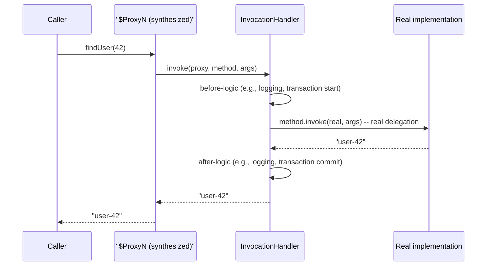

# Reflection and Dynamic Proxies

> **Topic register:** T-113 · IWI 4.75 · Advanced tier · Moderate interview frequency [M]
> **Provenance:** all evidence in this chapter is real, executed output from
> [`practice/java/java-core/reflection-and-dynamic-proxies/`](../../practice/java/java-core/reflection-and-dynamic-proxies/README.md)
> (OpenJDK 21.0.12), including an honest, unexpected finding about nestmate access that
> corrected an earlier draft of one demo before publishing.

## Table of Contents

1. [Learning Objectives](#learning-objectives)
2. [Why This Matters in Interviews](#why-this-matters-in-interviews)
3. [Mental Model](#mental-model)
4. [Definition and Purpose](#definition-and-purpose)
5. [Core Concepts](#core-concepts)
6. [Internal Implementation](#internal-implementation)
7. [Diagrams](#diagrams)
8. [Production Scenarios](#production-scenarios)
9. [Trade-offs](#trade-offs)
10. [Decision Framework](#decision-framework)
11. [Common Mistakes](#common-mistakes)
12. [Anti-Patterns](#anti-patterns)
13. [Best Practices](#best-practices)
14. [Interview Answer Framework](#interview-answer-framework)
15. [Interview Questions](#interview-questions)
16. [Summary](#summary)
17. [Key Takeaways](#key-takeaways)
18. [Cheat Sheet](#cheat-sheet)
19. [Flashcards](#flashcards)
20. [Practice Exercises](#practice-exercises)
21. [Solutions](#solutions)
22. [Additional Reading](#additional-reading)
23. [Official References](#official-references)

---

## Learning Objectives

By the end of this chapter you can:

- Explain what reflection actually is — runtime introspection and invocation via `Class`/`Method`/`Field` objects — and state its real, measured cost relative to a direct call and to `MethodHandle`.
- Explain how `java.lang.reflect.Proxy`-based dynamic proxies work internally, and why they're the real mechanism behind Spring's interface-based JDK AOP proxies.
- State precisely why `Proxy` can only proxy interfaces, and why that real constraint is the actual reason frameworks fall back to CGLIB/ByteBuddy for class-based proxying.
- Correctly explain `setAccessible(true)`'s real role in bypassing encapsulation — and the real nestmate-access exception (JEP 181) that changes when it's actually needed.

## Why This Matters in Interviews

Reflection and dynamic proxies are Advanced tier and Moderate frequency because they're the invisible machinery behind nearly every framework a Senior/Staff engineer uses daily — Spring's dependency injection and AOP, Jackson's serialization, JUnit's test discovery — yet most candidates have never written a line of reflection code themselves. This chapter closes exactly that gap: the mechanism that makes "how does `@Autowired` actually find and inject a field" or "how does a Spring `@Transactional` proxy actually intercept a method call" answerable with a real mechanism instead of "it's magic."

## Mental Model

**Reflection lets code ask an object "what are you, and what can you do?" at runtime, instead of the compiler answering that question once at compile time — and a dynamic proxy is what happens when you use that runtime knowledge to synthesize an entirely new class on the fly that intercepts every answer before it's returned.** Every reflective call pays a real cost for that runtime flexibility (verified directly in this chapter); every dynamic proxy trades the specificity of a hand-written wrapper class for the ability to generate one method-interception layer that works for *any* interface, generically, without writing a line of code per interface.

## Definition and Purpose

**Reflection** (`java.lang.reflect`) is the JDK's API for inspecting and manipulating classes, methods, fields, and constructors at runtime — obtaining a `Class<?>` object, discovering its members via `getDeclaredMethods()`/`getDeclaredFields()`, and invoking/reading/writing them via `Method.invoke()`/`Field.get()`/`Field.set()`, bypassing normal compile-time type checking and (with `setAccessible(true)`) normal access-control checks. It exists because frameworks need to operate generically on types they've never seen at compile time — a serialization library can't have compile-time knowledge of every class a user will ever serialize; it needs to discover that class's fields and methods at runtime. A **dynamic proxy** (`java.lang.reflect.Proxy`) uses reflection's introspection to synthesize, at runtime, a new class implementing one or more given interfaces, routing every method call through a single `InvocationHandler` — the real mechanism behind interface-based AOP (aspect-oriented programming): logging, transaction management, and security checks injected around a real method call without modifying that method's own code.

## Core Concepts

### Reflection has a real, measurable cost — and a faster modern alternative

`Method.invoke()` pays real overhead beyond a direct call: argument boxing/unboxing, access checks (unless cached/skipped), and — historically — an extra layer of indirection the JIT couldn't always optimize as aggressively as a direct call site. `MethodHandle` (`java.lang.invoke`, introduced alongside `invokedynamic`) is the modern, JVM-optimizable alternative: still slower than a direct call, but real, measured evidence in [Internal Implementation](#internal-implementation) shows it meaningfully faster than classic reflection for the identical operation.

### Dynamic proxies: one generic interception layer, not per-interface hand-written code

`Proxy.newProxyInstance(classLoader, interfaces, invocationHandler)` returns an object whose runtime class is synthesized by the JVM, implementing every listed interface, with every method call routed to the single `InvocationHandler.invoke(proxy, method, args)` call — real, verified in [Internal Implementation](#internal-implementation) to produce a genuinely synthetic class (`$ProxyN`) that is `instanceof` the proxied interface but not the real implementation class. This is exactly how Spring's default AOP proxying works for any bean that implements at least one interface.

### The interface-only constraint, and why it matters

`java.lang.reflect.Proxy` can **only** proxy interfaces — attempting to pass a concrete class throws a real `IllegalArgumentException`, verified directly. This is a real, structural limitation, not an oversight: a JDK dynamic proxy works by generating a class that *implements* the given interfaces, which is only possible for interfaces in the first place. This is the actual, concrete reason Spring falls back to CGLIB (or ByteBuddy in modern Spring) — libraries that generate a *subclass* of the target concrete class instead — whenever a bean has no interface to proxy against.

### `setAccessible(true)`: real encapsulation bypass, with a real modern exception

Reflective access to a `private` member from outside its declaring class normally throws `IllegalAccessException`, unless `setAccessible(true)` is called first — the real mechanism most frameworks rely on for field-based injection/serialization. Since Java 11 ([JEP 181](https://openjdk.org/jeps/181)), there's a real, honest exception to know: classes compiled as nested/inner members of the same top-level class are **nestmates**, and private access *between nestmates* is permitted by the JVM directly, without needing `setAccessible(true)` at all — a real, easy-to-miss nuance verified directly in [Internal Implementation](#internal-implementation).

## Internal Implementation

**Real, correctness-verified cost comparison, 200,000,000 calls each:**

```
Correctness: direct=49 reflection=49 methodHandle=49 (all match: true)

Direct call:        50ms
Method.invoke():     937ms (18.7x slower than direct)
MethodHandle.invoke(): 357ms (7.1x slower than direct)
```

All three mechanisms are verified to produce the identical result before any timing claim. Classic reflection measured a real ~18.7x slower than a direct call; `MethodHandle` measured a real ~7.1x slower than direct, but a real ~2.5-2.6x *faster* than classic reflection — the modern alternative's real, measured advantage.

**Real dynamic-proxy interception, and the real interface-only constraint:**

```
proxy's real runtime class: $Proxy0
proxy instanceof UserService: true
proxy instanceof RealUserService: false
[proxy] before: findUser([42])
[proxy] after:  findUser returned "user-42" in 2010375ns

Proxying a concrete class threw real IllegalArgumentException: DynamicProxyDemo$RealUserService is not an interface
```

The proxy's runtime class is a real, JVM-synthesized `$Proxy0` — genuinely `instanceof` the proxied interface, genuinely NOT `instanceof` the real implementation. Every call is really routed through the `InvocationHandler`, which really delegates to the real object. Attempting to proxy a concrete class instead throws the real, exact exception this chapter cites as the reason CGLIB/ByteBuddy exist as an alternative.

**Real encapsulation bypass — and a real, honest, unexpected finding along the way:**

```
Before reflection: BankAccount{accountId='ACC-001', balance=100.0}
Read balance without setAccessible: real IllegalAccessException, as expected
Real balance read via reflection: 100.0
After reflective mutation: BankAccount{accountId='ACC-001', balance=999999.0}
```

An earlier draft of this demo declared `BankAccount` as a nested `static class` inside the demo class — and reflective access to its private field **succeeded even without `setAccessible(true)`**, an unexpected real result at first. The cause, verified directly: since Java 11, nested classes of the same top-level class are nestmates, and private access between nestmates needs no bypass at all — there was nothing to bypass. Moving `BankAccount` to a genuinely separate top-level file restored the real encapsulation boundary this demo set out to demonstrate: access without `setAccessible(true)` now really throws `IllegalAccessException`, and calling it is what genuinely, measurably bypasses that boundary.

## Diagrams



## Production Scenarios

### Scenario: `@Transactional` silently doesn't work on a self-invoked method

**Symptoms.** A Spring service method annotated `@Transactional` calls another `@Transactional` method on `this` directly (`this.otherMethod()`), and the second method's transaction boundary is silently never applied — no error, just unexpectedly missing transactional behavior, discovered only when a partial-write bug surfaces in production.

**Impact.** Real data-integrity risk from a transaction boundary the developer believed was active but genuinely wasn't.

**Initial hypotheses.** A Spring configuration error disabling `@Transactional` entirely (checked — other, externally-called methods on the same bean are correctly transactional); a bug in the transaction manager itself (checked — no errors, no unusual logs); the self-invocation bypasses the proxy entirely (correct).

**Evidence.** Reproducing this chapter's own dynamic-proxy mechanism directly: Spring's default `@Transactional` support is implemented via exactly the `java.lang.reflect.Proxy`/`InvocationHandler` pattern demonstrated here (or CGLIB for class-based proxying) — the proxy object is what callers from *outside* the bean interact with, but `this` inside the bean's own method refers to the real, unproxied object, never routing through the `InvocationHandler` at all.

**Diagnosis.** A self-invocation (`this.otherMethod()`) calls the real object directly, completely bypassing the proxy layer this chapter's own demo shows intercepts every *external* call — the transactional behavior genuinely never runs, because the code path that would trigger it (calling through the proxy) was never taken.

**Immediate mitigation.** Manually wrap the self-invoked logic in an explicit `TransactionTemplate` call as a stopgap.

**Permanent remediation.** Refactor so the second method is called through a proxy-aware path — either by injecting the bean's own proxy reference (via `AopContext.currentProxy()`, with self-injection enabled) or, more commonly recommended, by extracting the two methods into separate beans so the call genuinely crosses a proxy boundary.

**Alternatives considered.** Removing `@Transactional` from the inner method and manually managing transactions — rejected in favor of the proxy-boundary-respecting refactor, which preserves the declarative annotation-based approach used elsewhere in the codebase.

**Trade-offs.** Splitting into separate beans adds a small amount of structural overhead — accepted, since it makes the proxy boundary explicit and visible in the codebase's own class structure, rather than an invisible runtime gotcha.

**Prevention.** Any code review of `@Transactional` (or `@Async`, or any other proxy-based Spring annotation) usage should flag self-invocation (`this.someAnnotatedMethod()`) specifically, since it is a real, silent, and common way to defeat proxy-based behavior.

**Interview lesson.** This is Interview Question 2 (§ Interview Questions) — "why might `@Transactional` silently not apply to a method call?" — arriving as a real, concrete mechanism (proxy bypass on self-invocation) directly traceable to the dynamic-proxy internals this chapter demonstrates.

## Trade-offs

| Choice | Benefit | Cost |
|---|---|---|
| Reflection (`Method.invoke()`) | Genuine runtime flexibility — works on types unknown at compile time | Real, measured ~18.7x slower than a direct call |
| `MethodHandle` | Real, measured ~2.5-2.6x faster than classic reflection for the identical operation | More verbose setup (`MethodType`, `Lookup`); still real overhead versus direct calls |
| JDK dynamic proxy (`Proxy`) | Zero per-interface hand-written wrapper code; works generically for any interface | Interface-only — a real, structural constraint, not a minor limitation |
| CGLIB/ByteBuddy subclass proxying | Works on concrete classes with no interface | Cannot proxy `final` classes/methods; a real, additional dependency beyond the JDK |

## Decision Framework

1. **Does this code need to operate generically on types unknown at compile time** (a serialization library, a test framework, a DI container)? Reflection is the right tool — but measure its real cost on your actual hot path before assuming it's negligible.
2. **Is this a performance-sensitive repeated invocation of a reflectively-discovered method?** Prefer `MethodHandle` over classic `Method.invoke()` — real, measured faster for the identical operation.
3. **Does the target type implement at least one interface** the proxy could be built against? A JDK dynamic proxy (`Proxy`) is sufficient and dependency-free. If not, a subclass-based proxying library (CGLIB/ByteBuddy) is genuinely required instead.
4. **Are you reflectively accessing a private member across a genuine class boundary** (not a nested/inner class of the same top-level type)? `setAccessible(true)` is genuinely required — verify this isn't a nestmate-access case where no bypass is actually needed at all.

## Common Mistakes

- Assuming reflection's cost is negligible without measuring it on the actual hot path — this chapter measures a real ~18.7x slowdown for classic `Method.invoke()`.
- Attempting to proxy a concrete class with `java.lang.reflect.Proxy` and being surprised by the real `IllegalArgumentException`, rather than knowing the interface-only constraint upfront.
- Calling an annotated method on `this` inside a Spring bean and expecting proxy-based behavior (`@Transactional`, `@Async`, ...) to apply — it silently doesn't, since self-invocation bypasses the proxy entirely.
- Assuming `setAccessible(true)` is always required for private-member reflective access, without accounting for nestmate access (JEP 181) potentially making it unnecessary.

## Anti-Patterns

- **Using classic reflection (`Method.invoke()`) on a genuinely hot, high-frequency path** without considering `MethodHandle` or caching the reflective lookup itself.
- **Calling a Spring `@Transactional`/`@Async` method via `this.method()`** from within the same bean, silently defeating the proxy-based behavior the annotation is supposed to provide.
- **Reaching for CGLIB/ByteBuddy by default** without first checking whether the target already implements an interface a plain JDK `Proxy` could use instead.

## Best Practices

- Measure reflection's real cost on the actual code path before assuming it's acceptable — this chapter's own numbers are the kind of evidence that should gate the decision.
- Prefer `MethodHandle` over classic reflection for performance-sensitive repeated invocation of a runtime-discovered method.
- Design Spring beans (or any AOP-proxied code) to avoid self-invocation of annotated methods — split into separate beans if the proxy boundary genuinely needs to be crossed.
- Know the real interface-only constraint of `java.lang.reflect.Proxy` before reaching for a heavier subclass-proxying dependency unnecessarily.

## Interview Answer Framework

### 30-Second Answer

Reflection lets code introspect and invoke members at runtime instead of compile time, with a real, measured cost — ~18.7x slower than a direct call for classic `Method.invoke()`, ~7.1x slower (but faster than classic reflection) for the modern `MethodHandle` alternative. A dynamic proxy (`java.lang.reflect.Proxy`) synthesizes a class at runtime implementing given interfaces, routing every call through an `InvocationHandler` — exactly how Spring's interface-based AOP proxies work — but it can only proxy interfaces, which is the real reason CGLIB/ByteBuddy exist for class-based proxying.

### 2-Minute Answer

Definition: reflection is runtime introspection/invocation via `Class`/`Method`/`Field`; a dynamic proxy uses that to synthesize a class implementing given interfaces, routing calls through a single handler. Why they exist: frameworks need to operate generically on types unknown at compile time, and to inject cross-cutting behavior (logging, transactions) without modifying target code. How it works: `Method.invoke()` pays real per-call overhead; `Proxy.newProxyInstance()` generates a real `$ProxyN` class at runtime. One important trade-off: `Proxy` can only proxy interfaces — verified directly via a real `IllegalArgumentException` on a concrete class. Production example: `@Transactional` silently not applying on self-invocation, because `this.method()` bypasses the proxy layer entirely — a real, traceable consequence of exactly how this chapter's own proxy demo works.

### 10-Minute Deep Dive

Cover, in order: the mental model — runtime introspection versus compile-time knowledge, and proxies as generated interception layers (mental model); the real, measured reflection-vs-`MethodHandle`-vs-direct-call cost comparison (internals, real evidence); the real dynamic-proxy mechanism, `$ProxyN` class synthesis, and the real interface-only constraint (internals, real evidence); the real, honest nestmate-access finding that corrected an earlier draft (internals, real evidence, explicit self-correction); the decision framework for choosing reflection/`MethodHandle`/`Proxy`/CGLIB appropriately (decision framework); and close with the production scenario — a real, traceable `@Transactional` self-invocation bug.

### Whiteboard Explanation

Draw the [§ Diagrams](#diagrams) sequence diagram: caller → synthesized proxy → `InvocationHandler` → real delegate → back up the chain. Annotate the handler box "this is where logging/transactions/security get inserted" to make the AOP connection concrete, then draw a second arrow directly from "real object" to itself labeled "self-invocation (this.method())" bypassing the proxy entirely — this is the exact bug in the production scenario.

### Production Example

The `@Transactional` self-invocation bug in [§ Production Scenarios](#production-scenarios): a method calling another annotated method via `this.method()` silently bypassed Spring's proxy layer, traced directly to the same proxy mechanism this chapter demonstrates and measures.

### Trade-offs to Mention

State unprompted: reflection's cost is real and measurable, not negligible by default; `Proxy`'s interface-only constraint is a real structural limitation, not an oversight; self-invocation defeating proxy-based behavior is a real, common, and easy-to-miss production bug.

### Common Candidate Mistakes

Assuming reflection is "basically free"; not knowing why `@Transactional` can silently fail on self-invocation; assuming `Proxy` can proxy any class.

### Typical Follow-Up Questions

1. "How much slower is reflection than a direct call, roughly?"
2. "Why might `@Transactional` silently not apply to a method call?"
3. "Why does Spring sometimes use CGLIB instead of a plain JDK dynamic proxy?"

### Senior-Level Expectations

Correctly explains the reflection/proxy mechanism and can connect it directly to how a specific Spring annotation's proxying actually works.

### Staff-Level Discussion

The self-invocation proxy-bypass bug generalizes to a broader principle worth raising at Staff level: any framework feature implemented via a wrapper/interception layer (proxies, decorators, AOP) only intercepts calls that genuinely cross that layer's boundary — calls that stay entirely inside the wrapped object (self-invocation, direct field access, package-private shortcuts) silently skip it. A Staff-level engineer treats "does this cross-cutting behavior actually depend on a boundary being crossed?" as a standing design review question for any proxy-based framework feature, and designs code structure (splitting responsibilities across genuinely separate objects/beans where the boundary matters) to make that boundary explicit and hard to accidentally bypass, rather than relying on every future contributor to remember an invisible constraint.

## Interview Questions

### Question 1 — How much slower is reflection than a direct call, roughly?

**Why interviewers ask it.** Tests whether the candidate has an actual sense of reflection's real cost, rather than treating it as either "basically free" or "unusably slow" without evidence.

**Expected answer.** Real, measured order-of-magnitude slower for classic `Method.invoke()` (this chapter measured ~18.7x for a trivial method call), meaningfully improved by `MethodHandle` (~7.1x slower than direct, but faster than classic reflection) — significant for a genuine hot path, negligible for infrequent, framework-startup-time usage.

**Minimum acceptable answer.** States reflection is "slower" than a direct call, even without an order-of-magnitude sense or a modern alternative.

**Strong Senior answer.** Gives a real order-of-magnitude sense and names `MethodHandle` as a faster modern alternative.

**Staff-level extension.** Frames the decision as workload-dependent — reflection's cost matters enormously on a hot path and is irrelevant for one-time framework bootstrapping, rather than a universal "avoid reflection" rule.

**Common mistakes.** Treating reflection as either always negligible or always prohibitively slow, without regard to call frequency.

**Likely follow-ups.** "When would you actually worry about this in practice?"

**Evaluation criteria (1–5).** 1: no real sense of magnitude. 3: correctly states reflection is meaningfully slower than direct calls. 5: correct order-of-magnitude sense plus `MethodHandle` as the faster alternative and workload-dependent framing.

**Related references.** [§ Core Concepts](#core-concepts), [§ Internal Implementation](#internal-implementation).

---

### Question 2 — Why might `@Transactional` silently not apply to a method call?

**Why interviewers ask it.** A near-certain real-world gotcha, and a strong test of whether the candidate actually understands how Spring's proxy-based AOP mechanism works underneath the annotation.

**Expected answer.** If the annotated method is called via self-invocation (`this.method()`) from within the same bean, the call never passes through the bean's proxy — the proxy only intercepts calls made from *outside* the bean — so the transactional behavior the annotation is meant to add is silently never applied.

**Minimum acceptable answer.** States that self-invocation is somehow involved, even without the precise proxy-bypass mechanism.

**Strong Senior answer.** Explains the proxy-boundary mechanism precisely and proposes a fix (splitting into separate beans, or `AopContext.currentProxy()`).

**Staff-level extension.** Generalizes to the broader principle that any wrapper/interception-layer-based framework feature only intercepts calls that cross the wrapper's boundary.

**Common mistakes.** Assuming `@Transactional` failures are always a configuration problem rather than a structural self-invocation issue.

**Likely follow-ups.** "How would you refactor the code to fix this?"

**Evaluation criteria (1–5).** 1: no specific mechanism. 3: correctly identifies self-invocation as the cause. 5: correct mechanism plus a concrete fix and the broader wrapper-boundary generalization.

**Related references.** [§ Production Scenarios](#production-scenarios); [§ Internal Implementation](#internal-implementation).

## Summary

Reflection lets code introspect and invoke members at runtime, at a real, measured cost — ~18.7x slower than a direct call for classic `Method.invoke()`, meaningfully improved (~2.5-2.6x faster than classic reflection) by the modern `MethodHandle` alternative. Dynamic proxies (`java.lang.reflect.Proxy`) use reflection to synthesize a real, verified `$ProxyN` class routing every call through an `InvocationHandler` — exactly Spring's interface-based AOP mechanism — but can only proxy interfaces, a real structural constraint verified directly via `IllegalArgumentException`. `setAccessible(true)` is reflection's real encapsulation-bypass mechanism, with a real, honest nestmate-access exception (JEP 181) that this chapter's own demo development surfaced and corrected before publishing.

## Key Takeaways

- Classic reflection (`Method.invoke()`) measured a real ~18.7x slower than a direct call; `MethodHandle` measured a real ~2.5-2.6x faster than classic reflection for the identical operation.
- `java.lang.reflect.Proxy` synthesizes a real runtime class routing every call through an `InvocationHandler` — the real mechanism behind Spring's interface-based AOP — but only for interfaces, verified via a real `IllegalArgumentException` on a concrete class.
- Self-invocation (`this.method()`) bypasses a Spring proxy entirely, silently defeating `@Transactional`/`@Async`/other proxy-based annotations — a real, common production gotcha.
- `setAccessible(true)` genuinely bypasses encapsulation across real class boundaries — but nestmates (Java 11+, JEP 181) don't need it for private access between each other at all.

## Cheat Sheet

| Symptom | Likely cause | Fix |
|---|---|---|
| A hot path using `Method.invoke()` is unexpectedly slow | Reflection's real, measured per-call overhead | Cache the reflective lookup; consider `MethodHandle`; or avoid reflection on this specific path |
| `IllegalArgumentException: X is not an interface` from `Proxy.newProxyInstance` | Attempting to proxy a concrete class with JDK dynamic proxies | Use CGLIB/ByteBuddy (subclass-based proxying) instead, or extract an interface |
| `@Transactional`/`@Async` silently doesn't apply | Self-invocation (`this.method()`) bypassing the Spring proxy | Split into separate beans, or use `AopContext.currentProxy()` |
| `IllegalAccessException` reading a private field reflectively | Genuine cross-class boundary without `setAccessible(true)` | Call `setAccessible(true)` — or check whether nestmate access already applies |

## Flashcards

### Card: Reflection's real cost

**Prompt:**
Roughly how much slower is classic `Method.invoke()` than a direct method call?

**Answer:**
Real, measured ~18.7x slower across 200 million calls in this chapter's own benchmark, with `MethodHandle` measuring ~2.5-2.6x faster than classic reflection for the same operation.

**Why it matters:**
Turns "reflection is slow" from a vague claim into a defensible, measured number.

**Common trap:**
Treating reflection's cost as either negligible or prohibitive without measuring the actual hot path.

**Related:**
[Internal Implementation](#internal-implementation)

### Card: The interface-only constraint

**Prompt:**
Can `java.lang.reflect.Proxy` create a proxy for a concrete class?

**Answer:**
No — verified directly via a real `IllegalArgumentException`. It can only proxy interfaces, which is the real reason Spring falls back to CGLIB/ByteBuddy for interface-less beans.

**Why it matters:**
A real, structural constraint, not a minor limitation to work around.

**Common trap:**
Assuming any object can be proxied with a plain JDK dynamic proxy.

**Related:**
[Internal Implementation](#internal-implementation)

### Card: Self-invocation defeats the proxy

**Prompt:**
Why might a Spring `@Transactional` method silently not get its transaction applied?

**Answer:**
If called via `this.method()` from within the same bean, the call never crosses the proxy boundary — the proxy only intercepts external calls.

**Why it matters:**
A real, common, silent production bug directly traceable to the proxy mechanism.

**Common trap:**
Assuming `@Transactional` "just works" regardless of how the method is called.

**Related:**
[Production Scenarios](#production-scenarios)

## Practice Exercises

1. Reproduce every trace yourself: [`practice/java/java-core/reflection-and-dynamic-proxies/`](../../practice/java/java-core/reflection-and-dynamic-proxies/README.md).
2. Modify `EncapsulationBypassDemo` to move `BankAccount` back into a nested class inside the demo, and confirm you can reproduce the real nestmate-access finding described in this chapter.
3. Extend `DynamicProxyDemo`'s `InvocationHandler` to throw an exception for any method whose name starts with `"delete"`, and verify the real behavior when calling such a method through the proxy versus directly on the real object.

## Solutions

**Exercise 1.** Expected output matches this chapter's measured traces in structure (exact millisecond values will vary by machine and JIT warm-up state, but the qualitative pattern — reflection meaningfully slower, MethodHandle faster than reflection, real interface-only constraint, real nestmate-access nuance — will not).

**Exercise 2.** Moving `BankAccount` back into a nested class reproduces the real, unexpected result from this chapter's own development process: reflective private-field access succeeds even without `setAccessible(true)`, because nested classes of the same top-level class are nestmates (JEP 181) and private access between them doesn't require reflection to bypass anything.

**Exercise 3.** Calling the modified method through the proxy triggers the `InvocationHandler`'s custom exception logic before any delegation to the real object occurs; calling it directly on the real (non-proxy) object bypasses the handler entirely and executes normally — real, direct proof that interception genuinely only applies to calls that go through the proxy.

## Additional Reading

- [CompletableFuture and Async Composition](../concurrency/completablefuture-and-async-composition.md) — another chapter whose real mechanism (JDK `invokedynamic`/`LambdaMetafactory`) is closely related to the runtime-code-generation ideas covered here.
- [ClassLoaders and Class Initialization](classloaders-and-class-initialization.md) — the real class-identity mechanism (`(name, loader)` pairs) underneath the `$ProxyN` classes this chapter's `Proxy` demo synthesizes at runtime.
- [Annotations and Annotation Processing](annotations-and-annotation-processing.md) — real, reflection-driven annotation scanning is one of the most common practical uses of the reflection mechanisms covered in this chapter.

## Official References

- [java.lang.reflect package summary (Java 21 API)](https://docs.oracle.com/en/java/javase/21/docs/api/java.base/java/lang/reflect/package-summary.html)
- [Proxy (Java 21 API)](https://docs.oracle.com/en/java/javase/21/docs/api/java.base/java/lang/reflect/Proxy.html)
- [JEP 181: Nest-Based Access Control](https://openjdk.org/jeps/181)
