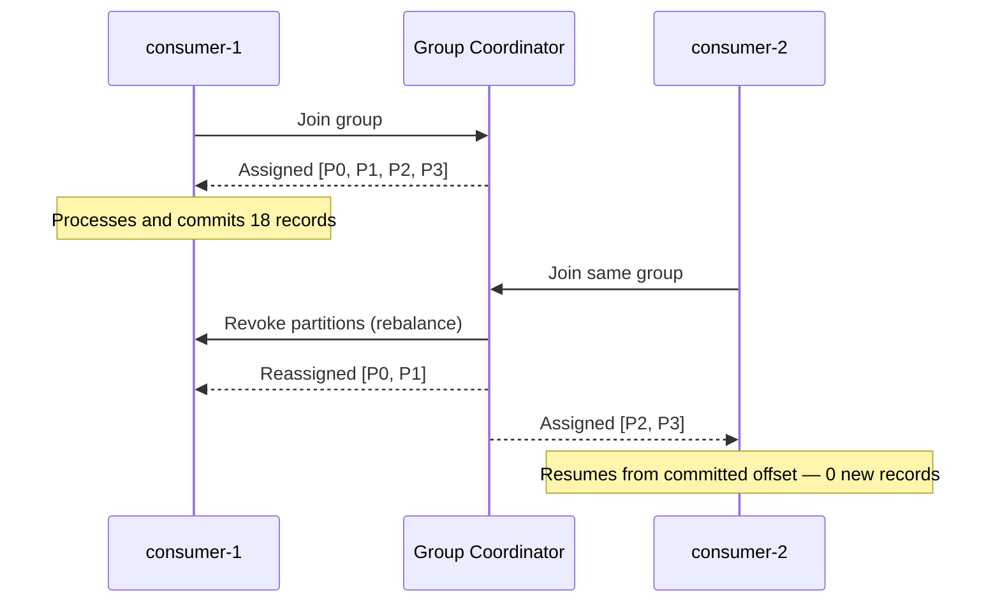

# Kafka Consumer Groups, Rebalancing, and Offset Management

> **Topic register:** T-703 · IWI 7.50 (#tied high in 198) · Advanced tier · High interview frequency [H]
> **Provenance:** the rebalance trace in this chapter is real, executed output from [`practice/java/week-08/kafka/src/ConsumerGroupDemo.java`](../../practice/java/week-08/kafka/src/ConsumerGroupDemo.java) against a live single-broker KRaft cluster with a 4-partition topic and 18 records.

## Table of Contents

1. [Learning Objectives](#learning-objectives)
2. [Why This Matters in Interviews](#why-this-matters-in-interviews)
3. [Mental Model](#mental-model)
4. [Definition and Purpose](#definition-and-purpose)
5. [Historical Context](#historical-context)
6. [Core Concepts](#core-concepts)
7. [Internal Implementation](#internal-implementation)
8. [Diagrams](#diagrams)
9. [Production Scenarios](#production-scenarios)
10. [Failure Modes and Debugging](#failure-modes-and-debugging)
11. [Trade-offs](#trade-offs)
12. [Decision Framework](#decision-framework)
13. [Comparisons](#comparisons)
14. [Common Mistakes](#common-mistakes)
15. [Anti-Patterns](#anti-patterns)
16. [Best Practices](#best-practices)
17. [Interview Answer Framework](#interview-answer-framework)
18. [Interview Questions](#interview-questions)
19. [Summary](#summary)
20. [Key Takeaways](#key-takeaways)
21. [Cheat Sheet](#cheat-sheet)
22. [Flashcards](#flashcards)
23. [Practice Exercises](#practice-exercises)
24. [Solutions](#solutions)
25. [Additional Reading](#additional-reading)
26. [Official References](#official-references)

---

## Learning Objectives

By the end of this chapter you can:

- Explain what triggers a rebalance and why "the group rebalanced" is a symptom, not a diagnosis.
- Correctly diagnose a group that rebalances repeatedly, distinguishing `max.poll.interval.ms` violations from genuine scaling or crash events.
- State why consumer parallelism for a topic is hard-capped at its partition count.
- Explain the difference between eager and cooperative-incremental rebalancing and what each actually costs.

## Why This Matters in Interviews

Consumer-group rebalancing is where Kafka's abstraction meets real distributed-systems failure modes — "your consumer group rebalances every 30 seconds, diagnose it" is a standard High-frequency deep-dive because the answer requires separating three genuinely different causes (scaling, crashes, slow processing) that all produce the identical visible symptom. It also connects directly to offset-commit semantics, which is the substrate [Delivery Semantics and Exactly-Once Processing](delivery-semantics-and-exactly-once.md) (T-704) builds on.

## Mental Model

**A rebalance is Kafka's answer to "who owns what, right now" whenever the answer might have changed.** Group membership changing (join, leave, crash, or a missed liveness deadline) is the *only* trigger — a rebalance is not a periodic maintenance event, and if one is happening on a schedule, something is *causing* membership to appear to change on that schedule, most often a slow consumer being mistaken for a dead one.

## Definition and Purpose

A **consumer group** is a set of consumer instances sharing a `group.id`, cooperatively consuming a topic such that each partition is assigned to exactly one consumer *within the group* at a time — other groups consuming the same topic are entirely independent, each receiving its own full copy of the stream. The group coordinator (a broker) tracks membership and triggers a **rebalance** — reassigning partitions — whenever membership changes. This exists because a single consumer caps read throughput at one process; consumer groups let multiple instances split a topic's partitions for parallel consumption while Kafka handles the bookkeeping of who owns what, and rebalancing exists so that failure or scaling doesn't require manual reassignment.

## Historical Context

The original (**eager**) rebalance protocol, part of Kafka's consumer group design since its 0.9 rewrite, revokes every partition from every consumer in the group before reassigning any of them — a full stop-the-world pause across the entire group on any membership change, regardless of how small the actual change is. **KIP-429** (Kafka 2.4, 2019 — the same release cycle as the sticky partitioner) introduced **cooperative-incremental rebalancing** via the `CooperativeStickyAssignor`, which only revokes the specific partitions that actually need to move, letting unaffected consumers keep processing throughout the rebalance. This was a direct response to production experience with large consumer groups, where every scaling event or transient consumer restart paused the *entire* group's throughput, not just the affected member's.

## Core Concepts

### Assignment is exclusive within the group

At any moment, exactly one consumer within a group owns a given partition — never zero (unless the group has fewer members than partitions and some are unassigned), never more than one.

### Offset commits, not partition count, drive resumption point

A consumer group tracks progress per partition via committed offsets. A newly-joined member resumes from the last *committed* offset for its assigned partitions, not from the beginning of the log — this is why a second consumer joining a group that has already drained and committed the backlog processes zero new records, not a redundant copy of everything.

### Rebalance triggers

A consumer joining, a consumer leaving cleanly, a consumer crashing, or a consumer missing its liveness deadline (a `session.timeout.ms` heartbeat failure, or a `max.poll.interval.ms` violation between successive `poll()` calls) — any of these changes group membership and triggers a rebalance.

### Eager vs. cooperative-incremental rebalancing

Eager rebalancing revokes every partition from every consumer before reassigning — a brief stop-the-world pause across the whole group on every membership change. Cooperative-incremental rebalancing (`CooperativeStickyAssignor`) only revokes the specific partitions that need to move, letting unaffected consumers keep processing.

## Internal Implementation

**Real output** — `consumer-1` joins alone first, consumes everything, then `consumer-2` joins the same group and a rebalance splits the (now-empty) partition assignment:

```
== consumer-1 joins group 'order-processors-...' alone -> gets all 4 partitions ==
[consumer-1] assigned partitions: [orders-0, orders-1, orders-2, orders-3]
== consumer-2 joins the same group -> triggers rebalance, partitions split ==
[consumer-1] assigned partitions: [orders-0, orders-1]
[consumer-2] assigned partitions: [orders-2, orders-3]
consumer-1 processed 18 records, consumer-2 processed 0 records
== both leave; a solo consumer-3 joins the same group -> full rebalance, gets all partitions back ==
[consumer-3] assigned partitions: [orders-0, orders-1, orders-2, orders-3]
consumer-3 alone was assigned: processed 0 NEW records (rest already committed by consumer-1/2)
```

Three real behaviors worth naming explicitly:

1. **Assignment is exclusive within the group** — after the rebalance, `orders-0`/`orders-1` belong to `consumer-1` and `orders-2`/`orders-3` to `consumer-2`; no overlap.
2. **`consumer-2` processed zero *new* records** here specifically because `consumer-1` had already drained and committed the entire backlog before `consumer-2` joined — this is offset commits doing their job, not a bug: a newly-joined member resumes from the committed offset, not from the beginning.
3. **A solo `consumer-3` joining later gets the full 4-partition assignment back** — group membership, not partition count, drives fan-out; with one member, one member gets everything.

This directly answers the blueprint's named follow-up, *"Your consumer group rebalances every 30 seconds. Diagnose it"* — the two most common root causes are (a) `max.poll.interval.ms` violations (a slow consumer takes longer between `poll()` calls than the group tolerates, so the coordinator declares it dead and rebalances, even though the process is alive but just slow) and (b) autoscaling churn triggering group-membership changes faster than the group can settle.

## Diagrams



## Production Scenarios

### Scenario: a consumer group rebalancing every 30 seconds, mistaken for a networking issue

**Symptoms.** A consumer group processing order events shows a rebalance event in logs roughly every 30 seconds; throughput drops noticeably during each rebalance window; on-call initially suspects network flakiness between consumers and brokers.

**Impact.** Reduced effective throughput (repeated stop-the-world pauses under the eager assignor in use), and wasted investigation time chasing the wrong hypothesis.

**Initial hypotheses.** Network partition or flakiness (checked — no corresponding network errors or packet loss in infrastructure metrics); broker instability (checked — broker logs show no crashes or leader elections); a genuinely slow consumer (correct).

**Evidence.** Consumer logs show `max.poll.interval.ms` warnings immediately preceding each rebalance; application metrics show per-batch processing time creeping close to the configured `max.poll.interval.ms` value under load, specifically because a recently added synchronous downstream HTTP call inside the poll loop occasionally takes several seconds.

**Diagnosis.** The consumer is alive and eventually finishes each batch, but occasionally exceeds `max.poll.interval.ms` between `poll()` calls due to the added synchronous call; the coordinator interprets this as a dead consumer and evicts it, triggering a rebalance — which then happens again once the "new" (same) consumer rejoins and eventually hits the same slow path again.

**Immediate mitigation.** Increase `max.poll.interval.ms` as a stopgap to stop the eviction-and-rebalance cycle while the root cause is addressed.

**Permanent remediation.** Move the synchronous HTTP call off the poll thread (into an async pipeline, or reduce `max.poll.records` so each batch's worst-case processing time stays well under the timeout), and switch the group to `CooperativeStickyAssignor` so that any future, less frequent rebalance doesn't pause the whole group.

**Alternatives considered.** Simply raising `max.poll.interval.ms` indefinitely — rejected as a permanent fix, since it only delays detection of a genuinely dead consumer rather than addressing the actual latency problem.

**Trade-offs.** Moving the HTTP call off the poll thread adds asynchronous-processing complexity in exchange for eliminating the rebalance cycle entirely, rather than just tolerating it with a longer timeout.

**Prevention.** Any change adding a network call or other unbounded-latency operation to a consumer's processing path should be reviewed against its `max.poll.interval.ms` budget before shipping.

**Interview lesson.** This is precisely the "consumer group rebalances every 30 seconds" interview question (§ Interview Questions Q1) arriving as a real incident, including the wrong initial hypothesis (networking) that a shallow understanding of rebalance triggers naturally produces.

## Failure Modes and Debugging

| Symptom | Likely cause | Debugging step |
|---|---|---|
| Group rebalances repeatedly, roughly periodically | `max.poll.interval.ms` violations from slow per-batch processing | Check for `max.poll.interval.ms` warnings in consumer logs immediately preceding each rebalance; measure actual per-batch processing time |
| Group rebalances once, unexpectedly | Genuine scaling event or consumer crash | Check group-membership change logs and consumer process health/crash logs |
| Adding consumers doesn't increase throughput | Consumer count already at or beyond partition count | Check partition count vs. consumer count; extra consumers beyond partition count sit idle by design |
| Newly-joined consumer processes fewer records than expected | Not a bug — it resumed from the already-committed offset | Confirm against offset-commit history; this is correct, expected behavior |
| Rebalances pause the whole group's throughput, not just the affected member | Using the eager assignor | Switch to `CooperativeStickyAssignor` (`partition.assignment.strategy`) |

## Trade-offs

| Choice | Benefit | Cost |
|---|---|---|
| More consumers in a group | More parallel throughput | Capped at partition count — consumers beyond that sit idle |
| Cooperative-incremental assignor | Rebalances don't stop the whole group | More complex protocol; still pauses the *moving* partitions |
| Manual offset commit (`enable.auto.commit=false`) | Precise control over at-least-once vs at-most-once ([Delivery Semantics](delivery-semantics-and-exactly-once.md)) | More application code; a bug here directly causes duplicate or lost processing |
| Long `max.poll.interval.ms` | Tolerates slower per-batch processing without spurious rebalances | Slower detection of a genuinely dead consumer |

## Decision Framework

1. **Is the rebalance periodic, or a one-time event?** Periodic strongly suggests `max.poll.interval.ms` violations; a one-time event is more likely a genuine scaling or crash event.
2. **What is the actual per-batch processing time relative to `max.poll.interval.ms`?** Measure this directly before assuming a networking or infrastructure cause.
3. **Does this consumer group's assignor matter for the blast radius?** If rebalances are expected to happen with any regularity (autoscaling, rolling deploys), use `CooperativeStickyAssignor` to limit the pause to the affected partitions only.
4. **Is the consumer count already at or above partition count?** If so, additional consumers won't help — the fix is elsewhere (more partitions, if ordering permits, or faster per-partition processing).

## Comparisons

| Aspect | Eager rebalancing | Cooperative-incremental rebalancing |
|---|---|---|
| Partitions revoked | All partitions from all consumers | Only the specific partitions that need to move |
| Throughput impact | Full group pause on every rebalance | Only affected consumers pause; unaffected ones keep processing |
| Introduced | Original consumer-group protocol | KIP-429 (Kafka 2.4) |
| When it still matters | Simpler protocol, adequate for small or rarely-rebalancing groups | Preferred for large groups or environments with frequent membership churn (autoscaling) |

## Common Mistakes

- Assuming a rebalance means something is broken, rather than a normal response to membership change.
- Adding consumers past the partition count expecting more throughput.
- Committing offsets before processing completes without meaning to (accidentally choosing at-most-once — see [Delivery Semantics](delivery-semantics-and-exactly-once.md)).

## Anti-Patterns

- **Chasing a networking hypothesis for a periodic rebalance** before checking `max.poll.interval.ms` violations, which is by far the more common cause.
- **Adding consumers indefinitely to "fix" a throughput problem** without checking whether the group is already at the partition-count ceiling.
- **Leaving the eager assignor as default** on a large group that experiences regular membership churn from autoscaling.

## Best Practices

- Check `max.poll.interval.ms` warnings first for any periodic or recurring rebalance before investigating infrastructure.
- Size consumer count to partition count deliberately — extra consumers beyond it provide zero additional throughput.
- Use `CooperativeStickyAssignor` for any group where rebalances are expected with any regularity.
- Keep processing time per poll comfortably under `max.poll.interval.ms`, moving unbounded-latency operations (network calls, large batch work) off the direct poll-processing path where possible.

## Interview Answer Framework

### 30-Second Answer

A consumer group splits a topic's partitions across its members, one partition per consumer at a time, and rebalances whenever membership changes. The most common real-world cause of *repeated* rebalancing is `max.poll.interval.ms` violations — a slow-but-alive consumer being evicted as if dead — not a networking problem.

### 2-Minute Answer

Definition: a consumer group cooperatively splits a topic's partitions, one per member at a time, coordinated by a broker-side group coordinator. Why it exists: a single consumer caps throughput at one process; groups add parallelism with automatic reassignment on failure or scaling. How it works: any membership change (join, leave, crash, missed liveness deadline) triggers a rebalance; a newly-joined member resumes from the last committed offset, not the beginning. One important trade-off: the classic eager assignor pauses the *whole* group on every rebalance, while cooperative-incremental (`CooperativeStickyAssignor`) only pauses the partitions actually moving. Production example: a real trace showing a second consumer joining a group processed zero new records, correctly, because the first consumer had already committed the entire backlog — offset-commit semantics working as intended, not a bug.

### 10-Minute Deep Dive

Cover, in order: consumer-group mechanics and the exclusivity-within-group guarantee (internals); the measured rebalance trace showing correct offset-driven resumption (internals + edge case that looks like a bug but isn't); rebalance triggers, with special attention to `max.poll.interval.ms` violations as the dominant real-world cause of *repeated* rebalancing (failure mode); eager vs. cooperative-incremental rebalancing and the KIP-429 history behind the distinction (trade-off + historical context); the hard partition-count ceiling on consumer parallelism (edge case); and close with the production scenario — a rebalance-every-30-seconds incident initially misdiagnosed as networking, actually caused by an added synchronous HTTP call inside the poll loop.

### Whiteboard Explanation

Draw the [§ Diagrams](#diagrams) sequence: `consumer-1` joins, gets all four partitions; `consumer-2` joins; the coordinator revokes and reassigns. Annotate the reassignment arrow with "resumes from committed offset, not from zero" — this is the detail that makes "consumer-2 processed 0 new records" click as correct behavior rather than a bug, when narrated live.

### Production Example

The rebalance-every-30-seconds incident in [§ Production Scenarios](#production-scenarios): initially suspected as a networking issue, actually caused by a synchronous HTTP call added to the poll loop occasionally exceeding `max.poll.interval.ms`, evicting a live-but-slow consumer repeatedly.

### Trade-offs to Mention

State unprompted: a rebalance is a symptom of membership change, not inherently a problem; repeated rebalancing is usually `max.poll.interval.ms` violations, not networking; eager rebalancing pauses the whole group, cooperative-incremental only the moving partitions; consumer parallelism is hard-capped at partition count.

### Common Candidate Mistakes

Jumping straight to "network issue" without checking processing time per poll first; assuming more consumers always means more throughput; treating a rebalance itself as evidence of a bug rather than checking why membership changed.

### Typical Follow-Up Questions

1. "How do you fix a rebalance-every-30-seconds problem without just increasing the timeout indefinitely?"
2. "Add consumers beyond the partition count. What happens?"
3. "How does cooperative-incremental rebalancing actually reduce the blast radius?"

### Senior-Level Expectations

Names `max.poll.interval.ms` and `max.poll.records` as the relevant levers for a repeated-rebalance diagnosis; states that partition count is the hard ceiling on consumer parallelism for a given topic.

### Staff-Level Discussion

Consumer-group rebalancing is a specific instance of a general distributed-systems pattern — cooperative work assignment under dynamic membership — that shows up in job schedulers, sharded caches, and distributed locks alike. The Staff-level distinction in this topic specifically is recognizing that "the group rebalanced" is a symptom, and the actual diagnosis requires separating three different causes with three different fixes: genuine scaling events (expected, benign), consumer crashes (investigate the crash), and `max.poll.interval.ms` violations from slow processing (a latency bug wearing a rebalance costume). Connecting this back to [Kafka Architecture Fundamentals](kafka-architecture-fundamentals.md) and [Producer Semantics](producer-semantics-and-partition-keys.md), since partition count is effectively fixed for a keyed topic, consumer-side scalability for that topic is decided at topic-creation time, not at scaling time.

## Interview Questions

### Question 1 — Your consumer group rebalances every 30 seconds. Diagnose it.

**Why interviewers ask it.** The standard deep-dive for this topic; a correct answer requires distinguishing three genuinely different root causes that all produce the identical visible symptom.

**Expected answer.** Most likely `max.poll.interval.ms` being violated by slow per-batch processing, causing the coordinator to evict a live-but-slow consumer as if it were dead, repeatedly.

**Minimum acceptable answer.** States that rebalancing is triggered by membership changes and investigates why membership is changing, even without naming the specific setting.

**Strong Senior answer.** Names `max.poll.interval.ms` and `max.poll.records` as the levers, and considers reducing batch size or moving heavy work off the poll thread.

**Staff-level extension.** Also considers cooperative-incremental rebalancing to reduce the blast radius while the root cause is fixed, and distinguishes this from a `session.timeout.ms`/heartbeat-thread issue (a genuinely different failure mode).

**Common mistakes.** Jumping straight to "network issue" without checking processing time per poll first.

**Likely follow-ups.** "How do you fix it without just increasing the timeout indefinitely?"

**Evaluation criteria (1–5).** 1: "must be a network issue." 3: names `max.poll.interval.ms` as the likely cause. 5: names it, proposes a fix, and distinguishes it from a heartbeat-thread issue.

**Related references.** [§ Internal Implementation](#internal-implementation); [§ Production Scenarios](#production-scenarios).

---

### Question 2 — Add consumers beyond the partition count. What happens?

**Why interviewers ask it.** Tests whether the candidate understands the hard structural ceiling on consumer parallelism, not just "more consumers, more throughput" folklore.

**Expected answer.** Extra consumers in the group receive zero partitions and sit idle — assignment is capped at partition count, one partition per consumer maximum.

**Minimum acceptable answer.** States that there's a limit to useful consumer count, even without stating it's exactly the partition count.

**Strong Senior answer.** States that partition count is the hard ceiling on consumer parallelism for a given topic.

**Staff-level extension.** Connects this back to [Kafka Architecture Fundamentals](kafka-architecture-fundamentals.md) and [Producer Semantics](producer-semantics-and-partition-keys.md) — since partition count is effectively fixed for a keyed topic, consumer-side scalability for that topic is decided at topic-creation time, not at scaling time.

**Common mistakes.** Assuming more consumers always means more throughput.

**Likely follow-ups.** "So how do you scale consumption further?"

**Evaluation criteria (1–5).** 1: "more consumers always help." 3: correctly states the partition-count ceiling. 5: states the ceiling plus connects it to the topic-creation-time sizing decision.

**Related references.** [§ Core Concepts](#core-concepts); [Kafka Architecture Fundamentals](kafka-architecture-fundamentals.md).

## Summary

Consumer groups split a topic's partitions across member consumers, one partition per consumer at a time, and rebalance automatically on membership change. Rebalance frequency is a diagnostic signal — recurring rebalances almost always trace back to `max.poll.interval.ms` violations from slow processing, not the rebalance mechanism itself being at fault. Consumer parallelism for a topic is hard-capped at its partition count.

## Key Takeaways

- One partition, one consumer, within a group, at a time.
- Consumers beyond partition count sit idle.
- Recurring rebalances usually mean slow processing violating `max.poll.interval.ms`, not a networking problem.
- Cooperative-incremental rebalancing narrows the blast radius of a rebalance but doesn't eliminate the underlying cause.

## Cheat Sheet

| Situation | What to check |
|---|---|
| Group rebalances repeatedly, roughly periodically | `max.poll.interval.ms` violations first, before infrastructure |
| Adding consumers, no throughput gain | Compare consumer count to partition count |
| Need to reduce rebalance blast radius | `CooperativeStickyAssignor` |
| Newly-joined consumer processes fewer records than expected | Check committed-offset history — likely correct, not a bug |

## Flashcards

### Card: Exclusive partition assignment

**Prompt:**
Can two consumers in the same group read the same partition simultaneously?

**Answer:**
No — exactly one consumer per partition per group at a time.

**Why it matters:**
The core guarantee that makes consumer-group parallelism coherent.

**Common trap:**
Assuming partitions can be shared for extra throughput within a group.

**Related:**
[Core Concepts](#core-concepts)

### Card: Most common cause of repeated rebalancing

**Prompt:**
What's the most common cause of a group rebalancing repeatedly?

**Answer:**
`max.poll.interval.ms` violations from slow per-batch processing, evicting a live-but-slow consumer.

**Why it matters:**
The standard deep-dive question for this topic; most candidates guess "networking" first.

**Common trap:**
Assuming a networking issue before checking processing time per poll.

**Related:**
[Production Scenarios](#production-scenarios)

### Card: Consumer parallelism ceiling

**Prompt:**
What caps consumer parallelism for one topic?

**Answer:**
The partition count — extra consumers beyond it sit idle.

**Why it matters:**
Ties consumer-side scaling back to a topic-creation-time decision.

**Common trap:**
Assuming adding consumers always increases throughput.

**Related:**
[Interview Questions](#interview-questions), Question 2

## Practice Exercises

1. Reproduce the rebalance trace yourself: [`practice/java/week-08/kafka/src/ConsumerGroupDemo.java`](../../practice/java/week-08/kafka/src/ConsumerGroupDemo.java).
2. Add a `Thread.sleep()` inside the poll loop long enough to exceed a shortened `max.poll.interval.ms`, and observe the resulting rebalance in the logs.
3. Explain, in writing, why `consumer-2` in the real trace above processed zero new records — connect it explicitly to committed-offset semantics.

## Solutions

**Exercise 1.** Expected output matches this chapter's trace: `consumer-1` gets all partitions alone, then splits with `consumer-2` on join, with `consumer-2` processing zero new records because the backlog was already committed.

**Exercise 2.** Expected result: a `max.poll.interval.ms` warning in the logs, followed by the coordinator evicting the sleeping consumer and triggering a rebalance — reproducing the mechanism behind this chapter's production scenario.

**Exercise 3.** `consumer-2` processed zero new records because `consumer-1` had already consumed and committed offsets for the entire 18-record backlog before `consumer-2` joined. Consumer groups resume from the last *committed* offset for a partition, not from the beginning of the log — so a newly-assigned partition with no new records since its last commit correctly yields nothing to process.

## Additional Reading

- [Kafka documentation — Consumer configs](https://kafka.apache.org/documentation/#consumerconfigs)

## Official References

- [KIP-429 — Kafka Consumer Incremental Rebalance Protocol](https://cwiki.apache.org/confluence/display/KAFKA/KIP-429%3A+Kafka+Consumer+Incremental+Rebalance+Protocol)
