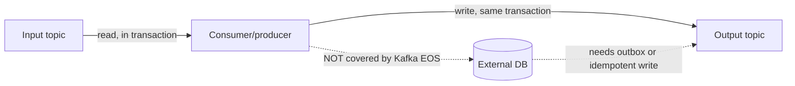

# Kafka Delivery Semantics and Exactly-Once Processing

> **Topic register:** T-704 · IWI 8.00 (#11 tied of 198) · Advanced tier · High interview frequency [H] · Highest-weighted topic in the Kafka Semantics Cluster
> **Provenance:** the duplicate-processing and lost-processing traces in this chapter are real, executed output from [`practice/java/week-08/kafka/src/DeliverySemanticsDemo.java`](../../practice/java/week-08/kafka/src/DeliverySemanticsDemo.java) — actual offset commits against a live broker, not a simulated description.

## Table of Contents

1. [Learning Objectives](#learning-objectives)
2. [Why This Matters in Interviews](#why-this-matters-in-interviews)
3. [Mental Model](#mental-model)
4. [Definition and Purpose](#definition-and-purpose)
5. [Core Concepts](#core-concepts)
6. [Internal Implementation](#internal-implementation)
7. [Diagrams](#diagrams)
8. [Java Examples](#java-examples)
9. [Production Scenarios](#production-scenarios)
10. [Failure Modes and Debugging](#failure-modes-and-debugging)
11. [Trade-offs](#trade-offs)
12. [Decision Framework](#decision-framework)
13. [Comparisons](#comparisons)
14. [Common Mistakes](#common-mistakes)
15. [Anti-Patterns](#anti-patterns)
16. [Best Practices](#best-practices)
17. [Interview Answer Framework](#interview-answer-framework)
18. [Interview Questions](#interview-questions)
19. [Summary](#summary)
20. [Key Takeaways](#key-takeaways)
21. [Cheat Sheet](#cheat-sheet)
22. [Flashcards](#flashcards)
23. [Practice Exercises](#practice-exercises)
24. [Solutions](#solutions)
25. [Additional Reading](#additional-reading)
26. [Official References](#official-references)

---

## Learning Objectives

By the end of this chapter you can:

- State the three possible delivery semantics and explain precisely why no ordering of "commit" and "process" avoids both duplication and loss.
- Answer "is exactly-once real?" with the scoped, correct answer rather than a flat yes or no.
- Design an idempotent consumer side effect for a non-idempotent action (a payment, an email) using a dedupe key.
- Recognize the commit-vs-process ordering problem as a specific instance of the general dual-write problem, and name its three resolutions.

## Why This Matters in Interviews

*"Is exactly-once real?"* is one of this project's own blueprint-named discriminating questions, precisely because both confident wrong answers — "yes, Kafka is exactly-once" and "no, that's marketing" — sound plausible and are both wrong. The honest, scoped answer requires understanding that Kafka's exactly-once semantics covers a specific transactional loop *within* Kafka, and requires additional machinery (an outbox, or an idempotent consumer) to extend to any external system — a distinction that separates candidates who've actually built an event-driven pipeline from those who've only read about one.

## Mental Model

**"Commit the offset" and "process the record" are two separate operations against two different systems, and a crash can land between them — there is no ordering of those two steps alone that avoids both duplication and loss.** Commit after processing: a crash before commit causes redelivery (duplicates). Commit before processing: a crash after commit but before processing means that record is silently skipped forever (loss). Exactly-once isn't a third ordering of the same two steps — it's additional machinery (a transaction, or an idempotency check) that closes the gap those two steps alone cannot close.

## Definition and Purpose

**Delivery semantics** describe what a consumer can guarantee about how many times each record gets processed, given that "commit the offset" and "process the record" are two separate operations that can be interrupted independently. There are exactly three possible orderings of those two operations relative to a crash, and each produces a different guarantee: **at-most-once**, **at-least-once**, and (with additional coordination) **exactly-once**. This vocabulary exists because a consumer cannot atomically "process a record and record that it did so" as one step against two different systems — Kafka's offset store and whatever the processing side-effect touches (a database write, an email send, a downstream publish) — without extra coordination, and delivery semantics is the precise language for stating what happens to that gap when a crash lands inside it.

## Core Concepts

### At-least-once (commit after processing)

The consumer processes the record, then commits the offset. If it crashes after processing but before committing, the record is redelivered on restart — the failure mode is **duplication**, never loss. This is the safe default for most systems, since reprocessing a record is usually cheaper than losing one, provided the processing step is made idempotent.

### At-most-once (commit before processing)

The consumer commits the offset, then processes the record. If it crashes after committing but before processing, that record is never retried — the failure mode is **silent loss**, never duplication. Rarely the right default; occasionally acceptable for genuinely disposable data (e.g., best-effort metrics where losing a sample is immaterial).

### Exactly-once, scoped correctly

Kafka's exactly-once semantics (EOS) covers the **transactional read-process-write loop entirely within Kafka**: a consumer reads from an input topic, a producer writes to an output topic, and both the consumed offsets and the produced records commit as one atomic transaction (`transactional.id`, `isolation.level=read_committed` on downstream consumers). If the process crashes mid-transaction, the whole transaction rolls back — nothing partially applied is ever visible to a `read_committed` consumer. **What it does NOT cover:** any write to a system outside Kafka. If a consumer reads a record and writes to Postgres as its side effect, there is no built-in atomicity between "the Kafka offset committed" and "the Postgres row committed."

### Closing the external-system gap

Two mechanisms close the gap exactly-once EOS does not cover: the **transactional outbox pattern** (write the DB row and the outbound event in the same DB transaction, then a separate publisher reads the outbox and produces to Kafka), or making the external write **idempotent** at the consumer boundary, so redelivery is safe regardless of how many times it happens.

## Internal Implementation

**Real output, at-least-once (commit AFTER processing) — a crash before commit causes redelivery:**
```
== at-least-once: commit AFTER processing ==
-- attempt 1: process batch, crash before commit --
  processed 18 records, simulating crash BEFORE commitSync()
-- attempt 2 (same group, no commit landed): reprocess from last committed offset --
  processed 18 records, committed successfully
attempt 1 processed 18 records (uncommitted) + attempt 2 processed 18 records (redelivered)
= 36 total deliveries for 18 unique records -> duplicates observed
```

**Real output, at-most-once (commit BEFORE processing) — a crash after commit but before processing loses the batch entirely:**
```
== at-most-once: commit BEFORE processing ==
-- attempt 1: commit offsets immediately on poll, then crash before processing --
  committed offsets for 18 records, simulating crash BEFORE processing them
-- attempt 2 (same group, offsets already committed): poll returns nothing left --
  committed and processed 0 records (0 expected -- backlog was already drained by attempt 1's commit)
attempt 1 committed offsets for 0 records but crashed before processing them
+ attempt 2 processed 0 records = 0 records actually processed out of 18 -> loss observed
```

The two traces are mirror images of the same underlying fact: **the order of "commit" relative to "process" determines which failure mode you get, and there is no ordering of just those two steps that avoids both.**

## Diagrams



## Java Examples

```java
// Java 21. An idempotent consumer side effect using a durable dedupe key —
// the general mechanism for making a non-idempotent action (charging a
// payment) safe under at-least-once redelivery.

@Service
public class PaymentConsumer {

    private final PaymentGateway paymentGateway;
    private final ProcessedRecordRepository processedRecords; // durable dedupe table

    public PaymentConsumer(PaymentGateway paymentGateway, ProcessedRecordRepository processedRecords) {
        this.paymentGateway = paymentGateway;
        this.processedRecords = processedRecords;
    }

    // Called once per Kafka record, possibly more than once under at-least-once
    // redelivery. recordId must be a stable, durable identifier attached to the
    // event itself (e.g., an idempotency key generated at event-creation time),
    // not the Kafka offset — offsets are not stable across topic recreation.
    @Transactional
    public void handle(String recordId, PaymentRequest request) {
        if (processedRecords.existsById(recordId)) {
            // Already handled this exact record — skip the side effect entirely,
            // converting a non-idempotent action (charge a card) into an
            // idempotent operation from the caller's perspective.
            return;
        }
        paymentGateway.charge(request);
        processedRecords.save(new ProcessedRecord(recordId, Instant.now()));
        // The dedupe-table write and the offset commit both need to survive
        // together; committing the Kafka offset only after this transaction
        // commits keeps "processed" and "recorded as processed" consistent
        // even across a crash between them (see Failure Modes below).
    }
}
```

**Complexity note:** the dedupe check is `O(1)` (a keyed lookup) per record; the value here is entirely about correctness under redelivery, not algorithmic cost.

## Production Scenarios

### Scenario: duplicate payment charges traced to at-least-once redelivery without an idempotency check

**Symptoms.** A small number of customers report being charged twice for a single order, discovered via support tickets rather than an internal alert.

**Impact.** Direct financial exposure, refund processing overhead, and customer trust damage.

**Initial hypotheses.** A client-side double-submit (checked — request logs show only one original client request per affected order); a payment-gateway-side bug (checked with the vendor — ruled out); a Kafka consumer redelivery without deduplication (correct).

**Evidence.** Consumer logs show the same Kafka record (same partition, same offset) processed twice, several seconds apart, with a consumer restart in between; the payment-charging code had no dedupe check — it called the payment gateway directly on every invocation of the handler.

**Diagnosis.** The consumer commits offsets after processing (at-least-once, the correct default for avoiding silent loss), but the processing step itself — charging a payment — was not made idempotent. A crash after the first charge succeeded but before the offset committed caused exactly the redelivery this chapter's Demo predicts, and the redelivered record triggered a second, real charge.

**Immediate mitigation.** Manually identify and refund the duplicate charges found via reconciliation against the payment gateway's own transaction log.

**Permanent remediation.** Add a durable dedupe table keyed by a stable event ID (not the Kafka offset), exactly as shown in the Java example above — check-and-skip before calling the payment gateway, and only mark the record processed after the charge succeeds, within the same transaction boundary as the offset-commit bookkeeping.

**Alternatives considered.** Switching to at-most-once (commit before processing) — rejected outright, since it converts a duplicate-charge risk into a silent-loss risk (a paid order that's never fulfilled), which is a strictly worse failure mode for this business case.

**Trade-offs.** The dedupe table adds a lookup and a write to every payment-processing call, and a small amount of storage growth — accepted as clearly worthwhile against the cost of duplicate financial transactions.

**Prevention.** Any consumer whose side effect is not naturally idempotent (payments, sending a notification, provisioning a resource) requires a design-review checklist item: what is the dedupe key, where is it stored durably, and is the dedupe check part of the same transaction as the side effect?

**Interview lesson.** This is Interview Question 2 (§ Interview Questions) — "consumer crashes after processing but before committing" — arriving as a real financial incident, and it demonstrates precisely why "the crash is the bug" is the wrong framing: the crash and redelivery are expected; the missing idempotency check is the actual defect.

## Failure Modes and Debugging

| Symptom | Likely cause | Debugging step |
|---|---|---|
| A record's side effect happens more than once | At-least-once redelivery with a non-idempotent processing step | Add a durable dedupe key check before performing the side effect |
| A record's side effect never happens, with no error | At-most-once (commit-before-processing) losing the record on a crash | Switch to commit-after-processing; add monitoring on committed-vs-processed offset gaps |
| Duplicate records appear only in a downstream system, not in Kafka itself | The consumer's write to the external system isn't covered by Kafka's own EOS | Add an outbox pattern or an idempotent write at the external-system boundary |
| Exactly-once transactional consumer/producer still shows inconsistency with an external database | Kafka EOS only covers the Kafka-to-Kafka loop, not the external write | Verify whether an outbox or idempotent-write mechanism actually exists for the external write — it isn't automatic |

## Trade-offs

| Approach | Guarantee | Cost |
|---|---|---|
| Commit after processing (at-least-once) | No silent loss | Consumer must tolerate/dedupe reprocessing |
| Commit before processing (at-most-once) | No duplicate processing | Silent loss on crash — rarely acceptable |
| Kafka transactional EOS (Kafka-to-Kafka only) | True exactly-once within Kafka | Higher latency (transaction coordinator round-trip); doesn't extend past Kafka |
| Idempotent consumer (dedupe key at the write boundary) | Effectively exactly-once end-to-end, including external systems | Requires a durable dedupe key and a lookup/upsert on every write |

## Decision Framework

1. **Can the processing side effect be made idempotent?** If yes (most database writes, via upsert), default to at-least-once plus an idempotent write — this is the simplest, most robust combination.
2. **Is the side effect genuinely non-idempotent** (a payment, an email, provisioning a physical resource)? Add an explicit durable dedupe key check before performing it, converting it into an idempotent operation from the caller's perspective.
3. **Is the entire pipeline Kafka-to-Kafka?** If so, Kafka's native transactional EOS may be sufficient on its own.
4. **Does the pipeline write to an external system (database, HTTP call)?** Then Kafka's EOS alone is not sufficient — an outbox pattern or idempotent consumer write is required regardless of Kafka-level settings.
5. **Is losing a small amount of data genuinely acceptable for this data** (best-effort metrics, for instance)? Only then consider at-most-once; treat this as a deliberate, documented exception, not a default.

## Comparisons

| Guarantee | Duplicates possible? | Loss possible? | Typical use |
|---|---|---|---|
| At-most-once | No | Yes | Rarely the right default; genuinely disposable data only |
| At-least-once | Yes | No | The standard default — pair with an idempotent processing step |
| Kafka transactional EOS | No | No | Kafka-to-Kafka pipelines only |
| Idempotent consumer (dedupe key) | Effectively no (deduplicated) | No | Any pipeline with an external-system side effect |

## Common Mistakes

- Believing Kafka provides end-to-end exactly-once by default, including writes to external systems.
- Choosing commit-before-processing (at-most-once) without a deliberate reason — it's rarely the right default.
- Treating redelivery under at-least-once as a bug to eliminate rather than a condition to design the processing step to tolerate.

## Anti-Patterns

- **Defaulting to at-most-once "to avoid duplicates"** without recognizing the trade is silent, permanent data loss — usually the worse failure mode by far.
- **Assuming Kafka's transactional producer/consumer setup alone makes an external database write exactly-once** — it does not, without an outbox or idempotent write at that specific boundary.
- **Treating every redelivered record as an incident** rather than designing the processing step to tolerate redelivery as expected, routine behavior.

## Best Practices

- Default to at-least-once (commit after processing) and make the processing step idempotent, rather than reaching for at-most-once.
- For genuinely non-idempotent side effects, add a durable dedupe key check as part of the same transaction as the side effect itself.
- For pipelines touching an external system, treat Kafka's own EOS as insufficient by default — explicitly implement an outbox or idempotent-write mechanism at that boundary.
- Monitor for gaps between "committed offset" and "processed record" counts as an early signal of at-most-once-style loss.

## Interview Answer Framework

### 30-Second Answer

There are three delivery semantics: at-most-once (commit before processing, risks silent loss), at-least-once (commit after processing, risks duplicates), and exactly-once (extra machinery). Kafka's own exactly-once is real, but scoped to a transactional Kafka-to-Kafka read-process-write loop — it does not cover writes to external systems without an outbox or an idempotent consumer.

### 2-Minute Answer

Definition: delivery semantics describe how many times a record can be processed, given that committing an offset and processing a record are two separate, independently-interruptible operations. Why it exists: no ordering of just those two steps avoids both duplication and loss. How it works: commit-after-processing risks duplicates (safe default); commit-before-processing risks silent loss (rarely acceptable). One important trade-off: Kafka's transactional EOS is real, but scoped to Kafka-to-Kafka — external writes need an outbox pattern or idempotent consumer. Production example: two real, measured traces — one showing 36 deliveries for 18 unique records under at-least-once, one showing 0 records processed out of 18 under at-most-once — the same underlying mechanism producing opposite failure modes depending purely on commit-vs-process ordering.

### 10-Minute Deep Dive

Cover, in order: why "commit" and "process" are two separate operations against two different systems (mental model); the measured at-least-once and at-most-once traces, both real (internals + edge cases); the precise, scoped answer to "is exactly-once real" (the discriminating question); the outbox pattern and idempotent-consumer mechanisms that close the external-system gap (alternative + connection to T-618 Saga/Outbox); the general dual-write problem this all instantiates (Staff-level framing); and close with the production scenario — a real duplicate-payment incident traced to a missing idempotency check on an otherwise-correct at-least-once consumer.

### Whiteboard Explanation

Draw two timelines side by side, both labeled "commit" and "process" as two boxes with an arrow between them, and a lightning bolt (crash) placed at a different point on each: on one timeline, the crash lands *after* process but *before* commit (label it "duplicates"); on the other, *after* commit but *before* process (label it "loss"). This paired-timeline image is what makes "there's no ordering of these two steps that avoids both" click, rather than reading as an assertion.

### Production Example

The duplicate-payment incident in [§ Production Scenarios](#production-scenarios): a correctly-configured at-least-once consumer redelivered a record after a crash between processing and commit, and because the payment-charging side effect had no dedupe check, the customer was charged twice — fixed by adding a durable dedupe key check, not by changing the delivery semantics.

### Trade-offs to Mention

State unprompted: no ordering of commit-vs-process avoids both duplication and loss; Kafka's exactly-once is real but scoped to Kafka-to-Kafka; at-least-once plus an idempotent processing step is the generally-correct default, not at-most-once.

### Common Candidate Mistakes

Flatly saying "yes, Kafka is exactly-once" or flatly saying "no, that's marketing" — both wrong; treating the crash itself as the bug rather than the missing idempotency design; forgetting that idempotent producers (T-702) and idempotent consumers are different mechanisms at different layers.

### Typical Follow-Up Questions

1. "Your consumer writes to Kafka AND Postgres. How do you make that exactly-once end-to-end?"
2. "What if the side effect is sending an email — you can't 'idempotently' unsend one?"
3. "How does this connect to the Saga/Outbox pattern?"

### Senior-Level Expectations

States the Kafka-to-Kafka scope of exactly-once correctly; names idempotency keys/dedupe tables as the general mechanism for making a non-idempotent side effect safe under redelivery.

### Staff-Level Discussion

The commit-vs-process ordering problem in this chapter is a specific instance of the general **dual-write problem** — any time two systems must both be updated as a result of one logical event, and there's no shared transaction spanning both, one of three outcomes is being chosen: risk duplication, risk loss, or invest in a coordinating mechanism (transactions, outbox, idempotency). This shows up identically in Saga/Outbox patterns and in any service publishing an event as a side effect of a database write. A Staff-level engineer names which of the three the system is choosing, explicitly, for every dual-write in a design — rather than leaving it as an unstated assumption that surfaces as a production incident.

## Interview Questions

### Question 1 — Is exactly-once real? Explain precisely what Kafka provides and what it doesn't.

**Why interviewers ask it.** Both confident flat answers ("yes" and "no") are wrong; the honest, scoped answer is the actual signal being tested for.

**Expected answer.** Real, but scoped to the transactional read-process-write loop within Kafka; does not extend to external systems without an outbox or idempotent consumer.

**Minimum acceptable answer.** Recognizes the question isn't a simple yes/no, even without the precise scope.

**Strong Senior answer.** States the Kafka-to-Kafka scope correctly.

**Staff-level extension.** Proposes the outbox pattern or idempotent-write mechanism unprompted, and explains why a dual-write (write DB, then separately produce to Kafka, no coordination) can never be made safe without one of those.

**Common mistakes.** Flatly saying "yes, Kafka is exactly-once" or flatly saying "no such thing, it's marketing."

**Likely follow-ups.** "Your consumer writes to Kafka AND Postgres. How do you make that exactly-once end-to-end?"

**Evaluation criteria (1–5).** 1: flat yes or no with no scoping. 3: correct Kafka-to-Kafka scope. 5: correct scope plus an unprompted outbox/idempotent-consumer proposal.

**Related references.** [§ Core Concepts](#core-concepts); [§ Internal Implementation](#internal-implementation).

---

### Question 2 — Consumer crashes after processing but before committing. What happens, and how do you make that safe?

**Why interviewers ask it.** Tests whether the candidate treats redelivery as an expected condition to design for, versus a bug to eliminate.

**Expected answer.** At-least-once redelivery of the same batch on restart; made safe by ensuring the processing side-effect is idempotent (e.g., an upsert keyed by record ID, not an unconditional insert or increment).

**Minimum acceptable answer.** States that the record will be reprocessed, even without naming the fix.

**Strong Senior answer.** Names idempotency keys/dedupe tables as the general mechanism.

**Staff-level extension.** For genuinely non-idempotent side effects (emails, payments), proposes a dedupe check (has this record ID already triggered this side effect?) as a separate durable state check before performing the action — converting a non-idempotent action into an idempotent operation from the caller's perspective.

**Common mistakes.** Treating "the crash is the bug" rather than accepting redelivery as expected and designing the processing step to tolerate it.

**Likely follow-ups.** "What if the side effect is sending an email — you can't 'idempotently' unsend one?"

**Evaluation criteria (1–5).** 1: "this shouldn't happen." 3: names redelivery and idempotency keys generically. 5: full dedupe-check design for a genuinely non-idempotent side effect.

**Related references.** [§ Java Examples](#java-examples); [§ Production Scenarios](#production-scenarios).

## Summary

At-least-once and at-most-once are two sides of the same coin: whichever of "commit" or "process" happens first survives a crash, and the other is redone or lost. Both traces in this chapter are real, not theoretical. Kafka's exactly-once semantics is real but scoped to Kafka-to-Kafka transactional pipelines; extending the guarantee to external systems requires an outbox or an idempotent consumer, not a Kafka setting.

## Key Takeaways

- Commit-after-processing risks duplicates (usually the safer default).
- Commit-before-processing risks silent loss (rarely acceptable).
- Kafka EOS is real for Kafka-to-Kafka; it does not cover external system writes.
- The outbox pattern and idempotent consumers are the two mechanisms that close the external-system gap.

## Cheat Sheet

| Question | Answer |
|---|---|
| Commit before or after processing? | After, by default — accept redelivery, design for idempotency |
| Is Kafka exactly-once? | Yes, Kafka-to-Kafka, transactionally; no, not to external systems without extra work |
| How to make an external write safe under redelivery? | Idempotency key / dedupe check, or transactional outbox |

## Flashcards

### Card: What causes at-least-once duplicates

**Prompt:**
What causes at-least-once duplicate processing?

**Answer:**
Committing the offset AFTER processing; a crash between processing and commit causes redelivery.

**Why it matters:**
The standard, generally-correct default — but only safe if processing is idempotent.

**Common trap:**
Treating redelivery as a bug rather than expected behavior to design for.

**Related:**
[Internal Implementation](#internal-implementation)

### Card: What causes at-most-once loss

**Prompt:**
What causes at-most-once silent loss?

**Answer:**
Committing the offset BEFORE processing; a crash after commit but before processing means that record is never retried.

**Why it matters:**
Explains why at-most-once is rarely the right default.

**Common trap:**
Choosing at-most-once to "avoid duplicates" without recognizing the loss risk it trades in.

**Related:**
[Internal Implementation](#internal-implementation)

### Card: Scope of Kafka's exactly-once

**Prompt:**
Does Kafka's exactly-once cover a write to an external database?

**Answer:**
No — only the Kafka-to-Kafka transactional read-process-write loop; external writes need an outbox or idempotent consumer.

**Why it matters:**
The precise, scoped answer to this project's own discriminating interview question.

**Common trap:**
Assuming Kafka's transactional producer/consumer setup alone makes any external write exactly-once.

**Related:**
[Core Concepts](#core-concepts)

## Practice Exercises

1. Reproduce both traces yourself: [`practice/java/week-08/kafka/src/DeliverySemanticsDemo.java`](../../practice/java/week-08/kafka/src/DeliverySemanticsDemo.java).
2. Design an idempotency-key scheme for a consumer that charges a payment on each record — what's the key, where is it stored, and what happens on redelivery?
3. Sketch how the transactional outbox pattern would close the gap for a consumer that reads from Kafka and writes to Postgres, and identify exactly which write the outbox makes atomic with which.

## Solutions

**Exercise 1.** Expected output matches this chapter's two traces exactly: 36 total deliveries for 18 unique records under at-least-once (duplicates), and 0 records actually processed out of 18 under at-most-once (loss).

**Exercise 2.** A correct scheme: the key is a stable identifier generated at event-creation time (not the Kafka offset, which isn't stable across topic operations), stored in a durable dedupe table alongside a timestamp; on redelivery, the consumer checks the table before calling the payment gateway and skips the charge if the key is already present — exactly the pattern in this chapter's Java example.

**Exercise 3.** The outbox pattern makes the Postgres business-data write and the "event to be published" row atomic, within one Postgres transaction — not the Kafka publish itself. A separate outbox-polling publisher then reads unpublished outbox rows and produces them to Kafka, retrying safely (since the outbox row isn't marked published until the produce succeeds) without ever risking a business write that has no corresponding outbound event, or vice versa.

## Additional Reading

- [Kafka documentation — Semantics of exactly-once](https://kafka.apache.org/documentation/#semantics)

## Official References

- [KIP-98 — Exactly Once Delivery and Transactional Messaging](https://cwiki.apache.org/confluence/display/KAFKA/KIP-98+-+Exactly+Once+Delivery+and+Transactional+Messaging)
