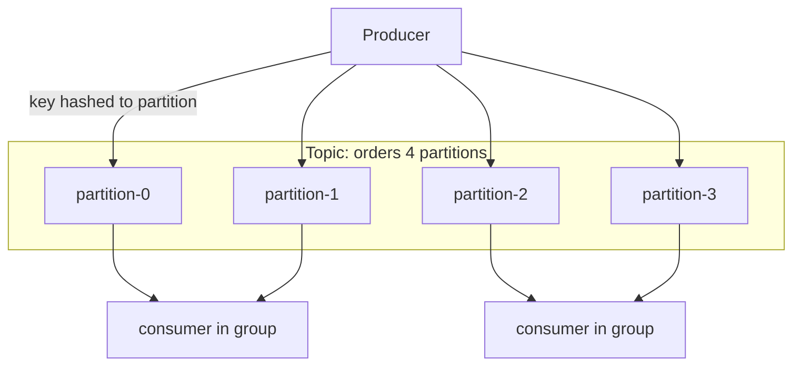

# Kafka Architecture Fundamentals — Topics, Partitions, Replication

> **Topic register:** T-701 · IWI 6.40 · Core tier · High interview frequency [H] · Prerequisite for the whole Kafka Semantics Cluster (T-702/T-703/T-704/T-705)
> **Provenance:** every partition/broker behavior in this chapter is exercised directly by [`practice/java/week-08/kafka/src/ProducerPartitionKeyDemo.java`](../../practice/java/week-08/kafka/src/ProducerPartitionKeyDemo.java) against a real single-broker KRaft cluster (a 4-partition topic). Replication/ISR mechanics are described from documented Kafka behavior rather than measured directly, since a single-broker practice cluster cannot itself demonstrate a multi-broker ISR shrink/expand — that gap is stated explicitly rather than faked.

## Table of Contents

1. [Learning Objectives](#learning-objectives)
2. [Why This Matters in Interviews](#why-this-matters-in-interviews)
3. [Mental Model](#mental-model)
4. [Definition and Purpose](#definition-and-purpose)
5. [Core Concepts](#core-concepts)
6. [Internal Implementation](#internal-implementation)
7. [Diagrams](#diagrams)
8. [Production Scenarios](#production-scenarios)
9. [Trade-offs](#trade-offs)
10. [Decision Framework](#decision-framework)
11. [Common Mistakes](#common-mistakes)
12. [Anti-Patterns](#anti-patterns)
13. [Best Practices](#best-practices)
14. [Interview Answer Framework](#interview-answer-framework)
15. [Interview Questions](#interview-questions)
16. [Summary](#summary)
17. [Key Takeaways](#key-takeaways)
18. [Cheat Sheet](#cheat-sheet)
19. [Flashcards](#flashcards)
20. [Practice Exercises](#practice-exercises)
21. [Additional Reading](#additional-reading)
22. [Official References](#official-references)

---

## Learning Objectives

By the end of this chapter you can:

- State precisely what Kafka guarantees about ordering — and what it does not.
- Explain why partition count is effectively a one-way door for a keyed topic, and size it accordingly at design time.
- Explain the ISR mechanism and why `replication.factor` is not the number `acks=all` actually waits on.
- Name unclean leader election as an explicit availability-for-durability trade, not a default to leave unexamined.

## Why This Matters in Interviews

This project's own knowledge-base audit found 15 Kafka rows averaging ~117 characters of pure API vocabulary — definitions with no semantics-under-failure content. Kafka's interview value lives almost entirely in the latter, and this chapter is the prerequisite for all of it: partition and replication mechanics are the substrate that producer semantics (T-702), consumer rebalancing (T-703), and delivery guarantees (T-704) are all built on. The single most consequential, most commonly missed fact in this entire domain — that Kafka guarantees ordering only within a partition, never across a topic — is established here.

## Mental Model

**A Kafka topic is not one log — it's several independent logs wearing one name.** Each partition is its own strictly-ordered, append-only sequence; the "topic" is just the grouping that lets producers and consumers address them together. Once this is the mental model, the rest follows: order exists only within a partition because there is no single log to order across; parallelism exists because independent logs can be written and read independently; and the partition key is the only mechanism that decides which of these several logs a given record's ordering guarantee lives in.

## Definition and Purpose

A **topic** is a durable, append-only log, split into an ordered set of **partitions** for parallelism. Each partition is an independent, strictly-ordered sequence of records, each assigned a monotonically increasing **offset**. Partitions are distributed across **brokers**; each partition has one **leader** broker (handling all reads/writes for that partition) and zero or more **follower** replicas copying the leader's log. This structure exists because a single append-only log gives total order but caps throughput at one machine's disk and network — splitting into partitions lets Kafka parallelize both writes (many partitions, many leaders, spread across brokers) and reads (one consumer per partition, in parallel), at the cost of only guaranteeing order *within* a partition.

## Core Concepts

### Ordering is per-partition, never per-topic

The single most consequential fact in this domain. A partition guarantees strict order for everything written to it; nothing is guaranteed about the relative order of records on different partitions, even if they were produced in a specific sequence by the same producer.

### Partition assignment is deterministic by key

A record with a key is routed to a partition via `hash(key) % partitionCount`. All records sharing a key land on the same partition, in the order they were sent — this is how per-entity ordering (e.g., "all of customer 42's events, in order") is achieved without global ordering.

### Partition count is a one-way door for keyed topics

Because assignment is `hash(key) % partitionCount`, changing partition count changes *every* key's mapping. Existing data's ordering guarantee is silently invalidated the moment the count changes — this is not a reversible tuning parameter once a keyed topic is live in production.

### Replication and the ISR

Each partition has a leader and `replication.factor - 1` followers. The **In-Sync Replica set (ISR)** is the subset of replicas fully caught up with the leader within `replica.lag.time.max.ms`. A record is **committed** only once every replica in the *current* ISR has it — not once `replication.factor` replicas have it. If a follower falls behind, it is dropped from the ISR; a shrunk ISR trades durability for availability, since fewer replicas need to acknowledge a write for it to succeed.

### Unclean leader election

`unclean.leader.election.enable=true` allows a broker outside the ISR to become leader when no in-sync replica is available — trading data loss (the out-of-sync replica is missing recent records) for availability (the partition stays writable). Leaving it disabled (the safer default) means an unavailable ISR makes the partition unavailable for writes until an in-sync replica returns.

## Internal Implementation

**Real output** (`ProducerPartitionKeyDemo`, `orders` topic, 4 partitions) — the same key always lands on the same partition, proving ordering is per-key/per-partition, not global:

```
== same key -> same partition, every time ==
key=customer-42 value=order-0 -> partition=1 offset=0
key=customer-42 value=order-1 -> partition=1 offset=1
key=customer-42 value=order-2 -> partition=1 offset=2
key=customer-42 value=order-3 -> partition=1 offset=3
key=customer-42 value=order-4 -> partition=1 offset=4
key=customer-42 value=order-5 -> partition=1 offset=5
== different keys -> spread across partitions ==
key=customer-1   -> partition=1 offset=6
key=customer-2   -> partition=2 offset=0
key=customer-3   -> partition=2 offset=1
key=customer-4   -> partition=1 offset=7
key=customer-5   -> partition=2 offset=2
key=customer-6   -> partition=3 offset=0
```

`customer-42`'s six records land on partition 1 in strict offset order 0→5: total order **for that key**. Interleave two different customers' records and there is no guaranteed relative order between them — they may sit on entirely different partitions, consumed by different consumers, in parallel, with no cross-partition ordering guarantee at all.

This directly feeds `acks=all` semantics (T-702): `acks=all` means "wait for the full **current** ISR," not "wait for `replication.factor` replicas" — if the ISR has shrunk to just the leader, `acks=all` provides no more durability than `acks=1` until `min.insync.replicas` is also set and enforced.

## Diagrams



## Production Scenarios

### Scenario: a "simple" partition-count increase silently breaks per-customer ordering

**Symptoms.** After a routine capacity change — doubling a topic's partition count to relieve a hot broker — a downstream consumer that reconstructs per-customer event sequences starts producing out-of-order results for a subset of customers, discovered only when a reconciliation job flags inconsistent state days later.

**Impact.** Silent, delayed-discovery data-correctness bug, not a crash — the kind that erodes trust in a pipeline slowly rather than paging anyone immediately.

**Initial hypotheses.** A consumer-side bug (checked — consumer code unchanged); a producer regression (checked — producer code unchanged); the partition-count change itself (correct).

**Evidence.** Comparing `hash(customerId) % oldPartitionCount` against `hash(customerId) % newPartitionCount` for affected customers shows the mapping changed for a subset of keys — new records for those customers now land on a different partition than their historical records.

**Diagnosis.** Partition count for a keyed topic is a one-way door (§ Core Concepts): increasing it remaps every key, and any consumer logic assuming "this customer's records are all on one partition, in order" breaks the moment old and new records for the same customer are split across partitions with no ordering relationship between them.

**Immediate mitigation.** Halt further scale-driven partition-count changes on ordering-dependent topics; document which topics have this dependency.

**Permanent remediation.** For genuinely ordering-dependent topics, plan partition count from projected peak scale *before* going live, since post-hoc increases are not safe; where a topic must eventually grow, migrate via a new topic with the target partition count and a controlled cutover, rather than resizing in place.

**Alternatives considered.** Leaving partition count fixed and addressing hot-broker load via a compound key or different sharding strategy instead of touching partition count.

**Trade-offs.** Provisioning for projected peak scale up front costs more idle capacity early; accepted because the alternative — a live remapping of an ordering-dependent topic — is not actually a safe operation at all.

**Prevention.** A pre-change checklist item: is this topic keyed, and does any consumer depend on per-key ordering? If yes, partition count is out of scope for a "quick capacity fix."

**Interview lesson.** This is the Staff-level framing of "partition count is a one-way door" (§ Staff-Level Discussion) arriving as a real, slow-burning incident rather than an abstract warning.

## Trade-offs

| Decision | Benefit | Cost |
|---|---|---|
| More partitions | More parallelism (producers, consumers) | More open file handles per broker, more memory, longer rebalances, higher end-to-end latency per partition metadata sync |
| Higher `replication.factor` | Survives more simultaneous broker failures | More disk, more inter-broker replication traffic |
| `unclean.leader.election.enable=true` | Partition stays available during an ISR outage | Silent data loss on failover |
| Fewer, wider partitions per topic | Simpler operations, less rebalance churn | Caps maximum consumer parallelism at the partition count |

## Decision Framework

1. **Does this topic need per-entity ordering?** If yes, choose a partition key that is the aggregate root ID of the entity whose order matters — never a random or irrelevant high-cardinality field.
2. **What's the projected peak throughput and consumer parallelism need?** Size partition count from this up front — it is not a value to tune reactively once ordering-dependent data exists.
3. **What durability does this topic need?** Set `replication.factor` and `min.insync.replicas` from the number of simultaneous broker failures the system must survive without becoming write-unavailable.
4. **Is availability-under-ISR-outage more important than zero data loss for this topic?** Only then consider `unclean.leader.election.enable=true`, and document the trade explicitly.

## Common Mistakes

- Believing Kafka provides global, topic-wide ordering — it provides per-partition ordering only.
- Treating "more partitions" as a free scalability lever without accounting for rebalance cost, file-handle pressure, and the one-way-door nature of the key-to-partition mapping.
- Assuming `replication.factor=3` alone means three replicas are always available to serve a failover — the ISR can shrink below that at any time.

## Anti-Patterns

- **Resizing partition count reactively** in response to a hot broker or throughput problem, on a topic where consumers depend on per-key ordering.
- **Choosing a partition key for "just in case" future ordering needs** on data that doesn't actually require it, sacrificing the throughput benefit of the sticky partitioner (T-702) for a guarantee nobody consumes.
- **Assuming `replication.factor` and ISR size are the same number** at all times, rather than checking current ISR state before relying on `acks=all`.

## Best Practices

- Size partition count from projected peak scale before a keyed topic goes live; treat it as effectively immutable afterward.
- Choose partition keys deliberately — the entity whose internal ordering actually matters to consumers, not an arbitrary or irrelevant field.
- Monitor ISR size and shrinkage, not just `replication.factor`, since that's what `acks=all` actually depends on.
- Leave `unclean.leader.election.enable` at its safer default (disabled) unless a specific, documented availability requirement says otherwise.

## Interview Answer Framework

### 30-Second Answer

Kafka splits a topic into partitions for parallelism, guaranteeing order only within a partition, never across the topic. Partition assignment is deterministic by key, so per-entity ordering is achievable, but partition count is effectively fixed once keyed data is live — changing it remaps every key.

### 2-Minute Answer

Definition: a topic is a set of independent, ordered partitions distributed across brokers, each with a leader and replicas. Why it exists: parallelism — one log caps throughput at one machine. How it works: a keyed record is routed by `hash(key) % partitionCount`; the ISR (not `replication.factor`) determines what `acks=all` actually waits on. One important trade-off: more partitions means more parallelism but also more rebalance cost and file-handle pressure, and partition count is a one-way door for keyed topics. Production example: a real trace showing `customer-42`'s six records landing on the same partition in strict order, while different customers spread across partitions with no relative ordering guarantee between them.

### Whiteboard Explanation

Draw the [§ Diagrams](#diagrams) box first — four partition boxes under one topic label, a producer arrow into each, and consumer arrows out. Then write one key ("customer-42") next to one partition and draw all six of its records landing there in order; write two other keys next to two other partitions to visually show "different keys, different partitions, no relative order between them" — this is the image that makes "ordering is per-partition" self-evident rather than asserted.

### Production Example

The silent-ordering-break incident in [§ Production Scenarios](#production-scenarios): a routine partition-count increase remapped every key's partition assignment, splitting a subset of customers' historical and new records across different partitions with no ordering relationship — discovered days later by a reconciliation job, not an alert.

### Trade-offs to Mention

State unprompted: ordering is per-partition, not per-topic; partition count is effectively a one-way door for keyed topics; `acks=all` durability depends on the *current* ISR, not the configured `replication.factor`.

### Common Candidate Mistakes

Answering "yes, Kafka guarantees ordering" unconditionally; treating more partitions as a free scalability lever; assuming `replication.factor=3` means three replicas are always available.

### Typical Follow-Up Questions

1. "You need per-customer ordering. How do you achieve it?"
2. "One partition is taking 60% of the traffic. What's happening and how do you fix it?"
3. "What's the difference between `replication.factor` and the ISR?"

### Senior-Level Expectations

States the per-partition ordering guarantee correctly and names the partition key as the mechanism for per-entity ordering; correctly distinguishes the ISR from `replication.factor`.

### Staff-Level Discussion

Partition count is one of the few genuinely irreversible decisions in a Kafka deployment for a keyed topic — the same category of decision as a database shard key (T-614) or a public API's URL scheme: cheap to get right at design time, extremely expensive to change once data and ordering guarantees depend on it. A Staff-level engineer sizes partition count from projected peak throughput and consumer parallelism needs up front, rather than tuning it reactively, precisely because "just repartition it" is not actually an option once the topic is in production with ordering-dependent consumers.

## Interview Questions

### Question 1 — Does Kafka guarantee ordering?

**Why interviewers ask it.** The single most consequential misconception in this domain; a wrong answer here undermines everything built on top of it.

**Expected answer.** Only within a single partition. No guarantee across partitions, so no guarantee across the topic as a whole.

**Minimum acceptable answer.** States that ordering has some limitation, even if imprecise about scope.

**Strong Senior answer.** Names the partition key as the mechanism for achieving per-entity ordering (route by customer ID so all of one customer's records hit one partition).

**Staff-level extension.** Names the failure mode: changing partition count later remaps every key, silently breaking that guarantee for existing data — and states the operational consequence that partition count is a one-way door for keyed topics.

**Common mistakes.** Answering "yes" unconditionally.

**Likely follow-ups.** "You need per-customer ordering. How do you achieve it?"

**Evaluation criteria (1–5).** 1: "yes, Kafka orders everything." 3: correct per-partition scope. 5: correct scope plus the partition-count-is-a-one-way-door consequence.

**Related references.** [§ Core Concepts](#core-concepts); [§ Internal Implementation](#internal-implementation).

---

### Question 2 — One partition is taking 60% of the traffic. What's happening and how do you fix it?

**Why interviewers ask it.** Tests whether the candidate understands key-driven assignment deeply enough to diagnose skew rather than reaching for a generic "add more partitions" answer.

**Expected answer.** Key skew — a small number of key values (e.g., one very active customer, or a bad hashing choice) dominate traffic, and since the key deterministically maps to one partition, that partition becomes hot.

**Minimum acceptable answer.** Identifies that the issue is related to how keys map to partitions, even without the word "skew."

**Strong Senior answer.** Proposes a compound key (e.g., `customerId + bucket`) to spread one logical entity's traffic across several partitions, accepting a weaker (bucketed) ordering guarantee.

**Staff-level extension.** Frames it as a genuine trade-off between throughput and ordering granularity, not a free fix, and discusses detecting skew via per-partition throughput metrics before it becomes an incident.

**Common mistakes.** Reaching for "add more partitions" without addressing the skew — new partitions don't help a single hot key; they just remap the whole keyspace and break existing ordering.

**Likely follow-ups.** "What if the skew is inherent to the business — one customer really is 60% of volume?"

**Evaluation criteria (1–5).** 1: "add more partitions." 3: identifies key skew as the cause. 5: proposes a compound-key remedy and names the ordering-granularity trade-off explicitly.

**Related references.** [§ Core Concepts](#core-concepts); [Producer Semantics & Partition Key Design](producer-semantics-and-partition-keys.md).

## Summary

Kafka splits a topic into independently-ordered partitions to parallelize throughput; the price is that ordering is guaranteed only within a partition, never across the topic. Partition assignment is deterministic by key, making per-key ordering achievable but partition count effectively fixed. Replication with an ISR provides durability, but `acks=all` is only as strong as the current ISR — not the configured `replication.factor` — which is why `min.insync.replicas` matters (see [Producer Semantics & Partition Key Design](producer-semantics-and-partition-keys.md)).

## Key Takeaways

- Ordering is per-partition, not per-topic.
- Partition-to-key mapping is deterministic and effectively permanent once keyed data exists.
- The ISR, not `replication.factor`, is what `acks=all` actually waits on.
- Hot partitions come from key skew, not partition count — more partitions doesn't fix a skewed key.

## Cheat Sheet

| Situation | What to know |
|---|---|
| Need per-entity ordering | Partition key = the entity's aggregate root ID |
| Considering a partition-count change on a live keyed topic | Don't — it silently remaps every key's assignment |
| Checking `acks=all` durability | Verify current ISR size, not configured `replication.factor` |
| One partition overloaded | Diagnose key skew first; more partitions alone won't fix it |

## Flashcards

### Card: What Kafka guarantees about ordering

**Prompt:**
What does Kafka guarantee about record ordering?

**Answer:**
Total order within a single partition only; no ordering guarantee across partitions or across the topic as a whole.

**Why it matters:**
The single most consequential and most commonly wrong assumption in this domain.

**Common trap:**
Assuming Kafka provides global, topic-wide ordering.

**Related:**
[Core Concepts](#core-concepts)

### Card: Why changing partition count is dangerous

**Prompt:**
Why is changing partition count on a keyed topic dangerous?

**Answer:**
It changes every key's `hash(key) % partitionCount` mapping, silently remapping and breaking existing per-key ordering for any data already in the topic.

**Why it matters:**
Makes partition count a one-way door, not a tunable capacity lever.

**Common trap:**
Treating partition count as freely adjustable for scaling.

**Related:**
[Production Scenarios](#production-scenarios)

### Card: ISR vs replication.factor

**Prompt:**
What does `acks=all` actually wait for — `replication.factor` replicas, or something else?

**Answer:**
The current In-Sync Replica set (ISR), which can be smaller than `replication.factor` if followers have fallen behind and been dropped.

**Why it matters:**
`acks=all` alone is not a durability guarantee without `min.insync.replicas` also enforced.

**Common trap:**
Assuming `replication.factor=3` means three replicas always ack a write.

**Related:**
[Core Concepts](#core-concepts)

## Practice Exercises

1. Reproduce the partition-routing trace yourself: [`practice/java/week-08/kafka/src/ProducerPartitionKeyDemo.java`](../../practice/java/week-08/kafka/src/ProducerPartitionKeyDemo.java).
2. Given a topic with 8 partitions and a customer ID key, calculate which partition `customer-123` lands on for `hash("customer-123") % 8`, and verify against a real run.
3. Design a compound-key strategy for a hypothetical single customer generating 60% of traffic, and write out the trade-off being accepted.

## Additional Reading

- [Kafka documentation — Design](https://kafka.apache.org/documentation/#design)

## Official References

- [KIP-500 — Replace ZooKeeper with a Self-Managed Metadata Quorum (KRaft)](https://cwiki.apache.org/confluence/display/KAFKA/KIP-500)
