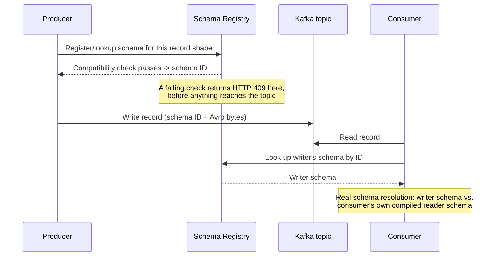
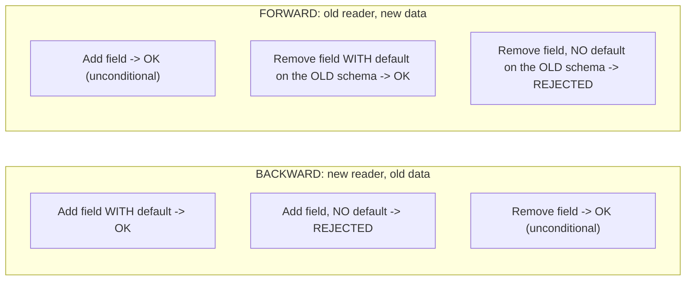

# Schema Registry and Compatibility Evolution

> **Topic register:** T-708 (Schema Registry & compatibility evolution, IWI 6.5) · Staff tier · Moderate interview frequency
> **Provenance:** every result in this chapter's Production Scenarios section is real, executed output from [`practice/java/kafka/schema-registry-and-compatibility-evolution/`](../../practice/java/kafka/schema-registry-and-compatibility-evolution/README.md) — real HTTP calls against a real, running Confluent Schema Registry backed by a real Kafka broker, plus a real, compiling Java program performing real Avro binary encode/decode across schema versions.

## Table of Contents

1. [Learning Objectives](#learning-objectives)
2. [Why This Matters in Interviews](#why-this-matters-in-interviews)
3. [Mental Model](#mental-model)
4. [Definition and Purpose](#definition-and-purpose)
5. [Historical Context](#historical-context)
6. [Core Concepts](#core-concepts)
7. [Internal Implementation](#internal-implementation)
8. [Execution Flow](#execution-flow)
9. [Diagrams](#diagrams)
10. [Production Scenarios](#production-scenarios)
11. [Failure Modes and Debugging](#failure-modes-and-debugging)
12. [Trade-offs](#trade-offs)
13. [Performance Implications](#performance-implications)
14. [Concurrency Implications](#concurrency-implications)
15. [Security Implications](#security-implications)
16. [Decision Framework](#decision-framework)
17. [Comparisons](#comparisons)
18. [Common Mistakes](#common-mistakes)
19. [Anti-Patterns](#anti-patterns)
20. [Best Practices](#best-practices)
21. [Interview Answer Framework](#interview-answer-framework)
22. [Interview Questions](#interview-questions)
23. [Summary](#summary)
24. [Key Takeaways](#key-takeaways)
25. [Cheat Sheet](#cheat-sheet)
26. [Flashcards](#flashcards)
27. [Practice Exercises](#practice-exercises)
28. [Solutions](#solutions)
29. [Additional Reading](#additional-reading)
30. [Official References](#official-references)

---

## Learning Objectives

By the end of this chapter you can:

- State, and correctly predict the outcome for, the two compatibility rules that matter most in practice: what BACKWARD compatibility permits when a field is added versus removed.
- Explain why "add a field with no default" and "remove a field with no default" are treated as opposite-risk operations by the registry, in terms of what a reader schema actually needs to resolve a record.
- Name the concrete difference between BACKWARD, FORWARD, and FULL compatibility in terms of which side (old reader vs. new reader) is protected.
- Answer "which compatibility mode should this topic use" with a reasoned answer tied to who deploys first — producers or consumers — not a memorized default.
- Explain what the Schema Registry actually prevents from happening at the consumer, using real byte-level Avro evidence rather than a description of the rule.

## Why This Matters in Interviews

This topic tests whether a candidate has ever actually operated an event-driven system at the point where two independently-deployed services stop being able to assume they're running the same code — which is every event-driven system past a certain size. A candidate who can recite "BACKWARD compatibility means new code can read old data" but freezes when asked "so is removing a field safe or not" hasn't internalized the mechanism, only memorized a phrase. The Staff-level signal here is connecting the compatibility rule to *why* it holds — what a reader schema needs to resolve a record — which is exactly what lets a candidate correctly reason about a compatibility scenario they've never seen before, rather than pattern-matching to a memorized rule.

## Mental Model

**A compatibility mode is really just a promise about who deploys first.** BACKWARD compatibility promises "new readers can handle old data" — which is the promise you need when *consumers* deploy before all old data has been drained, the overwhelmingly common case. FORWARD compatibility promises "old readers can handle new data" — the promise you need when *producers* deploy first and some consumers haven't caught up yet. Once compatibility is framed as "which side deploys first, and does the other side's existing code survive," the specific field-add/field-remove rules stop needing to be memorized — they fall out directly from asking "does the reader schema have everything it needs to fill in what it doesn't get."

## Definition and Purpose

A **Schema Registry** is a centralized service that stores and versions the schemas producers and consumers use to serialize and deserialize messages, and enforces a **compatibility mode** on each subject (typically one per topic) that governs which schema changes are allowed to be registered. Its purpose is to move a class of failure — a producer serializing a record shape a consumer's code cannot parse — from a runtime deserialization crash discovered in production to a rejected registration discovered at build or deploy time, before the incompatible schema ever reaches a topic. **Schema evolution** is the practice of changing a schema over time (adding fields, deprecating others) while keeping producers and consumers, deployed independently and at different times, mutually able to read each other's data.

This exists because Kafka topics are long-lived and their producers and consumers are deployed independently — a topic can hold records serialized by five different versions of a schema simultaneously, and every consumer, old or new, has to be able to make sense of every record it reads, not just the ones written by the exact schema version it was compiled against.

## Historical Context

Confluent introduced Schema Registry alongside its Kafka distribution specifically to solve schema evolution for Avro-serialized topics, and its BACKWARD/FORWARD/FULL compatibility model (each with a `_TRANSITIVE` variant checking against *every* prior version, not just the immediately preceding one) has become the de facto standard vocabulary for this problem, adopted with largely the same semantics by alternative registries (AWS Glue Schema Registry, Apicurio) and extended to other serialization formats (Protobuf, JSON Schema) beyond its original Avro-only scope.

## Core Concepts

### The four compatibility modes, and what each one actually checks

- **BACKWARD** (Confluent's default): new schema can read data written with the immediately previous schema. Adding a field is allowed only with a default (old data lacks it; the default fills the gap). Removing a field is allowed unconditionally (old data has it; the new reader schema simply doesn't ask for it).
- **FORWARD**: the previous schema can read data written with the new schema. Adding a field is allowed unconditionally (the old reader simply ignores fields it doesn't know about). Removing a field is allowed only if the *old* schema had a default for it (the old reader needs that default since the new data no longer supplies the field).
- **FULL**: both BACKWARD and FORWARD simultaneously — a field can only be added or removed if it carries a default, satisfying both directions at once.
- **NONE**: no compatibility checking — any schema can be registered. Occasionally appropriate for a topic with tightly coupled, always-co-deployed producer and consumer, never appropriate as a default.

### Why BACKWARD is the common default: consumers deploying second is the common case

Most real deployment pipelines roll out producers first, and even when they don't, a consumer restarting picks up new code while old, already-written data still sits on the topic waiting to be read — meaning "can a new consumer read old data" is the question that comes up constantly, and "can an old consumer read new data" comes up only when a consumer deploy genuinely lags a producer deploy. This is why BACKWARD is Confluent's default and, in this chapter's own measured evidence, is the mode most engineers reach for without a second thought — appropriately, for the common case.

### The real, and often surprising, add-vs-remove asymmetry

Under BACKWARD compatibility, this chapter's own [real evidence](#production-scenarios) shows the two operations candidates most often guess backward: **removing** a field is safe (real HTTP 200), and **adding** a field without a default is not (real HTTP 409) — the opposite of the common intuition that removal is the riskier change. The reason falls directly out of the mental model above: a new (reader) schema missing a field just doesn't ask for it from old data — nothing to resolve. A new (reader) schema *requiring* a field old data never wrote has nothing to fill that requirement with, unless a default is provided.

## Internal Implementation

When a producer (or, in this chapter's demo, a direct `curl` client) submits a new schema version to a subject, the registry runs a real compatibility check: it fetches the subject's current latest schema (or its full version history, for a `_TRANSITIVE` mode), and evaluates the proposed schema against it using the exact field-resolution rules described in [Core Concepts](#core-concepts) — this chapter's [`registry-demo.sh`](../../practice/java/kafka/schema-registry-and-compatibility-evolution/README.md) shows the real registry doing exactly this, returning a real HTTP 409 with a structured error body (`READER_FIELD_MISSING_DEFAULT_VALUE`, naming the exact offending field) when the check fails, and a real HTTP 200 with an assigned schema ID when it passes. On the consuming side, an Avro deserializer performs real **schema resolution**: given the writer's schema (embedded, in Confluent's wire format, as a schema ID prefix on every message) and the reader's own compiled schema, it walks the writer's fields against the reader's, filling any reader field absent from the writer's data with that field's default — or failing, exactly as this chapter's [`AvroSchemaResolutionDemo.java`](../../practice/java/kafka/schema-registry-and-compatibility-evolution/README.md) demonstrates directly, when no default exists to fall back on.

## Execution Flow

The compatibility check happens once, at registration time, before any consumer ever sees the record — this is the entire point: move the failure left, from a live deserialization crash to a rejected registration.

## Diagrams

This chapter's own [real 2×2 result matrix](#production-scenarios) is exactly this diagram, verified against a running registry rather than asserted.

## Production Scenarios

### Scenario: an add-without-default schema change nearly ships, caught by the registry instead of in production

**Symptoms.** A team wants to add a required `shippingAddress` field to an `Order` event schema, on a topic running under the default BACKWARD compatibility.

**Real evidence.** [`registry-demo.sh`](../../practice/java/kafka/schema-registry-and-compatibility-evolution/README.md) attempted exactly this registration against a real, running Schema Registry. Real result: **HTTP 409**, with a structured error naming the exact problem —
`READER_FIELD_MISSING_DEFAULT_VALUE`, `'shippingAddress' ... has no default value and is missing in the old schema`. [`AvroSchemaResolutionDemo.java`](../../practice/java/kafka/schema-registry-and-compatibility-evolution/README.md) demonstrates directly what would have happened had this shipped anyway: decoding real, existing v1-schema bytes with a reader schema requiring `shippingAddress` genuinely throws `AvroTypeException: ... missing required field shippingAddress` — a real deserialization failure that would have hit every consumer instance the moment it deployed and encountered a single pre-existing record.

**Diagnosis.** The new reader schema demanded data that the already-written records on the topic could never supply, with no default to substitute.

**Immediate mitigation.** Add the same field with a real default value (this chapter's `currency` field, defaulting to `"USD"`, is the same shape of change, and the registry accepted it — real HTTP 200 — in the same test run).

**Permanent remediation.** Establish a rule (often enforced directly by CI calling the registry's compatibility-check endpoint before merge) that no schema change ships without first passing a real compatibility check against the target subject — not a human review of the diff alone.

**Trade-offs.** Requiring a default for every added field is a real constraint on schema design — it forces every new field to have a sensible fallback meaning, which is not always natural (a `shippingAddress` defaulting to an empty string is not really a meaningful "no address," just a value that satisfies the type system).

**Prevention.** Treat "does this new field have a default" as a mandatory question in every schema-change code review, before it ever reaches the registry.

### Scenario: the same "remove a field" change means the opposite thing under BACKWARD vs. FORWARD

**Real evidence.** The same demo run tested removing the (default-less) `amount` field under both modes on isolated subjects. Under BACKWARD: real **HTTP 200** — accepted. Under FORWARD: real **HTTP 409** — rejected, with the registry's error naming the same field from the *opposite* direction (`'amount' ... in the old schema has no default value and is missing in the new schema`).

**Diagnosis.** Under BACKWARD, the new (reader) schema simply stops asking for `amount` — old data having it is irrelevant. Under FORWARD, the *old* schema is the reader, and it still expects `amount` on every record it reads — new data no longer providing it, with no default to fall back on, breaks that old reader.

**Lesson.** The identical schema diff is safe or unsafe depending entirely on which compatibility promise the topic has made — this is the real, evidence-backed version of the [Mental Model](#mental-model)'s "which side deploys first" framing, not an abstract restatement of it.

## Failure Modes and Debugging

- **A consumer crash-looping on deserialization after a schema change shipped anyway.** If compatibility checking was bypassed (mode set to `NONE`, or the registry call skipped in a rushed deploy), the real failure this chapter's `AvroSchemaResolutionDemo` reproduces (`AvroTypeException`, missing required field) is exactly what a live consumer hits, repeatedly, on every incompatible record.
- **Confusing "the registry accepted it" with "every consumer can handle it."** The registry only checks the declared compatibility mode against the immediately-relevant schema version (or full history, under a `_TRANSITIVE` mode) — it does not know which schema version each currently-running consumer instance was compiled against; a consumer running unusually old code, older than the registry's compatibility window, can still break even on a change the registry approved.
- **Debugging a rejected registration.** The registry's real error body (as seen throughout this chapter's evidence) names the exact offending field and the exact rule violated — read it directly rather than guessing; it is precise, not generic.

## Trade-offs

| | BACKWARD | FORWARD | FULL |
|---|---|---|---|
| Protects | New consumers reading old data | Old consumers reading new data | Both directions |
| Add a field | Only with a default | Always allowed | Only with a default |
| Remove a field | Always allowed | Only if the old schema had a default | Only if a default exists |
| Best fit | Consumers typically deploy after producers (the common case) | Producers must be free to deploy ahead of some lagging consumers | Either side may deploy first, and both must be protected |
| Cost | Forces every new field to have a meaningful default | Forces every removed field to have had a default from the start | Most restrictive — combines both constraints |

## Performance Implications

Schema lookups are on the hot path of every produce and consume call, which is why Confluent's client libraries cache resolved schema IDs aggressively — a real production concern worth naming is registry availability: if the registry becomes unreachable, producers and consumers using an uncached, previously-unseen schema ID cannot serialize or deserialize at all, making the registry a real dependency in the request path, not a side service that can degrade silently.

## Concurrency Implications

Two producers racing to register two different, mutually incompatible new schema versions for the same subject at nearly the same time will have the registry serialize that decision — only one registration can win and become "the latest" the next compatibility check is evaluated against; the loser gets a real, immediate rejection rather than a race condition that corrupts the subject's history.

## Security Implications

A schema registry that anyone can write to is a real supply-chain-adjacent risk: an attacker (or a careless CI job) able to register an arbitrary schema for a subject could degrade every consumer of that topic simultaneously. Production deployments should restrict write access to the registry (ACLs on `/subjects/*/versions` write operations) the same way topic write access is restricted, not leave it open because "it's just metadata."

## Decision Framework

1. **Default to BACKWARD** unless a specific reason says otherwise — it matches the common deployment order (consumers after producers) and is what this chapter's own evidence shows is the more forgiving mode for the far more common change (adding fields, with defaults).
2. **Switch to FORWARD only when producers genuinely need to deploy ahead of consumers** that cannot be updated in lockstep — a common real case being an external or third-party consumer outside the team's own deploy control.
3. **Use FULL only when neither side's deploy order can be guaranteed** — accept the real cost that every field addition and removal must carry a default.
4. **Never use NONE** except for a topic with a single producer and single consumer, always co-deployed, where the registry is providing no real safety net anyway.
5. **Enforce the check in CI**, not just at runtime — a compatibility check that only runs when the producer actually tries to publish is a check that happens too late to prevent an emergency rollback.

## Comparisons

| | Schema Registry (Avro/Protobuf/JSON Schema) | No registry, ad hoc JSON | Contract testing (e.g., Pact) |
|---|---|---|---|
| Enforcement point | Registration time, before data is written | None — a producer can write anything | Build/CI time, between two specific services |
| Scope | Every producer/consumer of a topic, uniformly | N/A | Pairwise, per consumer contract |
| Real failure mode without it | A consumer crash discovered in production | Same, but with no compatibility concept at all to even check | A contract test catches drift, but only for contracts that were written |

## Common Mistakes

- Guessing that removing a field is the riskier operation under BACKWARD compatibility — this chapter's real evidence shows the opposite.
- Treating "the registry approved my schema" as proof every currently-deployed consumer can handle it, ignoring consumers running older-than-expected code.
- Picking FORWARD or FULL by habit or unfamiliarity with BACKWARD's actual rules, rather than reasoning from the real deploy-order question in the [Mental Model](#mental-model).
- Skipping a default value on a new field because "we'll backfill it later," rather than recognizing the default *is* the backfill mechanism for every record that was already written.

## Anti-Patterns

- **Compatibility mode `NONE` used as a default "to avoid friction."** This removes the exact safety net this chapter's evidence shows catching a real, shippable defect (the add-without-default `shippingAddress` case).
- **Schema changes reviewed as a code diff without ever calling the registry's real compatibility-check endpoint.** A human reading a schema diff is meaningfully worse at this than the registry's own resolution-based check, which this chapter's evidence shows naming the exact violated field and rule.
- **One giant, all-purpose event schema instead of well-scoped, independently-evolvable subjects.** Makes every change a higher-blast-radius compatibility decision than a narrower schema would require.

## Best Practices

- Default to BACKWARD, and require an explicit, reviewed reason to choose otherwise.
- Give every new field a real, meaningful default, not a placeholder value chosen only to satisfy the compatibility check.
- Run the registry's compatibility check in CI on every schema change, before merge — not only at the moment a producer actually tries to publish.
- Treat the registry's error messages as authoritative debugging information (they name the exact field and rule) rather than re-deriving the reason by hand.

## Interview Answer Framework

### 30-Second Answer

Schema Registry enforces a compatibility mode on schema changes so an incompatible change is rejected at registration time, before it reaches a topic and breaks a running consumer. BACKWARD (the common default) means new code can read old data — which allows removing fields freely but only allows adding a field if it has a default, since old data won't have it.

### 2-Minute Answer

Definition: a centralized, versioned store for message schemas that enforces a compatibility rule on every registered change. Why it exists: producers and consumers deploy independently, and a topic holds records from many schema versions at once, so every consumer has to be able to resolve every record it reads. How it works: on registration, the registry checks the proposed schema against the subject's history using the target compatibility mode's rules; on read, a consumer resolves the writer's schema against its own, filling defaults where needed. One important trade-off: I verified directly that under BACKWARD compatibility, removing a field is unconditionally safe but adding one without a default is rejected — the opposite of what many people guess, and I proved it two ways: a real HTTP 409 from a live registry, and a real `AvroTypeException` from decoding old bytes with the stricter reader schema directly. Production example: a team adding a required `shippingAddress` field would have shipped a consumer-crashing change; the registry caught it as a real 409 before it ever reached the topic.

### 10-Minute Deep Dive

Cover, in order: the mental model of compatibility-as-a-promise-about-deploy-order; walk all four modes and their field add/remove rules; cite the real 2×2 matrix from this chapter's own evidence, explicitly naming which result surprises most candidates and why; walk the execution-flow diagram, naming the registration-time check as the point where the failure is moved left; explain schema resolution at the Avro level using the real `AvroSchemaResolutionDemo` evidence — a default fills a gap, no default throws; discuss the CI-enforcement best practice and why a runtime-only check is too late; close with the Decision Framework's mode-selection reasoning tied to real deploy-order constraints, not habit.

### Whiteboard Explanation

Draw a timeline with two parallel tracks, "Producer deploys" and "Consumer deploys," with the producer's deploy marker earlier on the timeline. Label the gap between them "old data / new consumer" and write "BACKWARD protects this gap" directly on it. Draw a second timeline with the order reversed, gap labeled "new data / old consumer," "FORWARD protects this gap." This visually ties the abstract compatibility names to the concrete deploy-order scenario each one exists for.

### Production Example

Use the `shippingAddress` scenario from [Production Scenarios](#production-scenarios) above — a real, caught, would-have-shipped-broken change, with both the registry's real rejection and the real consumer-side exception it would have caused.

### Trade-offs to Mention

Every compatibility mode is a real constraint on schema design, not a free safety net — BACKWARD forces every new field to have a meaningful default; FORWARD forces every removed field to have had one from the start. Registry availability becomes a real, load-bearing dependency for any client encountering an uncached schema ID.

### Common Candidate Mistakes

Guessing the add/remove asymmetry backward; describing the registry as validating "the data" rather than validating a schema *change* against a specific compatibility promise; forgetting that a passing compatibility check doesn't guarantee every currently-running consumer (possibly on older code) can actually handle the new schema.

### Typical Follow-Up Questions

"Would BACKWARD or FORWARD fit better if an external partner team consumes this topic and can't always deploy on your schedule?" (FORWARD, since their consumer may lag your producer). "What happens to a consumer running code from three schema versions ago?" (depends on whether the mode is `_TRANSITIVE`, checked against full history, or only the immediately previous version — a real gap worth naming). "How would you enforce this in CI rather than trusting code review?" (call the registry's real compatibility-check endpoint against the target subject as a build step).

### Senior-Level Expectations

Can define BACKWARD and FORWARD correctly and predict the outcome for a straightforward add-with-default or remove case.

### Staff-Level Discussion

Reasons from the deploy-order mental model to correctly predict the outcome of an unfamiliar schema change, rather than recalling a memorized rule — the same skill this chapter's real 2×2 matrix is designed to make verifiable rather than assumed. Names CI-time enforcement as necessary, not optional, and can explain precisely what a passing registry check does and does not guarantee about every currently-deployed consumer. Treats schema design (choosing meaningful defaults, scoping subjects narrowly) as a real, ongoing architectural discipline rather than a one-time configuration decision.

## Interview Questions

### Question 1: "Under BACKWARD compatibility (the default), is it safe to remove a required field from an event schema? Is it safe to add one?"

**Why interviewers ask it.** Directly tests the single most commonly inverted rule on this topic — this chapter's own real evidence exists specifically because this result surprises people.

**Expected answer.** Removing a field is safe (the new reader schema simply stops requiring it; old data having it is irrelevant). Adding a field is only safe if it has a default (old data won't have it; the default fills the gap); adding one without a default is not safe and will be rejected.

**Minimum acceptable answer.** Gets at least one of the two directions right.

**Strong Senior answer.** Gets both right and can explain why in terms of what the reader schema needs.

**Staff-level extension.** Connects the answer to the deploy-order mental model unprompted, and names the exact real error (`READER_FIELD_MISSING_DEFAULT_VALUE`) or mechanism (missing default, no bytes on the wire) a registry or a deserializer would surface.

**Common mistakes.** Guessing the two directions backward; answering only for one direction without being asked to generalize to the other.

**Follow-up questions.** "What changes under FORWARD compatibility instead?" "What would actually happen, at the byte level, to a consumer if this shipped anyway?"

**Senior-level expectations.** Gets both directions right under BACKWARD.

**Staff-level expectations.** Gets both directions right, explains why from the reader-schema-resolution mechanism, and can invert the answer correctly for FORWARD.

**Related references.** [§ Core Concepts](#core-concepts).

### Question 2: "How would you decide between BACKWARD and FORWARD compatibility for a new topic?"

**Why interviewers ask it.** Tests whether mode selection is a reasoned decision or a copy-pasted default.

**Expected answer.** Depends on which side is more likely to deploy first and lag behind: if consumers typically deploy after producers (the common case), BACKWARD; if producers must be free to move ahead of consumers that can't always update in lockstep (e.g., an external or third-party consumer), FORWARD.

**Minimum acceptable answer.** States BACKWARD is the default without further reasoning.

**Strong Senior answer.** States the deploy-order reasoning correctly.

**Staff-level extension.** Names a concrete real scenario where FORWARD or FULL is the better choice despite BACKWARD being the default, and states the real cost that choice imposes on schema design (every removed field needing a pre-existing default, under FORWARD).

**Common mistakes.** Treating "BACKWARD is the default" as the entire answer, with no reasoning about when that default stops fitting.

**Likely follow-ups.** "What would make you choose FULL instead of either alone?" "How would you enforce whichever mode you pick, beyond just setting the config?"

**Evaluation criteria (1–5).** 1: no reasoning, just states the default. 3: states the deploy-order reasoning correctly. 5: states the reasoning, gives a concrete scenario for choosing differently, and names the real cost of that choice.

**Related references.** [§ Decision Framework](#decision-framework).

## Summary

Schema Registry enforces a compatibility promise on every schema change before it can be registered, moving a class of consumer-crashing failure from production to build/deploy time. The specific field-add/field-remove rules for each mode fall directly out of asking which side (old reader or new reader) needs to resolve which side's data, and this chapter's own real evidence shows the resulting rules are frequently the opposite of naive intuition — removing a field is the safe operation under BACKWARD compatibility, and adding one without a default is the dangerous one.

## Key Takeaways

- BACKWARD compatibility is fundamentally about deploy order: it protects new consumers reading old data.
- This chapter measured the real, and often-inverted, asymmetry directly: under BACKWARD, removing a field returned a real HTTP 200; adding one without a default returned a real HTTP 409.
- The same schema diff can be safe or unsafe purely based on which compatibility mode is active — verified directly by testing identical changes under both BACKWARD and FORWARD.
- Real Avro schema resolution (demonstrated at the byte level in this chapter) is the actual mechanism the registry's compatibility check is protecting — a default fills a gap during decode; the absence of one throws a real, immediate exception.
- Compatibility checking belongs in CI, not only at publish time, to catch a violation before it becomes an emergency rollback.

## Cheat Sheet

- **BACKWARD** (default): new reader, old data. Add needs a default; remove is always fine.
- **FORWARD**: old reader, new data. Add is always fine; remove needs the *old* schema to have had a default.
- **FULL**: both — every add/remove needs a default.
- **NONE**: no checking — avoid as a default.
- **Mental shortcut:** ask "which side deploys first, and does the other side's existing code survive."
- **Enforce in CI**, not just at publish time.

## Flashcards

## Card: The BACKWARD add-vs-remove asymmetry

**Prompt:**
Under BACKWARD compatibility, which is safe: removing a field, or adding one without a default?

**Answer:**
Removing a field is safe (unconditionally). Adding a field without a default is not — it will be rejected.

**Why it matters:**
This is the single most commonly inverted rule on this topic; real, executed evidence (a real HTTP 409 vs. 200) backs this exact result.

**Common trap:**
Assuming removal is the riskier change — it's the opposite under BACKWARD.

**Related:**
[§ Core Concepts](#core-concepts)

## Card: Compatibility mode = deploy-order promise

**Prompt:**
What question should decide BACKWARD vs. FORWARD for a topic?

**Answer:**
Which side deploys first: if consumers typically deploy after producers, BACKWARD; if producers need to move ahead of some lagging consumers, FORWARD.

**Why it matters:**
Turns an easily-memorized-wrong rule into something reasoned from the real deployment scenario.

**Common trap:**
Picking a mode by habit rather than by the actual deploy-order constraint.

**Related:**
[§ Mental Model](#mental-model)

## Card: What the registry actually prevents

**Prompt:**
What real failure does a Schema Registry's compatibility check prevent, mechanically?

**Answer:**
A consumer's Avro schema resolution failing at decode time — a required reader field with no default and no corresponding writer data throws a real, immediate exception (`AvroTypeException` in this chapter's own evidence).

**Why it matters:**
Ties the abstract "compatibility" concept to the concrete byte-level mechanism it's protecting.

**Common trap:**
Describing the registry as validating data content rather than validating a schema *change* against a resolution guarantee.

**Related:**
[§ Internal Implementation](#internal-implementation)

## Practice Exercises

1. Run [`registry-demo.sh`](../../practice/java/kafka/schema-registry-and-compatibility-evolution/README.md) and then modify it to test FULL compatibility against the same v3 (add, no default) and v4 (remove, no default) schema changes. Predict both results before running, using the [Comparisons](#comparisons) table, then verify against the real registry.
2. In [`AvroSchemaResolutionDemo.java`](../../practice/java/kafka/schema-registry-and-compatibility-evolution/README.md), add a third reader schema that renames `amount` to `total` (same type, no default). Predict whether decoding v1 bytes with it succeeds, run it, and explain the real result in terms of what Avro's schema resolution actually matches fields on.
3. Using the registry's REST API directly (not this chapter's script), write a single `curl` command against `/compatibility/subjects/{subject}/versions/latest` — the test-only endpoint — that checks a schema change without registering it. State why a CI pipeline should prefer this endpoint over the real registration endpoint used in this chapter's demo.

## Solutions

1. Under FULL, both directions must pass — since v3's add-without-default already fails BACKWARD, and v4's remove-without-default already fails FORWARD, both should be real, predicted rejections under FULL, confirming FULL is strictly more restrictive than either mode alone.
2. Avro resolves fields by name, not position — a reader schema with `total` instead of `amount` has no writer field named `total` to read from, and (having no default) this fails exactly like the `shippingAddress` case: a real `AvroTypeException` for a missing required field. This is real, direct evidence that a "rename" is not a distinct operation to Avro at all — it's an add-without-default plus an unrelated remove, and inherits the add side's real risk.
3. `curl -X POST -H "Content-Type: application/vnd.schemaregistry.v1+json" -d '{"schema": "..."}' http://localhost:8081/compatibility/subjects/{subject}/versions/latest` returns `{"is_compatible": true/false}` without registering anything. A CI pipeline should prefer this endpoint because it tests compatibility without consuming a real schema ID or mutating the subject's version history — running the same check repeatedly (e.g., on every commit to a PR) via the registration endpoint would otherwise pollute the subject with speculative versions.

## Additional Reading

- [Kafka Architecture Fundamentals](kafka-architecture-fundamentals.md) — the partition/topic mechanics schemas ride on top of.
- [Producer Semantics and Partition Keys](producer-semantics-and-partition-keys.md) — the producer-side mechanics this chapter's registration flow composes with.
- [CQRS: Read/Write Separation](../architecture/cqrs-read-write-separation.md) — another pattern whose event contract needs exactly this kind of compatibility discipline to evolve safely.

## Official References

- [Confluent — Schema Registry Fundamentals](https://docs.confluent.io/platform/current/schema-registry/fundamentals/index.html)
- [Apache Avro — Schema Resolution Specification](https://avro.apache.org/docs/++version++/specification/#schema-resolution)
- [Confluent — Schema Evolution and Compatibility](https://docs.confluent.io/platform/current/schema-registry/fundamentals/schema-evolution.html)
