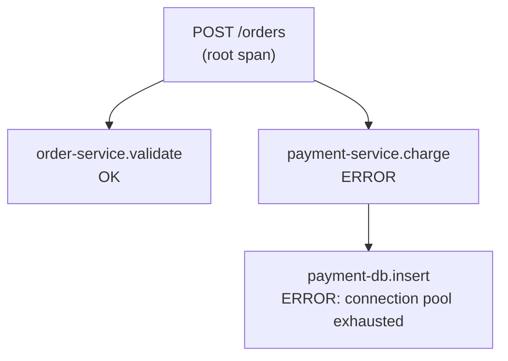

# Logging, Metrics, Tracing, and OpenTelemetry

> **Topic register:** T-1205 · IWI 6.90 · Staff tier
> **Provenance:** the trace in this chapter is real, executed output from [`practice/java/week-11/tracing/src/TracingDemo.java`](../../practice/java/week-11/tracing/src/TracingDemo.java), using the real OpenTelemetry Java SDK (not a diagram of what a trace looks like).

## Table of Contents

1. [Learning Objectives](#learning-objectives)
2. [Why This Matters in Interviews](#why-this-matters-in-interviews)
3. [Mental Model](#mental-model)
4. [Definition and Purpose](#definition-and-purpose)
5. [Core Concepts](#core-concepts)
6. [Internal Implementation](#internal-implementation)
7. [Diagrams](#diagrams)
8. [Production Scenarios](#production-scenarios)
9. [Trade-offs](#trade-offs)
10. [Decision Framework](#decision-framework)
11. [Common Mistakes](#common-mistakes)
12. [Anti-Patterns](#anti-patterns)
13. [Best Practices](#best-practices)
14. [Interview Answer Framework](#interview-answer-framework)
15. [Interview Questions](#interview-questions)
16. [Summary](#summary)
17. [Key Takeaways](#key-takeaways)
18. [Cheat Sheet](#cheat-sheet)
19. [Flashcards](#flashcards)
20. [Practice Exercises](#practice-exercises)
21. [Solutions](#solutions)
22. [Additional Reading](#additional-reading)
23. [Official References](#official-references)

---

## Learning Objectives

By the end of this chapter you can:

- Define a span and a trace precisely, and explain the exact mechanism that reconstructs a call tree.
- Explain why logs, metrics, and traces are complementary rather than redundant, with the specific question each answers.
- Diagnose the consequence of inconsistent trace-context propagation across service boundaries.
- Sequence a real diagnostic funnel from an alert to a root cause using all three signal types.

## Why This Matters in Interviews

Observability questions test whether a candidate has actually operated a distributed system in production or only knows the vocabulary. The specific mechanism — a shared `traceId` linking spans — is what separates candidates who can describe tracing abstractly from those who understand exactly how a tracing backend reconstructs a multi-service request's path, and why a single missing instrumentation point breaks that reconstruction at precisely the worst place.

## Mental Model

**Metrics tell you something is wrong; a trace tells you where; logs tell you why.** No one signal substitutes for the others — a dashboard alert without a trace can't localize a problem to a specific span, a trace without logs can't give full detail, and neither metrics nor logs alone can cheaply answer "what path did this one specific slow request actually take."

## Definition and Purpose

A **span** represents one unit of work (an HTTP request, a database call) with a start time, duration, and status. A **trace** is a tree of spans sharing one `traceId`, reconstructing the full path a single request took across services. **OpenTelemetry (OTel)** is the vendor-neutral standard API/SDK for producing this data, so instrumentation doesn't lock a codebase to one specific observability vendor.

[Percentiles, Tail Latency, and Coordinated Omission](percentiles-tail-latency-and-coordinated-omission.md) established that a slow p99 is real and worth caring about — but a percentile alone doesn't say WHERE in a multi-service request the time went. Tracing exists to answer exactly that: given a slow (or failed) request, which specific downstream call, in which specific service, actually caused it.

## Core Concepts

### A shared traceId is the entire reconstruction mechanism

Every span in one logical request shares an identical `traceId`; each has its own unique `spanId`, and child spans reference their parent's `spanId`. A tracing backend reconstructs the whole call tree with a single query: "everything sharing this `traceId`."

### Logs, metrics, and traces are complementary, not redundant

- **Logs**: discrete events with arbitrary detail — the richest detail, but expensive to store at full volume and hard to correlate across services without a shared trace ID embedded in each log line.
- **Metrics**: aggregated numbers over time (request rate, error rate, p99 latency) — cheap to store and query at any volume, but they tell you THAT something is wrong, never WHICH specific request or WHY.
- **Traces**: the specific path one request took, and where time/failure was spent within it — expensive to capture for every single request at scale (hence sampling in production), but the only one of the three that directly answers "why was THIS request slow/broken."

### Trace-context propagation must be consistent everywhere

A service that fails to propagate an incoming trace context to its own outgoing calls breaks the trace tree exactly at that point — turning one reconstructable request path into two disconnected fragments, right where the missing link matters most.

## Internal Implementation

**Real output**, a simulated request (`POST /orders`) that calls an order-validation step (succeeds) and a payment step (which itself calls a database, which fails):

```
'order-service.validate' : 889ba9722928321ef6ddda8b315baf4e c7a01645cfd579bd INTERNAL
'payment-db.insert'      : 889ba9722928321ef6ddda8b315baf4e 71782e03d32aa31d INTERNAL
'payment-service.charge' : 889ba9722928321ef6ddda8b315baf4e 869a0257119f7fe4 INTERNAL
'POST /orders'           : 889ba9722928321ef6ddda8b315baf4e 43a86499714f5379 INTERNAL {http.route=/orders, http.method=POST}
```

Every one of the 4 spans shares the identical `traceId` (`889ba9...`) — the first hex string after each span name — while each has its own unique `spanId` (the second hex string). This is the entire mechanism that lets a tracing backend reconstruct the call tree: given any one span, a query for "everything sharing this `traceId`" returns the whole request's path, in this case revealing that `POST /orders` → `payment-service.charge` → `payment-db.insert` is the specific chain where the failure actually originated (set via `dbCall.setStatus(StatusCode.ERROR, "connection pool exhausted")` and `recordException()` in the source, propagated up through `payment.setStatus()` and `root.setStatus()`) — without tracing, only "the order failed" would be visible, not which of potentially many downstream calls was the actual cause.

The practical pattern: metrics tell you something's wrong (a dashboard alert fires on rising p99 or error rate); a trace for a representative slow/failed request tells you WHERE; logs for that specific trace ID give the full detail of WHY.

## Diagrams



## Production Scenarios

### Scenario: a partially-instrumented service breaks trace reconstruction at the exact boundary that matters

**Symptoms.** A team investigating a slow-checkout complaint pulls the trace for a representative slow request and finds it ends abruptly at the `payment-service` boundary — no child spans for whatever `payment-service` called next, even though logs from a downstream fraud-check service show activity at the right timestamp.

**Impact.** The team cannot determine from tracing alone whether the fraud-check service, a database it calls, or something else entirely caused the slowdown — exactly the localization tracing is supposed to provide is unavailable at the one boundary that matters for this incident.

**Initial hypotheses.** The tracing backend dropped spans due to sampling (checked — sampling configuration shows 100% capture for this trace given its error status); a bug in the trace query itself (checked — other traces through the same backend reconstruct correctly); the fraud-check service was deployed without trace-context propagation configured (correct).

**Evidence.** Code review of the fraud-check service's outbound HTTP client shows it was recently migrated to a new HTTP library, and the migration dropped the interceptor that propagated the incoming `traceparent` header to outbound calls — every span the fraud-check service itself creates uses a fresh, unrelated trace context instead of continuing the incoming one.

**Diagnosis.** Exactly this chapter's named risk: inconsistent trace-context propagation breaks the trace tree exactly at the boundary where it's missing, turning what should be one reconstructable trace into disconnected fragments — here, at precisely the service the team most needed visibility into.

**Immediate mitigation.** Correlate the fraud-check service's own logs by timestamp manually, as a stopgap, to complete the incident's root-cause picture without a proper trace link.

**Permanent remediation.** Restore trace-context propagation in the fraud-check service's HTTP client configuration, and add an automated check (a synthetic trace verified end-to-end) to the deployment pipeline that fails if any service in the call path breaks context propagation.

**Alternatives considered.** Relying on manual timestamp correlation as an ongoing practice — rejected, since it doesn't scale to services with any meaningful request volume and is exactly the "no single service's own logs contain the full picture" problem tracing exists to solve.

**Trade-offs.** Adding an automated end-to-end trace-propagation check adds a deployment-pipeline step and a small maintenance burden — accepted, since the alternative is a silent, easy-to-reintroduce regression at any future library migration.

**Prevention.** Treat trace-context propagation as a non-negotiable requirement verified by an automated check for every service in a distributed system, re-verified on any HTTP client or messaging library migration, not assumed to persist across such changes.

**Interview lesson.** This is Interview Question 1's follow-up scenario at real production scale: a service failing to propagate trace context breaking the chain at exactly that point, discovered during a real incident rather than a design review.

## Trade-offs

| Signal | Cost to capture at full volume | What it answers |
|---|---|---|
| Metrics | Cheap — pre-aggregated | "Is something wrong, right now, in aggregate?" |
| Logs | Moderate — grows with event volume and detail | "What exactly happened, in detail, for this one thing?" |
| Traces | Expensive at 100% sampling — usually sampled in production | "Where, in a multi-service call chain, did the time/failure happen?" |

## Decision Framework

1. **Is the question "is anything wrong right now, in aggregate"?** Metrics/dashboard.
2. **Is the question "where in this specific request's call chain did it fail or slow down"?** A trace for that specific request.
3. **Is the question "why, in full detail, did that specific span fail"?** Logs for that trace ID.
4. **Is a new service being added to a distributed system, or an existing service's HTTP/messaging client being migrated?** Verify trace-context propagation explicitly — it is not guaranteed to survive a library change.
5. **Does a trace end abruptly at a service boundary with no child spans?** Suspect broken context propagation at that specific service before assuming sampling or backend issues.

## Common Mistakes

- Relying on only one of logs/metrics/traces and being surprised it can't answer questions it was never designed to answer.
- Instrumenting some services with trace propagation and not others, silently breaking trace reconstruction at exactly the boundary that matters most.
- Treating tracing, GC-log-reading, and query-plan-reading as unrelated skills rather than the same "diagnose from an artifact" discipline applied to different artifact types.

## Anti-Patterns

- **Adding tracing only to "important" services**, leaving gaps that break reconstruction unpredictably depending on which path a request takes.
- **Treating a single signal type (usually metrics) as sufficient observability**, discovering the gap only during an incident that needs localization or detail metrics can't provide.
- **Assuming trace-context propagation survives a library or framework migration** without an explicit verification step.

## Best Practices

- Require trace-context propagation for every service in a distributed system as a non-negotiable, in the same category as authentication or logging itself.
- Verify propagation with an automated, synthetic end-to-end trace check in the deployment pipeline, especially after HTTP client or messaging library migrations.
- Sequence diagnosis explicitly: metrics detect, traces localize, logs explain — apply this funnel consistently rather than jumping straight to logs or guessing.

## Interview Answer Framework

### 30-Second Answer

A trace is a tree of spans sharing one `traceId`; the shared ID is the entire mechanism that lets a tracing backend reconstruct a multi-service request's path. Metrics detect that something's wrong, traces localize where, logs explain why — three complementary signals, none of which substitutes for the others.

### 2-Minute Answer

Definition: a span is one unit of work with a start time, duration, and status; a trace is a tree of spans sharing a `traceId`; OpenTelemetry is the vendor-neutral standard for producing this data. Why it exists: a percentile alone can't say where in a multi-service request the time went — tracing answers exactly that. How it works: every span in one request shares a `traceId`; parent-child `spanId` relationships reconstruct the tree. One important trade-off: traces are expensive to capture at 100% sampling, so production systems usually sample. Production example: a real measured 4-span trace showing a failure originating at a specific database insert inside a payment service, and a real incident where a service's failure to propagate trace context broke the trace tree exactly at the boundary the team needed visibility into.

### 10-Minute Deep Dive

Cover, in order: the mental model — metrics detect, traces localize, logs explain (mental model); the measured 4-span trace and the shared-`traceId` reconstruction mechanism (internals, real evidence); why the three signals are complementary, not redundant (core concepts); the decision framework for choosing which signal answers which question (decision framework); and close with the production scenario — a partially-instrumented service breaking trace reconstruction at exactly the boundary an incident needed.

### Whiteboard Explanation

Draw the [§ Diagrams](#diagrams) tree: `POST /orders` as root, branching to `order-service.validate` (OK) and `payment-service.charge` (ERROR), which itself branches to `payment-db.insert` (ERROR). Annotate every node with the same `traceId` label and a distinct `spanId`, then point at the ERROR chain and say "this is what tracing localizes that a metric alone cannot."

### Production Example

The broken-propagation incident in [§ Production Scenarios](#production-scenarios): a service migrated to a new HTTP client silently dropped trace-context propagation, breaking trace reconstruction exactly at the boundary an incident investigation needed most.

### Trade-offs to Mention

State unprompted: traces are expensive to capture at 100% sampling in production; metrics alone can't localize a problem to a specific request or span; logs alone can't be aggregated cheaply enough to alert on.

### Common Candidate Mistakes

Describing tracing in the abstract without naming the `traceId`/`spanId` mechanism that actually makes reconstruction possible; treating each observability signal type as requiring a completely separate diagnostic skill rather than recognizing the shared discipline.

### Typical Follow-Up Questions

1. "Two of the seven services don't propagate the trace context. What breaks?"
2. "You have a trace AND a GC log for the same slow request. Which do you check first?"

### Senior-Level Expectations

Correctly describes the shared-`traceId`, parent-child-`spanId` mechanism; proposes checking the trace first to localize where the time went, then the GC log if the slow span points at JVM-level behavior.

### Staff-Level Discussion

The 4-span trace in this chapter is a small-scale version of what makes microservices architectures debuggable at all — without a shared `traceId` threading through every service boundary, a slow or failed request in a system with dozens of services becomes nearly impossible to root-cause, because no single service's own logs contain the full picture. A Staff engineer treats trace-context propagation as a non-negotiable requirement for any new service in a distributed system, in the same category as authentication or logging itself — not an optional nice-to-have added after the fact, because retrofitting it into a system with untraced gaps is far more expensive than building it in from the start. This is explicitly the same "diagnose from an artifact" skill as [GC log analysis](../jvm/gc-fundamentals-and-log-analysis.md), generalized — the artifact might be a GC log, a trace, or a metrics dashboard, and the discipline (read what's actually there before proposing a fix) is identical regardless of which artifact type is handed over. A Staff-level sequencing: metrics alerted something's wrong → trace localizes which span → logs/GC-log/`EXPLAIN`-plan for that specific span's system give the detailed why.

## Interview Questions

### Question 1 — Trace a request across seven services.

**Why interviewers ask it.** Tests whether the candidate knows the actual mechanism, not just the vocabulary.

**Expected answer.** Every span shares the request's `traceId`; each service's span is a child of whichever upstream call invoked it; querying the tracing backend for that `traceId` reconstructs the full tree, and the span with the ERROR status (or the longest duration) localizes the actual problem.

**Minimum acceptable answer.** Describes tracing generally, even without naming `traceId`/`spanId` precisely.

**Strong Senior answer.** Correctly describes the shared-`traceId`, parent-child-`spanId` mechanism.

**Staff-level extension.** Identifies that a service failing to propagate trace context breaks the chain at exactly that point — the trace becomes two disconnected trees instead of one — and answers why context propagation must be part of every service's instrumentation, not just the ones a team happens to own.

**Common mistakes.** Describing tracing in the abstract without naming the mechanism that actually makes reconstruction possible.

**Likely follow-ups.** "Two of the seven services don't propagate the trace context. What breaks?"

**Evaluation criteria (1–5).** 1: describes tracing only vaguely. 3: correctly names the shared-ID mechanism. 5: correct mechanism plus the propagation-gap consequence explained.

**Related references.** [§ Internal Implementation](#internal-implementation); [§ Production Scenarios](#production-scenarios).

---

### Question 2 — Pauses hit 4 seconds. Diagnose from this log.

**Why interviewers ask it.** Tests whether the candidate recognizes "diagnose from an artifact" as one shared skill across observability signal types, connecting back to Week 9's GC-log-reading material.

**Expected answer.** This is explicitly the same "diagnose from an artifact" skill as the GC log chapter, generalized — the artifact might be a GC log, a trace, or a metrics dashboard, and the discipline (read what's actually there before proposing a fix) is identical regardless of which artifact type is handed over.

**Minimum acceptable answer.** Recognizes the question as an artifact-reading exercise, even without connecting it explicitly to GC logs.

**Strong Senior answer.** Proposes checking the trace first to localize WHERE the time went, then the GC log if the slow span itself points at JVM-level behavior rather than a downstream call.

**Staff-level extension.** Explicitly sequences the diagnostic: metrics alerted something's wrong → trace localizes which span → logs/GC-log/`EXPLAIN`-plan for that specific span's system give the detailed why — the same three-signal funnel regardless of which artifact type ends up being the answer.

**Common mistakes.** Treating each observability signal type as requiring a completely separate diagnostic skill rather than recognizing the shared discipline.

**Likely follow-ups.** "You have a trace AND a GC log for the same slow request. Which do you check first?"

**Evaluation criteria (1–5).** 1: treats each signal type as unrelated. 3: proposes checking trace then GC log in sequence. 5: correct sequencing plus the explicit three-signal funnel articulated generally.

**Related references.** [GC Fundamentals and Log Analysis](../jvm/gc-fundamentals-and-log-analysis.md).

## Summary

A real OpenTelemetry trace — 4 spans, one root and a nested parent-child chain — shares a single `traceId` across every span, which is the entire mechanism that lets a tracing backend reconstruct which specific downstream call actually caused a failure that would otherwise just look like "the order failed" from the outside. Logs, metrics, and traces are complementary: metrics detect that something's wrong in aggregate, traces localize where in a call chain, logs give the full detail of why — no single one of the three substitutes for the others.

## Key Takeaways

- A trace's spans share one `traceId`; parent-child relationships reconstruct the call tree.
- Metrics detect, traces localize, logs explain — three different, complementary signals.
- Trace-context propagation must be consistent across every service boundary, or the trace tree breaks exactly where it matters most.
- "Diagnose from an artifact" (a trace, a GC log, a query plan) is one shared discipline, not three separate skills.

## Cheat Sheet

| Question | Signal to reach for |
|---|---|
| Is anything wrong right now? | Metrics/dashboard |
| Where in the call chain did this specific request fail/slow down? | A trace for that request |
| Why, in full detail, did that specific span fail? | Logs for that trace ID |

## Flashcards

### Card: What reconstructs a trace

**Prompt:**
What single piece of data lets a tracing backend reconstruct a whole multi-service request's path?

**Answer:**
A shared `traceId` across every span in that request, with parent-child `spanId` relationships.

**Why it matters:**
The actual mechanism, not just the vocabulary of "tracing."

**Common trap:**
Describing tracing without naming this specific mechanism.

**Related:**
[Internal Implementation](#internal-implementation)

### Card: What a metric alone can't tell you

**Prompt:**
What does a metric alone fail to tell you that a trace can?

**Answer:**
WHICH specific request, and WHERE in its call chain, the problem occurred — metrics only show aggregate trends.

**Why it matters:**
The core reason metrics, traces, and logs are complementary, not redundant.

**Common trap:**
Treating a metrics dashboard as sufficient observability on its own.

**Related:**
[Core Concepts](#core-concepts)

### Card: Why inconsistent propagation is serious

**Prompt:**
Why is inconsistent trace-context propagation across services a serious problem?

**Answer:**
It breaks the trace tree exactly at the boundary where propagation is missing, turning one reconstructable trace into disconnected fragments.

**Why it matters:**
The gap appears exactly where visibility matters most, often during an active incident.

**Common trap:**
Assuming propagation is guaranteed by default across every library and service.

**Related:**
[Production Scenarios](#production-scenarios)

## Practice Exercises

1. Reproduce: [`practice/java/week-11/tracing/src/TracingDemo.java`](../../practice/java/week-11/tracing/src/TracingDemo.java) and confirm all 4 spans share the same `traceId` in your own run.
2. Add a 5th span (a cache-lookup step before validation) and verify it appears with the same `traceId` and a distinct `spanId` in your output.
3. Design the metrics-to-trace-to-log escalation path for a real alert ("p99 latency for `/orders` exceeded 2s") — what metric fires the alert, what would you query to find a representative trace, and what would you look for in that trace's spans?

## Solutions

**Exercise 1.** Expected output matches this chapter's measured trace: 4 spans, all sharing one `traceId`, distinct `spanId`s, with the ERROR status propagated from `payment-db.insert` up through `payment-service.charge` and the root span.

**Exercise 2.** The new cache-lookup span should appear with the identical `traceId` as the other 4 spans and its own unique `spanId`, confirming the SDK's context propagation correctly threads through an additional instrumentation point added to the same request.

**Exercise 3.** A reasonable escalation path: a p99-latency metric on the `/orders` endpoint crossing 2s fires the alert; the on-call engineer queries the tracing backend for a recent, representative trace on that endpoint (ideally one matching the alert's time window); within that trace, they look for the span with the longest duration or an ERROR status to localize where the time went, then pull logs for that specific trace ID to get the full detail of why.

## Additional Reading

- [OpenTelemetry documentation — Traces](https://opentelemetry.io/docs/concepts/signals/traces/)

## Official References

- [OpenTelemetry Java SDK](https://github.com/open-telemetry/opentelemetry-java) — the library used directly in this chapter's real demo
