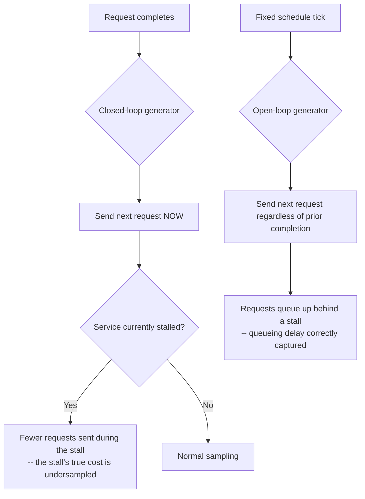

# Percentiles, Tail Latency, and Coordinated Omission

> **Topic register:** T-1204 · IWI 6.70 · Staff tier
> **Provenance:** the percentile figures in this chapter are real, computed output from [`practice/java/week-11/percentiles/src/CoordinatedOmissionDemo.java`](../../practice/java/week-11/percentiles/src/CoordinatedOmissionDemo.java) — 100,000 simulated requests through each of two measurement methodologies, same underlying service behavior, same random seed.

## Table of Contents

1. [Learning Objectives](#learning-objectives)
2. [Why This Matters in Interviews](#why-this-matters-in-interviews)
3. [Mental Model](#mental-model)
4. [Definition and Purpose](#definition-and-purpose)
5. [Core Concepts](#core-concepts)
6. [Internal Implementation](#internal-implementation)
7. [Diagrams](#diagrams)
8. [Production Scenarios](#production-scenarios)
9. [Trade-offs](#trade-offs)
10. [Decision Framework](#decision-framework)
11. [Common Mistakes](#common-mistakes)
12. [Anti-Patterns](#anti-patterns)
13. [Best Practices](#best-practices)
14. [Interview Answer Framework](#interview-answer-framework)
15. [Interview Questions](#interview-questions)
16. [Summary](#summary)
17. [Key Takeaways](#key-takeaways)
18. [Cheat Sheet](#cheat-sheet)
19. [Flashcards](#flashcards)
20. [Practice Exercises](#practice-exercises)
21. [Solutions](#solutions)
22. [Additional Reading](#additional-reading)
23. [Official References](#official-references)

---

## Learning Objectives

By the end of this chapter you can:

- Explain why average latency cannot characterize user experience, with a concrete counter-example.
- Define coordinated omission precisely and state which load-testing methodology avoids it.
- Read a percentile-shift number (e.g., p99 500ms → 830ms) and explain what it actually means about measurement correctness, not the service itself.
- Justify a percentile-based SLO over an average or raw-max target.

## Why This Matters in Interviews

Percentile questions separate candidates who can recite "p99" from those who understand why averages actively mislead and why a naive load test lies about the tail. Coordinated omission specifically is a Staff-tier topic because it's a measurement bug, not a service bug — the load-testing tool itself produces confidently-wrong numbers, and recognizing that requires understanding the mechanism, not just the vocabulary.

## Mental Model

**A percentile answers "how bad is it for the worst-affected fraction of users," which is the question that actually matters — an average answers a question nobody experiences.** No single user experiences "the average" of a distribution; every user experiences their own single data point, and the users who matter for complaints and churn are the ones in the tail. Coordinated omission is the specific, sneaky way a measurement tool can fail to capture that tail even while looking perfectly reasonable.

## Definition and Purpose

A percentile (p50, p99, p99.9) states the latency below which a given fraction of requests fall — p99 = 500ms means 99% of requests were faster than 500ms. **Coordinated omission** is a measurement bug in load-testing tools: a naive ("closed-loop") load generator that waits for each request to finish before sending the next one systematically fails to measure the true cost of a slowdown, because it sends fewer requests exactly when the service is struggling.

Percentiles exist because averages hide exactly the information that matters for user experience and SLOs — a service can have a fast average and a genuinely painful tail. Coordinated omission exists as a concept because measuring percentiles correctly is harder than it looks: the natural way to write a load generator (send the next request when the last one returns) is precisely the wrong way, and this mistake is common enough to have its own name.

## Core Concepts

### Closed-loop vs. open-loop load generation

A closed-loop generator sends the next request only after the previous one completes — meaning during a slowdown, it sends *fewer* requests, exactly when it should be capturing how bad the slowdown is for anyone still arriving. An open-loop generator schedules requests on a fixed interval regardless of how long previous requests take — matching how real, independent users actually behave, and correctly capturing the queueing delay a slowdown creates for requests arriving behind it.

### Coordinated omission understates the tail, not individual service times

The closed-loop generator's numbers are not wrong about each individual request's *service* time — they're wrong about the *overall experience*, because they never account for the requests that pile up waiting behind a stall.

### Average latency cannot distinguish different real experiences

A single average number is compatible with wildly different underlying distributions — "every user waits close to the average" and "98% of users wait fast, 2% wait very slow" can produce the identical average, yet describe completely different real experiences. Percentiles distinguish these; an average cannot.

## Internal Implementation

**Real output**, the identical underlying service (98% of requests take 10ms, 2% stall for 500ms), measured two ways:

```
== closed-loop (naive): send next request only after the previous completes ==
closed-loop: p50=10ms  p90=10ms  p99=500ms  p99.9=500ms  max=500ms

== open-loop (correct): requests are scheduled every 50ms regardless of how long the previous one took ==
open-loop: p50=10ms  p90=380ms  p99=830ms  p99.9=1370ms  max=2110ms
```

Same service, same 2% stall rate, same random seed (so the exact same sequence of stalls occurs in both runs) — p90 goes from 10ms to 380ms, and p99 from 500ms to 830ms, purely from correcting the measurement methodology. When a 500ms stall occurs under open-loop scheduling (new requests keep arriving every 50ms regardless), roughly 10 requests queue up behind it and each pays not just its own service time but also the wait for the requests ahead of it to clear — that queueing delay is real, it's what a real user would experience, and coordinated omission is precisely the failure to measure it.

**Why average latency is close to useless:** the closed-loop average is dominated by the 98% of fast requests (mostly 10ms) with a small contribution from the 2% slow ones — an average around `0.98*10 + 0.02*500 = 19.8ms`. A single "19.8ms average" number is compatible with wildly different user experiences — it can't distinguish "every user waits close to 19.8ms" from "98% of users wait 10ms and 2% wait 500ms" (this chapter's actual scenario) from a hypothetical where 50% wait near-0ms and 50% wait ~40ms.

## Diagrams



## Production Scenarios

### Scenario: a load test clears every threshold, then production users report widespread slowness during peak hours

**Symptoms.** Pre-launch load testing for a new checkout flow reports p99 = 200ms, comfortably under the 500ms SLO target. After launch, during peak traffic hours, user complaints about slow checkouts rise sharply, and a real-user-monitoring dashboard shows p99 closer to 900ms during those windows.

**Impact.** A feature that passed every pre-launch performance gate produces a real, user-visible slowness problem in production, undermining confidence in the load-testing process for every future launch.

**Initial hypotheses.** Production traffic volume is simply higher than the load test simulated (checked — peak request rate matches the load test's target rate closely); a code difference between the load-tested build and the production build (checked — identical artifact deployed); the load-testing tool used a closed-loop methodology, understating the real tail the way this chapter measures directly (correct).

**Evidence.** The load-testing tool's request generator explicitly waits for each response before issuing the next — a closed-loop design — and re-running the same load test with an open-loop-corrected tool against a staging environment reproduces a p99 much closer to the 900ms production figure, on the same underlying service.

**Diagnosis.** The pre-launch load test suffered from coordinated omission: because it only sent the next request after the previous one returned, it systematically sent fewer requests during any transient slowdown, undersampling exactly the moments that matter most for tail latency — producing a p99 = 200ms figure that looked clean but was measuring something other than real user experience.

**Immediate mitigation.** Treat the real-user-monitoring p99 as the authoritative signal going forward for this feature, and communicate to stakeholders that the pre-launch gate needs a methodology fix, not that the feature itself regressed.

**Permanent remediation.** Replace the load-testing tool's request-generation strategy with an open-loop (fixed-schedule) design, or apply a coordinated-omission correction to existing closed-loop data, so future pre-launch gates reflect the tail latency real users will actually experience.

**Alternatives considered.** Simply lowering the pre-launch SLO threshold to compensate — rejected, since it treats the symptom (a passing number that didn't mean what it appeared to) rather than the actual measurement bug.

**Trade-offs.** An open-loop load generator is harder to implement correctly (it must handle requests that haven't yet returned when the next is due) — accepted, since the alternative is a load-testing gate that systematically produces false confidence.

**Prevention.** Any load-testing tool or harness adopted for pre-launch gating should be verified as open-loop (or coordinated-omission-corrected) before being trusted as an SLO gate, with this chapter's own before/after numbers as a reference for how large the discrepancy can be even at a modest 2% stall rate.

**Interview lesson.** This is Interview Question 1's underlying scenario at full production scale: a load test showing a good p99, users reporting a much worse real experience, resolved by identifying coordinated omission as the specific measurement bug — not a vague "the load test wasn't realistic."

## Trade-offs

| Measurement approach | What it tells you |
|---|---|
| Average latency | Almost nothing about user experience — compatible with many very different real distributions |
| p50 (median) | Typical experience, insensitive to tail outliers |
| p99 / p99.9 | The experience of your most-affected users — directly what an SLO should target |
| Closed-loop load testing | Systematically understates tail latency under any real slowdown — measured directly above |
| Open-loop load testing | Correctly captures queueing delay from a slowdown — the honest number, and the harder one to implement correctly |

## Decision Framework

1. **Is a load-testing tool waiting for each response before sending the next request?** That's closed-loop — treat any percentile it reports as an underestimate of the real tail.
2. **Does an SLO target need to reflect real user experience?** Use a percentile (p99 or p99.9), never an average, and never the raw max (dominated by unrepresentative outliers).
3. **Does a load test's reported percentile look "too clean" (e.g., pinned exactly at a known stall duration)?** That's a specific signature of coordinated omission — investigate the generator's request-scheduling strategy.
4. **Is there a large gap between load-test and real-user-monitoring percentiles for the same traffic pattern?** Check the load-testing methodology before assuming a code or environment difference.

## Common Mistakes

- Reporting average latency as if it characterizes user experience.
- Load-testing with a closed-loop generator and treating the resulting percentiles as accurate.
- Chasing p100/max as an SLO target rather than a high-but-representative percentile like p99 or p99.9.

## Anti-Patterns

- **Writing a load generator the "natural" way** (wait for the response, then send the next) without recognizing this is precisely the coordinated-omission bug.
- **Reporting a single average latency number** as evidence of good or bad performance.
- **Setting an SLO against the raw maximum** observed latency, which is dominated by rare, often environmental outliers.

## Best Practices

- Use open-loop (fixed-schedule) load generation, or apply a coordinated-omission correction to closed-loop data, for any load test feeding a launch or SLO decision.
- Report and alert on percentiles (p99, p99.9), never a bare average.
- Choose SLO targets from a high-but-representative percentile, not the raw max.
- Compare load-test percentiles against real-user-monitoring percentiles for the same traffic pattern periodically, to catch a methodology gap before it causes surprise.

## Interview Answer Framework

### 30-Second Answer

Percentiles reveal what averages hide — a service can have a fast average and a genuinely painful tail. Coordinated omission is a real measurement bug: a naive, closed-loop load generator sends fewer requests exactly when the service is slow, understating the true tail — measured directly at p99=500ms (closed-loop) vs. p99=830ms (correct, open-loop) for the identical service.

### 2-Minute Answer

Definition: a percentile states the latency below which a fraction of requests fall; coordinated omission is a load-testing measurement bug where a closed-loop generator undersamples exactly the moments a service is struggling. Why it exists: averages can't distinguish "uniformly mediocre" from "mostly great, occasionally terrible," and the natural way to write a load generator is precisely the wrong way. How it works: closed-loop generators wait for each response before sending the next, missing queueing delay during a stall; open-loop generators schedule on a fixed interval, correctly capturing it. One important trade-off: open-loop generators are harder to implement correctly. Production example: a real measured shift from p99=500ms (closed-loop) to p99=830ms (open-loop) for the identical underlying service, purely from correcting the measurement methodology.

### 10-Minute Deep Dive

Cover, in order: the mental model — a percentile answers the question that actually matters, an average doesn't (mental model); the measured closed-loop vs. open-loop comparison (internals, real evidence); why average latency is close to useless, with the "same average, different experience" argument (core concepts); the decision framework for spotting coordinated omission in an existing load-testing setup (decision framework); and close with the production scenario — a load test that passed cleanly, then real users reported a much worse experience, traced to exactly this methodology bug.

### Whiteboard Explanation

Draw the [§ Diagrams](#diagrams) flowchart: closed-loop's "send next request now" branching into "service stalled? fewer requests sent" versus open-loop's "fixed schedule tick" branching into "requests queue up behind a stall, correctly captured." Annotate the closed-loop branch: "this is why the number looks clean but is wrong."

### Production Example

The load-test-vs-production gap in [§ Production Scenarios](#production-scenarios): a pre-launch p99=200ms load test passed cleanly, but production real-user-monitoring showed p99 near 900ms during peak hours — traced to the load-testing tool's closed-loop request generation.

### Trade-offs to Mention

State unprompted: open-loop load generators are genuinely harder to implement correctly than the "natural" closed-loop approach; a percentile that looks suspiciously clean (pinned exactly at a known stall duration) is itself a diagnostic signal for coordinated omission; p100/max is a poor SLO target due to unrepresentative outliers.

### Common Candidate Mistakes

Assuming a load-testing tool or environment is simply "less realistic" without naming the specific measurement bug; defending an average-based SLO as simpler without addressing what it hides; proposing p100/max as an SLO target.

### Typical Follow-Up Questions

1. "How do you fix the load test?"
2. "Why not target p100 (the max) directly?"

### Senior-Level Expectations

Names coordinated omission by name and its root cause; correctly rejects average-based SLOs.

### Staff-Level Discussion

The 500ms → 830ms p99 shift measured in this chapter (purely from correcting HOW latency was measured, not from changing the service at all) is a concrete instance of a broader Staff-level principle: the measurement methodology is itself part of the system under evaluation, and getting it subtly wrong produces confidently-wrong conclusions rather than obviously-wrong ones — the closed-loop numbers looked completely reasonable (a clean p99=500ms, exactly the stall duration) while being systematically misleading. A Staff engineer treats "how exactly was this number measured" as a first-class question before trusting any performance claim, in the same way [tracing discipline](logging-metrics-tracing-and-opentelemetry.md) treats "which specific span in the call chain" as the first question before trusting a latency complaint's root cause.

## Interview Questions

### Question 1 — Your load test shows p99 = 200ms, but users report much worse in production. Why the gap?

**Why interviewers ask it.** Tests whether the candidate can name the specific measurement bug rather than a vague "the load test wasn't realistic."

**Expected answer.** The load test is very likely closed-loop (coordinated omission) — it understates real tail latency because it doesn't account for requests queueing behind a slowdown. Real production traffic is open-loop and reveals the true, worse tail.

**Minimum acceptable answer.** Suspects a methodology issue with the load test, even without naming coordinated omission specifically.

**Strong Senior answer.** Names coordinated omission by name and its root cause.

**Staff-level extension.** Proposes a concrete fix (an open-loop load generator, or a coordinated-omission-corrected percentile calculation applied after the fact) and can explain, numerically, roughly how large the understatement typically is for a given stall rate and duration.

**Common mistakes.** Assuming the load-testing tool or environment is simply "less realistic" without naming the specific measurement bug.

**Likely follow-ups.** "How do you fix the load test?"

**Evaluation criteria (1–5).** 1: attributes the gap to vague "unrealistic testing." 3: names coordinated omission and its cause. 5: correct naming plus a concrete fix and numeric intuition.

**Related references.** [§ Internal Implementation](#internal-implementation); [§ Production Scenarios](#production-scenarios).

---

### Question 2 — Justify a percentile-based SLO instead of an average-based one.

**Why interviewers ask it.** Tests whether the candidate understands what an average actively hides, not just that percentiles are "more precise."

**Expected answer.** An average can't distinguish "uniformly mediocre" from "mostly great, occasionally terrible" — two experiences with very different user impact and very different fixes — while a percentile (especially a high one, p99/p99.9) directly targets the tail experience that actually drives complaints and churn.

**Minimum acceptable answer.** States that percentiles are more representative of user experience than an average.

**Strong Senior answer.** Correctly rejects average-based SLOs.

**Staff-level extension.** Explains why p100/max is a poor SLO target specifically — it's dominated by rare, often environmental, unrepresentative outliers (a single GC pause, a network blip) and chasing it produces diminishing, expensive returns.

**Common mistakes.** Defending an average-based SLO as "simpler to reason about" without addressing what it hides.

**Likely follow-ups.** "Why not target p100 (the max) directly?"

**Evaluation criteria (1–5).** 1: defends an average-based SLO. 3: rejects it and proposes a percentile. 5: correct rejection plus explains why max is also a poor target.

**Related references.** [§ Core Concepts](#core-concepts).

## Summary

Percentiles reveal what averages hide — this chapter's own scenario (98% fast, 2% very slow) produces an average that's compatible with many different real experiences, while p99 pins down the tail precisely. Coordinated omission is a real, measured methodology bug: a closed-loop load generator measuring the exact same service reported p99=500ms while the correct open-loop methodology reported p99=830ms and p90=380ms (versus the closed-loop's p90=10ms) — the same underlying service, a materially different, and more honest, picture of user experience.

## Key Takeaways

- Average latency cannot distinguish "uniformly mediocre" from "mostly great, occasionally terrible" — percentiles can.
- Closed-loop load testing systematically understates tail latency by failing to measure queueing delay behind a slowdown — measured directly, not theoretical.
- Open-loop load testing (fixed request schedule regardless of response time) reveals the true tail.
- SLOs should target a high-but-representative percentile (p99/p99.9), not an average or the raw max.

## Cheat Sheet

| Question | Answer |
|---|---|
| Average or percentile for an SLO? | Percentile — average hides too much |
| p99 or max? | p99 (or p99.9) — max is dominated by unrepresentative outliers |
| Closed-loop or open-loop load testing? | Open-loop — closed-loop understates the tail via coordinated omission |

## Flashcards

### Card: What coordinated omission is

**Prompt:**
What is coordinated omission?

**Answer:**
A load-testing measurement bug where a closed-loop generator (waits for each response before sending the next) sends fewer requests exactly when the service is slow, understating the true tail latency.

**Why it matters:**
A measurement bug that produces confidently-wrong, clean-looking numbers.

**Common trap:**
Trusting a "clean" percentile from a naive load generator.

**Related:**
[Internal Implementation](#internal-implementation)

### Card: Why average latency fails

**Prompt:**
Why can't average latency characterize user experience?

**Answer:**
It can't distinguish "uniformly mediocre" from "mostly fast, occasionally very slow" — very different experiences can produce the same average.

**Why it matters:**
The core reason SLOs target percentiles, never averages.

**Common trap:**
Reporting an average as evidence of good performance.

**Related:**
[Core Concepts](#core-concepts)

### Card: Why p99.9 beats max as an SLO target

**Prompt:**
Why is p99.9 usually a better SLO target than max/p100?

**Answer:**
Max is dominated by rare, often environmental outliers (a single GC pause); p99.9 targets a representative tail experience without chasing unrepresentative extremes.

**Why it matters:**
Prevents wasted engineering effort chasing unrepresentative outliers.

**Common trap:**
Proposing the raw max as the most rigorous possible SLO target.

**Related:**
[Trade-offs](#trade-offs)

## Practice Exercises

1. Reproduce: [`practice/java/week-11/percentiles/src/CoordinatedOmissionDemo.java`](../../practice/java/week-11/percentiles/src/CoordinatedOmissionDemo.java).
2. Change `STALL_PROBABILITY` and `STALL_LATENCY_MS` and predict, before running, roughly how the closed-loop vs. open-loop p99 gap should change.
3. Given a service with a 15% stall rate (stalls costing 500ms, normal requests costing 10ms), calculate the minimum safe interval between open-loop requests to keep the queue stable, and explain what happens to the measured percentiles if the interval is set too aggressively below that.

## Solutions

**Exercise 1.** Expected output matches this chapter's measured trace: closed-loop reports p99 pinned near the stall duration; open-loop reports a materially higher p90/p99/p99.9 from correctly capturing queueing delay.

**Exercise 2.** A higher stall probability or longer stall duration widens the closed-loop-vs-open-loop gap further, since more/longer stalls mean more requests queue up behind them under open-loop scheduling while the closed-loop generator continues to undersample those same moments.

**Exercise 3.** With a 15% stall rate at 500ms per stall, the long-run average time-per-request is `0.85*10ms + 0.15*500ms = 83.5ms`; the open-loop interval must exceed this average to keep the queue from growing unboundedly. Setting the interval below 83.5ms means requests arrive faster than they can be served on average, and the queue — and therefore all percentiles — grows without bound over the measurement window rather than reflecting the service's true steady-state tail.

## Additional Reading

- [Gil Tene — "How NOT to Measure Latency" (talk)](https://www.infoq.com/presentations/latency-response-time/) — the original coordinated-omission talk

## Official References

- [HdrHistogram documentation](http://hdrhistogram.org/) — the standard library for coordinated-omission-corrected percentile recording in production load-testing tools
