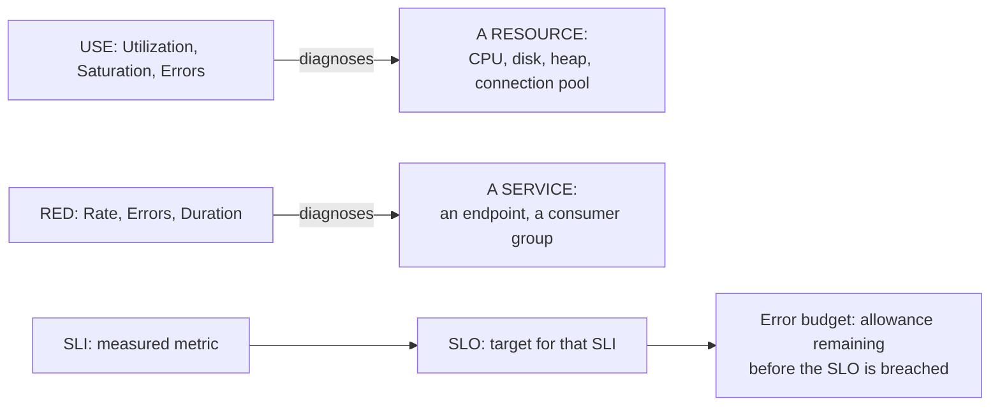

# Performance Methodology (USE/RED) and SLI/SLO/Error Budgets

> **Topic register:** T-1201/T-1206 · IWI 6.90/6.80 · Staff tier
> **Provenance:** the 30-day simulation in this chapter is real, computed output from [`practice/java/week-11/error-budget/src/ErrorBudgetDemo.java`](../../practice/java/week-11/error-budget/src/ErrorBudgetDemo.java).

## Table of Contents

1. [Learning Objectives](#learning-objectives)
2. [Why This Matters in Interviews](#why-this-matters-in-interviews)
3. [Mental Model](#mental-model)
4. [Definition and Purpose](#definition-and-purpose)
5. [Core Concepts](#core-concepts)
6. [Internal Implementation](#internal-implementation)
7. [Diagrams](#diagrams)
8. [Production Scenarios](#production-scenarios)
9. [Trade-offs](#trade-offs)
10. [Decision Framework](#decision-framework)
11. [Common Mistakes](#common-mistakes)
12. [Anti-Patterns](#anti-patterns)
13. [Best Practices](#best-practices)
14. [Interview Answer Framework](#interview-answer-framework)
15. [Interview Questions](#interview-questions)
16. [Summary](#summary)
17. [Key Takeaways](#key-takeaways)
18. [Cheat Sheet](#cheat-sheet)
19. [Flashcards](#flashcards)
20. [Practice Exercises](#practice-exercises)
21. [Solutions](#solutions)
22. [Additional Reading](#additional-reading)
23. [Official References](#official-references)

---

## Learning Objectives

By the end of this chapter you can:

- Apply USE to a resource and RED to a service, using artifacts you already understand.
- Compute and read an error budget, distinguishing the monthly aggregate from the daily burn rate.
- Use an error budget as an actual decision input ("can we ship this risky change"), not just a retrospective score.
- Deliver a quantified incident story using error-budget language.

## Why This Matters in Interviews

This vocabulary is what makes a scaling or incident story credible in a behavioral or system-design interview — a candidate who can say "we were at 60% of our error budget for the month and a single incident consumed 15% of it in 40 minutes" is speaking with a precision that "the system was having some problems" simply doesn't convey. Interviewers use this topic specifically to check whether a candidate has practiced computing these numbers, not just read the definitions.

## Mental Model

**USE diagnoses a resource, RED diagnoses a service, and an error budget turns "how risky can we be this month" into a number instead of a gut call.** All three exist to replace vague operational language with something quantifiable and comparable across incidents — and the real skill this topic rewards is applying the vocabulary retroactively to artifacts you already have, not memorizing new definitions.

## Definition and Purpose

**USE** (Utilization, Saturation, Errors) is a methodology for diagnosing a RESOURCE (a CPU, a disk, a connection pool) — for each resource, check how busy it is, how much work is queued waiting for it, and whether it's throwing errors. **RED** (Rate, Errors, Duration) is the equivalent methodology for a SERVICE (a request-handling endpoint) — requests per second, error rate, and latency distribution. An **SLI** (service level indicator) is a measured metric (e.g., success rate); an **SLO** (service level objective) is a target for that SLI (e.g., 99.9%); the **error budget** is what's left to spend before the SLO is breached.

These topics supply the vocabulary that makes a scaling or incident story credible in a behavioral interview: a candidate who can quantify an incident against a budget is speaking with a precision that a vague description simply doesn't convey, and that precision comes directly from having real practice computing these numbers.

## Core Concepts

### USE and RED apply to artifacts you already have

Rather than needing new demo code, USE and RED are best understood by re-reading real artifacts through their lens — this topic is a "vocabulary retrofit," not new material. **USE applied to a real GC log**: the heap itself is the resource. Utilization = occupied heap / max heap at any point. Saturation = how much work is queued waiting on this resource — a GC pause IS saturation made visible: the JVM had to stop all application threads because the heap couldn't absorb another allocation without reclaiming space first. Errors = an `OutOfMemoryError`, the resource's explicit failure signal. **RED applied to a Kafka consumer group**: Rate = messages consumed per second by a consumer group. Errors = failed message processing, or measured delivery-semantics duplicates. Duration = time from a message being produced to being fully processed — directly connects consumer lag to an SLO, not just a metric.

### An error budget's monthly aggregate can hide a severe single-day incident

A monthly SLO can be "met" overall (actual success rate above target, budget not fully consumed) while a single incident consumed a disproportionate share of that month's entire allowance in a very short window. Tracking only the aggregate hides exactly the signal that separates a genuine incident from routine noise.

### An error budget is a decision input, not a retrospective score

The entire operational purpose of an error budget is to make "how much risk can we afford to take this month" an answerable, data-driven question — should we ship the risky migration, run the maintenance window, defer a rollout — rather than a gut call made after the fact in a retrospective.

## Internal Implementation

**Real output**, a simulated 30 days of a service targeting a 99.9% SLO, 2,000,000 requests/day, including one real 40-minute incident on day 17:

```
SLO: 99.900% success rate over 30 days (60,000,000 total requests)
Error budget: 60,000 allowed failures over the period (0.1000% of traffic)

day 16:      446 failures, budget remaining after today:     53,143
day 17:    8,791 failures, budget remaining after today:     44,352  <-- incident day
day 18:      402 failures, budget remaining after today:     43,950
...
Actual success rate over the 30 days: 99.96492%  (SLO target: 99.900%)
Total failures: 21,050 of 60,000 allowed (35.1% of budget consumed)
RESULT: SLO met -- budget remaining, but see day 17's single-day burn rate.
```

One 40-minute incident (day 17) consumed roughly 8,350 more failures than a typical day (8,791 vs. a ~450 background rate) — by itself, close to 14% of the ENTIRE 30-day error budget, in under an hour. The SLO was still met overall (99.96% actual vs. 99.9% target, 35.1% of budget consumed across the whole month) — but stating ONLY the monthly aggregate would hide that a single incident nearly used up two weeks' worth of typical daily burn in one sitting. This is precisely the kind of number a credible incident story needs: not "we had an outage," but "the outage consumed roughly 14% of our monthly error budget in 40 minutes, which is why we treated it as a genuine incident rather than routine noise."

## Diagrams



## Production Scenarios

### Scenario: a team ships a risky migration based on a healthy monthly error-budget aggregate, unaware of a climbing daily trend

**Symptoms.** With two weeks left in the month, a team sees 40% of the monthly error budget consumed and decides the remaining 60% is ample room to ship a moderately risky database migration. Three days after shipping, the service breaches its SLO for the month.

**Impact.** An SLO breach that could have been anticipated and avoided by looking one level deeper than the aggregate percentage, damaging trust in the team's operational judgment for that quarter.

**Initial hypotheses.** The migration itself introduced an unrelated new bug (checked — the migration's own error rate is within expected bounds); a coincidental unrelated incident occurred the same week (checked — no other incident is recorded); the pre-migration 40% consumption was already trending upward daily, not flat, and the migration's modest additional risk tipped an already-climbing trend over the edge (correct).

**Evidence.** A day-by-day breakdown of the pre-migration budget consumption shows a steadily increasing daily failure count for two weeks straight, unrelated to any single incident — a slow-burning, cumulative issue (later identified as a memory leak causing gradually increasing timeout-driven failures) that the monthly aggregate alone didn't surface as urgent.

**Diagnosis.** The team's aggregate-only view ("60% of budget remaining") missed exactly this chapter's named risk: an error budget's monthly aggregate can hide a severe or worsening trend that only the daily burn-rate breakdown reveals. A steadily climbing daily rate left far less real headroom than the aggregate percentage suggested.

**Immediate mitigation.** Roll back the migration to remove its incremental risk while the underlying climbing-trend issue is investigated separately.

**Permanent remediation.** Fix the root cause (the memory leak) and add a standing practice of reviewing the daily burn-rate trend, not just the aggregate percentage, before any risk-bearing decision (ship, migrate, run a maintenance window).

**Alternatives considered.** Simply lowering the threshold for what counts as "ample room" (e.g., requiring 80% remaining instead of 60%) — rejected as treating the symptom; the actual fix is looking at trend, not just raising a static threshold that a climbing trend could still exceed.

**Trade-offs.** Reviewing the daily trend before every risk decision adds a small analysis step to the process — accepted, since the alternative is exactly the kind of avoidable SLO breach this incident represents.

**Prevention.** Any decision gated on error-budget headroom should require the daily burn-rate chart, not just the current aggregate percentage, as a matter of process.

**Interview lesson.** This is Interview Question 1's underlying scenario played out with a real, costly consequence: an aggregate-only view of the error budget missing a climbing trend that the daily breakdown would have surfaced.

## Trade-offs

| Choice | Benefit | Cost |
|---|---|---|
| Tighter SLO (e.g., 99.99%) | Better guaranteed user experience | Much smaller error budget — a single incident can breach it; expensive engineering investment to sustain |
| Looser SLO (e.g., 99.5%) | Cheaper to sustain, more room for incidents without breach | Worse guaranteed experience; may not meet real user/business expectations |
| Error budget tracked monthly | Smooths out day-to-day noise, focuses attention on genuine trend | Can hide a severe single-day incident inside an otherwise-fine monthly aggregate — worth tracking BOTH the aggregate and daily burn rate |
| USE for resources, RED for services | Matches the right methodology to the right diagnostic target | Neither alone covers everything — a resource can be healthy by USE while the service built on it fails by RED (e.g., a bug, not a resource-saturation issue) |

## Decision Framework

1. **Is the diagnostic target a resource (CPU, disk, heap, connection pool)?** Apply USE — utilization, saturation, error signal.
2. **Is the diagnostic target a service (an endpoint, a consumer group)?** Apply RED — rate, errors, duration.
3. **Is a risk-bearing decision (ship, migrate, maintenance window) being gated on error-budget headroom?** Require the daily burn-rate breakdown, not just the current monthly aggregate percentage.
4. **Is an incident story being told without a quantified budget impact?** Compute and state the percentage of the relevant period's budget the incident consumed, and over what duration.
5. **Is the SLI being measured against an average rather than a percentile?** Route back to [Percentiles, Tail Latency, and Coordinated Omission](percentiles-tail-latency-and-coordinated-omission.md) — SLOs are defined against percentiles, never averages.

## Common Mistakes

- Reporting only the monthly/aggregate error-budget consumption without checking the daily burn-rate pattern underneath it.
- Treating USE and RED as interchangeable rather than matched to their targets (resources vs. services).
- Treating this vocabulary as new content rather than recognizing it retrofits precision onto stories and decisions from every earlier context.

## Anti-Patterns

- **Gating a risky decision on a single aggregate percentage** without checking whether the trend underneath it is flat, improving, or climbing.
- **Applying USE to a service or RED to a resource**, producing a mismatched, less actionable diagnosis.
- **Reporting an incident qualitatively** ("we had some issues") when a quantified error-budget impact was available and would have been more credible and more actionable.

## Best Practices

- Track both the monthly aggregate and the daily burn-rate trend for every SLO; require the trend view before any risk-bearing decision.
- Match USE to resources and RED to services deliberately, rather than reaching for whichever methodology comes to mind first.
- Use the error budget as an explicit input into ship/hold decisions, documented as such, not just reported after the fact.
- Quantify incident stories in error-budget terms (percentage consumed, over what duration) rather than qualitative severity descriptions.

## Interview Answer Framework

### 30-Second Answer

USE (Utilization, Saturation, Errors) diagnoses a resource; RED (Rate, Errors, Duration) diagnoses a service. An SLO is a target for a measured SLI, and the error budget is what's left before it's breached — measured directly: a single 40-minute incident consumed roughly 14% of an entire month's error budget, even though the month's aggregate SLO was still met.

### 2-Minute Answer

Definition: USE diagnoses resources, RED diagnoses services, SLOs are targets for SLIs, and an error budget is the remaining allowance before a breach. Why it exists: this vocabulary makes incident and capacity stories quantifiable and comparable, rather than vague. How it works: USE and RED apply directly to artifacts already in hand (a GC log's heap utilization, a consumer group's rate/errors/duration); an error budget's monthly aggregate can hide a severe single-day incident unless the daily trend is also tracked. One important trade-off: a tighter SLO gives a better guaranteed experience but a much smaller budget that a single incident can breach. Production example: a real 30-day simulation showing a single 40-minute incident consuming ~14% of the entire monthly budget, and a real-shaped incident where a team shipped a risky migration based on a healthy aggregate while missing a climbing daily trend.

### 10-Minute Deep Dive

Cover, in order: the mental model — USE for resources, RED for services, error budgets as a decision tool (mental model); applying USE/RED retroactively to artifacts already understood (core concepts); the real 30-day error-budget simulation and the day-17 incident's outsized share (internals, real evidence); the decision framework for gating risk decisions on budget headroom (decision framework); and close with the production scenario — a risky migration shipped on a healthy aggregate that missed a climbing daily trend, leading to an SLO breach.

### Whiteboard Explanation

Draw the [§ Diagrams](#diagrams) graph: USE pointing at a resource box, RED pointing at a service box, and a third chain — SLI → SLO → error budget — with an arrow from error budget back into a "ship/hold decision" box, making the decision-input framing visually explicit rather than treating the budget as a terminal, retrospective number.

### Production Example

The climbing-trend migration incident in [§ Production Scenarios](#production-scenarios): a team shipped a risky migration based on a 60%-remaining monthly aggregate, unaware the daily burn rate had been steadily climbing for two weeks, leading to an SLO breach shortly after.

### Trade-offs to Mention

State unprompted: a monthly aggregate can hide a severe single-day incident or a climbing trend; USE and RED are matched to different diagnostic targets and aren't interchangeable; a tighter SLO costs real engineering investment to sustain, not just a stricter number.

### Common Candidate Mistakes

Answering purely from the aggregate percentage without asking about the underlying daily pattern; treating this week's vocabulary as new, disconnected content rather than a retrofit onto existing incident/scaling knowledge.

### Typical Follow-Up Questions

1. "The 35% is spread evenly across every day, no single incident. Does that change your answer?"
2. "How does that number change if your load testing measured it via a closed-loop generator?"

### Senior-Level Expectations

Asks for the daily breakdown before answering a ship/hold question; connects RED's Duration signal to percentile selection when asked about timeouts.

### Staff-Level Discussion

The genuinely Staff-level move with error budgets isn't computing them — it's using them as an actual decision input: an error budget's entire operational purpose is to make "how much risk can we afford to take this month" an answerable, data-driven question rather than a gut call, and a Staff engineer explicitly ties concrete decisions (ship the risky migration, or don't; run the maintenance window, or defer it) to the budget's current state and trend, not just report the number after the fact in a retrospective. This same instinct extends across the whole observability stack: a timeout should be set from RED's Duration distribution at a high percentile (per [Percentiles, Tail Latency, and Coordinated Omission](percentiles-tail-latency-and-coordinated-omission.md)), and a Duration distribution measured via a closed-loop load generator would understate the real tail, meaning a timeout set from that data could be miscalibrated — tying resilience, percentiles, and RED together into one coherent, cross-referenced answer.

## Interview Questions

### Question 1 — We're at 35% of our monthly error budget with two weeks left. Do we ship the risky migration this week?

**Why interviewers ask it.** Tests whether the candidate treats the error budget as an actual decision input requiring more than the aggregate number.

**Expected answer.** The aggregate number alone doesn't answer this — check the DAILY burn rate trend, not just the monthly total. If the 35% consumption is mostly from one incident rather than a steadily climbing background rate, there's real room; if it's climbing steadily, shipping something risky could tip into a breach.

**Minimum acceptable answer.** Asks for more information before answering, even without specifying the daily-trend breakdown precisely.

**Strong Senior answer.** Asks for the daily breakdown before answering.

**Staff-level extension.** Frames the error budget as a genuine resource-allocation decision — the budget exists specifically to make "can we ship something risky" answerable with data — rather than a retrospective health score.

**Common mistakes.** Answering purely from the aggregate percentage without asking about the underlying daily pattern.

**Likely follow-ups.** "The 35% is spread evenly across every day, no single incident. Does that change your answer?"

**Evaluation criteria (1–5).** 1: answers from the aggregate alone. 3: asks for the daily breakdown. 5: correct question plus frames the budget as an explicit decision-allocation tool.

**Related references.** [§ Internal Implementation](#internal-implementation); [§ Production Scenarios](#production-scenarios).

---

### Question 2 — Set the timeout — from what data?

**Why interviewers ask it.** Tests whether the candidate connects this week's RED vocabulary back to percentile selection rather than treating it as an isolated new topic.

**Expected answer.** From the service's own RED "Duration" distribution — specifically a high percentile (p99) — not a round number.

**Minimum acceptable answer.** States the timeout should come from real latency data.

**Strong Senior answer.** Connects RED's Duration signal to percentile selection.

**Staff-level extension.** Explicitly notes that a closed-loop-measured Duration distribution would understate the real tail (per coordinated omission), meaning a timeout set from that data could be miscalibrated — tying resilience, percentiles, and RED into one coherent answer.

**Common mistakes.** Treating this as a new, unrelated question rather than recognizing it's the exact same question resilience-pattern material asked, now answerable with RED's Duration metric named precisely.

**Likely follow-ups.** "How does that number change if your load testing measured it via a closed-loop generator?"

**Evaluation criteria (1–5).** 1: picks a round number. 3: connects to RED's Duration and percentile selection. 5: correct connection plus the coordinated-omission miscalibration risk named unprompted.

**Related references.** [Percentiles, Tail Latency, and Coordinated Omission](percentiles-tail-latency-and-coordinated-omission.md); [Resilience Patterns](../system-design/resilience-patterns.md).

## Summary

USE (Utilization/Saturation/Errors) diagnoses resources; RED (Rate/Errors/Duration) diagnoses services — both are lenses applicable directly to artifacts already produced earlier (a real GC log, a real Kafka consumer group), not topics needing new demo code. A real 30-day error-budget simulation shows a single 40-minute incident consuming roughly 14% of the entire monthly budget — precisely the kind of number that turns a vague incident story into a credible, quantified one, and precisely why tracking the daily burn-rate trend matters as much as the monthly aggregate.

## Key Takeaways

- USE applies to resources (utilization, saturation, error signals); RED applies to services (rate, errors, duration).
- An error budget's monthly aggregate can hide a severe single-day incident — track the daily trend too.
- SLOs are defined against percentiles, never averages.
- This vocabulary retrofits precision onto every earlier incident/scaling story — practice applying it backward, not just forward.

## Cheat Sheet

| Target | Methodology |
|---|---|
| A resource (CPU, disk, connection pool, heap) | USE: Utilization, Saturation, Errors |
| A service (an endpoint, a consumer group) | RED: Rate, Errors, Duration |
| "How much risk can we take this month?" | Error budget remaining + daily burn-rate trend, not just the monthly aggregate |

## Flashcards

### Card: What USE stands for and diagnoses

**Prompt:**
What does USE stand for, and what does it diagnose?

**Answer:**
Utilization, Saturation, Errors — a methodology for diagnosing a RESOURCE (CPU, disk, heap, connection pool).

**Why it matters:**
Matches the right diagnostic lens to a resource rather than a service.

**Common trap:**
Applying USE to a service endpoint instead of a resource.

**Related:**
[Core Concepts](#core-concepts)

### Card: What RED stands for and diagnoses

**Prompt:**
What does RED stand for, and what does it diagnose?

**Answer:**
Rate, Errors, Duration — a methodology for diagnosing a SERVICE (a request-handling endpoint or consumer group).

**Why it matters:**
Matches the right diagnostic lens to a service rather than a resource.

**Common trap:**
Applying RED to a resource like a CPU or disk.

**Related:**
[Core Concepts](#core-concepts)

### Card: Why a monthly aggregate can mislead

**Prompt:**
Why can a monthly error-budget aggregate be misleading on its own?

**Answer:**
It can hide a severe single-day incident inside an otherwise-fine month — a 40-minute incident consuming ~14% of an ENTIRE month's budget was measured directly, invisible from the monthly total alone.

**Why it matters:**
The reason gating decisions on the aggregate alone is risky.

**Common trap:**
Treating a healthy aggregate percentage as sufficient justification for a risky decision.

**Related:**
[Production Scenarios](#production-scenarios)

## Practice Exercises

1. Reproduce: [`practice/java/week-11/error-budget/src/ErrorBudgetDemo.java`](../../practice/java/week-11/error-budget/src/ErrorBudgetDemo.java), then change the incident's duration/severity and recompute what fraction of the monthly budget it consumes.
2. Apply the USE methodology, in writing, to a circuit-breaker's thread pool — what's the "resource," and what do Utilization/Saturation/Errors correspond to for a thread pool specifically?
3. Draft the exact quantified sentence you'd use in a behavioral story about an incident, using this chapter's own numbers as a template ("a N-minute incident consumed X% of the month's error budget").

## Solutions

**Exercise 1.** A longer or more severe incident consumes a proportionally larger fraction of the monthly budget in the same window; e.g., doubling the incident's duration roughly doubles its failure count and its percentage-of-budget impact, all else equal.

**Exercise 2.** For a thread pool: the resource is the pool itself. Utilization = active threads / pool size. Saturation = queued tasks waiting for a free thread (directly connects to the [unbounded-queue trap](../concurrency/executors-and-thread-pool-sizing.md#internal-implementation)) — a growing queue is saturation made visible, the same way a GC pause is saturation made visible for the heap. Errors = `RejectedExecutionException` counts from a bounded queue's rejection policy.

**Exercise 3.** A template sentence: "A 40-minute incident on day 17 consumed roughly 14% of the month's entire error budget — nearly two weeks' worth of typical daily burn in under an hour — which is why we treated it as a genuine incident requiring a full root-cause review, not routine noise."

## Additional Reading

- [Google SRE Book — Service Level Objectives](https://sre.google/sre-book/service-level-objectives/)
- [Brendan Gregg — The USE Method](https://www.brendangregg.com/usemethod.html)

## Official References

- [Google SRE Workbook — Implementing SLOs](https://sre.google/workbook/implementing-slos/)
