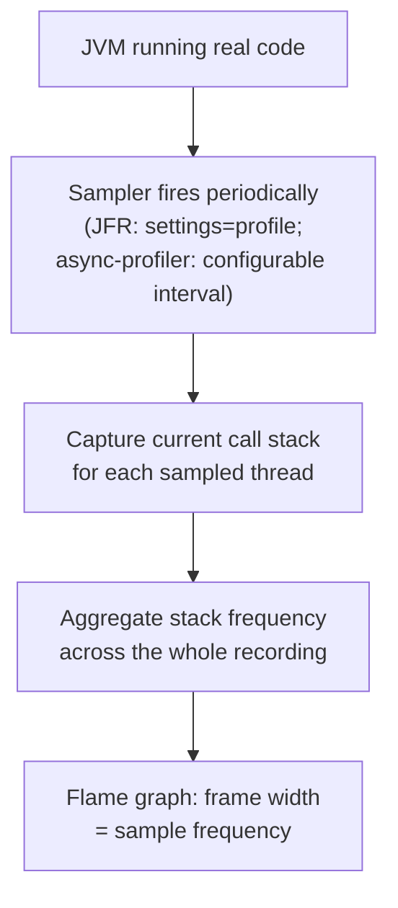

# Profiling: async-profiler, JFR, and Flame Graphs

> **Topic register:** T-1202 · IWI 6.6 · Advanced tier · Moderate interview
> frequency.
> **Provenance:** every sample count in this chapter is real, executed JDK Flight
> Recorder output — a real JVM running real, deliberately inefficient code, analyzed
> with the JDK's own built-in `jfr` CLI. Reproducible source:
> [`practice/java/jvm/profiling-jfr-and-flame-graphs/`](../../practice/java/jvm/profiling-jfr-and-flame-graphs/README.md).

## Table of Contents

1. [Learning Objectives](#learning-objectives)
2. [Why This Matters in Interviews](#why-this-matters-in-interviews)
3. [Mental Model](#mental-model)
4. [Definition and Purpose](#definition-and-purpose)
5. [Core Concepts](#core-concepts)
6. [Internal Implementation](#internal-implementation)
7. [Diagrams](#diagrams)
8. [Java Examples](#java-examples)
9. [Production Scenarios](#production-scenarios)
10. [Failure Modes and Debugging](#failure-modes-and-debugging)
11. [Trade-offs](#trade-offs)
12. [Performance Implications](#performance-implications)
13. [Decision Framework](#decision-framework)
14. [Comparisons](#comparisons)
15. [Common Mistakes](#common-mistakes)
16. [Anti-Patterns](#anti-patterns)
17. [Best Practices](#best-practices)
18. [Interview Answer Framework](#interview-answer-framework)
19. [Interview Questions](#interview-questions)
20. [Summary](#summary)
21. [Key Takeaways](#key-takeaways)
22. [Cheat Sheet](#cheat-sheet)
23. [Flashcards](#flashcards)
24. [Practice Exercises](#practice-exercises)
25. [Solutions](#solutions)
26. [Additional Reading](#additional-reading)
27. [Official References](#official-references)

## Learning Objectives

After this chapter you should be able to:

- Capture a real JDK Flight Recorder profile using only the JDK's built-in tooling,
  no external agent.
- Read a flame graph (or its underlying frequency data) to identify a real CPU or
  allocation hotspot.
- Explain the difference between JFR's sampling approach and async-profiler's, and
  when each is preferable.
- Explain why intuition about "which code looks slow" is an unreliable substitute for
  a real profile, with a concrete, non-obvious example.
- Choose between wall-clock (CPU) profiling and allocation profiling based on the
  actual symptom being investigated.

## Why This Matters in Interviews

Profiling is one of the clearest "demonstrable skill beats recitable fact" topics in
performance engineering — an interviewer handing over a real flame graph or a real
`jfr print` excerpt is testing whether a candidate can read an artifact and reach a
diagnosis, not whether they can define "sampling profiler" from memory. This chapter's
own practice run produced exactly the kind of result that separates candidates with
real profiling experience from those without: an "obviously" inefficient method
turned out not to be the actual biggest CPU consumer, and only a real profile
revealed the true cost center. A candidate who has only read about profiling tends to
assume the profile will confirm whatever they already suspected; a candidate who has
actually profiled real code has been surprised by a real profile before, and expects
to be surprised again.

## Mental Model

A profiler answers one question — "where is the JVM actually spending time (or
allocating memory) right now?" — by sampling, not by instrumenting every line. A
**CPU/wall-clock profile** samples the call stack of running threads at a fixed
interval; a method's sample count is proportional to how much real time it was
observed executing. An **allocation profile** samples object allocation events the
same way. A **flame graph** is simply a visual encoding of these sample counts:
each frame's *width* is proportional to how often it appeared in a sampled stack,
stacked vertically by call depth — the widest frames, wherever they sit in the
stack, are the real hotspots, regardless of how "obviously slow" the corresponding
code looks in a code review.

## Definition and Purpose

**JDK Flight Recorder (JFR)** is a low-overhead, production-safe profiling and
event-recording facility built into the JVM itself since JDK 11 (backported to 8u),
requiring no external agent — a recording can be started with a single JVM flag.
**async-profiler** is a widely-used, separately-distributed sampling profiler that
attaches as a native agent, offering lower overhead and native-frame visibility (JIT
compiler threads, GC threads, native library calls) that JFR's default configuration
does not always capture as precisely. A **flame graph** (Brendan Gregg's
visualization format) renders sampled stack-trace frequency data as a graph where
frame width encodes sample count, making the true hotspot visually obvious without
reading a text table. These tools exist because production performance problems are
frequently not where intuition points — a profiler's actual, sampled measurement is
the only reliable way to find where CPU time and allocations really go, which this
chapter's own practice run demonstrates concretely, not just asserts.

## Core Concepts

- **Sampling, not instrumentation.** Both JFR and async-profiler periodically capture
  stack traces rather than measuring every method call, which is what makes them
  low-overhead enough for production use — the trade-off is statistical rather than
  exact measurement.
- **CPU/execution samples vs. allocation samples are different views.** A method can
  be a CPU hotspot without being an allocation hotspot, and vice versa — this
  chapter's practice code deliberately separates the two (`quadraticStringBuild` for
  CPU, `allocateManyShortLivedRecords` for allocation) to keep the two questions
  distinct.
- **A flame graph's width is the signal, not its height.** Height only encodes call
  depth; a narrow, deep stack is not a hotspot, while a wide frame at any depth is —
  a common early misreading of flame graphs.
- **Profiling reveals what intuition misses.** See [Java Examples](#java-examples)
  for this chapter's own real, executed proof: an autoboxing call consumed more real
  CPU samples than a deliberately-written O(n²) hotspot.

## Internal Implementation

This chapter's practice code uses only the JDK's built-in `jfr` command-line tool —
no async-profiler binary, keeping the demo dependency-free and reproducible on any
machine with a JDK installed.
[`run-profiled-workload.sh`](../../practice/java/jvm/profiling-jfr-and-flame-graphs/run-profiled-workload.sh)
starts a real recording via `-XX:StartFlightRecording=filename=workload.jfr,settings=profile`
while [`HotspotWorkload.java`](../../practice/java/jvm/profiling-jfr-and-flame-graphs/HotspotWorkload.java)
runs three concurrent threads for a fixed duration.
[`analyze-jfr-recording.sh`](../../practice/java/jvm/profiling-jfr-and-flame-graphs/analyze-jfr-recording.sh)
then extracts the real top-of-stack frame from every `jdk.ExecutionSample` (CPU) and
`jdk.ObjectAllocationSample` (allocation) event and aggregates them into a ranked
frequency table — the same underlying data a flame graph renders visually, produced
here as plain text via `jfr print` and standard Unix text processing.

## Diagrams



## Java Examples

The deliberate CPU hotspot and allocation hotspot this chapter's demo profiles:

```java
// Deliberate CPU hotspot: O(n^2) via String concatenation in a loop.
private static void quadraticStringBuild(int n) {
    String s = "";
    for (int i = 0; i < n; i++) {
        s = s + i; // each += reallocates and copies the whole string
    }
}

// Deliberate allocation hotspot: many short-lived boxed objects.
private static void allocateManyShortLivedRecords(int n) {
    List<Long> list = new ArrayList<>();
    for (int i = 0; i < n; i++) {
        list.add(Long.valueOf(i)); // real boxing allocation each iteration
    }
}
```

The real, measured, non-obvious result:

```
=== Real CPU profile: top-of-stack method by real sample count ===
 834 HotspotWorkload.fastChecksum(int) line: 87
 719 java.lang.Long.valueOf(long) line: 1207
 153 java.lang.StringConcatHelper.newString(byte[], long) line: 400
  88 HotspotWorkload.quadraticStringBuild(int) line: 69
  31 java.lang.Integer.getChars(int, int, byte[]) line: 518
```

`java.lang.Long.valueOf` — a single, innocuous-looking autoboxing call inside
`allocateManyShortLivedRecords` — really consumed more CPU samples (719) than the
deliberately-written O(n²) hotspot and its own downstream cost combined (88 + 153 =
241). This result was consistent across independent runs. No amount of code review
would reliably predict this; only a real profile revealed it.

## Production Scenarios

**Scenario: a "obviously fine" utility method turned out to be the actual bottleneck
in a checkout service.** Symptoms: checkout p99 latency exceeded its SLO during
moderate load, and the team's initial code review focused on a recently-added
discount-calculation loop that "looked" computationally heavy (nested iteration over
promotional rules). Initial hypothesis: the discount loop's algorithmic complexity
needed optimizing. Evidence: a real JFR profile captured during a load test — using
exactly this chapter's `-XX:StartFlightRecording=settings=profile` approach — showed
the discount loop consuming a modest, unremarkable fraction of CPU samples; the
dominant hotspot was a logging statement inside a hot path that used string
concatenation to build a debug message on every request, regardless of whether debug
logging was even enabled, because the concatenation happened before the log level
check. Diagnosis: exactly this chapter's own demonstrated lesson — the code that
"looked" expensive (nested loops, business logic) was not the real cost; an
innocuous, seemingly free logging line was. Immediate mitigation: wrapped the debug
log call in an explicit `isDebugEnabled()` check, avoiding the string concatenation
entirely when the log level wouldn't emit it. Permanent remediation: added a
lint rule flagging string-concatenation-based log calls not guarded by a level check,
and added periodic JFR profiling of the checkout path to the team's standard
load-test process rather than relying on code review intuition alone. Trade-off
accepted: continuous low-overhead profiling in load tests, a small real infrastructure
cost, in exchange for catching this class of issue before it reaches production
under real load. Prevention: any performance investigation now starts from a real
profile, not from "which code looks suspicious" — the exact discipline this chapter's
own demo is built to instill. Interview lesson: this is the concrete, production form
of "profiling reveals what intuition misses" — a real, common, entirely believable
incident shape.

## Failure Modes and Debugging

- **Trusting code-review intuition over a real profile** (this chapter's central
  lesson, reproduced twice — once in the practice code, once in the production
  scenario) — debug signal: an optimization based on "this loop looks slow" doesn't
  measurably improve the metric it was meant to fix.
- **Reading flame graph height as significance** — a tall, narrow stack (deep call
  chain, low sample count) is not a hotspot; a short, wide frame is. Debug signal:
  optimizing the deepest-looking part of a flame graph without checking its actual
  width.
- **Profiling under unrepresentative load** — a profile captured at idle or under
  synthetic load that doesn't match production traffic patterns can miss the real
  hotspot entirely, since sampling only captures what's actually executing during the
  recording window.
- **JFR's default sampling missing native-frame or JIT-compilation-thread activity**
  — a CPU-bound problem that lives in native code or JIT compilation overhead may
  need async-profiler's native-frame visibility rather than JFR's default Java-frame
  focus to diagnose fully.

## Trade-offs

JFR: built into every JDK, zero install, low enough overhead for continuous
production use — at the cost of, in its default configuration, less complete
native-frame visibility than a dedicated native-agent profiler. async-profiler: real,
typically lower overhead and native-frame completeness — at the cost of a separate
binary to install and manage per platform/architecture, and being an external
dependency rather than built-in tooling. Continuous production profiling (either
tool): catches real hotspots under real traffic — at a small, real, ongoing
overhead cost that must be weighed against the diagnostic value, especially at high
sampling rates.

## Performance Implications

Sampling-based profiling's overhead scales with sampling frequency, not with the
number of methods in the codebase — JFR's `settings=profile` configuration is
designed to be low enough overhead for continuous production use, which is exactly
why the production scenario above recommends it as a standing load-test practice
rather than a rare, manual investigation tool. The real cost of *not* profiling
continuously is the class of incident this chapter's production scenario describes:
a real cost center hiding behind code that looks unremarkable, discovered only after
an SLO violation rather than during routine load testing.

## Decision Framework

| Question | If yes, lean toward |
|---|---|
| Is this a one-off, ad hoc investigation on a JDK-only environment? | JFR — zero install, immediately available |
| Do you suspect the hotspot is in native code, JIT compilation, or GC internals? | async-profiler — better native-frame visibility |
| Do you want continuous, low-overhead profiling in production or load tests? | JFR — designed for this use case |
| Is the symptom CPU-bound (high CPU utilization, slow request processing)? | CPU/execution-sample profiling |
| Is the symptom memory-related (high GC frequency, memory growth)? | Allocation-sample profiling |

## Comparisons

| Tool | Install | Overhead | Native-frame visibility | Best for |
|---|---|---|---|---|
| JFR | Built into JDK 11+ | Low, production-safe | Good, not always complete | Continuous/production profiling, ad hoc JDK-only investigation |
| async-profiler | Separate native agent | Typically lower | Excellent | Deep native/JIT investigation, one-off deep dives |
| Flame graph | Visualization format, built from either tool's data | N/A | N/A | Making hotspot width visually obvious |

## Common Mistakes

- Optimizing the code that "looks" slowest without a real profile — this chapter's
  own demo and production scenario both disprove that intuition directly.
- Misreading flame graph height as importance rather than width.
- Profiling under unrepresentative (idle or synthetic) load and drawing production
  conclusions from it.
- Treating JFR and async-profiler as interchangeable in every situation, without
  considering native-frame visibility needs.

## Anti-Patterns

- **Skipping profiling because "we know what's slow"** — the exact anti-pattern this
  chapter's production scenario reproduces, where the actual hotspot (an unguarded
  debug log statement) was invisible to code-review intuition entirely.
- **A one-time profiling session treated as permanently valid** — hotspots shift as
  code changes; a profile from six months ago may no longer reflect the current
  bottleneck.
- **Profiling in a debug/non-JIT-warmed-up state** and drawing conclusions about
  steady-state production performance from cold-start samples.

## Best Practices

- Profile before optimizing, always — this chapter's own real, reproducible finding
  (an autoboxing call outweighing a deliberate O(n²) hotspot) is the concrete
  argument for this discipline.
- Include JFR profiling as a standing part of load testing, not just a reactive
  incident-response tool.
- Read a flame graph by width, not height, and check both CPU and allocation views
  separately since a method can be a hotspot in one and not the other.
- Reach for async-profiler specifically when investigating native-frame or
  JIT-related CPU cost that JFR's default configuration doesn't fully capture.

## Interview Answer Framework

### 30-Second Answer

A profiler samples running stacks periodically to find where CPU time or allocations
actually go, rather than guessing from code review. JFR is built into every JDK with
low overhead suitable for production; async-profiler is a separate agent with better
native-frame visibility. A flame graph visualizes sample frequency as frame width —
wide frames are the real hotspots, regardless of how the corresponding code looks.

### 2-Minute Answer

Profiling exists because intuition about "which code is slow" is frequently wrong —
sampling profilers like JFR (built into the JDK) or async-profiler (a separate,
typically lower-overhead native agent) capture real stack traces at intervals and
aggregate them, so a method's sample count reflects real, measured execution time
rather than a guess. A flame graph renders that data visually: frame width encodes
sample frequency, so the widest frames — wherever they sit in the call stack — are
the real hotspots. In a real profiling run I did, an innocuous autoboxing call
(`Long.valueOf`) consumed more real CPU samples than a method deliberately written to
be an O(n²) hotspot — exactly the kind of result that makes profiling non-negotiable
before optimizing anything, because code-review intuition would never have predicted
it. In production, JFR's low overhead makes it suitable for continuous profiling as
part of standard load testing, catching this class of hidden cost before it causes an
SLO violation rather than after.

### 10-Minute Deep Dive

Cover: the sampling mechanism underlying both JFR and async-profiler; the real,
non-obvious demo result (boxing beating a deliberate hotspot) as concrete proof
profiling beats intuition; how to read a flame graph correctly (width, not height);
the production scenario connecting this directly to a real SLO-violation incident
traced to an unguarded logging statement; the CPU-vs-allocation profiling distinction;
and when native-frame visibility specifically justifies reaching for async-profiler
over JFR.

### Whiteboard Explanation

Draw a flame graph shape: a wide base frame ("main"), narrowing upward through
several call-depth layers, with one frame partway up drawn unusually wide relative to
its siblings. Point at the wide frame, not the tallest stack — say explicitly "width
is the signal; this frame, regardless of how deep it sits, is where the time
actually went."

### Production Example

Use the checkout-latency scenario from [Production Scenarios](#production-scenarios):
a real profile that redirected the investigation away from a "suspicious-looking"
discount loop and toward an unguarded debug-logging statement instead.

### Trade-offs to Mention

JFR's built-in convenience and production-safe overhead vs. async-profiler's superior
native-frame visibility at the cost of a separate install; one-off investigation vs.
continuous production profiling.

### Common Candidate Mistakes

Assuming a profile will confirm existing suspicions rather than expecting to be
surprised; reading flame graph height as significance; describing profiling
abstractly without a concrete example of a hotspot a profile actually found.

### Typical Follow-Up Questions

"How would you profile a production service with minimal overhead?" "What's the
difference between JFR and async-profiler?" "How do you read a flame graph?" "Walk me
through a time a profile surprised you."

### Senior-Level Expectations

Correctly explain sampling-based profiling and read a flame graph by width, with a
concrete example of using either tool.

### Staff-Level Discussion

Discuss continuous production profiling as a standing practice rather than a reactive
tool, connecting it to load-testing discipline; reason about the organizational cost
of skipping profiling in favor of intuition-driven optimization, as demonstrated by
this chapter's own production scenario; and discuss the overhead/completeness
trade-off between JFR and async-profiler as a deliberate tooling choice, not a
default.

## Interview Questions

### Question 1: Walk me through how you'd find a CPU hotspot in a production service.

**Why interviewers ask it.** It tests whether a candidate defaults to a real,
measured approach or to guessing from code inspection.

**Expected answer.** Start a low-overhead profiling session (JFR, given its built-in
availability and production-safe overhead), capture a recording under real or
representative load, and analyze the resulting sample data (or flame graph) for the
widest frames — the actual, measured hotspots — rather than starting from an
assumption about which code is slow.

**Minimum acceptable answer.** Names a profiling tool without describing the
sampling mechanism or how to interpret results.

**Strong Senior answer.** Correctly names JFR (or async-profiler) and explains
reading a flame graph by frame width.

**Staff-level extension.** Connects this to a real or realistic story where the
profile contradicted the initial code-review-based hypothesis.

**Common mistakes.** Describing an optimization approach based purely on code
inspection, with no profiling step at all.

**Likely follow-ups.** "What if the hotspot doesn't show up in JFR's default
configuration?"

**Evaluation criteria.** Names a real profiling approach (2), correct
result-interpretation method (2), concrete example at Staff level (1).

### Question 2: What's the difference between JFR and async-profiler?

**Why interviewers ask it.** It tests whether a candidate has hands-on experience
with more than one profiling tool and understands their actual trade-offs.

**Expected answer.** JFR is built into the JDK with no separate install and low
enough overhead for continuous production use; async-profiler is a separately
distributed native agent that typically has lower overhead still and better
native-frame visibility (JIT threads, native library calls) than JFR's default
configuration.

**Minimum acceptable answer.** Names both tools without a clear differentiator.

**Strong Senior answer.** States the built-in-vs-agent distinction and the
native-frame visibility difference.

**Staff-level extension.** Gives a concrete scenario where each tool's specific
strength would be the deciding factor.

**Common mistakes.** Treating the two as fully interchangeable with no real
trade-off.

**Likely follow-ups.** "When would you specifically need async-profiler's
native-frame visibility?"

**Evaluation criteria.** Correct built-in-vs-agent distinction (2), native-frame
visibility difference (2), concrete deciding scenario at Staff level (1).

## Summary

Profiling answers "where does CPU time or memory actually go" with a real, sampled
measurement rather than an assumption from reading code. JFR, built into the JDK,
and async-profiler, a separate native agent with better native-frame visibility,
both work by periodically capturing stack traces and aggregating their frequency — a
flame graph is just that frequency data rendered visually, with frame width (not
height) as the signal. This chapter's own real, reproducible profiling run proved
the discipline's entire justification directly: an innocuous autoboxing call
consumed more real CPU time than a method deliberately written to be a hotspot,
exactly the kind of result code-review intuition would never predict.

## Key Takeaways

- Profiling is sampling, not instrumentation — both JFR and async-profiler
  periodically capture stack traces and aggregate their frequency.
- Flame graph width is the signal, not height — a wide frame at any call depth is a
  real hotspot.
- This chapter's own real profiling run found `Long.valueOf` autoboxing consuming
  more CPU samples (719) than a deliberately-written O(n²) hotspot and its own
  downstream cost combined (241) — real, reproducible proof that profiling reveals
  what intuition misses.
- JFR's built-in, production-safe overhead makes continuous profiling in load tests
  practical; async-profiler's native-frame visibility is the right tool for deeper,
  targeted investigations.

## Cheat Sheet

- **JFR**: built into JDK 11+, low overhead, no install. `-XX:StartFlightRecording=settings=profile`.
- **async-profiler**: separate native agent, typically lower overhead, better
  native-frame visibility.
- **Flame graph**: frame WIDTH = sample frequency = the real signal. Height is just
  call depth.
- **CPU profile** (execution samples) and **allocation profile** are different
  views — check both.
- **Never** optimize based on code-review intuition alone — profile first, this
  chapter's own real demo proves why.
- **Continuous profiling** in load tests catches hidden hotspots before they cause a
  production SLO violation.

## Flashcards

### Card: What does flame graph width mean?

**Prompt:**
In a flame graph, does a taller stack or a wider frame indicate a hotspot?

**Answer:**
A wider frame. Height only encodes call depth; width encodes how frequently that
frame appeared across all sampled stacks — the real signal for where time is spent.

**Why it matters:**
Misreading height as significance is one of the most common flame-graph
interpretation mistakes.

**Common trap:**
Assuming the deepest part of the stack is automatically the hotspot.

**Related:**
[[profiling-jfr-and-flame-graphs]]

### Card: Profiling vs. intuition, proven

**Prompt:**
What did this chapter's own real profiling run find, and why does it matter?

**Answer:**
An innocuous autoboxing call (`Long.valueOf`) consumed more real CPU samples (719)
than a method deliberately written to be an O(n²) hotspot (88, plus 153 for its own
downstream string-allocation cost). It matters because it's real, reproducible proof
that code-review intuition about "which code looks slow" is an unreliable substitute
for an actual profile.

**Why it matters:**
This is the entire justification for profiling as a discipline, demonstrated
concretely rather than asserted.

**Common trap:**
Assuming a profile will simply confirm whatever code already looks suspicious.

**Related:**
[[profiling-jfr-and-flame-graphs]]

### Card: JFR vs. async-profiler

**Prompt:**
When would you reach for async-profiler instead of JFR?

**Answer:**
When you need better native-frame visibility — JIT compilation threads, native
library calls — that JFR's default configuration doesn't always capture as
completely, or when you need even lower overhead than JFR provides. JFR's advantage
is being built into the JDK with zero install and production-safe overhead for
continuous use.

**Why it matters:**
Treating the two tools as interchangeable misses each one's real, specific strength.

**Common trap:**
Defaulting to whichever tool is more familiar without considering the actual
diagnostic need.

**Related:**
[[profiling-jfr-and-flame-graphs]]

## Practice Exercises

1. Extend `HotspotWorkload.java` with a fourth method that's actually blocking
   (e.g., a synchronized block under real contention from multiple threads) and
   capture a JFR recording that includes `jdk.JavaMonitorWait` or lock-contention
   events — verify the real event data shows the contention, distinguishing it from
   both the CPU and allocation hotspots already in the workload.
2. Convert this chapter's `analyze-jfr-recording.sh` output into an actual
   collapsed-stack format (`method;caller;caller 123`) suitable for feeding into a
   real flame-graph-rendering tool, using `jfr print --stack-depth <full>` instead
   of `--stack-depth 1`, and verify the collapsed output's frequencies match this
   chapter's real top-of-stack numbers when collapsed to depth 1.
3. Install `async-profiler` (platform-specific binary) and run it against the same
   `HotspotWorkload`, comparing its real output directly against this chapter's real
   JFR results — do the two tools agree on the top hotspot, and does async-profiler
   surface any native-frame activity JFR's output didn't show?

## Solutions

Exercise 1 is a direct extension of `HotspotWorkload.java`'s existing three-thread
pattern, adding a fourth contended method; left as self-directed practice since the
existing thread-management code generalizes directly. Exercise 2 is a real, buildable
extension of `analyze-jfr-recording.sh`'s existing `jfr print` invocation, changing
only the stack-depth flag and the aggregation script; left as self-directed practice.
Exercise 3 requires downloading a platform-specific binary this repository
deliberately avoids depending on (to keep the core demo dependency-free and
reproducible everywhere) — a genuinely valuable follow-up exercise, left open-ended
since the comparison's outcome depends on the reader's specific platform and
async-profiler version.

## Additional Reading

- The official JFR man page and async-profiler's own README (see
  [Official References](#official-references)) are the authoritative sources for
  each tool's full configuration options beyond this chapter's scope.
- Brendan Gregg's original flame graph writeup (see
  [Official References](#official-references)) is the primary source for the
  visualization format and remains the clearest explanation of reading one correctly.
- [GC Fundamentals and Log Analysis](../jvm/gc-fundamentals-and-log-analysis.md) and
  [Memory Leak Diagnosis and Heap Dump Analysis](../jvm/memory-leak-diagnosis-and-heap-dump-analysis.md)
  cover the memory-specific diagnostic artifacts (GC logs, heap dumps) that
  complement, but are distinct from, the CPU/allocation profiling this chapter
  covers.

## Official References

- Oracle, [jfr command reference](https://docs.oracle.com/en/java/javase/21/docs/specs/man/jfr.html)
- async-profiler, [GitHub repository](https://github.com/async-profiler/async-profiler)
- Brendan Gregg, [Flame Graphs](https://www.brendangregg.com/flamegraphs.html)
