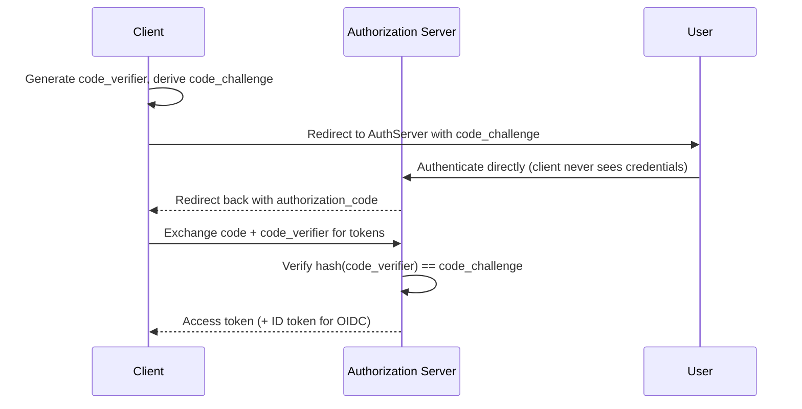

# OAuth2, OIDC, and JWT

> **Topic register:** T-512 (OAuth2/OIDC flows, IWI 7.15) / T-513 (JWT design, validation, revocation, IWI 7.00) · Advanced tier · High interview frequency [H]
> **Provenance:** the JWT sign/verify/tamper/expiry behavior in this chapter is real, executed HMAC-SHA256 cryptography via `javax.crypto` — genuine signature bytes, genuine mismatch detection. Reproducible source: [`practice/java/week-07/security/src/JwtDemo.java`](../../practice/java/week-07/security/src/JwtDemo.java). The OAuth2/OIDC flow description is conceptual: a faithful multi-party demo (authorization server, resource server, client, real redirect flow) was out of scope for this project's practice budget, stated explicitly here rather than presented as executed.

## Table of Contents

1. [Learning Objectives](#learning-objectives)
2. [Why This Matters in Interviews](#why-this-matters-in-interviews)
3. [Mental Model](#mental-model)
4. [Definition and Purpose](#definition-and-purpose)
5. [Core Concepts](#core-concepts)
6. [Internal Implementation](#internal-implementation)
7. [Diagrams](#diagrams)
8. [Production Scenarios](#production-scenarios)
9. [Failure Modes and Debugging](#failure-modes-and-debugging)
10. [Trade-offs](#trade-offs)
11. [Decision Framework](#decision-framework)
12. [Comparisons](#comparisons)
13. [Common Mistakes](#common-mistakes)
14. [Anti-Patterns](#anti-patterns)
15. [Best Practices](#best-practices)
16. [Interview Answer Framework](#interview-answer-framework)
17. [Interview Questions](#interview-questions)
18. [Summary](#summary)
19. [Key Takeaways](#key-takeaways)
20. [Cheat Sheet](#cheat-sheet)
21. [Flashcards](#flashcards)
22. [Practice Exercises](#practice-exercises)
23. [Solutions](#solutions)
24. [Additional Reading](#additional-reading)
25. [Official References](#official-references)

---

## Learning Objectives

By the end of this chapter you can:

- Distinguish OAuth2 (authorization) from OIDC (identity) precisely, and explain why they're frequently conflated.
- Walk the Authorization Code + PKCE flow and explain what PKCE protects that a client secret does not.
- State, with evidence, why a JWT's signature verification is a pure computation and cannot detect that its claims are no longer true.
- Explain honestly why a valid, non-expired JWT cannot be revoked without reintroducing a stateful check, and name both practical mitigations.

## Why This Matters in Interviews

This topic is High-frequency for any role touching authentication, and it contains one of the sharpest "honest answer required" questions in the security domain: JWT revocation. Both overconfident answers — "JWTs can be revoked" and "JWTs are completely stateless, full stop" — are wrong in the same way this project's other discriminating questions are wrong: the honest, scoped answer requires understanding the actual mechanism (pure cryptographic verification, no lookup) well enough to state precisely what it can and cannot do.

## Mental Model

**A JWT's signature proves the bytes haven't changed since signing — it proves nothing about whether the world has changed since then.** Verification is a pure function of the token's own content and the verifier's key; it never asks anything else a question. This single fact explains every property in this chapter: tamper detection works because any byte change breaks the signature match; expiry checking works because the expiry claim is part of the signed bytes; and revocation *doesn't* work, because there is no external state the verification step ever consults — "has this user been deleted" is a question about the world, and the token's bytes cannot know the answer.

## Definition and Purpose

**OAuth2** is an authorization framework — it answers "what is this client allowed to do on behalf of a user," producing an access token scoped to specific permissions, without the client ever seeing the user's actual credentials. **OIDC (OpenID Connect)** is an identity layer built on top of OAuth2 — it answers the separate question "who is this user," via an additional ID token (itself a JWT) carrying identity claims. **JWT (JSON Web Token)** is the token format both frequently use: three base64url-encoded segments — header, payload, signature — whose signature is a pure cryptographic computation over the header and payload. These exist together because delegated authorization (letting a client act on a user's behalf without seeing their password), portable identity claims, and a compact, self-verifying token format are three related but distinct problems that modern authentication systems need to solve simultaneously.

## Core Concepts

### OAuth2 vs. OIDC — the precise distinction

OAuth2 answers authorization: what can this client do. OIDC answers identity: who is this user, via an ID token. The two are frequently conflated because OIDC is built as a layer on top of OAuth2 and uses the same flows, but they answer genuinely different questions.

### Authorization Code + PKCE

The modern default grant for any client that can't securely hold a secret (a mobile app, a single-page app), and increasingly the default even for server-side clients that can. PKCE (Proof Key for Code Exchange) protects the authorization code specifically from interception in transit — a different attack surface than a client secret protects (the token-exchange endpoint itself).

### JWT verification is a pure computation

Recompute the signature over the header and payload using the shared secret (or public key, for asymmetric algorithms), and compare. Verification never consults a database or any external state — it is purely a function of the token's own bytes and the verifier's key.

### Why a valid JWT cannot be revoked

A token issued for a user, even if that user's account is deleted or compromised the very next instant, still verifies as valid until it naturally expires — because verification never looks anything up. Two honest mitigations, neither free: short expiry plus refresh tokens (bounds the exposure window, doesn't make the token revocable); a server-side deny-list checked at verification time (solves revocability directly, but reintroduces the stateful lookup a JWT was chosen to avoid).

## Internal Implementation

### Authorization Code + PKCE, walked through

1. Client generates a random `code_verifier`, derives a `code_challenge` from it (a hash), and redirects the user to the authorization server with the `code_challenge`.
2. User authenticates with the authorization server directly — the client never sees the user's credentials.
3. Authorization server redirects back to the client with a short-lived `authorization_code`.
4. Client exchanges the `authorization_code` **plus the original `code_verifier`** for an access token (and, for OIDC, an ID token).
5. Authorization server verifies the `code_verifier` hashes to the `code_challenge` from step 1 before issuing the token.

**Why PKCE if you already have a client secret?** PKCE protects against a *different* attacker than a client secret does — an attacker who intercepts the authorization code (e.g., via a malicious app registered for the same redirect URI on a mobile OS) cannot exchange it for a token without also having the original `code_verifier`, which never left the legitimate client. A client secret protects the *token exchange* endpoint; PKCE protects the *authorization code* itself in transit.

### JWT mechanics, reproduced

**Real output — issue and verify:**
```
Token: <base64url-header>.<base64url-payload>.<base64url-signature>
Verification: VALID
```

**Real output — tamper with the payload, signature no longer matches:**
```
Verification: INVALID (signature mismatch -- token was tampered with)
```

**Real output — expired token, signature still valid, but rejected anyway:**
```
Verification: INVALID (expired)
```

**Real, demonstrated — a JWT cannot be revoked:**
```
Verification: VALID  <-- still VALID; nothing about deleting the user changes this token's bytes
```

**Why this matters precisely:** a JWT's integrity guarantee is *only* about the header+payload not being altered since signing — it says nothing about whether the claims inside were true when issued, or whether they're still true now.

## Diagrams



## Production Scenarios

### Scenario: a compromised access token remains valid for hours after account suspension

**Symptoms.** A user's account is suspended for fraudulent activity; despite the suspension being immediately visible in the admin dashboard, the user's existing API session continues functioning normally for several more hours before finally failing.

**Impact.** A suspended, potentially fraudulent account retains functional access well past the intended suspension point — a real security gap, not a display bug.

**Initial hypotheses.** A caching layer serving stale suspension status (checked — the suspension flag itself is read fresh on every relevant check); a bug in the suspension logic (checked — the suspension correctly updates the user record); the JWT's inherent non-revocability (correct).

**Evidence.** The access token issued before suspension has a stated 8-hour expiry, and system logs confirm every request during the gap window passed JWT signature verification successfully — verification never touched the (correctly-updated) suspended-user flag at all.

**Diagnosis.** The system's JWT verification is, as designed, a pure signature check with no external lookup — exactly this chapter's model. The 8-hour expiry, chosen for user convenience (fewer re-logins), directly determined the multi-hour window during which a suspended account's token remained fully functional, because nothing about suspension is checked during verification.

**Immediate mitigation.** Manually and forcibly terminate active sessions for the specific suspended account via an out-of-band mechanism (e.g., rotating the signing key scoped to that user, if supported, or another emergency-only mechanism).

**Permanent remediation.** Reduce access-token expiry substantially (e.g., to 15 minutes) paired with a refresh-token flow, bounding the maximum exposure window for any future suspension to a much smaller, explicitly accepted interval; for suspension specifically (a security-critical, low-frequency event), add a targeted deny-list check that only suspension-related code paths consult, rather than reintroducing a lookup on every request.

**Alternatives considered.** A full deny-list checked on every request — rejected as the default choice, since it reintroduces the stateful lookup cost the JWT format was chosen to avoid for the overwhelming majority of requests that never involve a suspension; reserved instead for the specific, rare suspension case via a narrower mechanism.

**Trade-offs.** Shorter access-token expiry increases the frequency of refresh-token exchanges — accepted, since the alternative is an unacceptably long exposure window for exactly the security-critical event (suspension) that matters most.

**Prevention.** Any system issuing long-lived JWTs for security-sensitive operations should explicitly evaluate and document the maximum acceptable exposure window for account suspension/compromise, and choose expiry (or a targeted deny-list) accordingly — not default to a long expiry purely for user convenience without that trade-off being made consciously.

**Interview lesson.** This is Interview Question 1 (§ Interview Questions) — "explain JWT revocation honestly" — arriving as a real security incident: the token behaved exactly as its stateless design specifies, and the gap was in not explicitly bounding the resulting exposure window for a security-critical event.

## Failure Modes and Debugging

| Symptom | Likely cause | Debugging step |
|---|---|---|
| A revoked/suspended user's token continues working | JWT verification is a pure computation with no revocation lookup — expected behavior, not a bug | Check the token's expiry against the suspension time; consider shorter expiry or a targeted deny-list for security-critical events |
| A mobile/SPA client's authorization code is intercepted and exchanged by an attacker | Missing PKCE — a client secret alone doesn't protect the authorization code in transit | Add PKCE to the Authorization Code flow, especially for any public client that can't hold a secret securely |
| A tampered token is unexpectedly accepted | A verification bug bypassing the signature check, or a misconfigured/missing secret/key on the verifying side | Audit the verification code path directly; confirm the demo-style tamper test fails as expected against the actual production verifier |
| Confusion between "who is this user" and "what can this client do" in code or documentation | OAuth2/OIDC conflation | Explicitly separate authorization (OAuth2) logic from identity (OIDC) claims handling in code and documentation |

## Trade-offs

| Approach | Benefit | Cost |
|---|---|---|
| OAuth2 Authorization Code + PKCE | Client never handles user credentials; protects the code-interception attack surface | More round-trips than a simpler grant type |
| JWT for session/auth state | Stateless — no server-side lookup needed to verify | Cannot be revoked before expiry without reintroducing a stateful check |
| Short JWT expiry + refresh token | Bounds the exposure window of a compromised token | More moving parts (refresh endpoint, refresh-token storage/rotation) |
| Deny-list for true revocability | Solves revocation directly | Reintroduces the stateful lookup JWT was meant to avoid |

## Decision Framework

1. **Does this flow need authorization only, or identity too?** Use plain OAuth2 for authorization-only; add OIDC's ID token when the application needs to know who the user is.
2. **Can this client securely hold a secret?** If no (mobile, SPA) or even if yes, default to Authorization Code + PKCE.
3. **What's the acceptable exposure window if a token is compromised or the account is suspended?** Choose JWT expiry accordingly — shorter for higher-security contexts.
4. **Does this system need true, immediate revocability for some subset of events** (account suspension, detected compromise)? If so, add a targeted deny-list for that specific case rather than reintroducing a lookup on every request by default.

## Comparisons

| Concept | Answers | Mechanism |
|---|---|---|
| OAuth2 | What can this client do on the user's behalf? | Access token, scoped permissions |
| OIDC | Who is this user? | ID token (a JWT) carrying identity claims, built on OAuth2 |
| Client secret | Protects the token-exchange endpoint | A shared secret between client and authorization server |
| PKCE | Protects the authorization code in transit | A verifier/challenge pair generated per-flow, no shared secret needed |

## Common Mistakes

- Conflating OAuth2 (authorization) with OIDC (authentication/identity) as the same thing.
- Claiming a JWT can be revoked without naming the stateful mechanism that would actually be required.
- Treating PKCE and a client secret as solving the same problem.

## Anti-Patterns

- **Issuing long-lived JWTs for security-critical sessions without explicitly bounding the resulting exposure window** for suspension/compromise scenarios.
- **Implementing OAuth2 without PKCE** for any public client (mobile, SPA) that cannot securely hold a secret.
- **Claiming or assuming JWT revocation is a solved, free capability** without the stateful mechanism it actually requires.
- **Conflating OAuth2 and OIDC in code or API design**, mixing authorization scopes and identity claims without a clear separation.

## Best Practices

- Use Authorization Code + PKCE as the default grant, even for confidential (secret-holding) clients.
- Keep JWT access-token expiry short, paired with a refresh-token flow, and choose the expiry deliberately based on the acceptable exposure window for compromise or suspension.
- Reserve a deny-list mechanism for specific, security-critical revocation needs rather than defaulting to it for every request.
- Explicitly separate OAuth2 authorization logic from OIDC identity-claims handling in both code and documentation.

## Interview Answer Framework

### 30-Second Answer

OAuth2 handles authorization (what a client can do); OIDC layers identity on top via an ID token. Authorization Code + PKCE is the modern default because PKCE protects the authorization code from interception, a different attack surface than a client secret protects. A JWT's signature is a pure computation — it proves the bytes weren't tampered with, but it structurally cannot be revoked before expiry without a stateful deny-list.

### 2-Minute Answer

Definition: OAuth2 answers authorization, OIDC answers identity via a JWT-based ID token, and JWTs themselves are a compact, self-verifying token format. Why it exists: delegated authorization, portable identity, and compact self-verification are related but distinct problems. How it works: Authorization Code + PKCE has the client generate a verifier/challenge pair so an intercepted authorization code alone isn't enough to obtain a token; JWT verification recomputes the signature over the token's own bytes with no external lookup. One important trade-off: JWT statelessness is exactly what makes revocation before expiry impossible without a deny-list, which reintroduces the cost statelessness was meant to avoid. Production example: a real incident where a suspended account's JWT remained fully functional for its entire 8-hour expiry window, because verification never checked suspension status — exactly the honest trade-off this chapter names.

### 10-Minute Deep Dive

Cover, in order: the OAuth2-vs-OIDC distinction and why they're conflated (mental model); the Authorization Code + PKCE flow, with the precise PKCE-vs-client-secret attack-surface distinction (internals); the measured JWT tamper and expiry detection, proving the pure-computation model directly (internals, real evidence); the measured proof that a valid JWT cannot be revoked, and the two honest mitigations (edge case + Staff framing); the stateless-vs-stateful trade-off as a recurring pattern across caching, CAP, and here (Staff-level cross-domain connection); and close with the production scenario — a suspended account's token remaining valid for its full expiry window, the exact honest trade-off arriving as a real incident.

### Whiteboard Explanation

Draw the [§ Diagrams](#diagrams) sequence: Client generates verifier/challenge → redirects to AuthServer → user authenticates → AuthServer redirects back with code → Client exchanges code + verifier → AuthServer checks hash match → issues tokens. Circle the verifier/challenge generation step and the final hash-check step, connecting them with an arrow labeled "must match" — this is what makes PKCE's protection mechanism concrete rather than a named acronym.

### Production Example

The suspended-account incident in [§ Production Scenarios](#production-scenarios): a user's JWT remained fully functional for its entire 8-hour expiry window after account suspension, because verification is a pure signature check with no suspension lookup — resolved by shortening expiry and adding a targeted deny-list for suspension specifically.

### Trade-offs to Mention

State unprompted: PKCE and a client secret protect different attack surfaces, not the same one; JWT statelessness is what makes revocation before expiry impossible without a deny-list; shorter expiry bounds exposure but doesn't solve revocability, only a deny-list does that, at the cost of reintroducing state.

### Common Candidate Mistakes

Treating OAuth2 and OIDC as interchangeable; claiming JWTs "can be revoked" without naming the stateful mechanism required; treating PKCE and a client secret as redundant.

### Typical Follow-Up Questions

1. "If you add a deny-list, what have you actually given up?"
2. "Does a mobile app typically have a client secret at all?"
3. "How does the JWT revocation trade-off relate to CAP or caching staleness?"

### Senior-Level Expectations

Correctly states JWTs can't be revoked without extra machinery; states that PKCE protects the authorization code specifically.

### Staff-Level Discussion

The JWT revocation question is a specific instance of the stateless-vs-stateful trade-off that recurs throughout this handbook — caching's staleness tolerance, CAP's consistency-vs-availability choice, and here, statelessness vs. revocability. The Staff-level pattern-recognition signal is naming this as the *same class of trade-off* appearing in a new context, rather than treating each occurrence as an unrelated fact to memorize separately. For PKCE specifically, noting that public clients (mobile, SPA) generally *can't* hold a secret securely at all makes PKCE not just complementary but often the *only* real protection available.

## Interview Questions

### Question 1 — Explain JWT revocation honestly.

**Why interviewers ask it.** Both overconfident answers ("yes, easily" and "no, impossible, full stop") are wrong; the honest, scoped answer is the actual signal.

**Expected answer.** You cannot revoke a valid, non-expired JWT without a stateful check (deny-list), which undermines the statelessness that motivated using a JWT in the first place; the practical mitigations are short expiry + refresh tokens, or accepting the deny-list cost.

**Minimum acceptable answer.** States that JWTs can't be simply revoked, even without naming both mitigations.

**Strong Senior answer.** Correctly states JWTs can't be revoked without extra machinery.

**Staff-level extension.** Names both mitigations and is explicit that a deny-list reintroduces the exact cost (a stateful lookup) the token format was chosen to avoid.

**Common mistakes.** Claiming JWTs "can be revoked" without naming the stateful mechanism required, implying revocation is free.

**Likely follow-ups.** "If you add a deny-list, what have you actually given up?"

**Evaluation criteria (1–5).** 1: "JWTs can just be revoked." 3: correctly states they can't without extra machinery. 5: correct statement plus both mitigations plus the explicit stateless-cost trade-off.

**Related references.** [§ Internal Implementation](#internal-implementation); [§ Production Scenarios](#production-scenarios).

---

### Question 2 — Why PKCE if you already have a client secret?

**Why interviewers ask it.** Tests whether the candidate understands PKCE and a client secret as protecting genuinely different attack surfaces, not redundant mechanisms.

**Expected answer.** They protect against different attack surfaces — code interception vs. token-exchange impersonation.

**Minimum acceptable answer.** States that PKCE adds some additional protection, even without naming the specific attack surface.

**Strong Senior answer.** States that PKCE protects the authorization code specifically.

**Staff-level extension.** Notes that public clients (mobile, SPA) generally *can't* hold a secret securely at all, making PKCE not just complementary but often the *only* real protection available.

**Common mistakes.** Treating PKCE and a client secret as redundant.

**Likely follow-ups.** "Does a mobile app typically have a client secret at all?"

**Evaluation criteria (1–5).** 1: "PKCE and the secret do the same thing." 3: correctly names the code-interception protection. 5: correct distinction plus the public-client-can't-hold-a-secret point.

**Related references.** [§ Internal Implementation](#internal-implementation), Authorization Code + PKCE.

## Summary

OAuth2 answers authorization, OIDC layers identity on top via an ID token. Authorization Code + PKCE is the modern default specifically because PKCE protects the authorization code in transit, a different attack surface than a client secret protects. A JWT's verification is a pure computation over its own bytes — real, demonstrated tamper detection and expiry checking — which means it structurally cannot be revoked before expiry without a stateful deny-list that undoes the point of using a stateless token in the first place.

## Key Takeaways

- OAuth2 = authorization; OIDC = identity, built on OAuth2.
- PKCE protects the authorization code from interception; a client secret protects the token-exchange endpoint — different attack surfaces.
- JWT verification is pure computation — no database lookup, confirmed by real tamper and expiry tests.
- JWT revocation before expiry requires a stateful deny-list, which reintroduces the cost statelessness was meant to avoid.

## Cheat Sheet

| Need | Reach for |
|---|---|
| Client acts on user's behalf, no credential sharing | OAuth2 access token |
| Know who the user is | OIDC ID token |
| Protect the authorization code in transit | PKCE |
| Bound exposure of a compromised token | Short expiry + refresh token |
| True, immediate revocation for a security-critical event | Targeted deny-list, not a blanket one |

## Flashcards

### Card: OAuth2 vs OIDC

**Prompt:**
OAuth2 vs. OIDC, in one line each?

**Answer:**
OAuth2 = authorization (what can this client do); OIDC = identity (who is this user), built on OAuth2 via an ID token.

**Why it matters:**
The precise distinction most frequently conflated in practice.

**Common trap:**
Treating OAuth2 and OIDC as the same thing.

**Related:**
[Definition and Purpose](#definition-and-purpose)

### Card: Why PKCE if you have a client secret

**Prompt:**
Why PKCE if you already have a client secret?

**Answer:**
They protect different attack surfaces — PKCE protects the authorization code in transit; the secret protects the token-exchange call.

**Why it matters:**
Prevents treating the two mechanisms as redundant.

**Common trap:**
Assuming a client secret alone makes PKCE unnecessary.

**Related:**
[Internal Implementation](#internal-implementation)

### Card: Can a valid JWT be revoked

**Prompt:**
Can a valid, non-expired JWT be revoked?

**Answer:**
Not without a stateful deny-list check — verification alone is a pure computation over the token's own bytes.

**Why it matters:**
The honest, scoped answer to this domain's sharpest discriminating question.

**Common trap:**
Claiming JWTs can simply be revoked with no further mechanism.

**Related:**
[Internal Implementation](#internal-implementation)

### Card: Honest JWT revocation mitigations

**Prompt:**
Two honest JWT-revocation mitigations?

**Answer:**
Short expiry + refresh tokens (bounds exposure), or a deny-list (solves it directly but reintroduces a stateful lookup).

**Why it matters:**
Neither mitigation is free — a Staff-level answer states both trade-offs explicitly.

**Common trap:**
Presenting one mitigation as if it were a complete, cost-free solution.

**Related:**
[Core Concepts](#core-concepts)

## Practice Exercises

1. Reproduce the JWT demo yourself: [`practice/java/week-07/security/src/JwtDemo.java`](../../practice/java/week-07/security/src/JwtDemo.java).
2. Extend the demo to add a simple in-memory deny-list, and demonstrate that a previously-valid token is now correctly rejected once added to it — noting exactly what statefulness this reintroduces.
3. Diagram the Authorization Code + PKCE flow for a specific real or hypothetical client, labeling exactly where the `code_verifier` and `code_challenge` are generated, sent, and checked.

## Solutions

**Exercise 1.** Expected output matches this chapter's measured traces: successful verification for an untampered token, `INVALID (signature mismatch)` for a tampered one, and `INVALID (expired)` for one past its expiry claim.

**Exercise 2.** After adding a token's identifier to an in-memory deny-list, verification should check that list before (or in addition to) the signature check, and correctly reject the token even though its signature remains valid — this reintroduces a per-request, in-memory (or, in production, distributed) lookup, which is exactly the stateful cost a pure-JWT design avoids for every other request.

**Exercise 3.** A correct diagram labels: `code_verifier` generated client-side, kept secret; `code_challenge` (a hash of the verifier) sent in the initial redirect to the authorization server; the `authorization_code` returned via redirect; the `code_verifier` sent again (this time to the token endpoint, not the authorization endpoint) alongside the code; and the authorization server's final hash-comparison check before issuing tokens.

## Additional Reading

- [Auth0 — PKCE explained](https://auth0.com/docs/get-started/authentication-and-authorization-flow/authorization-code-flow-with-pkce)

## Official References

- [RFC 6749 — The OAuth 2.0 Authorization Framework](https://www.rfc-editor.org/rfc/rfc6749)
- [RFC 7519 — JSON Web Token (JWT)](https://www.rfc-editor.org/rfc/rfc7519)
- [OpenID Connect Core 1.0](https://openid.net/specs/openid-connect-core-1_0.html)
