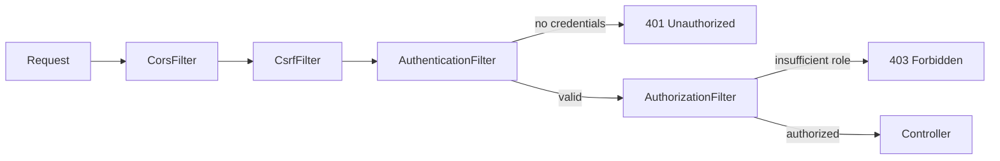

# Spring Security Filter Chain

> **Topic register:** T-511 · IWI 7.20 (top-25 tied of 198) · Advanced tier · High interview frequency [H]
> **Provenance:** the request trace in this chapter is real, executed output from a plain-Java reproduction of Spring Security's `Filter`/`FilterChain` mechanism. Reproducible source: [`practice/java/week-07/security/src/SecurityFilterChainDemo.java`](../../practice/java/week-07/security/src/SecurityFilterChainDemo.java).

## Table of Contents

1. [Learning Objectives](#learning-objectives)
2. [Why This Matters in Interviews](#why-this-matters-in-interviews)
3. [Mental Model](#mental-model)
4. [Definition and Purpose](#definition-and-purpose)
5. [Core Concepts](#core-concepts)
6. [Internal Implementation](#internal-implementation)
7. [Diagrams](#diagrams)
8. [Production Scenarios](#production-scenarios)
9. [Trade-offs](#trade-offs)
10. [Decision Framework](#decision-framework)
11. [Common Mistakes](#common-mistakes)
12. [Anti-Patterns](#anti-patterns)
13. [Best Practices](#best-practices)
14. [Interview Answer Framework](#interview-answer-framework)
15. [Interview Questions](#interview-questions)
16. [Summary](#summary)
17. [Key Takeaways](#key-takeaways)
18. [Cheat Sheet](#cheat-sheet)
19. [Flashcards](#flashcards)
20. [Practice Exercises](#practice-exercises)
21. [Additional Reading](#additional-reading)
22. [Official References](#official-references)

---

## Learning Objectives

By the end of this chapter you can:

- Trace an authenticated request through the security filter chain and name what each filter does.
- Explain precisely why a 401 and a 403 represent two distinct, sequential gates, not one combined check.
- State the general principle governing filter order (cheapest, most-decisive rejection first) and apply it to a new cross-cutting concern.

## Why This Matters in Interviews

Spring Security's filter chain is where "I added `@PreAuthorize` somewhere" gets tested against the actual request-processing mechanism. This topic is High-frequency because "trace a request through your security chain" is a standard, concrete way to test whether a candidate understands the architecture rather than just annotating endpoints, and the 401-vs-403 distinction specifically probes whether authentication and authorization are understood as two separate, sequential concerns rather than one fused check.

## Mental Model

**The filter chain is a sequence of yes/no gates, and any gate can end the request early.** Each filter either does its work and passes the request to the next filter, or short-circuits the chain entirely by returning a response directly. The order of the gates is the entire security model: a gate that needs to know *who* the request is (authorization) cannot meaningfully run before the gate that establishes *who* it is (authentication) — reversing that order would make authorization checks meaningless.

## Definition and Purpose

Spring Security intercepts every HTTP request through a chain of servlet filters — a chain-of-responsibility pipeline where each filter can inspect the request, do work, and either call the next filter or short-circuit the chain entirely (returning a response directly, e.g., a 401 or 403). This exists so that cross-cutting security concerns — CORS, CSRF, authentication, authorization — are applied uniformly, in a guaranteed order, before a request ever reaches application code, rather than requiring every endpoint to hand-roll its own checks with no guarantee of consistency.

## Core Concepts

### Filters can short-circuit the chain

Any filter can return a response directly instead of calling the next filter — this is how an unauthenticated or unauthorized request is rejected before ever reaching application code.

### Authentication and authorization are two separate, sequential gates

Authentication establishes *who* the request is; authorization decides *what* they're allowed to do. Authentication succeeding does not imply authorization succeeds — a request can pass the first gate and fail the second, which is precisely the distinction a "401 vs 403" question is probing for.

### Filter ordering follows a cost/decisiveness principle

Cheaper, more decisive rejection checks (CORS origin validation, CSRF token presence) run before more expensive ones (authentication, which may involve cryptographic verification or a database lookup), so a request that's going to be rejected anyway is rejected as cheaply as possible.

## Internal Implementation

**Real trace, valid token, non-admin path:**
```
CorsFilter: checking origin
CsrfFilter: checking CSRF token (skipped for stateless API)
AuthenticationFilter: parsing Authorization header
AuthenticationFilter: token valid, principal set to user-42
AuthorizationFilter: checking user-42 has access to /orders
CONTROLLER: request reached the actual endpoint handler
```

**Real trace, no `Authorization` header — short-circuits at authentication:**
```
CorsFilter: checking origin
CsrfFilter: checking CSRF token (skipped for stateless API)
AuthenticationFilter: parsing Authorization header
AuthenticationFilter: NO credentials -- SHORT-CIRCUITING chain, returning 401
(Notice: CONTROLLER line never appears -- the chain stopped at the auth filter.)
```

**Real trace, valid token, wrong role for `/admin` — short-circuits at authorization, a separate later gate:**
```
... AuthenticationFilter: token valid, principal set to user-42
AuthorizationFilter: checking user-42 has access to /admin
AuthorizationFilter: principal lacks required role -- SHORT-CIRCUITING, returning 403
(authenticated successfully, but never reached the controller)
```

**The Staff-level detail worth naming explicitly:** authentication succeeding does *not* imply authorization succeeds — they are two separate, sequential gates, and the third trace demonstrates a request that passes the first and fails the second.

## Diagrams



## Production Scenarios

### Scenario: an expensive authorization check placed ahead of cheap request-shape validation

**Symptoms.** A public-facing API experiences elevated average latency and increased database load during a period of scanning/probing traffic (malformed requests, invalid origins) hitting the service at high volume — traffic that should have been rejected cheaply and immediately.

**Impact.** Legitimate traffic experiences degraded latency because illegitimate traffic is consuming disproportionate processing time before being rejected.

**Initial hypotheses.** A genuine traffic spike from real users (checked — request patterns show malformed headers and disallowed origins, consistent with automated scanning); a database performance regression (checked — query latency itself is normal, just called more often); filter ordering placing an expensive check ahead of cheap ones (correct).

**Evidence.** Tracing shows the authorization filter — which performs a database-backed permission lookup — runs *before* the CORS origin check in the configured filter chain, meaning every request, including those from disallowed origins, reaches the database-backed check before being rejected.

**Diagnosis.** The filter chain was configured without applying the cost/decisiveness ordering principle: a cheap, purely-in-memory origin check was placed after an expensive, database-backed authorization check, so illegitimate traffic paid the full cost of the expensive check before being rejected by a cheap one that never got a chance to reject it first.

**Immediate mitigation.** Reorder the filter chain to place CORS and CSRF checks ahead of authentication and authorization, consistent with the standard ordering this chapter documents.

**Permanent remediation.** Add filter-chain-order verification to the security configuration's own test suite, asserting that cheap, stateless checks run before any check requiring a database or external call.

**Alternatives considered.** Adding a separate rate limiter ahead of the entire chain — a reasonable complementary defense, but not a substitute for fixing the underlying ordering mistake, since even non-malicious, legitimately-disallowed-origin requests would still pay the expensive-check cost unnecessarily.

**Trade-offs.** None significant — correct filter ordering has no real downside; it was simply misconfigured.

**Prevention.** Treat filter/interceptor ordering as an explicit, reviewed architectural decision for any new cross-cutting concern, using the same cost/decisiveness principle this chapter documents, rather than an incidental consequence of configuration order.

**Interview lesson.** This is the Staff-level discussion in this chapter — applying the same "cheapest, most-decisive check first" discipline to a new cross-cutting concern — arriving as a real, measurable performance and load incident rather than an abstract principle.

## Trade-offs

| Approach | Benefit | Cost |
|---|---|---|
| Filter-chain short-circuiting | Cheap rejection of unauthorized requests before any business logic runs | Every filter added is on the critical path of every request, even ones that will be rejected early |
| Stateless (JWT-based) authentication in the chain | No session store lookup per request | The chain cannot revoke a still-valid token (see [OAuth2, OIDC, and JWT](../security/oauth2-oidc-and-jwt.md)) |
| Method-level security (`@PreAuthorize`) instead of/in addition to filter-level | Finer-grained, closer to the specific operation | Runs later than the filter chain — a request that should have been rejected at the edge still incurs some processing cost first |

## Decision Framework

1. **Does this new cross-cutting concern belong in the filter chain, or at the method level?** Filter-level for anything that should reject a request before it reaches application code at all; method-level for fine-grained, operation-specific checks.
2. **Where in the chain should this filter run?** Order it by cost and decisiveness — cheap, stateless checks first; expensive, stateful checks later.
3. **Is this check distinguishing "who" (authentication) from "what they can do" (authorization)?** Keep these as separate, sequential gates — never combine them into one check.

## Common Mistakes

- Conflating authentication (who is this) with authorization (what are they allowed to do) as a single step.
- Assuming a successfully authenticated request is automatically authorized for every endpoint.
- Placing expensive checks (e.g., a database-backed permission lookup) earlier in the chain than cheap ones (CORS origin check), wasting work on requests that could have been rejected for free.

## Anti-Patterns

- **Combining authentication and authorization logic into a single filter or check**, losing the ability to distinguish a 401 from a 403 and making the security model harder to reason about.
- **Ordering filters by declaration convenience rather than cost/decisiveness**, wasting processing on requests that should have been rejected cheaply and immediately.
- **Assuming filter-chain authentication alone is sufficient** without considering method-level security for operation-specific authorization needs.

## Best Practices

- Order filters explicitly by cost and decisiveness: cheap, stateless rejection checks first, expensive or stateful checks later.
- Keep authentication and authorization as clearly separate, sequential concerns, both in code and in how they're explained.
- Apply the same ordering discipline to any new cross-cutting concern (rate limiting, request logging, feature-flag evaluation) added to the chain.
- Verify filter order explicitly in tests, rather than relying on configuration file ordering being correct by inspection alone.

## Interview Answer Framework

### 30-Second Answer

Spring Security intercepts every request through an ordered chain of filters; any filter can short-circuit the chain and return a response directly. Authentication (who) and authorization (what) are separate, sequential gates — a 401 means authentication failed, a 403 means it succeeded but authorization didn't.

### 2-Minute Answer

Definition: a chain-of-responsibility pipeline of servlet filters, each able to act and either pass the request along or short-circuit it. Why it exists: so cross-cutting security concerns are applied uniformly and in a guaranteed order, rather than hand-rolled per endpoint. How it works: CORS/CSRF checks run first (cheap, stateless), then authentication (establishes who), then authorization (decides what they can do) — each a distinct gate any of which can reject the request. One important trade-off: every filter is on the critical path of every request, even ones ultimately rejected. Production example: a real incident where an expensive, database-backed authorization check ran before a cheap CORS check, letting illegitimate scanning traffic consume database capacity before being rejected — fixed by reordering to cheapest-first.

### Whiteboard Explanation

Draw the [§ Diagrams](#diagrams) flowchart left to right: Request → CorsFilter → CsrfFilter → AuthenticationFilter (branching to 401) → AuthorizationFilter (branching to 403) → Controller. Narrate each box and explicitly point out the two separate branch-off points for 401 and 403 — this is the detail that makes the two-gate model concrete rather than asserted.

### Production Example

The misordered-filter incident in [§ Production Scenarios](#production-scenarios): an expensive, database-backed authorization check ran before a cheap CORS origin check, letting scanning/probing traffic consume disproportionate database capacity before being rejected — fixed by reordering the chain to cheapest-first.

### Trade-offs to Mention

State unprompted: every filter is on the critical path of every request; JWT-based stateless authentication in the chain can't revoke a still-valid token; method-level security runs later than the filter chain and incurs some processing cost first.

### Common Candidate Mistakes

Describing authentication and authorization as one combined step; not having a reasoned filter-ordering principle beyond a memorized specific list; assuming authentication success implies authorization success.

### Typical Follow-Up Questions

1. "What's the difference between what happens on a 401 versus a 403?"
2. "Would you ever put authentication before CORS handling?"
3. "Where would you place a new rate-limiting filter, and why?"

### Senior-Level Expectations

Traces the chain correctly with the two gates distinguished; gives a plausible ordering rationale for why CORS/CSRF run before authentication.

### Staff-Level Discussion

The filter chain is a concrete instance of a general architectural pattern — ordering cross-cutting concerns from cheapest/most-decisive to most expensive/most-specific — that shows up throughout distributed systems design, not just in one framework's security layer. A Staff-level engineer designing a new cross-cutting concern (rate limiting, request logging, feature-flag evaluation) reaches for the same ordering discipline: what's the cheapest check that can reject the most requests, and does it run first.

## Interview Questions

### Question 1 — Trace an authenticated request through your security filter chain.

**Why interviewers ask it.** Tests whether the candidate understands the actual request-processing mechanism, not just how to annotate an endpoint.

**Expected answer.** The traced pattern in this chapter — name the filters in order, and what each does.

**Minimum acceptable answer.** Names authentication and authorization as distinct steps, even without a precise filter-by-filter trace.

**Strong Senior answer.** Traces the chain correctly with the two gates distinguished.

**Staff-level extension.** Explains why the ORDER specifically matters — authorization is meaningless without an established principal from authentication first.

**Common mistakes.** Describing authentication and authorization as one combined step.

**Likely follow-ups.** "What's the difference between what happens on a 401 versus a 403?"

**Evaluation criteria (1–5).** 1: conflates authentication and authorization. 3: correctly traces the chain with both gates distinguished. 5: correct trace plus explicit reasoning for why the order matters.

**Related references.** [§ Internal Implementation](#internal-implementation); [§ Diagrams](#diagrams).

---

### Question 2 — Why does CORS/CSRF filtering happen before authentication in the chain?

**Why interviewers ask it.** Tests whether the candidate has a reasoned ordering principle versus a memorized specific filter list.

**Expected answer.** These are lower-level HTTP/browser-security concerns that should be resolved before spending any effort on the more expensive authentication check — rejecting a malformed or disallowed-origin request early is cheaper.

**Minimum acceptable answer.** Gives a plausible reason, even without the general cost/decisiveness framing.

**Strong Senior answer.** Gives a plausible ordering rationale.

**Staff-level extension.** Frames it as a general principle (cheapest, most-decisive rejection checks run earliest) rather than a memorized specific order.

**Common mistakes.** Not having a reasoned ordering principle, just reciting a memorized filter list.

**Likely follow-ups.** "Would you ever put authentication before CORS handling?"

**Evaluation criteria (1–5).** 1: no reasoning, just recites the list. 3: gives a plausible rationale. 5: states the general cost/decisiveness principle and applies it to a new scenario.

**Related references.** [§ Core Concepts](#core-concepts); [§ Production Scenarios](#production-scenarios).

## Summary

A security filter chain is an ordered chain-of-responsibility: each filter can act and either pass the request along or short-circuit the chain entirely. Authentication and authorization are two distinct, sequential gates — a request can pass the first and fail the second, producing a 403 rather than a 401. The real trace in this chapter demonstrates both short-circuit points explicitly, not just describes them.

## Key Takeaways

- Filters form a chain-of-responsibility; any filter can short-circuit the rest.
- Authentication (who) and authorization (what they can do) are separate, sequential gates.
- A 401 means authentication failed; a 403 means authentication succeeded but authorization didn't.
- Order cross-cutting concerns from cheapest/most-decisive to most expensive/most-specific.

## Cheat Sheet

| Situation | What it means |
|---|---|
| 401 Unauthorized | Authentication failed — no valid principal established |
| 403 Forbidden | Authentication succeeded, authorization failed — principal known but not permitted |
| A filter short-circuits early | Cheapest, most-decisive rejection checks should run first |
| New cross-cutting concern to add | Place it by cost/decisiveness, not by convenience of declaration order |

## Flashcards

### Card: 401 vs 403

**Prompt:**
What's the difference between a 401 and a 403?

**Answer:**
401 = authentication failed (who are you?); 403 = authentication succeeded but authorization failed (you're known, but not allowed).

**Why it matters:**
The precise, testable distinction between two sequential security gates.

**Common trap:**
Treating both as generic "access denied" responses with no distinction.

**Related:**
[Core Concepts](#core-concepts)

### Card: Filters can short-circuit

**Prompt:**
Can a filter chain short-circuit before reaching the controller?

**Answer:**
Yes — any filter can return a response directly instead of calling the next filter.

**Why it matters:**
The mechanism that makes cheap, early rejection possible.

**Common trap:**
Assuming every request always reaches the controller regardless of filter outcomes.

**Related:**
[Definition and Purpose](#definition-and-purpose)

### Card: Why CORS/CSRF run first

**Prompt:**
Why do CORS/CSRF checks typically run before authentication?

**Answer:**
They're cheaper, more decisive rejections — reject early before spending effort on the more expensive authentication check.

**Why it matters:**
The general cost/decisiveness ordering principle, applicable to any new cross-cutting concern.

**Common trap:**
Reciting a memorized filter order with no underlying reasoning principle.

**Related:**
[Staff-Level Discussion](#interview-answer-framework)

## Practice Exercises

1. Reproduce the trace demo yourself: [`practice/java/week-07/security/src/SecurityFilterChainDemo.java`](../../practice/java/week-07/security/src/SecurityFilterChainDemo.java).
2. Add a rate-limiting filter to the chain, placed correctly relative to the existing filters, and justify its position using the "cheapest/most-decisive first" principle.
3. Diagram what happens differently in the trace for a request with a valid token but no matching role for an admin-only endpoint versus a request with no token at all.

## Additional Reading

- [Spring Security documentation — Architecture](https://docs.spring.io/spring-security/reference/servlet/architecture.html)

## Official References

- [Jakarta Servlet specification — Filter](https://jakarta.ee/specifications/servlet/) — the underlying `Filter`/`FilterChain` interfaces this pattern is built on
