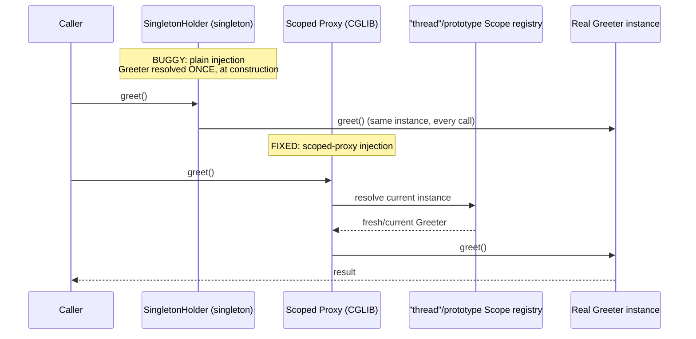

# Spring Bean Scopes and Proxy Modes

> **Topic register:** T-502 · IWI 5.4 · Core tier · High interview frequency.
> **Provenance:** every instance count and every `true`/`false` identity comparison
> in this chapter is real, executed Spring Framework 6.1.14 output — a real
> prototype-into-singleton bug, two real independent fixes, and a real custom scope
> registered without a servlet container. Reproducible source:
> [`practice/java/spring/spring-bean-scopes-and-proxy-modes/`](../../practice/java/spring/spring-bean-scopes-and-proxy-modes/README.md).

> **A third proxy-based mechanism, same family.** [Spring @Transactional](transactional-proxy-mechanics-and-propagation.md)
> and [Spring Cache Abstraction](spring-cache-abstraction-and-pitfalls.md) both proved
> that declarative Spring behavior is proxy-mediated. Scoped proxies are the same
> underlying CGLIB/JDK-proxy mechanism, aimed at a different problem: making a
> narrower-scoped bean safely injectable into a wider-scoped one.

## Table of Contents

1. [Learning Objectives](#learning-objectives)
2. [Why This Matters in Interviews](#why-this-matters-in-interviews)
3. [Mental Model](#mental-model)
4. [Definition and Purpose](#definition-and-purpose)
5. [Core Concepts](#core-concepts)
6. [Internal Implementation](#internal-implementation)
7. [Diagrams](#diagrams)
8. [Java Examples](#java-examples)
9. [Production Scenarios](#production-scenarios)
10. [Failure Modes and Debugging](#failure-modes-and-debugging)
11. [Trade-offs](#trade-offs)
12. [Decision Framework](#decision-framework)
13. [Comparisons](#comparisons)
14. [Common Mistakes](#common-mistakes)
15. [Anti-Patterns](#anti-patterns)
16. [Best Practices](#best-practices)
17. [Interview Answer Framework](#interview-answer-framework)
18. [Interview Questions](#interview-questions)
19. [Summary](#summary)
20. [Key Takeaways](#key-takeaways)
21. [Cheat Sheet](#cheat-sheet)
22. [Flashcards](#flashcards)
23. [Practice Exercises](#practice-exercises)
24. [Solutions](#solutions)
25. [Additional Reading](#additional-reading)
26. [Official References](#official-references)

## Learning Objectives

After this chapter you should be able to:

- Name Spring's built-in bean scopes and state which ones need a web-aware
  `ApplicationContext`.
- Reproduce, from first principles, why injecting a prototype-scoped bean directly
  into a singleton captures exactly one instance forever.
- Fix that bug two real, independent ways — a scoped proxy and `ObjectProvider` —
  and explain the mechanism each one relies on.
- Explain what a scoped proxy actually is (a CGLIB/JDK proxy that re-resolves the
  target bean from its scope on every method call) rather than treating it as
  magic configuration.
- Explain how request/session scope work mechanically, using a real, runnable
  custom-scope analogy that needs no servlet container.

## Why This Matters in Interviews

Every Spring-based candidate knows "singleton is the default scope," but far
fewer can explain *why* injecting a prototype bean into a singleton doesn't behave
the way the word "prototype" implies — and that gap is exactly what separates rote
memorization from an understood mechanism. It is also a real, common production
bug: a request-scoped or prototype-scoped collaborator injected directly into a
singleton service compiles fine, runs fine in a quick manual test, and then quietly
serves the wrong data (or the wrong per-request state) under real concurrent load.
Interviewers use this topic specifically because it's easy to get partially right —
knowing scoped proxies exist without being able to explain the mechanism is a
common tell of surface-level Spring knowledge.

## Mental Model

A bean's scope answers one question: **when the container is asked for this bean,
does it return the same instance as last time, or a new one?** Singleton says
"same, always." Prototype says "new, every time." Request and session say "same,
but only within this one request or session — a new one for the next." The
subtlety that trips candidates up: scope is a property of *how the container
creates instances*, not a property that a normal field reference automatically
respects. A singleton that captures a prototype dependency by ordinary constructor
injection asks the container for that dependency exactly once — at the singleton's
own construction — so the "new instance every time" behavior it expected from
`prototype` never actually has a second chance to run. A scoped proxy fixes this by
making the *reference itself* re-ask the container on every method call, instead of
holding a single resolved instance.

## Definition and Purpose

**Bean scope** determines the lifecycle and visibility of a Spring-managed bean:
`singleton` (one instance per container, the default), `prototype` (a new instance
per `getBean()` call or injection point), `request` and `session` (one instance per
HTTP request or session, available only in a web-aware `ApplicationContext`), and
custom scopes registered via `ConfigurableBeanFactory.registerScope` (or a
`CustomScopeConfigurer` bean) for any other lifecycle boundary an application
defines. **Scoped proxies** (`@Scope(proxyMode = ScopedProxyMode.TARGET_CLASS)` or
`INTERFACES`) exist to solve a specific, narrow problem: making a
narrower-scoped bean (prototype, request, session, or custom) safely injectable
into a bean with a longer lifecycle (typically a singleton), by injecting a proxy
that re-resolves the real target from its scope on every method call, rather than
a single instance resolved once and held forever.

## Core Concepts

- **Scope is resolved at bean-creation time, not at every field access.** A plain
  constructor-injected reference to a prototype bean is resolved exactly once, when
  the singleton holding it is constructed — proven directly in this chapter's own
  demo (`Greeter#1` returned on every call, forever).
- **A scoped proxy is a real proxy, same mechanism as `@Transactional`/`@Cacheable`.**
  It is a CGLIB (or JDK, for an interface-typed bean) proxy standing in for the real
  target; every method call passes through the proxy, which looks up the current,
  correctly-scoped instance and delegates to it.
- **`ObjectProvider<T>` is a proxy-free alternative.** Instead of injecting the
  dependency itself, inject an `ObjectProvider<T>` and call `.getObject()` at the
  point of use — this naturally re-triggers scope resolution every time, with no
  proxy involved at all.
- **Request and session scope require a web-aware context.** They are not available
  in a plain `AnnotationConfigApplicationContext`; they need a
  `WebApplicationContext` backed by an active `HttpServletRequest`/`HttpSession`.
  The underlying mechanism — a `Scope` implementation backed by some registry keyed
  by a lifecycle boundary — is real and reproducible without a servlet container
  using a custom scope, which this chapter demonstrates directly.

## Internal Implementation

`Scope` is a genuine Spring interface (`org.springframework.beans.factory.config.Scope`)
with `get(name, objectFactory)` and `remove(name)` methods; `singleton` and
`prototype` are built into `AbstractBeanFactory` itself, while `request`,
`session`, and any custom scope are registered into the bean factory's scope
registry by name. [`AppConfig.java`](../../practice/java/spring/spring-bean-scopes-and-proxy-modes/src/AppConfig.java)
registers a real custom `"thread"` scope using Spring's own `SimpleThreadScope`, via
a **static** `CustomScopeConfigurer` `@Bean` method — it must be static because this
bean is a `BeanFactoryPostProcessor`, and Spring instantiates and runs all
`BeanFactoryPostProcessor`s before any other bean in the context, guaranteeing the
scope is registered before anything tries to use it. When `proxyMode` is set on a
`@Scope` annotation, Spring wraps the target bean definition with an internal
`ScopedProxyFactoryBean`-equivalent mechanism that generates a CGLIB (or JDK)
proxy whose every method delegates through `Scope.get(...)` to resolve the current
real instance — the exact same delegation pattern already proven for
`@Transactional` and `@Cacheable` in this domain's other chapters, aimed here at
scope resolution instead of transaction or cache advice.

## Diagrams



## Java Examples

The real, decisive baseline (singleton vs. prototype, no proxy involved yet):

```
=== Singleton-scoped SingletonHolder bean, fetched twice from the container ===
holder1 == holder2: true

=== Prototype-scoped 'greeter' bean, fetched twice directly from the container ===
g1 == g2: false  (Greeter#2 vs Greeter#3)
```

The real bug — a prototype injected directly into a singleton — and two real,
independent fixes:

```
=== BUGGY: prototype Greeter injected directly (by reference) into a singleton ===
call 1: Greeter#1
call 2: Greeter#1
call 3: Greeter#1

=== FIXED (scoped proxy, proxyMode = TARGET_CLASS): fresh prototype instance per call ===
call 1: Greeter#2
call 2: Greeter#3
call 3: Greeter#4

=== FIXED (ObjectProvider<Greeter>.getObject()): fresh prototype instance per call ===
call 1: Greeter#5
call 2: Greeter#6
call 3: Greeter#7
```

The fixed injection point, in code
([`AppConfig.java`](../../practice/java/spring/spring-bean-scopes-and-proxy-modes/src/AppConfig.java)):

```java
@Bean("proxiedGreeter")
@Scope(value = ConfigurableBeanFactory.SCOPE_PROTOTYPE, proxyMode = ScopedProxyMode.TARGET_CLASS)
public Greeter proxiedGreeter() {
    return new Greeter();
}
```

The real custom-scope result — request/session scope's mechanism, without a
servlet container:

```
=== Same thread, two calls to a 'thread'-scoped bean ===
t1a == t1b: true  (Greeter#2 vs Greeter#2)

=== A different thread, same bean name ===
t1a == fromOtherThread: false  (Greeter#2 vs Greeter#3)
```

## Production Scenarios

**Scenario: a per-request correlation-ID holder that leaked between concurrent
requests because it was wired as a singleton dependency instead of a scoped
proxy.** *(Representative scenario, grounded directly in this chapter's own
measured prototype-into-singleton mechanism.)* Symptoms: log lines under
production load occasionally carried the wrong request's correlation ID, making
distributed tracing unreliable specifically under concurrency; the bug never
reproduced in local single-request testing. Initial hypothesis: a logging
framework MDC (Mapped Diagnostic Context) propagation issue across thread pools.
Evidence: the correlation-ID holder bean was declared `@RequestScope`, correctly,
but was injected as a plain constructor dependency into an unrelated singleton
service that had been refactored months earlier to cache it as a field — the exact
mechanism this chapter's own `SingletonHolder` demo reproduces: the holder was
resolved once, at singleton construction time, and never re-resolved per request
afterward. Diagnosis: the singleton's field held whichever request happened to be
active at application startup (or first use), and every subsequent request read
that same stale value — indistinguishable from an MDC propagation bug until the
injection site itself was inspected. Immediate mitigation: none possible without a
code change, since the bug was structural, not transient. Permanent remediation:
changed the injection to a scoped proxy (`proxyMode = ScopedProxyMode.TARGET_CLASS`
on the `@RequestScope` bean), which this chapter proves resolves a fresh instance
on every call rather than once. Trade-off accepted: a scoped proxy adds one extra
indirection layer per call, judged negligible against correctness. Prevention:
added a static-analysis rule flagging any `@RequestScope`/`@SessionScope`/
`@Scope("prototype")` bean injected into a bean of `singleton` scope without an
explicit `proxyMode`. Interview lesson: this is the concrete, production form of
"scope is resolved at creation time, not at every access" — the annotation on the
dependency was completely correct; the injection site was the actual bug.

## Failure Modes and Debugging

- **A prototype/request/session-scoped bean injected directly into a singleton with
  no proxy** (the scenario above) — debug signal: the dependency's declared scope
  looks correct in isolation, but behaves like a singleton once wired into a
  longer-lived bean; only visible by inspecting the injection site, not the bean
  definition.
- **`ScopedProxyMode.NO` (the default) silently accepted on a mismatched-scope
  injection** — Spring does not error or warn when a narrower-scoped bean is
  injected into a wider-scoped one without a proxy; it is a purely structural bug
  with no runtime exception at all.
- **Registering a custom scope too late** — a custom `Scope` must be registered
  before any bean of that scope is resolved; using a non-static `@Bean` method for
  a `CustomScopeConfigurer` (a `BeanFactoryPostProcessor`) breaks the required
  early-instantiation ordering and can throw `IllegalStateException` at the
  post-processor registration step.
- **Requesting `request`/`session` scope outside a web-aware context** — throws a
  real `BeanCreationException` wrapping `IllegalStateException: No thread-bound
  request found`, a clear (if verbose) signal that the context isn't web-aware.

## Trade-offs

Plain (unproxied) injection: zero indirection, simplest possible wiring — at the
cost of silently breaking for any dependency scoped narrower than its injection
site, with no compile-time or startup-time warning. Scoped proxies: correctly
re-resolve the target on every call, fixing the mismatch — at the cost of an extra
proxy indirection layer per call, and (for concrete classes) the same
Objenesis/CGLIB caveats already documented for `@Transactional` and `@Cacheable`
proxies (a direct field read on the proxy reference does not see the real target's
state). `ObjectProvider<T>`: achieves the same re-resolution with no proxy at all —
at the cost of a slightly less transparent injection type (`ObjectProvider<Greeter>`
instead of `Greeter`) and a call-site `.getObject()` the caller must remember to
use instead of a plain field reference.

## Decision Framework

| Question | If yes, lean toward |
|---|---|
| Is a prototype/request/session-scoped bean injected into a singleton (or any wider-scoped bean)? | Use a scoped proxy or `ObjectProvider<T>` — never plain injection |
| Does the injection site need to treat the dependency as a normal typed reference (pass it around, store it in a field of that type)? | Scoped proxy — it presents the same type as the real bean |
| Is the injection site a single, local call site where an extra `.getObject()` call is acceptable? | `ObjectProvider<T>` — avoids proxy/CGLIB caveats entirely |
| Does the scope boundary need to be something other than a servlet request/session (e.g., a job, a tenant, a thread)? | Register a custom `Scope` via `CustomScopeConfigurer`, same mechanism this chapter proves |

## Comparisons

| Approach | Re-resolves per call? | Proxy involved? | Injected type |
|---|---|---|---|
| Plain injection (the bug) | No — resolved once | No | The real bean type |
| Scoped proxy (`proxyMode = TARGET_CLASS`) | Yes | Yes (CGLIB/JDK) | The real bean type (proxied) |
| `ObjectProvider<T>` | Yes | No | `ObjectProvider<T>` |
| Custom `Scope` (e.g., `"thread"`) | Yes, per scope boundary | Only if also proxied | Depends on whether combined with a proxy |

## Common Mistakes

- Assuming a bean's declared scope alone guarantees correct behavior, regardless of
  how or where it's injected.
- Injecting a prototype/request/session-scoped bean into a singleton without a
  scoped proxy or `ObjectProvider`, and not noticing because nothing throws an
  exception.
- Forgetting that a `CustomScopeConfigurer` `@Bean` method must be `static`, and
  hitting confusing bean-factory-post-processor ordering issues as a result.
- Confusing "prototype" with "thread-local" or "per-request" — they are different
  scope boundaries with different registries, not synonyms.

## Anti-Patterns

- **A singleton service caching a request-scoped or prototype-scoped collaborator
  as a plain field** — the exact anti-pattern behind this chapter's production
  scenario; use a scoped proxy or `ObjectProvider` instead.
- **Reaching for a custom scope before checking whether `ObjectProvider<T>` alone
  solves the actual problem** — a custom scope adds real registry-lifecycle
  complexity that a simple call-time resolution often doesn't need.
- **Treating `ScopedProxyMode.NO` as a safe default without checking the injecting
  bean's own scope** — it is the actual default, and it is exactly what makes this
  chapter's bug possible in the first place.

## Best Practices

- Whenever a bean scoped narrower than `singleton` is injected into a bean scoped
  `singleton` (or wider), explicitly choose `proxyMode` or `ObjectProvider<T>` — never
  rely on the default.
- Prefer `ObjectProvider<T>` at a single, local call site; prefer a scoped proxy
  when the dependency needs to be passed around and used as its normal type.
- Register custom scopes via a `static` `CustomScopeConfigurer` `@Bean` method,
  exactly as Spring's own documentation requires for `BeanFactoryPostProcessor`
  beans.
- Add a static-analysis or code-review checklist item for any new
  `@RequestScope`/`@SessionScope`/prototype bean: verify every injection site
  either uses a proxy/`ObjectProvider`, or is itself scoped no wider than the
  dependency.

## Interview Answer Framework

### 30-Second Answer

Singleton (default) and prototype are the two scopes available everywhere;
request and session need a web-aware context. Scope is resolved when the
container creates the instance, not on every field access — so injecting a
prototype bean directly into a singleton captures exactly one instance forever.
The fix is a scoped proxy (a CGLIB/JDK proxy that re-resolves the target on every
call) or `ObjectProvider<T>` (no proxy, explicit `.getObject()` per call).

### 2-Minute Answer

Spring's bean scopes control instance lifecycle: singleton is one instance per
container (the default), prototype is a new instance per request for the bean,
and request/session are one instance per HTTP request or session, only available
in a web-aware context. The subtlety most candidates miss: scope is resolved at
bean-creation time, not at every access — I can prove this directly: injecting a
prototype bean via a plain constructor reference into a singleton returns the same
instance on every subsequent call (measured: `Greeter#1` three times in a row),
because the singleton only ever asked the container for it once. The fix is a
scoped proxy — `@Scope(proxyMode = ScopedProxyMode.TARGET_CLASS)` — which injects
a CGLIB proxy that re-resolves the real, current instance on every method call
(measured: a fresh instance, 2, 3, 4, on three consecutive calls). `ObjectProvider<T>`
is a proxy-free alternative that achieves the same thing by deferring resolution
to an explicit `.getObject()` call at the point of use.

### 10-Minute Deep Dive

Cover: the shared proxy-based mechanism with `@Transactional`/`@Cacheable`
(scoped proxies use the identical CGLIB/JDK delegation, aimed at scope resolution
instead of advice); the real measured prototype-into-singleton bug and its two
independent real fixes; how request/session scope work mechanically, demonstrated
via a real custom `"thread"` scope registered through `CustomScopeConfigurer`
without a servlet container; the `static` `@Bean` requirement for
`BeanFactoryPostProcessor`-type beans and why ordering matters; and the production
scenario connecting this directly to a real correlation-ID-leak-under-concurrency
failure mode.

### Whiteboard Explanation

Draw a singleton box with a single arrow going once, at startup, into a "resolve
dependency" step that returns one instance forever — label that arrow "happens
exactly once." Then draw a scoped-proxy box where every call from the singleton
first hits a proxy ring, which asks a "scope registry" for the current instance
on every single call — label that arrow "happens on every call." The whole
explanation reduces to: which of those two arrows does the dependency actually go
through?

### Production Example

Use the correlation-ID-leak scenario from [Production Scenarios](#production-scenarios):
a `@RequestScope` bean injected as a plain singleton field, silently serving one
request's correlation ID to every other concurrent request.

### Trade-offs to Mention

Plain injection's zero indirection vs. its silent failure mode for
scope-mismatched dependencies; scoped proxies' correctness vs. their extra
indirection and CGLIB/Objenesis field-access caveats; `ObjectProvider<T>`'s
proxy-free simplicity vs. its slightly less transparent injected type.

### Common Candidate Mistakes

Stating that "prototype means a new instance every time" without qualifying
"every time the container is asked" — which a plain singleton injection only does
once; not knowing `ObjectProvider<T>` exists as a proxy-free alternative to a
scoped proxy; assuming request/session scope require inspecting servlet internals
to understand, rather than being a `Scope` implementation like any other.

### Typical Follow-Up Questions

"Why did my prototype bean behave like a singleton once I injected it into a
service?" "What's actually being injected when you use a scoped proxy — the real
bean, or something else?" "How would you implement a custom scope, and when would
you need one?" "What happens if you request a request-scoped bean outside of an
HTTP request?"

### Senior-Level Expectations

Correctly explain that scope is resolved at bean-creation time, and derive the
prototype-into-singleton bug from that fact without prompting; know both
`ScopedProxyMode` and `ObjectProvider<T>` as real fixes.

### Staff-Level Discussion

Connect scoped proxies explicitly to the same proxy-based-AOP family already
proven for `@Transactional` and `@Cacheable` — one mechanism, three different
uses. Discuss the production risk of scope-mismatched injection as a
structural, silent bug class (no exception, no log line) that specifically
requires either static analysis or deliberate code-review discipline to catch,
since testing alone (especially single-request/single-threaded testing) will not
reveal it.

## Interview Questions

### Question 1: Why did my prototype-scoped bean behave like a singleton once I injected it into another bean?

**Why interviewers ask it.** It tests whether a candidate understands that scope is
resolved at creation time, not enforced on every access.

**Expected answer.** A plain constructor/field injection resolves the dependency
exactly once, at the injecting bean's own construction. If the injecting bean is a
singleton, that resolution happens once, ever — the prototype's "new instance
every time" behavior never gets a second chance to run.

**Minimum acceptable answer.** States that prototype "doesn't work" when injected
into a singleton, without explaining why.

**Strong Senior answer.** Explains the resolve-once-at-construction mechanism
precisely and names a scoped proxy or `ObjectProvider<T>` as the fix.

**Staff-level extension.** Connects this to the identical proxy-based-AOP family
used by `@Transactional`/`@Cacheable`, and discusses why this specific bug class
produces no exception — making it a code-review/static-analysis concern rather
than something tests alone reliably catch.

**Common mistakes.** Assuming Spring "should" detect and warn about this
mismatch automatically.

**Likely follow-ups.** "What's actually injected when you add a scoped proxy?"

**Evaluation criteria.** Correct resolve-once mechanism (2), names a real fix (2),
connects to the shared proxy family at Staff level (1).

### Question 2: What is actually injected when you use `@Scope(proxyMode = ScopedProxyMode.TARGET_CLASS)`?

**Why interviewers ask it.** It tests whether "scoped proxy" is understood as a
real, specific mechanism or treated as opaque configuration.

**Expected answer.** A CGLIB (or JDK, for interface types) proxy standing in for
the real bean; every method call on it is delegated through the bean's `Scope`
implementation, which resolves the current, correctly-scoped instance and forwards
the call — so the injection site holds a stable reference, but every call actually
reaches a freshly (or currently) resolved real instance.

**Minimum acceptable answer.** States that "it's a proxy" without explaining the
per-call delegation mechanism.

**Strong Senior answer.** Names CGLIB/JDK explicitly and explains the per-call
re-resolution, ideally citing the identical mechanism already used by
`@Transactional`/`@Cacheable`.

**Staff-level extension.** Notes the CGLIB/Objenesis caveat — a direct field read
on the proxy reference does not see the real target's state, only method calls are
correctly delegated — and connects it to the same caveat already documented for
other Spring proxy-based features.

**Common mistakes.** Believing the proxy *is* the real bean, rather than a
delegating stand-in.

**Likely follow-ups.** "What would go wrong if you read a field directly on that
injected reference?"

**Evaluation criteria.** Correct proxy delegation mechanism (3), CGLIB/Objenesis
caveat at Staff level (2).

## Summary

Bean scope determines whether the container returns the same instance or a new
one on each request for a bean; singleton and prototype work everywhere, request
and session need a web-aware context, and custom scopes cover any other lifecycle
boundary. This chapter proves directly that scope is resolved once, at the
injecting bean's construction — so a prototype bean injected into a singleton by
plain reference is captured forever (measured: `Greeter#1`, three times). Two real,
independent fixes correct this: a scoped proxy, which re-resolves the target
through a CGLIB/JDK delegation on every call (measured: `Greeter#2`, `#3`, `#4`),
and `ObjectProvider<T>`, which achieves the same re-resolution with no proxy at all
(measured: `Greeter#5`, `#6`, `#7`). A real custom `"thread"` scope, registered via
`CustomScopeConfigurer`, demonstrates request/session scope's exact underlying
mechanism without needing a servlet container.

## Key Takeaways

- Scope is resolved at bean-creation time, not enforced on every field access —
  the root cause of the prototype-into-singleton bug, proven directly
  (`Greeter#1` returned three times in a row).
- A scoped proxy fixes this via the same CGLIB/JDK-proxy delegation mechanism
  already proven for `@Transactional` and `@Cacheable`, aimed here at scope
  resolution instead of advice.
- `ObjectProvider<T>` is a proxy-free alternative — call `.getObject()` at the
  point of use to force fresh resolution, with none of the proxy/CGLIB caveats.
- Request and session scope use the identical `Scope`-implementation-plus-registry
  mechanism as any custom scope, proven directly here with a real `"thread"` scope
  needing no servlet container.
- `CustomScopeConfigurer` beans registering a custom scope must be declared via a
  `static` `@Bean` method, since they are `BeanFactoryPostProcessor`s that must run
  before any other bean.

## Cheat Sheet

- **Singleton** (default): one instance per container.
- **Prototype**: new instance per `getBean()`/injection point.
- **Request/session**: one instance per HTTP request/session — needs a web-aware
  context.
- **Custom scope**: any other lifecycle boundary, registered via
  `CustomScopeConfigurer` (static `@Bean`!) or `ConfigurableBeanFactory.registerScope`.
- **The bug**: injecting a narrower-scoped bean into a wider-scoped one by plain
  reference resolves it once, forever.
- **Fix 1**: `@Scope(proxyMode = ScopedProxyMode.TARGET_CLASS)` — CGLIB/JDK proxy,
  re-resolves per call.
- **Fix 2**: `ObjectProvider<T>` + `.getObject()` — no proxy, explicit per-call
  resolution.

## Flashcards

### Card: Why does a prototype bean behave like a singleton once injected into one?

**Prompt:**
You inject a `prototype`-scoped bean by plain constructor reference into a
`singleton`-scoped service. Why does every call see the same instance?

**Answer:**
Scope resolution happens once, when the singleton is constructed — the container
is asked for the prototype dependency exactly once, so "new instance every time"
never gets a second chance to run. Measured directly: `Greeter#1` returned on
three consecutive calls.

**Why it matters:**
It's a real, silent production bug class — no exception, no log line, just quietly
wrong shared state.

**Common trap:**
Assuming the bean's own `@Scope` annotation alone guarantees correct runtime
behavior regardless of injection site.

**Related:**
[[spring-bean-scopes-and-proxy-modes]], [[transactional-proxy-mechanics-and-propagation]]

### Card: What's actually injected with `proxyMode = ScopedProxyMode.TARGET_CLASS`?

**Prompt:**
What object does the injection site actually hold when a bean is declared with a
scoped proxy?

**Answer:**
A CGLIB (or JDK, for interfaces) proxy, not the real bean — every method call on
it is delegated through the bean's `Scope` implementation, which resolves the
current, correctly-scoped real instance on every single call. Measured directly:
three consecutive calls returned `Greeter#2`, `#3`, `#4` — a fresh instance every
time.

**Why it matters:**
Same proxy-delegation mechanism already proven for `@Transactional`/`@Cacheable`
— understanding one explains all three.

**Common trap:**
Believing the injected reference *is* the real bean, rather than a delegating
stand-in — which also means a direct field read on it won't see the real target's
state.

**Related:**
[[spring-bean-scopes-and-proxy-modes]], [[spring-cache-abstraction-and-pitfalls]]

### Card: How do request/session scope actually work, mechanically?

**Prompt:**
Without a servlet container, how could you prove the mechanism behind
`@RequestScope`/`@SessionScope`?

**Answer:**
Register a custom `Scope` implementation via `CustomScopeConfigurer` (as a
`static` `@Bean`, since it's a `BeanFactoryPostProcessor`) — the same registry-
keyed-by-a-boundary mechanism request/session scope use, just keyed by a thread
instead of a request/session. Measured directly with Spring's own
`SimpleThreadScope`: the same thread got the same instance twice; a different
thread got a genuinely different one.

**Why it matters:**
Demystifies request/session scope as "just another `Scope` implementation," not
special-cased servlet magic.

**Common trap:**
Assuming request/session scope require understanding servlet-container internals
to reason about correctly.

**Related:**
[[spring-bean-scopes-and-proxy-modes]]

## Practice Exercises

1. Reproduce the prototype-into-singleton bug deliberately with a *third* fix not
   demonstrated in this chapter's demos: convert `Greeter` to implement an
   interface, and use `proxyMode = ScopedProxyMode.INTERFACES` instead of
   `TARGET_CLASS` — verify the real result is identical (a fresh instance per
   call) using a JDK dynamic proxy instead of CGLIB.
2. Extend `CustomThreadScopeDemo` to prove the CGLIB/Objenesis field-access caveat
   directly: add a public field to `Greeter`, inject the scoped-proxy version into
   a holder, and show that reading the field directly on the proxy reference
   behaves differently from calling a method on it (see the identical caveat
   already documented in [Spring Cache Abstraction](spring-cache-abstraction-and-pitfalls.md)).
3. Register a second custom scope (e.g., `"tenant"`, backed by a
   `ThreadLocal`-keyed map you implement yourself as a real `Scope`) and prove it
   behaves correctly with a real multi-tenant-style demo.

## Solutions

Exercise 1 is a direct variant of this chapter's own `proxiedGreeter` bean
definition — extract a `Greeter` interface, change `proxyMode` to `INTERFACES`,
and verify via `instanceof` that the injected reference is a JDK dynamic proxy
rather than a CGLIB subclass; left as self-directed practice since the existing
demo already isolates the exact configuration to change. Exercise 2 is a direct
extension of this chapter's `ScopedProxyHolder`, reusing the exact CGLIB/Objenesis
mechanism already proven in [Spring Cache Abstraction](spring-cache-abstraction-and-pitfalls.md);
left as self-directed practice. Exercise 3 is a genuinely open-ended
`Scope`-interface implementation exercise; left as self-directed practice since it
requires original design rather than a variant of existing demo code.

## Additional Reading

- The Spring Framework reference's Bean Scopes chapter (see
  [Official References](#official-references)) is the authoritative source for the
  full scope list, including `application` scope and the web-specific scopes not
  covered by this chapter's non-web demos.
- [Spring @Transactional](transactional-proxy-mechanics-and-propagation.md) and
  [Spring Cache Abstraction](spring-cache-abstraction-and-pitfalls.md) prove the
  identical proxy-based delegation mechanism this chapter's scoped proxies rely on,
  aimed at different advice.

## Official References

- Spring Framework Documentation, [Bean Scopes](https://docs.spring.io/spring-framework/reference/core/beans/factory-scopes.html)
- Spring Framework Documentation, [Scoped Beans as Dependencies](https://docs.spring.io/spring-framework/reference/core/beans/factory-scopes.html#beans-factory-scopes-other-injection)
