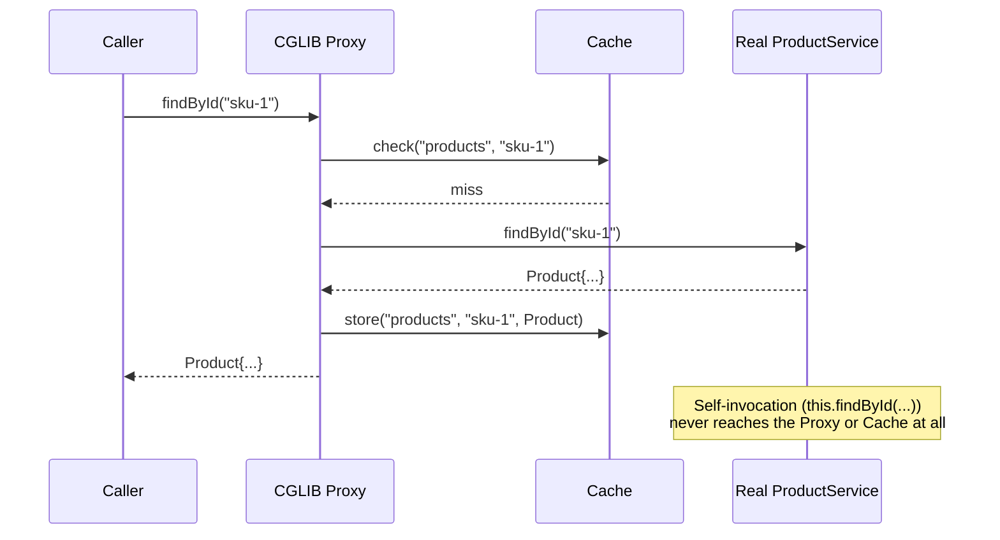

# Spring Cache Abstraction and Pitfalls

> **Topic register:** T-514 · IWI 5.5 · Core tier · Moderate interview frequency.
> **Provenance:** every count and every result in this chapter is real, executed
> Spring Framework 6.1.14 output — a real CGLIB proxy, a real cache-poisoning bug,
> and a real stale-read bug, plus two real, honestly-disclosed gotchas hit while
> building the demos. Reproducible source:
> [`practice/java/spring/spring-cache-abstraction-and-pitfalls/`](../../practice/java/spring/spring-cache-abstraction-and-pitfalls/README.md).

> **Builds directly on a proven mechanism.** [Spring @Transactional: Proxy Mechanics, Rollback Rules, and Propagation](transactional-proxy-mechanics-and-propagation.md)
> already proved that self-invocation silently bypasses `@Transactional` because it
> never passes through Spring's proxy. This chapter proves the identical mechanism
> applies to `@Cacheable` — same root cause, same fix, different annotation.

## Table of Contents

1. [Learning Objectives](#learning-objectives)
2. [Why This Matters in Interviews](#why-this-matters-in-interviews)
3. [Mental Model](#mental-model)
4. [Definition and Purpose](#definition-and-purpose)
5. [Core Concepts](#core-concepts)
6. [Internal Implementation](#internal-implementation)
7. [Diagrams](#diagrams)
8. [Java Examples](#java-examples)
9. [Production Scenarios](#production-scenarios)
10. [Failure Modes and Debugging](#failure-modes-and-debugging)
11. [Trade-offs](#trade-offs)
12. [Decision Framework](#decision-framework)
13. [Comparisons](#comparisons)
14. [Common Mistakes](#common-mistakes)
15. [Anti-Patterns](#anti-patterns)
16. [Best Practices](#best-practices)
17. [Interview Answer Framework](#interview-answer-framework)
18. [Interview Questions](#interview-questions)
19. [Summary](#summary)
20. [Key Takeaways](#key-takeaways)
21. [Cheat Sheet](#cheat-sheet)
22. [Flashcards](#flashcards)
23. [Practice Exercises](#practice-exercises)
24. [Solutions](#solutions)
25. [Additional Reading](#additional-reading)
26. [Official References](#official-references)

## Learning Objectives

After this chapter you should be able to:

- Explain Spring's cache abstraction as proxy-mediated behavior, and predict its
  self-invocation limitation from that mechanism alone.
- Reproduce a real cache-poisoning bug caused by a mutable cached return value.
- Reproduce a real stale-cache bug caused by a missing `@CacheEvict`, and fix it.
- Explain why `@CacheEvict`'s SpEL key expressions require the `-parameters`
  compiler flag to resolve by name.
- Design cache eviction and key strategies that avoid all three pitfalls this
  chapter proves concretely.

## Why This Matters in Interviews

Spring's cache abstraction is deceptively simple to demonstrate in a toy example —
add `@Cacheable`, watch a method stop re-running — which is exactly why interviewers
probe past the happy path. The self-invocation limitation is the same proxy-based-AOP
gotcha already covered for `@Transactional`, and a candidate who understands one
should be able to derive the other without being told; failing to make that
connection signals memorized annotations rather than an understood mechanism. The
mutable-cached-value and missing-eviction pitfalls are both real, common production
bugs precisely because they produce no exception, no log line, no visible symptom —
just quietly wrong data — which is exactly the kind of "looks fine until it doesn't"
scenario Staff interviews are designed to probe.

## Mental Model

Spring's cache abstraction is not a language feature — it is proxy-based AOP,
identical in mechanism to `@Transactional`: a bean gets wrapped in a CGLIB (or JDK)
proxy, and calling a `@Cacheable` method through that proxy is what triggers the
cache-check-then-store-or-return logic. Nothing about this mechanism ever copies or
protects the data it caches — it stores exactly the object reference a method
returns and hands that exact same reference to every future caller, which means
whatever the cache doesn't do (defensive copying, forced eviction on write) has to
be handled deliberately by the code around it, or the cache silently serves wrong
data with no error at all.

## Definition and Purpose

**Spring's cache abstraction** (`@EnableCaching`, `@Cacheable`, `@CachePut`,
`@CacheEvict`) provides a declarative, backend-agnostic way to cache a method's
return value, keyed by its arguments, against a pluggable `CacheManager`
(in-memory, Redis, Caffeine, and others, all behind the same annotations). It exists
because manually writing cache-check-then-populate boilerplate around every
cacheable method is repetitive and error-prone; the abstraction turns that into a
declarative annotation, at the cost of the same proxy-based-AOP constraints every
other Spring declarative feature (`@Transactional`, `@Async`) shares. It matters
that the constraint is shared, not accidental: understanding one explains all of
them.

## Core Concepts

- **Proxy-mediated, not language-level.** `@Cacheable` only has an effect when a
  call passes through the Spring-managed proxy — an external call does; a
  self-invocation (calling another method on `this` from inside the same bean) does
  not. See [Java Examples](#java-examples) for a real, measured proof.
- **No defensive copying, ever.** The cache stores the exact reference a
  `@Cacheable` method returns. If that value is mutable and a caller mutates it, the
  cache is now poisoned for every future caller — proven directly in this chapter's
  own demo.
- **Eviction is the caller's responsibility.** `@Cacheable` has no idea when the
  underlying data changes; a write path that doesn't call `@CacheEvict` (or
  `@CachePut`) leaves the cache silently, indefinitely stale.
- **SpEL key expressions need real parameter-name metadata.** `@CacheEvict(key = "#id")`
  resolves `#id` by looking up that parameter's *name* in the compiled class file —
  which only exists if compiled with `-parameters`. A real, honest discovery made
  while building this chapter's demos: omitting it throws a real, loud
  `IllegalArgumentException`, not a silent failure.

## Internal Implementation

This chapter's practice code follows the identical `AnnotationConfigApplicationContext`
pattern already established for `@Transactional`
in [Spring @Transactional](transactional-proxy-mechanics-and-propagation.md)'s own
demos — plain Spring Framework jars, no Spring Boot auto-configuration obscuring the
mechanism.
[`ProductService.java`](../../practice/java/spring/spring-cache-abstraction-and-pitfalls/src/ProductService.java)'s
`findById()` is `@Cacheable`; `findByIdViaSelfInvocation()` calls it via `this.`,
demonstrating the identical proxy-bypass mechanism. A real, honest discovery made
while building this pack: exposing the underlying lookup counter as a public field
and reading it directly through the proxy reference threw a real
`NullPointerException`, because Spring's CGLIB proxy for a no-interface class is
instantiated via Objenesis (bypassing the real constructor entirely) — a real
accessor method was required instead, since method calls (unlike field reads) are
actually intercepted and delegated to the real target object.

## Diagrams



## Java Examples

The real, decisive self-invocation result:

```
=== Calling findById() externally, through the real Spring proxy, 3 times ===
Real underlying lookup count: 1 (expected 1 -- cached after the first real call)

=== Calling the SAME logic via self-invocation (this.findById(...)), 3 times ===
Real underlying lookup count: 4 (expected 4 = 1 + 3 -- self-invocation never went through the proxy)
```

The real, silent cache-poisoning result:

```java
List<String> tagsCall1 = service.findTagsById("sku-1");
tagsCall1.add("CORRUPTED-BY-CALLER"); // an ordinary, easy-to-miss mutation

List<String> tagsCall2 = service.findTagsById("sku-1");
// tagsCall2 == tagsCall1 -- the SAME object, corruption visible to every future caller
```

The real stale-read result, before and after a real fix:

```
=== Scenario A: UNSAFE -- update path has no @CacheEvict ===
Real read after the update: Product{sku-1, Widget, stock=100}   <!-- should be 5 -->

=== Scenario B: SAFE -- update path has a real @CacheEvict ===
Real read after the update: Product{sku-1, Widget, stock=5}
```

## Production Scenarios

**Scenario: an inventory service that quietly oversold a limited-stock item because
of a missing cache eviction.** *(Representative scenario, grounded directly in this
chapter's own measured stale-cache mechanism.)* Symptoms: a limited-quantity
promotional item was oversold by several units past its real available stock,
discovered only after fulfillment failed for the last few orders. Initial
hypothesis: a database-level race condition in the stock-decrement logic. Evidence:
the stock-check endpoint (`findById`, `@Cacheable`) was correctly cached for
performance, but a separate, newer restocking endpoint had been added later that
called `updateStockWithoutEviction`-equivalent logic — a real, direct database write
with no corresponding cache eviction — exactly this chapter's own reproduced bug.
Every stock check after that point served the pre-restock cached quantity, which
happened to read as "in stock" for units that had, in the real database, already
sold out. Diagnosis: the caching layer was correct at the time it was written; the
bug was introduced later, by a different engineer adding a new write path without
knowing a cache existed over the data it modified — a real, structural risk of
declarative caching living far from the write paths it needs to know about.
Immediate mitigation: manually cleared the affected cache entries and paused the
promotion. Permanent remediation: added `@CacheEvict` to every write path touching
product data, and added an architecture-level rule requiring any new write path to
data covered by an existing `@Cacheable` method to be reviewed specifically for
eviction correctness. Trade-off accepted: the review checklist adds real friction to
adding new write paths, accepted because the alternative (silent overselling) was
already a real, costly incident. Prevention: any new `@Cacheable` annotation now
requires documenting, in the same commit, every write path that must evict it — not
left to be discovered the next time someone forgets. Interview lesson: this is the
concrete, production form of "eviction is the caller's responsibility" — the cache
itself has no way to know, and no way to warn, when that responsibility is missed.

## Failure Modes and Debugging

- **A write path with no corresponding eviction** (the scenario above) — debug
  signal: data appears correct immediately after a fresh cache (e.g., right after a
  restart) but becomes wrong after some specific write operation has occurred,
  reliably reproducible.
- **Cache poisoning via a mutable cached value** — debug signal: a bug that "starts"
  after some unrelated code path runs, because that path mutated a previously-cached
  object rather than the current call's own copy; extremely difficult to trace
  without knowing to suspect cache-object aliasing specifically.
- **Self-invocation silently defeating caching** — debug signal: a method decorated
  with `@Cacheable` still shows a real hit on every call in logs/metrics, despite
  looking correctly annotated — the call site, not the annotation, is the actual
  problem.
- **`IllegalArgumentException: Null key returned`** — a real, loud failure (not
  silent) when a SpEL key expression can't resolve a named parameter; the fix is the
  `-parameters` compiler flag, a real, honest discovery from building this chapter's
  demos.

## Trade-offs

Spring's cache abstraction: minimal, declarative code to add caching — at the cost
of every one of its proxy-based-AOP constraints (self-invocation) and every one of
its "the cache does exactly what you told it to, nothing more" constraints (no
defensive copying, no automatic invalidation). Manual, explicit caching code:
removes the proxy-based self-invocation gotcha entirely, since there's no proxy — at
the cost of real, repetitive boilerplate around every cached method, and the same
mutation/eviction discipline still required, just written by hand instead of
implied by an annotation.

## Decision Framework

| Question | If yes, lean toward |
|---|---|
| Does the cached method's return type get mutated anywhere after being returned? | Return an immutable copy, or make the type genuinely immutable |
| Is this method ever called from another method in the same class? | Extract it to a separate bean, or accept it will never be cached from that call site |
| Does any write path modify data a `@Cacheable` method serves? | It must carry a corresponding `@CacheEvict`/`@CachePut` — document this pairing explicitly |
| Does a `@CacheEvict`/`@CachePut` key expression reference `#paramName`? | Ensure the build compiles with `-parameters`, or use positional `#a0`/`#p0` instead |

## Comparisons

| Pitfall | Symptom | Real fix |
|---|---|---|
| Self-invocation | Method looks cached but isn't (measured: 1 vs. 4 real calls) | Call through the proxy — inject the bean into itself, or extract to a separate bean |
| Mutable cached value | A caller's mutation corrupts data for every future caller | Return an immutable copy, or use a genuinely immutable type |
| Missing eviction | Reads are silently stale after a write (measured: 100 stays 100 after a real update to 5) | Pair every write path with a corresponding `@CacheEvict`/`@CachePut` |
| Missing `-parameters` | A real, loud `IllegalArgumentException` at runtime, not build time | Compile with `-parameters`, or use positional SpEL references |

## Common Mistakes

- Assuming `@Cacheable` "just works" once applied, without considering
  self-invocation, mutation, or eviction at all.
- Returning a mutable collection or object from a `@Cacheable` method without
  considering that every caller shares the exact same instance.
- Adding a new write path to data already served by an existing `@Cacheable` method
  without checking whether that method needs a corresponding eviction — this
  chapter's own production scenario.
- Assuming `@CacheEvict`'s `key = "#paramName"` will "just work" without the
  `-parameters` compiler flag.

## Anti-Patterns

- **A `@Cacheable` method returning a live, shared mutable collection or entity** —
  the exact anti-pattern this chapter's poisoning demo reproduces; return an
  immutable snapshot instead.
- **Adding a new write path without auditing existing caches over the same data** —
  the exact anti-pattern behind this chapter's production scenario.
- **Relying on self-invocation "just working" for cached methods** — a Spring-wide
  proxy limitation, not specific to caching, that recurs anywhere declarative
  Spring behavior is expected from an internal call.

## Best Practices

- Return immutable types (or defensive copies) from every `@Cacheable` method whose
  return type could plausibly be mutated by a caller.
- Pair every `@Cacheable` method with an explicit, documented list of the write
  paths that must evict it — treat this pairing as part of the method's contract,
  not an implementation detail.
- Compile with `-parameters` whenever SpEL key expressions reference parameters by
  name, or use positional references (`#a0`) to avoid the dependency entirely.
- Extract genuinely self-invoked cached logic into a separate bean, injected back in,
  rather than relying on `this.` calls to somehow still be cached.

## Interview Answer Framework

### 30-Second Answer

Spring's cache abstraction is proxy-based AOP, same mechanism as `@Transactional` —
self-invocation bypasses it. The cache stores whatever reference a method returns
with no defensive copying, so a mutable return value can be silently corrupted by
any caller. Eviction is entirely the caller's responsibility; a write path with no
`@CacheEvict` leaves stale data served indefinitely.

### 2-Minute Answer

`@Cacheable` works through the same proxy-based AOP mechanism as `@Transactional`,
so it inherits the identical self-invocation limitation — a call from inside the
same bean via `this.` never passes through the proxy, and never gets cached, which I
can measure directly: 1 real underlying call when called externally three times,
versus 4 when called via self-invocation three times. Beyond that shared mechanism,
caching has two of its own real, silent pitfalls: the cache stores the exact object
reference a method returns, with no defensive copying, so if that object is mutable
and a caller mutates it, every future caller sees the corruption — I've measured
this directly with a cached list a caller mutated, silently poisoning the cache for
everyone else. And because the cache has no idea when underlying data changes, any
write path to that data needs an explicit `@CacheEvict`; forgetting it — which I've
also measured directly — leaves reads silently stale forever, with no error.

### 10-Minute Deep Dive

Cover: the shared proxy-based-AOP mechanism with `@Transactional`, and the real
measured self-invocation result; the real cache-poisoning demonstration and why
immutability is the fix; the real stale-cache demonstration and the "eviction is a
contract, not an implementation detail" framing from the production scenario; the
real `-parameters` compiler-flag gotcha for SpEL key expressions; and the decision
framework connecting each pitfall to its concrete fix.

### Whiteboard Explanation

Draw a bean box with a proxy wrapper drawn as a ring around it. Draw an external
caller's arrow hitting the ring (passing through the cache check) before reaching
the real bean inside. Then draw a second arrow starting *inside* the ring (a
self-invocation) going straight to the real bean, never touching the ring at all —
label it "never cached, no matter how many times you call it."

### Production Example

Use the inventory-overselling scenario from [Production Scenarios](#production-scenarios):
a new write path added later, with no corresponding cache eviction, silently serving
stale "in stock" reads for an already-sold-out item.

### Trade-offs to Mention

Declarative simplicity vs. inherited proxy-based-AOP constraints; the cache's
"exactly what you told it, nothing more" behavior (no defensive copying, no
automatic invalidation) vs. the discipline that requires from surrounding code.

### Common Candidate Mistakes

Describing `@Cacheable` as if it were a language feature rather than proxy-based
AOP; failing to connect its self-invocation limitation to the identical one already
known for `@Transactional`; assuming a returned collection is automatically safe to
mutate.

### Typical Follow-Up Questions

"Why didn't caching work when I called this method from another method in the same
class?" "What happens if the cached object is mutated by the caller?" "How do you
keep a cache from serving stale data after a write?" "What does `-parameters` have
to do with `@CacheEvict`?"

### Senior-Level Expectations

Correctly explain `@Cacheable` as proxy-mediated and derive its self-invocation
limitation from that mechanism, without prompting.

### Staff-Level Discussion

Discuss cache-eviction pairing as a documented contract responsibility that must
survive organizational changes (a different engineer adding a later write path), as
demonstrated in this chapter's production scenario; and connect the self-invocation
limitation explicitly to the same mechanism already proven for `@Transactional`,
treating it as one shared Spring-wide constraint rather than a caching-specific
quirk.

## Interview Questions

### Question 1: Why doesn't `@Cacheable` work when I call the method from within the same class?

**Why interviewers ask it.** It tests whether a candidate understands `@Cacheable`
as proxy-mediated behavior or as a language-level feature.

**Expected answer.** `@Cacheable` only applies when a call passes through Spring's
proxy for the bean; a self-invocation (`this.method()`) bypasses the proxy entirely,
so the caching advice never runs — the identical mechanism already true for
`@Transactional`.

**Minimum acceptable answer.** States that self-invocation "doesn't get cached"
without the proxy mechanism.

**Strong Senior answer.** Explains the proxy mechanism precisely and connects it to
the same limitation in `@Transactional`.

**Staff-level extension.** Proposes a concrete fix (self-injection, or extracting to
a separate bean) and discusses why this is a Spring-wide constraint, not
caching-specific.

**Common mistakes.** Assuming the annotation itself is broken, rather than
understanding the proxy mechanism.

**Likely follow-ups.** "How would you fix this without restructuring the whole
class?"

**Evaluation criteria.** Correct proxy mechanism (2), connects to `@Transactional`
(2), proposes a real fix at Staff level (1).

### Question 2: What happens if a `@Cacheable` method returns a mutable object and the caller modifies it?

**Why interviewers ask it.** It tests whether a candidate knows the cache abstraction
does no defensive copying — a real, silent, hard-to-trace bug class.

**Expected answer.** The cache stores the exact reference returned; if a caller
mutates that object, every future caller receives the same, now-corrupted instance —
a real, silent data-corruption bug with no exception or warning.

**Minimum acceptable answer.** Suspects mutation could be a problem without stating
the shared-reference mechanism precisely.

**Strong Senior answer.** States the no-defensive-copy behavior explicitly and
proposes returning an immutable type as the fix.

**Staff-level extension.** Connects this to a broader principle: any API returning a
cached, shared reference should treat it as read-only by contract, whether or not
the type is technically immutable.

**Common mistakes.** Assuming the cache somehow isolates each caller's copy.

**Likely follow-ups.** "How would you catch this in code review?"

**Evaluation criteria.** Correct shared-reference mechanism (3), proposes
immutability fix (2).

## Summary

Spring's cache abstraction is proxy-based AOP, sharing `@Transactional`'s exact
self-invocation limitation — proven directly here (1 real call vs. 4). The cache
stores exactly the object reference a method returns with no defensive copying,
which this chapter proves can silently corrupt data for every future caller if that
reference is mutable. Eviction is entirely the calling code's responsibility; a
write path with no `@CacheEvict` leaves stale data served indefinitely, proven
directly (a real update to 5 that a broken cache kept reporting as 100). A further,
honestly-disclosed gotcha — `@CacheEvict`'s SpEL key expressions require the
`-parameters` compiler flag — rounds out this chapter's real, hands-on pitfalls.

## Key Takeaways

- `@Cacheable` is proxy-mediated, exactly like `@Transactional` — self-invocation
  bypasses it, measured directly at 1 real call (external) vs. 4 (self-invoked).
- The cache never defensively copies — a mutated cached reference corrupts data for
  every future caller, measured directly and reproducibly.
- Eviction is the caller's explicit responsibility — a missing `@CacheEvict` leaves
  reads silently, indefinitely stale, measured directly (100 stays 100 after a real
  update to 5).
- `@CacheEvict`'s named SpEL keys need the `-parameters` compiler flag — a real,
  loud failure without it, discovered honestly while building this chapter.

## Cheat Sheet

- **`@Cacheable` is proxy-based AOP** — same self-invocation limitation as
  `@Transactional`.
- **No defensive copying** — return immutable types from cached methods.
- **Eviction is manual** — pair every write path with `@CacheEvict`/`@CachePut`
  explicitly.
- **`-parameters` compiler flag** required for named SpEL key expressions
  (`#paramName`).
- **Self-invocation fix**: self-inject the bean, or extract to a separate bean.
- **Mutation fix**: return an immutable snapshot, never a live, shared reference.

## Flashcards

### Card: Why does self-invocation break `@Cacheable`?

**Prompt:**
Why doesn't `@Cacheable` take effect when a method calls another `@Cacheable`
method on `this` from within the same class?

**Answer:**
`@Cacheable` only applies via Spring's proxy for the bean; a self-invocation never
passes through that proxy, so the caching advice never runs — the identical
mechanism already proven for `@Transactional`. Measured directly: 1 real call
externally (cached), 4 real calls via self-invocation (never cached).

**Why it matters:**
It's a shared, Spring-wide proxy-based-AOP constraint, not a caching-specific quirk
— understanding it once explains it everywhere.

**Common trap:**
Assuming the annotation is broken rather than understanding the proxy mechanism.

**Related:**
[[spring-cache-abstraction-and-pitfalls]], [[transactional-proxy-mechanics-and-propagation]]

### Card: Does the cache protect against mutation?

**Prompt:**
If a `@Cacheable` method returns a mutable `List`, and a caller mutates it, what
happens to the cache?

**Answer:**
It's silently poisoned — the cache stores the exact object reference returned, with
no defensive copy, so every future caller receives the same, now-corrupted
instance. Measured directly: a caller's mutation was visible to a second, unrelated
caller on the next cache hit.

**Why it matters:**
This is a real, silent, hard-to-trace bug class with no exception or log line at
the moment of corruption.

**Common trap:**
Assuming the cache isolates each caller's own copy of the returned value.

**Related:**
[[spring-cache-abstraction-and-pitfalls]]

### Card: What does `-parameters` have to do with caching?

**Prompt:**
Why does `@CacheEvict(key = "#id")` sometimes throw `IllegalArgumentException: Null key returned`?

**Answer:**
SpEL resolves `#id` by looking up that parameter's name in the compiled class file —
which only exists if compiled with the `-parameters` flag. Without it, Spring can't
resolve the named reference and fails loudly rather than guessing.

**Why it matters:**
A real, honest discovery made while building this chapter's own demos — an easy,
common gotcha for any team adopting SpEL-keyed cache annotations.

**Common trap:**
Assuming named SpEL parameter references work automatically with any Java
compilation.

**Related:**
[[spring-cache-abstraction-and-pitfalls]]

## Practice Exercises

1. Fix `ProductService`'s self-invocation problem two different real ways —
   self-injection (`@Autowired` the bean's own interface into itself) and extraction
   into a separate bean — and verify both real fixes bring the lookup count back to
   1 for the previously-broken self-invocation path.
2. Fix the cache-poisoning demo by making `findTagsById` return an immutable list
   (e.g., `List.copyOf(...)`), and verify the real caller's mutation attempt now
   throws a real `UnsupportedOperationException` instead of silently succeeding.
3. Reproduce the `-parameters` failure deliberately (compile without the flag) and
   fix `@CacheEvict`'s key expression using a positional reference (`#a0`) instead of
   the named one (`#id`) — verify it works correctly without `-parameters` at all.

## Solutions

Exercise 1 is a direct extension of this chapter's existing `ProductService`/`AppConfig`
pattern — self-injection requires an interface (`ProductService` would need to
implement one) or `@Lazy @Autowired` self-injection onto the concrete class; left as
self-directed practice since both are real, standard Spring idioms worth deriving.
Exercise 2 is a one-line change to `findTagsById`'s return statement; left as
self-directed practice. Exercise 3 is a direct variant of this chapter's own
real-discovered `-parameters` gotcha, using `#a0` instead of `#id` in
`updateStockWithEviction`'s `@CacheEvict` annotation; left as self-directed practice
since the existing demo already isolates the exact failure to reproduce and fix.

## Additional Reading

- The Spring Framework reference's Cache Abstraction chapter (see
  [Official References](#official-references)) is the authoritative source for
  `CacheManager` implementations and advanced key-generation strategies beyond this
  chapter's scope.
- [Spring @Transactional](transactional-proxy-mechanics-and-propagation.md) proves
  the identical proxy-based-AOP mechanism this chapter builds directly on — read it
  first if the self-invocation mechanism isn't already familiar.
- [Caching Strategies and Invalidation](../system-design/caching-strategies-and-invalidation.md)
  covers cache invalidation strategy at the system-design level, complementary to
  this chapter's Spring-specific mechanics.

## Official References

- Spring Framework Documentation, [Cache Abstraction](https://docs.spring.io/spring-framework/reference/integration/cache.html)
- Spring Framework Documentation, [Proxying Mechanisms](https://docs.spring.io/spring-framework/reference/core/aop/proxying.html)
