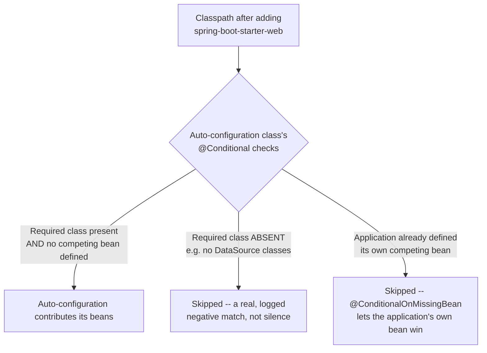
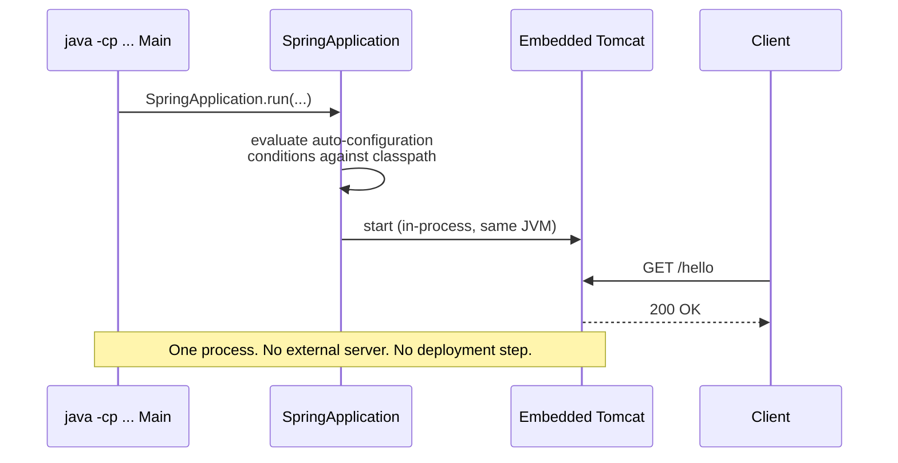

# Spring Framework vs. Spring Boot: Auto-Configuration and the Embedded Server

> **Topic register:** T-506 (Spring Boot auto-configuration internals, IWI 7.05) / T-501 (IoC container & bean lifecycle, IWI 6.05) · Core tier, Very High interview frequency
> **Scope note:** [Spring Auto-Configuration and Bean Lifecycle](auto-configuration-and-bean-lifecycle.md) already covers the bean-lifecycle mechanics and the `@Async`+`@Transactional` gotcha in real depth — this chapter deliberately doesn't re-derive that content. It covers what that chapter doesn't: the actual conceptual boundary between Spring Framework and Spring Boot, what a "starter" mechanically is, and — its central, measured result — exactly how Spring Boot decides which auto-configuration classes apply to a given application, using the real, unedited conditions-evaluation report Spring Boot itself produces.
> **Provenance:** every trace in this chapter is real, executed output from [`practice/java/spring-vs-spring-boot/embedded-server-and-autoconfig/src/`](../../practice/java/spring-vs-spring-boot/embedded-server-and-autoconfig/src/) — a genuine Spring Boot 3.5.16 application (Spring Framework 6.2.19, embedded Tomcat 10.1.55), run with `java -cp`, no Maven or Gradle build step.

## Table of Contents

1. [Learning Objectives](#learning-objectives)
2. [Why This Matters in Interviews](#why-this-matters-in-interviews)
3. [Mental Model](#mental-model)
4. [Definition and Purpose](#definition-and-purpose)
5. [Core Concepts](#core-concepts)
6. [Internal Implementation](#internal-implementation)
7. [Diagrams](#diagrams)
8. [Java Examples](#java-examples)
9. [Production Scenarios](#production-scenarios)
10. [Trade-offs](#trade-offs)
11. [Decision Framework](#decision-framework)
12. [Comparisons](#comparisons)
13. [Common Mistakes](#common-mistakes)
14. [Anti-Patterns](#anti-patterns)
15. [Best Practices](#best-practices)
16. [Interview Answer Framework](#interview-answer-framework)
17. [Interview Questions](#interview-questions)
18. [Summary](#summary)
19. [Key Takeaways](#key-takeaways)
20. [Cheat Sheet](#cheat-sheet)
21. [Flashcards](#flashcards)
22. [Practice Exercises](#practice-exercises)
23. [Solutions](#solutions)
24. [Additional Reading](#additional-reading)
25. [Official References](#official-references)

---

## Learning Objectives

By the end of this chapter you can:

- State the precise boundary between Spring Framework and Spring Boot: what each one actually is, and why "Spring Boot" is not a separate framework competing with Spring.
- Explain, precisely, what a "starter" dependency mechanically bundles, and why adding one dependency changes an application's runtime behavior, not just its classpath.
- Reproduce, with real output, an embedded-Tomcat Spring Boot application serving a genuine HTTP request from a single `java -cp` command — no external application server, no WAR deployment.
- Read Spring Boot's real conditions-evaluation report and explain, for a specific auto-configuration class, precisely why it did or didn't apply.

## Why This Matters in Interviews

"What's the difference between Spring and Spring Boot?" sounds like a warm-up question, and it's often asked as one — but the shallow answer ("Boot makes Spring easier") is exactly the kind of answer that invites a sharper follow-up: *how*, specifically? A candidate who can name the actual mechanism — starters bundling dependencies plus matching auto-configuration, and auto-configuration itself being conditional on what's actually present on the classpath and already defined by the application — demonstrates they've looked past the convenience to the mechanism producing it. This matters operationally too: debugging "why did Spring Boot configure a `DataSource` I didn't ask for" or "why didn't my custom bean's auto-configuration apply" both require understanding this same conditional mechanism, not just knowing that "Boot does things automatically."

## Mental Model

**Spring Framework is the programming model; Spring Boot is an opinionated assembler that reads your classpath and decides, condition by condition, which pieces of that programming model to wire up for you.** Nothing in Spring Boot does anything Spring Framework couldn't already do by hand — `@Configuration` classes, `@Bean` methods, `@Conditional` annotations are all plain Spring Framework mechanisms. Spring Boot's actual contribution is a very large, pre-written set of `@Configuration` classes (`hibernate-core`-style auto-configuration classes) that each ask one question — "is the class this feature needs on the classpath, and has the application not already defined its own competing bean?" — and wire themselves in only when the answer is yes to both. A "starter" is simply a dependency bundle chosen so that adding it changes the *classpath*, which is exactly the signal auto-configuration conditions are watching.

## Definition and Purpose

**Spring Framework** is the core programming model: dependency injection, AOP, the transaction abstraction, Spring MVC, and so on — a large, powerful toolkit that an application assembles and configures itself, historically via XML or, later, `@Configuration` classes written by hand. **Spring Boot** is built *on top of* Spring Framework, not beside it: it adds (1) **starters** — curated dependency bundles (e.g., `spring-boot-starter-web` pulling in Spring MVC, an embedded Tomcat, and Jackson together, versions pre-aligned to avoid compatibility conflicts), (2) **auto-configuration** — a large set of conditional `@Configuration` classes, shipped in `spring-boot-autoconfigure`, that activate automatically based on what's on the classpath and what the application has already defined itself, and (3) an **embedded servlet container** (Tomcat, by default) started *inside* the application's own JVM process, replacing the traditional model of packaging a WAR and deploying it to an externally-installed application server. These exist because assembling a production-ready Spring application by hand — choosing every bean, wiring every `DataSource`, configuring every `MessageConverter` — is repetitive, error-prone boilerplate for the overwhelming majority of applications that want a sensible, conventional default and the ability to override exactly the parts that differ.

## Core Concepts

### Spring Boot doesn't replace Spring Framework's mechanisms — it uses them

Every auto-configuration class is an ordinary `@Configuration` class using ordinary `@Bean` methods and ordinary `@Conditional` annotations (`@ConditionalOnClass`, `@ConditionalOnMissingBean`, `@ConditionalOnProperty`, and others) — the same mechanisms an application could write by hand. Spring Boot's contribution is having already written thousands of these, covering the overwhelming majority of common integrations.

### A starter is a dependency bundle, chosen specifically to change the classpath

`spring-boot-starter-web` itself contains almost no code — it's a thin dependency-aggregation POM pulling in Spring MVC, an embedded servlet container, and JSON support, at compatible versions. Adding it to a project doesn't directly configure anything; it changes what's *present on the classpath*, which is exactly the signal `@ConditionalOnClass`-based auto-configuration is watching for.

### Auto-configuration is conditional, not unconditional

Every auto-configuration class asks specific, real conditions before contributing any bean — most commonly, "is a specific class present on the classpath" (`@ConditionalOnClass`) and "has the application not already defined its own bean of this type" (`@ConditionalOnMissingBean`). This is why adding a `DataSource` bean by hand silently suppresses Spring Boot's own would-be default `DataSource` auto-configuration, without any explicit "disable auto-configuration" step — the *condition itself* is no longer true.

### The embedded server model inverts the traditional deployment relationship

Classic Java web deployment: build a WAR, install it into an externally-managed Tomcat/JBoss/WebLogic instance, which owns the server process. Spring Boot's default model: the servlet container (Tomcat, by default) is just another library dependency, started *by the application's own `main()` method*, inside the application's own JVM process — the application owns the server, not the other way around. This is what makes `java -jar app.jar` (or, as measured in this chapter, plain `java -cp`) a complete, self-contained way to run a Spring web application with no separate server installation.

## Internal Implementation

**A complete embedded Spring Boot application, measured — no external server, started by `java -cp`:**

```
== Starting a Spring Boot application -- no external Tomcat, no WAR, no app-server deployment ==

Embedded Tomcat is listening on http://localhost:50516 -- started IN this JVM process, by this same 'java' command.

== Proving it's a real, working HTTP server: a genuine HTTP client request ==
HTTP 200 -- body: "Hello from an embedded server -- no external Tomcat was ever deployed to."

Context closed. The embedded server, and the process serving it, no longer exist -- there was never anything to "undeploy from."
```

This is the entire, complete lifecycle: one JVM process starts, hosts a real embedded Tomcat instance, serves a real HTTP request over a real socket, and the process ending *is* the server shutting down — there is no separate server process anywhere to deploy to or undeploy from.

**The real conditions-evaluation report, measured (`--debug` flag) — auto-configuration classes activating (or not) based on the actual classpath:**

```
Positive matches:
-----------------

   DispatcherServletAutoConfiguration matched:
      - @ConditionalOnClass found required class 'org.springframework.web.servlet.DispatcherServlet' (OnClassCondition)
      - found 'session' scope (OnWebApplicationCondition)

   EmbeddedWebServerFactoryCustomizerAutoConfiguration.TomcatWebServerFactoryCustomizerConfiguration matched:
      - @ConditionalOnClass found required classes 'org.apache.catalina.startup.Tomcat', 'org.apache.coyote.UpgradeProtocol' (OnClassCondition)
```

```
Negative matches:
-----------------

   DataSourceAutoConfiguration:
      Did not match:
         - @ConditionalOnClass did not find required class 'org.springframework.jdbc.datasource.embedded.EmbeddedDatabaseType' (OnClassCondition)

   KafkaAutoConfiguration:
      Did not match:
         - @ConditionalOnClass did not find required class 'org.springframework.kafka.core.KafkaTemplate' (OnClassCondition)

   MongoAutoConfiguration:
      Did not match:
         - @ConditionalOnClass did not find required class 'com.mongodb.client.MongoClient' (OnClassCondition)
```

For this specific application (web classpath only, no JDBC/Kafka/Mongo dependencies added), Spring Boot's real report shows **77 positive matches and 168 negative matches** — every one of those 245 evaluated auto-configuration classes reasoned about, individually, against this application's actual classpath, with the exact reason logged. `DispatcherServletAutoConfiguration` matched because `spring-webmvc` is on the classpath; `DataSourceAutoConfiguration`, `KafkaAutoConfiguration`, and `MongoAutoConfiguration` all explicitly did *not* match, each for a stated, specific missing class — not because they were disabled, but because their own conditions genuinely evaluated false.

**A real, caught pitfall this demo's own construction hit** — running the identical application from the JVM's *default package* (no `package` declaration) produced a genuine startup crash, `NoClassDefFoundError: io/r2dbc/spi/ValidationDepth`, because `@ComponentScan` (which `@SpringBootApplication` implies) scans starting from its own class's package — and the default package means scanning the *entire* classpath, including `spring-boot-autoconfigure.jar`'s own internal classes, one of which references an optional class (R2DBC's SPI) genuinely absent from this demo's dependencies. Placing the application class in a real package (this demo uses `demo`) scopes the component scan correctly and the failure disappears — a real, well-known Spring Boot gotcha, not a hypothetical one.

## Diagrams





## Java Examples

```java
// Java 21, Spring Boot 3.5.16. A complete, runnable web application -- this
// class IS the entry point; there is no external server to deploy it to.
package demo;

import org.springframework.boot.SpringApplication;
import org.springframework.boot.autoconfigure.SpringBootApplication;

@SpringBootApplication // = @Configuration + @EnableAutoConfiguration + @ComponentScan
public class EmbeddedServerDemo {
    public static void main(String[] args) {
        SpringApplication.run(EmbeddedServerDemo.class, args);
    }
}
```

```java
// Java 21, Spring Framework 6.2.19 (via Spring Boot's starter). An ordinary
// Spring MVC controller -- nothing Boot-specific about this class itself.
package demo;

import org.springframework.web.bind.annotation.GetMapping;
import org.springframework.web.bind.annotation.RestController;

@RestController
class GreetingController {
    @GetMapping("/hello")
    String hello() {
        return "Hello from an embedded server -- no external Tomcat was ever deployed to.";
    }
}
```

**Complexity note:** auto-configuration's condition evaluation is a fixed, one-time cost at startup (evaluating on the order of hundreds of classes, milliseconds total) — the value here is correctness and convention, not runtime algorithmic cost.

## Production Scenarios

### Scenario: a test-only in-memory database silently activates in production because of an unintentional classpath leak

**Symptoms.** A service that should always use its configured production PostgreSQL database is discovered, during an incident investigation, to have briefly been serving reads from an empty in-memory H2 database after a deployment — data appeared to have vanished, then reappeared after a restart with the correct configuration reasserting itself.

**Impact.** A brief window of serving incorrect (empty) data to real users, and a confusing, hard-to-reproduce incident that initially looked like data loss.

**Initial hypotheses.** An actual database outage or data-loss event (checked — the production database's own logs show no interruption or data change); a caching layer serving stale empty results (checked — the caching layer was disabled in the affected window); an unintended auto-configuration activating a different `DataSource` (correct).

**Evidence.** The affected deployment's dependency manifest shows the H2 database jar was present on the runtime classpath — added transitively by a testing-support library that was supposed to be scoped to `test` only, but a build configuration change accidentally widened its scope to `compile`/`runtime`. With H2 now genuinely present on the classpath and no explicit `DataSource` bean overriding it in that specific deployment path, Spring Boot's `DataSourceAutoConfiguration` — exactly the condition this chapter's report measures — legitimately matched and configured an in-memory H2 `DataSource`, which then raced with (and in this case, briefly won over) the intended explicit production `DataSource` configuration during startup ordering.

**Diagnosis.** This isn't an auto-configuration bug — it's auto-configuration working exactly as designed, reacting correctly to a genuine (if accidental) classpath change. The real root cause was the dependency-scope leak that put H2 on the runtime classpath in the first place.

**Immediate mitigation.** Roll back the build configuration change that widened the testing library's dependency scope, and redeploy.

**Permanent remediation.** Add a build-time check asserting that no test-scoped-only dependencies (including transitive ones) are present on the production runtime classpath, and add an explicit `@ConditionalOnProperty`-gated or profile-gated assertion at startup that the *intended* `DataSource` bean (by name or type) is the one actually active, failing fast rather than silently accepting whichever `DataSource` auto-configuration happened to win.

**Alternatives considered.** Explicitly excluding `DataSourceAutoConfiguration` via `@SpringBootApplication(exclude = DataSourceAutoConfiguration.class)` and defining the `DataSource` entirely by hand — a more defensive posture some teams choose, but rejected here as a broad fix for a narrow, build-config-specific bug; the actual problem was the dependency scope leak, not that auto-configuration exists.

**Trade-offs.** A startup-time assertion adds a small amount of extra application code in exchange for converting "this class of bug is silent" into "this class of bug fails loudly at startup, immediately, in every environment."

**Prevention.** Treat any change to build-file dependency scopes as a review-worthy classpath change, precisely because Spring Boot's auto-configuration reacts directly and automatically to exactly that signal.

**Interview lesson.** This is [Interview Question 1](#interview-questions)'s underlying mechanism at real production scale: auto-configuration reacting correctly to an unintended classpath change, producing a real, confusing incident that traces back to understanding exactly how `@ConditionalOnClass` works.

## Trade-offs

| Aspect | Benefit | Cost |
|---|---|---|
| Starters | One dependency line pulls a coherent, version-aligned set of libraries | Less visibility into exactly which specific library versions are in play without inspecting the resolved dependency tree directly |
| Auto-configuration | Sensible, conventional defaults with almost no boilerplate for the common case | The mechanism reacts to classpath changes automatically — an unintended dependency (test-scope leak, an unused starter left in) can silently activate configuration nobody intended |
| Embedded server | `java -jar`/`java -cp` is the entire deployment story; no external server installation or configuration to keep in sync | Less separation between "the application" and "the server it runs on" — an application-level crash takes the server down with it, by design |
| `@ConditionalOnMissingBean` override | The application's own bean always wins over the auto-configured default, with no explicit disabling step | Requires understanding *why* a custom bean silently suppressed an auto-configuration, rather than an explicit, discoverable toggle |

## Decision Framework

1. **Does this dependency change need to affect runtime auto-configuration, or is it test/build-only?** Scope test-only dependencies strictly to the `test` scope — a scope leak is exactly the signal auto-configuration's classpath-based conditions react to.
2. **Want to override an auto-configured bean?** Define your own bean of the matching type — `@ConditionalOnMissingBean` will let it win, with no explicit "disable" annotation required.
3. **Debugging "why did/didn't this auto-configuration apply"?** Run with `--debug` (or `debug=true`) and read the real conditions-evaluation report directly, rather than guessing from documentation alone.
4. **Choosing between the embedded-server model and traditional WAR deployment?** Default to embedded (Boot's own default) unless a specific organizational requirement (a shared, centrally-managed application server) requires the traditional model.

## Comparisons

| Aspect | Spring Framework alone | Spring Boot on top of Spring Framework |
|---|---|---|
| Configuration | Hand-written `@Configuration`/`@Bean` classes, or XML | Hand-written configuration still fully supported, plus auto-configuration filling in sensible defaults conditionally |
| Dependency management | Each library's version chosen and aligned manually | Starters bundle coherent, pre-aligned dependency sets |
| Server model | Typically WAR, deployed to an externally-managed application server | Embedded server by default, started in-process by the application itself |
| Overriding a default | N/A — there is no default to override, you wrote it | Define your own bean; `@ConditionalOnMissingBean` yields to it automatically |

## Common Mistakes

- Describing Spring Boot as "a different framework from Spring" rather than a layer built on top of it, using its own ordinary mechanisms.
- Assuming a starter dependency directly configures something, rather than changing the classpath that auto-configuration's conditions react to.
- Assuming disabling an unwanted auto-configuration requires an explicit exclusion, when defining your own competing bean is usually sufficient (`@ConditionalOnMissingBean`).
- Placing a `@SpringBootApplication` class in the default package — a real, not hypothetical, source of a confusing startup crash from over-broad component scanning.

## Anti-Patterns

- **Leaving test-scoped dependencies leaking onto the runtime classpath**, letting an unintended auto-configuration (like this chapter's H2-in-production scenario) activate silently.
- **Reflexively excluding auto-configuration classes** instead of defining a competing bean, adding an extra layer of explicit configuration for something `@ConditionalOnMissingBean` already handles cleanly.
- **Debugging "why didn't my bean get configured" by guessing from documentation** instead of running with `--debug` and reading the real, specific reason from the conditions-evaluation report.

## Best Practices

- Keep test-only dependencies strictly `test`-scoped; treat any scope widening as a reviewable, classpath-affecting change.
- Override an unwanted auto-configured bean by defining your own of the matching type, rather than reaching for exclusion annotations first.
- Use `--debug` (or `debug=true`) directly against the real application when diagnosing an auto-configuration question, rather than relying on memory or documentation alone.
- Place `@SpringBootApplication` classes in a real, application-specific package — never the default package.

## Interview Answer Framework

### 30-Second Answer

Spring Framework is the core programming model (DI, AOP, MVC, transactions); Spring Boot is built on top of it, adding starters (curated, version-aligned dependency bundles), auto-configuration (conditional `@Configuration` classes that activate based on the classpath and what the application hasn't already defined), and an embedded server started in-process by the application itself. Nothing Boot does is a new mechanism — it's Spring Framework's own tools, pre-applied at scale, conditionally.

### 2-Minute Answer

Definition: Spring Framework is the toolkit; Spring Boot is an opinionated assembler on top of it. Why it exists: assembling a production Spring application by hand is repetitive for the common case. How it works: starters change the classpath; auto-configuration classes (ordinary `@Configuration` classes using `@ConditionalOnClass`/`@ConditionalOnMissingBean`) react to that classpath and to what the application has already defined, contributing beans only when their conditions hold; the embedded server (Tomcat, by default) is a library the application starts itself, not something to deploy to. One important trade-off: because auto-configuration reacts automatically to the classpath, an unintended dependency (a test-scope leak) can silently activate configuration nobody intended. Production example: a real incident where a leaked test dependency put H2 on a production runtime classpath, and `DataSourceAutoConfiguration` correctly, automatically configured an in-memory database — the mechanism working exactly as designed, reacting to an accidental signal.

### 10-Minute Deep Dive

Cover, in order: the mental model — Boot is an assembler reading the classpath, not a separate framework (mental model); the measured embedded-server trace, proving `java -cp` is the entire deployment story (internals, real evidence); the measured conditions-evaluation report, with real positive and negative matches and their exact stated reasons (internals, real evidence, this chapter's central result); the real default-package pitfall hit while building this chapter's own demo (a genuine gotcha, not hypothetical); the decision framework for overriding an auto-configured bean; and close with the production scenario — a leaked test dependency causing an unintended `DataSource` auto-configuration in production.

### Whiteboard Explanation

Draw the [§ Diagrams](#diagrams) flowchart: classpath feeding into a `@Conditional` decision point, branching into "applied" (class present, no competing bean) versus two distinct "skipped" branches (class absent; or application's own bean already present). Annotate: "every one of these branches is logged, individually, in the real conditions-evaluation report — nothing here is a black box."

### Production Example

The leaked-test-dependency incident in [§ Production Scenarios](#production-scenarios): a build-configuration change accidentally put H2 on a production runtime classpath, and `DataSourceAutoConfiguration` — exactly the condition this chapter measures directly — correctly, automatically activated an in-memory database, producing a real, confusing data-loss-looking incident.

### Trade-offs to Mention

State unprompted: auto-configuration is conditional, not unconditional, and every condition is individually inspectable via `--debug`; a starter changes the classpath, it doesn't directly configure anything itself; `@ConditionalOnMissingBean` means overriding a default requires no explicit "disable" step, just defining your own bean; the embedded-server model means the application and the server share one process and one lifecycle, by design.

### Common Candidate Mistakes

Describing Spring Boot as "a separate, competing framework" rather than a layer on Spring Framework; not knowing that a custom bean can silently suppress an auto-configuration with no explicit disabling step; guessing at auto-configuration behavior rather than knowing `--debug` exists and shows the real, specific reasoning.

### Typical Follow-Up Questions

1. "Your app unexpectedly configured a database connection you never asked for. What would you check?"
2. "How would you find out exactly why a specific auto-configuration class didn't apply?"
3. "What's actually different about how a Spring Boot app is deployed compared to a traditional WAR?"

### Senior-Level Expectations

Correctly explains starters as classpath-changing dependency bundles, not direct configuration; correctly explains `@ConditionalOnMissingBean` as the override mechanism; knows the embedded server runs in-process, started by the application.

### Staff-Level Discussion

The auto-configuration mechanism is a specific instance of a general Staff-level pattern this handbook returns to repeatedly: a system that reacts *correctly* to its actual observed state (here, the classpath) can still produce a *surprising* outcome when that state changes unintentionally — the mechanism isn't broken, the input changed. The same shape of reasoning applies to `@ConditionalOnMissingBean`'s bean-presence check, to a JVM's `invokevirtual` dispatch reacting to an object's actual runtime class, and to a Fenwick tree's coordinate-compressed rank reacting to the actual value set inserted. A Staff-level engineer, debugging "why did this configuration activate," starts from "what changed about the observed state" rather than "what's broken in the mechanism" — and for Spring Boot specifically, that observed state is the classpath, directly inspectable via `--debug`.

## Interview Questions

### Question 1 — Your Spring Boot app unexpectedly configured a database connection you never asked for. What would you check?

**Why interviewers ask it.** Tests whether the candidate understands auto-configuration as classpath-reactive, versus treating it as unpredictable "magic."

**Expected answer.** Check the runtime classpath for a JDBC driver or embedded-database dependency that shouldn't be there — most commonly a test-scoped dependency accidentally leaking into the runtime/compile scope — since `DataSourceAutoConfiguration` (and similar) activate specifically because their `@ConditionalOnClass` check found a relevant class present.

**Minimum acceptable answer.** Suspects a dependency-related cause, even without naming the specific conditional mechanism.

**Strong Senior answer.** Correctly identifies the classpath as the thing to inspect, and names `@ConditionalOnClass` as the mechanism.

**Staff-level extension.** Proposes running with `--debug` to get the exact, real reason from Spring Boot's own conditions-evaluation report, rather than guessing, and proposes a build-time safeguard (dependency-scope auditing) to prevent recurrence.

**Common mistakes.** Treating the unexpected configuration as a bug in Spring Boot itself, rather than a correct reaction to an unintended classpath change.

**Likely follow-ups.** "How would you find out exactly why it applied, without guessing?"

**Evaluation criteria (1–5).** 1: treats it as unexplainable "magic." 3: correctly identifies the classpath and `@ConditionalOnClass` as the mechanism. 5: correct diagnosis plus proposes `--debug` and a build-time prevention measure.

**Related references.** [§ Internal Implementation](#internal-implementation); [§ Production Scenarios](#production-scenarios).

---

### Question 2 — What's actually different about how a Spring Boot application is deployed, compared to a traditional Spring MVC WAR?

**Why interviewers ask it.** Tests whether the candidate understands the embedded-server model as an architectural inversion, not just "it's easier."

**Expected answer.** A traditional WAR is deployed *into* an externally-managed, already-running application server, which owns the server process. A Spring Boot application embeds the server (Tomcat, by default) as a library dependency, started by the application's own `main()` method — the application owns the server process, and `java -jar`/`java -cp` is the complete deployment story with no separate server installation.

**Minimum acceptable answer.** States that Spring Boot "doesn't need a separate server," even without the precise ownership-inversion framing.

**Strong Senior answer.** Correctly explains the embedded server as a library the application starts itself.

**Staff-level extension.** Names a real consequence of this inversion: an application crash takes the embedded server down with it (by design, since they share one process), which is a genuinely different operational model than a traditional app server hosting multiple independent WARs.

**Common mistakes.** Describing the difference only as "convenience" without the actual ownership-inversion mechanism.

**Likely follow-ups.** "What's a real operational consequence of the application and the server sharing one process?"

**Evaluation criteria (1–5).** 1: no real mechanism named. 3: correctly explains the embedded, application-owned server model. 5: correct explanation plus a real operational consequence of the shared-process model.

**Related references.** [§ Internal Implementation](#internal-implementation); [§ Core Concepts](#core-concepts).

## Summary

Spring Boot is not a separate framework — it's an opinionated assembler built on Spring Framework's own ordinary mechanisms (`@Configuration`, `@Bean`, `@Conditional`), adding starters (classpath-changing dependency bundles), auto-configuration (conditional beans reacting to that classpath and to what the application has already defined), and an embedded, application-owned server. This chapter measured both central mechanisms directly: a complete web application, embedded server included, served a real HTTP request from a single `java -cp` command with no external deployment step, and Spring Boot's own real conditions-evaluation report showed exactly which of 245 evaluated auto-configuration classes matched (77) and which didn't (168), each for a specific, logged, classpath-driven reason.

## Key Takeaways

- Spring Boot is built on Spring Framework's own mechanisms, not a replacement for them.
- A starter changes the classpath; it's auto-configuration's `@ConditionalOnClass` checks that react to that change, not the starter itself configuring anything directly.
- `@ConditionalOnMissingBean` means defining your own bean silently and correctly suppresses the matching auto-configured default — no explicit exclusion needed.
- The embedded server model means the application starts and owns its own server process — `java -jar`/`java -cp` is the complete deployment story.
- `--debug` shows Spring Boot's real, specific reasoning for every auto-configuration decision — use it instead of guessing.

## Cheat Sheet

| Question | Answer |
|---|---|
| Is Spring Boot a different framework from Spring? | No — built on Spring Framework's own `@Configuration`/`@Bean`/`@Conditional` mechanisms |
| What does a starter actually do? | Bundles version-aligned dependencies, changing the classpath auto-configuration reacts to |
| How do you override an auto-configured bean? | Define your own bean of the matching type — `@ConditionalOnMissingBean` yields to it |
| How do you debug why an auto-configuration did/didn't apply? | Run with `--debug` and read the real conditions-evaluation report |
| How is a Spring Boot app deployed by default? | `java -jar`/`java -cp` — an embedded server, no external app-server installation |

## Flashcards

### Card: What Spring Boot actually is

**Prompt:**
Is Spring Boot a separate framework from Spring?

**Answer:**
No — it's built on top of Spring Framework's own mechanisms (`@Configuration`, `@Bean`, `@Conditional`), adding starters, auto-configuration, and an embedded server.

**Why it matters:**
The single most common shallow-answer trap for this near-universal warm-up question.

**Common trap:**
Describing Boot as competing with or replacing Spring Framework.

**Related:**
[Definition and Purpose](#definition-and-purpose)

### Card: What a starter mechanically does

**Prompt:**
What does adding a Spring Boot starter dependency actually do?

**Answer:**
Changes the classpath by pulling in a version-aligned set of libraries — it doesn't directly configure anything itself; auto-configuration's `@ConditionalOnClass` checks react to that classpath change.

**Why it matters:**
Explains why adding one dependency line changes runtime behavior, not just what compiles.

**Common trap:**
Assuming a starter directly wires up beans, rather than changing what auto-configuration's conditions see.

**Related:**
[Internal Implementation](#internal-implementation)

### Card: How to override an auto-configured bean

**Prompt:**
How do you override a Spring Boot auto-configured bean?

**Answer:**
Define your own bean of the matching type — `@ConditionalOnMissingBean` on the auto-configuration lets your bean win automatically, with no explicit exclusion needed.

**Why it matters:**
The mechanism behind "Boot doesn't need to be disabled, just told what you want instead."

**Common trap:**
Reaching for `@SpringBootApplication(exclude = ...)` reflexively when defining a competing bean is usually simpler.

**Related:**
[Core Concepts](#core-concepts)

## Practice Exercises

1. Reproduce both measured traces: [`EmbeddedServerDemo.java`](../../practice/java/spring-vs-spring-boot/embedded-server-and-autoconfig/src/demo/EmbeddedServerDemo.java) and [`AutoConfigReportDemo.java`](../../practice/java/spring-vs-spring-boot/embedded-server-and-autoconfig/src/demo/AutoConfigReportDemo.java) (run `fetch-deps.sh` first).
2. Reproduce the default-package pitfall directly: move `EmbeddedServerDemo` and `GreetingController` out of the `demo` package (delete the `package demo;` line from both), recompile, and confirm the same `NoClassDefFoundError` this chapter's provenance describes.
3. Add a plain `@Bean` method defining your own `TomcatServletWebServerFactory` (or any bean type an existing auto-configuration also provides) and re-run with `--debug`; find that bean's corresponding auto-configuration in the report and confirm it now appears under "Negative matches" specifically because of `@ConditionalOnMissingBean`, not `@ConditionalOnClass`.

## Solutions

**Exercise 1.** Expected output matches this chapter's two measured traces: a real `HTTP 200` response from the embedded server, and a conditions-evaluation report showing 77 positive / 168 negative matches (exact counts may shift slightly across Spring Boot patch versions, but the mechanism and general proportions hold).

**Exercise 2.** Removing the `package demo;` line and recompiling into the default package reproduces `NoClassDefFoundError: io/r2dbc/spi/ValidationDepth`, confirming the failure is caused specifically by component-scanning starting from the default package (scanning the entire classpath, including framework-internal classes), not by anything else in the demo's own code.

**Exercise 3.** After defining a competing bean, the corresponding auto-configuration's entry in the report moves from "Positive matches" to "Negative matches," now citing `@ConditionalOnMissingBean` (not `@ConditionalOnClass`) as the reason it didn't match — direct, real proof that a custom bean silently and correctly suppresses only the specific default it competes with, leaving every other auto-configuration decision unaffected.

## Additional Reading

- Craig Walls, *Spring in Action* — the standard reference distinguishing Spring Framework's core model from Spring Boot's opinionated layer on top of it

## Official References

- [Spring Boot Reference Documentation — Auto-configuration](https://docs.spring.io/spring-boot/reference/using/auto-configuration.html)
- [Spring Boot Reference Documentation — Servlet Web Applications](https://docs.spring.io/spring-boot/reference/web/servlet.html)
