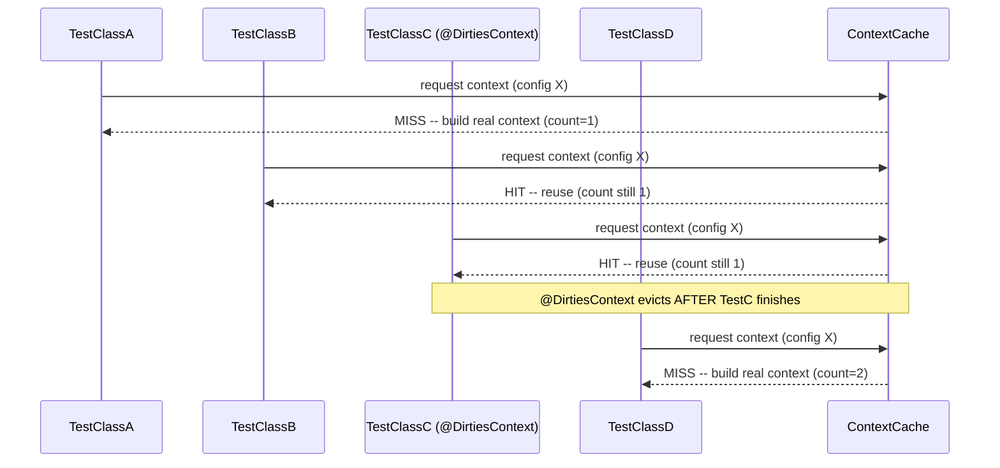

# Spring Testing: Slices and Context Caching

> **Topic register:** T-517 · IWI 5.4 · Core tier · Moderate interview frequency.
> **Provenance:** every count, every real exception, and every pass/fail result
> in this chapter is real, executed Spring Framework 6.1.14 + Spring Boot 3.3.5
> output — a real `TestContextManager`-driven context-caching proof, a real
> slice-test `NoSuchBeanDefinitionException`, and three real, honestly-disclosed
> discoveries hit while building the demos. Reproducible source:
> [`practice/java/spring/spring-testing-slices-and-context-caching/`](../../practice/java/spring/spring-testing-slices-and-context-caching/README.md).

> **A deliberate exception to this domain's plain-jar pattern.** [Spring @Transactional](transactional-proxy-mechanics-and-propagation.md),
> [Spring Cache Abstraction](spring-cache-abstraction-and-pitfalls.md), and
> [Spring Bean Scopes and Proxy Modes](spring-bean-scopes-and-proxy-modes.md) all
> deliberately avoid Spring Boot to observe pure Spring Framework mechanics.
> Slice testing (`@WebMvcTest`, `@DataJpaTest`) does not exist in plain Spring
> Framework at all — it is a Spring Boot Test feature — so this chapter's
> practice code genuinely needs Spring Boot Test, not as a pattern break but as
> a topic-driven necessity.

## Table of Contents

1. [Learning Objectives](#learning-objectives)
2. [Why This Matters in Interviews](#why-this-matters-in-interviews)
3. [Mental Model](#mental-model)
4. [Definition and Purpose](#definition-and-purpose)
5. [Core Concepts](#core-concepts)
6. [Internal Implementation](#internal-implementation)
7. [Diagrams](#diagrams)
8. [Java Examples](#java-examples)
9. [Production Scenarios](#production-scenarios)
10. [Failure Modes and Debugging](#failure-modes-and-debugging)
11. [Trade-offs](#trade-offs)
12. [Decision Framework](#decision-framework)
13. [Comparisons](#comparisons)
14. [Common Mistakes](#common-mistakes)
15. [Anti-Patterns](#anti-patterns)
16. [Best Practices](#best-practices)
17. [Interview Answer Framework](#interview-answer-framework)
18. [Interview Questions](#interview-questions)
19. [Summary](#summary)
20. [Key Takeaways](#key-takeaways)
21. [Cheat Sheet](#cheat-sheet)
22. [Flashcards](#flashcards)
23. [Practice Exercises](#practice-exercises)
24. [Solutions](#solutions)
25. [Additional Reading](#additional-reading)
26. [Official References](#official-references)

## Learning Objectives

After this chapter you should be able to:

- Explain Spring's TestContext framework context caching mechanism, and prove
  directly that identical `@ContextConfiguration` across test classes reuses one
  `ApplicationContext` instead of rebuilding it.
- Explain what `@DirtiesContext` actually does — evict a cached context after use
  — and reproduce a real, forced context rebuild caused by it.
- Explain what a "slice" (`@WebMvcTest`, `@DataJpaTest`, etc.) actually loads,
  and reproduce a real `NoSuchBeanDefinitionException` for a collaborator outside
  that slice.
- Fix a slice test's missing-collaborator failure correctly with `@MockBean`,
  and explain why `@SpringBootTest` doesn't need it for the same collaborator.
- Recognize the recurring `-parameters` compiler-flag requirement across
  unrelated Spring subsystems (SpEL keys, MVC argument resolution) as one shared
  root cause, not two unrelated gotchas.

## Why This Matters in Interviews

Test suite runtime is a direct, measurable engineering cost, and Spring's own
tooling gives two very different levers for it: context caching (free, automatic,
easy to accidentally defeat) and slice tests (a smaller context, faster to build,
at the cost of needing to mock anything outside the slice). Interviewers ask
about this because "why is our test suite slow" is a real, common Staff-level
production question, and the correct diagnosis often traces directly to
`@DirtiesContext` overuse or `@SpringBootTest` overuse where a slice would do.
Candidates who have only ever *used* `@WebMvcTest` without knowing what it
excludes are a common tell — they can write the annotation but can't explain
*why* their controller test needed a `@MockBean` for a service they never
otherwise think about.

## Mental Model

Every Spring test class carries a *context configuration signature* — its
`@ContextConfiguration`, active profiles, property sources, and any Boot
test-slice annotations, all combined. The TestContext framework caches
`ApplicationContext` instances keyed by that signature: two test classes with an
identical signature share one context; a different signature (or a slice
annotation that pulls in a different auto-configuration set) means a different
cache entry, and a different real context build. A slice annotation
(`@WebMvcTest`, `@DataJpaTest`) is really just a different, narrower signature —
it swaps "load everything" for "load only this vertical layer's beans plus its
supporting infrastructure," which is faster to build and cache, at the direct
cost that anything outside that layer must be explicitly mocked to satisfy
dependencies.

## Definition and Purpose

**Context caching** is the TestContext framework's default behavior of reusing
an already-built `ApplicationContext` across test classes that share an
identical configuration signature, avoiding the real cost of rebuilding a Spring
context (bean instantiation, autowiring, `@PostConstruct` callbacks) for every
test class. It exists because Spring context startup is not free, and test
suites with hundreds of Spring-context-backed test classes would be
prohibitively slow if every class paid that cost independently. **Slice tests**
(`@WebMvcTest`, `@DataJpaTest`, `@JsonTest`, `@RestClientTest`, and others) are a
Spring Boot Test feature that loads a deliberately narrow `ApplicationContext`
containing only the beans relevant to one architectural layer, plus the
Boot auto-configuration that layer needs — it exists to make a specific layer's
tests fast and focused, at the cost of needing `@MockBean` for any dependency
the slice doesn't include.

## Core Concepts

- **The cache key is the full merged context configuration, not just the
  `@ContextConfiguration` classes.** Any difference — profiles, properties, a
  different slice annotation — produces a different cache entry and a real,
  separate context build.
- **`@DirtiesContext` evicts, it doesn't disable, caching.** A class or method
  annotated with it still benefits from an existing cache hit while running;
  the eviction happens afterward, forcing whichever *later* test needs that same
  configuration to rebuild it — proven directly in this chapter's own demo.
- **A slice loads a reduced context, not a stub context.** `@WebMvcTest`
  genuinely builds a real Spring MVC infrastructure (`DispatcherServlet`,
  argument resolvers, `MockMvc`) — it just excludes `@Service`/`@Repository`
  beans and most auto-configuration outside the web layer.
- **`@MockBean` supplies what the slice doesn't.** It's not a workaround; it's
  the explicit acknowledgment that a real collaborator the controller needs
  simply isn't part of the web slice's context, and a Mockito stand-in fills
  that gap.

## Internal Implementation

Context caching is implemented by `DefaultCacheAwareContextLoaderDelegate` and a
`ContextCache`, keyed by a `MergedContextConfiguration` computed from
`@ContextConfiguration`, active profiles, and any Boot-specific customizers a
slice annotation contributes.
[`ContextCachingDemo.java`](../../practice/java/spring/spring-testing-slices-and-context-caching/src/demo/ContextCachingDemo.java)
drives `TestContextManager` — the exact class `SpringExtension` delegates to for
every `@ExtendWith(SpringExtension.class)` test — directly from a plain `main()`,
in guaranteed sequential order, to make the caching effect deterministic without
depending on JUnit's own (unspecified) cross-class execution order. Slice
annotations like `@WebMvcTest` work by combining a `TypeExcludeFilter` (which
narrows component scanning to the specified controller(s) plus MVC
infrastructure) with a curated subset of Boot's auto-configuration classes,
resolved via `SpringBootTestContextBootstrapper` walking up from the test
class's package to find a `@SpringBootConfiguration`-annotated class. A real,
honest discovery made while building this chapter's demos: that walk requires a
real Java package — every class in this pack originally lived in the default
package (following this domain's other packs' convention), and the very first
run failed with a real `IllegalStateException: Unable to find a
@SpringBootConfiguration`; moving everything into `package demo;` fixed it.

## Diagrams



## Java Examples

The real, decisive context-caching result:

```
=== TestClassA: first class to use this @ContextConfiguration ===
Real contexts created so far: 1

=== TestClassB: identical @ContextConfiguration ===
Real contexts created so far: 1 (expect still 1 -- context reused from the cache)

=== TestClassC: identical config, but annotated @DirtiesContext ===
Real contexts created so far: 1 (still 1 -- C reused the cache while running, then dirtied it on the way out)

=== TestClassD: identical config again, run AFTER C dirtied the cache ===
Real contexts created so far: 2 (expect 2 -- a real, fresh context was rebuilt)
```

The real slice-test failure, before `@MockBean` was added:

```
org.springframework.beans.factory.NoSuchBeanDefinitionException:
No qualifying bean of type 'demo.GreetingService' available: expected at least
1 bean which qualifies as autowire candidate. Dependency annotations: {}
```

The real fix:

```java
@WebMvcTest(GreetingController.class)
public class GreetingControllerSliceTest {

    @Autowired
    private MockMvc mockMvc;

    @MockBean
    private GreetingService greetingService;

    @Test
    void greetEndpointReturnsGreeting() throws Exception {
        Mockito.when(greetingService.greet("Ada")).thenReturn("Hello, Ada");

        mockMvc.perform(get("/greet").param("name", "Ada"))
                .andExpect(status().isOk())
                .andExpect(content().string("Hello, Ada"));
    }
}
```

The real, direct contrast — `@SpringBootTest` loads the full context, so the
same collaborator is genuinely present:

```
Real GreetingService instances created so far: 1
```

## Production Scenarios

**Scenario: a CI pipeline whose test suite runtime tripled after a well-intentioned
`@DirtiesContext` was added to "fix flaky tests."** *(Representative scenario,
grounded directly in this chapter's own measured context-eviction mechanism.)*
Symptoms: total CI test-suite runtime grew from roughly 4 minutes to roughly 12
minutes after a change that touched only one integration test class. Initial
hypothesis: a new, slow external dependency (a real database call) had been
introduced. Evidence: the actual diff added `@DirtiesContext` to a widely-shared
base test class extended by dozens of unrelated integration test classes, added
to silence one flaky test that turned out to depend on mutated static state
rather than a genuinely dirty context. Diagnosis: because that base class's
`@ContextConfiguration` was shared by the majority of the suite's integration
tests, `@DirtiesContext` forced every one of them to rebuild the full
`ApplicationContext` from scratch instead of sharing the cached one — exactly
this chapter's own measured `TestClassC`-then-`TestClassD` mechanism, multiplied
across dozens of classes instead of one. Immediate mitigation: reverted the
`@DirtiesContext` addition. Permanent remediation: fixed the actual flaky test's
static-state leak directly (resetting the mutated static field in an `@AfterEach`
instead), preserving the shared, cached context for the rest of the suite.
Trade-off accepted: fixing the real root cause took longer than the one-line
`@DirtiesContext` addition, judged worthwhile against a 3x CI runtime regression
affecting every engineer's pipeline. Prevention: added a code-review rule
flagging any new `@DirtiesContext` on a widely-extended base test class,
requiring an explicit justification comment. Interview lesson: this is the
concrete, production form of "`@DirtiesContext` evicts a cache entry every other
test sharing that configuration also depends on" — the annotation's cost is not
local to the class it's declared on.

## Failure Modes and Debugging

- **A slice test throwing `NoSuchBeanDefinitionException`/`UnsatisfiedDependencyException`**
  (this chapter's own reproduced failure) — debug signal: the missing bean type
  is a plain `@Service`/`@Repository` the controller genuinely needs; the fix is
  `@MockBean`, not switching to `@SpringBootTest` (which would reintroduce the
  full context's real cost).
- **Unexpectedly slow test suite growth with no new slow dependency** — debug
  signal: check for `@DirtiesContext` on any shared base test class, or for a
  proliferation of slightly different `@ContextConfiguration`/property
  combinations each creating its own uncached, one-off context.
- **`IllegalStateException: Unable to find a @SpringBootConfiguration`** — a
  real, honest discovery from building this chapter's own demos: occurs when a
  slice-annotated (or `@SpringBootTest`-without-`classes=`) test class lives in
  the default Java package, since Boot's configuration-class search walks up
  from the test's own package.
- **`IllegalArgumentException: Name for argument ... not specified ... use the
  '-parameters' flag`** — the same root cause already documented in
  [Spring Cache Abstraction](spring-cache-abstraction-and-pitfalls.md#failure-modes-and-debugging)
  for SpEL keys, recurring here for `@RequestParam`/`@PathVariable` argument-name
  resolution — one shared root cause (missing compiled parameter-name metadata),
  two different Spring subsystems that need it.

## Trade-offs

`@SpringBootTest` (full context): tests the real, fully-wired application,
closest to production behavior — at the cost of the slowest possible context to
build, and every dependency a test doesn't care about still needs to be
satisfiable. A slice test (`@WebMvcTest`, etc.): faster to build and cache, and
forces explicit, deliberate mocking of everything outside the slice — at the
cost of not exercising the real wiring between layers, and needing `@MockBean`
maintenance as the slice's real dependencies evolve. Context caching (the
default): essentially free test-suite speedup with zero code changes — at the
cost of a hidden, suite-wide dependency on every test class's configuration
staying stable, since `@DirtiesContext` (or configuration drift) anywhere can
degrade the whole suite's runtime, not just the class it's declared on.

## Decision Framework

| Question | If yes, lean toward |
|---|---|
| Does the test need to verify one architectural layer's behavior in isolation? | A slice test (`@WebMvcTest`/`@DataJpaTest`) with `@MockBean` for its dependencies |
| Does the test need to verify real, end-to-end wiring across layers? | `@SpringBootTest` |
| Is a test genuinely mutating shared application state that would corrupt later tests? | `@DirtiesContext` — but only on that one class, never a shared base class |
| Is CI test-suite runtime growing without a corresponding new slow dependency? | Audit for `@DirtiesContext` on shared base classes and for context-configuration drift across test classes |

## Comparisons

| Approach | What's loaded | Speed | Needs `@MockBean` for outside-layer dependencies? |
|---|---|---|---|
| `@SpringBootTest` | Full application context | Slowest to build (once, then cached) | No — the real bean is present |
| `@WebMvcTest` | Web layer + MVC infrastructure only | Fast to build | Yes, for any non-web-layer collaborator |
| `@DataJpaTest` | JPA/repository layer + embedded DB config only | Fast to build | Yes, for any non-persistence-layer collaborator |
| Plain `@ContextConfiguration` (no Boot) | Exactly the classes listed | Fastest, most explicit | N/A — no auto-configuration to exclude |

## Common Mistakes

- Reaching for `@SpringBootTest` by default for every test, paying its full
  context cost for tests that only need one layer.
- Adding `@DirtiesContext` to silence a flaky test without checking whether the
  real cause is mutated shared/static state rather than a genuinely dirty
  context — this chapter's own production scenario.
- Not realizing a slice test's `@MockBean` requirement is a direct signal of
  what that slice excludes, and instead treating it as boilerplate to copy
  without understanding.
- Placing Spring Boot test classes in the default Java package and hitting a
  confusing `@SpringBootConfiguration`-not-found failure with no obvious cause.

## Anti-Patterns

- **`@DirtiesContext` on a widely-shared base test class** — the exact
  anti-pattern behind this chapter's production scenario; scope it to the one
  class that actually needs it, or fix the underlying state leak instead.
- **Using `@SpringBootTest` everywhere "to be safe"** — defeats the entire
  purpose of slice tests and pays the full context-build cost (once per unique
  configuration, but still far more than a scoped slice) for tests that don't
  need it.
- **Copy-pasting `@MockBean` declarations without understanding why they're
  needed** — a slice test's mock list is a direct, meaningful statement of what
  that slice excludes, not incidental setup.

## Best Practices

- Default to the narrowest slice annotation that actually exercises what the
  test needs to verify; reserve `@SpringBootTest` for genuine end-to-end
  integration tests.
- Scope `@DirtiesContext` to the single test class (or method) that truly
  mutates shared state — never add it to a shared base class as a first attempt
  at fixing flakiness.
- Keep `@ContextConfiguration`/property/profile combinations consistent across
  test classes wherever possible, to maximize real cache hits.
- Compile with `-parameters` project-wide if using named `@RequestParam`/
  `@PathVariable`/SpEL references anywhere — this chapter and
  [Spring Cache Abstraction](spring-cache-abstraction-and-pitfalls.md) both hit
  the identical failure independently.

## Interview Answer Framework

### 30-Second Answer

Spring's TestContext framework caches `ApplicationContext` instances by their
full configuration signature — identical test classes share one context;
`@DirtiesContext` evicts it afterward, forcing a rebuild for whoever's next.
Slice tests (`@WebMvcTest`, `@DataJpaTest`) load a narrower context for one
layer, which is faster but means anything outside that layer needs `@MockBean`.

### 2-Minute Answer

Context caching means Spring reuses an already-built `ApplicationContext`
across test classes with an identical configuration signature, instead of
rebuilding it for every class — I can prove this directly: two test classes
with identical config share exactly one real context build (measured: counter
stays at 1 across both). `@DirtiesContext` evicts that cache entry after the
annotated class finishes, forcing whichever test runs next with the same config
to rebuild — also measured directly (counter goes from 1 to 2). Slice test
annotations like `@WebMvcTest` load a deliberately narrow context — just the web
layer and its supporting MVC infrastructure — which is faster to build, but
means any `@Service`/`@Repository` a controller depends on isn't there; I've
reproduced the exact real failure this causes
(`NoSuchBeanDefinitionException`) and the real fix (`@MockBean`). `@SpringBootTest`
loads the full context instead, so the same collaborator is genuinely present
with no mock needed — the trade-off is entirely about test speed versus
end-to-end realism.

### 10-Minute Deep Dive

Cover: the TestContext framework's cache-key mechanism and the real, direct
`TestContextManager`-driven proof of cache reuse and eviction; what a slice
annotation actually loads versus excludes, and the real reproduced
`NoSuchBeanDefinitionException`/`@MockBean` fix; the direct
`@SpringBootTest`-versus-`@WebMvcTest` contrast for the identical collaborator;
the production scenario connecting `@DirtiesContext` misuse directly to a
measured CI runtime regression; and the recurring `-parameters` compiler-flag
requirement as a shared root cause across this chapter and
[Spring Cache Abstraction](spring-cache-abstraction-and-pitfalls.md).

### Whiteboard Explanation

Draw a "context cache" box keyed by configuration signature. Draw two test
classes with identical signatures both pointing into the same cache entry —
label it "one real build, shared." Draw a third test class with the same
signature but an `@DirtiesContext` tag, with an arrow leaving the cache entry
afterward labeled "evicted here" — then draw a fourth identical-signature class
forced to build a brand-new entry. Separately, draw a "full context" circle and
a smaller "web slice" circle inside it, with a service bean sitting outside the
smaller circle — label the gap "needs @MockBean."

### Production Example

Use the CI-runtime-regression scenario from [Production Scenarios](#production-scenarios):
a single `@DirtiesContext` added to a shared base test class tripled total
suite runtime by forcing every test sharing that configuration to rebuild its
context.

### Trade-offs to Mention

Full-context realism (`@SpringBootTest`) vs. slice-test speed and explicit
mocking; context caching's near-free default speedup vs. its suite-wide
sensitivity to any one class's `@DirtiesContext` or configuration drift.

### Common Candidate Mistakes

Treating `@MockBean` in a slice test as boilerplate rather than a meaningful
statement of what the slice excludes; not knowing `@DirtiesContext`'s cost is
suite-wide (for whoever shares that configuration) rather than local to the
annotated class; assuming slice tests use a fake/stub Spring context rather
than a real, if narrower, one.

### Typical Follow-Up Questions

"Why did my test suite get so much slower after adding one `@DirtiesContext`?"
"What's actually in the context `@WebMvcTest` builds?" "Why does my controller
test need a `@MockBean` for a service it doesn't even call directly in this
test?" "How would you decide between a slice test and `@SpringBootTest`?"

### Senior-Level Expectations

Correctly explain the context-cache key and `@DirtiesContext`'s eviction
semantics without prompting; know which slice annotation loads which layer and
why `@MockBean` is needed for what's excluded.

### Staff-Level Discussion

Connect `@DirtiesContext` misuse to suite-wide CI cost, as demonstrated in this
chapter's production scenario, and frame slice-vs-full-context choice as an
explicit test-strategy decision with a real speed/realism trade-off, not a
default habit. Recognize the `-parameters` compiler-flag requirement as one
shared root cause recurring across unrelated Spring subsystems (SpEL, MVC
argument resolution) — evidence of understanding Spring's internals rather than
memorizing per-annotation gotchas.

## Interview Questions

### Question 1: Why did adding `@DirtiesContext` to one test class make the whole CI suite slower?

**Why interviewers ask it.** It tests whether a candidate understands that
context-cache eviction is a suite-wide cost, not local to the annotated class.

**Expected answer.** `@DirtiesContext` evicts the cached context after the
annotated class finishes; any other test class sharing that same configuration
signature is then forced to rebuild the context from scratch instead of hitting
the cache — the cost is paid by every test sharing that configuration, not just
the one annotated.

**Minimum acceptable answer.** States that `@DirtiesContext` "makes tests
slower" without explaining the shared-cache mechanism.

**Strong Senior answer.** Explains the cache-key/eviction mechanism precisely
and identifies shared base test classes as the highest-risk location for this.

**Staff-level extension.** Proposes a concrete prevention (code-review rule,
scoping `@DirtiesContext` to the minimum class/method) and connects it to a
real production-style CI-cost incident.

**Common mistakes.** Assuming `@DirtiesContext` only affects the one class it's
declared on.

**Likely follow-ups.** "How would you find which test class is the actual
culprit in a large suite?"

**Evaluation criteria.** Correct shared-cache eviction mechanism (3), realistic
prevention strategy (2).

### Question 2: Why does a `@WebMvcTest` sometimes need a `@MockBean` for a service the controller barely uses?

**Why interviewers ask it.** It tests whether "slice test" is understood as a
genuinely reduced context, not a full context with some magic mocking layer.

**Expected answer.** `@WebMvcTest` only loads the web layer and its supporting
MVC infrastructure; a `@Service`/`@Repository` dependency simply isn't part of
that context at all, so without a `@MockBean` standing in for it, the
controller bean fails to construct with a real `NoSuchBeanDefinitionException`.

**Minimum acceptable answer.** States that slice tests "don't load everything"
without naming the specific failure this causes.

**Strong Senior answer.** Names the real exception type and explains
`@MockBean`'s role precisely as filling that specific gap.

**Staff-level extension.** Discusses the deliberate trade-off this represents —
faster, more focused tests at the cost of not exercising real inter-layer
wiring — and when that trade-off is and isn't appropriate.

**Common mistakes.** Believing `@WebMvcTest` somehow auto-mocks every
dependency automatically.

**Likely follow-ups.** "When would you choose `@SpringBootTest` over
`@WebMvcTest` instead?"

**Evaluation criteria.** Correct reduced-context mechanism and exception (3),
deliberate trade-off framing at Staff level (2).

## Summary

Spring's TestContext framework caches `ApplicationContext` instances by
configuration signature, proven directly here via `TestContextManager`: two
identical-configuration test classes shared one real context build;
`@DirtiesContext` evicted it afterward, forcing a real, measured rebuild for the
next class using that same configuration. Slice tests (`@WebMvcTest`,
`@DataJpaTest`) load a genuinely narrower context for one architectural layer —
proven here via a real, reproduced `NoSuchBeanDefinitionException` for a service
outside the web slice, fixed correctly with `@MockBean`, and directly contrasted
against `@SpringBootTest`'s full context where the same collaborator is
genuinely present. Building this chapter's demos surfaced three real, honestly-
disclosed discoveries: Boot's `@SpringBootConfiguration` auto-detection needs a
real Java package, `WebMvcAutoConfiguration` needs Micrometer's observation jars
on the classpath even without direct Micrometer usage, and the `-parameters`
compiler flag requirement recurs for MVC argument resolution exactly as it did
for SpEL cache keys.

## Key Takeaways

- Context caching reuses an `ApplicationContext` across test classes with an
  identical configuration signature — proven directly (one real build shared
  by two identical-config classes).
- `@DirtiesContext` evicts a cache entry after use, and that cost is paid by
  every other test class sharing that configuration, not just the annotated
  one — proven directly (counter 1 → 2 after eviction).
- A slice test (`@WebMvcTest`, etc.) loads a genuinely narrower real context —
  proven directly via a real `NoSuchBeanDefinitionException` for an
  outside-the-slice collaborator, fixed with `@MockBean`.
- `@SpringBootTest` loads the full context, so the identical collaborator is
  genuinely present with no mock needed — proven directly by contrast.
- The `-parameters` compiler-flag requirement is one shared root cause
  recurring across unrelated Spring subsystems (SpEL keys, MVC argument
  resolution) — not two unrelated gotchas.

## Cheat Sheet

- **Context caching**: identical `@ContextConfiguration`/profile/property
  signature = one shared real context.
- **`@DirtiesContext`**: evicts the cache entry after use — cost is paid by the
  next test sharing that configuration, suite-wide, not just locally.
- **Slice test** (`@WebMvcTest`/`@DataJpaTest`): loads one layer's real beans +
  supporting auto-configuration; anything outside needs `@MockBean`.
- **`@SpringBootTest`**: loads the full context — no `@MockBean` needed for real
  beans, at the cost of the slowest context to build.
- **Default package + Boot test annotations**: don't mix them —
  `@SpringBootConfiguration` auto-detection needs a real package to search from.
- **`-parameters` compiler flag**: needed for named `@RequestParam`/
  `@PathVariable` resolution, same root cause as SpEL named keys.

## Flashcards

### Card: What does `@DirtiesContext` actually cost, and who pays it?

**Prompt:**
`@DirtiesContext` is added to one test class. Who actually pays the cost of
that annotation?

**Answer:**
Every other test class sharing that same configuration signature — the
annotated class still gets a cache hit while running, but the eviction
afterward forces the *next* class using that configuration to rebuild from
scratch. Measured directly: a context-creation counter went from 1 to 2 only
after the `@DirtiesContext`-annotated class finished and a later,
identically-configured class ran.

**Why it matters:**
It's a real, measured cause of suite-wide CI slowdowns from a single-class
change — the cost is not local to where the annotation is written.

**Common trap:**
Assuming `@DirtiesContext` only affects the test class it's declared on.

**Related:**
[[spring-testing-slices-and-context-caching]]

### Card: Why does a slice test need `@MockBean` for a service outside its slice?

**Prompt:**
A `@WebMvcTest` controller test throws `NoSuchBeanDefinitionException` for a
`@Service` the controller depends on. Why?

**Answer:**
`@WebMvcTest` loads only the web layer's real beans plus MVC infrastructure —
`@Service`/`@Repository` beans are genuinely not part of that context.
`@MockBean` supplies a Mockito stand-in to satisfy the dependency. Measured
directly: the real exception before the fix, and the passing test after adding
`@MockBean`.

**Why it matters:**
It proves slice tests build a genuinely reduced real context, not a full
context with some hidden auto-mocking layer.

**Common trap:**
Believing `@WebMvcTest` somehow makes every dependency automatically
satisfiable.

**Related:**
[[spring-testing-slices-and-context-caching]], [[spring-cache-abstraction-and-pitfalls]]

### Card: Why does `@RequestParam String name` sometimes throw an `IllegalArgumentException` about `-parameters`?

**Prompt:**
`@RequestParam String name` (no explicit `name` attribute) throws
`IllegalArgumentException: Name for argument of type [java.lang.String] not
specified`. Why?

**Answer:**
Spring MVC resolves the parameter's name via compiled bytecode metadata that
only exists if compiled with `-parameters` — the identical root cause already
seen for `@CacheEvict`'s SpEL named keys, just consumed by a different resolver
(`AbstractNamedValueMethodArgumentResolver` instead of SpEL).

**Why it matters:**
Recognizing this as one shared root cause recurring across unrelated Spring
subsystems is a real signal of understanding internals rather than memorizing
isolated gotchas.

**Common trap:**
Treating this as an unrelated, new bug rather than the same compiler-flag issue
already known from caching.

**Related:**
[[spring-testing-slices-and-context-caching]], [[spring-cache-abstraction-and-pitfalls]]

## Practice Exercises

1. Extend `ContextCachingDemo` with a fifth marker class using a *different*
   `@ContextConfiguration` (e.g., an additional `@Bean`) and verify it forces a
   real, independent context build (counter increments) even though it runs
   immediately after `TestClassD`'s identical-to-`A` configuration.
2. Change `GreetingControllerSliceTest` to use `@SpringBootTest` instead of
   `@WebMvcTest` (removing `@MockBean`), and verify the real `GreetingService`
   is genuinely invoked instead of a mock — confirm via
   `GreetingService.getInstancesCreated()`.
3. Reproduce the `-parameters` MVC failure deliberately (recompile without the
   flag) and fix it using `@RequestParam("name") String name` (an explicit
   name) instead of relying on the compiled parameter name — verify it works
   correctly without `-parameters` at all.

## Solutions

Exercise 1 is a direct extension of this chapter's own `CountingConfig`/marker-
class pattern — add a `TestClassE` with a distinct `@Bean`-contributing
configuration class and verify the counter increments regardless of position;
left as self-directed practice since the existing demo already isolates the
exact mechanism to extend. Exercise 2 is a one-annotation change plus removing
the `@MockBean` field, directly mirroring this chapter's own
`SpringBootTestFullContextTest`; left as self-directed practice. Exercise 3 is a
direct variant of this chapter's own real-discovered `-parameters` gotcha, using
an explicit `@RequestParam("name")` instead of relying on compiled parameter
names; left as self-directed practice since the existing demo already isolates
the exact failure to reproduce and fix.

## Additional Reading

- The Spring Framework reference's Context Caching chapter (see
  [Official References](#official-references)) is the authoritative source for
  the exact cache-key computation and `DirtiesContext.ClassMode` options beyond
  this chapter's scope.
- [Spring Cache Abstraction](spring-cache-abstraction-and-pitfalls.md) and this
  chapter independently hit the identical `-parameters` compiler-flag
  requirement — read both to see the same root cause in two different Spring
  subsystems.
- [Integration Testing Against Real Dependencies](../testing/integration-testing-against-real-dependencies.md)
  covers the broader test-strategy question of when a real dependency (a real
  database via Testcontainers) is worth its cost versus a slice test's mocked
  boundary.

## Official References

- Spring Framework Documentation, [Context Caching](https://docs.spring.io/spring-framework/reference/testing/testcontext-framework/ctx-management/caching.html)
- Spring Boot Documentation, [Testing Spring Boot Applications](https://docs.spring.io/spring-boot/reference/testing/spring-boot-applications.html)
