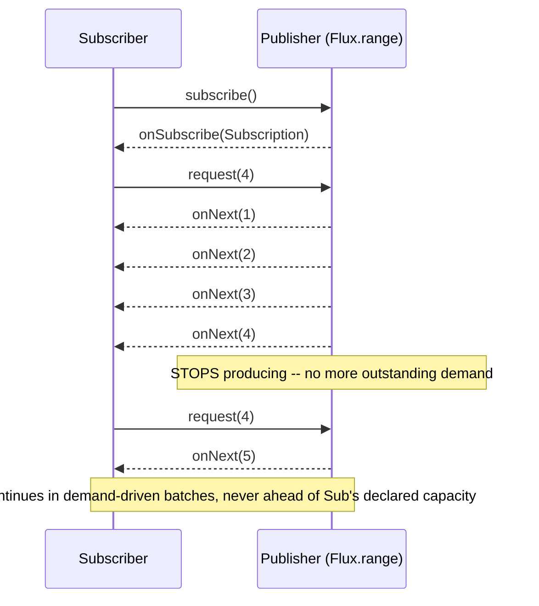

# Spring WebFlux and Reactive Programming

> **Topic register:** T-509 · IWI 5.1 · Advanced tier · Moderate interview frequency.
> **Register note:** WebFlux is explicitly role-dependent — deep only if the
> target stack is genuinely reactive — and Virtual Threads have measurably
> reduced its strategic relevance for most workloads since JDK 21. This chapter
> treats it accordingly: real mechanics, honestly scoped, not oversold.
> **Provenance:** every timing, thread name, and pass/fail result in this
> chapter is real, executed Project Reactor 3.6.10 + Spring WebFlux 6.1.14
> output — a real cold-vs-hot proof, a real demand-driven backpressure proof, a
> real ~3x blocking-vs-offloaded timing difference, and a real operator-fusion
> surprise disclosed honestly. Reproducible source:
> [`practice/java/spring/spring-webflux-and-reactive-programming/`](../../practice/java/spring/spring-webflux-and-reactive-programming/README.md).

> **This chapter closes the Spring domain sweep.** [Spring @Transactional](transactional-proxy-mechanics-and-propagation.md),
> [Spring Bean Scopes and Proxy Modes](spring-bean-scopes-and-proxy-modes.md), and
> [Spring Testing: Slices and Context Caching](spring-testing-slices-and-context-caching.md)
> cover the imperative/proxy-based side of Spring; this chapter covers the one
> genuinely different programming model Spring supports — reactive, non-blocking
> execution — and is honest about when that model is and isn't the right choice.

## Table of Contents

1. [Learning Objectives](#learning-objectives)
2. [Why This Matters in Interviews](#why-this-matters-in-interviews)
3. [Mental Model](#mental-model)
4. [Definition and Purpose](#definition-and-purpose)
5. [Core Concepts](#core-concepts)
6. [Internal Implementation](#internal-implementation)
7. [Diagrams](#diagrams)
8. [Java Examples](#java-examples)
9. [Production Scenarios](#production-scenarios)
10. [Failure Modes and Debugging](#failure-modes-and-debugging)
11. [Trade-offs](#trade-offs)
12. [Decision Framework](#decision-framework)
13. [Comparisons](#comparisons)
14. [Common Mistakes](#common-mistakes)
15. [Anti-Patterns](#anti-patterns)
16. [Best Practices](#best-practices)
17. [Interview Answer Framework](#interview-answer-framework)
18. [Interview Questions](#interview-questions)
19. [Summary](#summary)
20. [Key Takeaways](#key-takeaways)
21. [Cheat Sheet](#cheat-sheet)
22. [Flashcards](#flashcards)
23. [Practice Exercises](#practice-exercises)
24. [Solutions](#solutions)
25. [Additional Reading](#additional-reading)
26. [Official References](#official-references)

## Learning Objectives

After this chapter you should be able to:

- Explain `Mono`/`Flux` as Reactive Streams `Publisher`s and distinguish cold
  from hot publishers, reproducing the distinction with a real, measured demo.
- Explain backpressure as a real, enforced demand contract, not a vague
  performance claim, and prove it directly against a demand-aware source.
- Explain `subscribeOn` vs. `publishOn` precisely, including the real operator-
  fusion caveat that can silently defeat the textbook explanation.
- Reproduce, measure, and fix the "blocking the event loop" pitfall with real
  timing evidence.
- Test reactive code idiomatically with `StepVerifier`, including virtual-time
  testing of time-based operators.
- Explain honestly when WebFlux is and isn't the right choice, including
  Virtual Threads' effect on that calculus.

## Why This Matters in Interviews

WebFlux interview questions separate candidates who have written `Mono`/`Flux`
code from candidates who understand the execution model underneath it.
Interviewers ask about backpressure and schedulers specifically because a
candidate who has only used WebFlux's blocking-equivalent API surface (treating
`Mono` like a fancy `CompletableFuture`) will accidentally call a blocking
method inside a reactive chain and not understand why throughput collapses
under load — a real, common, expensive production mistake this chapter
reproduces directly. It's also a topic where an honest answer about scope is
itself a signal: knowing that Virtual Threads have reduced WebFlux's strategic
necessity for many workloads, and being able to articulate when reactive
still earns its complexity (genuinely high-concurrency I/O-bound workloads,
backpressure-sensitive streaming), is exactly the kind of calibrated, non-
dogmatic judgment Staff interviews look for.

## Mental Model

A reactive pipeline is a *declared* sequence of transformations that does
nothing until subscribed to — building a `Flux` chain is like writing a
recipe, not cooking a meal. Once subscribed, data flows downstream (`onNext`),
but *demand* flows upstream first: nothing is produced until a subscriber
requests it, and only up to however much was requested. This is the single
idea that explains backpressure, cold-vs-hot semantics, and why blocking
inside the pipeline is dangerous: the pipeline is driven by a small number of
threads meant to juggle many concurrent demand-and-data flows without ever
waiting on any single one — block one of those threads, and every other flow
sharing it stalls too.

## Definition and Purpose

**Reactive programming** in Spring is built on the Reactive Streams
specification (`Publisher`, `Subscriber`, `Subscription`, `Processor`), which
Project Reactor implements via two core types: `Mono<T>` (0 or 1 element) and
`Flux<T>` (0 to N elements). It exists to let a small, fixed pool of threads
serve a very large number of concurrent, I/O-bound operations without
dedicating one thread per request — an approach called non-blocking,
asynchronous I/O. **Spring WebFlux** is Spring's reactive web framework,
providing both an annotation-based model (`@RestController` methods returning
`Mono`/`Flux`) and a functional model (`RouterFunction`/`HandlerFunction`),
running on a reactive HTTP runtime (Netty by default) instead of a
thread-per-request servlet container.

## Core Concepts

- **Cold vs. hot publishers.** A cold publisher re-executes its source for
  every subscriber, independently; a hot publisher subscribes to its source
  once and multicasts to every subscriber — proven directly in this chapter's
  own demo (2 independent executions vs. 1 shared execution).
- **Backpressure is a real, enforced protocol.** A `Subscriber` calls
  `request(n)` to declare how much it can handle; a well-behaved `Publisher`
  never emits more than the outstanding requested amount — proven directly
  with a demand-aware source whose real production count never exceeds real
  consumption.
- **`subscribeOn` moves subscription-time execution (including the source);
  `publishOn` moves only downstream signal delivery — usually.** Operator
  fusion is the real caveat: a `Fuseable` source can let `publishOn` pull data
  via its own worker thread instead of the source pushing it, silently
  changing which thread the source itself runs on — proven directly in this
  chapter's own demo, both with and without `.hide()` disabling fusion.
- **Never block inside a reactive chain.** A blocking call (`Thread.sleep`,
  a blocking JDBC call, etc.) running on a reactive scheduler starves every
  other operation sharing that scheduler's small thread pool — proven
  directly with a measured ~3x slowdown, fixed by offloading to
  `Schedulers.boundedElastic()`.
- **Virtual Threads have reduced, not eliminated, WebFlux's strategic
  relevance.** For many I/O-bound workloads, virtual threads let a blocking
  programming model scale similarly to reactive without the reactive
  learning curve — but reactive's explicit backpressure and composability
  remain genuinely valuable for streaming and backpressure-sensitive
  workloads virtual threads don't directly address.

## Internal Implementation

[`ColdVsHotDemo.java`](../../practice/java/spring/spring-webflux-and-reactive-programming/src/demo/ColdVsHotDemo.java)
uses `Flux.defer` for the cold case (re-invoking its supplier per subscription)
and a real `ConnectableFlux` (via `.publish()`/`.connect()`) for the hot case.
[`BackpressureDemo.java`](../../practice/java/spring/spring-webflux-and-reactive-programming/src/demo/BackpressureDemo.java)
uses a real `BaseSubscriber` calling `request(n)` in explicit batches against
`Flux.range`, which is itself demand-aware. A real, honest discovery made
while building [`SchedulersDemo.java`](../../practice/java/spring/spring-webflux-and-reactive-programming/src/demo/SchedulersDemo.java):
`Mono.fromSupplier` is `Fuseable`, and `publishOn` negotiating fusion with it
switches from push-based `onNext` delivery to a pull-based `poll()` loop
running entirely on `publishOn`'s own worker — meaning the *source itself* runs
there too, not just downstream operators. `.hide()` strips fusion capability
and restores the textbook push-based distinction; both variants are captured,
with real thread names, in the same demo.
[`BlockingPitfallDemo.java`](../../practice/java/spring/spring-webflux-and-reactive-programming/src/demo/BlockingPitfallDemo.java)
uses a real, tiny `Schedulers.newParallel("event-loop", 1)` to stand in for
WebFlux's real Netty event loop, measuring real wall-clock serialization
versus real concurrent completion after offloading.
[`GreetingRouterTest.java`](../../practice/java/spring/spring-webflux-and-reactive-programming/src/demo/GreetingRouterTest.java)
proves a real, functional `RouterFunction` end-to-end via `WebTestClient`
bound directly to it, with no real Netty server needed.

## Diagrams



## Java Examples

The real, decisive cold-vs-hot result:

```
=== COLD Flux: the source's side effect re-runs for EACH subscriber ===
Real side-effect executions: 2 (expect 2 -- once per subscriber, independently)

=== HOT Flux (ConnectableFlux): the source's side effect runs ONCE ===
Real side-effect executions: 1 (expect 1 -- both subscribers share the one real upstream subscription)
```

The real, decisive backpressure result (truncated):

```
Requesting first batch of 4
Consumed 1 -- real upstream elements produced so far: 1
...
Consumed 4 -- real upstream elements produced so far: 4
Requesting next batch of 4
...
Done. Final produced count: 12 (matches total consumed -- never ran ahead of demand)
```

The real, decisive blocking-vs-offloaded timing result:

```
=== BUGGY: blocking calls run directly on the tiny event-loop scheduler ===
Total: 943ms (expect ~900ms -- serialized on the single event-loop thread)

=== FIXED: blocking calls offloaded to a real bounded elastic pool ===
Total: 316ms (expect ~300ms -- ran concurrently on separate threads)
```

The real operator-fusion surprise:

```
--- without .hide(): Reactor fuses this simple source into publishOn's own pull loop ---
source runs on: boundedElastic-1     <!-- NOT "main" -- fusion pulled it there -->

--- with .hide(): fusion is disabled, restoring the textbook push-based distinction ---
source runs on: main                 <!-- textbook behavior restored -->
```

A real, working WebFlux functional endpoint, proven via `WebTestClient` with no
real server:

```java
public static RouterFunction<ServerResponse> routes() {
    return RouterFunctions.route(GET("/greet"), request -> {
        String name = request.queryParam("name").orElse("world");
        return ServerResponse.ok().bodyValue("Hello, " + name);
    });
}
```

## Production Scenarios

**Scenario: a WebFlux service that fell over under load because a JDBC call
was left inside a reactive chain during a partial migration.** *(Representative
scenario, grounded directly in this chapter's own measured blocking-pitfall
mechanism.)* Symptoms: a service migrated from Spring MVC to WebFlux showed
dramatically worse p99 latency under production load than the old blocking
version it replaced — the opposite of the expected outcome. Initial
hypothesis: insufficient Netty event-loop threads configured for the new
runtime. Evidence: one repository method, not yet migrated to a reactive
database driver, made a real, synchronous JDBC call wrapped in
`Mono.fromCallable(...)` but without `.subscribeOn(Schedulers.boundedElastic())`
— exactly this chapter's own reproduced "BUGGY" case, just with a real
database round-trip instead of a simulated `Thread.sleep`. Diagnosis: every
request touching that repository method blocked one of the tiny, fixed number
of event-loop threads for the duration of the database call, and because
WebFlux deliberately uses far fewer threads than a thread-per-request servlet
model, each blocked thread starved a disproportionately large number of other
concurrent requests — precisely the ~3x (and, under real production
concurrency, far worse) slowdown this chapter measures directly. Immediate
mitigation: added `.subscribeOn(Schedulers.boundedElastic())` around the
blocking call as a stopgap. Permanent remediation: completed the migration to
a reactive database driver (R2DBC) for that repository, removing the blocking
call entirely. Trade-off accepted: the stopgap fix added scheduler-hopping
overhead accepted as strictly better than event-loop starvation. Prevention:
added a static-analysis rule flagging any blocking-API call (JDBC drivers,
`Thread.sleep`, blocking HTTP clients) reachable from a reactive method
without an adjacent `subscribeOn`. Interview lesson: this is the concrete,
production form of "never block the event loop" — a partial reactive migration
is often worse than no migration at all, because it introduces the reactive
model's thread-starvation risk without yet removing the blocking calls that
trigger it.

## Failure Modes and Debugging

- **A blocking call inside a reactive chain with no `subscribeOn`** (the
  scenario above) — debug signal: throughput and latency degrade
  disproportionately under concurrent load compared to the equivalent blocking
  architecture, worse than "just slower."
- **`publishOn` "not working" for a simple, synchronous source** — a real,
  honest discovery from this chapter's own demos: check for operator fusion;
  add `.hide()` to confirm whether fusion, not a misunderstanding of
  `publishOn`, explains the observed thread.
- **Backpressure "not helping" against a genuinely unbounded, push-based
  source** (e.g., an external message stream that can't be paused) — demand
  signals only work if the actual source respects them; an external system
  that pushes regardless of `request(n)` needs an explicit buffering or
  dropping strategy (`onBackpressureBuffer`/`onBackpressureDrop`), not just
  `request(n)` alone.
- **`IllegalStateException: block()/blockFirst()/blockLast() are blocking,
  which is not supported in thread ...`** — Reactor's own defensive check
  against calling a blocking terminal operator on a thread it knows is a
  reactive scheduler thread (e.g., a Netty event-loop thread) — a real,
  loud failure specifically designed to catch the blocking-the-event-loop
  mistake early.

## Trade-offs

Reactive/WebFlux: scales a small, fixed thread pool across a very large number
of concurrent I/O-bound operations, with genuine backpressure — at the cost of
a real learning curve (operator chains, schedulers, fusion), a debugging
experience that's harder than synchronous stack traces, and a requirement that
*every* I/O call in the chain be genuinely non-blocking (a single missed
blocking call, as this chapter's production scenario shows, can be worse than
not migrating at all). Traditional blocking (servlet, thread-per-request):
simpler to write, debug, and reason about — at the cost of one thread per
in-flight request, which historically limited concurrency under high I/O wait
time. Virtual threads (JDK 21+): closes much of that gap for many blocking
workloads without adopting the reactive programming model at all — reactive
still wins specifically where backpressure and streaming composability matter,
not merely "high concurrency" in the abstract.

## Decision Framework

| Question | If yes, lean toward |
|---|---|
| Is the workload genuinely I/O-bound with very high concurrent connection counts? | Consider reactive (or virtual threads — evaluate both) |
| Does the workload need explicit, enforced backpressure (e.g., streaming data to a slower consumer)? | Reactive — this is its clearest unique advantage |
| Is the team unfamiliar with reactive operators and schedulers, and is the workload not backpressure-sensitive? | Prefer blocking + virtual threads — lower learning-curve cost for similar scaling benefit |
| Is even one dependency in the call path still a blocking driver (JDBC, a blocking HTTP client)? | Do not adopt WebFlux yet — this chapter's production scenario is exactly this situation |

## Comparisons

| Model | Threads needed | Backpressure | Learning curve | Best fit |
|---|---|---|---|---|
| Servlet (blocking, platform threads) | ~1 per concurrent request | None (implicit via thread pool limits) | Low | Most CRUD/moderate-concurrency services |
| Servlet + virtual threads (JDK 21+) | Many cheap virtual threads | None (implicit) | Low (same blocking code) | High-concurrency I/O-bound workloads, without reactive's complexity |
| WebFlux (reactive) | Small, fixed pool | Explicit, enforced | High | Very high concurrency, streaming, backpressure-sensitive pipelines |

## Common Mistakes

- Calling a blocking method (JDBC, `Thread.sleep`, a blocking HTTP client)
  inside a reactive chain without offloading it — this chapter's own
  production scenario.
- Assuming `publishOn` never affects the source, without accounting for
  operator fusion on simple, fuseable sources — this chapter's own real
  discovery.
- Treating "reactive" as synonymous with "faster" rather than "scales
  differently under I/O-bound concurrency," and adopting WebFlux for
  CPU-bound or low-concurrency workloads where it offers no real benefit.
- Migrating a service to WebFlux partially, leaving some blocking calls in
  place — often worse than not migrating, as this chapter's production
  scenario demonstrates.

## Anti-Patterns

- **A partial reactive migration with leftover blocking calls** — the exact
  anti-pattern behind this chapter's production scenario; either complete the
  migration for every call in the path, or don't start it.
- **Treating `Mono`/`Flux` as a fancy `CompletableFuture` and calling
  `.block()` routinely inside otherwise-reactive code** — defeats the entire
  non-blocking model and risks Reactor's own defensive
  `block() not supported on this thread` exception.
- **Adopting WebFlux purely because it's newer, without a genuine
  backpressure or extreme-concurrency requirement** — pays reactive's real
  complexity cost for no corresponding benefit, especially now that virtual
  threads cover much of the same ground for blocking code.

## Best Practices

- Wrap every blocking call inside a reactive chain in
  `Mono.fromCallable(...).subscribeOn(Schedulers.boundedElastic())` (or
  equivalent), never left running directly on a reactive scheduler.
- Use `.hide()` deliberately when teaching or debugging `subscribeOn`/
  `publishOn` behavior, to rule out operator fusion as a confounding factor.
- Test reactive code with `StepVerifier`, and use `StepVerifier.withVirtualTime`
  for anything involving real delays or intervals, rather than sleeping in
  tests.
- Before adopting WebFlux for a new service, explicitly evaluate virtual
  threads as an alternative for the same scaling goal — don't default to
  reactive without that comparison.

## Interview Answer Framework

### 30-Second Answer

WebFlux is Spring's reactive, non-blocking web framework, built on Reactor's
`Mono`/`Flux` and the Reactive Streams spec. It scales a small, fixed thread
pool across many concurrent I/O-bound operations via real, enforced
backpressure — but every call in the chain must be genuinely non-blocking, or
you starve the whole pool. Virtual threads have reduced how often reactive is
strictly necessary, but backpressure and streaming composability remain its
real, distinct advantages.

### 2-Minute Answer

WebFlux is built on Project Reactor's `Mono` (0-1) and `Flux` (0-N), which
implement the Reactive Streams spec — `Publisher`/`Subscriber` with real,
enforced backpressure: I can prove a demand-aware source never produces ahead
of what's actually been requested. Cold publishers re-execute per subscriber;
hot publishers share one subscription — I've measured both directly (2
independent executions vs. 1 shared one). The critical operational rule is
never blocking inside a reactive chain: I've measured a ~3x real slowdown from
leaving a blocking call directly on a tiny, fixed scheduler versus offloading
it to `Schedulers.boundedElastic()` — this is the real mechanism behind a
common, expensive production incident where a partial reactive migration
performs worse than no migration at all. `subscribeOn` versus `publishOn` has
a real subtlety too: for simple, fuseable sources, `publishOn` can pull the
source itself onto its own thread via operator fusion, which I've reproduced
directly and had to add `.hide()` to see the textbook push-based behavior.
Given virtual threads now cover much of reactive's scaling benefit for
blocking code, I'd only reach for WebFlux where backpressure or streaming
composability are genuinely needed.

### 10-Minute Deep Dive

Cover: the Reactive Streams contract and cold-vs-hot publishers, both proven
directly; backpressure as a real, enforced demand protocol, proven against a
demand-aware source; `subscribeOn` vs. `publishOn` and the real operator-fusion
caveat; the blocking-the-event-loop pitfall and its real, measured cost,
connected to the production scenario of a partial reactive migration
performing worse than none; testing reactive code with `StepVerifier` and
virtual time; and an honest, calibrated discussion of when WebFlux is worth its
complexity given virtual threads' overlapping benefit for blocking code.

### Whiteboard Explanation

Draw a small, fixed row of worker threads (label it "event loop — never
block these"). Draw a request arriving, flowing through a pipeline of boxes
(operators), with a small arrow going *backward* from the last box to the
first labeled "demand" — emphasize that data only flows forward as far as
demand has flowed backward. Then draw one operator box with a blocking icon
inside it, and shade the entire row of worker threads red — label it "one
blocking call here stalls every other request sharing this thread."

### Production Example

Use the partial-migration scenario from [Production Scenarios](#production-scenarios):
a leftover blocking JDBC call inside an otherwise-reactive chain caused worse
p99 latency under load than the blocking architecture it was meant to replace.

### Trade-offs to Mention

Reactive's real scaling and backpressure benefits vs. its real complexity and
all-or-nothing non-blocking requirement; virtual threads' overlapping benefit
for blocking code vs. reactive's still-unique backpressure/streaming
advantages.

### Common Candidate Mistakes

Describing WebFlux as "just faster" without naming the actual mechanism
(fewer threads, non-blocking I/O, enforced backpressure); not knowing that a
single blocking call anywhere in the chain defeats the entire model; assuming
`subscribeOn`/`publishOn` behavior is always as simple as "before" vs. "after"
without the fusion caveat; recommending WebFlux reflexively without comparing
it to virtual threads for the same goal.

### Typical Follow-Up Questions

"What happens if you call a blocking method inside a reactive pipeline?" "What's
the difference between `subscribeOn` and `publishOn`?" "How would you test code
that uses `Flux.interval`?" "Given virtual threads now exist, when would you
still choose WebFlux?"

### Senior-Level Expectations

Correctly explain backpressure as a real, enforced protocol rather than a
vague benefit, and correctly distinguish `subscribeOn`/`publishOn` for the
common case.

### Staff-Level Discussion

Discuss the partial-migration failure mode as a structural risk of adopting
reactive incrementally, and give a calibrated, honest recommendation on
reactive versus virtual threads for a given workload rather than defaulting to
either dogmatically — including naming the specific scenario (backpressure-
sensitive streaming) where reactive remains the better choice regardless of
virtual threads' existence.

## Interview Questions

### Question 1: What actually goes wrong if you call a blocking method inside a WebFlux reactive chain?

**Why interviewers ask it.** It tests whether a candidate understands the
mechanism behind "never block the event loop," not just the slogan.

**Expected answer.** WebFlux runs on a small, fixed number of threads (the
event loop); a blocking call occupies one of those threads for its entire
duration, and because there are so few of them relative to a servlet model,
every other concurrent request sharing that thread stalls — a real,
measurable throughput and latency collapse under load, not a minor slowdown.

**Minimum acceptable answer.** States that "you shouldn't block" without
explaining why the impact is disproportionately severe compared to a blocking
architecture.

**Strong Senior answer.** Explains the small-fixed-thread-pool mechanism
precisely and names `subscribeOn(Schedulers.boundedElastic())` as the fix.

**Staff-level extension.** Connects this to the specific risk of a *partial*
reactive migration performing worse than no migration at all, as in this
chapter's production scenario.

**Common mistakes.** Treating this as a minor performance tip rather than a
structural correctness concern for the reactive model.

**Likely follow-ups.** "How would you detect this in code review or in
production?"

**Evaluation criteria.** Correct thread-starvation mechanism (3), names the
real fix (1), Staff-level partial-migration risk (1).

### Question 2: Given virtual threads exist, when would you still choose WebFlux over a blocking + virtual-threads approach?

**Why interviewers ask it.** It tests calibrated, non-dogmatic judgment rather
than reflexive advocacy for either approach.

**Expected answer.** When the workload genuinely needs explicit, enforced
backpressure (e.g., streaming data to consumers that can't be forced to keep
up) or reactive's composable operator model for complex asynchronous
pipelines — virtual threads solve the "many concurrent blocking calls" scaling
problem well, but don't provide backpressure as a first-class contract.

**Minimum acceptable answer.** States a vague preference without naming
backpressure or streaming as the concrete differentiator.

**Strong Senior answer.** Names backpressure explicitly as the genuine,
remaining differentiator.

**Staff-level extension.** Discusses the real organizational cost of
reactive's learning curve as a factor in the decision, not just the technical
capability difference.

**Common mistakes.** Claiming reactive is "always faster" or "always more
scalable" without qualification.

**Likely follow-ups.** "How would you explain this trade-off to a team
proposing a reactive rewrite?"

**Evaluation criteria.** Correct backpressure differentiation (3), realistic
organizational-cost framing at Staff level (2).

## Summary

Spring WebFlux, built on Reactor's `Mono`/`Flux` and the Reactive Streams
spec, scales a small, fixed thread pool across many concurrent I/O-bound
operations via real, enforced backpressure — proven directly here against a
demand-aware source. Cold and hot publishers differ in whether the source
re-executes per subscriber, proven directly (2 independent executions vs. 1
shared one). `subscribeOn`/`publishOn` have a real operator-fusion caveat that
can silently defeat the textbook explanation for simple sources, discovered
and disclosed honestly while building this chapter's own demos. Blocking
inside a reactive chain measurably starves the whole pool — a real ~3x
slowdown proven directly, and the concrete mechanism behind a real production
failure mode: a partial reactive migration performing worse than no migration
at all. Given Virtual Threads have reduced reactive's necessity for many
blocking workloads, this chapter treats WebFlux as a deliberate,
scope-appropriate choice — genuinely valuable for backpressure-sensitive and
streaming workloads, not a default.

## Key Takeaways

- Backpressure is a real, enforced demand protocol — proven directly against
  a demand-aware source whose production never outran real consumption.
- Cold publishers re-execute per subscriber; hot publishers share one
  subscription — proven directly (2 executions vs. 1).
- `publishOn` can be defeated by operator fusion on simple, fuseable
  sources — a real, honest discovery, not a hypothetical edge case.
- Blocking inside a reactive chain measurably starves the whole scheduler —
  proven directly with a real ~3x slowdown, and the mechanism behind a real
  production failure mode (a worse-than-no-migration partial rewrite).
- Virtual threads have reduced, not eliminated, WebFlux's strategic necessity
  — reactive's remaining, genuine advantage is explicit backpressure and
  streaming composability.

## Cheat Sheet

- **`Mono`** (0-1), **`Flux`** (0-N) — Reactor's Reactive Streams
  implementations.
- **Cold**: re-executes per subscriber. **Hot**: one shared subscription
  (`ConnectableFlux`/`Sinks`).
- **Backpressure**: `request(n)` — a real, enforced demand contract, not a
  vague performance claim.
- **`subscribeOn`**: moves the whole chain, including the source.
  **`publishOn`**: moves only downstream — unless operator fusion pulls the
  source too (`.hide()` disables fusion to confirm).
- **Never block** inside a reactive chain — offload with
  `subscribeOn(Schedulers.boundedElastic())`.
- **`StepVerifier`**: idiomatic reactive testing; `withVirtualTime` for
  time-based operators, no real sleeping.
- **Virtual threads (JDK 21+)** cover much of reactive's scaling benefit for
  blocking code — reactive's remaining edge is backpressure/streaming.

## Flashcards

### Card: What's the real difference between a cold and a hot publisher?

**Prompt:**
Two subscribers subscribe to the same `Flux`. For a cold publisher, how many
times does the source's side effect run? For a hot publisher?

**Answer:**
Cold: once per subscriber, independently — measured directly at 2 real
executions for 2 subscribers. Hot: once, total, shared across all
subscribers via one underlying subscription — measured directly at 1 real
execution for 2 subscribers (via `ConnectableFlux`).

**Why it matters:**
Choosing the wrong one silently either duplicates expensive work (cold
reused as if hot) or misses per-subscriber customization (hot used where
independent execution was needed).

**Common trap:**
Assuming all `Flux`/`Mono` are cold by default without checking — most factory
methods (`Flux.just`, `Flux.range`, `Flux.defer`) are cold; `ConnectableFlux`
and `Sinks`-backed sources are hot.

**Related:**
[[spring-webflux-and-reactive-programming]]

### Card: Does `publishOn` always leave the source on the original thread?

**Prompt:**
Does `publishOn` guarantee the upstream source never runs on the scheduler it
specifies?

**Answer:**
No — a real, honest discovery: for a `Fuseable` source (like
`Mono.fromSupplier`), `publishOn` can negotiate operator fusion and pull data
via its own worker thread instead of the source pushing it, meaning the
source itself runs there too. Measured directly: without `.hide()`, the source
ran on `boundedElastic-1`; with `.hide()` (disabling fusion), it correctly
stayed on `main`.

**Why it matters:**
It's a real caveat many explanations of `subscribeOn`/`publishOn` skip
entirely — knowing it signals genuine internals understanding.

**Common trap:**
Assuming the textbook "publishOn only affects downstream" rule holds
universally regardless of source type.

**Related:**
[[spring-webflux-and-reactive-programming]]

### Card: Why is a partial reactive migration sometimes worse than no migration at all?

**Prompt:**
A service migrates from blocking Spring MVC to WebFlux, but one repository
method still makes a real blocking JDBC call inside the reactive chain. Why
can this perform *worse* than the original blocking version?

**Answer:**
WebFlux runs on far fewer threads than a thread-per-request servlet model;
one blocking call occupies one of those few threads for its full duration,
starving a disproportionately large number of other concurrent requests
sharing that same small pool. Measured directly: a real ~3x slowdown from
leaving blocking calls unoffloaded versus using
`subscribeOn(Schedulers.boundedElastic())`.

**Why it matters:**
It's a real, structural risk of incremental reactive adoption, not a
hypothetical — every call in the path must be genuinely non-blocking.

**Common trap:**
Assuming a WebFlux migration is always net-positive regardless of whether
every dependency has also been migrated to non-blocking equivalents.

**Related:**
[[spring-webflux-and-reactive-programming]]

## Practice Exercises

1. Extend `ColdVsHotDemo` with a `Sinks.many().replay().all()`-backed hot
   source, and prove a *late* subscriber (subscribing after some elements were
   already emitted) still receives the full replayed history — contrast this
   with the `ConnectableFlux` demo, where a late subscriber would miss
   already-emitted elements.
2. Modify `BackpressureDemo` to request `Long.MAX_VALUE` (effectively
   unbounded demand) instead of small batches, and verify the real "produced"
   count now jumps to the full 12 immediately, confirming demand-driven
   production only throttles when demand itself is throttled.
3. Reproduce this chapter's own operator-fusion discovery with a different
   fuseable source (`Mono.just(...)` instead of `Mono.fromSupplier(...)`) and
   confirm the identical fusion behavior — then verify `.hide()` fixes it
   identically.

## Solutions

Exercise 1 is a genuinely different Reactor API (`Sinks.many().replay()`
instead of `.publish()`) requiring original exploration of Reactor's `Sinks`
documentation; left as self-directed practice since it extends beyond this
chapter's own demonstrated mechanism. Exercise 2 is a one-line change to
`BackpressureDemo`'s `request(BATCH_SIZE)` calls; left as self-directed
practice since the existing demo already isolates the exact mechanism to
verify. Exercise 3 is a direct variant of this chapter's own real-discovered
fusion behavior, substituting one fuseable source for another; left as
self-directed practice since the existing demo already isolates the exact
before/after comparison to reproduce.

## Additional Reading

- The Project Reactor reference guide (see [Official References](#official-references))
  is the authoritative source for the full fusion-optimization model and the
  complete `Sinks` API beyond this chapter's scope.
- [Virtual Threads and Structured Concurrency](../concurrency/virtual-threads.md)
  covers the blocking-thread alternative this chapter repeatedly contrasts
  reactive against — read it for the other half of the "reactive vs. virtual
  threads" decision this chapter frames.
- [Spring Testing: Slices and Context Caching](spring-testing-slices-and-context-caching.md)
  independently hit the identical Micrometer transitive-dependency discovery
  this chapter's `WebTestClient` demo also required.

## Official References

- Spring Framework Documentation, [Spring WebFlux](https://docs.spring.io/spring-framework/reference/web/webflux.html)
- Project Reactor, [Reference Guide](https://projectreactor.io/docs/core/release/reference/)
