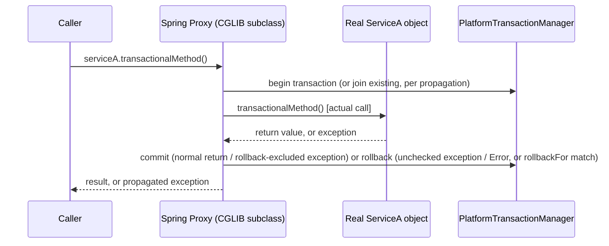
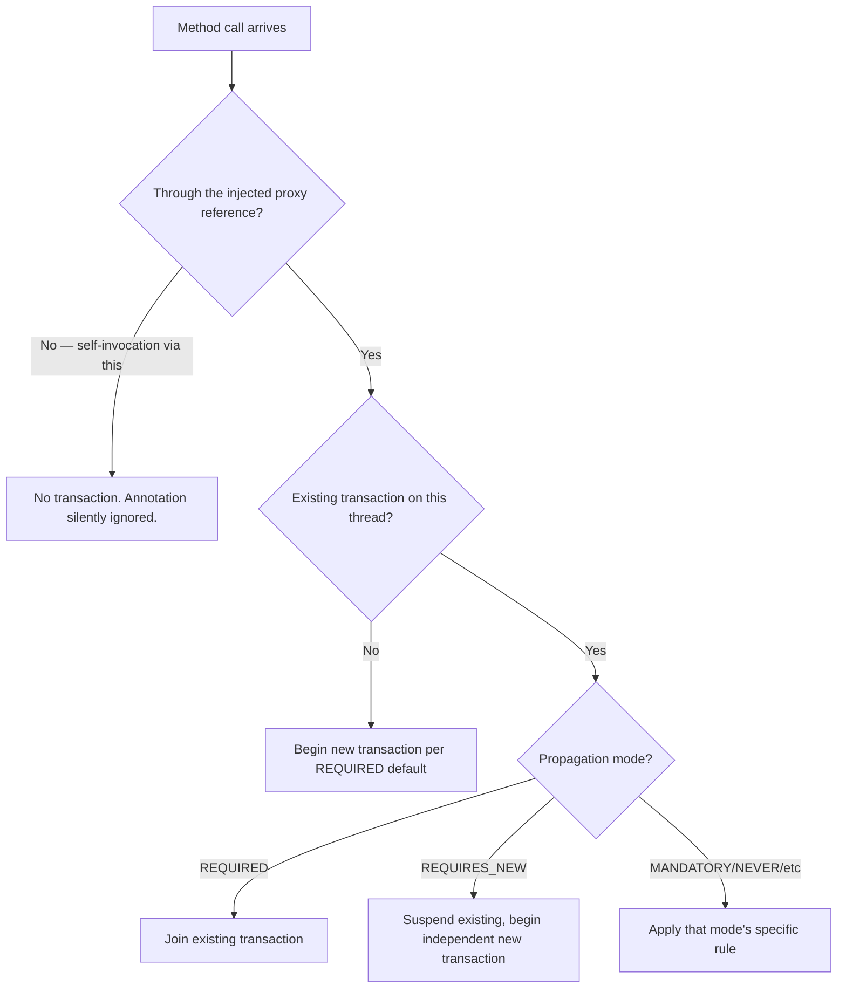

# Spring @Transactional: Proxy Mechanics, Rollback Rules, and Propagation

> **Topic register:** T-503 (AOP/proxy mechanics, IWI 6.30) · T-504 (`@Transactional` semantics & self-invocation, IWI 8.15, #9 of 198) · T-505 (propagation & isolation in Spring, IWI 7.70) · Advanced tier · Very High interview frequency [H] for any Spring-based role
> **Why grouped as one chapter:** T-504 is the highest-IWI Spring-specific topic in the register, and it is genuinely unexplainable without T-503's proxy mechanism — every one of its "surprising" behaviors (self-invocation, checked-exception non-rollback, `readOnly` inconsistency, propagation) follows from the same root cause: `@Transactional` is a proxy-mediated behavior, not a language feature.
> **Provenance:** every demo in this chapter is real, executed output from Spring Framework 6.1.14 — plain jars from Maven Central on a hand-built classpath, no Spring Boot auto-configuration masking the mechanism. Reproducible source: [`practice/java/week-03/spring-demos/`](../../practice/java/week-03/spring-demos/).

## Table of Contents

1. [Learning Objectives](#learning-objectives)
2. [Why This Matters in Interviews](#why-this-matters-in-interviews)
3. [Mental Model](#mental-model)
4. [Definition and Purpose](#definition-and-purpose)
5. [Historical Context](#historical-context)
6. [Core Concepts](#core-concepts)
7. [Internal Implementation](#internal-implementation)
8. [Execution Flow](#execution-flow)
9. [Diagrams](#diagrams)
10. [Java Examples](#java-examples)
11. [Production Scenarios](#production-scenarios)
12. [Failure Modes and Debugging](#failure-modes-and-debugging)
13. [Trade-offs](#trade-offs)
14. [Performance Implications](#performance-implications)
15. [Memory Implications](#memory-implications)
16. [Concurrency Implications](#concurrency-implications)
17. [Security Implications](#security-implications)
18. [Decision Framework](#decision-framework)
19. [Comparisons](#comparisons)
20. [Common Mistakes](#common-mistakes)
21. [Anti-Patterns](#anti-patterns)
22. [Best Practices](#best-practices)
23. [Interview Answer Framework](#interview-answer-framework)
24. [Interview Questions](#interview-questions)
25. [Summary](#summary)
26. [Key Takeaways](#key-takeaways)
27. [Cheat Sheet](#cheat-sheet)
28. [Flashcards](#flashcards)
29. [Practice Exercises](#practice-exercises)
30. [Solutions](#solutions)
31. [Additional Reading](#additional-reading)
32. [Official References](#official-references)

---

## Learning Objectives

By the end of this chapter you can:

- Explain `@Transactional` as a proxy-mediated behavior and predict, from that mechanism alone, why self-invocation silently fails to start a transaction.
- State Spring's default rollback rule precisely (unchecked exceptions and `Error` only) and name why `rollbackFor` is so often required in practice.
- Choose the correct propagation mode for a given production requirement — especially `REQUIRES_NEW` — and name its specific deadlock risk unprompted.
- State that `readOnly = true` is a hint whose enforcement is driver-dependent, not a portable guarantee, backed by a measured cross-database difference.
- Quantify why an external network call inside a transaction boundary is a connection-pool availability risk for *other*, unrelated requests — not just a latency problem for its own.
- Defend where the transaction boundary belongs in a layered/hexagonal architecture, and why the controller and repository layers are both wrong places for it.

## Why This Matters in Interviews

`@Transactional` is the single most commonly used annotation in Spring backend code and simultaneously one of the least understood — it looks like a declaration, but it's a proxy-mediated runtime behavior with several failure modes that are completely silent in development and destructive in production. The self-invocation question ("method A calls `@Transactional` method B in the same class — what happens?") is near-universal at Senior level specifically because it cannot be answered correctly from surface-level familiarity with the annotation; it requires understanding the proxy underneath it. This is the highest-IWI Spring-specific topic in the entire 198-topic register, and Phase 1 of this project's own audit found the existing knowledge base's Spring coverage was shallow definition-level material with none of these mechanics present.

## Mental Model

**`@Transactional` is not a property of your method — it's a property of the call that reaches it.** The exact same method, called two different ways, can either run inside a transaction or not, roll back on an exception or not, entirely depending on whether the call passed through Spring's proxy. Once this is the mental model, every "surprising" behavior in this chapter stops being a memorized exception and becomes a direct, predictable consequence: self-invocation bypasses the proxy (so no transaction starts); the proxy is what applies the rollback rule (so a rollback rule is only as good as the proxy actually running); propagation is a proxy-level decision about how a *new* call relates to whatever transaction (if any) is already active for the calling thread.

## Definition and Purpose

`@Transactional` is Spring's declarative transaction-management annotation, implemented via **AOP (Aspect-Oriented Programming) proxies**: Spring wraps the annotated bean in a proxy object — either a JDK dynamic proxy (if the bean implements an interface) or a CGLIB-generated subclass proxy (if it doesn't) — and injects that proxy everywhere the bean is referenced. The proxy intercepts each call, consults a `PlatformTransactionManager` to begin (or join) a transaction, invokes the real target method, and commits or rolls back based on how the method returns. It exists so that transaction demarcation — begin, commit, rollback — doesn't have to be hand-written inside every business method; the cost of that convenience is that the mechanism only works through the proxy, and any call that reaches the target object without going through it never triggers the interception at all.

## Historical Context

Spring's proxy-based AOP model predates Java's own move toward first-class functional and structural concurrency features, and its core design choice — favor a comparatively simple, dynamic-proxy-based interception model over full bytecode weaving — was deliberate: Spring also supports full AspectJ compile-time/load-time weaving for teams that need it, but proxy-based AOP remains the default because it requires no special build step, at the cost of an important limitation self-invocation and private/final methods inherit directly. The default rollback rule (`RuntimeException`/`Error` roll back, checked exceptions do not) is not a Spring invention — it mirrors the original EJB convention, in which checked exceptions were conventionally treated as expected, recoverable business outcomes rather than failures, and unchecked exceptions signaled a genuine, unrecoverable error. Spring adopted the same convention when it introduced declarative transaction management specifically to ease migration from EJB-based transaction handling, and the convention has outlived essentially every other part of that migration story.

## Core Concepts

### Proxy creation: JDK dynamic proxy vs. CGLIB

If the target bean implements at least one interface, Spring defaults to a **JDK dynamic proxy** implementing that same interface. If it does not, Spring generates a **CGLIB subclass proxy** — a runtime-generated subclass overriding the bean's public (and package-visible) methods to add interception. This is *why* `@Transactional` has no effect on `private` or `final` methods: a CGLIB proxy cannot override a `final` method, and a `private` method can never be dispatched polymorphically through any proxy at all — the annotation is silently ignored in both cases, with no warning.

### Self-invocation bypasses the proxy

Only calls that arrive **through the injected proxy reference** are intercepted. A call made via `this.someMethod()` from inside the same object — self-invocation — reaches the real target object directly, never passing through the proxy that would have started a transaction. This is true regardless of whether the calling method is itself `@Transactional` or not; the only thing that matters is whether the specific call in question went through the proxy or through `this`.

### The default rollback rule

Spring's declarative rollback rule rolls back on `RuntimeException` and `Error`, and **does not** roll back on checked exceptions, by default. `@Transactional(rollbackFor = Exception.class)` (or a narrower checked-exception class) overrides this. This is the single most common source of "why didn't my transaction roll back" production surprises.

### `readOnly` is a hint, not a guarantee

`@Transactional(readOnly = true)` calls `connection.setReadOnly(true)` on the underlying JDBC connection, and (for Hibernate) adjusts flush mode to skip unnecessary dirty-checking. What happens if a write is attempted anyway is **entirely up to the JDBC driver** — some drivers enforce it at the database level, some silently allow the write. It is a portable *hint*, not a portable *constraint*.

### Propagation modes

| Propagation | Behavior | Real use case |
|---|---|---|
| `REQUIRED` (default) | Joins an existing transaction, or starts one if none exists | The default for almost everything |
| `REQUIRES_NEW` | Suspends any existing transaction, always starts a new, independent one | Audit logging that must survive the caller's rollback |
| `SUPPORTS` | Joins if a transaction exists, runs non-transactionally otherwise | Read methods usable both inside and outside a transaction |
| `MANDATORY` | Requires an existing transaction; throws if none exists | Enforcing that a method is never called outside a transaction |
| `NOT_SUPPORTED` | Suspends any existing transaction, runs without one | Rarely needed; occasionally for a long-running non-transactional operation |
| `NEVER` | Throws if a transaction exists | Enforcing the opposite of `MANDATORY` |
| `NESTED` | A true savepoint-based nested transaction, if the driver supports it | Partial rollback within a larger transaction |

## Internal Implementation

### Demo 1 — self-invocation bypasses the proxy, measured

```java
static class ServiceA {
    @Transactional
    public boolean transactionalMethod() {
        return TransactionSynchronizationManager.isActualTransactionActive();
    }
    public boolean callViaSelfInvocation() {
        return this.transactionalMethod(); // bypasses the proxy entirely
    }
}
```

**Real output:**
```
Called through the Spring-managed proxy:      isActualTransactionActive() = true
Called via self-invocation (this.method()):   isActualTransactionActive() = false
RESULT: CONFIRMED -- self-invocation bypasses the transactional proxy.
```

Identical annotation, identical method — the only variable is which reference the call went through. **Three real fixes**, in order of general preference:

1. **Split the method into a separate bean** and call it via dependency injection — the call now goes through that bean's own proxy.
2. **Self-inject via `ApplicationContext.getBean(getClass())`** or `@Lookup`, obtaining the proxy from within the class — works, but a code smell most teams avoid.
3. **`AopContext.currentProxy()`** with `exposeProxy = true` on `@EnableAspectJAutoProxy` — retrieves the current proxy explicitly; more precise than option 2, still adds a Spring-specific dependency into what should be plain business logic.

### Demo 2 — checked exceptions do not roll back by default, measured

```java
@Transactional
public void placeOrderDefaultRollbackRule(int id, boolean throwChecked) throws OrderPlacementFailedException {
    jdbc.update("INSERT INTO orders (id, note) VALUES (?, ?)", id, "default-rule");
    if (throwChecked) throw new OrderPlacementFailedException("simulated downstream failure");
}
```

**Real output:**
```
Default rollback rule, checked exception thrown -> row count: 1 (row survived the exception: true)
rollbackFor=Exception.class, checked exception thrown -> row count: 1 (row 2 correctly rolled back: true)
RESULT: CONFIRMED -- default rule does NOT roll back on a checked exception; rollbackFor fixes it.
```

The `INSERT` that ran before the checked exception was thrown **remains committed** under the default rule — the exception propagated correctly to the caller, but the transaction manager never saw it as rollback-worthy. With `rollbackFor = Exception.class` added, the identical scenario correctly rolls back.

### Demo 3 — REQUIRES_NEW commits independently, measured

```java
@Transactional(propagation = Propagation.REQUIRES_NEW)
public void recordAttempt(String note) {
    jdbc.update("INSERT INTO audit_log (note) VALUES (?)", note);
}
// ... called from inside a DIFFERENT outer @Transactional method that later throws
```

**Real output:**
```
orders table row count (outer transaction, should be rolled back): 0
audit_log table row count (REQUIRES_NEW, should have survived): 1
RESULT: CONFIRMED -- REQUIRES_NEW committed independently despite the outer rollback.
```

**Deadlock risk, worth naming unprompted:** `REQUIRES_NEW` suspends the outer transaction's connection and acquires a *new* one. If the inner (`REQUIRES_NEW`) transaction needs a row lock that the suspended outer transaction already holds, the inner transaction blocks waiting for a lock that will never be released until the inner transaction itself completes — a genuine self-deadlock, unique to this propagation level, that is easy to miss in review because the two transactions look independent.

### Demo 4 & 5 — `readOnly` enforcement is driver-dependent, measured

Identical code, `@Transactional(readOnly = true)`, attempting a write, on two different databases:

**H2:**
```
Write inside @Transactional(readOnly=true) SUCCEEDED (no exception).
RESULT: readOnly is a HINT here, not an enforced constraint -- driver-dependent behavior, exactly as documented.
```

**PostgreSQL:**
```
Write inside @Transactional(readOnly=true) FAILED on PostgreSQL:
  UncategorizedSQLException: ERROR: cannot execute INSERT in a read-only transaction
RESULT: CONFIRMED -- PostgreSQL's JDBC driver enforces connection.setReadOnly(true) by rejecting the write at the database level.
```

Same annotation, same flag, two genuinely different runtime outcomes — proof that "`readOnly` prevents writes" is not a portable claim.

### Demo 6 — connection-pool exhaustion from a long transaction, measured

Two threads each hold a connection for 6 seconds inside a `@Transactional` method (simulating a forgotten external call or an oversized query run inside a transaction boundary); a pool of size 2 has no connection left for a third, unrelated, fast request.

**Real output:**
```
Pool size = 2, connectionTimeout = 2000ms
Third request FAILED after 2010ms waiting for a connection: CannotCreateTransactionException
RESULT: CONFIRMED -- pool exhaustion under a small pool size with long-held connections causes a real connection-acquisition timeout for a completely unrelated, fast request.
```

## Execution Flow



The step every self-invocation failure skips: when `Target` calls one of its own `@Transactional` methods directly via `this`, the call never re-enters through `Proxy` — it goes straight from `Target` to `Target`, and `TxMgr` is never consulted at all.

## Diagrams



## Java Examples

```java
// Java 21 / Spring Framework 6. Demonstrates the self-invocation trap and the
// dependency-injection fix — splitting into a second bean restores the proxy path.

@Service
public class OrderService {

    private final AuditLogService auditLogService; // separate bean, injected

    public OrderService(AuditLogService auditLogService) {
        this.auditLogService = auditLogService;
    }

    @Transactional
    public void placeOrder(Order order) {
        repository.save(order);
        // BROKEN if this were `this.recordAttempt(...)` on a method in THIS class:
        // self-invocation would bypass REQUIRES_NEW entirely and just join
        // whatever transaction is already active (or none).
        auditLogService.recordAttempt("order placed: " + order.getId());
    }
}

@Service
public class AuditLogService {

    // Calling through this bean's own proxy — REQUIRES_NEW is honored correctly,
    // because the call from OrderService arrives via Spring-managed injection,
    // not via `this`.
    @Transactional(propagation = Propagation.REQUIRES_NEW)
    public void recordAttempt(String note) {
        jdbcTemplate.update("INSERT INTO audit_log (note) VALUES (?)", note);
    }
}
```

```java
// Rollback rule fix, and the correct transaction-boundary placement: at the
// application-service layer, never the controller (too broad — includes
// serialization) and never the repository (too narrow — can't coordinate
// multiple repository calls atomically).

@Service
public class OrderPlacementService {

    // Explicit rollbackFor: checked exceptions do NOT roll back by default,
    // and this business outcome should.
    @Transactional(rollbackFor = OrderPlacementFailedException.class)
    public void placeOrder(int id) throws OrderPlacementFailedException {
        orderRepository.insert(id);
        inventoryClient.reserve(id); // in-process only; NEVER an HTTP call here (see Production Scenarios)
        if (!inventoryReserved(id)) {
            throw new OrderPlacementFailedException("inventory reservation failed");
        }
    }
}
```

**Complexity note:** these are `O(1)` framework-mechanism concerns, not algorithmic ones — the entire value of this chapter is correctness under a specific runtime mechanism (proxy dispatch), not asymptotic cost.

## Production Scenarios

### Scenario: cascading timeout from an HTTP call inside a transaction boundary

**Symptoms.** A checkout endpoint's p99 latency spikes and, during the same window, several unrelated endpoints sharing the same database connection pool start returning `CannotCreateTransactionException` under only moderate load.

**Impact.** A single slow downstream dependency (an inventory-reservation HTTP call) degrades endpoints that have nothing to do with inventory, because they all share the same connection pool.

**Initial hypotheses.** Database itself is slow (checked — query latency on the actual `INSERT`s is normal); connection pool is undersized (partially true, but the real question is *why* it's being exhausted); a downstream service outage (confirmed — the inventory service's p99 spiked independently).

**Evidence.** APM tracing shows the checkout transaction's Spring transaction span open for the *entire* duration of the HTTP call to the inventory service, not just the database operations within it; connection pool metrics show near-100% utilization correlated exactly with the inventory service's own latency spike.

**Diagnosis.** The `@Transactional` boundary was placed around a method that makes an HTTP call to the inventory service *between* two database operations. Every in-flight checkout request holds a pooled database connection for the HTTP call's entire duration — exactly Demo 6's mechanism, reproduced at production scale by a real downstream dependency rather than a synthetic sleep.

**Immediate mitigation.** Increase the connection pool size as a stopgap while the code fix ships — this buys headroom but does not address the root cause and has its own downstream database-connection-limit cost.

**Permanent remediation.** Move the inventory HTTP call outside the transaction boundary entirely: reserve inventory *before* opening the transaction (accepting a compensating action if the subsequent database write fails), or restructure into two smaller transactions with the HTTP call between them.

**Alternatives considered.** Making the HTTP call asynchronous within the same transaction — rejected, because it does not shorten how long the connection is held; the transaction still can't commit until the async result is known.

**Trade-offs.** Splitting into two transactions sacrifices all-or-nothing atomicity across the inventory call and the order write — accepted, with an explicit compensating-action path for the case where inventory reservation fails after the order row is already committed.

**Prevention.** A code-review checklist item, and ideally a static check: no network call (HTTP client, message broker publish, another service's blocking call) inside a method annotated `@Transactional` or called from within one while a transaction is active.

**Interview lesson.** This is Demo 6 and the "HTTP call inside a transaction" interview question (§ Interview Questions Q5) arriving as a real incident: the mechanism is identical, only the source of the slowness (a real dependency instead of a synthetic sleep) differs.

## Failure Modes and Debugging

| Symptom | Likely cause | Debugging step |
|---|---|---|
| A `@Transactional` method's writes are never rolled back on a thrown exception | Self-invocation (call went through `this`, bypassing the proxy) | Check `TransactionSynchronizationManager.isActualTransactionActive()` at method entry, or trace whether the call arrived via an injected bean reference |
| A checked exception is thrown, but the preceding writes are committed anyway | Default rollback rule — checked exceptions don't roll back unless `rollbackFor` is set | Add `rollbackFor` to the exception type, or switch to an unchecked exception for genuinely unrecoverable failures |
| `@Transactional(readOnly = true)` doesn't prevent an accidental write | Enforcement is driver-dependent; the JDBC driver in use may not enforce it | Never rely on `readOnly` as the *only* write-prevention mechanism; verify against the actual production driver |
| Unrelated endpoints start timing out under load | Connection-pool exhaustion from a long-held transaction elsewhere in the system | Trace transaction span duration against the connection pool's utilization metrics; look for network calls inside transaction boundaries |
| `REQUIRES_NEW` call hangs indefinitely | Suspended outer transaction holds a lock the new inner transaction needs | Review whether the `REQUIRES_NEW` method ever touches rows the outer transaction has already locked; add lock-wait timeout monitoring |

## Trade-offs

| Approach | Benefit | Cost |
|---|---|---|
| Declarative `@Transactional` | No manual transaction demarcation code | Only works through the proxy — self-invocation and internal calls silently don't get it |
| `REQUIRES_NEW` for audit/logging | Survives caller rollback | Real deadlock risk against a suspended outer transaction holding a needed lock |
| `readOnly = true` | Query-planner and ORM flush-mode hints, and sometimes real write rejection | Enforcement is driver-dependent — never rely on it as the only write-prevention mechanism |
| Long-lived transactions | Simpler code (one boundary for a multi-step operation) | Directly reduces pool availability for every other concurrent request |

## Performance Implications

The measurable performance cost in this chapter isn't the transaction mechanism itself — proxy dispatch is a negligible per-call overhead — it's what a transaction *holds open* for its duration: a pooled database connection, for at least as long as the slowest operation inside the boundary. Demo 6 measures this directly: a pool of size 2 with two 6-second-held connections produces a real 2-second timeout for a third, unrelated, fast request. This scales linearly with concurrent long-held transactions and inversely with pool size — the exact mechanism behind the Production Scenario above.

## Memory Implications

Each active transaction retains transaction-scoped resources — a `Connection`, Hibernate's persistence context if JPA is in use, and any `TransactionSynchronization` callbacks registered for it — for the transaction's full duration. A long-held transaction under `REPEATABLE READ` or `SERIALIZABLE` additionally holds open a database snapshot for that duration, which (as covered in [Isolation Levels and Concurrency Anomalies](../databases/isolation-levels-and-concurrency-anomalies.md)) delays vacuum's ability to reclaim dead row versions — a direct link between how long a Spring `@Transactional` method runs and PostgreSQL-side table bloat.

## Concurrency Implications

Propagation mode is fundamentally a concurrency-coordination decision: `REQUIRED` shares one transaction (and its lock set) across a call chain on the same thread; `REQUIRES_NEW` deliberately creates a second, independent transaction that can contend for the *same* rows the first is holding — the specific mechanism behind the `REQUIRES_NEW` deadlock risk in this chapter. Isolation level (set at the transaction manager or per-method) interacts directly with everything in [Isolation Levels and Concurrency Anomalies](../databases/isolation-levels-and-concurrency-anomalies.md): a `@Transactional` method's isolation setting is what determines whether a cross-row invariant it touches is protected against write skew at all.

## Security Implications

A transaction boundary placed too broadly (e.g., around an entire controller method) can inadvertently keep a database connection — and any locks it holds — open during unrelated, potentially slow work such as external authentication/authorization calls, response serialization, or third-party API calls, extending the window during which a held lock or long-open connection could be leveraged in a resource-exhaustion attack (deliberately triggering many slow requests to starve the connection pool, a variant of the same mechanism as the Production Scenario above, but adversarially induced rather than accidental).

## Decision Framework

1. **Is this call self-invocation?** If a method needs `@Transactional` semantics and is called via `this` from within the same class, it must be extracted to a separate bean — no annotation placement fixes this.
2. **Does this exception represent an expected, recoverable business outcome, or a genuine failure?** If genuinely a failure that should roll back and it's checked, add `rollbackFor` explicitly rather than relying on the default.
3. **Does this write need to survive the caller's potential rollback?** If yes (audit logging, a notification record), use `REQUIRES_NEW` — and explicitly check whether it could ever contend for a row the outer transaction holds.
4. **Is this method read-only, and does the production database driver actually enforce it?** Verify against the real driver; never assume portability of `readOnly` behavior across database vendors.
5. **Does this transaction boundary ever include a network call?** If yes, move the call outside the boundary — restructure into pre-transaction/post-transaction steps with an explicit compensating action if needed.
6. **Where does the boundary belong — controller, service, or repository?** The application-service/use-case layer, consistently: broad enough to coordinate multiple repository calls atomically, narrow enough to exclude HTTP-layer concerns like serialization.

## Comparisons

| Mechanism | What it protects against | What it does NOT protect against |
|---|---|---|
| `@Transactional` default rollback rule | Unchecked exceptions and `Error` leaving partial writes committed | Checked exceptions — requires explicit `rollbackFor` |
| `readOnly = true` | Some drivers reject writes at the database level (e.g., PostgreSQL) | Portable enforcement — some drivers silently allow writes (e.g., H2 in this chapter's demo) |
| `REQUIRED` propagation | Coordinating multiple calls into one atomic unit | Independent survivability — a rollback anywhere in the chain rolls back everything |
| `REQUIRES_NEW` propagation | Independent survivability of a sub-operation (e.g., audit logging) | Deadlock-freedom — can self-deadlock against a lock the suspended outer transaction holds |
| Isolation level (`REPEATABLE READ`/`SERIALIZABLE`) | Cross-row invariant violations (write skew), at SERIALIZABLE only | Application-level correctness of *where* the transaction boundary is placed — a correctly isolated transaction in the wrong place is still a bug |

## Common Mistakes

- Assuming `@Transactional` "just works" regardless of how the method is called — it only works through the Spring-managed proxy.
- Assuming any thrown exception triggers a rollback, rather than specifically unchecked exceptions and `Error` by default.
- Treating `readOnly = true` as a guaranteed, portable write-prevention mechanism across all databases.
- Making an external network call (HTTP, another service, a message broker publish) from inside a transaction boundary.
- Placing the transaction boundary at the controller layer (too broad) or the repository layer (too narrow, can't coordinate multiple calls atomically).

## Anti-Patterns

- **Assuming self-invocation "sort of" works** because the code compiles and runs without error — the annotation is silently ignored, with no warning at compile time or runtime, which makes this specific anti-pattern dangerous precisely because it looks correct.
- **Relying on `readOnly = true` as the sole write-prevention mechanism** in a codebase that must run against multiple database backends or could migrate between them.
- **Using `REQUIRES_NEW` reflexively for "safety"** without checking whether the inner transaction could contend for a lock the outer transaction already holds — turning a defensive pattern into a latent deadlock.
- **Widening the transaction boundary to "be safe"** by wrapping a controller method or an entire request-handling pipeline in `@Transactional`, rather than scoping it to the actual atomic unit of business work.

## Best Practices

- Place `@Transactional` at the application-service/use-case layer — broad enough to coordinate multiple repository calls atomically, narrow enough to exclude HTTP/serialization concerns.
- Never call a network dependency (HTTP, message broker, another microservice) from inside a transaction boundary; restructure into pre/post steps with an explicit compensating action if partial failure is possible.
- Set `rollbackFor` explicitly whenever a checked exception represents a genuine failure that should undo prior writes in the same method.
- Treat `REQUIRES_NEW` as requiring an explicit lock-contention review against the outer transaction, not a "safe by default" choice.
- Verify `readOnly` enforcement against the actual production database driver rather than assuming behavior observed on one database generalizes.
- Extract any method that needs transactional semantics into a properly injected bean if it would otherwise be called via self-invocation.

## Interview Answer Framework

### 30-Second Answer

`@Transactional` is implemented as a proxy wrapping your bean — it only works through that proxy. Self-invocation (`this.method()`) bypasses it entirely and silently runs without a transaction. The default rollback rule only covers unchecked exceptions and `Error`; checked exceptions need `rollbackFor` explicitly.

### 2-Minute Answer

Definition: Spring wraps `@Transactional` beans in a JDK dynamic proxy or CGLIB subclass proxy that intercepts calls, begins/joins a transaction via `PlatformTransactionManager`, and commits or rolls back based on the method's outcome. Why it exists: to avoid hand-writing transaction demarcation in every business method. How it works: any call through the proxy gets intercepted; any call that bypasses it (self-invocation) does not. One important trade-off: `REQUIRES_NEW` gives independent commit semantics useful for things like audit logging, but risks deadlocking against a suspended outer transaction's held lock. Production example: measured, real proof that `readOnly = true` is enforced on PostgreSQL but silently ignored on H2 — the same annotation, two genuinely different runtime outcomes, which is exactly why it can't be treated as a portable guarantee.

### 10-Minute Deep Dive

Cover, in order: proxy creation (JDK dynamic vs. CGLIB) and why it explains the private/final-method limitation (internals); self-invocation and the measured proof it bypasses the proxy entirely (failure mode); the default rollback rule's EJB-derived history and the measured checked-exception non-rollback (edge case); `REQUIRES_NEW`'s independent-commit semantics and its specific deadlock risk against a suspended outer transaction (trade-off); the measured cross-database `readOnly` enforcement difference (edge case); and close with the production scenario in this chapter — a real HTTP call inside a transaction boundary causing unrelated endpoints to fail under load, the exact mechanism Demo 6 reproduces synthetically.

### Whiteboard Explanation

Draw the [§ Execution Flow](#execution-flow) sequence diagram first: Caller → Proxy → Target, with `PlatformTransactionManager` off to the side. Then draw a second arrow directly from Target back into itself, labeled "self-invocation (`this.method()`)," visibly bypassing the Proxy box entirely — this is the single image that makes the whole chapter's failure modes click, because every subsequent explanation reduces to "did the call go through the box on the left, or not."

### Production Example

The cascading-timeout incident in [§ Production Scenarios](#production-scenarios): an HTTP call to an inventory service placed inside a transaction boundary held a database connection for the call's full duration, and when the inventory service itself slowed down, unrelated checkout-adjacent endpoints sharing the same connection pool began failing — identical mechanism to Demo 6, produced by a real dependency instead of a synthetic sleep.

### Trade-offs to Mention

State unprompted: self-invocation silently disables the annotation with no compile-time or runtime warning; the default rollback rule does not cover checked exceptions; `REQUIRES_NEW` trades independent survivability for a genuine, non-obvious deadlock risk; `readOnly` enforcement is not portable across database vendors.

### Common Candidate Mistakes

Believing Spring "somehow" still applies the transaction via bytecode magic on self-invocation; assuming any exception triggers rollback; naming a `REQUIRES_NEW` use case without naming its deadlock risk, or vice versa; placing the transaction boundary at the controller or repository layer without justification; describing an HTTP-call-inside-a-transaction problem only as "it's slow" without connecting it to pool exhaustion for *other* requests.

### Typical Follow-Up Questions

1. "Why does extracting the method to another bean fix the self-invocation problem?"
2. "How would you fix a checked-exception rollback gap, two ways?"
3. "How would you detect the `REQUIRES_NEW` deadlock risk before it happens in production?"
4. "What's wrong with putting `@Transactional` on the controller?"
5. "How does `@Transactional` interact with `@Async`? With a virtual thread?"
6. "Why is CGLIB (not a JDK dynamic proxy) used when the bean has no interface?"

### Senior-Level Expectations

Correctly explains the proxy mechanism and names at least one fix for self-invocation; correctly states the default rollback rule and one way to change it; states both a `REQUIRES_NEW` use case and its deadlock risk when prompted; places the transaction boundary correctly at the service layer.

### Staff-Level Discussion

Every failure mode in this chapter — self-invocation, checked-exception surprises, `readOnly` inconsistency, pool exhaustion — has the same root cause: **treating a declarative, proxy-based mechanism as if it were a language-level guarantee.** A Staff-level engineer doesn't just know the individual rules; they reason from the proxy mechanism itself to predict *new* failure modes not explicitly listed anywhere — for example, "what happens if this bean is also wrapped by a caching proxy — which proxy runs first, and does that change anything about the transaction boundary?" This chapter's demos were deliberately built and executed rather than described specifically because proxy-mediated behavior is easy to state incorrectly from memory and cheap to verify directly — the same evidentiary standard applied throughout this project's Database Triad.

## Interview Questions

### Question 1 — Method A calls `@Transactional` method B in the same class. What happens, and why? Name three fixes.

**Why interviewers ask it.** The single most reliable question in this domain for separating "has used Spring" from "understands Spring's transaction mechanism."

**Expected answer.** No transaction starts for B — the call bypasses the proxy entirely, as measured in Demo 1. The three fixes: split into a separate bean and call via dependency injection; self-inject via `ApplicationContext.getBean(getClass())` or `@Lookup`; `AopContext.currentProxy()` with `exposeProxy = true`.

**Minimum acceptable answer.** States that self-invocation causes a problem, even without precise proxy terminology.

**Strong Senior answer.** Correctly explains the proxy mechanism and names at least one of the three fixes.

**Staff-level extension.** Names all three fixes with their trade-offs, and explains specifically why CGLIB — not a JDK dynamic proxy — is used when the bean implements no interface.

**Common mistakes.** Believing Spring somehow still applies the transaction via bytecode magic; knowing no fix beyond "extract to another bean," without being able to explain *why* that fixes it.

**Likely follow-ups.** "Why does extracting to another bean fix it?"

**Evaluation criteria (1–5).** 1: no awareness of the problem. 3: correct mechanism, one fix. 5: correct mechanism, all three fixes with trade-offs, and the CGLIB-vs-JDK-proxy reasoning.

**Related references.** [§ Core Concepts](#core-concepts), self-invocation; [§ Internal Implementation](#internal-implementation), Demo 1.

---

### Question 2 — Your method threw a checked exception. Did it roll back? Why is that the default?

**Why interviewers ask it.** Tests whether the candidate has actually hit this in practice versus assuming "any exception rolls back."

**Expected answer.** No, by default — per Demo 2. The default mirrors the original EJB convention, where checked exceptions were conventionally treated as expected, recoverable business outcomes rather than failures.

**Minimum acceptable answer.** States that not every exception rolls back, even without the historical reasoning.

**Strong Senior answer.** Correctly states the default rule and names `rollbackFor` as the fix.

**Staff-level extension.** Explains the EJB-convention history behind the default, rather than reciting "that's just the rule" — connecting the design decision to its origin.

**Common mistakes.** Assuming any exception thrown inside `@Transactional` rolls back.

**Likely follow-ups.** "How would you fix it, two ways?"

**Evaluation criteria (1–5).** 1: assumes all exceptions roll back. 3: correct default and one fix. 5: correct default, fix, and the historical reasoning behind the convention.

**Related references.** [§ Historical Context](#historical-context); [§ Internal Implementation](#internal-implementation), Demo 2.

---

### Question 3 — `REQUIRES_NEW`: give a real use case, and name the deadlock risk.

**Why interviewers ask it.** Naming a use case is common; naming the accompanying deadlock risk unprompted is a genuine differentiator.

**Expected answer.** Audit logging that must survive the caller's rollback (Demo 3); the deadlock risk is that `REQUIRES_NEW` suspends the outer transaction's connection and acquires a new one, and if the inner transaction needs a row lock the suspended outer transaction already holds, it blocks indefinitely.

**Minimum acceptable answer.** Names a plausible use case, even without the deadlock risk.

**Strong Senior answer.** States both the use case and the risk.

**Staff-level extension.** Proposes a detection method — lock-wait timeout monitoring, or a review process checking whether `REQUIRES_NEW` methods ever touch rows the outer transaction has already locked.

**Common mistakes.** Naming a use case but not the risk, or vice versa.

**Likely follow-ups.** "How would you detect this deadlock risk before it happens in production?"

**Evaluation criteria (1–5).** 1: no use case or risk. 3: both stated. 5: both stated plus a concrete detection method.

**Related references.** [§ Internal Implementation](#internal-implementation), Demo 3; [§ Concurrency Implications](#concurrency-implications).

---

### Question 4 — There's an HTTP call inside a transaction. What breaks, and at what load?

**Why interviewers ask it.** Tests whether the candidate connects an isolated code smell to a systemic, cross-endpoint production consequence.

**Expected answer.** The transaction's connection is held for the HTTP call's entire duration; at even moderate concurrent load, this exhausts the connection pool exactly as measured in Demo 6, causing unrelated fast requests to time out waiting for a connection.

**Minimum acceptable answer.** States that this makes the request slow, even without connecting it to pool exhaustion for other requests.

**Strong Senior answer.** Names the pool-exhaustion mechanism explicitly.

**Staff-level extension.** Quantifies the blast radius — a slow dependency inside a transaction doesn't just slow its own request, it can take down unrelated endpoints sharing the same connection pool, exactly as demonstrated with real numbers in Demo 6 and the Production Scenario.

**Common mistakes.** Describing only "it's slow" without connecting it to pool exhaustion for other requests.

**Likely follow-ups.** "How would you fix it?"

**Evaluation criteria (1–5).** 1: "it's slow," no mechanism. 3: names pool exhaustion. 5: names pool exhaustion plus quantifies cross-endpoint blast radius.

**Related references.** [§ Internal Implementation](#internal-implementation), Demo 6; [§ Production Scenarios](#production-scenarios).

## Summary

`@Transactional` is a proxy-based mechanism, not a language feature — every one of its surprising behaviors (self-invocation, checked-exception non-rollback, driver-dependent `readOnly` enforcement, connection-pool exhaustion under long-held transactions) follows directly from that single fact. `REQUIRES_NEW` provides real independent-commit semantics at the cost of a genuine deadlock risk against a suspended outer transaction. A long-held transaction's cost isn't just its own latency — it removes a connection from the shared pool for every other concurrent request, which is precisely why a network call inside a transaction boundary is a systemic, not merely local, hazard.

## Key Takeaways

- `@Transactional` only works through the Spring-managed proxy; self-invocation bypasses it entirely, silently.
- Default rollback covers unchecked exceptions and `Error`, not checked exceptions — use `rollbackFor` to change this.
- `REQUIRES_NEW` commits independently of the outer transaction, but risks deadlocking against a lock the suspended outer transaction holds.
- `readOnly = true` enforcement is driver-dependent — verified different on H2 vs. PostgreSQL in this chapter.
- A transaction that holds its connection for an external call reduces pool availability for every other concurrent request.
- The transaction boundary belongs at the application-service layer — never the controller, never the repository.

## Cheat Sheet

| Situation | What to do |
|---|---|
| Method needs `@Transactional` but is called via `this` in the same class | Extract to a separate, properly injected bean |
| A checked exception should trigger rollback | Add `rollbackFor = <ExceptionType>.class` explicitly |
| A write must survive the caller's rollback | `REQUIRES_NEW` — and review for lock contention against the outer transaction |
| Deciding whether `readOnly = true` prevents writes | Don't assume — verify against the actual production JDBC driver |
| A transaction boundary needs an external call | Move the call outside the boundary; use pre/post steps with a compensating action if needed |
| Deciding where the transaction boundary goes | Application-service/use-case layer — not controller, not repository |

## Flashcards

### Card: Why self-invocation breaks @Transactional

**Prompt:**
Why does calling an `@Transactional` method via `this` from within the same class not start a transaction?

**Answer:**
The call never passes through the Spring-managed proxy that intercepts calls and starts the transaction — it goes directly to the real target object.

**Why it matters:**
The single most reliable interview question in this domain for separating surface familiarity from real understanding.

**Common trap:**
Assuming Spring applies the transaction anyway via some form of bytecode magic.

**Related:**
[Core Concepts](#core-concepts)

### Card: Default rollback rule

**Prompt:**
Does a checked exception roll back a `@Transactional` method by default?

**Answer:**
No — only `RuntimeException` and `Error` trigger rollback by default, unless `rollbackFor` says otherwise.

**Why it matters:**
The most common source of "why didn't my transaction roll back" production surprises.

**Common trap:**
Assuming any thrown exception triggers a rollback.

**Related:**
[Internal Implementation](#internal-implementation), Demo 2

### Card: REQUIRES_NEW deadlock risk

**Prompt:**
What's the specific deadlock risk unique to `REQUIRES_NEW`?

**Answer:**
It suspends the outer transaction's connection and starts an independent one; if the inner transaction needs a row lock the suspended outer transaction already holds, it blocks until the inner transaction completes — which it can't, without that lock.

**Why it matters:**
`REQUIRES_NEW` looks safely independent but can self-deadlock in a way that's easy to miss in review.

**Common trap:**
Naming the audit-logging use case without naming the deadlock risk.

**Related:**
[Internal Implementation](#internal-implementation), Demo 3

### Card: readOnly enforcement

**Prompt:**
Is `@Transactional(readOnly = true)` guaranteed to prevent writes?

**Answer:**
No — enforcement is driver-dependent. Confirmed not enforced on H2, enforced on PostgreSQL, in this chapter's own measured demo.

**Why it matters:**
Prevents treating a hint as a portable, cross-database guarantee.

**Common trap:**
Relying on `readOnly = true` as the sole write-prevention mechanism.

**Related:**
[Internal Implementation](#internal-implementation), Demo 4 & 5

## Practice Exercises

1. Reproduce all six demos yourself: [`practice/java/week-03/spring-demos/`](../../practice/java/week-03/spring-demos/).
2. Modify Demo 3 (`REQUIRES_NEW`) to construct the deadlock scenario described in this chapter — have the outer transaction lock a row that the inner `REQUIRES_NEW` transaction then tries to update, and observe the block.
3. Take a method in a system you know annotated `@Transactional`. Confirm: is it ever called via self-invocation from within the same class? If so, does that call actually need a transaction?
4. Given the cascading-timeout Production Scenario, sketch the two-transaction restructuring (inventory reservation before the transaction opens, order write inside it) and identify what compensating action is needed if the order write fails after inventory was already reserved.

## Solutions

**Exercise 1.** Expected output matches this chapter's six demos exactly when run against the provided classpath; if `readOnly` enforcement differs from what's shown, first check which database (H2 vs. PostgreSQL) the demo is actually running against, since that's the variable the demo is designed to expose.

**Exercise 2.** Have the outer `@Transactional` method first `UPDATE` (or `SELECT ... FOR UPDATE`) a row in a shared table, then call the `REQUIRES_NEW` method which attempts to update the *same* row. Expected result: the `REQUIRES_NEW` transaction blocks on the lock held by the (suspended, but still holding its lock) outer transaction, and eventually times out or deadlocks, depending on the database's lock-wait-timeout configuration.

**Exercise 3.** No single expected answer — the exercise is complete when the candidate has identified a concrete method and traced whether the calling code path uses `this.method()` (broken) or a properly injected bean reference (correct).

**Exercise 4.** A correct sketch: (1) call the inventory service to reserve stock, outside any transaction; (2) open a transaction, write the order row, commit; (3) if step 2 fails after step 1 succeeded, the compensating action is releasing the inventory reservation (a second, separate call to the inventory service) — explicitly accepting that this is not atomic with the order write, and documenting the (bounded) window where inventory could be reserved without a corresponding order.

## Additional Reading

- Martin Kleppmann, *Designing Data-Intensive Applications*, Chapter 7 (also referenced in [Isolation Levels and Concurrency Anomalies](../databases/isolation-levels-and-concurrency-anomalies.md))

## Official References

- [Spring Framework documentation — Transaction Management](https://docs.spring.io/spring-framework/reference/data-access/transaction.html)
- [Spring Framework documentation — AOP Proxies](https://docs.spring.io/spring-framework/reference/core/aop/proxying.html)
