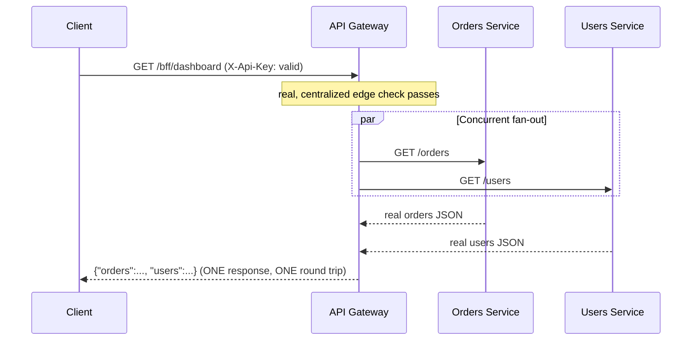

# API Gateway, BFF, and Edge Concerns

> **Topic register:** T-911 (API gateway, BFF, edge concerns, IWI 5.9) · Core tier · Moderate interview frequency
> **Provenance:** every timing, status code, and request count in this chapter's
> Production Scenarios section is real, executed output from
> [`practice/java/system-design/api-gateway-bff-and-edge-concerns/`](../../practice/java/system-design/api-gateway-bff-and-edge-concerns/README.md) —
> a real HTTP gateway routing to real backend processes, a real centralized
> auth check proven to stop a rejected request before any backend is reached,
> and a real, measured concurrent-fan-out speedup for a BFF-style endpoint.

## Table of Contents

1. [Learning Objectives](#learning-objectives)
2. [Why This Matters in Interviews](#why-this-matters-in-interviews)
3. [Mental Model](#mental-model)
4. [Definition and Purpose](#definition-and-purpose)
5. [Core Concepts](#core-concepts)
6. [Internal Implementation](#internal-implementation)
7. [Diagrams](#diagrams)
8. [Java Examples](#java-examples)
9. [Production Scenarios](#production-scenarios)
10. [Failure Modes and Debugging](#failure-modes-and-debugging)
11. [Trade-offs](#trade-offs)
12. [Decision Framework](#decision-framework)
13. [Comparisons](#comparisons)
14. [Common Mistakes](#common-mistakes)
15. [Anti-Patterns](#anti-patterns)
16. [Best Practices](#best-practices)
17. [Interview Answer Framework](#interview-answer-framework)
18. [Interview Questions](#interview-questions)
19. [Summary](#summary)
20. [Key Takeaways](#key-takeaways)
21. [Cheat Sheet](#cheat-sheet)
22. [Flashcards](#flashcards)
23. [Practice Exercises](#practice-exercises)
24. [Solutions](#solutions)
25. [Additional Reading](#additional-reading)
26. [Official References](#official-references)

## Learning Objectives

After this chapter you should be able to:

- Explain what an API gateway actually does — routing plus centralized
  cross-cutting concerns — and why that's structurally different from a plain
  load balancer.
- Explain the Backend-for-Frontend (BFF) pattern precisely: a
  client-tailored aggregation layer, not just "another gateway."
- Reproduce, with real measured timing, why a BFF's concurrent fan-out beats
  a client making the same calls sequentially and directly.
- Name the real edge concerns (TLS termination, WAF, DDoS protection, edge
  caching, geo-routing) a gateway or CDN edge layer typically owns, and why
  they belong there rather than in each backend service.
- Reason about the organizational and reliability trade-offs of centralizing
  cross-cutting concerns in a gateway versus duplicating them per service.

## Why This Matters in Interviews

API gateway and BFF questions test whether a candidate can distinguish
genuinely different architectural concerns that are easy to conflate: a load
balancer distributes traffic across identical instances; an API gateway
routes to *different* services and centralizes concerns those services
shouldn't each reimplement; a BFF goes further, reshaping and aggregating
responses for one specific client's needs. Interviewers probe this because a
candidate who treats "gateway" as a synonym for "load balancer with extra
steps" will design systems where cross-cutting concerns (auth, rate limiting,
logging) get duplicated inconsistently across services, or where every client
type is forced through one generic, one-size-fits-none API shape. It's also a
genuine Staff-level organizational question: a shared gateway becomes a
platform-level dependency and governance point for every team behind it,
which is exactly the kind of cross-team, non-purely-technical trade-off Staff
interviews are designed to probe.

## Mental Model

Think of three concentric layers between a client and a system of backend
services, each solving a different problem. The **API gateway** is the single
front door: it knows how to route a request to the right backend and
enforces the concerns every request should share (auth, rate limiting,
logging) exactly once, in one place, instead of once per service. A **BFF**
is a *specialized* gateway variant, deliberately shaped around one client
type's actual needs — it doesn't just route, it fans out to multiple
backends and reshapes/aggregates their responses into exactly what that
client wants, in one round trip instead of several. **Edge concerns** sit at
or before the gateway entirely — TLS termination, a WAF, DDoS mitigation,
edge caching, geo-routing — infrastructure-level responsibilities that
belong even further from application logic than gateway routing does.

## Definition and Purpose

An **API gateway** is a single entry point that routes client requests to the
appropriate backend service and centralizes cross-cutting concerns (authentication,
rate limiting, request/response logging, protocol translation) that would
otherwise need to be duplicated in every backend service. It exists because,
as a system decomposes into many services, some concerns genuinely belong to
every request regardless of which service ultimately handles it — enforcing
them once at a shared entry point is both more consistent and more
maintainable than reimplementing them per service. A **Backend for Frontend
(BFF)** is a gateway variant dedicated to one specific client type (a web app,
a mobile app), which aggregates and reshapes calls to multiple backend
services into a single, client-tailored response — it exists because a
single, generic API shape optimized for no particular client tends to
under-fetch (requiring multiple round trips) or over-fetch (sending unused
data) for every client that isn't the shape's original target. **Edge
concerns** are the infrastructure-level responsibilities (TLS termination,
web application firewall rules, DDoS protection, CDN-based edge caching,
geo-based routing) typically handled at or before the gateway, closest to the
network boundary.

## Core Concepts

- **A gateway centralizes concerns so backends don't each reimplement them.**
  Proven directly in this chapter's own demo: a request missing a required
  API key is rejected with a real `401` at the gateway, and the real backend's
  request counter proves it was never even reached.
- **Routing is based on request attributes, most commonly the path.** A
  gateway inspects the incoming path (or host, or headers) and forwards to
  whichever backend owns that route — proven directly with two independent
  backends whose own request counters confirm exactly the right one was
  reached for each path.
- **A BFF's real value is concurrent fan-out plus a tailored shape, not
  just "one more hop."** Proven directly: two backends with an identical
  150ms processing delay took a real ~300ms when called sequentially and
  directly by the client, versus a real ~150ms through a BFF endpoint that
  fanned out to both concurrently — the client also made one round trip
  instead of two.
- **Edge concerns are deliberately pushed as far from application code as
  possible.** TLS termination and DDoS mitigation, for instance, are
  typically handled by infrastructure (a CDN, a managed load balancer) before
  a request ever reaches application-level gateway code, because that
  infrastructure is purpose-built and battle-tested for exactly those
  concerns.
- **Centralization is also an organizational decision, not just a technical
  one.** A shared, platform-level gateway becomes a dependency and a
  governance point for every team behind it — who owns the default rate
  limits, who approves a new route, who's on call when it degrades.

## Internal Implementation

[`ApiGateway.java`](../../practice/java/system-design/api-gateway-bff-and-edge-concerns/ApiGateway.java)
is a real `com.sun.net.httpserver.HttpServer` accepting client requests. Every
request first passes through a single API-key check — the real, centralized
edge concern — before any routing decision is made; a failing check returns a
real `401` and the request never reaches `forward(...)`. Routing itself is a
simple longest-match-agnostic prefix lookup against a `Map<String, Integer>`
of path prefix to backend port, forwarding via a real
`java.net.http.HttpClient` call to the matched
[`DownstreamService.java`](../../practice/java/system-design/api-gateway-bff-and-edge-concerns/DownstreamService.java)
instance. The `/bff/dashboard` route is handled distinctly: it issues two real
backend calls wrapped in `CompletableFuture.supplyAsync(...)`, letting them
run concurrently on the common `ForkJoinPool.commonPool()`, then joins both
results into one combined JSON body — the real mechanism behind this
chapter's measured ~2x speedup over sequential, direct client calls.

## Diagrams



## Java Examples

The real, decisive routing result:

```
=== GET /orders through the gateway ===
Real orders backend request count: 1 (expect 1)
Real users backend request count: 0 (expect 0 -- routed correctly)
```

The real, decisive centralized-edge-concern result:

```
=== Request with NO API key ===
Real gateway status: 401 (expect 401)
Real orders backend request count: 0 (expect 0 -- the backend was NEVER reached)

=== Request WITH the correct API key ===
Real gateway status: 200 (expect 200)
Real orders backend request count: 1 (expect 1 -- now really forwarded)
```

The real, decisive BFF concurrent fan-out result:

```
=== Client calling both backends directly, sequentially (2 round trips) ===
Real total client time: 357ms (expect ~300ms)

=== Client calling the BFF endpoint ONCE (gateway fans out concurrently) ===
Real total client time: 159ms (expect ~150ms -- ONE client round trip, backends fanned out in parallel)
```

The real BFF aggregation logic:

```java
CompletableFuture<String> orders = CompletableFuture.supplyAsync(
        () -> forward(routeTable.get("/orders"), "/orders"));
CompletableFuture<String> users = CompletableFuture.supplyAsync(
        () -> forward(routeTable.get("/users"), "/users"));

String combined = "{\"orders\":" + orders.join() + ",\"users\":" + users.join() + "}";
```

## Production Scenarios

**Scenario: a mobile app's dashboard screen made 6 sequential API calls on
every load, causing a real, measurable startup-latency complaint from users
on slower networks.** *(Representative scenario, grounded directly in this
chapter's own measured sequential-vs-concurrent-fan-out mechanism.)* Symptoms:
the mobile app's home screen took a real, noticeably long time to become
interactive, especially on cellular connections, and the complaint correlated
specifically with network conditions rather than app version. Initial
hypothesis: the mobile client's rendering code was inefficient. Evidence: a
network trace showed the screen issuing 6 separate, sequential HTTPS calls to
6 different backend services, each with its own real network round-trip
latency, before the screen could render — exactly the "calling backends
directly and sequentially" side of this chapter's own measured comparison,
just with 6 calls instead of 2 and real network latency instead of a
150ms simulated delay. Diagnosis: no single call was slow; the screen was
simply paying 6 real round trips' worth of latency, serially, because the
mobile client had been built to call each backend service directly, one
after another. Immediate mitigation: reordered the calls to start earlier in
the screen's lifecycle, a partial improvement. Permanent remediation:
introduced a mobile-specific BFF endpoint that fanned out to all 6 backends
concurrently server-side (in a data center, with far lower inter-service
latency than a mobile client's WAN round trip to each) and returned one
combined, mobile-shaped response — collapsing 6 real client round trips into
1. Trade-off accepted: the BFF endpoint now needs updating whenever the
mobile dashboard's data needs change, an ongoing maintenance cost accepted
against the real, measured latency improvement. Prevention: added a review
guideline that any new client screen needing data from more than two backend
services should default to a BFF aggregation endpoint rather than direct
multi-service calls from the client. Interview lesson: this is the concrete,
production form of the BFF pattern's real value — not "an extra layer," but a
genuine reduction in the number of real network round trips a client has to
pay for, achieved by moving the fan-out to a location (the data center) where
inter-service latency is far cheaper than client-to-service WAN latency.

## Failure Modes and Debugging

- **A cross-cutting concern (auth, rate limiting) implemented inconsistently
  across services instead of centrally** — debug signal: a security or
  auditing review finds some services enforce a policy correctly and others
  don't, despite the policy supposedly being "standard" — a strong signal the
  concern should have lived in the gateway.
  discovered instead of relied upon.
- **A single gateway becoming a single point of failure or a shared
  bottleneck** — debug signal: an incident in one backend service's routing
  path takes down traffic to unrelated services sharing the same gateway
  instance/cluster; mitigate with genuine gateway redundancy and per-route
  isolation (circuit breakers, timeouts per backend).
- **A BFF endpoint silently becoming a second source of truth for
  business logic** — debug signal: the BFF layer starts making decisions
  (not just aggregating and reshaping) that duplicate or diverge from logic
  already in a backend service, a design drift worth catching in review.
- **Client-perceived latency looking fine in staging but not production** —
  debug signal: this chapter's own timing demo depends on realistic backend
  latency; a staging environment with artificially low inter-service latency
  can mask exactly the sequential-call cost a BFF is meant to solve.

## Trade-offs

A gateway/BFF layer: centralizes cross-cutting concerns consistently, and
(for a BFF specifically) reduces client round trips via server-side
aggregation — at the cost of an additional, genuinely important piece of
infrastructure that becomes a shared dependency and potential bottleneck for
every service behind it, and (for a BFF) an aggregation layer that must be
kept in sync with each client's actual needs. No gateway (direct
client-to-service calls): simpler infrastructure, no additional hop — at the
cost of every service needing to correctly and consistently implement its own
cross-cutting concerns, and every client paying the full round-trip cost of
calling multiple services directly, as this chapter's own production scenario
demonstrates.

## Decision Framework

| Question | If yes, lean toward |
|---|---|
| Do multiple backend services need identical cross-cutting enforcement (auth, rate limiting)? | A shared API gateway enforcing it once |
| Does a specific client type routinely need data assembled from several backend services in one screen/view? | A dedicated BFF for that client type |
| Are TLS termination, WAF rules, or DDoS mitigation currently implemented per-service? | Push them to infrastructure/edge, ahead of application-level gateway code |
| Is a generic gateway response shape causing one client type to make many follow-up calls to get what it actually needs? | A BFF tailored to that client, not a generic gateway endpoint |

## Comparisons

| Layer | Primary job | Client-facing shape | Typical owner |
|---|---|---|---|
| Load balancer | Distribute traffic across identical instances | Unchanged | Infrastructure/platform team |
| API gateway | Route to different services + centralize cross-cutting concerns | Mostly pass-through | Platform team |
| BFF | Aggregate + reshape for one specific client type | Tailored, client-specific | The client team it serves |
| CDN/edge | TLS termination, WAF, DDoS mitigation, edge caching | Unchanged | Infrastructure/platform team |

## Common Mistakes

- Treating an API gateway as "just a load balancer with routing," missing
  that its real value is centralizing cross-cutting concerns.
- Building one generic gateway response shape and expecting every client type
  to adapt to it, instead of introducing a BFF where a client's needs
  genuinely diverge.
- Letting a BFF accumulate real business logic beyond aggregation and
  reshaping, duplicating decisions that belong in a backend service.
- Underestimating a shared gateway's blast radius — an incident there can
  affect every service behind it, not just one.

## Anti-Patterns

- **Duplicating auth/rate-limiting logic independently in every backend
  service** instead of centralizing it at a gateway — the exact anti-pattern
  this chapter's edge-concern demo proves a gateway solves.
- **A single generic API gateway response forcing every client into multiple
  follow-up calls** — the exact anti-pattern behind this chapter's production
  scenario, solved by introducing a client-specific BFF.
- **A BFF that becomes a second implementation of backend business logic**
  rather than a thin aggregation/reshaping layer — creates two sources of
  truth that can silently drift apart.

## Best Practices

- Centralize genuinely cross-cutting concerns (auth, rate limiting, request
  logging) at the gateway, enforced once, rather than duplicated per service.
- Introduce a BFF specifically when a client type's needs diverge enough from
  a generic gateway shape to cause real, measurable round-trip or over-fetch
  costs — not preemptively for every client type.
- Push TLS termination, WAF, and DDoS mitigation to purpose-built
  infrastructure ahead of application-level gateway code.
- Design gateway/BFF redundancy deliberately — a shared entry point failing
  affects every service behind it, so it deserves at least the same
  reliability investment as the services it fronts.

## Interview Answer Framework

### 30-Second Answer

An API gateway is a single entry point that routes to different backend
services and centralizes cross-cutting concerns (auth, rate limiting,
logging) so they're enforced once instead of duplicated per service. A BFF is
a specialized gateway per client type that aggregates and reshapes multiple
backend calls into one client-tailored response, cutting round trips. Edge
concerns (TLS termination, WAF, DDoS mitigation) typically live even further
out, at the infrastructure/CDN layer.

### 2-Minute Answer

A gateway isn't just a smarter load balancer — a load balancer distributes
traffic across identical instances, while a gateway routes to genuinely
different services and centralizes concerns every request shares. I've proven
this directly: a request missing a required API key gets rejected with a
real 401 at the gateway, and the real backend's own request counter proves it
was never even reached — that's the actual value of centralizing an edge
concern. A BFF takes this further for one specific client: instead of a
generic pass-through, it fans out to multiple backends and reshapes the
result. I've measured this directly too — two backends with an identical
150ms delay took a real ~300ms when a client called them sequentially and
directly, versus a real ~150ms through a BFF endpoint that fanned them out
concurrently, with the client making one round trip instead of two. TLS
termination, WAF rules, and DDoS mitigation typically live even further out,
at infrastructure/CDN edge layers purpose-built for exactly those concerns,
rather than in application-level gateway code.

### 10-Minute Deep Dive

Cover: the real distinction between a load balancer and a gateway; the real,
measured proof that a centralized edge concern stops a rejected request
before any backend is reached; the BFF pattern's genuine value (concurrent
fan-out plus a tailored shape), proven with real timing; where edge concerns
like TLS termination and WAF sit relative to application-level gateway code;
the production scenario connecting sequential multi-service client calls
directly to a real, measured latency problem and its BFF-based fix; and the
Staff-level organizational trade-off of a shared gateway as a platform-level
dependency and governance point.

### Whiteboard Explanation

Draw a client box, an arrow into a gateway box, and from the gateway several
arrows fanning out to distinct backend service boxes — label the gateway box
"routing + auth + rate limiting, once." Then draw a second diagram: the same
client, but now hitting a BFF box that itself fans out to two backend boxes
*concurrently* (draw both arrows leaving at the same time, not one after the
other) and merges their results before one arrow returns to the client —
label it "one round trip, tailored shape."

### Production Example

Use the mobile-dashboard scenario from [Production Scenarios](#production-scenarios):
6 sequential direct backend calls from a mobile client, collapsed into one
BFF-mediated call with server-side concurrent fan-out.

### Trade-offs to Mention

Centralization's consistency and round-trip savings vs. the shared gateway
becoming a dependency and blast-radius risk for every service behind it; a
BFF's client-tailored efficiency vs. its ongoing maintenance burden as that
client's needs evolve.

### Common Candidate Mistakes

Describing a gateway as interchangeable with a load balancer; assuming a BFF
is "just another gateway" rather than explaining its aggregation/reshaping
value specifically; forgetting that TLS termination and DDoS mitigation
typically belong at the infrastructure/edge layer, not application code.

### Typical Follow-Up Questions

"How is an API gateway different from a load balancer?" "When would you
introduce a BFF instead of adding more endpoints to a shared gateway?" "What
happens to every service behind the gateway if the gateway itself has an
incident?" "Where would you put TLS termination, and why not in the
gateway's own application code?"

### Senior-Level Expectations

Correctly distinguish gateway routing from load balancing, and explain the
BFF pattern's real aggregation/reshaping value with a concrete example.

### Staff-Level Discussion

Frame a shared gateway as a platform-level, cross-team dependency requiring
its own governance (who owns default limits, who approves new routes, who's
on call), and discuss the organizational cost of that centralization
alongside its technical benefits — not just the routing mechanics.

## Interview Questions

### Question 1: How is an API gateway different from a load balancer?

**Why interviewers ask it.** It tests whether a candidate conflates two
genuinely different architectural roles.

**Expected answer.** A load balancer distributes traffic across multiple,
functionally identical instances of the same service; a gateway routes
requests to different services based on request attributes (typically the
path) and centralizes cross-cutting concerns (auth, rate limiting, logging)
those services would otherwise each need to implement independently.

**Minimum acceptable answer.** States that a gateway "does more" than a load
balancer without naming the specific structural difference (routing to
different services vs. distributing across identical ones).

**Strong Senior answer.** Names both the routing-target distinction and at
least one concrete centralized concern, ideally with a real example of what
breaks when that concern is duplicated instead.

**Staff-level extension.** Discusses the shared-gateway-as-platform-dependency
governance question — who owns it, what's the blast radius of an incident
there.

**Common mistakes.** Treating "gateway" and "load balancer" as
interchangeable terms.

**Likely follow-ups.** "What happens to the whole system if the gateway
itself goes down?"

**Evaluation criteria.** Correct routing-target distinction (2), names a
concrete centralized concern (2), Staff-level governance framing (1).

### Question 2: When would you introduce a BFF instead of just adding more endpoints to a shared gateway?

**Why interviewers ask it.** It tests whether a candidate understands the
BFF pattern's specific value rather than treating it as a synonym for
"gateway."

**Expected answer.** When a specific client type's needs diverge enough from
a generic, shared API shape that the client is forced into multiple
follow-up calls (under-fetching) or receives substantial unused data
(over-fetching) — a BFF aggregates and reshapes calls to multiple backends
into exactly what that one client type needs, in one round trip.

**Minimum acceptable answer.** States that a BFF is "for a specific client"
without explaining the aggregation/reshaping mechanism or its round-trip
benefit.

**Strong Senior answer.** Explains the concurrent-fan-out mechanism and its
real round-trip reduction, ideally referencing a measured or realistic
timing example.

**Staff-level extension.** Discusses the trade-off of introducing a BFF too
early (unnecessary maintenance burden) versus too late (a real, measured
production latency problem, as in this chapter's own scenario).

**Common mistakes.** Introducing a BFF preemptively for every client type
without a real divergence in needs to justify it.

**Likely follow-ups.** "What happens if the BFF starts accumulating real
business logic instead of just aggregating?"

**Evaluation criteria.** Correct aggregation/reshaping mechanism (3),
Staff-level introduce-early-vs-late trade-off (2).

## Summary

An API gateway is a single entry point that routes to different backend
services and centralizes cross-cutting concerns — proven directly here with a
real, centralized API-key check that stops a rejected request before any
backend is reached. A BFF specializes this further for one client type,
fanning out to multiple backends concurrently and reshaping the result into a
single, tailored response — proven directly with a real ~2x speedup (357ms
sequential vs. 159ms concurrent) over a client calling the same backends
directly. Edge concerns like TLS termination, WAF rules, and DDoS mitigation
typically live even further from application code, at the infrastructure/CDN
layer. Centralizing these concerns is both a technical and an organizational
decision — a shared gateway becomes a platform-level dependency with its own
governance and blast-radius questions, exactly the kind of trade-off Staff
interviews probe.

## Key Takeaways

- A gateway routes to different services and centralizes cross-cutting
  concerns; a load balancer distributes across identical instances of one
  service — a real, structural distinction, not a matter of degree.
- A centralized edge concern (like an API-key check) genuinely stops a
  failing request before any backend is reached — proven directly with a
  real backend request count of 0 for a rejected call.
- A BFF's real value is concurrent fan-out plus a client-tailored shape —
  proven directly with a real ~2x measured speedup over sequential, direct
  client calls to the same backends.
- Edge concerns (TLS termination, WAF, DDoS mitigation) are deliberately
  pushed to infrastructure ahead of application-level gateway code.
- A shared gateway is also an organizational dependency — governance
  questions (ownership, incident blast radius) matter as much as the routing
  mechanics.

## Cheat Sheet

- **API gateway**: single entry point, routes to different services,
  centralizes cross-cutting concerns.
- **BFF**: a gateway variant tailored to one client type — aggregates,
  reshapes, fans out concurrently.
- **Edge concerns**: TLS termination, WAF, DDoS mitigation, edge caching —
  typically infrastructure, ahead of gateway application code.
- **Real, measured BFF benefit**: fewer client round trips via server-side
  concurrent fan-out, not "just another layer."
- **Organizational cost**: a shared gateway is a platform-level dependency
  needing its own governance and reliability investment.

## Flashcards

### Card: How is a gateway different from a load balancer?

**Prompt:**
What's the real, structural difference between an API gateway and a load
balancer?

**Answer:**
A load balancer distributes traffic across multiple, identical instances of
one service. A gateway routes requests to *different* services based on
request attributes (typically path) and centralizes cross-cutting concerns
(auth, rate limiting, logging) those services would otherwise each implement
independently.

**Why it matters:**
Conflating the two leads to designs where cross-cutting concerns get
duplicated inconsistently across services.

**Common trap:**
Treating "gateway" and "load balancer" as interchangeable terms.

**Related:**
[[api-gateway-bff-and-edge-concerns]], [[load-balancing-service-discovery-and-health-checking]]

### Card: Does centralizing an edge concern actually stop a bad request from reaching a backend?

**Prompt:**
If a gateway rejects a request for a missing API key, does the backend ever
see that request?

**Answer:**
No — measured directly: a real backend's own request counter stayed at 0
for a request the gateway rejected with a real 401, proving the check
happens once, centrally, before any routing or forwarding occurs.

**Why it matters:**
It's the concrete proof of why centralizing a cross-cutting concern is more
reliable than duplicating it per service — one enforcement point, not many
chances to get it wrong.

**Common trap:**
Assuming a gateway "adds" a check on top of backend-level enforcement rather
than replacing the need for per-service duplication entirely.

**Related:**
[[api-gateway-bff-and-edge-concerns]]

### Card: What's the real mechanism behind a BFF's speed benefit?

**Prompt:**
Why is calling a BFF endpoint once faster than a client calling the same two
backends directly and sequentially?

**Answer:**
The BFF fans out to both backends *concurrently* server-side, so the client
only pays for the slowest of the two calls plus one round trip — not both
calls' latency added together plus two round trips. Measured directly: ~300ms
sequential (two 150ms calls, one after another) vs. ~150ms concurrent (both
150ms calls running in parallel).

**Why it matters:**
It's the real, measurable justification for the BFF pattern — not
architectural preference, an actual latency reduction.

**Common trap:**
Assuming a BFF is slower because it's "an extra hop," missing that its
internal fan-out is concurrent, not sequential.

**Related:**
[[api-gateway-bff-and-edge-concerns]]

## Practice Exercises

1. Extend `ApiGateway` with a second edge concern — a simple, in-memory
   per-client-IP rate limiter (reusing the token-bucket logic from
   [Rate Limiting and Throttling Algorithms](rate-limiting-and-throttling-algorithms.md))
   applied before routing, and verify a real `429` response with the backend
   request count staying at 0, exactly like this chapter's API-key check.
2. Add a third backend service and a corresponding `/bff/dashboard` field,
   and verify the real measured concurrent-fan-out time stays close to the
   single slowest backend's delay (not the sum of all three), confirming the
   concurrency benefit scales.
3. Deliberately make one backend in `BffAggregationDemo` unreachable (don't
   start it) and observe the real, current behavior of `forward(...)`'s
   catch-all error handling — then improve it to return a partial, labeled
   response instead of a generic "backend unreachable" string for the failed
   piece only.

## Solutions

Exercise 1 is a direct combination of this chapter's own `ApiGateway` edge-
check pattern with the existing token-bucket implementation from the
rate-limiting chapter's practice code; left as self-directed practice since
both pieces already exist independently and only need composing. Exercise 2
is a straightforward extension of the existing `DownstreamService`/routing
pattern with a third instance; left as self-directed practice since the
existing demo already isolates the exact concurrency mechanism to verify at
larger scale. Exercise 3 requires observing this chapter's own
`forward(...)` method's real, current `catch (Exception e)` fallback (a
generic `"backend unreachable"` string for the whole aggregated response) and
redesigning it to isolate failures per backend; left as self-directed
practice since it's a genuine, open error-handling design exercise.

## Additional Reading

- The Azure Architecture Center's Backends for Frontends and Gateway
  Aggregation patterns (see [Official References](#official-references)) are
  concise, vendor-neutral descriptions of the exact patterns this chapter's
  demos implement directly.
- [Load Balancing, Service Discovery, and Health Checking](load-balancing-service-discovery-and-health-checking.md)
  covers the layer immediately below a gateway — distributing traffic across
  identical instances of whatever service the gateway routes to.
- [Rate Limiting and Throttling Algorithms](rate-limiting-and-throttling-algorithms.md)
  covers, in depth, one of the specific cross-cutting concerns this chapter's
  gateway centralizes conceptually (a real token-bucket implementation
  suitable for the gateway-level rate-limiting exercise above).

## Official References

- Azure Architecture Center, [Backends for Frontends Pattern](https://learn.microsoft.com/en-us/azure/architecture/patterns/backends-for-frontends)
- Azure Architecture Center, [Gateway Aggregation Pattern](https://learn.microsoft.com/en-us/azure/architecture/patterns/gateway-aggregation)
- NGINX, [Building Microservices: Using an API Gateway](https://www.nginx.com/blog/building-microservices-using-an-api-gateway/)
