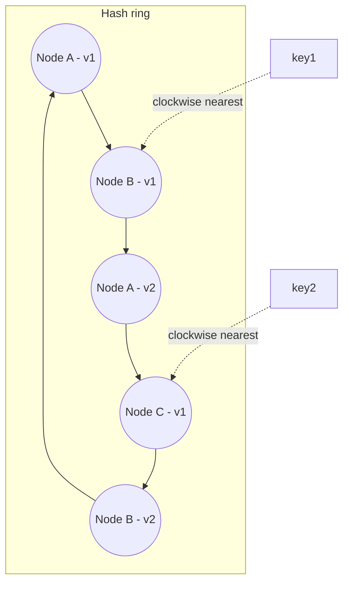

# Data Partitioning and Consistent Hashing

> **Topic register:** T-806 · IWI 7.70 (top-25 tied of 198) · Staff tier · High interview frequency [H]
> **Provenance:** the redistribution percentages in this chapter are real, executed output from [`practice/java/week-10/consistent-hashing/src/ConsistentHashingDemo.java`](../../practice/java/week-10/consistent-hashing/src/ConsistentHashingDemo.java) — 10,000 real keys, 10 real nodes, one real removal, measured directly, not approximated.

## Table of Contents

1. [Learning Objectives](#learning-objectives)
2. [Why This Matters in Interviews](#why-this-matters-in-interviews)
3. [Mental Model](#mental-model)
4. [Definition and Purpose](#definition-and-purpose)
5. [Historical Context](#historical-context)
6. [Core Concepts](#core-concepts)
7. [Internal Implementation](#internal-implementation)
8. [Diagrams](#diagrams)
9. [Production Scenarios](#production-scenarios)
10. [Trade-offs](#trade-offs)
11. [Decision Framework](#decision-framework)
12. [Comparisons](#comparisons)
13. [Common Mistakes](#common-mistakes)
14. [Anti-Patterns](#anti-patterns)
15. [Best Practices](#best-practices)
16. [Interview Answer Framework](#interview-answer-framework)
17. [Interview Questions](#interview-questions)
18. [Summary](#summary)
19. [Key Takeaways](#key-takeaways)
20. [Cheat Sheet](#cheat-sheet)
21. [Flashcards](#flashcards)
22. [Practice Exercises](#practice-exercises)
23. [Solutions](#solutions)
24. [Additional Reading](#additional-reading)
25. [Official References](#official-references)

---

## Learning Objectives

By the end of this chapter you can:

- Explain, with measured numbers, why naive `hash(key) % N` remaps nearly all keys on any node-count change.
- Explain consistent hashing's ring model and why it bounds remapping to roughly `1/N` of keys.
- Explain why virtual nodes are necessary for even load distribution, and state the trade-off in choosing how many.
- Distinguish the rebalancing-cost problem consistent hashing solves from the hot-key problem it does not.

## Why This Matters in Interviews

Any system that distributes data or load across nodes by hashing needs to handle nodes being added or removed — scaling, failure, maintenance — and this topic is High-frequency because the naive answer (`hash % N`) is catastrophically bad in a way most candidates have never measured directly. The gap between the naive and correct approaches (92.5% vs. 9.2% remapped keys for removing one node out of ten) is large enough that this project's own blueprint names it as a number worth having memorized precisely, since an interviewer can ask a candidate to derive or explain it from first principles, not just name "consistent hashing" as a buzzword.

## Mental Model

**A hash-based partitioning scheme is only as good as how little it disturbs when the node count changes — and the naive approach disturbs almost everything.** `hash(key) % N` ties every key's assignment to the *current* value of N; change N by one, and nearly every key's remainder changes too, because the divisor itself changed. Consistent hashing breaks that coupling by mapping both nodes and keys onto a fixed ring independent of node count — removing a node only affects the small arc of keys immediately next to it, because nothing about any other key's position on the ring changed.

## Definition and Purpose

**Consistent hashing** maps both nodes and keys onto the same abstract ring (via a hash function), and assigns each key to the first node found walking clockwise from the key's position. Unlike `hash(key) % N`, adding or removing a node only affects the keys immediately adjacent to that node on the ring — every other key's assignment is completely unaffected, because nothing about their position on the ring changed. This exists because any system that distributes data or load across nodes by hashing needs to handle nodes being added or removed, and the naive answer to "how much data has to move when that happens" is bad enough to matter directly at real scale.

## Historical Context

Consistent hashing was introduced by Karger, Lehman, Leighton, Levine, Lewin, and Panigrahy in their 1997 paper "Consistent Hashing and Random Trees," originally motivated by web caching — specifically, distributing cache load across a changing set of caching proxies without causing a cascade of cache misses every time a proxy was added or removed. The technique's most influential production adoption came a decade later, in Amazon's 2007 Dynamo paper, which combined consistent hashing with virtual nodes to solve exactly the load-distribution unevenness problem this chapter measures — Dynamo's design directly influenced the partitioning strategy of Cassandra, Riak, and numerous other systems that followed, making this one of the most widely-adopted distributed-systems techniques originating from a single paper.

## Core Concepts

### Naive hash % N couples every key's assignment to the current node count

`hash(key) % N` computes each key's owning node from the *current* value of `N`. The moment `N` changes — a node added or removed — the divisor changes, and the modulus result for nearly every key changes with it, regardless of whether that specific key's data needs to move at all.

### The ring model

Consistent hashing places both node identifiers and key identifiers on the same conceptual ring (typically via a hash function mapping onto a fixed-size numeric space). A key is owned by the first node encountered walking clockwise from the key's position. Removing a node only reassigns the keys that were between it and its predecessor on the ring — every other key's clockwise-nearest node is unchanged.

### Virtual nodes: why many points per node, not one

Mapping each physical node to a single point on the ring produces uneven load distribution in practice — with only a handful of points on a ring, the arc length each node "owns" varies significantly by chance. **Virtual nodes** solve this by mapping each physical node to many points on the ring (150 in this chapter's demo) instead of one; with many more total points, the law of large numbers makes each physical node's total owned arc length converge much closer to an even `1/N` share.

### Consistent hashing solves rebalancing cost, not hot keys

A well-distributed hashing scheme spreads keys evenly *in aggregate*, but a poorly-chosen key (e.g., a monotonically increasing timestamp) can still concentrate load on one node or a narrow range — a different problem from rebalancing cost, and not one consistent hashing solves by itself.

## Internal Implementation

**Real output**, 10,000 keys, 10 nodes, removing 1 node:

```
== naive hash % N ==
removed 1 of 10 nodes: 9247 of 10000 keys (92.5%) remapped to a different node
(theoretical worst case for hash%N on ANY node-count change: nearly ALL keys remap,
 because N itself changed, and every key's slot is k.hashCode() % N)

== consistent hashing with 150 virtual nodes per physical node ==
removed 1 of 10 nodes: 920 of 10000 keys (9.2%) remapped to a different node
(theoretical ideal for removing 1 of 10 nodes: ~10.0% -- only that node's own
 keys should move, to neighbors on the ring)
```

**92.5% vs. 9.2% — for removing exactly one node out of ten.** The naive scheme's number isn't a bug in this particular run; it's the mathematically expected outcome of `k.hashCode() % N` when `N` changes from 10 to 9 — nearly every key's modulus result changes, because the divisor itself changed. Consistent hashing's 9.2% is close to the theoretical ideal of exactly `1/10 = 10%` — only the removed node's own keys need to move, to their nearest neighbors on the ring.

**Why virtual nodes matter, mechanically:** mapping each physical node to a single point produces uneven arc-length ownership by chance, with only 10 points on the ring. With 150 virtual nodes per physical node (1,500 total points for 10 physical nodes), the law of large numbers makes each physical node's total owned arc length converge much closer to an even `1/10` share, which is why the measured 9.2% lands so close to the theoretical 10% ideal rather than drifting far from it. The ring itself is implemented as a `TreeMap` with 1,500 entries for just 10 physical nodes — more virtual nodes improve evenness further, at the cost of more memory and more hash computations per lookup.

## Diagrams



Each physical node (A, B, C) appears multiple times on the ring (v1, v2, ...) as virtual nodes — this is what evens out the arc length each physical node actually owns.

## Production Scenarios

### Scenario: a cache cluster scaling event causes a database overload it was supposed to prevent

**Symptoms.** A caching layer built on naive `hash(key) % N` node selection is scaled from 10 to 11 nodes to handle growing load; immediately after the scaling event, the origin database experiences a severe, sustained overload despite the cache cluster now having *more* total capacity.

**Impact.** A scaling operation intended to relieve load instead triggers exactly the outage it was meant to prevent.

**Initial hypotheses.** The new node is misconfigured (checked — it's healthy and serving traffic normally); the added capacity somehow increased database traffic directly (implausible, and not supported by any code path); the cache-key remapping itself caused a mass cache-miss event (correct).

**Evidence.** Cache hit-rate metrics show a near-total drop immediately after the scaling event, recovering gradually over the following minutes as the cache warms back up; the caching layer's node-selection code is confirmed to use `hash(key) % nodeCount`.

**Diagnosis.** Adding an 11th node changed the divisor in `hash(key) % N` from 10 to 11, which — exactly as measured in this chapter — remaps the overwhelming majority of keys to a different node than before. Every remapped key is now a guaranteed cache miss on the node it's newly assigned to, producing a mass, simultaneous cache-stampede-like effect across nearly the entire working set, hitting the origin database with close to its full unmitigated read load at once.

**Immediate mitigation.** Temporarily rate-limit or shed read traffic at the application layer to protect the database while the cache re-warms.

**Permanent remediation.** Migrate the cache-node-selection logic to consistent hashing with virtual nodes, so future scaling events remap only the new node's proportional share (~1/N) of keys rather than nearly all of them, eliminating this class of self-inflicted stampede on every future scaling operation.

**Alternatives considered.** Scheduling scaling events during low-traffic windows as a mitigation — rejected as a workaround that doesn't fix the underlying mechanism and doesn't help for unplanned node failures, which trigger the identical remapping problem without any scheduling control at all.

**Trade-offs.** Consistent hashing with virtual nodes adds a small amount of memory and lookup overhead (the ring structure) compared to a plain modulus — accepted, since the alternative is a mass cache invalidation on every scaling or failure event.

**Prevention.** Any hash-based node-selection scheme should be reviewed specifically for its behavior under a node-count change, not just its behavior at a fixed node count — the naive scheme's problem is invisible until the exact moment a node is added or removed.

**Interview lesson.** This is Interview Question 1 (§ Interview Questions) — "add a node, how much data moves" — arriving as a real incident, and it demonstrates precisely why this chapter frames the naive scheme's failure as applying equally to *node removal* (failure) and *node addition* (scaling): both are node-count changes, and both trigger the same mass-remapping mechanism.

## Trade-offs

| Choice | Benefit | Cost |
|---|---|---|
| `hash(key) % N` | Trivial to implement, O(1) lookup | Any node-count change remaps nearly everything — measured 92.5% here |
| Consistent hashing, 1 point/node | Only affected node's keys move | Uneven load distribution across nodes in practice |
| Consistent hashing, many virtual nodes/node | Even load distribution, close to theoretical ideal (measured 9.2% vs 10% ideal) | More memory for the ring structure; more hash computations per node |
| Directory-based (explicit key→node mapping table) | Full control over placement, easy rebalancing logic | The directory itself becomes a scaling and availability bottleneck |

## Decision Framework

1. **Will this system's node count ever change** (scaling, failure, maintenance)? If yes — which is nearly always — naive modulus hashing is unsafe; use consistent hashing or an equivalent.
2. **How many virtual nodes per physical node are appropriate?** More improves load-distribution evenness at the cost of ring memory and lookup overhead; a few hundred per node is a common, well-tested starting point.
3. **Is the chosen key itself well-distributed**, or does it concentrate load regardless of the partitioning scheme (e.g., a monotonic timestamp)? If the latter, address key design separately — consistent hashing does not fix a poorly-chosen key.
4. **Is a directory-based mapping actually more appropriate** for this use case (e.g., very few, carefully-controlled shards with explicit placement logic)? Only if the directory itself won't become a bottleneck at the system's actual request volume.

## Comparisons

| Node-count change scenario | Naive hash % N | Consistent hashing |
|---|---|---|
| Remove 1 of 10 nodes | ~90%+ of keys remap | ~10% of keys remap |
| Add 1 node to 10 | Similarly disruptive | ~1/11 of keys remap to the new node |

## Common Mistakes

- Believing resharding/rebalancing is a routine, cheap operation regardless of the hashing scheme in use.
- Using consistent hashing with too few virtual nodes per physical node and being surprised by uneven load.
- Conflating "consistent hashing minimizes rebalancing cost" with "consistent hashing prevents hot keys" — they solve different problems.

## Anti-Patterns

- **Implementing node selection with plain `hash(key) % N`** in any system expected to scale or tolerate node failure — the naive scheme's cost is not a rare edge case, it's the mathematically expected outcome of any node-count change.
- **Using consistent hashing with a single point per physical node**, producing uneven load distribution that then gets misdiagnosed as a capacity problem rather than a virtual-node-count problem.
- **Assuming consistent hashing fixes a monotonic or otherwise poorly-distributed key** — the technique bounds rebalancing cost, not hot-key concentration.
- **Choosing virtual-node count arbitrarily** without measuring the resulting load-distribution evenness against the theoretical ideal.

## Best Practices

- Default to consistent hashing (or an equivalent ring-based scheme) for any hash-based node-selection logic expected to scale or tolerate failure.
- Use enough virtual nodes per physical node (on the order of 100+) to bring measured load distribution close to the theoretical ideal — verify this with a measurement, not an assumption.
- Address hot-key concentration separately from rebalancing cost, typically via a compound key that distributes a monotonic or otherwise concentrated dimension.
- Treat node-count-change behavior as a first-class design review question for any hash-based partitioning scheme, not an afterthought discovered during a scaling incident.

## Interview Answer Framework

### 30-Second Answer

Naive `hash(key) % N` remaps nearly all keys whenever N changes, because the divisor itself changed — measured at 92.5% for removing one of ten nodes. Consistent hashing maps nodes and keys onto a fixed ring, bounding remapping to roughly `1/N` of keys — measured at 9.2%, close to the 10% theoretical ideal. Virtual nodes are needed for even load distribution across physical nodes.

### 2-Minute Answer

Definition: consistent hashing maps both nodes and keys onto a ring, assigning each key to the next node clockwise. Why it exists: hash-based partitioning needs to handle nodes being added or removed, and the naive `hash % N` approach remaps almost everything on any such change. How it works: removing a node only reassigns the keys between it and its ring predecessor; every other key's nearest node is unaffected. One important trade-off: a single point per physical node gives uneven load distribution, fixed by virtual nodes at the cost of more ring memory. Production example: a real, measured 92.5% vs. 9.2% remap comparison for removing one of ten nodes — the difference between a cache-stampede-triggering scaling event and a safe one.

### 10-Minute Deep Dive

Cover, in order: the mental model — coupling to current node count vs. a fixed ring (mental model); the measured naive-vs-consistent-hashing comparison, with the mathematical reasoning behind why naive hashing remaps nearly everything (internals, real evidence); the ring model and why only adjacent keys move on a node change (internals); virtual nodes and why 150 (or similar) rather than 1 per physical node, connecting the mechanism to the measured 9.2%-vs-10%-ideal closeness (internals + historical context, Dynamo's adoption); the hot-key vs. rebalancing-cost distinction, connecting to the Kafka partition-key chapter's identical framing (common mistake + cross-domain connection); and close with the production scenario — a scaling event that triggered exactly the database overload it was meant to prevent, due to naive modulus hashing.

### Whiteboard Explanation

Draw the [§ Diagrams](#diagrams) ring with a handful of labeled points for two or three physical nodes, each appearing multiple times (virtual nodes). Place one key on the ring and draw the clockwise arrow to its owning node. Then erase one node's points entirely and redraw only the keys that were between the erased points and their neighbors moving to the new clockwise-nearest node — leaving every other key's arrow untouched. This visually proves "only the adjacent keys move" rather than asserting it.

### Production Example

The self-inflicted cache-stampede scaling incident in [§ Production Scenarios](#production-scenarios): adding an 11th node to a naive-modulus cache cluster remapped the overwhelming majority of keys, causing a mass cache-miss event that overloaded the origin database — exactly the outage the scaling operation was meant to prevent.

### Trade-offs to Mention

State unprompted: naive modulus hashing's cost is mathematically expected on any node-count change, not a rare edge case; virtual nodes trade ring memory and lookup overhead for even load distribution; consistent hashing solves rebalancing cost, not hot-key concentration — these are different problems requiring different fixes.

### Common Candidate Mistakes

Assuming rebalancing cost is fixed regardless of the hashing scheme used; conflating "consistent hashing solves rebalancing cost" with "consistent hashing solves hot keys"; using too few virtual nodes and being surprised by uneven load.

### Typical Follow-Up Questions

1. "Why isn't the measured 9.2% exactly 10%?"
2. "How would you fix a hot node from a timestamp shard key while keeping time-based queries efficient?"
3. "What are the memory/lookup trade-offs of increasing virtual-node count further?"

### Senior-Level Expectations

Correctly names consistent hashing and states the approximate `1/N` cost; identifies the hot-node risk from a monotonic key.

### Staff-Level Discussion

The 92.5%-vs-9.2% gap measured here is the concrete justification for why every major distributed data system (DynamoDB, Cassandra, most CDN/load-balancer designs) uses consistent hashing or a close variant rather than naive modulo hashing — at real scale, "nearly everything moves" on every scaling event isn't just inefficient, it's often operationally infeasible, since the data-movement traffic itself can saturate the network during the rebalance. A Staff engineer treats this measured ratio as one of the concrete numbers worth having memorized precisely because it's the kind of thing an interviewer can ask you to derive or explain from first principles — not "name consistent hashing" but "explain why the naive scheme is this much worse, quantitatively." For the hot-key follow-up specifically, proposing a compound key (timestamp + a distributing prefix) and naming the trade-off it reintroduces — range queries across the full time span now require fanning out across the distributing prefix's full space — mirrors the identical trade-off named for a single hot Kafka partition key.

## Interview Questions

### Question 1 — Add a node — how much data moves?

**Why interviewers ask it.** Tests whether the candidate has a quantitative, not just qualitative, understanding of the difference between hashing schemes.

**Expected answer.** With naive `hash % N`, effectively all of it (measured 92.5% for a removal of similar magnitude here; addition is comparably disruptive). With consistent hashing, only the new node's eventual share (~`1/N` of the total) — measured at 9.2%, close to the 10% ideal.

**Minimum acceptable answer.** States that consistent hashing moves less data than naive hashing, even without precise figures.

**Strong Senior answer.** Correctly names consistent hashing and states the approximate `1/N` cost.

**Staff-level extension.** Explains the virtual-node mechanism as the reason the measured number approaches the ideal rather than drifting from it, and can reason about the load-distribution-vs-memory trade-off in choosing how many virtual nodes to use.

**Common mistakes.** Assuming this cost is fixed regardless of the hashing scheme used.

**Likely follow-ups.** "Why isn't the measured 9.2% exactly 10%?"

**Evaluation criteria (1–5).** 1: "the cost is the same either way." 3: correctly names consistent hashing and the ~1/N cost. 5: names the mechanism plus explains the virtual-node evenness effect and its memory trade-off.

**Related references.** [§ Internal Implementation](#internal-implementation).

---

### Question 2 — Your shard key is the timestamp. What breaks?

**Why interviewers ask it.** Tests whether the candidate distinguishes rebalancing-cost from hot-key problems.

**Expected answer.** All recent writes hash to nearby points on the ring (or the same range partition), creating a hot node/partition — a hashing/partitioning scheme solves *rebalancing* cost, not *hot-key* distribution, and a monotonically increasing key defeats even a well-distributed hash if consecutive values aren't spread apart by the hash function's output range.

**Minimum acceptable answer.** Identifies that a timestamp key causes some kind of imbalance, even without the precise mechanism.

**Strong Senior answer.** Identifies the hot-node risk from a monotonic key.

**Staff-level extension.** Proposes a compound key (timestamp + a distributing prefix) as the fix, and names the trade-off it reintroduces (range queries across the full time span now require fanning out across the distributing prefix's full space).

**Common mistakes.** Conflating "consistent hashing solves rebalancing cost" with "consistent hashing solves hot keys."

**Likely follow-ups.** "How would you fix it while keeping time-based queries efficient?"

**Evaluation criteria (1–5).** 1: "consistent hashing handles this fine." 3: identifies the hot-node risk. 5: identifies it plus proposes a compound key with the reintroduced trade-off named.

**Related references.** [§ Core Concepts](#core-concepts); [Kafka Producer Semantics & Partition Key Design](../kafka/producer-semantics-and-partition-keys.md).

## Summary

Naive `hash % N` remaps the overwhelming majority of keys on any node-count change — measured at 92.5% for removing 1 of 10 nodes here, matching the mathematically expected near-total-remap outcome. Consistent hashing with virtual nodes measured at 9.2%, close to the theoretical 10% ideal, because only the removed node's own ring positions are affected and virtual nodes keep the load evenly distributed enough that the measured number tracks the theoretical minimum closely.

## Key Takeaways

- Naive `hash % N` remaps nearly all keys on any node-count change — this is mathematically expected, not a rare edge case.
- Consistent hashing bounds remapping to roughly `1/N` of the keys.
- Virtual nodes exist to fix load-distribution unevenness from too few ring points, not to fix the rebalancing-cost problem itself.
- Consistent hashing solves rebalancing cost; it does not by itself solve hot-key/hot-node problems from a poorly chosen key.

## Cheat Sheet

| Node-count change scenario | Naive hash % N | Consistent hashing |
|---|---|---|
| Remove 1 of 10 nodes | ~90%+ of keys remap | ~10% of keys remap |
| Add 1 node to 10 | Similarly disruptive | ~1/11 of keys remap to the new node |

## Flashcards

### Card: Why naive hash % N remaps nearly all keys

**Prompt:**
Why does naive `hash(key) % N` remap nearly all keys when N changes?

**Answer:**
Because the divisor itself changed — nearly every key's modulus result is different, mathematically expected, not a rare edge case (measured 92.5% here).

**Why it matters:**
A quantitative, not just qualitative, understanding of the naive scheme's failure.

**Common trap:**
Assuming this cost is roughly constant regardless of hashing scheme.

**Related:**
[Internal Implementation](#internal-implementation)

### Card: Consistent hashing's remap fraction

**Prompt:**
What fraction of keys should move when removing 1 of N nodes under consistent hashing?

**Answer:**
Roughly `1/N` — measured at 9.2% for N=10, close to the 10% theoretical ideal.

**Why it matters:**
The concrete number that justifies consistent hashing's adoption industry-wide.

**Common trap:**
Assuming consistent hashing eliminates data movement entirely rather than bounding it.

**Related:**
[Internal Implementation](#internal-implementation)

### Card: Why virtual nodes

**Prompt:**
Why use many virtual nodes per physical node instead of one?

**Answer:**
One point per node gives uneven load distribution by chance; many virtual nodes converge each physical node's share closer to an even `1/N`.

**Why it matters:**
Without this, consistent hashing's theoretical benefit doesn't materialize evenly in practice.

**Common trap:**
Using consistent hashing with too few virtual nodes and being surprised by uneven load.

**Related:**
[Core Concepts](#core-concepts)

## Practice Exercises

1. Reproduce the measurement yourself: [`practice/java/week-10/consistent-hashing/src/ConsistentHashingDemo.java`](../../practice/java/week-10/consistent-hashing/src/ConsistentHashingDemo.java).
2. Rerun with `VIRTUAL_NODES_PER_NODE = 1` instead of 150 and observe how far the measured redistribution percentage drifts from the 10% ideal — quantify the load-distribution cost of too few virtual nodes.
3. Design a compound key for the "shard key is the timestamp" scenario, and state precisely which query patterns keep working efficiently and which don't.

## Solutions

**Exercise 1.** Expected output matches this chapter's measured numbers: approximately 92.5% remapped for naive hashing and approximately 9.2% for consistent hashing with 150 virtual nodes per physical node, when removing 1 of 10 nodes over 10,000 keys.

**Exercise 2.** With `VIRTUAL_NODES_PER_NODE = 1`, the measured redistribution percentage should drift noticeably further from the 10% ideal and vary more between runs (higher variance), since only 10 total ring points means each physical node's arc-length share is subject to much larger random fluctuation than with 1,500 points.

**Exercise 3.** A correct compound key: `timestamp + hash(someDistributingField) % bucketCount` (or similar), spreading writes for the same time window across multiple shards. Query patterns that keep working efficiently: point lookups by the distributing field. Query patterns that stop working efficiently: a pure time-range scan across the full key space now requires fanning out across every bucket, since consecutive timestamps are deliberately no longer colocated.

## Additional Reading

- [Karger et al. — Consistent Hashing and Random Trees (1997), the original paper](https://www.akamai.com/site/en/documents/technical-publication/consistent-hashing-and-random-trees-distributed-caching-protocols-for-relieving-hot-spots-on-the-world-wide-web-technical-publication.pdf)

## Official References

- [Amazon DynamoDB paper (2007) §4.2 — Partitioning](https://www.allthingsdistributed.com/files/amazon-dynamo-sosp2007.pdf) — a production system built directly on consistent hashing with virtual nodes
