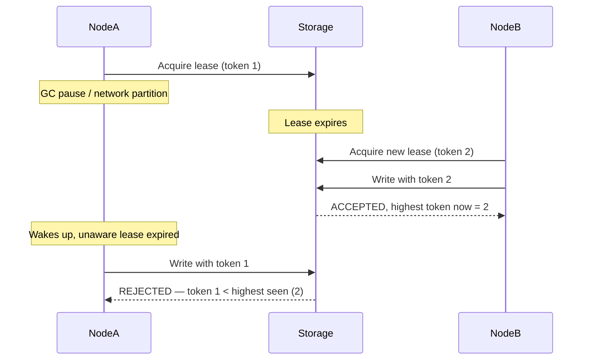

# Distributed Systems Failure Modes

> **Topic register:** T-909 · IWI 8.45 (#3 tied of 198, Mandatory Core) · Staff-Level tier · High interview frequency [H] as a dedicated topic, Near-Certain as follow-up pressure inside design rounds
> **Provenance:** the retry-amplification and fencing-token demonstrations in this chapter are real, executed Java — genuine concurrent thread pools, real measured timing and call counts. Reproducible source: [`practice/java/week-04/failure-modes/src/RetryStormDemo.java`](../../practice/java/week-04/failure-modes/src/RetryStormDemo.java) and [`FencingTokenDemo.java`](../../practice/java/week-04/failure-modes/src/FencingTokenDemo.java).

## Table of Contents

1. [Learning Objectives](#learning-objectives)
2. [Why This Matters in Interviews](#why-this-matters-in-interviews)
3. [Mental Model](#mental-model)
4. [Definition and Purpose](#definition-and-purpose)
5. [Core Concepts](#core-concepts)
6. [Internal Implementation](#internal-implementation)
7. [Diagrams](#diagrams)
8. [Java Examples](#java-examples)
9. [Production Scenarios](#production-scenarios)
10. [Failure Modes and Debugging](#failure-modes-and-debugging)
11. [Trade-offs](#trade-offs)
12. [Decision Framework](#decision-framework)
13. [Comparisons](#comparisons)
14. [Common Mistakes](#common-mistakes)
15. [Anti-Patterns](#anti-patterns)
16. [Best Practices](#best-practices)
17. [Interview Answer Framework](#interview-answer-framework)
18. [Interview Questions](#interview-questions)
19. [Summary](#summary)
20. [Key Takeaways](#key-takeaways)
21. [Cheat Sheet](#cheat-sheet)
22. [Flashcards](#flashcards)
23. [Practice Exercises](#practice-exercises)
24. [Solutions](#solutions)
25. [Additional Reading](#additional-reading)
26. [Official References](#official-references)

---

## Learning Objectives

By the end of this chapter you can:

- Explain precisely why a network timeout is ambiguous, and why that ambiguity is the root cause of most distributed failure modes.
- Reproduce and explain the exact mechanism by which retries without backoff amplify an outage rather than mitigate it.
- Explain why idempotency keys shift the burden of resolving retry ambiguity from the client to the server.
- Explain split-brain and name fencing tokens as the structural fix, including precisely where the check must live.
- Design new distributed-system protocols by asking "what happens if this response is lost, delayed, or duplicated" for every request/response boundary.

## Why This Matters in Interviews

This is the clearest single dividing line between Senior and Staff in a design round: Senior candidates design the happy path competently; Staff candidates design the *failure* path, and do so unprompted. Every distributed system question is ultimately a partial-failure question, and this topic — tied for third-highest IWI in the entire 198-topic register — is where that judgment gets tested most directly, both as a dedicated deep-dive and as unscripted follow-up pressure inside nearly every system design round.

## Mental Model

**A network cannot distinguish "lost," "slow," and "succeeded but the response was lost" — and every mechanism in this chapter is a structural answer to that single ambiguity.** A single-process program either completes a function call or the whole process crashes; there's no in-between state to reason about. Across a network, every one of those in-between states is not just possible but common, and nothing about a timeout tells you which one actually happened. Once this is internalized, retries, idempotency keys, and fencing tokens stop being a memorized list and become three specific, necessary answers to the same underlying fact.

## Definition and Purpose

A **distributed systems failure mode** is any behavior that arises specifically because components communicate over a network rather than within a single process, where failure and mere slowness are indistinguishable from the observer's side. This class of failure exists because a request can be sent, processed successfully, and have its *response* lost — a state with no single-process analogue — and every retry policy, timeout, and idempotency mechanism exists to answer the question that ambiguity creates: what should happen next, given that we don't actually know what happened?

## Core Concepts

### The fundamental ambiguity

The network cannot tell you whether a request was lost, is merely slow, succeeded and the response was lost, or succeeded and is about to arrive. Most failure modes in this domain are direct consequences of this single fact.

### Retry amplification

Retrying a request that is merely slow (not actually failed) adds new load **on top of** the still-running original attempt — it does not replace that load. Under a fixed-capacity downstream, this converts a slow dependency into an outage: more work is queued behind work that was already going to complete eventually, without any offsetting increase in success rate.

### Distinguishing "failed" from "succeeded slowly"

A request that "failed" (the server rejected it, or definitely never received it) is generally safe to retry immediately. A request that "succeeded slowly" (still processing, or completed with a lost response) is not — retrying it while the original is still in flight is exactly the amplification mechanism above. **Idempotency keys** resolve this: if every retried request carries the same key, the server can recognize a retry of an in-flight or already-completed operation and return the original result instead of executing it again — converting "I don't know if that succeeded" into "it's safe to retry regardless," and shifting the burden of resolving the ambiguity from the client to the server.

### Split-brain and fencing tokens

**Split-brain**: two nodes both believe they are the current leader, typically because a paused node (a GC pause, a network partition) has its lease expire without it knowing, while a new leader is elected and begins serving. If the paused node's eventual, now-stale write is accepted by shared storage, it can silently corrupt state — the "leader" designation is a belief held by a node, not a fact verifiable by storage, unless storage is given a way to check it. A **fencing token** is a monotonically increasing number issued with each lease; storage tracks the highest token it has ever accepted and rejects any write carrying an older one. The check must live at the storage/resource layer, never at the nodes themselves — the nodes are exactly the parties whose belief about their own leadership cannot be trusted.

## Internal Implementation

### Retry amplification, measured

A downstream service (capacity 4, degraded to 400ms/unit) receives 12 requests in a burst, client timeout 700ms. Critically, a client giving up does **not** cancel the work already submitted downstream — it keeps running and occupying a slot.

```
--- NO RETRY ---
Elapsed: 708ms, succeeded within SLA: 4/12, total work units submitted to downstream: 12

--- RETRY, NO BACKOFF (immediate resubmit) ---
Elapsed: 2114ms, succeeded within SLA: 4/12, total work units submitted to downstream: 28

--- RETRY, EXPONENTIAL BACKOFF + JITTER ---
Elapsed: 2606ms, succeeded within SLA: 12/12, total work units submitted to downstream: 24
```

**Reading this precisely:** retrying without backoff did not improve the outcome at all — still 4/12 succeeded — while submitting 2.3× the load and taking 3× longer wall-clock. Every retry adds to the queue behind the *original, still-running* attempt rather than replacing it; under a fixed downstream capacity, this is a pure tax with no offsetting benefit. Backoff succeeds (12/12) specifically because the delay between attempts gives the downstream's existing backlog time to drain before the next attempt arrives, and it does so with *less* total amplification (2.0×) than the no-backoff case, because far fewer retries are wasted firing into an already-saturated pool.

### Split-brain and fencing tokens, reproduced

Node A holds a lease (token 1) and pauses (GC pause, network partition) before its write reaches storage. Its lease expires during the pause; Node B acquires a new lease (token 2) and writes correctly. Node A then "wakes up," still unaware its lease expired, and writes its now-stale data.

**Without fencing tokens:**
```
Node B writes: ACCEPTED write with token 2 -> data is now "correct-data-from-node-B"
Node A writes: ACCEPTED write with token 1 -> data is now "stale-data-from-node-A"
Final data: "stale-data-from-node-A"  <-- CORRUPTED by the stale node
```

**With fencing tokens** (storage tracks the highest token it has ever accepted and rejects anything older):
```
Node B writes: ACCEPTED write with token 2 -> data is now "correct-data-from-node-B"
Node A writes: REJECTED write with token 1 (a newer token 2 has already written)
Final data: "correct-data-from-node-B"  <-- correct
```

**What breaks without the fix:** any storage system that accepts writes from whoever currently claims to be the leader, with no way to verify that claim's currency, is vulnerable to exactly this.

## Diagrams



## Java Examples

```java
// Java 21. Exponential backoff with jitter — the fix demonstrated by the
// measured retry-amplification trace above.

public <T> T callWithBackoff(Supplier<T> call, int maxAttempts) throws InterruptedException {
    long baseDelayMs = 100;
    for (int attempt = 1; attempt <= maxAttempts; attempt++) {
        try {
            return call.get();
        } catch (RetriableException e) {
            if (attempt == maxAttempts) throw e;
            long exponential = baseDelayMs * (1L << (attempt - 1));
            long jitter = ThreadLocalRandom.current().nextLong(exponential / 2, exponential + 1);
            Thread.sleep(jitter);
        }
    }
    throw new IllegalStateException("unreachable");
}
```

```java
// Java 21. Idempotency-key handling on the server side — converts "don't
// know if it succeeded" into "safe to retry regardless."

@PostMapping("/payments")
public ResponseEntity<PaymentResult> charge(
        @RequestHeader("Idempotency-Key") String idempotencyKey,
        @RequestBody PaymentRequest request) {

    Optional<PaymentResult> existing = idempotencyStore.find(idempotencyKey);
    if (existing.isPresent()) {
        // A retry of an in-flight or already-completed operation: return the
        // original result instead of charging again.
        return ResponseEntity.ok(existing.get());
    }

    PaymentResult result = paymentGateway.charge(request);
    idempotencyStore.save(idempotencyKey, result); // durable, checked before every charge
    return ResponseEntity.ok(result);
}
```

```java
// Java 21. Fencing-token check at the storage layer — the check belongs
// here, never at the node claiming leadership, since the node's belief
// about its own status is exactly what cannot be trusted.

public synchronized WriteResult write(String key, String value, long token) {
    long highestSeen = highestTokenSeen.getOrDefault(key, -1L);
    if (token < highestSeen) {
        return WriteResult.rejected("token " + token + " < highest seen (" + highestSeen + ")");
    }
    highestTokenSeen.put(key, token);
    store.put(key, value);
    return WriteResult.accepted();
}
```

**Complexity note:** all three mechanisms are `O(1)` per request/write; the value is entirely in correctness under partial failure and concurrent leadership claims, not algorithmic cost.

## Production Scenarios

### Scenario: a downstream dependency's slowdown becomes a cascading multi-service outage

**Symptoms.** A single downstream payment-verification service slows down under unrelated load; within minutes, three unrelated upstream services that call it all report elevated error rates and, shortly after, their own downstream callers begin failing too.

**Impact.** A localized slowdown in one service becomes a multi-service outage.

**Initial hypotheses.** A cascading infrastructure failure (checked — no shared infrastructure issue found); a deploy regression across multiple services simultaneously (checked — no coincident deploys); retry amplification from the payment-verification slowdown (correct).

**Evidence.** Each upstream service's outbound call volume to the payment-verification service is several times higher than its inbound request rate during the incident window, and none of the retry configurations include backoff or jitter — all use immediate, fixed-count retries.

**Diagnosis.** The payment-verification service's slowdown triggered widespread client-side timeouts; every timing-out caller retried immediately without backoff, adding new load on top of still-running original requests, exactly as measured in this chapter's retry-amplification trace — converting a contained slowdown into a load spike large enough to degrade the service further, which triggered more retries, compounding.

**Immediate mitigation.** Manually reduce or disable retries on the affected call paths to stop the amplification loop and let the payment-verification service's backlog drain.

**Permanent remediation.** Add exponential backoff with jitter to every retry policy calling this (and ideally every) downstream dependency, and add a circuit breaker that stops issuing new calls entirely once error rate crosses a threshold, rather than continuing to retry into a degraded dependency indefinitely.

**Alternatives considered.** Simply scaling up the payment-verification service — addresses the symptom for this specific incident but does not fix the retry-amplification mechanism that would reproduce the same cascade against the next slow dependency.

**Trade-offs.** Backoff with jitter increases worst-case latency for an individual retrying request — accepted, since the alternative is amplifying load into an already-struggling dependency.

**Prevention.** A standing requirement that every outbound retry policy in the system uses exponential backoff with jitter and a bounded retry budget, verified in code review and ideally enforced by a shared client library rather than left to individual implementations.

**Interview lesson.** This is Interview Question 1 (§ Interview Questions) — "you added retries and made the outage worse" — arriving as a real, multi-service cascading incident, demonstrating exactly why the mechanism (adding load on top of still-running work) matters beyond a single service's boundary.

## Failure Modes and Debugging

| Symptom | Likely cause | Debugging step |
|---|---|---|
| A slow dependency's problem spreads to multiple unrelated callers | Retry amplification without backoff | Compare each caller's outbound call rate to its inbound request rate during the incident; check for missing backoff/jitter |
| Shared state occasionally contains data that appears to have come from an "impossible" source (a node believed already replaced) | Split-brain — a stale former leader's write was accepted | Check whether the storage layer enforces fencing tokens or any equivalent ordering check |
| A retried request occasionally produces a duplicated side effect (double charge, duplicate record) | No idempotency key, or the server doesn't check it before executing | Add a durable idempotency-key check before performing any non-idempotent action |
| An outage's blast radius keeps growing after the initial trigger resolves | Retry amplification is still in effect, continuing to generate load from earlier failed attempts | Check for retry queues or backlogs that outlive the original triggering condition |

## Trade-offs

| Approach | Benefit | Cost |
|---|---|---|
| No retries | Simple, no amplification risk | Any transient failure becomes a permanent one from the caller's perspective |
| Retry, no backoff | Fast recovery from truly transient blips | Amplifies load precisely when the downstream is already struggling |
| Retry with exponential backoff + jitter | Recovers from real degradation without amplifying it | Slower worst-case latency for the retrying request itself |
| Idempotency keys | Converts "don't know if it succeeded" into "safe to retry regardless" | Requires every mutating endpoint to accept and honor a client-supplied key, and requires storing recent operation results server-side |
| Fencing tokens | Prevents a stale leader from corrupting shared state | Requires every write path to storage to check and enforce token ordering — a design decision, not a bolt-on fix |

## Decision Framework

1. **Does this call path retry on failure?** If yes, does it use exponential backoff with jitter, not immediate or fixed-interval retry?
2. **Is every mutating endpoint idempotent under retry?** If a client might retry (any network call can be retried, deliberately or by a proxy/load balancer), the server needs an idempotency-key mechanism for any operation with a real side effect.
3. **Does this system have a leader-election mechanism?** If so, does the storage layer enforce fencing tokens, or does it trust whichever node claims leadership?
4. **What happens if this specific response is lost, delayed, or duplicated?** Ask this for every request/response boundary in a new design, and build the answer into the protocol rather than relying on operational discipline.
5. **Is there a circuit breaker or bounded retry budget** preventing a single degraded dependency's slowdown from amplifying into a cascading, multi-service outage?

## Comparisons

| Mechanism | Protects against | Where it must live |
|---|---|---|
| Exponential backoff + jitter | Retry amplification turning a slowdown into an outage | Client-side retry logic |
| Idempotency keys | Duplicate side effects from a retried, ambiguous-outcome request | Server-side, checked before executing any non-idempotent action |
| Fencing tokens | Split-brain corruption from a stale former leader's write | Storage/resource layer — never the nodes claiming leadership |
| Circuit breakers | Cascading failure from continuing to call an already-degraded dependency | Client-side, wrapping outbound calls to that dependency |

## Common Mistakes

- Believing a timeout definitively means the request failed rather than merely being ambiguous.
- Adding retries as a default resilience measure without backoff, jitter, or an idempotency mechanism.
- Assuming leader election alone (without fencing) is sufficient to prevent split-brain corruption — election solves "who is elected," not "can a stale former leader still cause damage."

## Anti-Patterns

- **Retrying immediately with no backoff** as a default resilience pattern, without considering the amplification this chapter measures directly.
- **Treating a timeout as equivalent to a definite failure** and retrying unconditionally, even for operations with a real, non-idempotent side effect.
- **Implementing leader election without a corresponding fencing mechanism at the storage layer**, leaving split-brain corruption possible despite the election protocol appearing correct.
- **Trusting a node's own claim of leadership status** at the resource layer, rather than requiring an externally-verifiable, monotonically increasing token.

## Best Practices

- Use exponential backoff with jitter for every retry policy, as a non-negotiable default rather than an optimization.
- Require idempotency keys on every mutating endpoint that could plausibly be retried, and check them before performing the action, not after.
- Enforce fencing tokens at the storage/resource layer for any system with leader election, regardless of how well-tested the election protocol itself is.
- Pair retries with a circuit breaker and a bounded retry budget, so a single degraded dependency cannot amplify into a cascading outage.
- Design new distributed protocols by explicitly asking, for every request/response boundary, "what happens if this response is lost, delayed, or duplicated."

## Interview Answer Framework

### 30-Second Answer

A network can't distinguish "lost," "slow," and "succeeded but the response was lost." Retries without backoff amplify an outage because they add load on top of still-running original attempts rather than replacing it. Idempotency keys and fencing tokens are the structural fixes for retry ambiguity and split-brain, respectively — not operational tuning, but protocol decisions.

### 2-Minute Answer

Definition: distributed failure modes arise because network communication introduces ambiguous, in-between states a single process never has. Why it exists: a request can succeed and have its response lost, indistinguishable from the request itself being lost. How it works: naive retries add load on top of still-in-flight original attempts, amplifying an already-degraded downstream; idempotency keys let a server recognize a retry and return the original result instead of re-executing; fencing tokens let storage reject a stale leader's write. One important trade-off: backoff with jitter increases worst-case latency for the retrying request itself, in exchange for not amplifying load into a struggling dependency. Production example: a measured retry trace showing that retries without backoff cost 2.3× the load and 3× the time for the *same* 4/12 success rate as no retries at all — while backoff achieved 12/12 success with less amplification than the no-backoff case.

### 10-Minute Deep Dive

Cover, in order: the fundamental network ambiguity as the root cause of everything in this chapter (mental model); the measured retry-amplification trace, with the precise reading of why backoff succeeds and no-backoff doesn't just fail to help but actively costs more (internals, real evidence); the failed-vs-succeeded-slowly distinction and why it's the reason idempotency keys matter more than the retry policy itself (edge case); the split-brain scenario and fencing-token reproduction, including exactly where the check must live and why (failure mode + fix); and close with the production scenario — a single slow dependency's retry amplification cascading into a multi-service outage, the same mechanism measured in isolation now shown at systemic scale.

### Whiteboard Explanation

Draw a timeline for one downstream request: a box for "submitted," extending in width to represent processing time, with a vertical line marking the client's timeout partway through the box — label the region after the timeout line but still inside the box "still running, not cancelled." Then draw a second, retried request starting at the timeout line, its own box overlapping the tail of the first — visually, the two boxes stack rather than one replacing the other. This is the image that makes "retries add rather than replace load" self-evident.

### Production Example

The cascading multi-service outage in [§ Production Scenarios](#production-scenarios): a single payment-verification service's slowdown triggered widespread client-side timeouts, and immediate retries without backoff amplified load into the already-struggling dependency, spreading the failure to three unrelated upstream services within minutes.

### Trade-offs to Mention

State unprompted: retries without backoff add load rather than replacing it, with no offsetting success-rate benefit; idempotency keys shift the burden of resolving retry ambiguity from client to server; fencing tokens must be enforced at the storage layer, never trusted from the node claiming leadership.

### Common Candidate Mistakes

A vague "retries added more load" without the specific claim that the original request's work is not cancelled; treating all timeouts as equivalent to definite failures; describing split-brain but not naming fencing tokens as the fix when asked.

### Typical Follow-Up Questions

1. "How does backoff fix the retry-amplification problem, precisely?"
2. "How does an idempotency key resolve the failed-vs-succeeded-slowly ambiguity?"
3. "What's a fencing token, precisely, and where does the check happen?"

### Senior-Level Expectations

Correctly identifies that retries add rather than replace load; states the failed-vs-succeeded-slowly distinction and its consequence; describes the split-brain scenario correctly.

### Staff-Level Discussion

Every mechanism in this chapter — backoff, idempotency keys, fencing tokens — is a structural answer to the same underlying fact: a distributed system cannot get instantaneous, certain knowledge of another component's state. A Staff-level engineer designing a new distributed component asks, for every request/response boundary, "what happens if this response is lost, delayed, or duplicated," and builds the answer into the protocol rather than trusting operational discipline (careful retry tuning, hoping leader transitions are clean) to paper over it after the fact.

## Interview Questions

### Question 1 — You added retries and made the outage worse. Explain the mechanism precisely.

**Why interviewers ask it.** Distinguishes candidates who've internalized the additive nature of retry load from those who only know "retries can sometimes be bad."

**Expected answer.** Retries add to the queue behind still-running original attempts rather than replacing them, amplifying load on an already-degraded downstream with no offsetting success-rate benefit (measured: 4/12 succeeded either way, but no-backoff cost 2.3× the load and 3× the time).

**Minimum acceptable answer.** States that retries can make things worse under load, even without the precise additive mechanism.

**Strong Senior answer.** Correctly identifies that retries add rather than replace load.

**Staff-level extension.** Cites the specific real numbers (or reproduces them) and explains why backoff reduces total amplification, not just total latency.

**Common mistakes.** A vague "retries added more load" without the specific claim that the original request's work is not cancelled by the client giving up.

**Likely follow-ups.** "How does backoff fix this, precisely?"

**Evaluation criteria (1–5).** 1: "retries are risky sometimes." 3: correctly states retries add rather than replace load. 5: states the mechanism plus cites or reproduces the measured amplification numbers.

**Related references.** [§ Internal Implementation](#internal-implementation); [§ Production Scenarios](#production-scenarios).

---

### Question 2 — How do you distinguish "the request failed" from "the request succeeded slowly," and why does it matter?

**Why interviewers ask it.** Tests whether the candidate understands why idempotency, not just retry policy, is the actual fix for retry safety.

**Expected answer.** The server-side response was lost, or is merely delayed, versus a genuine failure; it matters because retrying an in-flight or completed operation without idempotency protection can duplicate its effect.

**Minimum acceptable answer.** States that timeouts are ambiguous, even without connecting it to idempotency.

**Strong Senior answer.** States the distinction and its consequence (risk of duplication on naive retry).

**Staff-level extension.** Names idempotency keys as the structural fix, explaining specifically how they shift the burden of resolving the ambiguity from the client to the server.

**Common mistakes.** Treating all timeouts as equivalent to failures.

**Likely follow-ups.** "How does an idempotency key resolve this ambiguity?"

**Evaluation criteria (1–5).** 1: "a timeout means it failed." 3: states the distinction and its risk. 5: distinction plus idempotency-key mechanism explained.

**Related references.** [§ Core Concepts](#core-concepts); [§ Java Examples](#java-examples).

---

### Question 3 — Two nodes both believe they are leader. How, and what breaks?

**Why interviewers ask it.** Tests whether the candidate can reason about leadership as a belief rather than a verifiable fact, and knows the structural fix.

**Expected answer.** A paused node's lease expires without it knowing, a new leader is elected, and the stale node's eventual write, if accepted, corrupts shared state.

**Minimum acceptable answer.** Describes a plausible split-brain scenario, even without naming the fix.

**Strong Senior answer.** Describes the split-brain scenario correctly.

**Staff-level extension.** Names fencing tokens, states precisely where the check must live (the storage/resource layer, not the nodes themselves), and can point to the real reproduction's exact reject condition (`token < highestTokenSeen`).

**Common mistakes.** Describing the scenario but not naming the fix (fencing tokens) when asked.

**Likely follow-ups.** "What's a fencing token, precisely, and where does the check happen?"

**Evaluation criteria (1–5).** 1: no scenario or fix. 3: correct scenario description. 5: scenario plus fencing tokens plus the precise storage-layer placement.

**Related references.** [§ Internal Implementation](#internal-implementation); [§ Java Examples](#java-examples).

## Summary

Distributed failure modes stem from one fact: a network cannot distinguish "lost," "slow," and "succeeded but the response was lost." Retries without backoff amplify load onto an already-degraded system with no success-rate benefit — reproduced with real numbers (4/12 succeeded either way, at 2.3× the cost without backoff, 12/12 succeeded with it). Split-brain — two nodes both believing they're the leader — is real and corrupts shared state unless storage itself enforces a fencing token, since node belief about leadership cannot be trusted by the resource it's writing to.

## Key Takeaways

- A timeout is ambiguous — "failed" and "succeeded slowly" are indistinguishable without more information.
- Retries add load on top of still-running original attempts; they do not replace that load.
- Idempotency keys convert response ambiguity into safe-to-retry-regardless, shifting the resolution to the server.
- Split-brain is prevented by fencing tokens enforced at the storage layer, not by better leader election alone.
- Every fix in this chapter is a structural protocol decision, not an operational tuning knob.

## Cheat Sheet

| Situation | What to reach for |
|---|---|
| Any outbound retry policy | Exponential backoff with jitter, always — never immediate/fixed-interval |
| A mutating endpoint that could be retried | An idempotency-key check before performing the side effect |
| A system with leader election | Fencing tokens enforced at the storage layer, never trusted from the node |
| A dependency showing elevated errors | A circuit breaker to stop amplifying calls into it |
| Designing a new request/response boundary | Ask explicitly: what happens if this response is lost, delayed, or duplicated? |

## Flashcards

### Card: Why a timeout is ambiguous

**Prompt:**
Why is a network timeout ambiguous?

**Answer:**
It can't distinguish "request lost," "still processing," and "succeeded but the response was lost."

**Why it matters:**
The root cause of nearly every failure mode in this domain.

**Common trap:**
Treating a timeout as definite proof the request failed.

**Related:**
[Core Concepts](#core-concepts)

### Card: How retries amplify an outage

**Prompt:**
Precisely how do retries amplify an outage?

**Answer:**
They add new work on top of the still-running original attempt rather than replacing it, multiplying load on an already-degraded system.

**Why it matters:**
The exact, measured mechanism — not a vague "retries are risky" statement.

**Common trap:**
Assuming a client giving up cancels the work already submitted downstream.

**Related:**
[Internal Implementation](#internal-implementation)

### Card: What fixes retry safety structurally

**Prompt:**
What structurally fixes the retry-safety problem?

**Answer:**
Idempotency keys — the server recognizes a retried operation and returns the original result instead of re-executing it.

**Why it matters:**
Shifts the burden of resolving retry ambiguity from the client to the server.

**Common trap:**
Believing better retry-policy tuning alone (without idempotency) is sufficient.

**Related:**
[Java Examples](#java-examples)

### Card: What prevents split-brain corruption

**Prompt:**
What structurally prevents split-brain corruption?

**Answer:**
A fencing token, enforced at the storage/resource layer, rejecting any write carrying an older token than one already accepted.

**Why it matters:**
Leader election alone only decides who is elected, not whether a stale former leader can still cause damage.

**Common trap:**
Assuming leader election alone is sufficient to prevent split-brain.

**Related:**
[Internal Implementation](#internal-implementation)

## Practice Exercises

1. Reproduce the retry-storm demo yourself: [`practice/java/week-04/failure-modes/src/RetryStormDemo.java`](../../practice/java/week-04/failure-modes/src/RetryStormDemo.java). Tune the parameters (capacity, work time, timeout) and observe how the amplification factor changes.
2. Reproduce the fencing-token demo: [`FencingTokenDemo.java`](../../practice/java/week-04/failure-modes/src/FencingTokenDemo.java). Modify it to allow a second stale node to attempt a write after the fencing fix, and confirm it's also rejected.
3. Design an idempotency-key mechanism for a payment endpoint: where is the key generated, how long is a result cached server-side, what happens on a key collision with different request parameters?

## Solutions

**Exercise 1.** Expected result: reducing downstream capacity or increasing burst size widens the gap between no-backoff (still low success rate, high amplification) and backoff-with-jitter (recovers most/all requests, lower amplification than no-backoff) — the qualitative pattern in this chapter holds across parameter changes, though exact numbers shift.

**Exercise 2.** A second stale node with an even older token (or the same rejected token) should also be rejected by the same `token < highestTokenSeen` check — confirming the fix generalizes to any number of stale writers, not just the specific two-node scenario originally demonstrated.

**Exercise 3.** A correct design: the key is generated client-side, ideally a UUID scoped to one logical payment attempt (not regenerated on retry); the server stores the key and its result for a bounded window (long enough to cover realistic client retry timeouts, e.g., 24 hours); on a collision with different request parameters, the server rejects the request as a client error, since the same idempotency key must correspond to the same logical operation — silently applying it to different parameters would defeat the entire mechanism's purpose.

## Additional Reading

- Martin Kleppmann, *Designing Data-Intensive Applications*, Chapter 8, "The Trouble with Distributed Systems" (the fencing-token example in this chapter follows Kleppmann's original)
- AWS Builders' Library — ["Timeouts, retries, and backoff with jitter"](https://aws.amazon.com/builders-library/timeouts-retries-and-backoff-with-jitter/)

## Official References

- [Stripe API documentation — Idempotent requests](https://stripe.com/docs/api/idempotent_requests) — a widely-cited real-world idempotency-key implementation
