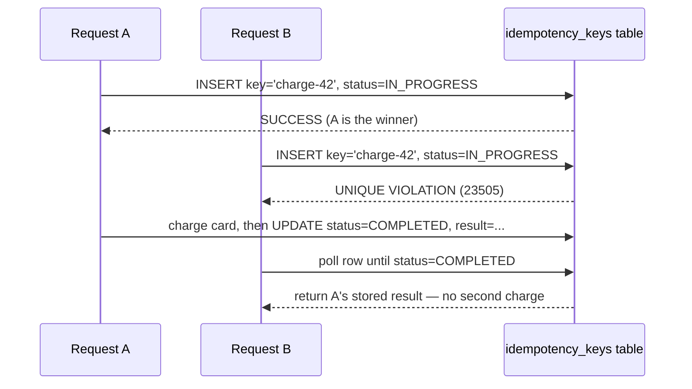

# Idempotency at System Edges

> **Topic register:** T-809 · IWI 8.09 (top-25 of 198) · Advanced tier · High interview frequency [H] · The structural fix to the retry-ambiguity problem
> **Provenance:** the full mechanism in this chapter is real, executed Java against real PostgreSQL 16 — genuine concurrent threads, a real unique-constraint race, and real TTL-based recovery. Reproducible source: [`practice/java/week-05/idempotency/src/IdempotencyDemo.java`](../../practice/java/week-05/idempotency/src/IdempotencyDemo.java).

## Table of Contents

1. [Learning Objectives](#learning-objectives)
2. [Why This Matters in Interviews](#why-this-matters-in-interviews)
3. [Mental Model](#mental-model)
4. [Definition and Purpose](#definition-and-purpose)
5. [Core Concepts](#core-concepts)
6. [Internal Implementation](#internal-implementation)
7. [Diagrams](#diagrams)
8. [Java Examples](#java-examples)
9. [Production Scenarios](#production-scenarios)
10. [Failure Modes and Debugging](#failure-modes-and-debugging)
11. [Trade-offs](#trade-offs)
12. [Decision Framework](#decision-framework)
13. [Common Mistakes](#common-mistakes)
14. [Anti-Patterns](#anti-patterns)
15. [Best Practices](#best-practices)
16. [Interview Answer Framework](#interview-answer-framework)
17. [Interview Questions](#interview-questions)
18. [Summary](#summary)
19. [Key Takeaways](#key-takeaways)
20. [Cheat Sheet](#cheat-sheet)
21. [Flashcards](#flashcards)
22. [Practice Exercises](#practice-exercises)
23. [Solutions](#solutions)
24. [Additional Reading](#additional-reading)
25. [Official References](#official-references)

---

## Learning Objectives

By the end of this chapter you can:

- Design a complete idempotency mechanism: key, storage, concurrent-duplicate handling, and TTL-based crash recovery.
- Explain why the database's own unique constraint — not application-level locking — is what makes concurrent duplicate handling correct.
- State the correct client behavior when a response never arrives, and why it's safe specifically because of the server-side mechanism.
- Explain why idempotency keys are an instance of the broader pattern of moving ambiguity resolution to the party with the most information.

## Why This Matters in Interviews

Idempotency is the structural fix to the retry-ambiguity problem established in [Distributed Systems Failure Modes](distributed-systems-failure-modes.md) — a network cannot tell a client whether its request was lost, is still processing, or succeeded with a lost response. This topic is High-frequency because it is the concrete, implementable answer interviewers expect once that ambiguity is named, and because "make this endpoint idempotent" is a common, precise system design and coding-adjacent request that tests whether a candidate can move from an abstract distributed-systems concept to a specific, correct schema and concurrency design.

## Mental Model

**An idempotency key turns "I don't know if that succeeded" into "it doesn't matter — ask again and you'll get the same answer."** The client's problem (ambiguity about outcome) and the server's problem (a request might be a genuine retry of an already-handled operation) are the same problem viewed from two sides. The key insight this chapter is built around: the client can never resolve this ambiguity on its own, because it structurally lacks the information to; the server can, because it's the one party that would have actually executed the side effect. Idempotency keys work by moving the resolution entirely to the side that has ground truth.

## Definition and Purpose

An operation is **idempotent** if performing it multiple times produces the same result — and, critically for distributed systems, the same *side effect* — as performing it once. A client-supplied **idempotency key** attached to a request lets the server recognize "I have already handled this exact logical request" and return the original result instead of re-executing the operation, even though the request arrived again (a retry) with no way for the client or server to know for certain whether the first attempt actually completed. This exists to directly answer the unresolved question from distributed failure modes: a network cannot distinguish "the request was lost," "it's still processing," and "it succeeded but the response was lost." Idempotency keys don't resolve that ambiguity for the client — they make the ambiguity *safe to retry through* by moving the resolution to the server.

## Core Concepts

### The three-part mechanism

**Key:** a client-generated unique identifier for one logical operation (e.g., one checkout attempt), sent with every retry of that same logical operation. **Storage:** a table keyed on that identifier, with a `UNIQUE` constraint doing the actual coordination work — not application-level locking. **TTL:** a recovery mechanism so a crashed in-progress attempt cannot permanently block all future retries of that key.

### Why the database's unique constraint, not application locking

Two threads submitting the *same* idempotency key at (almost) the same instant both attempt an insert; the database's unique constraint guarantees exactly one insert succeeds — this is precisely what a primary key/unique constraint is for, and it requires no application-level lock, no distributed lock service, and no race condition of its own. Application-level locking (a `synchronized` block, an in-memory map) would introduce exactly the kind of race the database constraint eliminates for free, and wouldn't coordinate across multiple application instances at all.

### Client behavior under ambiguity

The client cannot distinguish "never received a response" from every other failure mode a network can produce — so it does the only safe thing: **retry with the same idempotency key.** This is the entire point of the mechanism: the client's correct behavior on ambiguous failure is unconditional retry-with-same-key, because the server-side mechanism guarantees that retry is safe regardless of whether the original request actually succeeded, is still in flight, or never arrived at all.

## Internal Implementation

**Storage schema:**

```sql
CREATE TABLE idempotency_keys (
  key TEXT PRIMARY KEY,
  status TEXT NOT NULL,   -- 'IN_PROGRESS' or 'COMPLETED'
  result TEXT,
  created_at TIMESTAMP NOT NULL DEFAULT now()
);
```

**Concurrent-duplicate behavior — real, measured:** two threads submit the *same* idempotency key at (almost) the same instant.

```
Request A result: charged $50.00, confirmation #49940811261291
Request B result: charged $50.00, confirmation #49940811261291
Actual charges performed: 1 (must be exactly 1)
Both requests returned the same result: true
```

**How it works:** both attempt `INSERT INTO idempotency_keys (key, status) VALUES (?, 'IN_PROGRESS')`. The database's unique constraint guarantees exactly one insert succeeds. The winner performs the actual charge and updates the row to `COMPLETED` with the result. The loser catches the unique-violation (`SQLState 23505`), polls the row briefly, and once it sees `COMPLETED`, returns the *same* stored result — never re-executing the charge.

**TTL — real, measured:** an `IN_PROGRESS` row from a request that crashed before completing must not block every future retry forever.

```
A stale IN_PROGRESS row (age 10s, TTL 5s) exists for key 'charge-key-crashed'.
New request with the same key result: charged $75.00, confirmation #49941065026041
RESULT: the stale IN_PROGRESS row did not block a fresh attempt -- TTL recovery worked.
```

A losing request that finds an `IN_PROGRESS` row older than the TTL treats the original attempt as presumed-dead, deletes the stale row, and retries its own insert — reclaiming the key rather than waiting forever for a process that will never finish.

## Diagrams



## Java Examples

```java
// Java 21. The full idempotency mechanism: key check, unique-constraint
// coordination, and TTL-based recovery from a crashed attempt.

@Transactional
public PaymentResult chargeIdempotent(String idempotencyKey, ChargeRequest request) {
    try {
        jdbcTemplate.update(
            "INSERT INTO idempotency_keys (key, status) VALUES (?, 'IN_PROGRESS')",
            idempotencyKey);
    } catch (DuplicateKeyException e) {
        // Another request (concurrent, or a genuine retry) already owns this key.
        return awaitOrReclaim(idempotencyKey, request);
    }

    // We won the race to own this key — perform the actual side effect.
    PaymentResult result = paymentGateway.charge(request);
    jdbcTemplate.update(
        "UPDATE idempotency_keys SET status = 'COMPLETED', result = ? WHERE key = ?",
        serialize(result), idempotencyKey);
    return result;
}

private PaymentResult awaitOrReclaim(String idempotencyKey, ChargeRequest request) {
    Duration ttl = Duration.ofSeconds(5);
    for (int attempt = 0; attempt < 10; attempt++) {
        IdempotencyRow row = jdbcTemplate.queryForObject(
            "SELECT status, result, created_at FROM idempotency_keys WHERE key = ?",
            this::mapRow, idempotencyKey);

        if ("COMPLETED".equals(row.status())) {
            return deserialize(row.result()); // same result, no re-execution
        }

        boolean staleAndCrashed = Duration.between(row.createdAt(), Instant.now()).compareTo(ttl) > 0;
        if (staleAndCrashed) {
            // The original attempt is presumed dead — reclaim the key.
            jdbcTemplate.update("DELETE FROM idempotency_keys WHERE key = ?", idempotencyKey);
            return chargeIdempotent(idempotencyKey, request); // retry our own insert
        }

        sleepBriefly(); // still genuinely in progress — wait, don't reclaim yet
    }
    throw new IllegalStateException("idempotency key never resolved: " + idempotencyKey);
}
```

**Complexity note:** the mechanism is `O(1)` per request (an insert, and on conflict, a bounded poll loop); the value is entirely in correctness under real concurrency, not algorithmic cost.

## Production Scenarios

### Scenario: a "quick fix" idempotency implementation using an in-memory set fails under horizontal scaling

**Symptoms.** After a service is scaled from one instance to three behind a load balancer, customers occasionally report duplicate charges for the same checkout attempt — a regression that did not exist when the service ran as a single instance.

**Impact.** Direct financial exposure and refund overhead.

**Initial hypotheses.** A client-side double-submit (checked — request logs show a single client request per affected checkout, retried by the client's own network layer); a payment-gateway bug (checked, ruled out); the idempotency implementation itself (correct).

**Evidence.** Code review shows the idempotency check is implemented as an in-memory `ConcurrentHashMap` guarding against duplicate keys — correct for coordinating threads *within* one instance, but each of the three horizontally-scaled instances has its own separate map, with no shared state between them.

**Diagnosis.** A retried request, load-balanced to a different instance than the original attempt, finds no record of the key in that instance's local map and proceeds to charge again — the in-memory approach only ever solved the single-instance case, and horizontal scaling silently broke the guarantee it appeared to provide.

**Immediate mitigation.** Route all requests for a given idempotency key to the same instance via a temporary sticky-routing rule, while the durable fix is developed.

**Permanent remediation.** Replace the in-memory map with the database-unique-constraint mechanism described in this chapter — durable, shared across all instances by construction, since it lives in the database rather than any one process's memory.

**Alternatives considered.** A distributed cache (e.g., Redis) with a `SETNX`-style atomic check — a viable alternative to a relational unique constraint, but the database-backed approach was chosen here since the payment write itself already required a relational transaction, keeping the idempotency check and the side effect in the same transactional boundary.

**Trade-offs.** The database-backed mechanism adds a table and a small amount of write load to every payment attempt — accepted, since the alternative (an in-memory approach that silently fails under horizontal scaling) is a correctness bug waiting to be triggered by any scaling event.

**Prevention.** Any idempotency mechanism proposed in design review should be explicitly checked against horizontal scaling: does this mechanism's state live somewhere shared across all instances, or only within one process's memory?

**Interview lesson.** This is Interview Question 1 (§ Interview Questions) — "make a payment endpoint idempotent, full mechanism" — arriving as a real regression specifically because an incomplete answer (checking "have we seen this key" without specifying *where* that check's state lives) passed code review until horizontal scaling exposed the gap.

## Failure Modes and Debugging

| Symptom | Likely cause | Debugging step |
|---|---|---|
| Duplicate side effects appear only after horizontal scaling | Idempotency check implemented with per-instance state (in-memory map) instead of shared/durable storage | Verify the idempotency mechanism's state lives in a shared store (database, distributed cache), not process memory |
| A retried request hangs or times out waiting for a first attempt that crashed | No TTL, or a TTL longer than the client is willing to wait | Add or shorten the TTL; verify the reclaim path actually deletes and retries |
| Occasional duplicate execution despite an idempotency key being present | Application-level locking used instead of a database unique constraint, and the locking has its own race | Replace application-level locking with a database-enforced unique constraint |
| A legitimate slow (not crashed) operation gets its key reclaimed prematurely | TTL set too short relative to the operation's genuine worst-case duration | Increase TTL to comfortably exceed the slowest legitimate case, or add a heartbeat mechanism for genuinely long operations |

## Trade-offs

| Approach | Benefit | Cost |
|---|---|---|
| No idempotency mechanism | No extra storage or logic | Every ambiguous failure forces a choice between "risk a duplicate" and "risk never completing the operation" |
| Idempotency key + unique constraint | Retries become unconditionally safe | Requires storage for every recent key, a TTL policy, and every mutating endpoint accepting a key |
| Short TTL | Storage doesn't grow unbounded | Risks reusing a key too early if a legitimate operation somehow takes longer than the TTL |
| Long TTL | Very safe against premature reuse | Storage grows proportional to key volume × TTL duration |

## Decision Framework

1. **Does this endpoint have a real side effect that must not be duplicated** (a charge, a resource provisioned, an email sent)? If yes, it needs an idempotency-key mechanism.
2. **Where does the "have we seen this key" check's state live?** It must be shared across every instance that could receive a retry — never process-local memory alone.
3. **What TTL fits this operation's genuine worst-case duration?** Set it comfortably longer than legitimate processing time, but not so long storage grows unbounded.
4. **Is the concurrent-duplicate coordination backed by a database constraint** (or equivalent atomic operation in a shared store), rather than application-level locking?

## Common Mistakes

- Implementing "idempotency" as a client-side check (e.g., disabling a submit button) rather than a server-side, storage-backed mechanism — this doesn't protect against a genuine network retry or a second independent client.
- Using application-level locking instead of the database's own unique constraint, introducing a race the constraint would have closed for free.
- No TTL at all, meaning a crashed in-progress attempt permanently blocks all future retries of that logical operation.

## Anti-Patterns

- **In-memory-only idempotency tracking** that silently breaks the moment the service is scaled horizontally — this chapter's own production scenario.
- **Client-side-only duplicate prevention** (disabling a button, debouncing a request) that provides no protection against a genuine network-level retry or a second independent client submitting the same operation.
- **No TTL**, leaving every future retry of a crashed operation permanently blocked.
- **Treating idempotency as a nice-to-have** rather than a required mechanism for any endpoint with a real, costly side effect.

## Best Practices

- Back the idempotency check with a database unique constraint (or equivalent atomic primitive in a shared store), never application-level locking.
- Verify the mechanism's state is shared across all instances before considering it complete — test explicitly under horizontal scaling.
- Set a TTL comfortably longer than the operation's legitimate worst-case duration, and verify the reclaim path is actually exercised in testing.
- Instruct clients to retry unconditionally with the same key on any ambiguous failure — this is the safe, correct behavior specifically because of the server-side guarantee.

## Interview Answer Framework

### 30-Second Answer

An idempotency key lets a server recognize a retried request and return the original result instead of re-executing it. The mechanism: a client-generated key, a database table with a unique constraint doing the actual coordination, and a TTL so a crashed in-progress attempt doesn't block future retries forever.

### 2-Minute Answer

Definition: an idempotency key attached to a request lets the server recognize "I've already handled this exact logical operation" and return the original result rather than re-executing it. Why it exists: it's the structural answer to a network's inability to distinguish lost, slow, and succeeded-but-response-lost. How it works: both concurrent attempts try to insert the key; the database's unique constraint guarantees exactly one wins; the loser polls until it sees the completed result. One important trade-off: TTL length trades unbounded storage growth against risk of premature key reuse. Production example: a real regression where an in-memory idempotency check worked correctly on a single instance but silently allowed duplicate charges the moment the service was horizontally scaled to three instances, since each instance's map was separate.

### 10-Minute Deep Dive

Cover, in order: the mental model — moving ambiguity resolution to the party with ground truth (mental model); the three-part mechanism, key/storage/TTL (internals); the measured concurrent-duplicate trace showing exactly one charge for two simultaneous requests (internals, real evidence); why the database's own unique constraint, not application locking, is what makes this correct (edge case + common mistake); the TTL-based crash-recovery trace (failure mode + fix); and close with the production scenario — an in-memory idempotency check that silently broke under horizontal scaling, the single most common way this mechanism fails in practice.

### Whiteboard Explanation

Draw the [§ Diagrams](#diagrams) sequence: Request A and Request B both arrow into the `idempotency_keys` table with an `INSERT`; draw one arrow landing with a checkmark (SUCCESS) and the other with an X (UNIQUE VIOLATION). Then draw B's arrow looping back to poll the table until it sees `COMPLETED`, and both A and B's final arrows converging on the *same* result box. This visually proves "exactly one charge, both get the same answer" rather than asserting it.

### Production Example

The horizontal-scaling regression in [§ Production Scenarios](#production-scenarios): an in-memory idempotency check worked perfectly on a single instance and silently allowed duplicate charges the moment the service scaled to three instances, since each instance's map was local and unaware of the others.

### Trade-offs to Mention

State unprompted: the database's own unique constraint, not application-level locking, is what makes concurrent coordination correct; TTL length trades storage growth against premature-reuse risk; client-side-only duplicate prevention provides no real protection against network-level retries.

### Common Candidate Mistakes

Describing only "check if we've seen this before" without specifying the storage mechanism or its concurrency guarantee; proposing application-level locking instead of a database constraint; forgetting the TTL/crash-recovery case entirely; implementing idempotency in a way that silently breaks under horizontal scaling.

### Typical Follow-Up Questions

1. "What if the first request is still genuinely in progress when the duplicate arrives — not crashed, just slow?"
2. "Why is unconditional retry safe here but not for a non-idempotent operation?"
3. "How would this mechanism need to change under horizontal scaling — does it, actually?"

### Senior-Level Expectations

Describes key, storage, and basic duplicate detection; states that retry-with-same-key is the correct client behavior.

### Staff-Level Discussion

Idempotency keys are one instance of a broader Staff-level pattern: **moving ambiguity resolution to the party with the most information.** The client cannot know if its request succeeded; the server can, because it's the one that would have executed the side effect. Every well-designed idempotent API is built on this same insight — shift the burden of resolving "did this already happen" to whichever side actually has (or can cheaply obtain) the ground truth, rather than asking the side with less information to guess correctly.

## Interview Questions

### Question 1 — Make a payment endpoint idempotent. Full mechanism — key, storage, TTL, concurrent-duplicate behavior.

**Why interviewers ask it.** Tests whether the candidate can produce a complete, concurrency-correct design rather than a vague "check if we've seen this before."

**Expected answer.** All pieces from § Internal Implementation, ideally citing the real numbers (1 charge for 2 concurrent duplicates; TTL-based recovery from a crashed attempt).

**Minimum acceptable answer.** Describes the key concept and some storage mechanism, even if incomplete on concurrency or TTL.

**Strong Senior answer.** Describes key, storage, and basic duplicate detection.

**Staff-level extension.** All pieces, including the TTL-based recovery from a crashed (not just slow) in-progress attempt, and can explain why the unique constraint — not application-level locking — is what makes the mechanism correct under real concurrency.

**Common mistakes.** Describing only the key concept without the storage mechanism (a unique constraint doing the actual coordination) or the TTL/crash-recovery case.

**Likely follow-ups.** "What if the first request is still genuinely in progress when the duplicate arrives — not crashed, just slow?"

**Evaluation criteria (1–5).** 1: "just check if we've seen this key." 3: key, storage, basic duplicate detection. 5: full mechanism including TTL and the unique-constraint correctness argument.

**Related references.** [§ Internal Implementation](#internal-implementation); [§ Java Examples](#java-examples).

---

### Question 2 — What does the client do when it never receives the response?

**Why interviewers ask it.** Tests whether the candidate understands that the mechanism, not the client, resolves the ambiguity.

**Expected answer.** Retry with the same idempotency key; this is safe specifically because of the server-side mechanism, not despite the ambiguity.

**Minimum acceptable answer.** States that retrying is acceptable, even without full reasoning about why.

**Strong Senior answer.** States that retry-with-same-key is correct.

**Staff-level extension.** Explains why this specifically resolves the ambiguity from distributed failure modes — the client doesn't need to resolve it, the server does.

**Common mistakes.** Proposing the client should somehow determine whether the operation succeeded before retrying — in the general case it structurally cannot.

**Likely follow-ups.** "Why is unconditional retry safe here but not for a non-idempotent operation?"

**Evaluation criteria (1–5).** 1: "the client should figure out if it succeeded first." 3: states retry-with-same-key is correct. 5: states it plus explains the ambiguity-shifting mechanism precisely.

**Related references.** [§ Core Concepts](#core-concepts); [Distributed Systems Failure Modes](distributed-systems-failure-modes.md).

## Summary

An idempotency key, backed by a unique-constraint-based storage mechanism, converts "I don't know if my request succeeded" from a dangerous ambiguity into a safe-to-retry-regardless guarantee. The full mechanism — key, storage via a database unique constraint, concurrent-duplicate handling, and TTL-based recovery from a crashed attempt — was reproduced in this chapter with real concurrent threads against real PostgreSQL: exactly 1 charge for 2 simultaneous duplicate requests, and correct recovery when a prior attempt is presumed dead.

## Key Takeaways

- An idempotency key lets a client safely retry an ambiguous request without risking a duplicate side effect.
- The database's own unique constraint — not application-level locking — is what correctly coordinates concurrent duplicate attempts.
- A TTL on `IN_PROGRESS` entries prevents a crashed attempt from permanently blocking all future retries of that key.
- The correct client behavior on "never received a response" is unconditional retry with the same key — the mechanism, not the client, resolves the ambiguity.

## Cheat Sheet

| Situation | What to reach for |
|---|---|
| Any mutating endpoint with a real side effect | Require and honor a client-supplied idempotency key |
| Coordinating concurrent duplicate requests | A database unique constraint — never application-level locking alone |
| A crashed in-progress attempt | A TTL that reclaims the key after presumed death |
| Service scaled across multiple instances | Verify the idempotency state is shared (database/distributed cache), not per-instance memory |

## Flashcards

### Card: What an idempotency key protects against

**Prompt:**
What does an idempotency key actually protect against?

**Answer:**
A duplicate side effect (e.g., a double charge) from a client retrying a request it can't confirm succeeded.

**Why it matters:**
The precise scope of the guarantee — not "prevents all bugs," specifically duplicate side effects under retry.

**Common trap:**
Implementing it as a client-side-only check that doesn't survive a genuine network retry.

**Related:**
[Definition and Purpose](#definition-and-purpose)

### Card: What coordinates concurrent duplicates correctly

**Prompt:**
What coordinates concurrent duplicate requests correctly?

**Answer:**
The storage layer's own unique constraint — not application-level locking.

**Why it matters:**
Application-level locking reintroduces the exact race the database constraint eliminates for free.

**Common trap:**
Using a `synchronized` block or in-memory map instead of a database constraint.

**Related:**
[Core Concepts](#core-concepts)

### Card: Why the TTL is necessary

**Prompt:**
Why is a TTL necessary on the mechanism?

**Answer:**
Without it, a crashed in-progress attempt permanently blocks every future retry of that key.

**Why it matters:**
The mechanism must handle its own failure mode, not just the happy path.

**Common trap:**
Building the key/storage mechanism without any TTL or crash-recovery path.

**Related:**
[Internal Implementation](#internal-implementation)

### Card: Correct client behavior under ambiguity

**Prompt:**
What's the correct client behavior when a response never arrives?

**Answer:**
Retry, unconditionally, with the same idempotency key.

**Why it matters:**
The client structurally cannot resolve the ambiguity itself; the server-side mechanism makes retrying safe regardless.

**Common trap:**
Trying to have the client determine whether the operation succeeded before retrying.

**Related:**
[Core Concepts](#core-concepts)

## Practice Exercises

1. Reproduce the demo yourself: [`practice/java/week-05/idempotency/src/IdempotencyDemo.java`](../../practice/java/week-05/idempotency/src/IdempotencyDemo.java).
2. Extend the demo to simulate a THIRD concurrent duplicate arriving while the first two are still racing, and confirm it also receives the correct single result.
3. Design the idempotency-key mechanism for a non-payment case (e.g., an "add item to cart" endpoint) — does the same TTL make sense, or does this operation's semantics call for a different value?

## Solutions

**Exercise 1.** Expected output matches this chapter's measured traces: exactly 1 charge performed for 2 concurrent duplicate requests, both returning the same result; the stale `IN_PROGRESS` row correctly reclaimed after the TTL window.

**Exercise 2.** A third concurrent request should behave identically to the second: it attempts the insert, receives a unique-constraint violation, and polls until it sees the `COMPLETED` row — the mechanism generalizes to any number of concurrent duplicates, not just two, because the coordination point (the unique constraint) doesn't depend on the number of contenders.

**Exercise 3.** For "add item to cart," a much shorter TTL is likely appropriate than for a payment charge — a cart addition is cheap to retry and has no meaningful "in progress for a long time" case, so a short TTL (seconds) minimizes any window where a genuine rapid double-click could be misinterpreted, without the multi-second processing tolerance a payment gateway call needs.

## Additional Reading

- [Stripe API documentation — Idempotent requests](https://stripe.com/docs/api/idempotent_requests) — a widely-cited real-world implementation this chapter's mechanism follows the shape of

## Official References

- No single RFC governs idempotency-key design; Stripe's documentation (above) functions as a de facto industry reference.
