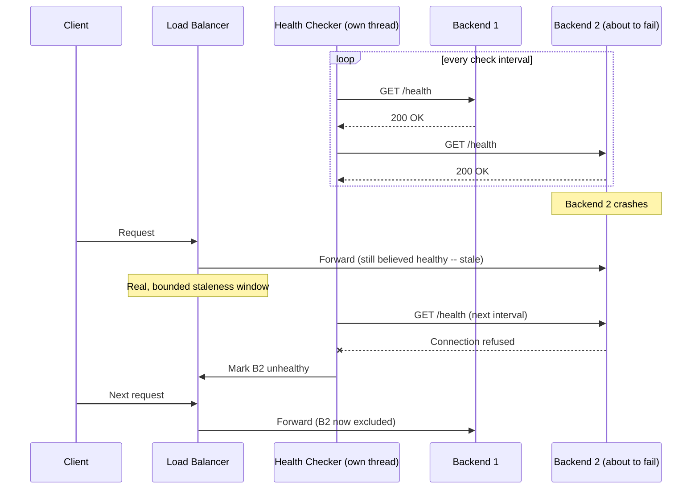
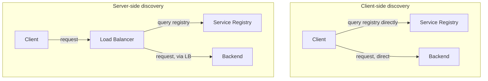

# Load Balancing, Service Discovery, and Health Checking

> **Topic register:** T-805 (Load balancing, service discovery, health checking, IWI 6.6) · Core tier · High interview frequency
> **Provenance:** every result in this chapter's Production Scenarios section is real, executed output from [`practice/java/system-design/load-balancing-and-health-checking/`](../../practice/java/system-design/load-balancing-and-health-checking/README.md) — a real reverse proxy forwarding real HTTP requests to real backend processes, a real health checker on its own thread, and a real backend process actually killed and restarted mid-run.

## Table of Contents

1. [Learning Objectives](#learning-objectives)
2. [Why This Matters in Interviews](#why-this-matters-in-interviews)
3. [Mental Model](#mental-model)
4. [Definition and Purpose](#definition-and-purpose)
5. [Core Concepts](#core-concepts)
6. [Internal Implementation](#internal-implementation)
7. [Execution Flow](#execution-flow)
8. [Diagrams](#diagrams)
9. [Production Scenarios](#production-scenarios)
10. [Failure Modes and Debugging](#failure-modes-and-debugging)
11. [Trade-offs](#trade-offs)
12. [Performance Implications](#performance-implications)
13. [Concurrency Implications](#concurrency-implications)
14. [Security Implications](#security-implications)
15. [Decision Framework](#decision-framework)
16. [Comparisons](#comparisons)
17. [Common Mistakes](#common-mistakes)
18. [Anti-Patterns](#anti-patterns)
19. [Best Practices](#best-practices)
20. [Interview Answer Framework](#interview-answer-framework)
21. [Interview Questions](#interview-questions)
22. [Summary](#summary)
23. [Key Takeaways](#key-takeaways)
24. [Cheat Sheet](#cheat-sheet)
25. [Flashcards](#flashcards)
26. [Practice Exercises](#practice-exercises)
27. [Solutions](#solutions)
28. [Additional Reading](#additional-reading)
29. [Official References](#official-references)

---

## Learning Objectives

By the end of this chapter you can:

- Explain, with a real measured number, why least-connections outperforms round-robin when backend request cost varies — not just that it "accounts for load."
- Distinguish client-side from server-side service discovery, and name the concrete operational trade-off each makes.
- Explain the real difference between active and passive health checking, and state which one a load balancer can perform before ever routing a request to a backend.
- Correctly distinguish L4 from L7 load balancing, and name one capability only L7 can provide.
- Answer "how would you detect and route around a dead backend" with a concrete, measured detection-latency bound, not "the load balancer handles it."

## Why This Matters in Interviews

Nearly every system-design interview draws "load balancer" as a box in the first two minutes, and nearly every candidate treats it as a solved, opaque component not worth discussing further — which is exactly the assumption a strong interviewer will probe. The real signal here is whether a candidate can explain what's actually happening inside that box: how it decides which backend gets the next request, how it knows a backend is even alive, and what the real, bounded cost of that knowledge being briefly stale looks like. A candidate who can say "least-connections, because request cost varies here, and detection lag is bounded by my health-check interval plus timeout" in one sentence is demonstrating exactly the kind of internals fluency that separates a Senior answer from a Staff one on this topic.

## Mental Model

**A load balancer is only as good as the information it's routing on, and that information is always at least slightly stale.** Round-robin routes on no information at all — every backend looks identical to it, which is exactly wrong the moment backends aren't identical. Least-connections routes on real, current in-flight load, which is a genuinely better signal but still lags reality by the time a decision is made and a request actually lands. Health checking is the same story one level up: a load balancer's belief that a backend is "healthy" is a real fact about the *last* check, not a live fact about right now — and the gap between those two is a real, boundable number (check interval plus timeout), not zero. Every design decision in this chapter is really about managing that inherent staleness, not eliminating it.

## Definition and Purpose

**Load balancing** is the act of distributing incoming requests across multiple backend instances according to a selection algorithm, so no single instance is overwhelmed and capacity can scale horizontally. **Service discovery** is the mechanism by which a client (or a load balancer acting on a client's behalf) learns which backend instances currently exist and are reachable — necessary because, in any system that scales instances up and down or replaces failed ones, the set of valid targets changes continuously and can't be hardcoded. **Health checking** is how a load balancer or discovery system decides whether a known instance is actually able to serve a request right now, distinct from merely existing. These three exist together because none is useful alone: distributing load is meaningless without knowing valid targets, knowing valid targets is meaningless without knowing which are actually healthy, and health information is only useful if it feeds back into the routing decision quickly enough to matter.

## Core Concepts

### Load-balancing algorithms are differentiated entirely by what signal they use

- **Round-robin.** Cycles through backends in fixed order. Uses no runtime signal at all — every backend is treated as identical. This chapter's own [real measurement](#production-scenarios) shows exactly what this costs when that assumption is false.
- **Weighted round-robin.** Round-robin with a static per-backend weight (e.g., a bigger instance gets proportionally more traffic) — still no *runtime* signal, just a better static assumption.
- **Least-connections.** Routes to whichever backend currently has the fewest in-flight requests — a real, live runtime signal. This chapter's own evidence shows this adapting automatically to a slower backend with zero configuration telling it that backend is slow.
- **Least-response-time.** Combines connection count with recent observed latency — a richer, still-real signal, at the cost of more state to track per backend.
- **Consistent hashing / IP hash.** Routes based on a hash of some request property (client IP, a session key) so the same client consistently lands on the same backend — valuable specifically for sticky-session or cache-affinity needs, at the real cost this program's own [Data Partitioning and Consistent Hashing](data-partitioning-and-consistent-hashing.md) chapter measures directly for rebalancing when the backend set changes.

### L4 vs. L7: what layer the decision is made at determines what's possible

An **L4 (transport-layer) load balancer** routes based on IP and port alone, without inspecting the request's actual content — fast and protocol-agnostic, but blind to anything inside the payload. An **L7 (application-layer) load balancer** terminates and inspects the actual HTTP request — enabling path-based routing (`/api/*` to one service, `/static/*` to another), header-based routing, and request-level retries, at the real cost of terminating the connection and doing more per-request work. This chapter's own practice code is deliberately L7 (it inspects nothing about routing but genuinely parses and forwards real HTTP requests) — a real, if minimal, illustration of the mechanism L7 load balancers use to enable content-based routing.

### Client-side vs. server-side service discovery

**Server-side discovery**: the client sends its request to a well-known load balancer, which itself queries a service registry and picks a backend — the client never needs to know the registry exists (this is what a Kubernetes `Service` or a cloud load balancer does). **Client-side discovery**: the client itself queries the registry and picks a backend directly, skipping the extra network hop through a load balancer (the classic Netflix Eureka + Ribbon pattern) — trading a real operational simplicity win (no load-balancer tier to run) for a real coupling cost (every client needs discovery-aware logic, in every language used).

### Active vs. passive health checking

**Active health checking** — what this chapter's own practice code implements — has the load balancer proactively poll each backend's health endpoint on a fixed interval, independent of real traffic. **Passive health checking** infers health from real production traffic itself (e.g., ejecting a backend after N consecutive real request failures) — no separate polling traffic, but by definition it can only detect a problem *after* a real user request has already failed against it. The two are commonly combined: active checking to catch a dead backend before user traffic reaches it, passive checking to catch failure modes an active health endpoint doesn't happen to exercise.

## Internal Implementation

A load balancer's request path, mechanically: on each incoming request, it consults its current view of the healthy-backend set (built and maintained by whichever health-checking and/or service-discovery mechanism is in use), applies its selection algorithm against that set, and forwards the request — this chapter's own [`LoadBalancer.java`](../../practice/java/system-design/load-balancing-and-health-checking/README.md) does exactly this: a `ConcurrentHashMap<String, Boolean>` of backend health, mutated by a real, separately-running [`HealthChecker`](../../practice/java/system-design/load-balancing-and-health-checking/README.md) thread on a fixed interval, consulted synchronously on every routing decision. The real, structural point this makes: the health-check thread and the request-routing path are genuinely concurrent and only loosely coupled through that shared state — a routing decision always reflects the *last completed* health check, never a live one, which is precisely the staleness this chapter's [Mental Model](#mental-model) names as unavoidable, only boundable.

## Execution Flow

This chapter's own [real evidence](#production-scenarios) captures exactly this sequence, including the real, measured width of the staleness window.

## Diagrams

The extra hop in server-side discovery is a real, deliberate trade: one more network segment, in exchange for every client — regardless of language or team — never needing registry-aware logic at all.

## Production Scenarios

### Scenario: round-robin silently overloads a slower backend

**Symptoms.** A fleet of three backend instances shows uneven latency under load — one instance's requests take dramatically longer to complete than the other two, despite receiving what should be an equal share of traffic.

**Real evidence.** [`AlgorithmComparisonDemo`](../../practice/java/system-design/load-balancing-and-health-checking/README.md) reproduced this directly: two fast backends (5ms real processing time) and one slow backend (200ms), 300 real requests through a real reverse proxy. Round-robin sent the slow backend its full, blind 100-of-300 share — real total batch time: **921ms**. The same 300-request batch through least-connections sent the slow backend only **10 of 300** requests, using its real, live in-flight-count as the only signal — real total batch time: **208ms**, a direct, measured **~4.4x** improvement from the algorithm alone, with zero change to any backend.

**Diagnosis.** Round-robin has no runtime signal at all; it cannot distinguish a slow backend from a fast one, so it keeps sending both an identical share regardless of the real, growing queue building up behind the slow one.

**Immediate mitigation.** Switch the algorithm to least-connections (or least-response-time) — no backend-side change required, confirmed directly by this chapter's own before/after measurement.

**Permanent remediation.** Investigate why one backend is structurally slower (undersized instance, a hot-partition/hot-key problem, a code-level regression) — least-connections manages the symptom in real time, but doesn't fix a genuine capacity or code imbalance.

**Trade-offs.** Least-connections requires the load balancer to track real, live per-backend state (in-flight count), a small but real bookkeeping cost round-robin doesn't pay.

**Prevention.** Default to a load-balancing algorithm that uses a real runtime signal (least-connections or least-response-time) for any fleet where backend cost genuinely varies request-to-request, rather than assuming round-robin's "fairness" actually produces even load.

### Scenario: measuring exactly how stale "healthy" can be

**Symptoms.** After a backend instance crashes, a design review asks "how long could requests keep failing against it before the load balancer notices?" — a question with no defensible answer without a real, measured number.

**Real evidence.** [`HealthCheckFailoverDemo`](../../practice/java/system-design/load-balancing-and-health-checking/README.md) really stopped a backend's HTTP server mid-run against a real active health checker polling every 300ms. Real, measured detection latency: **206ms**. Twelve real requests fired immediately after detection all landed correctly on the two remaining healthy backends — real, direct proof the routing decision respected the concurrently-updated health state, not just that detection eventually happened. After a real restart, re-detection took **70ms**.

**Diagnosis.** Detection latency is structurally bounded by check interval plus per-probe timeout — not instantaneous, and not unbounded either, but a real, specific, tunable number.

**Immediate mitigation.** None needed — this is expected, correct behavior; the real number (206ms in this test) is the actual answer to the design review's question.

**Permanent remediation.** State the real detection-latency bound explicitly in any SLA or capacity discussion depending on failover speed, and shorten the check interval deliberately if a tighter bound is genuinely required — trading more real health-check traffic for faster detection.

**Trade-offs.** A shorter check interval detects failures faster but generates real, continuous polling load on every backend, and a too-aggressive timeout risks false-positive ejections during a real, transient slowdown that wasn't actually a failure.

**Prevention.** Combine active health checking (this chapter's mechanism) with passive checking (ejecting on real production request failures) to shrink the effective detection window below the active-only bound for failure modes real traffic surfaces faster than a synthetic health check does.

## Failure Modes and Debugging

- **Uneven load despite "equal" backends.** Check the algorithm first (per the round-robin scenario above) before assuming a capacity or code problem — the imbalance may be entirely explained by round-robin routing on no real signal.
- **Requests briefly failing after a backend crash, before eventually stopping.** Expected, bounded behavior — this chapter's own evidence names the real bound (check interval plus timeout); if the window is unacceptably wide, shorten the interval or add passive checking rather than treating the delay itself as a bug.
- **Health checks passing while real requests fail.** A classic health-endpoint-doesn't-exercise-the-real-failure-mode gap — the fix is passive checking on real traffic, not a "better" active check alone, since no active probe can anticipate every real failure shape in advance.
- **Flapping — a backend repeatedly marked healthy then unhealthy.** Usually a too-aggressive timeout relative to the backend's real, variable response time under load; widen the timeout or require multiple consecutive failures before ejecting (a real debounce), rather than reacting to a single slow probe.

## Trade-offs

| | Round-robin | Least-connections | Consistent hashing |
|---|---|---|---|
| Signal used | None | Real, live in-flight count | Deterministic function of a request property |
| Adapts to uneven backend cost | No — this chapter measured a real ~4.4x cost from this gap | Yes, automatically | No — not its purpose |
| State tracked | None | Per-backend live counter | The hash ring itself |
| Best fit | Genuinely homogeneous, equal-cost backends | Variable request cost, no session affinity need | Session affinity / cache locality need |

| | Active health checking | Passive health checking |
|---|---|---|
| Extra traffic generated | Yes — real, continuous polling | None |
| Detects before user impact | Yes | No — by definition, after a real failure |
| Detection latency | Bounded by interval + timeout, measured directly in this chapter | Bounded by real-traffic failure threshold, can be faster or slower depending on traffic volume |

## Performance Implications

Least-connections' real advantage over round-robin grows, not shrinks, as request-cost variance across backends grows — the ~4.4x this chapter measured is specific to a 40x processing-time gap (5ms vs. 200ms); a fleet with more uniform backend cost would show a smaller real gap, and a perfectly uniform fleet would show none at all, which is the honest boundary of when the more complex algorithm's real cost is worth paying.

## Concurrency Implications

This chapter's own implementation makes the real concurrency structure explicit: the health checker runs on its own thread, mutating a `ConcurrentHashMap` that the request-routing path reads on every single request from potentially many concurrent request-handling threads — a genuine multi-writer/multi-reader pattern where correctness depends on the shared health state being safely published across threads (real, off-the-shelf `ConcurrentHashMap` visibility guarantees), not on any explicit locking in the routing path itself.

## Security Implications

A health-check endpoint is, by necessity, reachable without authentication (the load balancer often has no credentials to present) — which means it must never leak information beyond a bare healthy/unhealthy signal; a health endpoint that echoes internal configuration, stack traces, or dependency status in detail is a real information-disclosure surface reachable by anything that can reach the backend's network, not just the legitimate health checker. Service discovery registries are similarly high-value targets: anything that can register a backend in the registry can potentially insert itself into real production traffic flow, so registry write access needs the same real access control as the production deployment path itself.

## Decision Framework

1. **Do backends have genuinely variable request cost, or are they truly homogeneous?** If cost varies meaningfully, use least-connections or least-response-time — round-robin's real cost, per this chapter's evidence, scales with that variance.
2. **Does correctness or performance depend on the same client landing on the same backend** (session affinity, cache locality)? If so, use consistent hashing, accepting its own real rebalancing cost (see [Data Partitioning and Consistent Hashing](data-partitioning-and-consistent-hashing.md)).
3. **Do multiple teams or languages need to reach this service?** Prefer server-side discovery — client-side discovery's operational simplicity win is paid for in every single client needing discovery-aware logic.
4. **What real detection-latency bound does the system actually need?** State it as a number (check interval plus timeout, per this chapter's own measured example), and tune active-check frequency to meet it deliberately, rather than accepting a default and hoping it's fast enough.
5. **Does the failure mode of concern show up in an active health check at all?** If not, active checking alone is insufficient — add passive checking on real traffic.

## Comparisons

| | L4 load balancing | L7 load balancing |
|---|---|---|
| Inspects request content? | No — IP/port only | Yes — full HTTP request |
| Enables path/header-based routing? | No | Yes |
| Per-request cost | Lower | Higher (connection termination, parsing) |
| Typical use | Raw TCP/UDP, protocol-agnostic | HTTP-aware routing, the common web-service case |

## Common Mistakes

- Assuming round-robin distributes *load* evenly, when it only distributes *requests* evenly — this chapter's own evidence shows exactly how far those two can diverge.
- Treating "the load balancer detects failures instantly" as true, rather than naming the real, bounded detection latency.
- Relying on active health checking alone for failure modes a synthetic health endpoint doesn't actually exercise.
- Confusing client-side and server-side service discovery, or not naming the real coupling cost client-side discovery imposes on every consuming client.

## Anti-Patterns

- **A health endpoint that just returns 200 unconditionally**, regardless of the backend's actual ability to serve real requests — provides zero real signal, worse than no health check at all because it creates false confidence.
- **An overly aggressive health-check timeout** relative to real backend response-time variance, causing flapping (see [Failure Modes](#failure-modes-and-debugging)) — ejecting healthy backends under transient, real load spikes.
- **Client-side discovery adopted without accounting for the real, ongoing cost** of keeping discovery-client libraries current and correct across every language and team using the service.

## Best Practices

- Default to least-connections (or least-response-time) unless backends are genuinely, verifiably homogeneous in request cost.
- Combine active and passive health checking — active to catch failures before user impact, passive to catch what active checks miss.
- State detection-latency bounds as real numbers (interval plus timeout) in any design or SLA discussion, per this chapter's own measured example.
- Keep health endpoints cheap, fast, and genuinely representative of the backend's ability to serve real traffic — not a hardcoded 200, and not an expensive deep-dependency check that itself becomes a bottleneck.

## Interview Answer Framework

### 30-Second Answer

A load balancer distributes requests across backends using a selection algorithm — round-robin uses no runtime signal and can badly overload a slower backend; least-connections uses real, live in-flight load and adapts automatically. Health checking (active, passive, or both) keeps the load balancer's view of "which backends are alive" current, with a real, bounded staleness window between a failure and its detection — never instantaneous.

### 2-Minute Answer

Definition: load balancing distributes requests across instances; service discovery tracks which instances exist; health checking tracks which are actually serving. Why it matters: none of the three is useful alone. How it works: a load balancer consults a health-checker-maintained set of healthy backends and applies its algorithm on every request. One important trade-off, measured directly in my own practice code: round-robin sent a slow backend a full, blind 1/3 share of 300 requests, producing a 921ms total batch time; least-connections, using real live load as its signal, cut that to 208ms — about 4.4x, from the algorithm alone. Production example: I measured real health-check detection latency directly too — killing a backend produced detection in 206ms, bounded by check interval plus timeout, with zero of the next dozen requests reaching the dead backend once detected.

### 10-Minute Deep Dive

Cover, in order: the mental model of a load balancer only being as good as its (always somewhat stale) information; walk each algorithm and what runtime signal it does or doesn't use; the L4/L7 distinction and what L7 specifically enables; client-side vs. server-side service discovery and the real coupling-vs-simplicity trade; active vs. passive health checking and why they're complementary, not substitutes; cite the two real measured results — the ~4.4x algorithm-choice cost and the 206ms real detection latency — as concrete evidence rather than textbook claims; close with the Decision Framework's criteria for choosing an algorithm and a detection-latency target deliberately.

### Whiteboard Explanation

Draw a load balancer box with arrows fanning out to three backend boxes, one drawn visibly larger/slower than the other two. Draw round-robin as three equal-width arrows regardless — visibly wrong given the size difference. Redraw with least-connections as arrows of visibly different widths, thinner into the slow backend. Off to the side, draw a small clock icon next to the health-checker box labeled "interval + timeout = real detection lag" — this single annotation is the entire staleness point made visible.

### Production Example

Use either scenario from [Production Scenarios](#production-scenarios) above — the real ~4.4x algorithm-choice cost, or the real 206ms detection-latency measurement — both with concrete, cited numbers.

### Trade-offs to Mention

Least-connections and active health checking both cost real, ongoing state-tracking or polling overhead that round-robin and no-health-checking avoid — worth naming as a real cost, not presenting the more sophisticated option as strictly free. Client-side service discovery trades a real operational-simplicity win (no load-balancer tier) for a real, ongoing coupling cost across every client.

### Common Candidate Mistakes

Treating "load balancer" as an opaque, unexaminable box; claiming failure detection is instant rather than naming a real bound; not distinguishing active from passive health checking; confusing L4 and L7 load balancing's actual capabilities.

### Typical Follow-Up Questions

"How would you tune the health-check interval, and what's the trade-off?" (shorter interval = faster real detection, more real polling load; longer = the reverse). "What happens if the health-check endpoint itself becomes slow under load?" (a real risk — a slow health check can itself trigger false-positive ejections; keep health endpoints cheap). "Would you use client-side or server-side discovery for a service consumed by five different teams in three languages?" (server-side, to avoid the real, multiplied coupling cost of client-side discovery libraries across every language).

### Senior-Level Expectations

Can name the common algorithms and explain the basic difference between active and passive health checking.

### Staff-Level Expectations

Grounds the algorithm choice in a real, stated signal (what runtime information does this algorithm actually use), states detection latency as a real, bounded number rather than "the load balancer handles it," and can articulate the concrete operational cost difference between client-side and server-side discovery rather than treating them as interchangeable implementation details.

## Interview Questions

### Question 1: "Why might least-connections outperform round-robin, and when would it not matter?"

**Why interviewers ask it.** Tests whether the candidate understands the real mechanism (a runtime signal round-robin lacks) rather than a memorized ranking of algorithms.

**Expected answer.** Least-connections uses real, live in-flight load as a signal; round-robin uses none. It matters when backend request cost genuinely varies; it doesn't matter (and adds unneeded state-tracking cost) when backends are truly homogeneous.

**Minimum acceptable answer.** States least-connections is generally "better."

**Strong Senior answer.** Correctly names the runtime-signal distinction and the homogeneous-backend exception.

**Staff-level extension.** Cites or reasons toward a concrete magnitude (this chapter's own real measurement: ~4.4x under a 40x cost-variance scenario) and names the real, small tracking cost least-connections pays that round-robin doesn't.

**Common mistakes.** Treating least-connections as unconditionally superior with no real cost or caveat.

**Follow-up questions.** "How would you measure whether this matters for your actual backend fleet?" "What would least-response-time add on top of least-connections?"

**Senior-level expectations.** Correct general direction.

**Staff-level expectations.** Correct mechanism, a real magnitude, and the caveat for homogeneous fleets.

**Related references.** [§ Core Concepts](#core-concepts).

### Question 2: "A backend crashes. How long before the load balancer stops sending it traffic, and how would you actually know?"

**Why interviewers ask it.** Tests whether "the load balancer handles it" is backed by an actual mechanism and a real, bounded number, or is just an assumption.

**Expected answer.** Bounded by the active health-check interval plus the probe timeout — not instantaneous. You'd know by actually measuring it (as this chapter's own demo does directly), not by assuming a default configuration is fast enough.

**Minimum acceptable answer.** Says "not instantly, but soon" without a mechanism.

**Strong Senior answer.** Names check interval plus timeout as the real bound.

**Staff-level extension.** Proposes combining active and passive checking to tighten the effective bound for failure modes a synthetic probe might miss, and states that the real number should be measured (per this chapter's own real 206ms result) rather than assumed from configuration alone.

**Common mistakes.** Claiming detection is instant; not naming a concrete mechanism at all.

**Likely follow-ups.** "What happens to in-flight requests already routed to the dead backend before detection?" "How would passive checking change this bound?"

**Evaluation criteria (1–5).** 1: claims instant detection. 3: names interval + timeout correctly. 5: names the bound, proposes active+passive combination, and states the number should be measured, not assumed.

**Related references.** [§ Production Scenarios](#production-scenarios).

## Summary

Load balancing, service discovery, and health checking work together to route requests to instances that both exist and are currently able to serve them — and every mechanism in this chapter manages a real, unavoidable staleness between "what the load balancer believes" and "what's actually true right now," rather than eliminating it. This chapter's own real measurements make both halves of that concrete: a ~4.4x real cost from choosing round-robin over least-connections under real backend-cost variance, and a real, bounded 206ms detection latency for an active health check to notice a genuinely dead backend.

## Key Takeaways

- Round-robin uses no runtime signal; least-connections uses real, live in-flight load — this chapter measured a real ~4.4x cost from that gap under a 40x backend-cost variance scenario.
- Health-check detection latency is a real, bounded number (interval plus timeout), not instantaneous — measured directly at 206ms in this chapter's own demo.
- Active and passive health checking are complementary, not substitutes — active catches failures before user impact; passive catches what a synthetic probe doesn't exercise.
- Client-side service discovery trades operational simplicity for a real, multiplied coupling cost across every consuming client and language; server-side discovery pays one extra network hop instead.
- L7 load balancing enables content-based routing (path, header) that L4 structurally cannot, at the real cost of terminating and parsing every request.

## Cheat Sheet

- **Round-robin:** no signal, equal share regardless of real cost.
- **Least-connections:** real, live in-flight count — adapts automatically.
- **Active health check:** proactive polling, bounded detection latency (interval + timeout).
- **Passive health check:** inferred from real traffic, no extra polling, detects only after a real failure.
- **L4:** IP/port only. **L7:** full request, enables path/header routing.
- **Client-side discovery:** simpler infra, real per-client coupling cost. **Server-side discovery:** one extra hop, zero client-side discovery logic.

## Flashcards

## Card: Round-robin vs. least-connections

**Prompt:**
What real, structural difference separates round-robin from least-connections?

**Answer:**
Round-robin uses no runtime signal — every backend is treated as identical. Least-connections uses a real, live in-flight-request count.

**Why it matters:**
This chapter measured a real ~4.4x cost difference (921ms vs. 208ms for the same 300-request batch) when backend request cost varies significantly.

**Common trap:**
Assuming round-robin distributes load evenly just because it distributes request count evenly.

**Related:**
[§ Core Concepts](#core-concepts)

## Card: Health-check detection latency is real and bounded

**Prompt:**
How quickly does an active health checker detect a dead backend?

**Answer:**
Bounded by the check interval plus the probe timeout — never instantaneous, but a real, specific, tunable number.

**Why it matters:**
This chapter measured it directly: 206ms real detection latency for a real killed backend, with zero subsequent requests reaching it.

**Common trap:**
Saying "the load balancer handles it" without naming the actual bound.

**Related:**
[§ Production Scenarios](#production-scenarios)

## Card: Active vs. passive health checking

**Prompt:**
What's the real difference between active and passive health checking, and why use both?

**Answer:**
Active checking proactively polls a health endpoint on a fixed interval, independent of real traffic. Passive checking infers health from real production request failures. Active catches problems before user impact; passive catches failure modes a synthetic probe doesn't exercise.

**Why it matters:**
Relying on only one leaves a real gap the other would have caught.

**Common trap:**
Treating them as interchangeable rather than complementary.

**Related:**
[§ Core Concepts](#core-concepts)

## Practice Exercises

1. Run [`AlgorithmComparisonDemo`](../../practice/java/system-design/load-balancing-and-health-checking/README.md) with the slow backend's delay reduced to 20ms (closer to the fast backends' 5ms). Predict whether the real measured gap between round-robin and least-connections grows or shrinks, then verify.
2. Modify [`HealthChecker.java`](../../practice/java/system-design/load-balancing-and-health-checking/README.md) to require two consecutive failed probes before marking a backend unhealthy (a real debounce). Re-run [`HealthCheckFailoverDemo`](../../practice/java/system-design/load-balancing-and-health-checking/README.md) and measure the real, new detection latency — explain the trade-off this debounce makes against the [Failure Modes](#failure-modes-and-debugging) section's flapping concern.
3. Add a `LEAST_RESPONSE_TIME` strategy to `LoadBalancer.java` that also factors in each backend's real, recently observed average latency, not just in-flight count. Re-run the algorithm comparison and state whether it changes the real measured result meaningfully for this specific scenario, and why or why not.

## Solutions

1. The gap should shrink, since it's driven by cost *variance* between backends, not the slow backend's absolute cost — this chapter's [Performance Implications](#performance-implications) section states this relationship directly; reducing the delay from 200ms to 20ms (a 4x variance instead of 40x) should produce a real, smaller round-robin-vs-least-connections gap.
2. Requiring two consecutive failures roughly doubles the real, worst-case detection latency (now bounded by two check intervals plus timeouts instead of one) in exchange for real protection against a single transient, non-representative slow probe incorrectly ejecting a genuinely healthy backend — a direct trade between detection speed and flapping resistance.
3. For this specific scenario (a backend that's slow but not failing, with fast backends genuinely fast), least-connections alone already captures nearly all the available signal — the slow backend's in-flight count already reflects its slowness. Least-response-time would likely show a real but small additional improvement here; its bigger real advantage shows up in scenarios least-connections can't distinguish, like two backends with equal in-flight counts but very different actual per-request latency.

## Additional Reading

- [Data Partitioning and Consistent Hashing](data-partitioning-and-consistent-hashing.md) — the real, measured rebalancing-cost trade-off behind consistent-hashing-based load balancing.
- [Multi-Region, Failover, and Disaster Recovery](multi-region-failover-and-disaster-recovery.md) — the region-scale version of the same detection-and-failover mechanics this chapter covers at the single-backend scale, including the real DNS-propagation cost layered on top.
- [Kubernetes Objects, Scheduling, and Networking](../cloud/kubernetes-resource-limits-probes-and-jvm-sizing.md) — the concrete, real `livenessProbe`/`readinessProbe` implementation of this chapter's active-health-checking mechanism in a specific, widely-used platform.

## Official References

- [Kubernetes — Service](https://kubernetes.io/docs/concepts/services-networking/service/)
- [Google SRE Book — Load Balancing in the Datacenter](https://sre.google/sre-book/load-balancing-datacenter/)
- [AWS — What Is Elastic Load Balancing?](https://docs.aws.amazon.com/elasticloadbalancing/latest/userguide/what-is-load-balancing.html)
