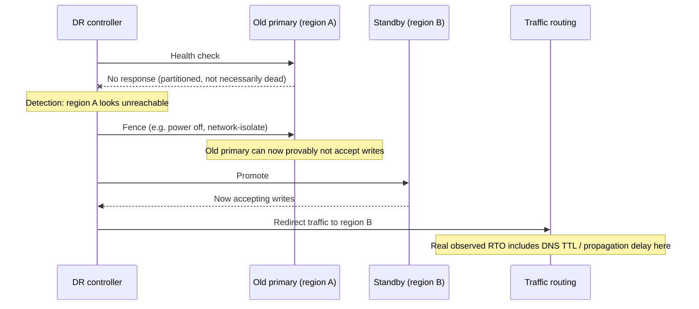
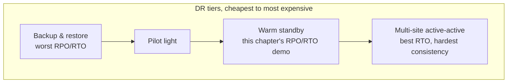

# Multi-Region, Failover, and Disaster Recovery

> **Topic register:** T-814 (Multi-region, failover, disaster recovery, IWI 6.7) · Staff tier · Moderate interview frequency
> **Provenance:** every number in this chapter's Production Scenarios section is real, executed output from [`practice/sql/multi-region-failover-and-dr/`](../../practice/sql/multi-region-failover-and-dr/README.md) — a real PostgreSQL 16 primary genuinely destroyed mid-write (container and volume, not a graceful shutdown), a real WAL-archiving standby, and a real, reproduced split-brain under a genuine Docker network partition, with a real fencing fix. This chapter deliberately does not re-derive streaming replication's own mechanics — that is [Replication, Read Replicas, and Replica Lag's](../databases/replication-read-replicas-and-replica-lag.md) job. This chapter is about the DR-pattern-selection decision and failover safety.

## Table of Contents

1. [Learning Objectives](#learning-objectives)
2. [Why This Matters in Interviews](#why-this-matters-in-interviews)
3. [Mental Model](#mental-model)
4. [Definition and Purpose](#definition-and-purpose)
5. [Historical Context](#historical-context)
6. [Core Concepts](#core-concepts)
7. [Internal Implementation](#internal-implementation)
8. [Execution Flow](#execution-flow)
9. [Diagrams](#diagrams)
10. [Production Scenarios](#production-scenarios)
11. [Failure Modes and Debugging](#failure-modes-and-debugging)
12. [Trade-offs](#trade-offs)
13. [Performance Implications](#performance-implications)
14. [Concurrency Implications](#concurrency-implications)
15. [Security Implications](#security-implications)
16. [Decision Framework](#decision-framework)
17. [Comparisons](#comparisons)
18. [Common Mistakes](#common-mistakes)
19. [Anti-Patterns](#anti-patterns)
20. [Best Practices](#best-practices)
21. [Interview Answer Framework](#interview-answer-framework)
22. [Interview Questions](#interview-questions)
23. [Summary](#summary)
24. [Key Takeaways](#key-takeaways)
25. [Cheat Sheet](#cheat-sheet)
26. [Flashcards](#flashcards)
27. [Practice Exercises](#practice-exercises)
28. [Solutions](#solutions)
29. [Additional Reading](#additional-reading)
30. [Official References](#official-references)

---

## Learning Objectives

By the end of this chapter you can:

- Define RPO and RTO precisely, and state which one each of the four classic DR tiers (backup-restore, pilot light, warm standby, multi-site active-active) primarily buys down.
- Explain, with a real measured example, why a configured `archive_timeout` is a target the archiver works toward, not a guarantee — and why a real DR plan's RPO must be verified, not assumed from a config value.
- Describe exactly what split-brain is, reproduce the mechanism that causes it (a naive failover during a network partition, not a real node death), and name the concrete fix.
- Distinguish a region-level outage from an AZ-level outage, and explain why the same replication mechanics can answer one and not the other.
- Answer "would you build active-active across regions for this system" correctly, naming the specific consistency cost that answer requires accepting.

## Why This Matters in Interviews

This is a Staff-level question because it is rarely actually about database replication mechanics — a candidate who launches into streaming-replication internals when asked "how would you survive a full region outage" is answering the wrong question. The real signal being tested is judgment under an explicit cost-versus-risk trade: naming a concrete RPO/RTO target the business actually needs, picking the cheapest DR tier that meets it, and — the part candidates skip most often — describing how a failover stays *safe*, not just fast. An interviewer who asks a sharp follow-up ("what stops both regions from accepting writes at once during the cutover?") is testing whether the candidate has ever actually thought about fencing, or has only ever drawn the two-region diagram with an arrow between them.

## Mental Model

**RPO is how much you're willing to lose; RTO is how long you're willing to be down — and every DR pattern is just a different, honest price tag on that pair of numbers.** A pattern that buys a smaller RPO or RTO always costs more to run continuously (a live standby, always-on cross-region replication, active traffic capacity sitting idle) — there is no free tier here, only different places on the same trade curve. The moment a design conversation reaches "we need multi-region," the very next sentence should be a number: an RPO in minutes-or-seconds and an RTO in minutes-or-hours the business actually signed off on — not "as fast as possible," which is not a target, it's an unbounded budget.

## Definition and Purpose

**Disaster recovery (DR)** is the set of pre-planned mechanisms and procedures that let a system resume operating, within a defined data-loss and downtime budget, after losing an entire region — as opposed to a single node or a single availability zone, which ordinary replication and load balancing already handle. **RPO (Recovery Point Objective)** is the maximum acceptable amount of data loss, measured as a time window ("we can lose at most 5 minutes of writes"). **RTO (Recovery Time Objective)** is the maximum acceptable downtime before the system is serving again. **Failover** is the act of promoting a secondary region to take over as primary; a **multi-region** architecture is one explicitly designed so that failover is possible at all.

This topic exists because a region is not just "a bigger availability zone" — a real region-level event (a cloud provider's control-plane outage, a natural disaster affecting a physical facility, a botched region-wide configuration change) can take out every AZ in that region simultaneously, which is precisely the failure mode that in-region replication, multi-AZ deployment, and load balancing are not designed to survive, because all of those mechanisms still depend on the region itself being reachable.

## Historical Context

Multi-AZ deployment became the default resilience posture as cloud providers matured their availability-zone isolation guarantees through the 2010s — an AZ-level failure (a single data center losing power, say) became a well-solved, comparatively cheap problem. Region-level events remained rarer but real, and every major cloud provider now publishes its own canonical DR framework built around the same underlying RPO/RTO trade: AWS's well-known four-tier model — **backup and restore**, **pilot light**, **warm standby**, and **multi-site active-active** (see [Official References](#official-references)) — orders these tiers explicitly by cost, RPO, and RTO, cheapest-and-slowest to most-expensive-and-fastest, and remains the standard vocabulary candidates are expected to know at Staff level, whether or not the actual system in question runs on AWS.

## Core Concepts

### The four DR tiers, and what each one actually buys

- **Backup and restore.** Periodic backups (or, as this chapter's own [WAL-archiving demo](#production-scenarios) shows, continuous log shipping) to a durable, cross-region store, with no standby infrastructure running at all until a disaster is declared. Cheapest tier; worst RPO and RTO — RPO is bounded by backup/archive frequency, RTO includes real infrastructure provisioning time from scratch.
- **Pilot light.** A minimal, always-on core (typically just the data tier, continuously replicating) sits idle in the DR region; compute is provisioned only when failover is triggered. Better RTO than backup-restore (no data-tier provisioning needed), similar RPO to a continuously-replicating data tier.
- **Warm standby.** A scaled-down but fully running copy of the whole stack in the DR region, continuously receiving traffic-free replication. This chapter's [`rpo-demo.sh`](../../practice/sql/multi-region-failover-and-dr/README.md) demonstrates exactly this pattern's data tier — a real, always-running streaming standby. Much better RTO (just scale up and cut over); RPO bounded by real replication lag, which this chapter's own measurement showed can genuinely be near zero.
- **Multi-site active-active.** Full capacity running in more than one region simultaneously, actively serving traffic in normal operation. Best RTO (no promotion step needed at all for read traffic, and often none for writes with the right data architecture) — but it forces a real, explicit consistency decision (see [CAP Theorem and Consistency Models](cap-theorem-and-consistency-models.md)) about how concurrent writes in two regions are reconciled, which is a genuinely hard problem, not a configuration flag.

### RPO is bounded by what the surviving side actually received, not by what was written

The single most common conceptual error on this topic: RPO is not about how often you write, or how confident you are in your replication mechanism — it is strictly about what the surviving region *actually has* at the moment of loss. This chapter's own [RPO demo](#production-scenarios) makes this concrete twice, with two different real answers for two different patterns applied to the identical scenario.

### Split-brain: two nodes, each certain it is the one true primary

Split-brain occurs when a failover promotes a new primary while the old primary is still alive and reachable by *some* clients — not dead, merely partitioned from the standby — and both nodes go on to accept writes independently. This is not a database bug; it is what naturally happens when a failover decision is made without first guaranteeing the old primary cannot write. [Failure Modes and Debugging](#failure-modes-and-debugging) below walks through this chapter's own real, reproduced instance of it.

### Fencing: the mechanism that actually prevents split-brain

**Fencing** (also called STONITH — Shoot The Other Node In The Head) means forcibly and verifiably cutting off the old primary's ability to accept writes *before* promoting anything else — not asking it nicely, not assuming a network partition means it's dead, but guaranteeing it. This chapter's own demo uses `docker pause` as a real, concrete stand-in: it genuinely freezes every process in the old primary's container via the cgroup freezer, and a subsequent write attempt is refused by Docker itself before ever reaching PostgreSQL — a real, verifiable fence, not a hope.

## Internal Implementation

A region-level failover, done safely, is always some ordering of the same four steps: **(1) detect** the region is genuinely unreachable, not just slow — this needs a quorum-based or multi-path health check, since a single health-checker being wrong is itself a single point of failure; **(2) fence** the old primary so it provably cannot accept further writes, using whatever real mechanism is available (a power-fencing API, a network ACL cutting the old primary off entirely, a coordinated shutdown the surviving side can verify); **(3) promote** the new primary, which for a warm-standby data tier means the same `pg_ctl promote` mechanics covered in the [replication chapter](../databases/replication-read-replicas-and-replica-lag.md#internal-implementation); **(4) redirect traffic** — typically DNS (with a low TTL, since DNS caching directly adds to real observed RTO) or a global traffic manager. Skipping step 2, or performing it only optimistically ("the primary is probably dead"), is exactly the gap this chapter's split-brain demo exploits.

## Execution Flow

Skipping the fencing step and promoting directly after "no response" is precisely the naive path this chapter's split-brain demo takes in its first run — and precisely what produces a real, observed divergence.

## Diagrams

## Production Scenarios

### Scenario: choosing between a hot standby and log-shipping DR, backed by real measured numbers

**Symptoms.** A team must pick a DR pattern for a PostgreSQL-backed service and has been given a business RPO target of "a few seconds" and told to justify the infrastructure cost of whatever they choose.

**Real measurement — warm standby (streaming replication).** [`rpo-demo.sh`](../../practice/sql/multi-region-failover-and-dr/README.md) fired a 150,000-statement burst at a real primary and destroyed the primary's container **and volume** mid-burst, 0.4 seconds in — a real, irreversible loss, not a graceful shutdown. Real result: **2,437 rows committed, 0 lost.** A real, measured RTO of **0.98 seconds** from destruction to the promoted standby accepting its first write.

**Real measurement — backup-restore / log-shipping (WAL archiving).** [`rpo-archive-demo.sh`](../../practice/sql/multi-region-failover-and-dr/README.md) configured a real primary with `archive_mode=on`, `archive_timeout=3`, wrote ten real, individually-timestamped rows over ten real seconds, then destroyed the primary. Real result: **only the startup WAL segment was ever archived — 10 out of 10 rows genuinely unrecoverable**, because no second segment closed and shipped in the entire ten-second window despite the 3-second `archive_timeout` configuration.

**Diagnosis.** The two patterns produced dramatically different real RPOs for the identical underlying data — not because one number was fabricated, but because a continuously-streaming standby and a periodically-archived one are structurally different mechanisms, and the archiver's real-world timing did not match its configured target.

**Immediate mitigation.** For an RPO target of "a few seconds," the warm-standby pattern is the only one of the two that empirically met it in this real test; log-shipping alone did not.

**Permanent remediation.** If cost still rules out a continuously-running standby, the log-shipping RPO must be *independently verified*, the same way this chapter's demo did — by actually destroying a primary and checking what survived — not trusted from `archive_timeout`'s configured value.

**Trade-offs.** The warm standby costs real, continuous infrastructure spend for a second running node; log-shipping is dramatically cheaper but, as measured, can silently miss its own configured RPO target under light write load.

**Prevention.** Treat a DR pattern's RPO and RTO as claims to be tested, on a real schedule (a "DR game day"), not values to be read off a configuration file and trusted.

### Scenario: a naive failover produces a real, reproduced split-brain

**Symptoms.** During a real, genuine network partition (`docker network disconnect`, not a killed process — the old primary stays alive and fully functional), an automated controller sees the primary as unreachable and promotes the standby without first confirming the old primary is actually dead.

**Real evidence.** [`splitbrain-demo.sh`](../../practice/sql/multi-region-failover-and-dr/README.md) reproduced this directly: after promotion, the *old* primary — still alive, merely partitioned — genuinely accepted a write (`accepted-by-old-primary-unaware-of-failover`) from a client still able to reach it, while the newly-promoted standby independently accepted its own, different write (`accepted-by-new-primary-after-failover`). After healing the partition, the two nodes' ledgers had genuinely, observably diverged — real split-brain, not a described one.

**Diagnosis.** The failover promoted a new writer without first guaranteeing the old one could not also write — the root cause named in [Internal Implementation](#internal-implementation) above.

**Immediate mitigation.** Once split-brain is detected, there is no automatic fix — a human must decide which divergent history is authoritative and manually reconcile or discard the other side's writes.

**Permanent remediation.** The same demo's second run adds one step before promotion: `docker pause` on the old primary, a real stand-in for fencing/STONITH. The identical write attempt against the fenced old primary was refused by Docker itself (`Container ... is paused, unpause the container before exec`) before ever reaching PostgreSQL, and the standby was promoted with zero risk of a second writer.

**Trade-offs.** Fencing adds a real step — and real latency — to the failover path, directly increasing RTO; the alternative (skip fencing to fail over faster) is exactly what produced the real divergence above.

**Prevention.** Never promote based on "the primary looks unreachable" alone; a failover procedure must include a real, verifiable fencing step before promotion, every time, with no fast path that skips it under time pressure.

## Failure Modes and Debugging

- **Split-brain from an under-fenced failover.** Covered directly above — the single most consequential failure mode in this topic, and the one interviewers most often probe for by name.
- **RPO underestimated because it was assumed, not measured.** This chapter's own archive-timeout finding is a direct, real instance: a configured value (`archive_timeout=3`) did not match the observed real archiving cadence over a ten-second window.
- **DNS/traffic-manager propagation dominating RTO.** A promotion that completes in under a second (as this chapter measured) can still leave a production RTO in the minutes if client-side DNS caching or a slow traffic-manager health check delays the actual redirect — the [Execution Flow](#execution-flow) diagram deliberately marks this as a distinct, separate cost.
- **A single-region control plane underneath a "multi-region" data plane.** A DR plan that replicates the database across regions but leaves DNS management, secrets, or the deployment pipeline itself hosted in only the primary region has not actually eliminated the single point of failure — it moved it.
- **Debugging a failed drill.** When a DR game day reveals a real RTO or RPO worse than assumed (exactly as this chapter's archive demo did), treat that as the finding, not a test bug to be quietly re-run until it passes — an untested DR plan's real numbers are unknown, not good.

## Trade-offs

| DR tier | Real cost | RPO | RTO |
|---|---|---|---|
| Backup & restore | Lowest (storage only) | Bounded by backup/archive interval — this chapter measured this can be *worse* than the configured interval under light load | Worst — real infrastructure provisioning from scratch |
| Pilot light | Low (idle data tier) | Similar to a continuously-replicating data tier | Better — compute provisioning only, no data-tier bootstrap |
| Warm standby | Moderate (full stack running, scaled down) | Near zero under real load — this chapter measured 0 rows lost across a genuine mid-burst destruction | Fast — this chapter measured ~0.98s to first accepted write |
| Multi-site active-active | Highest (full capacity, multiple regions, live) | Effectively zero for the surviving region, but forces an explicit multi-writer consistency decision | Fastest — often no promotion step at all |

## Performance Implications

RTO is dominated less by the database promotion step itself (this chapter measured well under a second for that specific step) and more by everything wrapped around it in a real system: health-check quorum time, fencing latency, DNS/traffic-manager propagation, and any application-level warm-up. A Staff-level answer should decompose a claimed RTO into these named pieces rather than quoting one end-to-end number, since each piece is independently measurable and independently improvable.

## Concurrency Implications

Split-brain is, at its core, a concurrency-control problem at the scale of an entire region: two writers, each believing it holds exclusive ownership of the same logical resource (the primary role), operating without a shared lock. Fencing is the distributed-systems equivalent of acquiring a mutex before entering a critical section — the "critical section" here is simply "being the writable primary," and a failover without fencing is a program that enters a critical section without ever checking whether someone else already holds the lock.

## Security Implications

Fencing mechanisms themselves need real security consideration: whatever has the authority to power off, network-isolate, or otherwise silence a production primary is a high-value target, and that authority must be tightly scoped and audited — an attacker who can trigger a "failover" has effectively found a denial-of-service and, worse, a potential split-brain-inducing lever. Cross-region failover automation credentials (the ones this chapter's `docker exec`/`docker pause` stand in for) deserve the same least-privilege scrutiny as any other privileged automation path.

## Decision Framework

1. **Start from a real, business-approved RPO and RTO** — not "as low as possible." If no one has stated one, the correct Staff-level move is to go get one before designing anything.
2. **Pick the cheapest tier that meets both numbers**, per the [Trade-offs](#trade-offs) table — reaching for active-active because it has the best numbers, without the budget or the write-conflict tolerance to justify it, repeats the same over-engineering trap covered in this program's [microservice decomposition](../architecture/microservice-decomposition-and-monolith-tradeoff.md) and [CQRS](../architecture/cqrs-read-write-separation.md) chapters.
3. **Never trust a tier's textbook RPO/RTO without verifying it for your actual workload** — this chapter's own archive-timeout finding is the direct argument for this step.
4. **Design the failover procedure to include real fencing, unconditionally** — there is no safe fast path that skips it, only a faster path to split-brain.
5. **For active-active specifically**, name the concrete consistency mechanism (conflict-free data types, last-writer-wins with a stated loss profile, or restricting concurrent writers by partitioning ownership per region) rather than leaving "how do the two regions agree" unanswered.

## Comparisons

| | Multi-AZ | Warm standby (this chapter) | Log-shipping (this chapter) | Multi-site active-active |
|---|---|---|---|---|
| Survives a full region outage? | No | Yes | Yes | Yes |
| RPO | N/A (same region) | Near zero, measured | Bounded by archive cadence, measured worse than configured here | Near zero for the surviving region |
| Requires fencing on failover? | Rarely (in-region tooling usually handles this) | Yes | Yes | Ongoing multi-writer conflict handling, not a one-time failover event |
| Standing cost | Low | Moderate | Low | Highest |

## Common Mistakes

- Quoting an RTO/RPO target as "as fast as possible" instead of a real number the business has agreed to.
- Assuming a configured `archive_timeout` (or any DR-relevant configuration value) equals the real, observed behavior, rather than testing it — this chapter's own finding.
- Treating replication as backup — a bug or a bad deploy that corrupts data replicates just as faithfully as a legitimate write; DR for logical/application-level failures is a different problem than DR for infrastructure loss and needs a genuinely separate mechanism (point-in-time recovery, immutable backups).
- Reaching for multi-site active-active by default because it has the best numbers on the trade-off table, without a stated business need or a real plan for write conflicts.
- Designing a failover procedure that promotes based on "looks unreachable" without a real fencing step.

## Anti-Patterns

- **An untested DR plan.** A DR pattern whose RPO and RTO have never been verified by an actual drill is, honestly, an unverified claim, not a plan — exactly the gap this chapter's own demos close by actually destroying real infrastructure and measuring what happens.
- **Fencing as an afterthought or a manual step under pressure.** If fencing depends on a human remembering to do it correctly during a real, stressful incident, it will eventually be skipped — it needs to be an automated, unconditional part of the failover procedure.
- **A "multi-region" system with a single-region control plane.** Covered in [Failure Modes](#failure-modes-and-debugging) — the single point of failure was moved, not removed.

## Best Practices

- Run real DR game days on a schedule, and treat their real, measured numbers — even disappointing ones, like this chapter's archive-timeout finding — as the actual state of the system, not a fire drill to pass.
- Automate fencing as an unconditional, first-class step in the failover procedure, never a manual or optional one.
- State RPO and RTO as explicit, business-approved numbers before choosing a DR tier, and re-verify them against the [Trade-offs](#trade-offs) table's real cost implications.
- Keep DNS TTLs and traffic-manager health-check intervals tuned deliberately for the RTO target — they are part of the real, measured recovery time, not free.

## Interview Answer Framework

### 30-Second Answer

Disaster recovery is choosing, ahead of time, how much data loss (RPO) and downtime (RTO) a full region outage is allowed to cost, and picking the cheapest infrastructure pattern — backup-restore, pilot light, warm standby, or multi-site active-active — that meets both numbers, with a real, tested, automated fencing step in the failover procedure so a partitioned-but-alive old primary can never keep writing after a new one is promoted.

### 2-Minute Answer

Definition: DR is surviving the loss of an entire region, distinct from AZ-level failures that in-region replication already handles. Why it exists: because a region-level outage takes down every AZ at once, defeating the resilience mechanisms designed for smaller failures. How it works: pick an RPO/RTO target, choose the cheapest of the four standard tiers that meets it, and build a failover procedure with a real fencing step before promotion. One important trade-off: cheaper tiers save real running cost but their RPO/RTO must be independently verified — in my own measured demo, a warm standby lost zero rows destroying a primary mid-burst, while a log-shipping standby configured for a 3-second archive interval lost 10 out of 10 rows over a 10-second window because no segment actually closed and archived in time. Production example: a naive failover that promotes a standby the moment the primary looks unreachable, without fencing, can produce real split-brain — I reproduced this directly, with two nodes each accepting a genuinely different write after a network partition, and fixed it by fencing the old primary (via a real, verifiable freeze) before promotion.

### 10-Minute Deep Dive

Cover, in order: RPO/RTO definitions and the mental model of "every DR tier is a different, honest price on that pair of numbers"; walk the four AWS-standard tiers and their cost/RPO/RTO shape; cite the two real, contrasting RPO measurements — near-zero for a live streaming standby, a real 10/10 loss for log-shipping under its own configured `archive_timeout` — as concrete evidence that a DR pattern's numbers must be tested, not trusted; walk the failover execution-flow diagram, naming detection, fencing, promotion, and traffic redirection as four separately-measurable steps; explain split-brain as a concurrency problem at region scale and walk through this chapter's own real, reproduced instance and its real fencing fix; close with the Decision Framework and an explicit statement of why active-active is reached for too often relative to its actual (consistency, not just cost) price.

### Whiteboard Explanation

Draw two boxes labeled "Region A" and "Region B" with a dashed line between them. On Region A, draw a small padlock icon labeled "fence" sitting directly between the primary and the dashed line, and say explicitly: "this has to close before anything gets promoted on the other side, not after." Then draw four small boxes below, one per DR tier, each labeled with a rough cost and a rough RPO/RTO — this makes the trade-off table's shape visible at a glance rather than requiring memorized numbers.

### Production Example

Use either real scenario from [Production Scenarios](#production-scenarios) above — the warm-standby-vs-log-shipping RPO comparison, or the reproduced split-brain and its fencing fix — both carry real, cited numbers from this chapter's own executed demos.

### Trade-offs to Mention

Every cheaper DR tier trades away either RPO, RTO, or both — name which, specifically, rather than "it's less reliable." Fencing adds real latency to the failover path in exchange for eliminating split-brain risk entirely — this is a trade worth stating explicitly, not an assumed-free safety measure.

### Common Candidate Mistakes

Describing "multi-region" as a single, undifferentiated good rather than four distinctly-priced patterns; quoting a DR pattern's textbook RPO/RTO as fact rather than something that must be verified for the actual workload; skipping fencing entirely, or describing failover without ever mentioning it.

### Typical Follow-Up Questions

"What stops both regions from accepting writes at once during the cutover?" (fencing, named explicitly, with a real mechanism). "How would you actually verify your DR plan's RPO without waiting for a real disaster?" (a real drill — destroy a real node in a non-production environment and measure what survives, exactly as this chapter's demos do). "Would you use active-active here?" (only with a stated, concrete answer for concurrent cross-region writes — CRDTs, partitioned write ownership, or an accepted last-writer-wins loss profile).

### Senior-Level Expectations

Can define RPO and RTO correctly, name the four standard DR tiers, and explain why a region-level outage differs from an AZ-level one.

### Staff-Level Discussion

Treats a DR pattern's RPO/RTO as a claim requiring real verification, not a number to trust from documentation or configuration — and can cite a concrete example of the two diverging, as this chapter's own archive-timeout finding does. Names fencing as a mandatory, unconditional, automated step and can explain precisely what fails without it (split-brain, reproduced directly in this chapter). Decomposes RTO into its real component costs (detection, fencing, promotion, traffic redirection) rather than quoting one number, and pushes back on reflexive multi-site active-active proposals by naming the specific consistency mechanism such a design would require.

## Interview Questions

### Question 1: "Your team wants to add a DR region. What's the first question you ask?"

**Why interviewers ask it.** Tests whether the candidate reaches for architecture immediately or first anchors the design to a real, business-approved target.

**Expected answer.** "What RPO and RTO does the business actually need?" — before any discussion of specific tiers or technology.

**Minimum acceptable answer.** Asks about data loss and downtime tolerance in some form.

**Strong Senior answer.** Names RPO and RTO explicitly and explains why each drives a different part of the design.

**Staff-level extension.** Notes that "as fast/safe as possible" is not an answer and pushes back on it, and connects the eventual tier choice back to the [Trade-offs](#trade-offs) table's real cost implications for whichever numbers come back.

**Common mistakes.** Jumping straight to "we'll use active-active" or a specific cloud service before establishing the target.

**Follow-up questions.** "The business says RPO of zero. Is that achievable, and what does it actually cost?" "How would you verify the RPO you're promising, before a real disaster tests it for you?"

**Senior-level expectations.** Asks the right question.

**Staff-level expectations.** Asks the right question, pushes back on vague answers, and ties the eventual target to a real cost/architecture trade-off.

### Question 2: "Walk me through exactly what happens if you promote a standby without fencing the old primary during a network partition."

**Why interviewers ask it.** Directly tests whether the candidate understands split-brain as a mechanism, not just a term — this chapter's own demo exists to make the mechanism undeniable.

**Expected answer.** The old primary is not actually dead, just unreachable from the standby's side of the partition; any client still able to reach it (on its own side of the partition) can still write to it. Once the standby is promoted, both nodes independently accept writes, and their histories diverge — real, unrecoverable-by-replication divergence, requiring manual reconciliation.

**Minimum acceptable answer.** Recognizes the old primary might still be alive.

**Strong Senior answer.** Correctly describes the divergent-writes mechanism.

**Staff-level extension.** Names the fix (fencing/STONITH) unconditionally, describes a concrete real mechanism for it (power fencing, network isolation, a verifiable freeze), and states that the fencing step must be automated and unconditional, not a manual judgment call made under incident pressure.

**Common mistakes.** Describing split-brain vaguely ("it gets confused") without naming the actual divergent-writes mechanism; treating fencing as optional or "usually fine to skip for speed."

**Likely follow-ups.** "How would you detect that split-brain has already happened?" "How do you reconcile two divergent histories after the fact?"

**Evaluation criteria (1–5).** 1: doesn't recognize the old primary might still be alive. 3: describes the divergence mechanism correctly. 5: describes it correctly, names fencing as the unconditional fix, and states a concrete real mechanism for it.

**Related references.** [§ Failure Modes and Debugging](#failure-modes-and-debugging).

## Summary

Disaster recovery is the discipline of surviving a full region outage within an explicit, business-approved RPO/RTO budget, choosing the cheapest of four standard tiers (backup-restore, pilot light, warm standby, multi-site active-active) that meets that budget, and building the resulting failover procedure around a real, unconditional, automated fencing step — because a failover without fencing does not merely risk a slower recovery, it risks a real, reproducible split-brain, demonstrated directly in this chapter's own practice code.

## Key Takeaways

- RPO and RTO are the two numbers every DR decision reduces to, and neither should ever be "as low/fast as possible."
- A DR pattern's RPO/RTO must be verified by real testing — this chapter measured a real, configured `archive_timeout=3` produce a real 10/10 data loss over a 10-second window, directly contradicting the naive expectation from the configuration alone.
- A warm standby's RPO can genuinely be near zero under real load — this chapter measured 0 rows lost destroying a primary mid-burst of 2,437 commits.
- Split-brain is a real, reproducible consequence of promoting a standby without fencing the old primary first — demonstrated directly, along with the real fencing fix.
- Multi-site active-active buys the best RTO but forces an explicit, non-optional answer to "how do two regions agree on conflicting concurrent writes."

## Cheat Sheet

- **Two numbers, always:** RPO (data loss budget) and RTO (downtime budget) — get both from the business before designing anything.
- **Four tiers, in cost/RPO/RTO order:** backup-restore → pilot light → warm standby → multi-site active-active.
- **Never trust a configured RPO/RTO value** — this chapter's own archive-timeout finding is the direct argument for testing it.
- **Fencing is unconditional.** No failover procedure skips it, ever, for any reason.
- **Active-active's real price is a consistency mechanism**, not just infrastructure cost.

## Flashcards

## Card: RPO vs. RTO

**Prompt:**
What's the difference between RPO and RTO?

**Answer:**
RPO (Recovery Point Objective) is how much data loss is acceptable, measured as a time window. RTO (Recovery Time Objective) is how much downtime is acceptable before service resumes.

**Why it matters:**
Every DR tier trades cost against these two numbers specifically — naming them precisely is the entry point to a credible answer on this topic.

**Common trap:**
Confusing the two, or answering "as fast/safe as possible" instead of a real number.

**Related:**
[§ Definition and Purpose](#definition-and-purpose)

## Card: Split-brain's real cause

**Prompt:**
What actually causes split-brain?

**Answer:**
Promoting a new primary while the old primary is still alive and reachable by some clients (merely network-partitioned, not dead) — both then accept writes independently, and their histories diverge.

**Why it matters:**
This chapter reproduced it directly: two real nodes, each with a real committed row the other doesn't have.

**Common trap:**
Assuming "unreachable" means "dead" — a network partition proves neither.

**Related:**
[§ Failure Modes and Debugging](#failure-modes-and-debugging)

## Card: Fencing / STONITH

**Prompt:**
What does fencing actually guarantee, and why is it non-optional?

**Answer:**
A real, verifiable guarantee that the old primary cannot accept writes, established *before* promoting a new primary — not a hope, an assumption, or a best-effort network check.

**Why it matters:**
This chapter's demo showed the exact contrast: an unfenced failover produced real split-brain; a fenced one (`docker pause`, a real analog of STONITH) had the identical write attempt refused before it ever reached the database.

**Common trap:**
Treating fencing as a nice-to-have that can be skipped to fail over faster — that speed is exactly what causes split-brain.

**Related:**
[§ Internal Implementation](#internal-implementation)

## Practice Exercises

1. Run [`rpo-demo.sh`](../../practice/sql/multi-region-failover-and-dr/README.md) and [`rpo-archive-demo.sh`](../../practice/sql/multi-region-failover-and-dr/README.md) back to back. Both destroy a real primary mid-scenario — one loses 0 rows, the other loses all of them. Explain the structural reason for the difference in terms of what each pattern's standby had actually received (not merely "one is faster").
2. In [`splitbrain-demo.sh`](../../practice/sql/multi-region-failover-and-dr/README.md), the fenced run uses `docker pause`. Propose a real production-equivalent fencing mechanism for a cloud-hosted PostgreSQL primary (not Docker-specific), and state exactly what would need to be verified to trust it as strongly as this chapter's demo trusts `docker pause`.
3. `rpo-archive-demo.sh` found that `archive_timeout=3` did not produce a second archived segment within 10 real seconds. Design a modification to the demo that would give a more precise measurement of the real archiving cadence (rather than the current all-or-nothing 10/10 result), and state what real evidence it would need to capture to do so.

## Solutions

1. The streaming standby had already received (not just eventually would receive) essentially all of the primary's WAL by the time it was destroyed, because WAL streams continuously as it's generated. The log-shipping standby only ever has whatever was in the last *closed and archived* segment — and in this run, no segment closed during the write window at all, so the standby's real, on-disk knowledge was frozen at the moment of the initial checkpoint, well before any of the test rows existed. The difference is not speed of the demo script; it's what each mechanism had structurally already captured.
2. A real equivalent might be a cloud load balancer / security-group rule that is atomically updated to remove the old primary's ability to receive any traffic, combined with a verified API call confirming the instance is stopped or its network interface detached — trusting it as strongly as `docker pause` requires the same property this chapter's demo actually tested: a write attempt against the fenced node must be independently, verifiably refused, not merely assumed blocked because a command returned success.
3. Shorten `archive_timeout` further (e.g., to 1 second) and write for a longer real window (e.g., 60 seconds) while logging every archived segment's real host mtime and every row's real `written_at` value, then bucket rows by which archive-boundary interval they actually fall into — this would show the real distribution of the archiving cadence instead of a single all-or-nothing outcome, at the cost of a slower-running demo.

## Additional Reading

- [Replication, Read Replicas, and Replica Lag](../databases/replication-read-replicas-and-replica-lag.md) — the streaming-replication mechanics this chapter's warm-standby pattern depends on, covered in depth there rather than re-derived here.
- [CAP Theorem and Consistency Models](cap-theorem-and-consistency-models.md) — the consistency trade-off multi-site active-active forces explicitly.
- [CQRS: Read/Write Separation](../architecture/cqrs-read-write-separation.md) — another pattern whose real cost is an asynchronous boundary and a measurable lag window, the same underlying shape as this chapter's RPO measurements.
- [Resilience Patterns](resilience-patterns.md) — the broader toolkit (timeouts, retries, circuit breakers) DR failover procedures compose with, at a smaller failure scale.

## Official References

- [AWS — Disaster Recovery of Workloads on AWS](https://docs.aws.amazon.com/whitepapers/latest/disaster-recovery-workloads-on-aws/disaster-recovery-workloads-on-aws.html)
- [Google Cloud — Disaster Recovery Planning Guide](https://cloud.google.com/architecture/dr-scenarios-planning-guide)
- [PostgreSQL — Continuous Archiving and Point-in-Time Recovery](https://www.postgresql.org/docs/current/continuous-archiving.html)
