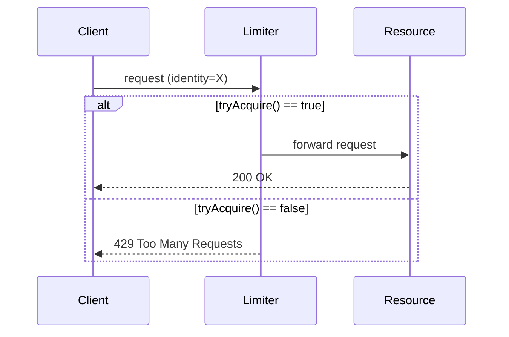
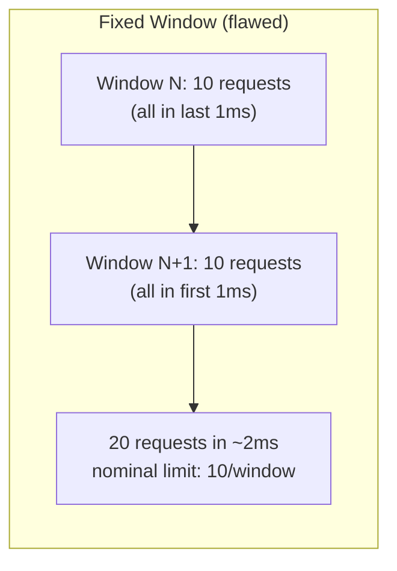
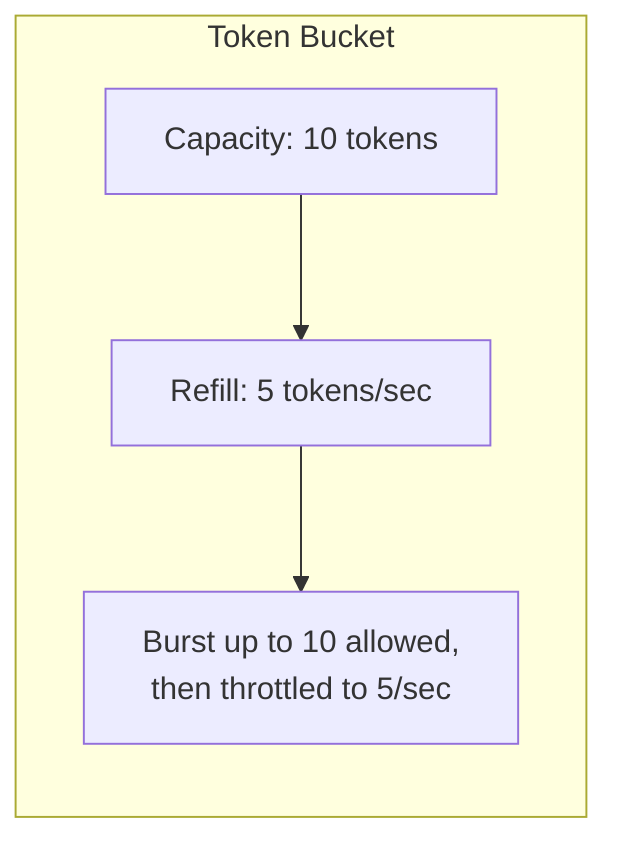

# Rate Limiting and Throttling Algorithms

> **Topic register:** T-808 · IWI 7.6 · Staff tier · High interview frequency.
> **Provenance:** every algorithm in this chapter is a real, executed Java 21
> implementation, and every measured number is real output from real concurrent
> threads and real wall-clock timing — not a description of expected behavior.
> Reproducible source:
> [`practice/java/system-design/rate-limiting-and-throttling/`](../../practice/java/system-design/rate-limiting-and-throttling/README.md).

## Table of Contents

1. [Learning Objectives](#learning-objectives)
2. [Why This Matters in Interviews](#why-this-matters-in-interviews)
3. [Mental Model](#mental-model)
4. [Definition and Purpose](#definition-and-purpose)
5. [Core Concepts](#core-concepts)
6. [Internal Implementation](#internal-implementation)
7. [Execution Flow](#execution-flow)
8. [Diagrams](#diagrams)
9. [Java Examples](#java-examples)
10. [Production Scenarios](#production-scenarios)
11. [Failure Modes and Debugging](#failure-modes-and-debugging)
12. [Trade-offs](#trade-offs)
13. [Performance Implications](#performance-implications)
14. [Concurrency Implications](#concurrency-implications)
15. [Decision Framework](#decision-framework)
16. [Comparisons](#comparisons)
17. [Common Mistakes](#common-mistakes)
18. [Anti-Patterns](#anti-patterns)
19. [Best Practices](#best-practices)
20. [Interview Answer Framework](#interview-answer-framework)
21. [Interview Questions](#interview-questions)
22. [Summary](#summary)
23. [Key Takeaways](#key-takeaways)
24. [Cheat Sheet](#cheat-sheet)
25. [Flashcards](#flashcards)
26. [Practice Exercises](#practice-exercises)
27. [Solutions](#solutions)
28. [Additional Reading](#additional-reading)
29. [Official References](#official-references)

## Learning Objectives

After this chapter you should be able to:

- Implement fixed-window, sliding-window-log, sliding-window-counter, token-bucket,
  and leaky-bucket rate limiters from memory, including their real failure modes.
- Explain, with a concrete attack, why fixed-window counting allows up to 2x its
  nominal limit at a window boundary — and which algorithms don't have that flaw.
- Explain why a naive check-then-increment limiter has a real race under concurrent
  access, and what closes it.
- Reason about where a rate limiter should live (client, edge/gateway, service,
  per-user vs. per-IP vs. per-API-key) and what each placement actually protects.
- Distinguish rate limiting (protecting a resource from overload) from throttling
  (deliberately slowing a client) and from backpressure (a downstream signal that
  propagates upstream), and use each term precisely in an interview.

## Why This Matters in Interviews

Rate limiting is one of the highest-frequency "build me a system" prompts in Staff
system-design interviews — asked standalone ("design a rate limiter"), embedded inside
API-gateway and multi-tenant SaaS designs, and as a live-coding exercise (implement
token bucket in 20 minutes). It rewards exactly the kind of precision Staff interviews
select for: there are five well-known algorithms with genuinely different failure
modes, and confusing them ("sliding window" meaning the log when the interviewer meant
the counter approximation) is a fast, visible signal of shallow preparation. It also
has a real, subtle concurrency dimension most candidates miss entirely: a
check-then-increment limiter has the same class of race as any other read-modify-write
without synchronization, and naming that race — and its fix — is a strong differentiator
at Senior level and an expected baseline at Staff level.

## Mental Model

Every rate limiter answers the same question — "has this identity used up its budget
in the relevant window of time?" — and every algorithm is a different trade-off between
three things: how *exact* the answer is, how much *memory* it costs per identity, and
how *bursty* a legitimate client is allowed to be. Fixed window is cheap and wrong at
the boundary. Sliding window log is exact and expensive. Sliding window counter
approximates the log cheaply. Token bucket allows controlled burst up to a capacity,
then a steady refill rate. Leaky bucket forces a *constant* output rate regardless of
how bursty the input was — it does not just cap the rate, it smooths it.

## Definition and Purpose

**Rate limiting** restricts how many requests an identity (a user, an API key, an IP,
a tenant) may make in a given time period, protecting a shared resource — a database,
a downstream service, a per-tenant fairness guarantee — from being overwhelmed by any
single caller. **Throttling** is the closely related act of deliberately slowing or
delaying a caller once it exceeds its budget, rather than rejecting it outright; a
rate limiter is the *decision* mechanism, throttling is one possible *response* to that
decision (the other common response being an outright HTTP 429 rejection). Rate
limiting exists because unbounded demand from any single source — a buggy retry loop, a
scraping bot, a single noisy tenant in a multi-tenant system — can otherwise consume
capacity that was meant to be shared, and because some downstream dependencies (a
third-party API with its own contractual rate limit) impose a hard external ceiling
that must be respected or the whole integration gets cut off.

## Core Concepts

- **Identity.** What is being limited: per-user, per-API-key, per-IP, per-tenant, or a
  composite key. The choice determines both fairness and how easy the limit is to
  evade (per-IP limiting is trivially defeated by an attacker with many IPs; per-API-key
  is not, but requires authentication to already be resolved before the limiter runs).
- **Window.** The time span the budget applies to — 100 requests per minute, 1000 per
  day. Fixed windows are wall-clock-aligned (e.g., every 00-second, 60-second span);
  sliding windows are relative to "now."
- **Burst vs. sustained rate.** A limit of "10/second" can either forbid any burst
  above 10 in any instant (leaky bucket) or allow a burst up to some capacity as long as
  the *average* stays at 10/second (token bucket) — these are materially different
  guarantees for the same nominal number.
- **Local vs. distributed state.** A single-process, in-memory limiter (this chapter's
  demos) is exact but useless across multiple service instances; a real production
  limiter behind a load balancer needs shared state (commonly Redis, using `INCR` +
  `EXPIRE` or a Lua script for the sliding-window-counter variant) — see
  [Production Scenarios](#production-scenarios) below for what that adds and what it costs.

## Internal Implementation

**Fixed window counter.** A single integer counter per identity, reset when the
current wall-clock window rolls over. [`FixedWindowCounter.java`](../../practice/java/system-design/rate-limiting-and-throttling/FixedWindowCounter.java)
aligns windows to absolute time (`(now / windowMillis) * windowMillis`), not relative to
first request, so all identities share the same window boundaries — this is what makes
the boundary-burst attack possible and deterministic.

**Sliding window log.** A per-identity, timestamp-ordered log (here, an `ArrayDeque<Long>`)
of every admitted request's timestamp. On each call, evict everything older than the
window from the front, then admit only if the remaining count is under the limit — see
[`SlidingWindowLog.java`](../../practice/java/system-design/rate-limiting-and-throttling/SlidingWindowLog.java).
Exact, but the memory cost is O(limit) per identity and eviction work is O(evicted-count)
per call.

**Sliding window counter.** The production approximation used by Cloudflare and Kong:
keep only two integers — the current and previous fixed-window counts — and estimate the
sliding-window count as `previousCount * overlapFraction + currentCount`, where
`overlapFraction` is how much of the previous window still falls inside the trailing
window from "now." See [`SlidingWindowCounter.java`](../../practice/java/system-design/rate-limiting-and-throttling/SlidingWindowCounter.java).
O(1) memory and O(1) work per call, at the cost of being a statistical estimate (it
assumes uniform distribution of requests within the previous window, which is not
always true) rather than an exact count.

**Token bucket.** A capacity and a continuous refill rate. Each call lazily computes
how many tokens have accrued since the last call (`elapsedSeconds * refillPerSecond`,
capped at capacity), then admits if at least one token is available and debits it. See
[`TokenBucket.java`](../../practice/java/system-design/rate-limiting-and-throttling/TokenBucket.java).
Lazy refill (computed on access, not a background timer) is the standard production
shape — it needs no background thread and is exact regardless of how long the bucket
sits idle.

**Leaky bucket.** Modeled here as a queue with a fixed capacity and a background thread
draining it at a fixed rate — see [`LeakyBucket.java`](../../practice/java/system-design/rate-limiting-and-throttling/LeakyBucket.java).
Requests that fit under capacity are enqueued and *will* be processed, just delayed;
requests beyond capacity are rejected immediately. This is "leaky bucket as a queue" —
the common production framing — as opposed to "leaky bucket as a meter" (an
accounting-only variant that behaves identically to token bucket in reverse and is
rarely implemented separately in practice).

## Execution Flow



For the leaky-bucket variant specifically, the "forward request" step does not happen
synchronously — the request is enqueued and a background drain loop dequeues and
processes it at the fixed leak rate, which is why leaky bucket smooths bursts into a
delayed, steady stream rather than accepting-or-rejecting instantly like the other four
algorithms.

## Diagrams





## Java Examples

Fixed window's boundary flaw, minimal reproduction (see the full
[`BoundaryBurstDemo.java`](../../practice/java/system-design/rate-limiting-and-throttling/BoundaryBurstDemo.java)
for the real timed version):

```java
FixedWindowCounter limiter = new FixedWindowCounter(10, 200); // 10 per 200ms

// 10 requests land in the last millisecond of window N — all admitted.
for (int i = 0; i < 10; i++) limiter.tryAcquire(); // true x10

// window rolls over

// 10 more requests land in the first millisecond of window N+1 — all admitted too.
for (int i = 0; i < 10; i++) limiter.tryAcquire(); // true x10 again

// Real result: 20 requests admitted across a real elapsed span far under 200ms,
// against a nominal limit of 10 per 200ms.
```

Token bucket's lazy refill, the core of the production algorithm:

```java
synchronized boolean tryAcquire() {
    long now = System.nanoTime();
    double elapsedSeconds = (now - lastRefillNanos) / 1_000_000_000.0;
    lastRefillNanos = now;
    tokens = Math.min(capacity, tokens + elapsedSeconds * refillPerSecond);
    if (tokens >= 1.0) {
        tokens -= 1.0;
        return true;
    }
    return false;
}
```

The real, measured boundary-burst result across all four non-naive algorithms
(limit = 10 per 200ms window, attack straddling a real window boundary):

```
FixedWindowCounter               before-boundary=10 after-boundary=10 total-admitted-in-burst=20 (nominal limit=10)
SlidingWindowLog                 before-boundary=10 after-boundary=0 total-admitted-in-burst=10 (nominal limit=10)
SlidingWindowCounter (approx)    before-boundary=10 after-boundary=0 total-admitted-in-burst=10 (nominal limit=10)
TokenBucket                      before-boundary=10 after-boundary=0 total-admitted-in-burst=10 (nominal limit=10)
```

## Production Scenarios

**Scenario: a per-tenant API limit doubled under load, at a service with three
instances behind a load balancer.** Symptoms: a customer complained they were rate
limited far less aggressively than the documented "1000 requests/minute" — closer to
2800/minute during a burst. Initial hypothesis: a bug in the limiter's math. Evidence:
each of the three service instances ran its own in-memory `FixedWindowCounter`, with no
shared state — every instance independently enforced 1000/minute, so the *effective*
limit for any tenant whose requests were load-balanced across all three was up to
3000/minute, and the customer's real, bursty traffic pattern happened to land closer to
2800 than the theoretical 3000 ceiling. Diagnosis: the limiter's algorithm was correct;
its *placement* was wrong — per-instance local state cannot enforce a global limit once
there is more than one instance. Immediate mitigation: temporarily route each tenant's
traffic to a single sticky instance via the load balancer's session affinity. Permanent
remediation: move the counter to a shared, single source of truth — Redis, using `INCR`
with a `PEXPIRE` set only on the first increment of each window (an atomic `EVAL` Lua
script to avoid a race between the `INCR` and the conditional `PEXPIRE`), so all three
instances check the same count. Trade-off accepted: every rate-limit check now costs a
network round-trip to Redis instead of an in-memory comparison — acceptable because the
check is on the request's fast path already talking to other shared infrastructure, and
because Redis's own latency (sub-millisecond, same availability zone) is negligible next
to the request's total latency budget. Prevention: any rate limiter design review now
explicitly asks "is this limiter's state local to one process, and does that process
run as more than one instance?" as a first question. Interview lesson: this is the
single most common way an interview candidate's otherwise-correct algorithm answer
loses points — describing token bucket perfectly but never mentioning that a
multi-instance deployment needs shared state for the limit to mean what it says.

## Failure Modes and Debugging

- **Local state under horizontal scaling** (see the scenario above) — the limit
  silently multiplies by the instance count. Debug signal: the *effective* observed
  limit is a near-integer multiple of the configured limit, and it changes when the
  deployment scales up or down.
- **Boundary-burst under fixed window** — a client can legitimately hit up to 2x the
  nominal limit in a short span straddling a window edge, with no bug anywhere; this is
  the algorithm working as designed. Debug signal: burst violations cluster
  suspiciously close to round wall-clock times (every :00 second, every minute mark).
- **Unsynchronized check-then-increment race** — the real, reproducible bug this
  chapter's `ConcurrencyRaceDemo` demonstrates: 3 of 10 real runs at 64 concurrent
  threads overshot a limit of 100 by 1-2 requests. Debug signal: overshoot is small
  (a handful of requests, not orders of magnitude) and does not reproduce on every run
  — a hallmark of a genuine data race rather than a logic bug.
- **Clock skew in a distributed limiter** — if window alignment or token-bucket refill
  timing is computed from each node's local clock rather than a shared clock source
  (or from monotonic elapsed time, which the demos in this chapter correctly use via
  `System.nanoTime()`), nodes can disagree about which window a request falls in.

## Trade-offs

Fixed window: cheapest (one integer, O(1) memory and time) but allows a real 2x
boundary burst. Sliding window log: exact, but O(limit) memory per identity and O(n)
eviction work per call — expensive at high limits or high identity cardinality.
Sliding window counter: O(1) memory and time, no boundary-burst flaw, but is a
statistical approximation, not an exact count. Token bucket: allows controlled burst up
to capacity, simple and cheap, but "burst up to capacity, then steady" is a materially
different guarantee than "never more than N in any window" — pick it when bursty,
legitimate traffic (a client that batches work) should be allowed. Leaky bucket:
enforces a genuinely constant output rate, which is exactly what you want when the
*downstream* system cannot tolerate any burst at all (a fixed-capacity legacy system,
a third-party API with a hard concurrency ceiling) — but it adds real queuing latency
to every request, including ones that arrived well within budget.

## Performance Implications

Fixed window, token bucket, and sliding window counter are all O(1) time and O(1)
space per identity per check — the right choice at high request volume or high
identity cardinality (millions of users). Sliding window log's O(limit) memory per
identity becomes a real capacity-planning concern: a limit of 10,000/hour tracked
exactly for a million identities is 10 billion timestamps' worth of worst-case memory,
which is why the log variant is used far less often in practice than the counter
approximation despite being simpler to reason about. Leaky bucket's queue adds real
latency (a request submitted when the queue has N items ahead of it waits roughly
N / leakRate before completing) — the [`LeakyBucketSmoothingDemo`](../../practice/java/system-design/rate-limiting-and-throttling/LeakyBucketSmoothingDemo.java)
run in this chapter's practice directory measured a real average 104ms gap between
completions against an expected 100ms (leak rate 10/s), with the last of 30
burst-submitted requests completing at real t+3120ms — over three full seconds of
added latency for a request that "arrived" at t+0.

## Concurrency Implications

Every algorithm in this chapter has a check-then-act sequence (check remaining budget,
then debit it) that is not atomic unless explicitly guarded — this is a textbook
read-modify-write race, the same class of bug covered in
[Atomics, CAS, and the ABA Problem](../../syllabus/02-java/concurrency/atomics-cas-and-the-aba-problem.md).
This chapter's own [`ConcurrencyRaceDemo.java`](../../practice/java/system-design/rate-limiting-and-throttling/ConcurrencyRaceDemo.java)
proves this concretely rather than asserting it: an unsynchronized
`if (count < limit) count++` limiter, driven by 64 real threads making 3,200 total
attempts against a limit of 100, overshot the limit on 3 of 10 real runs (101-102
admitted). The `synchronized`-guarded `FixedWindowCounter` was exact at 100 on every
run, including all ten shown in the practice README. In a distributed deployment, the
equivalent race exists at the shared-state layer instead — a plain Redis `GET` then
`SET` from two service instances has the identical race, which is why production
distributed limiters use `INCR` (atomic on a single Redis instance) or a Lua script
(atomic across multiple operations) rather than a naive read-then-write round trip.

## Decision Framework

| Question | If yes, lean toward |
|---|---|
| Must the limit be exact, never off by even one request? | Sliding window log (if identity cardinality is low) |
| Is memory-per-identity a real constraint (millions of identities)? | Sliding window counter or token bucket |
| Should legitimate bursts be allowed, as long as the average holds? | Token bucket |
| Does the downstream system need a truly constant, non-bursty rate? | Leaky bucket |
| Is this running on more than one service instance? | Any algorithm, but state must move to shared storage (Redis) |
| Is simplicity/no-external-dependency more important than boundary exactness? | Fixed window (accept the 2x boundary risk) |

## Comparisons

| Algorithm | Exactness | Memory/identity | Allows burst | Typical production use |
|---|---|---|---|---|
| Fixed window | Flawed (2x at boundary) | O(1) | Yes, at boundary only | Cheap, low-stakes limits |
| Sliding window log | Exact | O(limit) | No | Low-cardinality, high-stakes limits |
| Sliding window counter | Approximate | O(1) | Minimal | Cloudflare/Kong-style API gateways |
| Token bucket | Exact (by design) | O(1) | Yes, up to capacity | API rate limits, AWS-style throttling |
| Leaky bucket | Exact (by design) | O(capacity) queued | No — smooths to constant | Protecting a fixed-capacity downstream |

## Common Mistakes

- Saying "sliding window" without specifying log vs. counter — these have different
  cost profiles and different exactness guarantees, and interviewers will probe which
  one is meant.
- Designing a rate limiter's algorithm correctly but never addressing where its state
  lives once the service runs on more than one instance (the single most common gap,
  per the production scenario above).
- Confusing token bucket's "burst up to capacity" with leaky bucket's "constant output
  rate" — they answer different questions and are not interchangeable defaults.
- Treating a rate limiter's check-then-increment as atomic without justification —
  either name the synchronization mechanism (a lock, an atomic Redis operation) or
  acknowledge the race.

## Anti-Patterns

- **Rate limiting only at the edge/gateway, with no per-tenant fairness inside a
  multi-tenant service** — a single tenant that stays under the global limit can still
  starve other tenants sharing the same downstream resource; the limiter needs a
  per-identity, not just a global, budget.
- **Silently dropping rejected requests with no `Retry-After` header** — clients can't
  distinguish "come back later" from a hard failure, so they either hammer the endpoint
  immediately (worsening the overload) or treat a transient limit as a permanent error.
- **Using wall-clock time instead of a monotonic clock for window/refill math** — an
  NTP adjustment or a clock going backward can cause a negative elapsed time and
  corrupt the refill calculation; this chapter's implementations use
  `System.nanoTime()` for elapsed-time math specifically to avoid this.

## Best Practices

- Return HTTP 429 with a `Retry-After` header (see [RFC 6585](https://www.rfc-editor.org/rfc/rfc6585))
  so well-behaved clients back off correctly instead of retrying immediately.
- Rate limit at the layer closest to the resource being protected, not only at the
  outermost edge, when per-tenant fairness inside a shared downstream matters.
- Prefer token bucket or sliding window counter for most production API limits — they
  are the best balance of correctness, cost, and the ability to allow reasonable
  bursts.
- Make the limiter's shared-state dependency (Redis, or equivalent) itself resilient —
  a rate limiter that fails open under Redis unavailability protects availability but
  loses the guarantee; failing closed protects the guarantee but turns a Redis outage
  into a full outage. State which one your system does, deliberately, rather than by
  accident of implementation.

## Interview Answer Framework

### 30-Second Answer

A rate limiter restricts how many requests an identity can make in a time window, to
protect a shared resource from overload. The five standard algorithms — fixed window,
sliding window log, sliding window counter, token bucket, leaky bucket — trade off
exactness, memory cost, and burst tolerance differently; token bucket and sliding
window counter are the most common production choices.

### 2-Minute Answer

Rate limiting exists to protect a shared resource — a database, a downstream
dependency, per-tenant fairness — from any single caller consuming more than its share.
The naive approach, a fixed-window counter, is cheap but has a real flaw: a client can
send its full limit right before a window boundary and again right after, getting up
to 2x its nominal budget in a short span. Sliding window log fixes this exactly but
costs memory proportional to the limit per identity. Sliding window counter
approximates the log cheaply using just two counters. Token bucket allows a controlled
burst up to a capacity and then a steady refill rate — the standard choice for most API
rate limits. Leaky bucket instead forces a constant output rate regardless of input
burstiness, which matters when the downstream system genuinely cannot tolerate any
burst. In production, the hard part is rarely the algorithm — it's that the limiter's
state has to be shared across every instance of a horizontally scaled service, usually
via Redis, or the effective limit silently multiplies by the instance count.

### 10-Minute Deep Dive

Cover: the check-then-act race in a single-process limiter (walk through the
`ConcurrencyRaceDemo` result — 3 of 10 real runs overshot); why the fix (`synchronized`,
or an atomic compare-and-swap) generalizes to the distributed case as an atomic Redis
`INCR` or Lua script; the boundary-burst math for fixed window (show the real 10+10=20
result); the memory cost curve for sliding window log at scale; when to choose token
bucket vs. leaky bucket based on whether burst tolerance or constant-rate smoothing is
the actual requirement; and the fail-open-vs-fail-closed decision when the shared-state
backing store is unavailable.

### Whiteboard Explanation

Draw a timeline with tick marks for window boundaries. Show 10 dots clustered just
before one boundary and 10 more just after — label it "fixed window: 20 admitted,
limit was 10." Then redraw the same 20 dots with a sliding window line moving
continuously across the timeline, showing it only ever sees at most 10 inside any
200ms span — label it "sliding window: 10 admitted, correctly capped." This single
picture is the fastest way to make the boundary-burst flaw and its fix intuitively
obvious to an interviewer.

### Production Example

Use the shared-state-across-instances scenario from [Production Scenarios](#production-scenarios):
a per-tenant limit that appeared to triple because three service instances each ran an
independent, correct, in-memory limiter with no shared state.

### Trade-offs to Mention

Exactness vs. memory cost (log vs. counter), burst tolerance vs. constant-rate
smoothing (token bucket vs. leaky bucket), and local simplicity vs. distributed
correctness (in-memory vs. Redis-backed).

### Common Candidate Mistakes

Describing only one algorithm as if it were "the" rate limiter; never mentioning
concurrency or the distributed-state problem; conflating rate limiting with
throttling or backpressure as if they were the same mechanism.

### Typical Follow-Up Questions

"What happens if two service instances both run this limiter?" "How would you make
the check-then-increment atomic without a lock?" "What does the client see when it's
rate limited, and how should it react?" "How would you rate limit per-tenant instead of
per-IP, and why does that change the evasion resistance?"

### Senior-Level Expectations

Implement at least token bucket and fixed window correctly, including the
`synchronized` guard, and explain the boundary-burst flaw with a concrete example
without prompting.

### Staff-Level Discussion

Reason about the operational and organizational cost of the shared-state dependency
(Redis becomes a new availability-critical component for every rate-limited request in
the system); the fail-open/fail-closed decision as a deliberate, documented trade-off
rather than an accident; and how a rate-limiting layer shared across many teams'
services (a platform-level API gateway) creates a governance question — who owns the
default limits, and what's the process for a team to request a higher one — that has
nothing to do with the algorithm itself.

## Interview Questions

### Question 1: Implement a token bucket rate limiter.

**Why interviewers ask it.** It's a small enough algorithm to code live in 15-20
minutes, but has enough real edge cases (lazy vs. eager refill, thread safety, capacity
clamping) to differentiate candidates clearly.

**Expected answer.** A capacity, a refill rate, and either lazy (compute elapsed time
on each call) or eager (background thread) refill; lazy is preferred in production
because it needs no background thread and is exact regardless of idle time.

**Minimum acceptable answer.** A working single-threaded implementation with correct
capacity clamping.

**Strong Senior answer.** The above, plus explicit thread-safety (a lock or atomic
CAS loop) and a clear explanation of why lazy refill is preferred.

**Staff-level extension.** Extends to the distributed case: how would this work backed
by Redis, and what does the atomic increment-and-check operation look like there
(a Lua script combining the refill-and-consume logic in one round trip).

**Common mistakes.** Forgetting to clamp tokens at capacity (allows unbounded
accumulation during long idle periods); non-atomic check-then-decrement under
concurrency.

**Likely follow-ups.** "What if refillPerSecond is very high — any floating-point
concerns?" "How do you test this without sleeping in the test?"

**Evaluation criteria.** Correctness under single-threaded use (3), thread-safety
addressed (1), distributed extension addressed at Staff level (1).

### Question 2: Why does a fixed-window rate limiter allow more than its configured limit?

**Why interviewers ask it.** It's the single most common "gotcha" in this topic, and
it tests whether the candidate actually understands the algorithm's mechanics or just
memorized its name.

**Expected answer.** Because the window resets at an absolute wall-clock boundary with
no memory of the previous window's activity, a client can send its full limit in the
last instant of one window and its full limit again in the first instant of the next,
achieving close to 2x the nominal rate in a very short real time span.

**Minimum acceptable answer.** States that the flaw exists, even without a precise
mechanism.

**Strong Senior answer.** The above, with a concrete numeric example (10 in the last
1ms of window N, 10 more in the first 1ms of window N+1).

**Staff-level extension.** Names sliding window counter as the standard production
fix and explains its O(1) cost advantage over sliding window log.

**Common mistakes.** Confusing this with the *concurrency* race — they are two
different problems (this one is deterministic and single-threaded; the race is
non-deterministic and requires concurrent access).

**Likely follow-ups.** "How would sliding window counter behave under this same
attack?" (Answer: caps it at 10, as this chapter's real `BoundaryBurstDemo` output
shows.)

**Evaluation criteria.** Correct mechanism (2), concrete example (1), names the fix
(1), distinguishes from the concurrency race when prompted (1).

## Summary

Five algorithms answer "has this identity used its budget?" with different trade-offs:
fixed window is cheap but allows a real boundary-doubling burst; sliding window log is
exact but memory-expensive; sliding window counter approximates it cheaply; token
bucket allows controlled burst with steady refill; leaky bucket forces genuinely
constant output. Every algorithm's check-then-act sequence is a real concurrency
hazard unless explicitly guarded, and every algorithm's *state* must move to shared
storage once a service runs on more than one instance, or the effective limit silently
multiplies by the instance count.

## Key Takeaways

- Fixed window can really admit 2x its nominal limit at a boundary — this chapter's
  own demo measured exactly that (10 before + 10 after = 20, limit was 10).
- An unsynchronized rate limiter has a real, intermittent race under concurrency —
  measured here at 3 overshoots in 10 runs at 64 threads.
- Token bucket and sliding window counter are the standard production choices for most
  API rate limits; leaky bucket is for when the downstream truly cannot tolerate burst.
- The algorithm is rarely the hard part in production — sharing the limiter's state
  correctly across every instance of a horizontally scaled service is.

## Cheat Sheet

- **Fixed window**: O(1)/O(1), flawed at boundaries (up to 2x burst). Use for
  low-stakes, cheap limits.
- **Sliding window log**: exact, O(limit) memory. Use for low-cardinality, high-stakes
  limits.
- **Sliding window counter**: O(1)/O(1), approximate, no boundary flaw. Default choice
  at scale.
- **Token bucket**: allows burst to capacity, then steady rate. Default choice for most
  API limits.
- **Leaky bucket**: forces constant output rate, adds queuing latency. Use to protect a
  fixed-capacity downstream.
- **Always** guard check-then-act with a lock, atomic CAS, or an atomic distributed
  primitive (Redis `INCR`/Lua script).
- **Always** move limiter state to shared storage once running more than one instance.

## Flashcards

### Card: Fixed window boundary flaw

**Prompt:**
Why can a fixed-window rate limiter admit up to 2x its configured limit?

**Answer:**
Because the window resets at an absolute wall-clock boundary with no memory of the
previous window — a client can send a full limit's worth of requests in the last
instant of one window and another full limit's worth in the first instant of the next.

**Why it matters:**
The single most common "gotcha" question on this topic; failing to explain it signals
memorized-name-only knowledge of the algorithm.

**Common trap:**
Confusing this deterministic, single-threaded flaw with the separate concurrency race
that affects all five algorithms.

**Related:**
[[rate-limiting-and-throttling-algorithms]]

### Card: Token bucket vs. leaky bucket

**Prompt:**
What's the actual behavioral difference between token bucket and leaky bucket, given
the same nominal rate?

**Answer:**
Token bucket allows a burst up to its capacity as long as the long-run average stays at
the refill rate. Leaky bucket forces a genuinely constant output rate regardless of how
bursty the input was, adding queuing delay to smooth the burst away entirely.

**Why it matters:**
They are not interchangeable defaults — the choice depends on whether the downstream
system can tolerate burst at all.

**Common trap:**
Describing leaky bucket as "just token bucket in reverse" without naming the queuing/
smoothing behavior that makes it actually different in observed effect.

**Related:**
[[rate-limiting-and-throttling-algorithms]]

### Card: The distributed rate limiter's real bottleneck

**Prompt:**
What's the hardest part of a production rate limiter, once the algorithm itself is
correct?

**Answer:**
Sharing the limiter's state correctly across every instance of a horizontally scaled
service — an in-memory, per-instance limiter's effective limit silently multiplies by
the instance count unless state moves to shared storage (commonly Redis with an atomic
`INCR` or Lua script).

**Why it matters:**
This is the gap that separates a correct-algorithm answer from a Staff-level
production-ready answer in interviews.

**Common trap:**
Assuming a correct single-process implementation is "done" without addressing
multi-instance deployment.

**Related:**
[[rate-limiting-and-throttling-algorithms]], [[load-balancing-service-discovery-and-health-checking]]

## Practice Exercises

1. Implement a distributed token bucket backed by a real Redis instance (via Docker),
   using a Lua script (`EVAL`) to make the refill-and-consume sequence atomic across
   the network round trip. Verify with real concurrent clients from multiple JVM
   processes that the limit holds exactly, unlike the naive Redis `GET`-then-`SET`
   version.
2. Extend `ConcurrencyRaceDemo` to run the naive counter under progressively higher
   thread counts (16, 64, 256) and measure how the real overshoot frequency and
   magnitude change — does more contention make the race more or less likely to
   manifest per run, and why?
3. Add a `Retry-After`-aware client wrapper around any of this chapter's limiters that,
   on rejection, sleeps for the real remaining time until the next token/window
   opportunity rather than retrying immediately — measure the real reduction in
   rejected-then-retried request volume compared to immediate retry.

## Solutions

Exercise 1 requires real Redis infrastructure and is intentionally left unimplemented
in this chapter's practice directory — it is the natural next step from the
single-JVM demos here into the distributed case discussed in
[Production Scenarios](#production-scenarios), and is well suited to the same
Docker-based real-infrastructure pattern used in
[Multi-Region, Failover, and Disaster Recovery](multi-region-failover-and-disaster-recovery.md).
Exercises 2 and 3 are direct extensions of
[`ConcurrencyRaceDemo.java`](../../practice/java/system-design/rate-limiting-and-throttling/ConcurrencyRaceDemo.java)
and are left as self-directed practice; the existing demo's structure (a `Supplier` of
`Acquirer` plus a `CountDownLatch`-gated thread pool) generalizes directly to both.

## Additional Reading

- Cloudflare's engineering blog post on the sliding-window-counter approximation
  (see Official References) is the clearest public explanation of why the counter
  variant is preferred over the log variant at scale.
- [Idempotency at System Edges](idempotency.md) covers the closely related but distinct
  problem of handling *retries* safely — relevant because a rejected, rate-limited
  request that the client retries must still be handled idempotently once it is
  eventually admitted.

## Official References

- Cloudflare Engineering Blog, ["Counting Things: A Lot of Different Things"](https://blog.cloudflare.com/counting-things-a-lot-of-different-things/)
- Wikipedia, [Token bucket](https://en.wikipedia.org/wiki/Token_bucket)
- Wikipedia, [Leaky bucket](https://en.wikipedia.org/wiki/Leaky_bucket)
- IETF RFC 6585, [Additional HTTP Status Codes (429 Too Many Requests)](https://www.rfc-editor.org/rfc/rfc6585)
