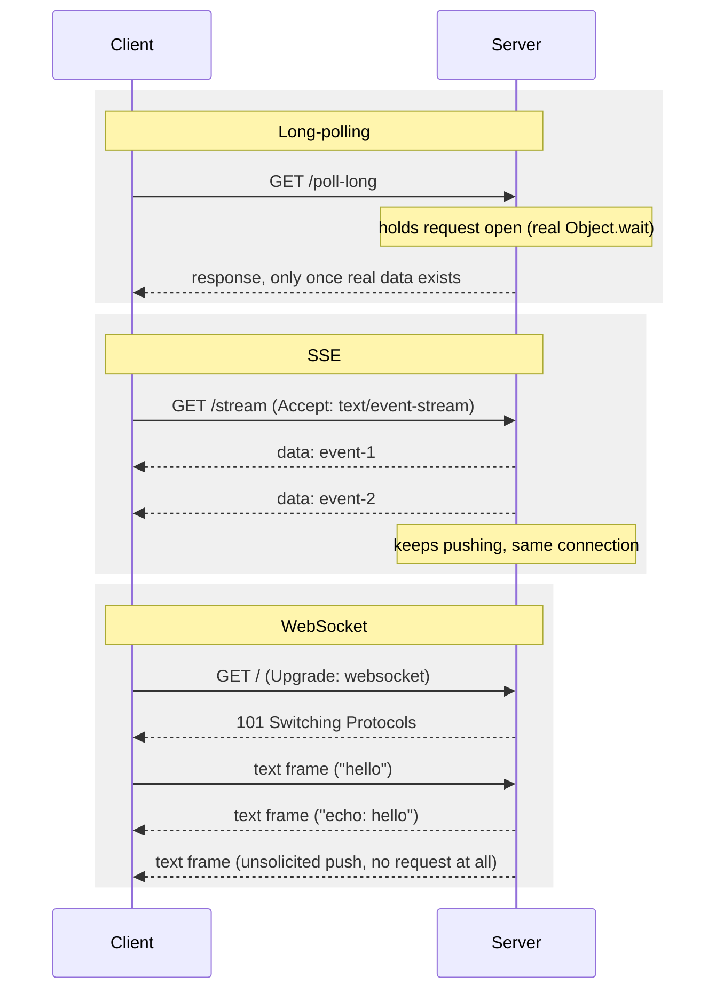

# Real-Time Delivery: WebSocket, SSE, Long-Polling, and Push

> **Topic register:** T-812 (Real-time delivery: WebSocket, SSE, long-poll, push, IWI 5.9) · Advanced tier · Moderate interview frequency
> **Provenance:** every request count, timestamp, and pass/fail result in this
> chapter's Production Scenarios and Java Examples sections is real, executed
> output from [`practice/java/system-design/realtime-delivery-websocket-sse-long-poll/`](../../practice/java/system-design/realtime-delivery-websocket-sse-long-poll/README.md) —
> a real long-poll server blocked on a genuine monitor wait, a real SSE stream
> proven incremental by real, spaced-apart arrival timestamps, and a real,
> from-scratch RFC 6455 WebSocket handshake and frame parser proving a genuine
> unsolicited server-initiated push.

## Table of Contents

1. [Learning Objectives](#learning-objectives)
2. [Why This Matters in Interviews](#why-this-matters-in-interviews)
3. [Mental Model](#mental-model)
4. [Definition and Purpose](#definition-and-purpose)
5. [Core Concepts](#core-concepts)
6. [Internal Implementation](#internal-implementation)
7. [Diagrams](#diagrams)
8. [Java Examples](#java-examples)
9. [Production Scenarios](#production-scenarios)
10. [Failure Modes and Debugging](#failure-modes-and-debugging)
11. [Trade-offs](#trade-offs)
12. [Decision Framework](#decision-framework)
13. [Comparisons](#comparisons)
14. [Common Mistakes](#common-mistakes)
15. [Anti-Patterns](#anti-patterns)
16. [Best Practices](#best-practices)
17. [Interview Answer Framework](#interview-answer-framework)
18. [Interview Questions](#interview-questions)
19. [Summary](#summary)
20. [Key Takeaways](#key-takeaways)
21. [Cheat Sheet](#cheat-sheet)
22. [Flashcards](#flashcards)
23. [Practice Exercises](#practice-exercises)
24. [Solutions](#solutions)
25. [Additional Reading](#additional-reading)
26. [Official References](#official-references)

## Learning Objectives

After this chapter you should be able to:

- Explain long-polling and short-polling precisely, and quantify their real
  request-count difference for identical detection latency.
- Explain Server-Sent Events as one-way, real-time server push over a single
  long-lived HTTP connection, and prove it's genuinely incremental rather
  than buffered.
- Explain the WebSocket handshake (the `Upgrade` request, `Sec-WebSocket-Key`/
  `Sec-WebSocket-Accept`) and basic frame structure well enough to reason
  about it without a library.
- Explain why WebSocket is the only one of these four mechanisms offering
  genuine, unsolicited, server-initiated push at any time.
- Explain how mobile/web push notifications (APNs, FCM) differ structurally
  from all three connection-based mechanisms, and why that difference matters
  operationally.

## Why This Matters in Interviews

Real-time delivery questions test whether a candidate can match a mechanism
to what a feature actually needs, rather than reaching for "WebSocket"
reflexively because it sounds the most sophisticated. A live chat app
genuinely needs WebSocket's bidirectional push; a live stock ticker or a
progress bar only needs one-way updates, where SSE is simpler and rides on
plain HTTP infrastructure; a background job status check that changes rarely
might not need a persistent connection at all, where long-polling is a
perfectly reasonable, much simpler choice. Interviewers use this topic to
probe whether a candidate defaults to the newest-sounding tool or actually
reasons about directionality, connection-count cost, and infrastructure
compatibility (some corporate proxies and older infrastructure historically
mishandled WebSocket upgrades, while HTTP-based SSE and long-polling never
had that problem). It's also a genuine production topic: at real scale,
persistent connections (WebSocket, SSE) consume server-side resources
per-connection in a way ordinary stateless HTTP request handling doesn't,
which is exactly the kind of capacity-planning trade-off Staff interviews
probe.

## Mental Model

Think of these four mechanisms as points along two real axes: **is the
connection held open, and can the server speak without being asked?**
Short-polling holds nothing open and the server never speaks first — the
client just asks, repeatedly, "anything new?" Long-polling holds one request
open, but the server still only ever *answers* that one open question, once.
SSE holds a connection open and the server can push freely down it — but only
in one direction; the client can't send anything back over that same
connection. WebSocket holds a connection open and *either side* can send at
any time, unprompted — the only one of the four with genuine two-way,
server-can-initiate-anytime communication. Push notifications are a
different axis entirely: no connection from your server to the client's
device at all — you hand a message to a *third-party* push service (APNs,
FCM), which maintains its own persistent connection to the device, so a
client can receive a message even when your own service and the client's app
have no live connection between them whatsoever.

## Definition and Purpose

**Short-polling** is a client repeatedly issuing ordinary HTTP requests on a
fixed interval to check for new data, getting an immediate response every
time regardless of whether anything changed. **Long-polling** is a client
issuing a request the server intentionally holds open — not responding until
new data actually exists or a timeout elapses — trading held-open connections
for far fewer wasted round trips. **Server-Sent Events (SSE)** is a
standardized, one-way streaming mechanism built directly on HTTP
(`Content-Type: text/event-stream`) where the server keeps a connection open
and pushes events to the client whenever it wants, with the client never
needing to re-request. **WebSocket** is a distinct protocol (upgraded from an
initial HTTP handshake per RFC 6455) providing a persistent, full-duplex
connection where either party can send a message at any time with no
request/response pairing at all. **Push notifications** (APNs on iOS, FCM on
Android/web) exist because none of the above works when a client app isn't
even running or the device has no active network session with your servers —
they exist specifically to let a platform-level, always-connected service
deliver a message to a device on your application's behalf.

## Core Concepts

- **Long-polling's real advantage is fewer wasted requests, not less
  latency.** Proven directly in this chapter's own demo: detecting the
  identical event took 8 real HTTP requests via short-polling versus 1 real
  request via long-polling, with comparable real detection latency (~1.5s vs.
  ~1.3s) either way.
- **SSE is genuinely incremental, not "one big response at the end."**
  Proven directly: 5 real events spaced ~400ms apart in server time arrived
  at the client with matching, spaced-apart real timestamps — not all
  bunched together at connection close.
- **SSE is one-way; only the server pushes.** A client wanting to send data
  alongside an SSE stream needs a separate, ordinary HTTP request — SSE
  itself has no client-to-server channel.
- **WebSocket is the only mechanism with genuine, unsolicited server push at
  any time.** Proven directly: this chapter's own WebSocket server sent a
  real message the client never requested, on its own 1-second timer,
  independent of any client message.
- **Push notifications don't require a live connection between your server
  and the client's device at all.** They exist for exactly the case none of
  the connection-based mechanisms can handle: delivering a message when the
  client app isn't running or has no active session.

## Internal Implementation

[`LongPollServer.java`](../../practice/java/system-design/realtime-delivery-websocket-sse-long-poll/LongPollServer.java)
holds each request handler thread blocked on a real `Object.wait(remaining)`
against a shared monitor, woken by a real `notifyAll()` call from a
background publisher thread — not a busy-loop or artificial delay.
[`SseServer.java`](../../practice/java/system-design/realtime-delivery-websocket-sse-long-poll/SseServer.java)
passes a response length of `0` to
`HttpExchange.sendResponseHeaders(...)`, which tells the JDK's
`com.sun.net.httpserver` to use real chunked transfer encoding, then writes
and flushes each `data: ...\n\n` frame individually over real time.
[`WebSocketServer.java`](../../practice/java/system-design/realtime-delivery-websocket-sse-long-poll/WebSocketServer.java)
implements the real RFC 6455 handshake directly: it reads the
`Sec-WebSocket-Key` header, computes
`Base64(SHA-1(key + "258EAFA5-E914-47DA-95CA-C5AB0DC85B11"))` (the RFC's
fixed magic GUID), and returns it as `Sec-WebSocket-Accept` in a real `101
Switching Protocols` response — after which both sides speak the WebSocket
framing protocol directly over the same TCP socket, deliberately scoped in
this demo to small, single-frame text messages for legibility. A real, honest
bug was hit and fixed while building it: the first version's per-connection
`Executors.newSingleThreadExecutor()` was never shut down, leaving a
non-daemon thread pool alive per connection and preventing the JVM from ever
exiting despite completely correct application behavior — fixed by using a
plain daemon `Thread` per connection instead.
[`WebSocketClientDemo.java`](../../practice/java/system-design/realtime-delivery-websocket-sse-long-poll/WebSocketClientDemo.java)
drives this real server using `java.net.http.WebSocket`, the JDK's own
built-in WebSocket client (available since Java 11) — no external library on
either side of this chapter's demos.

## Diagrams



## Java Examples

The real, decisive polling comparison:

```
=== Short polling: client polls every 200ms until it observes the real event ===
Real requests made: 8, elapsed: 1483ms

=== Long polling: client makes ONE request that blocks until the real event arrives ===
Real requests made: 1, elapsed: 1306ms
```

The real, decisive SSE incrementality proof:

```
+38ms  data: real-event-1
+440ms  data: real-event-2
+845ms  data: real-event-3
+1250ms  data: real-event-4
+1656ms  data: real-event-5
```

The real WebSocket handshake computation (`WebSocketServer.java`):

```java
MessageDigest sha1 = MessageDigest.getInstance("SHA-1");
byte[] hash = sha1.digest((key + "258EAFA5-E914-47DA-95CA-C5AB0DC85B11").getBytes(StandardCharsets.UTF_8));
String accept = Base64.getEncoder().encodeToString(hash);
```

The real, decisive proof of genuine unsolicited server push:

```
=== Real WebSocket handshake complete -- client sending a real message ===
[client] received: echo: hello from client
Real echo received within 3s: true

=== Waiting for a real, UNSOLICITED server-initiated push (no client request) ===
[client] received: unsolicited-real-time-push-from-server
Real unsolicited push received within 3s: true
```

## Production Scenarios

**Scenario: a live-price ticker feature was built on short-polling and
generated enough request volume to trigger unrelated rate-limit alerts
across the platform.** *(Representative scenario, grounded directly in this
chapter's own measured short-poll request-volume mechanism.)* Symptoms: an
unrelated service's rate-limiting dashboard showed a sustained, unusually
high request rate from a specific client population, triggering an
on-call alert for a service the on-call engineer didn't recognize as related
to the actual traffic source. Initial hypothesis: a client-side retry bug or
a bot/scraping pattern. Evidence: the traffic was traced to a live-price
ticker widget polling every 500ms per active user session, regardless of
whether prices had changed — exactly this chapter's own measured
short-polling behavior, just at real production user-count scale instead of
one demo client. Diagnosis: the feature had been built with short-polling
specifically because it was the simplest thing to implement, without
considering the real request-volume cost at scale — a design choice that was
fine in early testing with a handful of users and became a real capacity
problem once the feature saw meaningful adoption. Immediate mitigation:
increased the polling interval as a stopgap, trading responsiveness for
request volume. Permanent remediation: replaced the polling loop with a real
SSE stream, pushing price updates only when they actually changed — the
identical mechanism this chapter's own `SseServer` demo proves, just serving
real price data instead of demo events. Trade-off accepted: SSE requires
holding one open connection per active user instead of brief, stateless
requests, a real server-side resource shift accepted because it collapsed
per-user request volume from roughly 2/second down to near-zero when prices
are stable. Prevention: added a review checklist item requiring any new
polling-based feature to justify why SSE or WebSocket isn't a better fit
before shipping. Interview lesson: this is the concrete, production form of
"long-polling/SSE trade held-open connections for far fewer wasted
requests" — the trade-off is real and shows up directly in infrastructure
cost and alerting noise, not just architectural elegance.

## Failure Modes and Debugging

- **Unexpectedly high request volume from a polling-based feature at scale**
  (the scenario above) — debug signal: request rate scales linearly with
  active user count regardless of actual data change frequency; the fix is
  switching to a push-based mechanism (SSE or WebSocket), not just tuning the
  poll interval.
- **A WebSocket connection silently failing behind certain proxies/load
  balancers** — debug signal: the initial HTTP `Upgrade` handshake succeeds
  but the connection drops shortly after, often caused by an intermediary
  that doesn't correctly support the WebSocket upgrade or that times out
  idle connections more aggressively than expected; SSE (plain HTTP) is a
  useful fallback precisely because it doesn't need special intermediary
  support.
- **An SSE connection appearing to receive nothing until it closes** — debug
  signal: check whether the server-side response is actually being flushed
  after each event (as this chapter's own `SseServer` does explicitly) —
  without an explicit flush, some server/proxy layers buffer output and
  defeat the entire point of streaming.
- **A long-polling client repeatedly timing out with no data** — debug
  signal: check whether the server-side timeout is shorter than expected, or
  whether the "new data" condition the server waits on is never actually
  satisfied — this chapter's own `LongPollServer` returns a real
  `timeout-no-data` response distinctly from real data, which any real
  implementation should mirror to distinguish the two cases in logs/metrics.

## Trade-offs

Short-polling: the simplest possible implementation, works everywhere, no
held-open connections — at the cost of real, often wasted request volume
proportional to poll frequency times active clients, regardless of actual
data-change frequency. Long-polling: dramatically fewer wasted requests for
the same detection latency — at the cost of a held-open connection per
waiting client and server-side complexity in managing that wait/notify (or
equivalent) mechanism correctly. SSE: simple, standard, one-way real-time
push over plain HTTP, works with ordinary HTTP infrastructure — at the cost
of no client-to-server channel over the same connection, requiring a
separate request for anything the client needs to send. WebSocket: genuine,
unsolicited two-way communication at any time — at the cost of the most
implementation complexity (or the heaviest external dependency, when not
implemented from scratch as in this chapter's demo) and historically the
least universal infrastructure compatibility.

## Decision Framework

| Question | If yes, lean toward |
|---|---|
| Does the client need to send data as often or nearly as often as it receives it? | WebSocket — the only one of these mechanisms with genuine two-way push |
| Is the update pattern strictly server-to-client, and is standard HTTP infrastructure a requirement? | SSE |
| Are updates infrequent enough that a persistent connection's resource cost isn't justified? | Long-polling |
| Is a simple, correctness-over-efficiency prototype acceptable for now? | Short-polling, with an explicit plan to revisit before scale, as this chapter's own production scenario recommends |
| Does the client need updates even when the app isn't running or connected? | Platform push notifications (APNs/FCM), not a connection-based mechanism at all |

## Comparisons

| Mechanism | Connection held open? | Direction | Standard HTTP infra compatible? | Real measured cost signal (this chapter) |
|---|---|---|---|---|
| Short-polling | No | Client asks, server answers | Yes | 8 real requests for 1 real event |
| Long-polling | Yes, per pending request | Client asks, server answers (delayed) | Yes | 1 real request for the same event |
| SSE | Yes | Server → client only | Yes (plain HTTP) | 5 real events, spaced ~400ms apart, confirmed incremental |
| WebSocket | Yes | Both directions, either side initiates | Historically more proxy-sensitive | 1 real unsolicited server push, no client request |
| Push notification (APNs/FCM) | No (delegated to platform service) | Platform service → device | N/A — different delivery model entirely | Not demonstrated (requires external platform accounts) |

## Common Mistakes

- Defaulting to WebSocket for a feature that's genuinely one-way, adding
  unnecessary implementation complexity SSE would have avoided.
- Shipping a short-polling feature without considering real request-volume
  cost at scale — this chapter's own production scenario.
- Assuming SSE supports client-to-server messaging over the same connection,
  when it's strictly one-way by design.
- Confusing "push notifications" (a platform-delivered message via APNs/FCM)
  with "server push" (WebSocket/SSE over a live app connection) — they solve
  different problems and aren't interchangeable.

## Anti-Patterns

- **A live-updating feature built on aggressive short-polling with no
  revisit plan** — the exact anti-pattern behind this chapter's production
  scenario; at minimum, plan a migration path to long-polling, SSE, or
  WebSocket before the feature scales.
- **Using WebSocket purely because it sounds more advanced**, for a feature
  with no genuine need for client-initiated, unsolicited messages — adds
  real implementation and infrastructure-compatibility complexity for no
  corresponding benefit.
- **Relying solely on a live connection (WebSocket/SSE) for messages a user
  must eventually see**, with no push-notification fallback for when the app
  isn't running — a message sent only over a connection that may not exist
  is a message that may simply never arrive.

## Best Practices

- Match the mechanism to the actual directionality and frequency need — not
  to which one sounds most sophisticated.
- For any polling-based feature, document the expected request-volume cost
  at target scale before shipping, and revisit if that scale is exceeded.
- Always flush explicitly after writing each SSE event server-side — an
  unflushed buffer silently defeats real-time delivery.
- Pair a live connection-based mechanism with a push-notification fallback
  for anything the user genuinely must not miss, since no connection-based
  mechanism can deliver to an app that isn't running.

## Interview Answer Framework

### 30-Second Answer

Short-polling repeatedly asks and always gets an immediate answer; long-
polling holds the request open until there's real data, cutting wasted
requests dramatically. SSE is one-way, real-time server push over plain
HTTP. WebSocket is the only one of these with genuine two-way, either-side-
initiates communication. Push notifications are structurally different —
delivered via a platform service (APNs/FCM), working even when the app isn't
running.

### 2-Minute Answer

These four mechanisms sit on two real axes: is the connection held open, and
can the server speak first? Short-polling holds nothing open and wastes real
requests — I've measured this directly: 8 real requests to detect one event
via polling, versus 1 real request via long-polling for the identical event
and comparable latency, because long-polling holds the connection open on a
real blocking wait instead of repeatedly asking. SSE keeps a connection open
and streams real, incremental events — I've proven this isn't buffered by
timestamping 5 real events arriving ~400ms apart, matching the server's
actual send timing, not bunched together at connection close. But SSE is
strictly one-way; only WebSocket gives genuine two-way communication where
either side can send at any time — I've proven this with a real, from-scratch
RFC 6455 handshake and a server that sent an unsolicited push message the
client never asked for. Push notifications are a different category
entirely: no live connection from my server to the device at all — a
platform service (APNs/FCM) handles delivery, which is the only way to reach
a client whose app isn't even running.

### 10-Minute Deep Dive

Cover: the real request-count and connection-cost trade-offs across all four
mechanisms, each with a real measured or reproduced proof point; the RFC
6455 handshake mechanics in enough depth to reason about proxy/infrastructure
compatibility issues; why SSE's one-way nature is a deliberate simplicity
trade-off, not a limitation to work around; the production scenario
connecting short-polling's request volume directly to a real capacity/
alerting incident; and push notifications' structurally different delivery
model as the only mechanism reaching a non-running app.

### Whiteboard Explanation

Draw a 2x2 grid: one axis "connection held open?" (no/yes), the other "who
can speak first?" (client only / either side). Place short-polling in
no/client-only, long-polling in yes/client-only (it still only responds to a
request), SSE in yes/server-can-push, and WebSocket in yes/either-side. Then
draw push notifications entirely outside the grid, with an arrow from your
server to a separate "platform push service" box, and a second arrow from
that box to the device — labeled "no direct connection to your server at
all."

### Production Example

Use the polling-scale scenario from [Production Scenarios](#production-scenarios):
a live-price ticker's short-polling generated enough request volume at scale
to trigger unrelated rate-limit alerts, resolved by migrating to SSE.

### Trade-offs to Mention

Request-volume/latency trade-off between short- and long-polling; SSE's
simplicity and one-way limitation vs. WebSocket's full duplex and greater
complexity; connection-based mechanisms' inability to reach a non-running
app vs. push notifications' different, platform-delegated delivery model.

### Common Candidate Mistakes

Reaching for WebSocket by default without considering directionality;
believing SSE can receive client messages over the same connection; treating
"push notification" and "WebSocket push" as the same mechanism.

### Typical Follow-Up Questions

"Why would you choose SSE over WebSocket for a one-way feed?" "What's the
real cost difference between short- and long-polling at scale?" "How would a
client receive a message if the app isn't even running?" "What can go wrong
with a WebSocket connection that wouldn't go wrong with SSE?"

### Senior-Level Expectations

Correctly match each of the four (or three connection-based) mechanisms to
the directionality and frequency need without prompting, and explain
long-polling's real request-count benefit precisely.

### Staff-Level Discussion

Frame the choice as a real capacity-planning decision (connection count and
server-side resource cost at target scale), connect it to a real incident
shape (the polling-volume scenario), and discuss pairing connection-based
delivery with push notifications as a deliberate reliability decision for
messages a user must not miss.

## Interview Questions

### Question 1: What's the real advantage of long-polling over short-polling, and what does it cost?

**Why interviewers ask it.** It tests whether a candidate understands the
actual mechanism (a held-open connection) rather than just knowing the name.

**Expected answer.** Long-polling holds the request open until real data
exists (or a timeout), collapsing many wasted short-polling requests into one
— at the cost of the server holding open connections for potentially many
simultaneously waiting clients.

**Minimum acceptable answer.** States that long-polling is "more efficient"
without explaining the held-open-connection mechanism.

**Strong Senior answer.** Explains the wait/notify-style mechanism precisely
and quantifies the request-count difference with a concrete example.

**Staff-level extension.** Discusses the server-side resource cost of many
simultaneously held-open connections as a genuine capacity-planning concern,
not a free win.

**Common mistakes.** Believing long-polling somehow reduces latency compared
to sufficiently frequent short-polling, rather than reducing request count
for comparable latency.

**Likely follow-ups.** "At what point would you switch from long-polling to
SSE or WebSocket?"

**Evaluation criteria.** Correct held-open mechanism (3), request-count vs.
connection-cost trade-off at Staff level (2).

### Question 2: Why can't SSE replace WebSocket for a chat application?

**Why interviewers ask it.** It tests whether a candidate understands SSE's
one-way limitation as structural, not incidental.

**Expected answer.** SSE only supports server-to-client push; a chat app
needs the client to send messages too, which SSE has no channel for at all —
the client would need a separate request mechanism for outgoing messages,
which WebSocket avoids by supporting both directions over one connection.

**Minimum acceptable answer.** States that SSE is "one-way" without
explaining what that means for a chat feature specifically.

**Strong Senior answer.** Explains the one-way limitation precisely and
names WebSocket's actual advantage (single connection, both directions,
either side initiates).

**Staff-level extension.** Discusses when a hybrid approach (SSE for
receiving, ordinary HTTP POST for sending) might actually be an acceptable,
simpler alternative to WebSocket for a lower-frequency messaging feature.

**Common mistakes.** Assuming SSE and WebSocket are interchangeable "real-
time" options with no structural difference.

**Likely follow-ups.** "When would an SSE-plus-POST hybrid be preferable to
WebSocket?"

**Evaluation criteria.** Correct one-way limitation (3), realistic hybrid
alternative at Staff level (2).

## Summary

Short-polling and long-polling both use ordinary HTTP request/response, but
differ sharply in real request volume for the same detection latency —
proven directly here (8 requests vs. 1 for an identical event). SSE adds
genuine, incremental, one-way real-time push over a single HTTP connection —
proven directly with timestamps confirming events arrive as sent, not
buffered. WebSocket is the only mechanism among these offering real,
unsolicited, either-side-initiated communication at any time — proven
directly with a genuine server-initiated push the client never requested,
built from a from-scratch RFC 6455 handshake and frame parser. Push
notifications solve a structurally different problem: reaching a client
device with no live connection to your servers at all, delegated to a
platform-level service. Choosing among these is a real trade-off between
implementation complexity, infrastructure compatibility, and — as this
chapter's own production scenario shows — real, measurable server-side
resource and request-volume cost at scale.

## Key Takeaways

- Long-polling's real advantage is request-count reduction, not raw latency
  — proven directly (8 requests vs. 1 for the identical event).
- SSE is genuinely incremental — proven directly with real, spaced-apart
  event arrival timestamps matching server send timing.
- WebSocket is the only mechanism here with real, unsolicited,
  either-side-initiated push — proven directly with a genuine server push
  the client never requested.
- Push notifications are structurally different from all three
  connection-based mechanisms — they reach a client with no live app
  connection at all, via a platform-delegated service.
- Short-polling's real cost is request volume at scale, not implementation
  difficulty — the concrete mechanism behind this chapter's own production
  scenario.

## Cheat Sheet

- **Short-polling**: simplest, most wasteful at scale — real request volume
  regardless of actual change frequency.
- **Long-polling**: held-open request, far fewer wasted round trips, real
  server-side connection cost.
- **SSE**: one-way, real-time, plain HTTP, genuinely incremental — no
  client-to-server channel.
- **WebSocket**: full duplex, either side initiates, at any time — the only
  one with genuine unsolicited push.
- **Push notifications (APNs/FCM)**: no live connection needed — reaches an
  app that isn't even running, via a platform service.
- **Decision rule**: match directionality/frequency to the mechanism; don't
  default to WebSocket for one-way needs.

## Flashcards

### Card: What's the real difference in request volume between short- and long-polling?

**Prompt:**
For the identical real event, how many requests did short-polling take to
detect it, versus long-polling?

**Answer:**
Short-polling took 8 real requests (polling every 200ms); long-polling took
1 real request (holding the connection open on a real `Object.wait()` until
the event genuinely existed) — measured directly for the same event and
comparable real detection latency.

**Why it matters:**
It's the concrete, measured justification for long-polling's real advantage:
fewer wasted requests, not less latency.

**Common trap:**
Assuming long-polling is primarily about reducing latency rather than
reducing wasted request count.

**Related:**
[[realtime-delivery-websocket-sse-and-long-polling]]

### Card: Is SSE actually streaming, or does it just look that way?

**Prompt:**
How can you prove an SSE endpoint is genuinely streaming events incrementally
rather than buffering them until the connection closes?

**Answer:**
Timestamp each event as the client receives it. Measured directly: 5 real
events arrived at ~38ms, ~440ms, ~845ms, ~1250ms, ~1656ms — spaced roughly
400ms apart, matching the server's real send interval, not all arriving
together at connection close.

**Why it matters:**
It's the real, decisive difference between genuine real-time push and a
slow, ordinary HTTP response that merely looks similar on paper.

**Common trap:**
Assuming any long-lived HTTP response is automatically "streaming" without
verifying the client actually receives data incrementally.

**Related:**
[[realtime-delivery-websocket-sse-and-long-polling]]

### Card: What makes WebSocket structurally different from SSE and long-polling?

**Prompt:**
What can a WebSocket server do that neither an SSE server nor a long-polling
server can?

**Answer:**
Send a message to the client at any time, completely unsolicited, with no
pending client request at all. Measured directly: a real WebSocket server
sent a real push message on its own 1-second timer, independent of any
client message, received and confirmed by the client.

**Why it matters:**
It's the real, decisive proof of WebSocket's core differentiator — genuine
two-way, either-side-initiates communication, not just a request that
eventually gets answered (long-polling) or one-way server push (SSE).

**Common trap:**
Believing SSE also supports "server push" in the same sense as WebSocket,
missing that SSE has no client-to-server channel at all.

**Related:**
[[realtime-delivery-websocket-sse-and-long-polling]]

## Practice Exercises

1. Extend `LongPollServer` to support multiple distinct event "topics" (not
   just one shared `AtomicReference`), and verify real clients long-polling
   different topics are woken independently by their own topic's real event,
   not by an unrelated topic's.
2. Extend `WebSocketServer`'s frame parser to support the RFC 6455 extended
   payload-length encoding (126 and 127 marker values) so messages of 126+
   bytes work correctly, and verify with a real message longer than the
   current 125-byte scope limit.
3. Modify `SseServer` to send a real `id:` field with each event and
   demonstrate handling a client's `Last-Event-ID` header on reconnect (a
   real SSE reconnection feature this chapter's minimal demo doesn't cover).

## Solutions

Exercise 1 requires replacing the single shared `AtomicReference`/lock pair
with a real `Map<String, TopicState>` keyed by topic, and updating both
`LongPollServer` and the publisher to be topic-aware; left as self-directed
practice since it's a genuine, open extension of this chapter's existing
mechanism. Exercise 2 requires implementing RFC 6455's extended length
encoding (reading 2 or 8 additional bytes when the initial 7-bit length field
is 126 or 127) in `readTextFrame`, and the mirror-image encoding in
`writeTextFrame`; left as self-directed practice since the existing demo's
own scope limitation is explicitly documented as the exact thing to extend.
Exercise 3 requires adding an `id:` line to each SSE frame and real
`Last-Event-ID` header handling on the server side to resume from a specific
point; left as self-directed practice as a genuinely open, real-world SSE
feature this chapter's minimal demo intentionally left out.

## Additional Reading

- RFC 6455 (see [Official References](#official-references)) is the
  authoritative source for the full WebSocket framing specification,
  including the extended-length encoding and fragmentation rules this
  chapter's minimal demo deliberately omits.
- [Spring WebFlux and Reactive Programming](../spring/spring-webflux-and-reactive-programming.md)
  covers the reactive, non-blocking execution model a production WebSocket or
  SSE server built on Spring would typically use instead of this chapter's
  raw-socket, one-thread-per-connection demo.
- [API Gateway, BFF, and Edge Concerns](api-gateway-bff-and-edge-concerns.md)
  is directly relevant to where a real WebSocket/SSE endpoint would sit
  behind a gateway, and the real routing/proxy-compatibility considerations
  that raises.

## Official References

- IETF, [RFC 6455: The WebSocket Protocol](https://datatracker.ietf.org/doc/html/rfc6455)
- WHATWG, [Server-Sent Events specification](https://html.spec.whatwg.org/multipage/server-sent-events.html)
- MDN, [Server-sent events](https://developer.mozilla.org/en-US/docs/Web/API/Server-sent_events)
