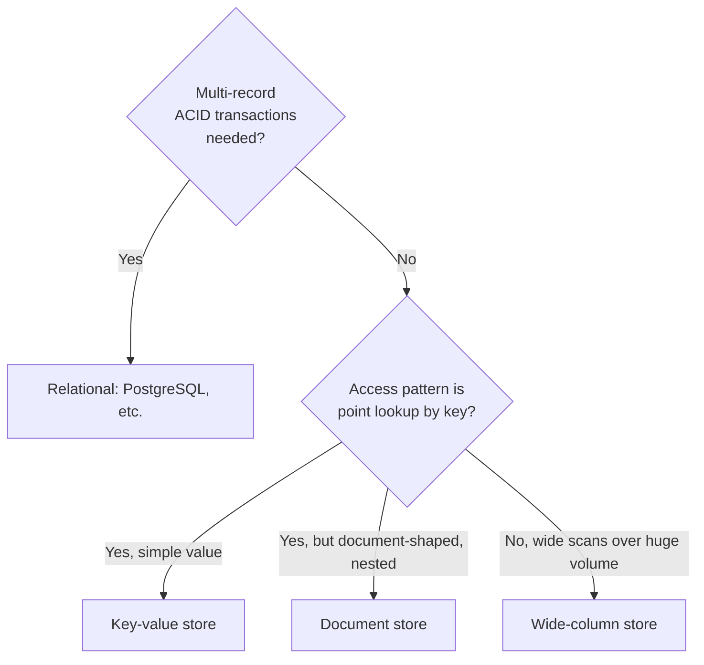

# Storage Selection Trade-offs

> **Topic register:** T-617/T-811 · IWI 6.90 · Advanced tier

## Table of Contents

1. [Learning Objectives](#learning-objectives)
2. [Why This Matters in Interviews](#why-this-matters-in-interviews)
3. [Mental Model](#mental-model)
4. [Definition and Purpose](#definition-and-purpose)
5. [Core Concepts](#core-concepts)
6. [Diagrams](#diagrams)
7. [Production Scenarios](#production-scenarios)
8. [Trade-offs](#trade-offs)
9. [Decision Framework](#decision-framework)
10. [Common Mistakes](#common-mistakes)
11. [Anti-Patterns](#anti-patterns)
12. [Best Practices](#best-practices)
13. [Interview Answer Framework](#interview-answer-framework)
14. [Interview Questions](#interview-questions)
15. [Summary](#summary)
16. [Key Takeaways](#key-takeaways)
17. [Cheat Sheet](#cheat-sheet)
18. [Flashcards](#flashcards)
19. [Practice Exercises](#practice-exercises)
20. [Solutions](#solutions)
21. [Additional Reading](#additional-reading)
22. [Official References](#official-references)

---

## Learning Objectives

By the end of this chapter you can:

- Work through the access-pattern method to choose a storage category, rather than choosing by reputation.
- State the winning conditions and costs for relational, document, key-value, and wide-column stores.
- Explain when polyglot persistence is worth its operational cost, and when it isn't.
- Argue both sides of a storage choice for a given workload, naming the specific access-pattern change that would flip the decision.

## Why This Matters in Interviews

Storage selection questions test whether a candidate reasons from access patterns or from technology trends. Interviewers specifically ask candidates to argue both sides of a choice because a one-sided, reputation-driven answer ("Postgres is for structured data") reveals someone who hasn't actually worked through the trade-offs — while a candidate who names the exact access-pattern change that would flip their decision demonstrates they understand the method, not just a conclusion.

## Mental Model

**Storage technology should be the last decision made, not the first.** Every storage category — relational, document, key-value, wide-column — is optimized for a specific shape of read/write access, consistency requirement, and transactional scope. Naming a technology before naming the access pattern it needs to serve is working backward from a conclusion.

## Definition and Purpose

Storage selection ("SQL vs. NoSQL," more precisely "which storage engine fits this access pattern") is answered by working backward from the queries the system actually needs to serve — not from a general reputation ("Postgres is for structured data, Mongo is for flexible data"). The same logical data can be correctly stored in a relational table, a document store, a key-value store, or a wide-column store, depending entirely on how it's read and written, at what volume, and under what consistency requirement.

Choosing storage by reputation rather than access pattern produces two recurring failures: relational databases forced into extreme normalization for data that's always read as one document (adding join cost with no corresponding benefit), and document stores used for data with real relational structure and multi-record transactional requirements (losing consistency guarantees the application then has to reimplement badly, by hand, in the application layer).

## Core Concepts

### The access-pattern method

Answer these, in order, before naming a technology:

1. **What are the actual read and write patterns?** Point lookups by key? Range scans? Complex joins across many entity types? Full-text search?
2. **What's the consistency requirement, per operation?** Does this specific write need to be immediately visible to a subsequent read (strong consistency), or is a short staleness window acceptable (eventual)?
3. **What's the transactional scope?** Does a single logical operation need to atomically touch multiple records/aggregates?
4. **What's the volume and growth shape?** Read-heavy or write-heavy? Predictable growth or bursty?

Only after answering these does a technology choice become a conclusion rather than a guess.

### "NoSQL" is not one category

A document store, a key-value store, and a wide-column store have almost nothing in common except "not traditionally relational." Treating them as interchangeable, or as a single alternative to "SQL," obscures that each solves a genuinely different access-pattern problem.

### Polyglot persistence is a cost/benefit decision, not a default good practice

Using multiple storage technologies in one system is justified only when a component's access pattern is different enough from the rest of the system that forcing one technology for everything creates a real, measurable cost. Every additional storage technology adds ongoing operational burden — backup, monitoring, on-call expertise — that must be weighed against the specific access-pattern win it buys.

## Diagrams

## Production Scenarios

### Scenario: a document store chosen for schema flexibility can't support a new cross-order reporting feature

**Symptoms.** A catalog service was built on a document store, chosen for its flexible per-category product schema. A year later, a finance reporting feature needs to atomically reconcile inventory counts across a batch of orders touching multiple products, and the document store's weaker cross-document transaction support makes this reliably impossible without significant application-level workaround code.

**Impact.** A feature that would be a straightforward multi-row transaction in a relational store instead requires bespoke, error-prone application-level coordination, and has already produced at least one reconciliation discrepancy in production.

**Initial hypotheses.** A bug in the application-level reconciliation logic (checked — the logic is correct given the constraints, but the constraints themselves are the problem); the document store's transaction feature being misconfigured (checked — it's configured correctly, but its guarantees are narrower than what a relational multi-row transaction provides); a fundamental mismatch between the storage technology's transactional model and the new feature's requirement (correct).

**Evidence.** The document store's transaction API supports atomicity within a single document or a narrowly-scoped set, not the broader, ad-hoc multi-product-and-order transaction the reporting feature needs — exactly the limitation named in this chapter's trade-off table for document stores.

**Diagnosis.** The original storage choice was correct for the catalog's per-category schema flexibility need at the time, but the team didn't anticipate a future access pattern (cross-order, cross-product atomic reconciliation) that the chosen technology structurally can't support well — the access-pattern method should have been re-applied when the new feature was scoped, not assumed to still hold.

**Immediate mitigation.** Build a manual reconciliation batch job with idempotent retries to paper over the missing atomicity guarantee for the reporting feature's specific need.

**Permanent remediation.** Introduce a relational store specifically for the reporting/reconciliation domain (a polyglot-persistence decision), fed by change-data-capture from the document store, rather than trying to force the document store to provide a transactional guarantee it isn't designed for.

**Alternatives considered.** Migrating the entire catalog off the document store to relational — rejected, since the catalog's original access pattern (flexible per-category schema, no cross-document transactions) is still well-served by the document store; only the new reporting feature has a different requirement.

**Trade-offs.** Adding a second storage technology (the relational reconciliation store) is exactly the polyglot-persistence cost this chapter names — additional backup, monitoring, and on-call surface area — accepted here because the access-pattern mismatch for the new feature is real and significant, not a minor inconvenience.

**Prevention.** Re-run the access-pattern method whenever a new feature's requirements are scoped against an existing storage choice, rather than assuming the original decision still holds for every future need.

**Interview lesson.** This is Interview Question 2's underlying scenario at real production scale: polyglot persistence justified by a genuine, measurable access-pattern mismatch for one specific component, not adopted as a default.

## Trade-offs

| Category | Wins when | Costs |
|---|---|---|
| **Relational (PostgreSQL)** | Multi-entity transactions, ad-hoc queries/joins, strong consistency by default | Schema changes require migration discipline; horizontal write scaling is harder |
| **Document (MongoDB-style)** | Data is naturally read/written as one self-contained document, flexible schema | Cross-document transactions are weaker/newer; denormalization risks the update-anomaly class of bugs |
| **Key-value** | Simple point lookups at very high throughput | No query flexibility beyond the key; relational structure has to live elsewhere |
| **Wide-column (Cassandra-style)** | Massive write volume, time-series-like access patterns, tunable consistency | Query patterns must be designed in at schema-design time — ad-hoc queries are expensive or impossible |

## Decision Framework

1. **Walk through the access-pattern method's four questions** (read/write shape, consistency, transactional scope, volume/growth) before naming any technology.
2. **Does a single logical operation need to atomically touch multiple records?** If yes, weight heavily toward relational, or accept significant application-level complexity elsewhere.
3. **Is the dominant access pattern a point lookup by a known key, with no need for ad-hoc queries?** Key-value, or document if the value itself is naturally nested/document-shaped.
4. **Is write volume massive and query patterns knowable in advance (time-series-like)?** Wide-column, accepting that ad-hoc queries outside the designed pattern will be expensive or impossible.
5. **Would adding a second storage technology for one specific component's mismatched access pattern be worth the added operational burden** (backup, monitoring, on-call)? Only adopt polyglot persistence when this is genuinely true, re-evaluated per new feature, not assumed once and never revisited.

## Common Mistakes

- Choosing storage technology from reputation or trend rather than the access-pattern method.
- Treating "NoSQL" as one category — a document store, a key-value store, and a wide-column store have almost nothing in common except "not traditionally relational."
- Adding a second storage technology (polyglot persistence) without weighing its ongoing operational cost against the specific access-pattern win it buys.

## Anti-Patterns

- **Choosing a storage technology before articulating the access pattern** it needs to serve.
- **Treating a storage decision as permanent and never re-running the access-pattern method** when a new feature's requirements are scoped against it.
- **Adopting polyglot persistence as a default "best practice"** rather than a deliberate, re-evaluated cost/benefit decision per component.

## Best Practices

- Always work through the access-pattern method's four questions before naming a storage technology.
- Re-apply the method whenever a new feature is scoped against an existing storage choice — the original decision may no longer fit.
- Weigh a team's actual operational maturity with a given technology as a legitimate factor, alongside pure technical fit.
- Treat every additional storage technology in a polyglot design as an explicit, ongoing operational cost, not a free architectural improvement.

## Interview Answer Framework

### 30-Second Answer

Storage selection should follow the access pattern — read/write shape, consistency requirement, transactional scope, volume — not technology reputation. Relational wins for multi-entity transactions and ad-hoc queries; document for flexible, self-contained data; key-value for high-throughput point lookups; wide-column for massive, predictably-patterned write volume.

### 2-Minute Answer

Definition: storage selection means matching a storage category to the actual access pattern, not choosing by reputation. Why it exists: reputation-driven choices produce two recurring failures — over-normalized relational schemas for document-shaped data, or document stores used where real multi-record transactions were needed. How it works: the access-pattern method answers read/write shape, consistency, transactional scope, and volume before naming a technology. One important trade-off: polyglot persistence (multiple storage technologies) buys access-pattern fit at the cost of ongoing operational burden per additional technology. Production example: a document store correctly chosen for a catalog's flexible schema, but unable to support a later cross-order reconciliation feature needing real multi-record transactions — fixed by adding a relational store for that specific component, not by migrating the whole system.

### 10-Minute Deep Dive

Cover, in order: the mental model — storage technology is the last decision, not the first (mental model); the access-pattern method's four questions (core concepts); the trade-off table across all four storage categories (trade-offs); the decision framework for polyglot persistence specifically (decision framework); and close with the production scenario — a correct original storage choice that couldn't support a later feature's different access pattern, resolved with a targeted second storage technology rather than a full migration.

### Whiteboard Explanation

Draw the [§ Diagrams](#diagrams) flowchart: starting from "multi-record ACID transactions needed?" branching to relational, then "point lookup by key?" branching to key-value or document, then "wide scans over huge volume?" branching to wide-column. Walk through it live for whatever workload the interviewer names, narrating each branch's reasoning.

### Production Example

The reconciliation-feature mismatch in [§ Production Scenarios](#production-scenarios): a document store, correctly chosen for the catalog's flexible schema, couldn't support a later cross-order transactional reporting need — fixed by adding a targeted relational store for that one component, not migrating the whole catalog.

### Trade-offs to Mention

State unprompted: "NoSQL" is not one category with one set of trade-offs; polyglot persistence has a real, ongoing operational cost that must be weighed against its benefit; a team's operational maturity with a technology is a legitimate factor alongside pure technical fit.

### Common Candidate Mistakes

Choosing a database by reputation ("DynamoDB scales better") without reference to the actual access pattern; treating polyglot persistence as a default good practice rather than a cost/benefit call.

### Typical Follow-Up Questions

1. "What specific access pattern would flip your answer?"
2. "What's the operational cost of adding a second storage technology, concretely?"

### Senior-Level Expectations

Reaches a defensible choice using the access-pattern method; identifies at least one legitimate polyglot-persistence use case.

### Staff-Level Discussion

At Staff scope, a storage decision is a multi-year commitment with a real migration cost, and the honest framing is closer to "which set of trade-offs can this team operate confidently for the system's expected lifetime" than "which technology is theoretically best-suited." A team with deep PostgreSQL operational experience choosing PostgreSQL for a workload that's technically slightly better suited to a document store, because the team's operational maturity outweighs the marginal technical fit, is frequently the better Staff-level answer — naming this explicitly, rather than pure technology fit, is a differentiator. For the polyglot-persistence follow-up, naming the operational cost side explicitly and unprompted (extra backup/monitoring/on-call surface area) demonstrates the decision was actually weighed, not assumed.

## Interview Questions

### Question 1 — Choose between PostgreSQL and DynamoDB for a given workload. Defend it, then argue the opposite.

**Why interviewers ask it.** Tests whether the candidate reasons from access pattern or defaults to reputation, and whether they can genuinely see the other side of a trade-off.

**Expected answer.** Works through the access-pattern method for the specific workload given, reaches a defensible choice, then genuinely argues the other side rather than restating a weaker version of the same argument.

**Minimum acceptable answer.** Reaches a defensible choice using some access-pattern reasoning, even if the "argue the opposite" half is thin.

**Strong Senior answer.** Reaches a defensible choice using the method.

**Staff-level extension.** The "argue the opposite" half is genuinely argued, not a token concession — naming the specific access-pattern change that would flip the decision.

**Common mistakes.** Picking a database by reputation ("DynamoDB scales better") without reference to the actual access pattern.

**Likely follow-ups.** "What specific access pattern would flip your answer?"

**Evaluation criteria (1–5).** 1: picks by reputation with no access-pattern reasoning. 3: reaches a defensible choice via the method. 5: correct choice plus a genuine, specific opposite argument.

**Related references.** [§ Core Concepts](#core-concepts).

---

### Question 2 — When would polyglot persistence (multiple storage technologies in one system) be worth its operational cost?

**Why interviewers ask it.** Tests whether the candidate treats polyglot persistence as a deliberate cost/benefit decision rather than a default good practice.

**Expected answer.** When a single component's access pattern is different enough from the rest of the system that forcing one storage technology for everything creates a real, measurable cost (e.g., search needing a dedicated text-search engine alongside the primary relational store).

**Minimum acceptable answer.** Identifies at least one legitimate reason to use a second storage technology, even without the cost-side framing.

**Strong Senior answer.** Identifies at least one legitimate polyglot use case.

**Staff-level extension.** Names the operational cost side explicitly and unprompted — extra backup/monitoring/on-call surface area — and weighs it against the access-pattern benefit.

**Common mistakes.** Treating polyglot persistence as a default good practice rather than a cost/benefit call — every additional storage technology is an additional operational burden.

**Likely follow-ups.** "What's the operational cost of adding a second storage technology, concretely?"

**Evaluation criteria (1–5).** 1: recommends polyglot persistence as generally good practice. 3: identifies a legitimate use case. 5: correct use case plus the operational cost named unprompted.

**Related references.** [§ Production Scenarios](#production-scenarios).

## Summary

Storage selection should follow from the actual access pattern (read/write shape, consistency requirement, transactional scope, volume) — not from a technology's reputation. Each storage category (relational, document, key-value, wide-column) wins under specific, nameable conditions and loses under others; a defensible answer works through the method and names the specific condition that would flip the decision.

## Key Takeaways

- Work backward from access pattern, consistency requirement, and transactional scope — never forward from technology reputation.
- "NoSQL" is not one category — document, key-value, and wide-column stores solve different problems.
- Polyglot persistence has a real, ongoing operational cost that must be weighed against its access-pattern benefit.
- Team operational maturity with a given technology is a legitimate, Staff-level factor in the decision, not just technical fit.

## Cheat Sheet

See [§ Diagrams](#diagrams)' decision flowchart.

## Flashcards

### Card: The first question in storage selection

**Prompt:**
What's the first question in storage selection?

**Answer:**
What are the actual read/write access patterns — not "which technology is trendy."

**Why it matters:**
Anchors every subsequent decision in evidence rather than reputation.

**Common trap:**
Naming a technology before articulating the access pattern.

**Related:**
[Core Concepts](#core-concepts)

### Card: The four storage categories

**Prompt:**
Name the four storage categories in this chapter.

**Answer:**
Relational, document, key-value, wide-column.

**Why it matters:**
Prevents treating "NoSQL" as a single, undifferentiated alternative to relational.

**Common trap:**
Assuming all non-relational stores share the same trade-offs.

**Related:**
[Trade-offs](#trade-offs)

### Card: The hidden cost of polyglot persistence

**Prompt:**
What's the hidden cost of polyglot persistence?

**Answer:**
Ongoing operational burden — backup, monitoring, on-call expertise — for every additional storage technology.

**Why it matters:**
The reason polyglot persistence is a cost/benefit call, not a default good practice.

**Common trap:**
Adopting a second storage technology without weighing this cost explicitly.

**Related:**
[Core Concepts](#core-concepts)

## Practice Exercises

1. Take a system you know. Run its primary data store through the access-pattern method — would the same technology be chosen today, working from access patterns, or was it chosen for another reason?
2. Construct a workload where a document store is clearly correct, and a second workload (same domain, different access pattern) where it clearly is not.

## Solutions

**Exercise 1.** Apply the four questions in order (read/write shape, consistency, transactional scope, volume/growth) to the system's actual current usage, independent of how it was originally chosen. A mismatch between the original justification and the current access pattern is a legitimate signal worth flagging, even if a migration isn't immediately warranted.

**Exercise 2.** A document store is clearly correct for a user-profile service where each profile is read and written as one self-contained document with no cross-profile transactional need. The same domain's billing/invoicing component, needing atomic multi-record consistency across an invoice and its line items and a payment record, is a workload where the document store is clearly the wrong fit — exactly the pattern in this chapter's production scenario.

## Additional Reading

- Martin Kleppmann, *Designing Data-Intensive Applications*, Ch. 2 "Data Models and Query Languages" and Ch. 3 "Storage and Retrieval"

## Official References

- [PostgreSQL documentation](https://www.postgresql.org/docs/current/) — relational baseline for comparison
