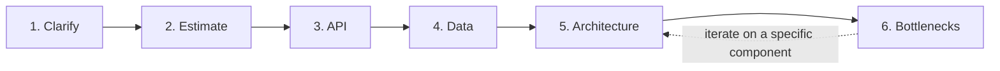

# System Design Method and Estimation

> **Topic register:** T-801 (Design method, IWI 8.65, **#1 of 198** — the single highest-IWI topic in the entire register) / T-802 (Estimation, IWI 7.40) · Staff-Level/Foundation tier · Near-Certain interview frequency [H]
> **Why this is the spine chapter:** every other system-design topic — caching, failure modes, API design, CAP — is a *component*. This is the *procedure* that assembles them. Candidates fail design rounds far more often from having no method than from missing a component.

## Table of Contents

1. [Learning Objectives](#learning-objectives)
2. [Why This Matters in Interviews](#why-this-matters-in-interviews)
3. [Mental Model](#mental-model)
4. [Definition and Purpose](#definition-and-purpose)
5. [Core Concepts](#core-concepts)
6. [Internal Implementation](#internal-implementation)
7. [Diagrams](#diagrams)
8. [Production Scenarios](#production-scenarios)
9. [Trade-offs](#trade-offs)
10. [Decision Framework](#decision-framework)
11. [Common Mistakes](#common-mistakes)
12. [Anti-Patterns](#anti-patterns)
13. [Best Practices](#best-practices)
14. [Interview Answer Framework](#interview-answer-framework)
15. [Interview Questions](#interview-questions)
16. [Summary](#summary)
17. [Key Takeaways](#key-takeaways)
18. [Cheat Sheet](#cheat-sheet)
19. [Flashcards](#flashcards)
20. [Practice Exercises](#practice-exercises)
21. [Solutions](#solutions)
22. [Additional Reading](#additional-reading)
23. [Official References](#official-references)

---

## Learning Objectives

By the end of this chapter you can:

- Run the six-phase design method (Clarify, Estimate, API, Data, Architecture, Bottlenecks) unprompted, in order, under time pressure.
- Work a QPS/storage estimate from DAU, stating every assumption explicitly so it can be challenged and revised live.
- Justify every architectural component against a specific number from the estimation phase, rather than by reflex.
- Name at least three concrete bottlenecks for a design and their mitigations, without running out of time before reaching this phase.

## Why This Matters in Interviews

This is the highest-IWI topic in the entire 198-topic register — every other system-design topic is a component this method assembles. A design interview is not a test of having memorized the "right" architecture for a famous problem; it's a test of whether the candidate has a repeatable procedure that produces a defensible design under time pressure, for a problem they may never have seen before. Candidates who fail this round most often don't fail on technical knowledge — they fail because they jump straight to components ("we'll need a load balancer, a cache, a database...") without first establishing what the system actually needs to do, at what scale, which makes every subsequent decision unjustifiable when challenged.

## Mental Model

**Every box you draw in a system design must trace back to a number you stated earlier.** "We need a cache" is not architecture; "reads are 50,000/s and the database alone tops out around 8,000/s reads at acceptable latency, so a cache in front of the read path is required at this scale" is. The six phases exist purely to guarantee that the numbers (estimation) exist *before* the boxes (architecture) — reversing that order is the single most common failure pattern below Staff level, because it makes every decision a reflex instead of a conclusion.

## Definition and Purpose

The **system design method** is a repeatable, six-phase procedure — Clarify, Estimate, API, Data, Architecture, Bottlenecks — that converts an open-ended design prompt into a defensible sequence of decisions, each justified by what came before it. It exists because, without an explicit procedure, two failure modes dominate: diving into components immediately, producing a design with no stated justification for any choice; or spending disproportionate time on one phase (usually a beloved technology) while never reaching estimation or bottleneck analysis at all. The method forces estimation to happen *before* architecture, so later architectural decisions ("do we need a cache," "do we shard the database") are answered by the numbers established in phase 2, not by reflex.

## Core Concepts

### The six phases

1. **Clarify (2–3 min).** State the scope explicitly before designing anything: who are the users, what's the core action (write-heavy, read-heavy, both), and — critically — what is explicitly *out of scope*. A design interview that never states what's excluded is one where the candidate is silently guessing what the interviewer wants.
2. **Estimate (3–5 min).** Work the QPS/storage numbers (§ Internal Implementation). This phase exists to make every later architectural decision falsifiable.
3. **API (2–3 min).** Define the core endpoints/interface at the boundary — just enough to pin down what a client actually calls. This also functions as a second clarification pass: writing `POST /rides {pickup, dropoff}` surfaces questions Phase 1 might have missed.
4. **Data (3–5 min).** Define the core data model and which storage technology fits the access pattern established in Phase 2 — this is where storage-selection reasoning gets applied against real numbers, not in the abstract.
5. **Architecture (10–15 min).** Draw the system — services, data stores, caches, queues — and justify every box against Phase 2's numbers, not default reflex.
6. **Bottlenecks (5–10 min).** Name at least three specific failure modes for the design just drawn, and how each is mitigated. Frequently skipped under time pressure — doing so is itself a scored gap, since it's the phase most directly testing production judgment.

### Estimation must precede architecture

This ordering is not arbitrary. Every later phase's decisions should be traceable to a specific number from Phase 2 — a cache, a shard, a queue, each needs a stated numeric justification, not a reflexive default.

### Bottleneck analysis is not optional padding

Phase 6 is the phase most directly testing production judgment rather than architecture knowledge — running out of time before reaching it is a scored gap, not merely an unfortunate time crunch.

## Internal Implementation

**Estimate QPS and storage for a system with 10M DAU. Show every assumption.**

```
Assumption: each DAU performs an average of 5 core actions/day (writes)
Total daily writes = 10,000,000 × 5 = 50,000,000 writes/day

Average write QPS = 50,000,000 / 86,400 seconds ≈ 580 writes/s

Assumption: peak-to-average ratio of 3x (typical for a consumer app with
daytime usage concentration -- this assumption is the single most
important number to state explicitly, since the final architecture is
sized to PEAK, not average)
Peak write QPS ≈ 580 × 3 ≈ 1,740 writes/s

Assumption: read:write ratio of 10:1 (typical for a content/feed-style system)
Peak read QPS ≈ 17,400 reads/s

Assumption: each write record averages 500 bytes
Storage per day = 50,000,000 × 500 bytes ≈ 25 GB/day
Storage per year ≈ 25 GB × 365 ≈ 9.1 TB/year (before replication factor)

Assumption: 3x replication for durability
Total storage per year ≈ 27.3 TB/year
```

**Why every assumption is stated explicitly, not just the final number:** an unstated assumption is unfalsifiable — the interviewer cannot challenge "3x peak ratio" if it was never said aloud, which means the whole estimate reads as a memorized number rather than a reasoned model. A Staff-level answer revises an assumption live when challenged ("if this is B2B rather than consumer, the peak ratio might be closer to 1.5x during business hours") and shows the estimate change, proving it's a working model.

## Diagrams



The dotted return arrow is deliberate: Phase 6 often surfaces a bottleneck that sends the design back to revise Phase 5 — that iteration is expected discipline, not a failure of the method.

## Production Scenarios

### Scenario: a design review ships an architecture with no stated scale assumptions, and it fails at real load

**Context.** A design document for a new notification service is approved and shipped without an explicit capacity estimation section — the document jumps directly from a one-paragraph problem statement to an architecture diagram with a queue, three consumer services, and a database.

**Symptoms.** Within a month of launch, the service falls over during a marketing campaign that triggers notifications to a large fraction of the user base simultaneously — the queue backs up for hours, and notifications arrive so late they're no longer relevant.

**Impact.** A user-facing feature effectively failed during the exact event (a promotional campaign) it existed to support.

**Initial hypotheses.** A bug in the consumer service (checked — no error logs, just backlog); insufficient consumer instance count (partially true, but the deeper question is *why* the count chosen was insufficient); the original design never estimated peak load at all (correct).

**Evidence.** The design document contains no QPS or volume estimate anywhere; the consumer service's instance count and queue partition count were set to "reasonable-sounding" round numbers with no traceable justification.

**Diagnosis.** The design skipped Phase 2 (Estimate) entirely, going straight from a vague problem statement to Phase 5 (Architecture) — exactly the failure mode this chapter's method exists to prevent. Every subsequent capacity decision (consumer count, queue partitions) was therefore a guess, not a number-justified choice, and the guess happened to be wrong for the actual peak load a campaign produces.

**Immediate mitigation.** Scale consumer instances and queue partitions reactively during the incident, restoring throughput after the fact.

**Permanent remediation.** Redo the capacity estimation retroactively — daily active users, expected notification-triggering events, and specifically the peak-to-average ratio for a promotional-campaign event (which can be far higher than typical daily peak) — and re-size the architecture against those numbers, documenting the assumptions so future reviewers can challenge and revise them.

**Alternatives considered.** Simply over-provisioning capacity broadly as a hedge — rejected as expensive and still not actually traceable to a specific, defensible number; the point of estimation is not just "have more capacity" but "know precisely how much capacity this specific event requires."

**Trade-offs.** Retroactive estimation costs engineering time that could have been spent on new features — accepted, since the alternative is repeating the same guess-based sizing on the next capacity decision.

**Prevention.** Make an explicit capacity-estimation section, with stated assumptions, a required part of every design document template — not an optional appendix, but a gate before the architecture section can be reviewed.

**Interview lesson.** This is the exact failure mode the six-phase method exists to prevent, arriving as a real production incident: architecture without a preceding, explicit estimation phase is architecture with no traceable justification for any of its capacity decisions.

## Trade-offs

| Approach | Benefit | Cost |
|---|---|---|
| Following all six phases in order | Every architectural decision is defensible against a stated number | Feels slower at first than "just start drawing boxes" — the discipline has to be practiced to become fast |
| Skipping estimation, going straight to architecture | Feels more "impressive" faster | Every subsequent decision is unjustifiable when challenged — the single most common Mid-level failure pattern |
| Skipping bottleneck analysis to save time | More time spent on the "impressive" architecture phase | Directly loses the production-judgment signal, disproportionately weighted at Senior/Staff level |

## Decision Framework

1. **Has scope been explicitly stated, including what's out of scope?** If not, do not proceed to estimation — an unscoped estimate is meaningless.
2. **Has every subsequent architectural decision been traced back to a number from the estimation phase?** If a component ("we need a cache," "we need to shard") can't be justified by a specific number, that's a signal the estimation phase was skipped or not actually used.
3. **Is time running out before Phase 6?** Explicitly reserve time for bottleneck analysis rather than letting Phase 5 expand to fill all remaining time — the bottleneck phase is a scored component, not optional polish.
4. **Has an assumption been challenged?** Revise it live and show the downstream consequence on the architecture — this demonstrates the estimate is a working model, not a memorized number.

## Common Mistakes

- Jumping to components before establishing scale — the single most common failure pattern at every level below Staff.
- Presenting an estimate with no stated assumptions, making it unfalsifiable and unreviewable.
- Running out of time before phase 6 (bottlenecks) — a scored gap, not just an unfortunate time crunch.
- Treating the six phases as a rigid script rather than a discipline — phase 6 often surfaces a bottleneck that sends you back to revise phase 5, and that iteration is expected, not a failure of the method.

## Anti-Patterns

- **Starting to draw architecture boxes in the first two minutes** of a design round, before any scope or scale has been established.
- **Presenting a bare estimation number** ("we'll need about 20,000 QPS") with no visible assumptions behind it.
- **Letting the architecture phase consume all remaining time**, leaving no room for bottleneck analysis.
- **Treating a design document as complete without an explicit, stated capacity-estimation section** — the production-incident pattern this chapter's scenario demonstrates.

## Best Practices

- State the six-phase method explicitly and unprompted before beginning Phase 1 — this signals procedure discipline from the first second of a design round.
- Always state assumptions in an estimate out loud (or in writing), specifically calling out the peak-to-average ratio as the single most consequential one.
- Reserve explicit time for bottleneck analysis rather than letting architecture expand to fill the clock.
- Treat a design document the same way as an interview response: no architecture section without a preceding, explicit capacity-estimation section.

## Interview Answer Framework

### 30-Second Answer

A system design interview rewards a repeatable procedure, not a memorized architecture: Clarify scope, Estimate scale, define the API, define the Data model, draw the Architecture justified by the estimate, then name Bottlenecks. Estimation must come before architecture so every component is justified by a number, not a reflex.

### 2-Minute Answer

Definition: six phases — Clarify, Estimate, API, Data, Architecture, Bottlenecks — in that order. Why it exists: without an explicit procedure, candidates either jump straight to components with no justification, or spend disproportionate time on one favorite phase and never reach bottleneck analysis. How it works: every architectural decision in Phase 5 traces back to a specific number established in Phase 2. One important trade-off: following the method feels slower than "just start drawing boxes," but every decision becomes defensible under challenge. Production example: a notification service design that skipped explicit capacity estimation shipped with guess-sized consumer counts and queue partitions, then fell over during exactly the high-load event (a promotional campaign) it existed to support.

### 10-Minute Deep Dive

Cover, in order: the mental model — every box traces back to a number (mental model); the six phases in detail, with particular attention to why estimation must precede architecture (internals); the worked 10M-DAU estimation example with every assumption stated explicitly, especially the peak-to-average ratio (internals, real worked math); why bottleneck analysis is a scored phase, not optional padding, and is the phase most often skipped under time pressure (common mistake + why it matters); the Staff-level framing that this method is a real design-review discipline, not interview theater (Staff-level connection); and close with the production scenario — a design document that skipped explicit estimation and failed at real peak load exactly where it mattered.

### Whiteboard Explanation

Draw the [§ Diagrams](#diagrams) six-box flowchart first, left to right, with the dotted "iterate" arrow looping back from Bottlenecks to Architecture. Narrate each box's time budget as you draw it (2–3 min, 3–5 min, etc.) — this signals from the very first second that a procedure, with an explicit time budget, is being followed, which is itself part of the Staff-level signal this topic tests for.

### Production Example

The notification-service incident in [§ Production Scenarios](#production-scenarios): a design document that skipped explicit capacity estimation shipped with guess-sized consumer counts and queue partitions, then fell over during a promotional campaign — the exact high-load event the service existed to support, and exactly the failure this six-phase method's ordering (estimate before architecture) exists to prevent.

### Trade-offs to Mention

State unprompted: the method feels slower at first than jumping straight to architecture, but every subsequent decision becomes defensible; skipping bottleneck analysis under time pressure is a scored gap, not a neutral time-saving; an unstated assumption in an estimate can't be challenged or revised, making the whole estimate look memorized rather than reasoned.

### Common Candidate Mistakes

Starting to draw components before establishing scale; presenting a final estimate number with no visible assumptions; running out of time before bottleneck analysis; treating the six phases as a rigid script rather than expecting to iterate back from Phase 6 to Phase 5.

### Typical Follow-Up Questions

1. "Why estimate before designing the architecture?"
2. "What if the peak-to-average ratio is actually 5x instead of 3x — how does that change your architecture?"
3. "What's the first thing you'd cut if this had to ship in six weeks?"

### Senior-Level Expectations

Follows the method even if not narrated explicitly upfront; produces a QPS/storage estimate with assumptions stated.

### Staff-Level Discussion

At Staff scope, the six-phase method is also a **communication tool for a design review**, not just an interview technique — a design doc that skips straight to architecture without stated scale assumptions invites exactly the same "why did you choose this" challenge from a real reviewer that an interviewer would raise. The discipline of stating assumptions explicitly, estimating before architecting, and naming bottlenecks unprompted is the same discipline that makes a design doc defensible to a skeptical staff engineering review board — this method is not interview-specific theater, it's the actual practice. States the method explicitly, unprompted, before Phase 1 even begins — signaling procedure discipline from the first second — and revises an assumption live when challenged, showing the estimate's downstream architectural consequence.

## Interview Questions

### Question 1 — Walk me through your design method before you start drawing anything.

**Why interviewers ask it.** Tests whether the candidate has an explicit, repeatable procedure versus improvising from memorized architectures.

**Expected answer.** The six phases, in order, stated explicitly before diving in.

**Minimum acceptable answer.** Follows a reasonable structure even without naming it as six distinct phases.

**Strong Senior answer.** Follows the method even if not narrated explicitly upfront.

**Staff-level extension.** States the method explicitly, unprompted, before phase 1 even begins — signaling procedure discipline from the first second.

**Common mistakes.** Starting to draw components immediately without narrating a method at all.

**Likely follow-ups.** "Why estimate before designing the architecture?"

**Evaluation criteria (1–5).** 1: draws components immediately, no stated method. 3: implicitly follows a reasonable structure. 5: states the six-phase method explicitly and unprompted before starting.

**Related references.** [§ Core Concepts](#core-concepts); [§ Diagrams](#diagrams).

---

### Question 2 — Estimate QPS and storage for a system with 10M DAU. Show every assumption.

**Why interviewers ask it.** Tests whether the candidate can produce a falsifiable, reviewable estimate rather than a memorized final number.

**Expected answer.** The worked math from § Internal Implementation, with every assumption stated.

**Minimum acceptable answer.** Produces a plausible final number, even with some assumptions left implicit.

**Strong Senior answer.** Produces the estimate with assumptions stated.

**Staff-level extension.** Revises live when challenged and shows the downstream architectural consequence of the changed assumption (e.g., "at 5x peak, the single-cache design from phase 5 might need to become a sharded cache").

**Common mistakes.** Presenting a bare final number with no visible reasoning.

**Likely follow-ups.** "What if the peak-to-average ratio is actually 5x instead of 3x — how does that change your architecture?"

**Evaluation criteria (1–5).** 1: bare final number, no assumptions. 3: full worked estimate with stated assumptions. 5: worked estimate plus live revision under challenge with a stated architectural consequence.

**Related references.** [§ Internal Implementation](#internal-implementation).

## Summary

A repeatable six-phase procedure — Clarify, Estimate, API, Data, Architecture, Bottlenecks — converts a system design interview from "recall the right architecture" into "demonstrate a defensible reasoning process," which is what's actually being evaluated. Estimation must happen before architecture specifically so later decisions are justified by numbers rather than reflex, and every assumption in an estimate must be stated explicitly so it can be challenged and revised live.

## Key Takeaways

- Six phases, in order: Clarify → Estimate → API → Data → Architecture → Bottlenecks.
- Estimation before architecture — every architectural choice should trace back to a number from phase 2.
- State every assumption explicitly; an unstated assumption can't be challenged or revised.
- Bottleneck analysis (phase 6) is frequently skipped under time pressure and is a scored gap when it is.
- The method is a real design-review discipline, not interview-specific theater.

## Cheat Sheet

| Phase | Time budget | Purpose |
|---|---|---|
| 1. Clarify | 2–3 min | State scope and what's explicitly out of scope |
| 2. Estimate | 3–5 min | Work QPS/storage numbers with every assumption stated |
| 3. API | 2–3 min | Pin down the client-facing contract |
| 4. Data | 3–5 min | Data model and storage choice, driven by Phase 2's numbers |
| 5. Architecture | 10–15 min | Draw the system, justify every box against Phase 2 |
| 6. Bottlenecks | 5–10 min | Name ≥3 failure modes and mitigations — don't skip this |

## Flashcards

### Card: The six phases in order

**Prompt:**
Name the six phases, in order.

**Answer:**
Clarify, Estimate, API, Data, Architecture, Bottlenecks.

**Why it matters:**
The repeatable procedure this entire topic exists to teach.

**Common trap:**
Skipping straight to Architecture without the preceding phases.

**Related:**
[Core Concepts](#core-concepts)

### Card: Why estimate before architecture

**Prompt:**
Why estimate before designing the architecture?

**Answer:**
So every architectural decision (e.g., "we need a cache") is justified by a specific number, not reflex.

**Why it matters:**
The core ordering discipline that makes a design defensible under challenge.

**Common trap:**
Designing architecture first and retrofitting justification afterward.

**Related:**
[Mental Model](#mental-model)

### Card: The most important estimation assumption

**Prompt:**
What's the single most important assumption to state explicitly in a QPS estimate?

**Answer:**
The peak-to-average ratio — the architecture must be sized to peak, not average.

**Why it matters:**
The number most directly determining whether the architecture is actually adequate under real load.

**Common trap:**
Sizing an architecture to average load rather than peak.

**Related:**
[Internal Implementation](#internal-implementation)

### Card: The most commonly skipped phase

**Prompt:**
What's the most commonly skipped phase, and why does it matter?

**Answer:**
Phase 6, bottlenecks — it's the phase most directly testing production judgment, and skipping it under time pressure is a scored gap.

**Why it matters:**
Directly tied to the production-judgment signal disproportionately weighted at Senior/Staff level.

**Common trap:**
Letting the architecture phase consume all remaining time.

**Related:**
[Production Scenarios](#production-scenarios)

## Practice Exercises

1. Run the six-phase procedure, 25 minutes, phase discipline only (correctness of the final design is not the goal), against three problems of your choosing.
2. Redo the estimation exercise with a B2B, business-hours-only usage pattern instead of consumer — show how the peak-to-average assumption and the resulting architecture change.
3. Apply the full method to a design problem of your choosing, 45 minutes, timed, explicitly narrating each phase's start and end.

## Solutions

**Exercise 1.** No single expected answer — complete when all six phases were explicitly narrated within the time budget, with Phase 6 (bottlenecks) genuinely reached rather than cut for time.

**Exercise 2.** A B2B, business-hours-only pattern typically has a much lower peak-to-average ratio (often 1.5–2x rather than 3x, since usage concentrates during business hours rather than spiking sharply) but a *higher* average utilization during the hours it is active — the resulting architecture may need less peak headroom but should account for near-zero load outside business hours differently (e.g., scale-to-zero considerations that a 24/7 consumer app wouldn't have).

**Exercise 3.** Complete when a design was produced with all six phases narrated in order, each estimate's assumptions stated explicitly, and at least three concrete bottlenecks named with mitigations by the 45-minute mark.

## Additional Reading

- The System Design Primer (github.com/donnemartin/system-design-primer) — broad component reference to draw from during the Architecture phase

## Official References

- No single official specification governs system design method — this chapter's six phases are this project's own synthesis, flagged here for transparency rather than attributed to an external source.
