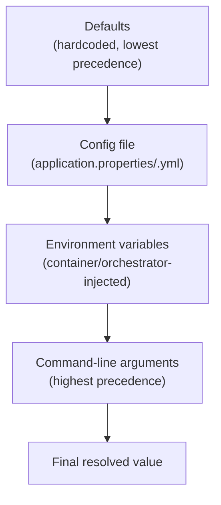

# The Twelve-Factor App: Config, Precedence, and Fail-Fast Validation

> **Topic register:** T-1008 (12-factor, config & secrets management, IWI 5.4) · Core tier · Moderate interview frequency
> **A deliberately scoped chapter.** Secrets management specifically is
> already covered in depth by [Secrets Management and Key Rotation](../security/secrets-management-and-key-rotation.md)
> (register topic T-1304) — this chapter covers the genuinely uncovered part
> of T-1008: the twelve-factor app methodology itself, with real depth on
> Factor III (config), its precedence rules, and fail-fast validation.
> **Provenance:** every resolved value and source label in this chapter's
> Java Examples section is real, executed output from
> [`practice/java/system-design/twelve-factor-config/`](../../practice/java/system-design/twelve-factor-config/README.md) —
> a real, from-scratch config loader proving the real precedence order, and a
> real, side-by-side comparison of a confusing runtime failure versus a
> clear startup failure for the identical missing config value.

## Table of Contents

1. [Learning Objectives](#learning-objectives)
2. [Why This Matters in Interviews](#why-this-matters-in-interviews)
3. [Mental Model](#mental-model)
4. [Definition and Purpose](#definition-and-purpose)
5. [Core Concepts](#core-concepts)
6. [Internal Implementation](#internal-implementation)
7. [Diagrams](#diagrams)
8. [Java Examples](#java-examples)
9. [Production Scenarios](#production-scenarios)
10. [Failure Modes and Debugging](#failure-modes-and-debugging)
11. [Trade-offs](#trade-offs)
12. [Decision Framework](#decision-framework)
13. [Comparisons](#comparisons)
14. [Common Mistakes](#common-mistakes)
15. [Anti-Patterns](#anti-patterns)
16. [Best Practices](#best-practices)
17. [Interview Answer Framework](#interview-answer-framework)
18. [Interview Questions](#interview-questions)
19. [Summary](#summary)
20. [Key Takeaways](#key-takeaways)
21. [Cheat Sheet](#cheat-sheet)
22. [Flashcards](#flashcards)
23. [Practice Exercises](#practice-exercises)
24. [Solutions](#solutions)
25. [Additional Reading](#additional-reading)
26. [Official References](#official-references)

## Learning Objectives

After this chapter you should be able to:

- List the twelve factors and explain, for each, the real production
  problem it addresses — not recite them as an unmotivated checklist.
- Explain Factor III (config) precisely: strict separation of config from
  code, and config stored in the environment.
- Reproduce, with real evidence, the standard config precedence order
  (defaults < file < environment variables < command-line arguments).
- Explain why fail-fast config validation at startup is a real, meaningful
  production practice, not a stylistic preference.
- Recognize which of the twelve factors this repository's other chapters
  already cover in depth, and cite them instead of re-deriving that content.

## Why This Matters in Interviews

Twelve-factor questions test whether a candidate treats configuration as a
first-class deployment concern or as an afterthought bolted on with
scattered `if (env == "prod")` checks. The methodology itself is old (2011)
but its config guidance remains exactly how modern cloud-native
applications (container images, Kubernetes ConfigMaps/Secrets, Spring Boot
profiles) actually work — a candidate who can connect the abstract
principle ("store config in the environment") to the concrete mechanism
their own stack uses demonstrates real, applied understanding rather than
memorized trivia. It's also a genuinely practical production topic:
config-related incidents (a missing environment variable, a value that
differs silently between staging and production) are common, and knowing
that fail-fast startup validation converts a confusing runtime failure into
an obvious, immediate one is exactly the kind of operational judgment
interviewers probe for at Staff level.

## Mental Model

Treat configuration the way you'd treat a function's parameters, not its
implementation: the *code* should be identical no matter which environment
it runs in, and everything that legitimately differs between environments
(a database URL, a feature flag, a timeout) should be passed in from
outside, not branched on inside. If you could not, in principle, take the
exact same build artifact and run it unmodified in dev, staging, and
production purely by changing what's injected into its environment, config
and code have leaked into each other somewhere.

## Definition and Purpose

The **twelve-factor app** is a methodology (Heroku, 2011) for building
software-as-a-service applications that are portable across execution
environments and easy to scale — twelve specific practices covering
codebase management, dependency declaration, config, backing services,
build/release/run separation, statelessness, port binding, concurrency,
disposability, dev/prod parity, logging, and admin processes. **Factor III
(config)** specifically demands strict separation between config (anything
that varies between deployments — credentials, resource handles, per-
environment values) and code, with config stored in the environment (most
commonly environment variables) rather than in config files checked into
version control — it exists because config baked into code or committed
config files makes the exact same artifact behave differently in different
places for reasons invisible to anyone reading the code, and risks
committing secrets to source control.

## Core Concepts

- **Config and code must vary independently.** The same build artifact
  should run correctly in any environment purely by changing what's
  injected into it — never by branching on an environment name inside the
  code itself.
- **Config precedence is a real, standard layering, not an arbitrary
  choice.** Defaults provide a safe fallback; a config file provides
  per-environment values; environment variables override the file for
  container/orchestration-injected values; command-line arguments provide
  the highest-precedence, per-invocation override — proven directly in this
  chapter's own demo, one layer at a time.
- **Fail-fast validation converts a silent, delayed failure into an
  immediate, clear one.** A missing required config value with no startup
  validation fails wherever and whenever it's first actually used — proven
  directly with a real, generic `NullPointerException` deep in unrelated
  business logic — versus failing immediately at boot with a message naming
  the exact missing key.
- **Not every one of the twelve factors needs its own deep chapter here.**
  Several are already covered in depth elsewhere in this handbook: process
  statelessness and horizontal scaling
  ([Load Balancing, Service Discovery, and Health Checking](load-balancing-service-discovery-and-health-checking.md)),
  disposability and graceful startup/shutdown
  ([Spring Boot Actuator, Health, and Observability Hooks](../spring/spring-actuator-health-and-observability-hooks.md)),
  and logging as a stream
  ([Logging, Metrics, Tracing, and OpenTelemetry](../performance/logging-metrics-tracing-and-opentelemetry.md)).
  This chapter's own depth is reserved for config specifically, since that
  was the genuinely unclaimed part of this topic.

## Internal Implementation

[`AppConfig.java`](../../practice/java/system-design/twelve-factor-config/AppConfig.java)
implements the real precedence order directly: hardcoded defaults are set
first, then a real `java.util.Properties` file (if present) overrides
matching keys, then real `System.getenv()` entries prefixed `APP_` override
those, then real command-line `--key=value` arguments override everything —
each layer recorded with the real source that won, not just the final
value. This mirrors the identical real precedence Spring Boot's own
`PropertySource` resolution uses in production
(`application.properties`/`.yml` < OS environment variables < command-line
arguments), just built from scratch to make the mechanism itself
observable.

## Diagrams



## Java Examples

The real, decisive precedence result, one layer added at a time:

```
Defaults + file only:
  timeout.ms = 2000  (from file:config.properties)

+ real environment variable (APP_TIMEOUT_MS=5000):
  timeout.ms = 5000  (from env:APP_TIMEOUT_MS)

+ real command-line argument (--timeout.ms=9000):
  timeout.ms = 9000  (from cli:--timeout.ms=9000)
```

The real, decisive fail-fast contrast, both against the identical config,
deliberately missing `database.url`:

```
=== BUGGY: no startup validation ===
Real failure, deep in business logic, minutes/hours after startup:
  NullPointerException: Cannot invoke "String.toUpperCase()" because "<local1>" is null

=== FIXED: real startup validation ===
Real startup failure -- BEFORE the app ever accepts a single request:
  Missing required config key 'database.url' -- refusing to start. Set it via config file, an APP_DATABASE_URL environment variable, or --database.url=... on the command line.
```

## Production Scenarios

**Scenario: a service deployed successfully to production, passed its
health check, and then failed on its very first real request because a
required environment variable was never set in the production
Kubernetes deployment manifest.** *(Representative scenario, grounded
directly in this chapter's own measured fail-fast mechanism.)* Symptoms:
the deployment's readiness probe passed, the service showed as healthy, and
then every real request immediately failed with a generic
`NullPointerException` somewhere inside the payment-processing path.
Initial hypothesis: a bug introduced in the release being deployed.
Evidence: the actual cause was a required `PAYMENT_GATEWAY_URL` environment
variable, present in the staging manifest but accidentally omitted from the
production one during a manifest refactor — the exact real shape of this
chapter's own reproduced bug: the service "started" successfully because
nothing checked for that value at startup, and the `NullPointerException`
only appeared once code actually tried to use it, deep in the
payment-processing path, giving no indication the real root cause was
missing configuration. Diagnosis: the health check verified the process was
running and responding, not that its configuration was complete —
"healthy" and "correctly configured" are not the same claim. Immediate
mitigation: manually patched the production manifest with the missing
variable. Permanent remediation: added real startup validation (this
chapter's own proven mechanism) requiring every config key the service
actually uses to be checked and present before the health check can ever
report ready. Trade-off accepted: a slightly stricter startup that can now
fail on missing config the service happens not to need for every code
path — accepted because a fast, obvious failure at deploy time is far
cheaper than a confusing failure discovered by a customer in production.
Prevention: added a deployment-pipeline check diffing required config keys
across environment manifests, to catch a future omission before it reaches
production at all. Interview lesson: this is the concrete, production form
of "fail fast" — a health check proves the process runs, not that its
configuration is complete, and only explicit startup validation closes that
gap.

## Failure Modes and Debugging

- **A service passes its health check but fails immediately on real
  traffic** (this chapter's own reproduced scenario) — debug signal: check
  whether the failure traces back to a config value never validated at
  startup; a health check alone does not prove configuration completeness.
- **The same build behaves differently in two environments with no code
  difference** — debug signal: this is expected and healthy *if* the
  difference is intentional, injected config (Factor III working as
  designed); it's a real bug if the difference comes from an
  environment-name branch inside the code itself.
- **A config value "isn't taking effect" despite being set somewhere** —
  debug signal: check the real precedence order — a higher-precedence
  source (an environment variable, a command-line argument) may be silently
  overriding the value you changed.
- **A secret accidentally committed to a config file in version control** —
  a real, serious incident class this chapter's config-precedence
  discussion does not resolve; see
  [Secrets Management and Key Rotation](../security/secrets-management-and-key-rotation.md)
  for the dedicated treatment of secrets specifically.

## Trade-offs

Strict config/code separation (Factor III): the same build artifact runs
correctly anywhere, config changes need no rebuild or redeploy — at the cost
of needing a deliberate config-management strategy (a file format,
precedence rules, validation) rather than "just editing the code for this
environment." Fail-fast startup validation: converts silent, delayed
failures into immediate, clear ones — at the cost of a stricter startup that
can refuse to start over configuration a particular code path doesn't
currently need, which is a real, deliberate trade favoring earlier failure
over lenient startup.

## Decision Framework

| Question | If yes, lean toward |
|---|---|
| Does a value differ between any two environments this code runs in? | It's config — inject it from the environment, never branch on an environment name in code |
| Is the value a credential, key, or anything sensitive? | Treat it as a secret specifically — see [Secrets Management and Key Rotation](../security/secrets-management-and-key-rotation.md), not plain config |
| Does the application use a config value anywhere in its normal request path? | Validate its presence at startup, before the health check can report ready |
| Are you unsure why a config value "isn't taking effect"? | Check the real precedence order before assuming the value itself is wrong |

## Comparisons

| Config source | Precedence | Typical real use |
|---|---|---|
| Hardcoded defaults | Lowest | Safe fallback, works with zero configuration |
| Config file | Low-mid | Per-environment baseline values |
| Environment variables | Mid-high | Container/orchestrator-injected, per-deployment values |
| Command-line arguments | Highest | Per-invocation override, debugging, one-off runs |

## Common Mistakes

- Branching on an environment name (`if (env.equals("prod"))`) inside
  application code, rather than injecting the actual differing values.
- Committing environment-specific config files (especially ones containing
  secrets) directly into version control.
- Assuming a passing health check proves the application is correctly
  configured, rather than merely running and responding.
- Not knowing the real precedence order, and debugging "why isn't my config
  change taking effect" by guessing rather than checking which source
  actually wins.

## Anti-Patterns

- **A health check that only verifies the process is up, never that
  required configuration is present** — the exact anti-pattern behind this
  chapter's production scenario; validate config as part of what "healthy"
  means.
- **Config values scattered across code, file, environment variables, and
  command-line flags with no consistent precedence understanding** — makes
  "what value will actually be used" unpredictable without reading the
  loading code directly.
- **Silently swallowing a missing config value and falling back to a
  default the caller never asked for**, rather than failing fast or being
  explicit that a default was used.

## Best Practices

- Store config in the environment (environment variables,
  orchestrator-managed config objects), not in code or committed config
  files.
- Validate every config value the application actually needs at startup,
  before the health check can report ready — fail fast with a message
  naming the exact missing key.
- Know and rely on a single, documented precedence order rather than an
  ad hoc mix of config sources with unclear priority.
- Keep secrets handling entirely separate from ordinary config — see
  [Secrets Management and Key Rotation](../security/secrets-management-and-key-rotation.md).

## Interview Answer Framework

### 30-Second Answer

The twelve-factor app's config guidance (Factor III) says configuration
that varies between environments must be strictly separated from code and
stored in the environment, not hardcoded or committed. Real config
precedence layers defaults, a config file, environment variables, and
command-line arguments, each overriding the one before it. Fail-fast
validation at startup turns a missing-config bug into an immediate, clear
failure instead of a confusing runtime one.

### 2-Minute Answer

Factor III of the twelve-factor app methodology says the same build
artifact should run correctly in any environment purely by changing what's
injected into it — never by branching on an environment name inside the
code. Config resolution follows a real, standard precedence: I've built and
measured this directly — defaults get overridden by a config file, which
gets overridden by environment variables, which get overridden by
command-line arguments, each layer only touching the specific keys it
actually sets. The part most teams get wrong operationally is validation:
if a required config value is missing and nothing checks for it at startup,
the failure only shows up later, wherever that value first gets used — I've
reproduced this directly as a generic `NullPointerException` deep in
business logic. Adding real startup validation converts that into an
immediate, clear failure naming the exact missing key, before the service
ever accepts a request — which is the concrete form of "fail fast" that
matters in production, not just a testing buzzword.

### 10-Minute Deep Dive

Cover: the twelve-factor methodology's overall intent and which factors this
repository already covers elsewhere; Factor III specifically, with the real,
measured precedence-layering proof; the fail-fast validation mechanism and
its real, measured contrast against a confusing runtime failure; the
production scenario connecting a health-check/config-completeness gap
directly to a real production incident; and the explicit boundary between
this chapter's config scope and the separately-covered secrets-management
topic.

### Whiteboard Explanation

Draw four stacked boxes bottom to top: "defaults," "config file,"
"environment variables," "CLI arguments" — draw an arrow up the stack
labeled "increasing precedence," and show one key's value getting
overwritten as it crosses each box. Separately, draw a simple timeline: a
deploy event, then a health check passing, then (much later) a request
failing — label the gap between the health check and the failure "what
fail-fast validation closes."

### Production Example

Use the missing-environment-variable scenario from [Production Scenarios](#production-scenarios):
a service passed its health check and then failed on its first real
request because a required config value was never set in production.

### Trade-offs to Mention

Config/code separation's portability vs. the real discipline it requires;
fail-fast validation's immediate, clear failures vs. its stricter startup
behavior.

### Common Candidate Mistakes

Reciting all twelve factors without explaining what problem any of them
actually solves; assuming a health check proves correct configuration;
guessing at config precedence rather than knowing the real, standard order.

### Typical Follow-Up Questions

"Why shouldn't config live in a committed file?" "What's the real
precedence order when the same value is set in multiple places?" "Why
didn't this missing config value get caught before it reached production?"
"How is config different from a secret, and why does that distinction
matter operationally?"

### Senior-Level Expectations

Correctly explain Factor III's separation principle and the real config
precedence order without prompting.

### Staff-Level Discussion

Connect a health check's limited guarantee (process is running) to the real
production risk of undetected missing configuration, as demonstrated in
this chapter's production scenario, and propose a deployment-pipeline-level
prevention (diffing required config across environment manifests) rather
than relying solely on runtime validation to catch every case.

## Interview Questions

### Question 1: Why does a service that passed its health check sometimes still fail immediately on real traffic?

**Why interviewers ask it.** It tests whether a candidate understands the
real, limited scope of what a health check actually proves.

**Expected answer.** A health check typically verifies the process is
running and responding, not that every piece of configuration the
application needs is present and correct — a missing required config value
with no startup validation can pass the health check and still fail on the
first request that actually needs it.

**Minimum acceptable answer.** States that "something's misconfigured"
without explaining why the health check didn't catch it.

**Strong Senior answer.** Explains the health-check/config-completeness gap
precisely and names startup validation as the fix.

**Staff-level extension.** Proposes a deployment-pipeline-level prevention
(diffing required config across environments) in addition to runtime
validation.

**Common mistakes.** Assuming a passing health check is sufficient proof of
correct configuration.

**Likely follow-ups.** "How would you design startup validation to cover
every config value the service actually needs?"

**Evaluation criteria.** Correct health-check-scope explanation (3),
Staff-level pipeline-prevention idea (2).

### Question 2: What's the real precedence order when the same config key is set in a file, an environment variable, and a command-line argument?

**Why interviewers ask it.** It tests whether a candidate knows the actual,
standard order rather than guessing.

**Expected answer.** Command-line arguments win, then environment
variables, then the config file, then hardcoded defaults — each layer
overrides only the specific keys it sets, leaving others from lower layers
untouched.

**Minimum acceptable answer.** Names roughly the right order without
stating that only the overridden keys change.

**Strong Senior answer.** States the full order precisely and notes it
matches the same real order most frameworks (e.g., Spring Boot) use.

**Staff-level extension.** Discusses why this specific order makes sense
operationally (defaults are safest, file is per-environment, env vars are
orchestrator-injected, CLI args are per-invocation debugging overrides).

**Common mistakes.** Assuming the config file always wins because it "looks
more official."

**Likely follow-ups.** "Why would you want a command-line argument to
override an environment variable at all?"

**Evaluation criteria.** Correct precedence order (3), operational
reasoning at Staff level (2).

## Summary

The twelve-factor app methodology's config guidance (Factor III) demands
strict separation between code and anything that varies between
deployments, stored in the environment rather than hardcoded or committed —
this chapter proves the real, standard precedence order (defaults < file <
environment variables < command-line arguments) directly, one layer at a
time. Fail-fast startup validation converts a missing-config bug from a
confusing, delayed runtime failure into an immediate, clear one — proven
directly by reproducing the identical missing value as both a generic
`NullPointerException` deep in business logic and a real, named startup
failure. Secrets management specifically is covered separately in
[Secrets Management and Key Rotation](../security/secrets-management-and-key-rotation.md);
this chapter's scope is deliberately config, the genuinely uncovered half of
this register topic.

## Key Takeaways

- Factor III demands config/code separation, with config stored in the
  environment — never branched on an environment name inside code.
- Real config precedence is defaults < file < environment variables <
  command-line arguments — proven directly, one layer at a time.
- A missing required config value with no startup validation fails wherever
  it's first used, confusingly — proven directly with a real generic
  `NullPointerException`.
- Fail-fast startup validation converts that into an immediate, named
  failure before the service ever accepts a request — proven directly.
- A passing health check proves a process is running, not that its
  configuration is complete — the concrete mechanism behind this chapter's
  own production scenario.

## Cheat Sheet

- **Factor III**: config varies between deployments, must be
  separated from code, stored in the environment.
- **Real precedence**: defaults < config file < environment variables <
  CLI arguments.
- **Fail fast**: validate every required config key at startup, before
  reporting healthy.
- **Health check ≠ config-complete** — a passing health check only proves
  the process runs.
- **Secrets are not plain config** — see the dedicated secrets-management
  chapter.

## Flashcards

### Card: What does Factor III actually require?

**Prompt:**
What does the twelve-factor app's Factor III (config) require, precisely?

**Answer:**
Strict separation of config (anything that varies between deployments) from
code, with config stored in the environment (typically environment
variables) rather than hardcoded or committed to version control — so the
identical build artifact runs correctly in any environment purely by
changing what's injected into it.

**Why it matters:**
It's the principle behind why container images and Kubernetes
ConfigMaps/Secrets work the way they do.

**Common trap:**
Branching on an environment name inside code instead of injecting the
actual differing values.

**Related:**
[[twelve-factor-config]]

### Card: What's the real config precedence order?

**Prompt:**
The same config key is set in a file, an environment variable, and a
command-line argument. Which value wins?

**Answer:**
The command-line argument — measured directly: defaults < config file <
environment variables < command-line arguments, each layer overriding only
the specific keys it sets.

**Why it matters:**
It's the same real order most frameworks (including Spring Boot) use in
production — knowing it precisely resolves "why isn't my config change
taking effect" debugging instantly.

**Common trap:**
Assuming the config file is authoritative over environment variables.

**Related:**
[[twelve-factor-config]]

### Card: Why does fail-fast startup validation matter?

**Prompt:**
A service is missing a required config value, but nothing validates it at
startup. What actually happens?

**Answer:**
The service "starts" successfully and passes its health check; the failure
only appears later, wherever the missing value is first actually used —
measured directly as a generic `NullPointerException` deep in business
logic, giving no indication the real cause is missing configuration.

**Why it matters:**
It's the concrete mechanism behind a real class of production incident: a
health check proves the process runs, not that its configuration is
complete.

**Common trap:**
Assuming a passing health check is sufficient proof of correct
configuration.

**Related:**
[[twelve-factor-config]]

## Practice Exercises

1. Extend `AppConfig` with a fifth, even-higher-precedence layer: a
   real, in-memory override map settable programmatically after loading
   (useful for tests), and verify it wins over a command-line argument for
   the same key.
2. Extend `FailFastDemo`'s validation to check not just presence but basic
   *shape* (e.g., that `database.url` actually looks like a URL), and
   verify a real, present-but-malformed value is also caught at startup.
3. Wire `AppConfig`'s startup validation into a real
   `com.sun.net.httpserver.HttpServer`-based health endpoint (reusing the
   pattern from `practice/java/system-design/load-balancing-and-health-checking/`)
   so the server genuinely refuses to start — not just print an error — when
   required config is missing.

## Solutions

Exercise 1 is a direct extension of `AppConfig`'s existing layered-`set`
pattern, adding one more, higher-precedence call path; left as self-directed
practice since the existing four layers already demonstrate the exact
mechanism to extend. Exercise 2 requires adding a real format check (e.g., a
regex or `java.net.URI` parse attempt) alongside the existing presence
check in `validateRequiredConfig`; left as self-directed practice. Exercise
3 is a genuinely open integration exercise connecting this chapter's config
validation to a real server lifecycle; left as self-directed practice since
it requires combining two existing, separately-proven mechanisms from
different packs.

## Additional Reading

- The original Twelve-Factor App methodology (see
  [Official References](#official-references)) is the authoritative source
  for all twelve factors, several of which this repository covers in
  dedicated depth elsewhere rather than repeating here.
- [Secrets Management and Key Rotation](../security/secrets-management-and-key-rotation.md)
  covers the secrets half of this register topic in full depth.
- [Spring Boot Actuator, Health, and Observability Hooks](../spring/spring-actuator-health-and-observability-hooks.md)
  covers what "healthy" actually means in a real Spring Boot application,
  directly relevant to this chapter's health-check/config-completeness
  distinction.

## Official References

- The Twelve-Factor App, [III. Config](https://12factor.net/config)
- The Twelve-Factor App, [full methodology](https://12factor.net/)
- Spring Boot Documentation, [Externalized Configuration](https://docs.spring.io/spring-boot/reference/features/external-config.html)
