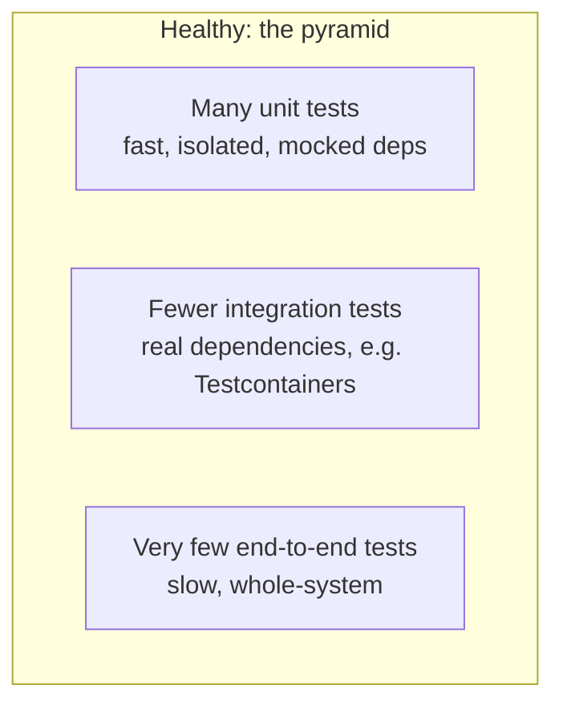

# Test Strategy, the Pyramid, and Test Doubles

> **Topic register:** T-1101/T-1103 · IWI 7.00/6.40 · Core tier
> **Provenance:** the test run in this chapter is real, executed output from [`practice/java/week-11/testing/src/PaymentServiceUnitTest.java`](../../practice/java/week-11/testing/src/PaymentServiceUnitTest.java) against a real Mockito mock, via JUnit 5's console launcher (no Maven/Gradle).

## Table of Contents

1. [Learning Objectives](#learning-objectives)
2. [Why This Matters in Interviews](#why-this-matters-in-interviews)
3. [Mental Model](#mental-model)
4. [Definition and Purpose](#definition-and-purpose)
5. [Core Concepts](#core-concepts)
6. [Internal Implementation](#internal-implementation)
7. [Diagrams](#diagrams)
8. [Production Scenarios](#production-scenarios)
9. [Trade-offs](#trade-offs)
10. [Decision Framework](#decision-framework)
11. [Common Mistakes](#common-mistakes)
12. [Anti-Patterns](#anti-patterns)
13. [Best Practices](#best-practices)
14. [Interview Answer Framework](#interview-answer-framework)
15. [Interview Questions](#interview-questions)
16. [Summary](#summary)
17. [Key Takeaways](#key-takeaways)
18. [Cheat Sheet](#cheat-sheet)
19. [Flashcards](#flashcards)
20. [Practice Exercises](#practice-exercises)
21. [Solutions](#solutions)
22. [Additional Reading](#additional-reading)
23. [Official References](#official-references)

---

## Learning Objectives

By the end of this chapter you can:

- Explain what a mock verifies that a plain return-value assertion cannot, with a measured example.
- State the testing pyramid's shape and why the ice-cream-cone anti-pattern inverts it badly.
- Decide what to mock and what never to mock, given a specific piece of code under test.
- Explain why coverage percentage is a diagnostic, not a quality target.

## Why This Matters in Interviews

Test strategy questions test whether a candidate treats testing as a deliberate cost/coverage design decision or as something bolted on reactively. The topic is Core-tier because nearly every candidate has written tests, but far fewer can articulate precisely what a mock proves beyond "the code ran," or defend why an inverted pyramid is worse than no test suite at all.

## Mental Model

**A test double's whole job is to let you isolate the one thing you actually want to verify from everything that thing merely calls.** A mock goes one step further than a stub: it doesn't just return a canned value, it lets the test assert on the *interaction* itself — how many times something was called, with what arguments — which is often the actual bug surface for logic like retries, where the return value alone can look identical whether the retry logic is correct or broken.

## Definition and Purpose

Test strategy is the discipline of deciding **what to test at which level** — unit, integration, or end-to-end — rather than writing tests reactively. A **test double** (mock, stub, fake, spy) stands in for a real dependency so a unit test can isolate the logic actually under test from everything that logic merely calls.

Without a deliberate strategy, teams default to one of two failure modes: too few tests (bugs ship), or the **ice-cream-cone anti-pattern** — many slow, brittle end-to-end tests and almost no fast unit tests, the inverse of what actually catches bugs cheaply. Test doubles exist because testing `PaymentService`'s retry logic against a REAL payment gateway would require that gateway to actually fail on command, on demand, repeatably — normally impossible; a mock makes "fail twice, then succeed" a one-line setup.

## Core Concepts

### A mock verifies interaction, not just outcome

`verify(gateway, times(3))` proves the retry logic called the gateway exactly 3 times with the exact arguments expected — something no assertion on a return value alone could confirm. A test that only checked the boolean result would miss both a missing retry and a wasted, unnecessary retry equally.

### The pyramid shape is a deliberate cost/coverage trade-off

Unit tests are cheap to write and run, so there should be many of them, covering logic branches precisely. End-to-end tests are expensive and flaky (real network, real timing, real infrastructure), so there should be few, covering only the critical paths a unit or integration test genuinely cannot reach.

### What to mock, and what never to

Mock dependencies that are slow, external, or non-deterministic (network calls, payment gateways, clocks) — anything that would make the test slow or flaky for reasons unrelated to the logic being tested. Do NOT mock the thing the test exists to verify — a repository test that mocks the database tests nothing but its own assumptions about what the database does, not whether the actual SQL is correct. See [Integration Testing Against Real Dependencies](integration-testing-against-real-dependencies.md) for the layer that exists specifically to close this gap.

### Coverage percentage is a diagnostic, not a target

Coverage measures that lines/branches were executed at least once — nothing about whether the assertions in those tests are meaningful. A file can have 100% coverage and a live production bug, because coverage says nothing about assertion quality.

## Internal Implementation

**Real output**, `PaymentService` retrying a mocked `PaymentGateway` that fails twice then succeeds:

```
├─ JUnit Jupiter ✔
│  └─ PaymentServiceUnitTest ✔
│     ├─ exhaustsRetriesAndReturnsFalseOnPermanentFailure() ✔
│     ├─ succeedsOnThirdAttemptAfterTwoFailures() ✔
│     └─ succeedsImmediatelyWithNoRetriesNeeded() ✔

Test run finished after 460 ms
[3 tests successful, 0 tests failed]
```

```java
PaymentGateway gateway = mock(PaymentGateway.class);
doThrow(new RuntimeException("network blip"))
        .doThrow(new RuntimeException("network blip"))
        .doNothing()
        .when(gateway).charge(anyString(), anyLong());

PaymentService service = new PaymentService(gateway, 3);
boolean result = service.processPayment("cust-1", 5000);

assertTrue(result);
verify(gateway, times(3)).charge("cust-1", 5000); // asserts the INTERACTION, not just the outcome
```

The `verify(gateway, times(3))` line is the entire point of a mock over a stub: it's not enough that `processPayment` returned `true` — the test also proves the retry logic called the gateway exactly 3 times with the exact arguments expected. A third test (`succeedsImmediatelyWithNoRetriesNeeded`) proves the inverse just as precisely: `verify(gateway, times(1))` confirms the service does NOT retry when the first attempt already succeeded — a wasted-retry bug would be invisible to a test that only checked the boolean result.

## Diagrams



## Production Scenarios

### Scenario: a fully-mocked repository test suite passes while a real production migration breaks every write

**Symptoms.** A service's repository layer has a comprehensive test suite, all passing, all using a mocked database interface. A schema migration renames a column the repository code still references by its old name. The mocked test suite continues to pass unchanged; the first real signal is a production error rate spike immediately after deployment.

**Impact.** A change that should have been caught by the test suite reaches production, causing every write through the affected repository method to fail.

**Initial hypotheses.** The migration itself was flawed (checked — the migration ran correctly and matches the intended schema); the deployment pipeline skipped running tests (checked — the full suite ran and passed); the repository tests mock the database and therefore never execute real SQL against the new schema (correct).

**Evidence.** Every repository test's mock is configured to return a canned value regardless of what SQL string the repository code actually constructs — the mocks were never updated because nothing forced them to reflect the schema change, and no test in the suite ever sent a real query to a real database.

**Diagnosis.** Exactly the failure mode this chapter names: a repository test that mocks the database verifies only the test's own assumptions about what the database does, never whether the actual SQL is valid against the real schema. The suite gave 100% passing confidence while testing nothing about real SQL correctness.

**Immediate mitigation.** Roll back the deployment, and manually verify the repository's SQL against the new schema before re-deploying.

**Permanent remediation.** Add real integration tests (per [Integration Testing Against Real Dependencies](integration-testing-against-real-dependencies.md)) for every repository method, run against a real, ephemeral database instance, specifically so a schema mismatch fails the build instead of reaching production.

**Alternatives considered.** Adding more unit tests with more detailed mocks — rejected, since more elaborate mocking still can't verify real SQL correctness; the fix has to include a real database somewhere in the pipeline.

**Trade-offs.** Integration tests are slower and require Docker/database infrastructure in CI — accepted, since the alternative (mocked-only coverage) demonstrably let a real production-breaking change through.

**Prevention.** Any repository or boundary-code test suite consisting entirely of mocked dependencies should be flagged in review as providing false confidence about the boundary itself, even at 100% coverage.

**Interview lesson.** This is Interview Question 1's underlying scenario played out at real production cost: a mocked-database test suite giving false confidence, exactly the pattern the expected Staff-level answer names unprompted.

## Trade-offs

| Level | Speed | What it catches | What it misses |
|---|---|---|---|
| Unit (mocked deps) | Fast (460ms for 3 tests, JVM-startup-dominated) | Logic bugs, branch coverage, exact interaction counts | Anything about how the real dependency actually behaves |
| Integration (real deps) | Slower (real Docker, real network round-trips) | Real behavior of the boundary code (SQL correctness, serialization, real error codes) | Doesn't need to cover every logic branch — that's the unit layer's job |
| End-to-end | Slowest, most brittle | Whether the whole system actually works together | Expensive to maintain; a good target is "a handful of critical paths," not comprehensive coverage |

## Decision Framework

1. **Is this pure business logic with no IO?** Unit test, no mocks needed.
2. **Does this logic call something slow/external/non-deterministic?** Unit test, mock the dependency.
3. **Is the code's whole job talking to a real system (a repository, an API client)?** Integration test, real dependency — mocking here tests only the mock's assumptions.
4. **Is this a critical, whole-system user flow?** A small number of end-to-end tests, sparingly — not comprehensive coverage.
5. **Is a piece of business logic hard to unit test as currently structured?** Treat that as a signal about the code's coupling to IO, not just a testing inconvenience to work around with more mocks.

## Common Mistakes

- Treating coverage percentage as a quality target rather than a diagnostic tool for finding untested code.
- Mocking the exact dependency an integration test exists to verify (mocking the database in a repository test).
- Building an ice-cream-cone test suite — many slow end-to-end tests, few fast unit tests — because it feels more thorough.

## Anti-Patterns

- **Mocking the thing under test's own boundary responsibility** — e.g., mocking the database in a repository test, verifying nothing but the mock's configuration.
- **Chasing a coverage percentage target** with tests written to execute lines rather than to catch bugs.
- **Building tests around implementation detail** (mocking internals rather than the actual external dependency), producing brittle tests that break on refactors with no behavior change.

## Best Practices

- Mock only what's slow, external, or non-deterministic; never mock the exact boundary a test exists to verify.
- Treat coverage as a tool for finding untested code, not a quality gate on its own.
- Keep the pyramid shape intentional: many unit tests, fewer integration tests, very few end-to-end tests.
- Treat "this code is hard to unit test" as a structural signal, not just a testing problem.

## Interview Answer Framework

### 30-Second Answer

A test double lets a test verify an interaction (call count, arguments), not just a return value — measured directly: `verify(gateway, times(3))` proves a retry loop called its dependency the exact expected number of times. The testing pyramid (many fast unit tests, fewer integration, very few end-to-end) reflects a real cost/coverage trade-off; inverting it (the ice-cream cone) trades feeling thorough for a slow, flaky suite.

### 2-Minute Answer

Definition: test strategy decides what to test at which level; test doubles isolate the logic under test from what it merely calls. Why it exists: without a strategy, teams either under-test or build an ice-cream-cone suite. How it works: a mock asserts the interaction itself, not just the outcome; mock what's slow/external/non-deterministic, never the exact thing a test exists to verify. One important trade-off: coverage measures execution, not assertion quality — a diagnostic, not a target. Production example: a real measured trace showing `verify(gateway, times(3))` catching a retry-count bug a return-value-only assertion would miss entirely, and a production incident where a fully-mocked repository suite passed while a real schema-mismatched migration broke every write.

### 10-Minute Deep Dive

Cover, in order: the mental model — a test double isolates the thing you actually want to verify (mental model); the measured mock-verifies-interaction demonstration (internals, real evidence); the pyramid shape and the ice-cream-cone anti-pattern (core concepts); what to mock and what never to (decision framework); coverage as diagnostic not target (common mistakes); and close with the production scenario — a fully-mocked repository suite passing while a real migration broke production.

### Whiteboard Explanation

Draw the [§ Diagrams](#diagrams) pyramid: a wide base of unit tests, a narrower band of integration tests, a thin cap of end-to-end tests. Draw the ice-cream-cone inversion next to it (wide top, narrow base) and annotate it "feels thorough, produces a slow flaky suite developers learn to skip."

### Production Example

The mocked-repository incident in [§ Production Scenarios](#production-scenarios): a fully-passing, fully-mocked repository test suite gave no signal when a real schema migration broke production, because no test in the suite ever executed real SQL.

### Trade-offs to Mention

State unprompted: coverage percentage says nothing about assertion quality; mocking the exact boundary a test exists to verify produces false confidence; the pyramid's shape is a deliberate cost/coverage trade-off, not an aesthetic preference.

### Common Candidate Mistakes

Mocking the database in a repository test; treating coverage percentage as a target; building a test suite top-heavy with slow end-to-end tests.

### Typical Follow-Up Questions

1. "Your team wants to mock the database in every repository test for speed. Convince me that's wrong."
2. "A file has 100% coverage and a bug in production. How?"

### Senior-Level Expectations

Correctly identifies that a mocked-database repository test only verifies the test's own assumptions, not real SQL correctness; explains that coverage doesn't verify assertion quality.

### Staff-Level Discussion

The choice of what to mock is itself an architectural decision, not a testing detail: a codebase where business logic is cleanly separated from IO (the same hexagonal/ports-and-adapters discipline — see [Clean and Hexagonal Architecture](../architecture/clean-hexagonal-architecture.md)) makes unit testing natural, because the logic layer has few or no external dependencies to mock in the first place. A codebase where business logic and IO are tangled together forces either extensive mocking (brittle, testing implementation detail rather than behavior) or pushes everything to slow integration/end-to-end tests (the ice-cream cone). A Staff engineer treats "this code is hard to unit test" as a signal about the code's structure, not just a testing problem to work around with more mocks. Similarly, coverage should be framed as a diagnostic for finding untested code, never a quality target — a coverage requirement can perversely incentivize tests written to hit lines rather than to catch bugs, and flakiness itself is often a more useful design signal than a coverage number.

## Interview Questions

### Question 1 — Where do you draw the unit/integration line?

**Why interviewers ask it.** Tests whether the candidate has a principled boundary, not an intuition-only answer.

**Expected answer.** Unit tests cover the logic under test in isolation, with test doubles standing in for anything slow/external/non-deterministic; integration tests exist specifically to verify the REAL behavior of a boundary that a mock would just assume correct rather than verify.

**Minimum acceptable answer.** States the general unit-vs-integration distinction, even without the "mock verifies assumptions" framing.

**Strong Senior answer.** Correctly identifies that a mocked-database repository test only verifies the test's own assumptions, not real SQL correctness.

**Staff-level extension.** Connects this to a concrete failure mode — a real production incident where mocked tests passed but a real migration/schema mismatch broke in production, and the mocked test suite gave false confidence.

**Common mistakes.** Mocking the exact thing an integration test exists to check (e.g., mocking the database in a repository test).

**Likely follow-ups.** "Your team wants to mock the database in every repository test for speed. Convince me that's wrong."

**Evaluation criteria (1–5).** 1: no clear boundary. 3: correctly identifies what a mocked-database test misses. 5: correct identification plus a concrete production-incident connection.

**Related references.** [§ Internal Implementation](#internal-implementation); [Integration Testing Against Real Dependencies](integration-testing-against-real-dependencies.md).

---

### Question 2 — What does coverage percentage actually measure?

**Why interviewers ask it.** Tests whether the candidate understands coverage's actual limits rather than treating it as a proxy for quality.

**Expected answer.** That lines/branches were executed at least once — nothing about whether the assertions in those tests are meaningful, or whether the right things were checked.

**Minimum acceptable answer.** States that coverage doesn't guarantee test quality.

**Strong Senior answer.** Explains that coverage doesn't verify assertion quality.

**Staff-level extension.** Frames coverage as a diagnostic for finding untested code, not a quality target — a coverage requirement can perversely incentivize tests written to hit lines rather than to catch bugs, and names flakiness itself as a more useful design signal.

**Common mistakes.** Treating coverage percentage as a target rather than a diagnostic.

**Likely follow-ups.** "A file has 100% coverage and a bug in production. How?"

**Evaluation criteria (1–5).** 1: treats coverage as a quality guarantee. 3: explains coverage doesn't verify assertions. 5: correct explanation plus the diagnostic-vs-target framing and flakiness-as-signal insight.

**Related references.** [§ Core Concepts](#core-concepts).

## Summary

A test double (mock) lets a test verify BOTH the outcome (retry eventually succeeds) AND the interaction (exactly 3 calls, exact arguments) of retry logic against a dependency that would be nearly impossible to make fail on command for real — real, executed in 460ms including JVM startup. The testing pyramid's shape (many fast unit tests, fewer integration tests, very few end-to-end tests) reflects a real cost/coverage trade-off; inverting it (the ice-cream-cone anti-pattern) produces a slow, flaky suite for the sake of feeling thorough.

## Key Takeaways

- A mock lets a test assert the exact interaction (call count, arguments), not just the return value.
- Mock what's slow/external/non-deterministic; never mock the exact thing an integration test exists to verify.
- Coverage percentage measures execution, not assertion quality — a diagnostic, not a target.
- The pyramid shape (many unit, fewer integration, very few end-to-end) reflects real cost/coverage trade-offs.

## Cheat Sheet

| Situation | Test level |
|---|---|
| Pure business logic, no IO | Unit test, no mocks needed |
| Logic that calls a slow/external/flaky dependency | Unit test, mock the dependency |
| Code whose whole job IS talking to a real system (DB, API client) | Integration test, real dependency |
| A handful of critical, whole-system user flows | End-to-end test, sparingly |

## Flashcards

### Card: What a mock proves beyond a return value

**Prompt:**
What does `verify(gateway, times(3))` prove that `assertTrue(result)` alone cannot?

**Answer:**
That the retry logic called the dependency the exact expected number of times with the exact arguments — the interaction, not just the outcome.

**Why it matters:**
Catches wasted-retry and missing-retry bugs a return-value-only assertion would miss identically.

**Common trap:**
Treating a passing boolean assertion as proof the interaction logic itself is correct.

**Related:**
[Internal Implementation](#internal-implementation)

### Card: Why mocking the database in a repository test is wrong

**Prompt:**
What's wrong with mocking the database in a repository test?

**Answer:**
It only verifies the test's own assumptions about what the database does — it never checks real SQL correctness.

**Why it matters:**
A common, false-confidence-producing mistake that a 100%-passing suite can hide.

**Common trap:**
Believing a fully-mocked, fully-passing repository suite is sufficient coverage of the boundary.

**Related:**
[Production Scenarios](#production-scenarios)

### Card: What coverage percentage actually measures

**Prompt:**
What does coverage percentage actually measure?

**Answer:**
Execution (lines/branches run at least once) — nothing about assertion quality. A diagnostic tool, not a quality target.

**Why it matters:**
Prevents treating a coverage number as proof of test quality.

**Common trap:**
Setting a coverage percentage as a release gate without checking assertion quality.

**Related:**
[Core Concepts](#core-concepts)

## Practice Exercises

1. Reproduce: [`practice/java/week-11/testing/src/PaymentServiceUnitTest.java`](../../practice/java/week-11/testing/src/PaymentServiceUnitTest.java) via the console launcher.
2. Write a 4th test case for `PaymentService` covering `maxAttempts = 1` (no retries possible at all) and predict the exact `verify()` call count before running it.
3. Identify one piece of business logic from earlier practice code that's hard to unit test as currently structured, and explain what about its structure makes it hard.

## Solutions

**Exercise 1.** Expected output matches this chapter's measured trace: 3 tests pass in ~460ms, with `verify(gateway, times(3))` confirming the exact retry count for the eventual-success case.

**Exercise 2.** With `maxAttempts = 1`, the service should call the gateway exactly once regardless of outcome (no room for a retry); the predicted assertion is `verify(gateway, times(1)).charge(...)` for both the success and permanent-failure cases.

**Exercise 3.** Code that constructs its own dependencies internally (`new PostgresClient()` inside a method, rather than receiving a dependency through its constructor) is hard to unit test, because there's no seam to substitute a test double — exactly the coupling [Clean and Hexagonal Architecture](../architecture/clean-hexagonal-architecture.md) exists to prevent by pushing such construction to the adapter layer.

## Additional Reading

- [Martin Fowler — TestPyramid](https://martinfowler.com/bliki/TestPyramid.html)

## Official References

- [Mockito documentation](https://javadoc.io/doc/org.mockito/mockito-core/latest/org/mockito/Mockito.html)
