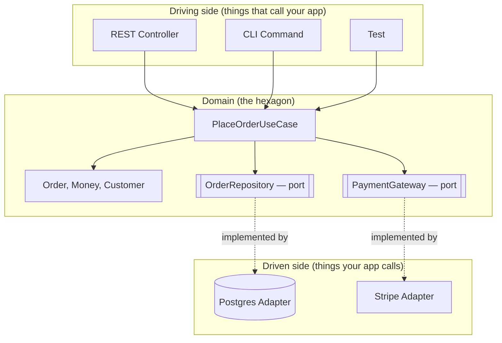
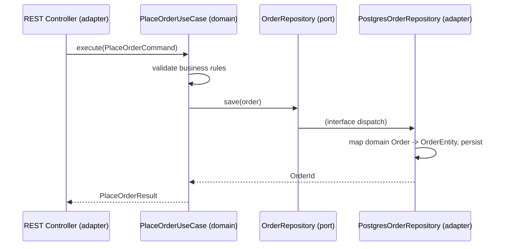

# T-901 · Clean / Hexagonal Architecture

**IWI 7.25 · Advanced tier · Prerequisite for:** T-903 (aggregates), T-912 (technology replacement boundaries), most of Chapter 07

## Table of Contents

1. [The concept](#1-the-concept)
2. [Why it exists](#2-why-it-exists)
3. [How it works internally](#3-how-it-works-internally)
4. [Trade-offs](#4-trade-offs)
5. [Performance, memory, and concurrency implications](#5-performance-memory-and-concurrency-implications)
6. [Production example](#6-production-example-template--fill-from-your-own-system)
7. [Interview questions](#7-interview-questions)
8. [Common mistakes and anti-patterns](#8-common-mistakes-and-anti-patterns)
9. [Staff-level discussion](#9-staff-level-discussion)
10. [Decision criteria](#10-decision-criteria-cheat-sheet)
11. [Summary](#11-summary)
12. [Key Takeaways](#12-key-takeaways)
13. [Cheat Sheet](#13-cheat-sheet)
14. [Flashcards](#14-flashcards)
15. [Practice Exercises](#15-practice-exercises)
16. [Additional Reading](#16-additional-reading)
17. [Official References](#17-official-references)

---

## 1. The concept

Hexagonal architecture (Alistair Cockburn, 2005, "Ports and Adapters") organizes a system around one rule: **the domain — your business logic — has no compile-time dependency on anything outside it.** Not the database, not the web framework, not the message broker, not the cloud SDK.

The domain defines **ports**: interfaces stating what it needs (`OrderRepository`, `PaymentGateway`) or what it offers (`PlaceOrderUseCase`). Everything outside the domain — a Postgres repository, a Stripe client, a REST controller — is an **adapter** that implements or calls a port. Dependencies point in exactly one direction: inward, toward the domain.



Clean Architecture (Robert Martin, 2012) is the same idea generalized into concentric rings — Entities, Use Cases, Interface Adapters, Frameworks & Drivers — with the **Dependency Rule**: source code dependencies point only inward, and nothing in an inner ring knows anything about an outer ring. Onion Architecture (Jeffrey Palermo, 2008) is a third name for the same shape. Whichever term an interviewer uses, the mechanism being tested is identical: **inversion of the dependency between domain and infrastructure.**

## 2. Why it exists

Layered architecture (`Controller → Service → Repository → Database`) looks similar but inverts the actual dependency: the "domain" logic living in the service layer typically imports JPA entities, transaction annotations, and framework types directly. The dependency points *outward*, toward infrastructure, even though the diagram is drawn as if it points down.

This matters concretely at the moment infrastructure changes: swapping ORMs, moving from REST to gRPC, or extracting a bounded context into its own service. In a layered system with a leaky service layer, that change touches every class that imported the old framework type — often the majority of the codebase. In a hexagonal system, it touches only the adapters implementing the affected port; the domain and use cases don't move.

The **historical motivation** was testability: Cockburn was trying to solve the specific problem of tests that could only run against a live database or a live UI, making TDD impractical for anything beyond trivial logic. A domain with no infrastructure dependency can be unit-tested with plain object construction — no `@SpringBootTest`, no Testcontainers, no mocks of framework classes.

## 3. How it works internally

**Primary (driving) ports** are interfaces the outside world calls *into* the domain — `PlaceOrderUseCase.execute(command)`. **Secondary (driven) ports** are interfaces the domain calls *out through* — `OrderRepository.save(order)`. The distinction matters because primary ports are typically one-per-use-case (small, task-shaped) while secondary ports are typically one-per-resource (broader, CRUD-shaped or narrower, depending on interface segregation choices).



Where do JPA entities live? Three defensible answers, in increasing order of purity:

1. **Separate persistence models + mappers** — a `Order` domain class and a distinct `OrderEntity` JPA class, converted at the repository adapter boundary. Maximum purity, real mapping-code cost.
2. **Annotated domain objects, pragmatic compromise** — the domain class carries `@Entity`/`@Id` annotations directly. The domain "knows about" JPA as a dependency, but no framework *behavior* leaks in (no lazy-loading proxies escaping the repository, no transaction management in domain code). Common in practice; defensible if stated as a deliberate trade-off.
3. **Domain depends on ORM types directly in its methods** (e.g., returns `Optional<OrderEntity>` from a domain-facing method) — this is the leak the pattern exists to prevent, not a valid option.

Transactions belong at the **application-service level** — the layer that orchestrates a use case, sitting just inside the primary port. The domain itself does not know transactions exist; it operates on already-loaded aggregates and returns new state.

**Sketch — illustrates the shape, not compiled standalone** (real, compiled Java for this week lives in `practice/java/week-01/`; this hexagonal-architecture sketch has no equivalent runnable build in this pack, since it's a structural pattern, not an algorithm):

```java
// domain/order/OrderRepository.java — the port, owned by the domain
package domain.order;

public interface OrderRepository {
    Order findById(OrderId id);
    void save(Order order);
}

// infrastructure/persistence/PostgresOrderRepository.java — the adapter
package infrastructure.persistence;

import domain.order.Order;
import domain.order.OrderId;
import domain.order.OrderRepository;

public class PostgresOrderRepository implements OrderRepository {
    private final EntityManager em;
    private final OrderMapper mapper;

    @Override
    public Order findById(OrderId id) {
        OrderEntity entity = em.find(OrderEntity.class, id.value());
        return mapper.toDomain(entity);
    }

    @Override
    public void save(Order order) {
        em.merge(mapper.toEntity(order));
    }
}
```

## 4. Trade-offs

| Benefit | Cost |
|---|---|
| Domain testable with plain unit tests, no framework bootstrap | Extra interfaces and (often) mapping code for every port |
| Infrastructure swap touches only adapters | More files, more indirection to navigate for a newcomer |
| Enforces a single direction of dependency, catchable in code review or with `ArchUnit` | Temptation to leak framework types through ports if not disciplined |
| Domain logic reads as business rules, not persistence mechanics | Overkill for a small CRUD service with no meaningful domain logic |

**When NOT to use it:** a thin CRUD service that is, in substance, a typed wrapper over a single table with no business rules beyond validation. Applying hexagonal architecture unconditionally to that service adds indirection with no corresponding payoff — there is no domain logic to protect from infrastructure, so the domain/infrastructure boundary is drawn around nothing. A Staff-level answer says this explicitly; it is one of the most differentiating things a candidate can volunteer (see §7, Q5).

## 5. Performance, memory, and concurrency implications

Hexagonal architecture is a compile-time/organizational pattern, not a runtime one — by itself it adds no meaningful latency (an extra interface dispatch is not measurable next to I/O). The indirect cost is at the mapping boundary: converting between a persistence model and a domain model on every read/write is allocation and CPU work that is easy to make expensive by mapping eagerly and completely when only a projection is needed. In a hot read path, mapping the entire aggregate graph to serve a summary view is the actual, measurable cost — not the architecture. This is why option 2 above (annotated domain objects) is sometimes the correct trade-off for a hot path: it removes the mapping cost at the price of purity.

**Concurrency implication:** because the domain has no framework dependency, it also has no implicit thread-confinement guarantee that a framework (e.g., a request-scoped Spring bean) would otherwise provide for free. A domain object shared across threads by an adapter (a cache, a batch processor) needs its own explicit thread-safety reasoning — the pattern doesn't add a concurrency problem, but it does remove a source of accidental protection.

## 6. Production example (template — fill from your own system)

> On **[a production service you've worked on]**, swapping **[persistence technology / external provider]** for **[replacement]** touched **[N] adapter classes and zero domain classes** — roughly **[X days]** instead of the **[Y weeks]** the initial estimate assumed, because the estimate was made before anyone confirmed the domain layer was actually clean.

Fill this from real experience before your first mock — a fabricated number collapses on the first follow-up ("what made the estimate wrong initially?").

## 7. Interview questions

### Q1. What problem does hexagonal architecture solve that layered architecture does not?

- **Expected answer:** names the *direction* of the dependency, not just "separation of concerns" — layered architecture also claims separation, so the differentiator has to be the inversion.
- **Common mistakes:** describing folder structure instead of dependency direction; conflating the two patterns as identical with different names.
- **Follow-up questions:** "Draw me a layered architecture where the service layer imports JPA types directly. Which layer is actually depending on which?"
- **Senior-level expectations:** states the inversion precisely and can point to a concrete leaky-layered example.
- **Staff-level expectations:** connects the inversion to a real organizational cost (team coupling, migration cost) rather than stopping at the technical definition.

### Q2. What exactly is a port, and what is an adapter? Give one of each.

- **Expected answer:** port = interface owned by the domain; adapter = concrete implementation living in infrastructure.
- **Common mistakes:** placing the interface in the infrastructure package "for convenience"; calling a concrete class a "port."
- **Follow-up questions:** "Is a port a class or an interface? Why does that matter?" *(It must be an interface owned by the domain — if infrastructure owns the interface, the dependency direction inverts again.)*
- **Senior-level expectations:** correctly distinguishes primary (driving) vs secondary (driven) ports when asked.
- **Staff-level expectations:** discusses interface segregation trade-offs — one broad repository port vs several narrow, single-capability ports — and when each is appropriate.

### Q3. Where does the repository interface live, and why not next to its implementation?

- **Expected answer:** domain package, not infrastructure — because the domain owns the contract it depends on.
- **Common mistakes:** "next to the implementation, like normal Java convention" — this is the standard convention inverted deliberately, and missing that is the most common miss.
- **Follow-up questions:** "What Java package would `OrderRepository` sit in versus `PostgresOrderRepository`?"
- **Senior-level expectations:** states the package structure correctly without hesitation.
- **Staff-level expectations:** connects this to the Dependency Inversion Principle (the "D" in SOLID) explicitly, by name.

### Q4. Your domain model must not depend on JPA. What does that cost you, concretely?

- **Expected answer:** names the mapping layer and its maintenance cost honestly, doesn't oversell purity as free.
- **Common mistakes:** claiming there is no cost, or that the cost is negligible without having actually estimated it.
- **Follow-up questions:** "How much mapping code, roughly, for a moderately complex aggregate?"
- **Senior-level expectations:** gives an honest, reasoned cost estimate.
- **Staff-level expectations:** discusses when option 2 (annotated domain objects, §3) is the better trade-off specifically to avoid this cost, and why that's not "cheating."

### Q5. Would you use this on every project?

*This is the Staff-differentiating question.*

- **Expected answer:** **no**, with a concrete criterion (business-rule density, expected system lifetime, team size) — not "yes, always" and not "it depends" without the criterion.
- **Common mistakes:** answering "yes" unconditionally — this is the single most common failure on this topic and the fastest way to read as memorized rather than understood.
- **Follow-up questions:** "Give me an example of a service where you specifically would NOT use it."
- **Senior-level expectations:** answers "no" with at least one concrete reason.
- **Staff-level expectations:** produces a specific counter-example (see `06-domain-purity-exercise.md` §3) and reasons about the cost/benefit in terms a business stakeholder would recognize, not just a technical one.

### Q6. You are replacing PostgreSQL with DynamoDB. Which files change, and which must not?

- **Expected answer:** only the adapter (and possibly the port, if the access pattern genuinely can't be expressed the same way) changes; the domain and use cases do not.
- **Common mistakes:** assuming zero changes anywhere, ignoring that a radically different data model can force a port-signature change too.
- **Follow-up questions:** "What if the DynamoDB single-table design doesn't map cleanly onto your existing aggregate boundaries — what breaks first, the port or the domain model?"
- **Senior-level expectations:** correctly scopes the blast radius to adapters.
- **Staff-level expectations:** acknowledges that a sufficiently different storage model can force a port redesign, and that "hexagonal architecture" doesn't make every infrastructure swap free — only cheaper and better-contained than the layered alternative.

### Q7. Isn't this a lot of mapping code?

- **Expected answer:** yes, and states when that cost is and isn't worth paying (§4/§8).
- **Common mistakes:** denying the cost exists.
- **Follow-up questions:** "At what point would you stop writing separate mapper classes and just annotate the domain object directly?"
- **Senior-level expectations:** gives a genuine trade-off answer.
- **Staff-level expectations:** ties the answer back to the Q5 criterion — the mapping cost is exactly what's being weighed against the domain-protection benefit.

### Q8. How do you handle transactions across the port boundary?

- **Expected answer:** application-service level; domain has no awareness transactions exist.
- **Common mistakes:** putting `@Transactional` on domain methods, or on the repository adapter instead of the orchestrating service.
- **Follow-up questions:** "What happens if the use case needs to call two repositories in one transaction?"
- **Senior-level expectations:** places the transaction boundary correctly and explains why.
- **Staff-level expectations:** discusses what happens when the two repositories belong to different bounded contexts (this previews T-903/T-907 territory — the honest Staff answer is that this is exactly the seam where a single transaction may no longer be appropriate).

### Q9. What about queries that don't fit the repository abstraction — a complex report, a dashboard aggregate?

- **Expected answer, Staff-level:** a CQRS-lite read model that bypasses the domain/repository entirely for reads, stated as a deliberate, scoped exception rather than a crack in the architecture.
- **Common mistakes:** forcing every read through the same repository port regardless of shape, producing a bloated interface.
- **Follow-up questions:** "Doesn't that break the 'domain has no infrastructure dependency' rule?" *(No — it's the read side explicitly opting out of going through the domain, which is different from the domain depending on infrastructure.)*
- **Senior-level expectations:** recognizes the tension and proposes some form of read-side shortcut.
- **Staff-level expectations:** names it as CQRS-lite explicitly and explains why it doesn't violate the dependency rule.

### Q10. How would you introduce this into an existing, tangled codebase without a rewrite?

- **Expected answer, Staff-level:** incrementally, starting at a single seam (usually the highest-change-rate module), using the Strangler Fig pattern — extract one use case behind a port, prove the pattern, expand.
- **Common mistakes:** proposing a big-bang rewrite, or "we'd just refactor it all at once."
- **Follow-up questions:** "How do you pick which module to start with?"
- **Senior-level expectations:** proposes an incremental approach in general terms.
- **Staff-level expectations:** names the Strangler Fig pattern explicitly and gives a concrete prioritization criterion (change frequency, or highest pain point).

## 8. Common mistakes and anti-patterns

- **Believing hexagonal architecture is a folder layout.** `domain/`, `application/`, `infrastructure/` packages with zero enforcement of the dependency rule is theater — a domain class can still `import javax.persistence.Entity` inside those folders. The rule is about **dependency direction**, verifiable with a tool like ArchUnit, not naming convention.
- **Anemic use cases that just forward to the repository** — if every "use case" is `repository.save(mapper.toEntity(dto))`, there is no domain logic being protected and the pattern is providing zero value (see §4, when not to use it).
- **Leaking a framework exception through a port** — e.g. a repository interface method that can throw `org.hibernate.LazyInitializationException`. The port's contract is now coupled to the adapter's implementation detail.
- **One port per method** rather than one port per cohesive capability — produces dozens of single-method interfaces and defeats the readability the pattern is meant to provide.

## 9. Staff-level discussion

At Staff scope, hexagonal boundaries are **team boundaries** as much as code boundaries — a well-drawn port is a contract two teams can develop against in parallel without a shared merge conflict. The migration cost of retrofitting the pattern into a legacy system is itself a planning artifact: it should be scoped per bounded context (start with the highest-change-rate module, not the whole system at once), and the "would I actually do this" judgment from Q5 becomes an organizational cost/benefit call, not just a technical one — indirection has a real cost in onboarding time and code-review overhead that has to be weighed against the swap-cost benefit for a system that may never actually swap its database.

## 10. Decision criteria (cheat sheet)

| Signal | Lean toward hexagonal | Lean toward simpler layering |
|---|---|---|
| Business-rule density | High — real domain logic to protect | Low — mostly CRUD + validation |
| Expected system lifetime | Years, multiple infra generations likely | Short-lived, prototype, or throwaway |
| Team size / parallel work | Multiple teams need a stable contract | Single small team, low coordination cost |
| Testing requirement | Fast, framework-free unit tests required | Integration tests are acceptable |

## 11. Summary

Hexagonal architecture inverts the dependency between domain and infrastructure by making the domain define ports (interfaces) that infrastructure adapters implement, rather than the domain depending on infrastructure directly. The payoff is a testable, infrastructure-swappable domain; the cost is mapping code and indirection. It is a deliberate trade-off, not a universal default — the Staff-level signal is knowing precisely when *not* to apply it.

## 12. Key Takeaways

- Dependencies point inward, always — this is the one rule everything else derives from.
- A port is an interface owned by the domain; an adapter is infrastructure implementing it.
- Transactions live at the application-service layer, never inside the domain.
- The pattern has a real cost (mapping code, indirection) — naming that cost unprompted is a Senior/Staff signal.
- "Would you use this on every project?" — the honest answer is no, with a stated criterion.

## 13. Cheat Sheet

See §10 above.

## 14. Flashcards

1. **Q: What is a port?** A: An interface owned by the domain, stating what it needs or offers.
2. **Q: What is an adapter?** A: A concrete implementation of a port, living in infrastructure.
3. **Q: State the Dependency Rule.** A: Source-code dependencies point only inward, toward the domain.
4. **Q: Where does a repository interface live?** A: In the domain package, not next to its implementation.
5. **Q: When should you NOT use hexagonal architecture?** A: A thin CRUD service with no real business rules to protect.

(Full week-level deck, including T-609 cards: `08-flashcards.md`.)

## 15. Practice Exercises

1. Take one real aggregate from a system you know. Identify: is its "domain" logic actually free of framework imports today? List every framework type it touches.
2. Design the `OrderRepository` port for an order-placement use case. Write the interface only — no implementation.
3. Given a class `OrderService` that calls `entityManager.persist()` directly inside a method named `placeOrder`, rewrite it behind a port, and name exactly which file becomes the adapter.
4. Argue the anti-case: describe a real or plausible system where introducing this pattern would be a mistake, and say why.

*(Solutions are not provided here by design — Exercise 1 in particular only has value worked against your own system. Use `06-domain-purity-exercise.md` as the guided version of exercises 1–3.)*

## 16. Additional Reading

- Jeffrey Palermo, "The Onion Architecture" (blog series, 2008) — same shape, different name; useful for recognizing the pattern under any label an interviewer uses.
- Vaughn Vernon, *Implementing Domain-Driven Design* — Ch. 4, "Architecture," for how hexagonal composes with DDD's bounded contexts (previewed for Week 2's T-903).

## 17. Official References

- Alistair Cockburn, ["Hexagonal Architecture"](https://alistair.cockburn.us/hexagonal-architecture/) (original article, 2005)
- Robert C. Martin, *Clean Architecture*, Ch. 22 "The Clean Architecture", Ch. 23 "Presenters and Humble Objects"
