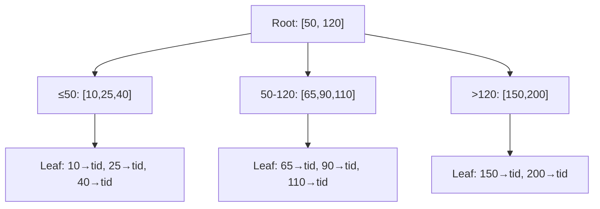

# T-609 · Database Index Structures

**IWI 8.30 · Advanced tier · Prerequisite for:** T-610 (query planning), T-611 (isolation levels), most of Chapter 08

**Verification note:** every `EXPLAIN` block in this chapter is real output from PostgreSQL 16, run in a disposable Docker container against a seeded 300,000-row `orders` table (5,000 customers). Nothing here is illustrative — see `MANIFEST.md` for the exact command. This matters because interviewers ask "what does that number mean" as a follow-up, and a fabricated plan can't survive that.

---

## 1. The concept

A B+Tree index is a sorted, balanced tree structure that lets the database find a row (or a small range of rows) in `O(log n)` comparisons instead of scanning every row. Every table lookup by an indexed column walks from the root, through internal nodes holding routing keys, down to a leaf node holding either the actual row (a clustered/index-organized table) or a pointer to the row's physical location (a heap tuple ID, in PostgreSQL's case — **every** PostgreSQL index is a secondary index over a heap; there is no clustered-index concept in the InnoDB sense).



## 2. Why it exists

Without an index, finding a row by any non-first-inserted criterion requires reading every page of the table — a sequential scan, `O(n)`. This is fine for small tables or when the query touches most of the table anyway (see §7, low-selectivity case), and ruinous for a point lookup on a large table. An index trades write-time cost (every insert/update/delete must also update the index) and storage (the index itself occupies disk and must be cached) for read-time speed on the specific access pattern it was built for.

## 3. How it works internally — walking a real lookup

Before any index exists, a point lookup on `customer_id` must read the entire table:

```sql
EXPLAIN (ANALYZE, BUFFERS) SELECT * FROM orders WHERE customer_id = 42;
```
```
 Gather  (cost=1000.00..5912.88 rows=60 width=35) (actual time=0.107..5.744 rows=60 loops=1)
   Workers Planned: 1
   ->  Parallel Seq Scan on orders  (cost=0.00..4906.88 rows=35 width=35) (actual time=0.053..4.082 rows=30 loops=2)
         Filter: (customer_id = 42)
         Rows Removed by Filter: 149970
         Buffers: shared hit=2701
 Execution Time: 5.754 ms
```

`Rows Removed by Filter: 149970` is the tell — the planner read (its half of) all 300,000 rows to find 60. After `CREATE INDEX idx_orders_customer ON orders(customer_id);`, the same query:

```
 Bitmap Heap Scan on orders  (cost=4.76..218.68 rows=60 width=35) (actual time=0.014..0.101 rows=60 loops=1)
   Recheck Cond: (customer_id = 42)
   Heap Blocks: exact=60
   Buffers: shared hit=60 read=2
   ->  Bitmap Index Scan on idx_orders_customer  (cost=0.00..4.75 rows=60 width=0) (actual time=0.008..0.008 rows=60 loops=1)
         Index Cond: (customer_id = 42)
 Execution Time: 0.111 ms
```

**5.754ms → 0.111ms, ~52x**, and read only the 60 matching rows via the index, then fetched their heap pages (`Bitmap Heap Scan`) to get the actual row data — because a normal index only stores the indexed column(s) plus a heap pointer, not the whole row.

## 4. Composite indexes and the leftmost-prefix rule

`CREATE INDEX idx_orders_customer_created ON orders(customer_id, created_at);` builds one B+Tree keyed on `(customer_id, created_at)` **in that order** — sorted first by customer, then by date within each customer. A query filtering both columns uses it fully:

```sql
SELECT * FROM orders WHERE customer_id = 42 AND created_at > '2025-01-01';
```
```
 Bitmap Heap Scan on orders (actual time=0.015..0.047 rows=30 loops=1)
   ->  Bitmap Index Scan on idx_orders_customer_created
         Index Cond: ((customer_id = 42) AND (created_at > '2025-01-01 00:00:00'::timestamp without time zone))
 Execution Time: 0.056 ms
```

But a query filtering **only the second column** cannot use this index at all — the tree is sorted by `customer_id` first, so "all rows with `created_at` in a range" are scattered across every branch of the tree, in no useful order:

```sql
SELECT * FROM orders WHERE created_at > '2025-06-01' AND created_at < '2025-06-02';
```
```
 Gather (actual time=0.214..6.077 rows=410 loops=1)
   ->  Parallel Seq Scan on orders
         Filter: ((created_at > ...) AND (created_at < ...))
         Rows Removed by Filter: 149795
 Execution Time: 6.094 ms
```

**This is the leftmost-prefix rule**, and it's the single most common index-design mistake: an index on `(a, b)` serves queries on `a` alone and on `(a, b)` together, but not on `b` alone. If both access patterns are real, two indexes (or one on `b` alone in addition) are needed.

## 5. Covering indexes and index-only scans

`CREATE INDEX idx_orders_covering ON orders(customer_id, created_at) INCLUDE (amount);` stores `amount` inside the index leaf pages without making it part of the sort key. If a query only needs columns present in the index, PostgreSQL can answer it **without touching the heap at all** — an index-only scan:

```sql
SET enable_bitmapscan = off;  -- see note below
EXPLAIN (ANALYZE, BUFFERS)
SELECT customer_id, created_at, amount FROM orders
WHERE customer_id = 42 AND created_at > '2025-01-01';
```
```
 Index Only Scan using idx_orders_covering on orders (actual time=0.017..0.018 rows=30 loops=1)
   Index Cond: ((customer_id = 42) AND (created_at > ...))
   Heap Fetches: 0
   Buffers: shared hit=4
 Execution Time: 0.078 ms
```

`Heap Fetches: 0` is the proof — every byte of the answer came from the index. **Why the `SET enable_bitmapscan = off`?** PostgreSQL's cost-based planner, at this table size, estimated a `Bitmap Heap Scan` as marginally cheaper than a plain `Index Only Scan` and chose it by default — and a bitmap scan always revisits the heap for its final recheck, so it doesn't get credited as index-only even when it reads from a covering index. This is itself worth saying out loud in an interview: **the planner is cost-based, not rule-based** — a covering index makes an index-only scan *possible*, not *guaranteed*, and the planner's choice depends on table statistics and configuration, which is exactly why `EXPLAIN ANALYZE` on the real data (not a guess) is the only trustworthy source of truth.

## 6. When the planner ignores your index — selectivity

An index on `status` exists in both queries below. `status = 'completed'` matches 199,767 of 300,000 rows (66%):

```
 Seq Scan on orders (actual time=0.005..14.084 rows=199767 loops=1)
   Filter: (status = 'completed'::text)
   Rows Removed by Filter: 100233
 Execution Time: 17.694 ms
```

The planner correctly ignored the index — walking a B+Tree and then randomly fetching two-thirds of the table's heap pages is slower than reading the heap sequentially once. `status = 'refunded'` (16.6% of rows) crosses the selectivity threshold where the index becomes worthwhile:

```
 Bitmap Heap Scan on orders (actual time=0.702..4.391 rows=49813 loops=1)
   ->  Bitmap Index Scan on idx_orders_status
         Index Cond: (status = 'refunded'::text)
 Execution Time: 5.276 ms
```

**Rule of thumb, not a hard threshold:** somewhere around 5–15% of the table is where an index typically stops paying for itself, depending on how clustered the matching rows are physically and how expensive random I/O is on the storage medium. There is no universal cutoff — this is exactly why `EXPLAIN ANALYZE` on real data beats memorizing a percentage.

## 7. Engine-specific correction — the feedback item this week targets

The named interview feedback used the phrase **"clustered vs non-clustered indexes."** That terminology is precise for SQL Server / MySQL-InnoDB, and **imprecise for PostgreSQL**:

- **InnoDB (MySQL):** the primary key *is* the clustered index — rows are physically stored in primary-key order, and every secondary index stores the PK value as its row pointer. This is why a wide primary key is expensive in InnoDB (it bloats every secondary index) and cheap in PostgreSQL.
- **PostgreSQL:** every table is a heap; every index (including the primary key's) is a secondary structure pointing at a heap tuple ID. `CLUSTER` exists as a one-off command that physically reorders the heap to match an index, but it is **not maintained** — the next `UPDATE` breaks the ordering again.

Naming this distinction — and which engine you're describing — is itself a depth signal worth volunteering unprompted (see Follow-up 8 below).

## 8. Trade-offs

| Benefit | Cost |
|---|---|
| `O(log n)` point lookups and range scans instead of `O(n)` | Every write (`INSERT`/`UPDATE`/`DELETE`) also updates every index on the table |
| Composite index serves multiple query shapes via the leftmost prefix | Wrong column order makes the index invisible to the queries that need it most |
| Covering index eliminates heap access entirely | Duplicates column data into the index, increasing storage and vacuum cost |
| Planner picks the cheapest available plan automatically | The planner can be wrong when statistics are stale — `ANALYZE` after bulk loads matters |

## 9. Interview questions, with follow-ups

**Q1. How does a B+Tree index actually find a row? Walk it from root to heap.**
*Follow-up:* "Why B+Tree and not a binary search tree or a hash table for this?" *(Hash indexes can't serve range queries or ordering; a plain BST isn't disk-page-aware — a B+Tree's high fan-out is specifically shaped to minimize disk page reads.)*

**Q2. Index on `(customer_id, created_at)` — which queries does it serve, which does it not, and why?**
*Expected:* states the leftmost-prefix rule precisely, with the §4 example.

**Q3. What is a covering index, and how do you know from `EXPLAIN` that you got one?**
*Expected:* names `Index Only Scan` and `Heap Fetches: 0` specifically — not just "it's faster."

**Q4. When is a sequential scan faster than an index scan?**
*Expected:* the §6 selectivity argument, with the reasoning (random I/O cost), not a memorized percentage.

**Q5. You added an index and the query got slower. Give two distinct mechanisms.**
*Expected:* (a) write amplification — every insert now updates N+1 structures instead of N; (b) stale statistics leading the planner to a worse plan than before, until the next `ANALYZE`.

**Q6. Why did the planner ignore your index? Three reasons.**
*Expected:* low selectivity (§6); stale statistics; the query needs a function or expression the plain index doesn't match (would need a functional/expression index).

**Q7. Clustered vs non-clustered — and what changes when the engine is PostgreSQL rather than InnoDB?**
*Expected:* the §7 distinction, unprompted if possible.

**Q8. What is an index-only scan, and what has to be true for PostgreSQL to actually choose one?**
*Expected, Staff-level:* the visibility map must mark the relevant heap pages all-visible (recent `VACUUM`), *and* the planner's cost model must favor it over alternatives — not automatic just because a covering index exists (§5).

## 10. Common mistakes

- Assuming "I added an index" is sufficient without checking `EXPLAIN` — the planner may ignore it (§6), or the column order may not match the query (§4).
- Indexing every column "just in case" — each index has a real write-time and storage cost; index what queries actually filter or sort by.
- Forgetting `ANALYZE` after a large bulk load — stale statistics can make the planner choose a sequential scan even when an index would clearly win.
- Confusing "has an index" with "uses that index for this query" — these are different claims and only `EXPLAIN` distinguishes them.

## 11. Staff-level discussion

At scale, index decisions become **write-path capacity planning**, not just read-path optimization: a table with 15 indexes has 15x the write amplification on every insert, which shows up as replication lag, longer transaction hold times, and vacuum pressure — costs that don't appear in a single `EXPLAIN` but dominate at production volume. The Staff-level version of "should we add this index" is "what does this cost the write path, and is the read-side win worth it at our actual write:read ratio" — a question the audit's source material never asked because it never went past the definition of an index at all.

## 12. Cheat sheet

| Situation | What to reach for |
|---|---|
| Point lookup on one column | Single-column B-Tree index |
| Filter on A, sometimes A+B together | Composite index `(A, B)` — never `(B, A)` for this pattern |
| Filter on B alone, unrelated to A | A separate index on `B`, or reconsider the query shape |
| Query only needs columns already in the index | Add the extra columns via `INCLUDE` for an index-only scan |
| Filter matches a large fraction of the table | Don't force an index — a sequential scan may genuinely be faster |
| Plan doesn't match expectation | `ANALYZE` the table first; stale stats are the most common cause |

## 13. Exercises

1. Reproduce §3 yourself: seed a table, run `EXPLAIN ANALYZE` before and after an index, and read the `Rows Removed by Filter` line.
2. Design an index (or set of indexes) for a table queried both as `WHERE customer_id = ? AND status = ?` and `WHERE status = ? AND created_at > ?`. Justify the column order for each.
3. Take a query in a system you know, run `EXPLAIN ANALYZE`, and identify whether it's using an index, and if not, whether that's actually a mistake or the planner making the right call (§6).

## 14. References

- PostgreSQL documentation, Ch. 11 "Indexes" (full)
- PostgreSQL documentation, Ch. 14.1 "Using EXPLAIN", Ch. 14.2 "Statistics Used by the Planner"
- Markus Winand, *Use The Index, Luke* — Ch. 1–3 (B-Tree, concatenated indexes, clustering)
