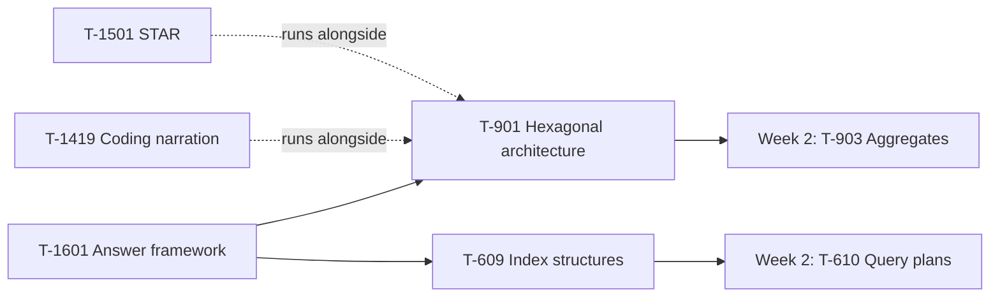

# Week 1 Study Pack — Architecture Boundaries + Index Fundamentals

**Plan:** A (Interview Emergency Sprint) · default workload 20h/week · see `00-project/learning-roadmap.md` §3 for full context
**Topics:** T-901 (Clean/Hexagonal Architecture) · T-609 (Database index structures) · T-1601 (Technical answer framework) · T-1501 (STAR) · T-1419 (Coding narration)
**Prerequisites:** none — this is the entry point

---

## Objective

Convert the two most concrete named interview-feedback weaknesses — architecture boundaries and index fundamentals — into answers you can deliver out loud at three lengths (30s / 2min / 10min). Establish the daily coding-narration and story-writing habits that run for all six weeks.

## Why this week, in this order

T-901 and T-609 are both prerequisites for Week 2's deeper material (aggregates need domain purity; query-plan reading needs index structures first), so they load first regardless of the model's raw priority ranking. T-1601 — the nine-layer answer framework — is scheduled in the same week as the first Deep topics rather than after them, because every subsequent week's output depends on being able to explain things at depth. It is the multiplier on everything else in this pack.

## Dependency graph

## Files in this pack

| # | File | Purpose |
|---|---|---|
| 1 | `README.md` | This file |
| 2 | `01-clean-hexagonal-architecture.md` | T-901 — full chapter: concept, internals, trade-offs, interview Q&A, exercises |
| 3 | `02-database-index-fundamentals.md` | T-609 — full chapter, with a real, executed PostgreSQL `EXPLAIN` lab |
| 4 | `03-technical-answer-framework.md` | T-1601 — the nine-layer answer stack, worked in full for T-901 |
| 5 | `04-coding-interview-communication.md` | T-1419 — six-phase narration protocol |
| 6 | `05-star-story-workbook.md` | T-1501 — STAR structure and blank extraction worksheets (no invented stories) |
| 7 | `06-domain-purity-exercise.md` | Deliverable template + one fully worked example + a documented counter-case |
| 8 | `07-java-coding-practice.md` | 7 problems, all compiled and run on OpenJDK 21, plus the LRU errata drill |
| 9 | `08-flashcards.md` | 12 spaced-repetition cards for this week's Deep topics |
| 10 | `09-week-1-mock-interview.md` | Candidate script and interviewer script, hard-separated |
| 11 | `10-week-1-evaluation-rubric.md` | Six-dimension scoring rubric with Week 1 evidence anchors |
| 12 | `11-week-1-checklist.md` | Day-by-day operational checklist |
| 13 | `resources.md` | Primary sources, classified by authority |
| — | `MANIFEST.md` | Every file, its verification status, and real checksums |

## Daily schedule (20h/week baseline)

| Day | Track A — Technical (2h) | Track B — Coding (0.75h) | Track C — Performance (0.75h) |
|---|---|---|---|
| Mon | Hexagonal architecture: concept + port/adapter definitions | LC 1, LC 167 — narrated | Build L1+L2 answer for T-901 |
| Tue | Index fundamentals: B+Tree lookup path, hand-trace it | LC 121 — state invariant first | Build L5+L6 — production example + trade-offs |
| Wed | Hexagonal: start `06-domain-purity-exercise.md` | LC 242, LC 49 | Build L3 deep dive; rehearse aloud |
| Thu | Indexes: composite/covering indexes, run the lab yourself | LC 3 — sliding window | Build L7+L8 — traps + 5-follow-up chain |
| Fri | Finish domain-purity exercise, including the verdict | **LC 146 — write it buggy, prove the failure, then fix it** | **Record L1/L2/L6 for T-901. Watch it back.** |
| Sat | — | Re-solve LC 146 from scratch, 25-min cap | Story inventory (20+ situations); write Stories 1–2; whiteboard T-901 |
| Sun | Weekly review against the exit criteria below | — | Self-mock using `09-week-1-mock-interview.md` |

### Workload variants

- **10h/week:** keep Mon/Tue/Fri Track A, LC 1 / LC 121 / LC 146, and the L1/L2/L6 recording + Story 1. Skip the domain-purity exercise's second pass and the composite-index section of Track A until Week 6 revision.
- **30h/week:** add the full `10h` question sets from `01-…` and `02-…` §"Follow-up questions", double the coding volume with two additional Blind-75 array/string problems, and do a partner mock instead of self-recorded on Friday.

## Exit criteria — all must pass before starting Week 2

- [ ] Explain hexagonal architecture in 30s, 2min, and 10min without notes
- [ ] Answer all 10 questions in `01-clean-hexagonal-architecture.md` §"Interview questions" aloud, unprompted, with a concrete example each
- [ ] `06-domain-purity-exercise.md` completed, including the "would I actually do it" verdict
- [ ] 8+ problems solved in Java with written retrospectives (`07-java-coding-practice.md`)
- [ ] LRU written correctly from scratch twice, and you can state the exact bug in the buggy version without looking it up
- [ ] 2 STAR stories drafted (Story 1: architecture decision, Story 2: technical disagreement)
- [ ] A baseline self-mock recorded using `09-week-1-mock-interview.md`, scored with `10-week-1-evaluation-rubric.md`

## Recording protocol

Friday's recording is the single highest-value artifact this week. Record audio or screen+audio while delivering L1 (30s), L2 (2min), and L6 (trade-offs, 2min) for T-901 cold, no notes. Watch it back before moving on — reading an answer and delivering it aloud are different skills, and only the second one is tested in an interview. If a recorder isn't available, a phone voice memo is enough; the point is hearing yourself, not production quality.
