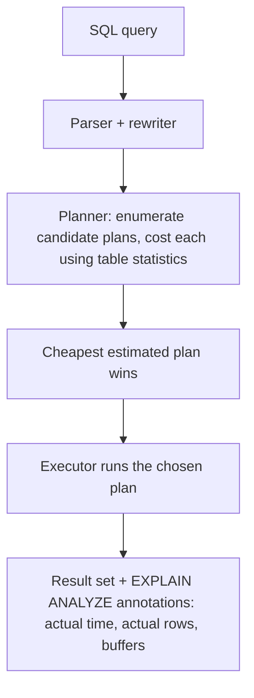

# T-610 · Query Planning and EXPLAIN

**IWI 7.90 · Advanced tier · Prerequisite:** T-609 (Week 1) — reading a plan requires already knowing what an index does

**Verification note:** all three scenarios below are real, executed PostgreSQL 16 output from a disposable Docker container, seeded with the same 300,000-row `orders` / 5,000-row `customers` schema as Week 1. Source and full output: `practice/sql/week-02/query-plan-lab.sql` and `query-plan-lab-output.txt`.

## Table of Contents

1. [The concept](#1-the-concept)
2. [Why it exists](#2-why-it-exists)
3. [Three real diagnosed scenarios](#3-three-real-diagnosed-scenarios)
4. [Join algorithms — when the planner picks each](#4-join-algorithms--when-the-planner-picks-each)
5. [Trade-offs](#5-trade-offs)
6. [Interview questions](#6-interview-questions)
7. [Common mistakes](#7-common-mistakes)
8. [Staff-level discussion](#8-staff-level-discussion)
9. [Summary](#9-summary)
10. [Key Takeaways](#10-key-takeaways)
11. [Cheat Sheet](#11-cheat-sheet)
12. [Flashcards](#12-flashcards)
13. [Practice Exercises](#13-practice-exercises)
14. [Additional Reading](#14-additional-reading)
15. [Official References](#15-official-references)

---

## 1. The concept

`EXPLAIN` shows the plan PostgreSQL's optimizer chose for a query — a tree of operations (scans, joins, aggregates) each annotated with an estimated cost. `EXPLAIN ANALYZE` actually *runs* the query and adds real timings and row counts alongside the estimates, which is what makes a plan diagnosable rather than merely descriptive: the gap between estimated and actual rows is often the entire diagnosis.



## 2. Why it exists

A query's correctness doesn't tell you its cost — the same SQL can be executed a dozen structurally different ways (different join order, different join algorithm, different scan type per table) all producing identical results at wildly different speeds. `EXPLAIN` exists because "the query is slow" is not a diagnosis; it's a symptom, and the plan is the only place the actual mechanism is visible.

## 3. Three real diagnosed scenarios

### Scenario 1 — missing index on a join column (a realistic, non-dramatic result)

**Before**, joining 5,000 customers to 300,000 orders filtered by region, with no index on `orders.customer_id` or `customers.region`:

```sql
EXPLAIN (ANALYZE, BUFFERS)
SELECT c.id, COUNT(o.id) FROM customers c
JOIN orders o ON o.customer_id = c.id
WHERE c.region = 'eu' GROUP BY c.id;
```
```
 ->  Hash Join (actual time=0.270..13.813 rows=37500 loops=2)
       ->  Parallel Seq Scan on orders o (actual time=0.003..6.105 rows=150000 loops=2)
       ->  Hash
             ->  Seq Scan on customers c (actual time=0.004..0.191 rows=1250 loops=2)
                   Filter: (region = 'eu'::text)
 Execution Time: 18.446 ms
```

**After** `CREATE INDEX idx_orders_customer_id ON orders(customer_id); CREATE INDEX idx_customers_region ON customers(region);`:

```
 ->  Hash Join (actual time=0.153..14.029 rows=37500 loops=2)
       ->  Parallel Seq Scan on orders o (actual time=0.002..6.297 rows=150000 loops=2)
       ->  Hash
             ->  Bitmap Heap Scan on customers c (actual time=0.019..0.088 rows=1250 loops=2)
                   ->  Bitmap Index Scan on idx_customers_region
 Execution Time: 18.074 ms
```

**Diagnosis and honest result:** 18.446ms → 18.074ms — a real but *modest* improvement, not the dramatic win a textbook example usually shows. The reason: the query still has to touch all 300,000 `orders` rows regardless of the customer index, because there's no `orders`-side filter to narrow that scan — the Hash Join reads the entire `orders` table as its probe side either way. The customer-side index sped up building the hash table, but that was never the bottleneck. **This is itself the lesson:** adding "the obviously missing index" doesn't always produce a dramatic win — you have to identify which side of the plan is actually dominating the cost before predicting the payoff.

### Scenario 2 — a function wrapped around an indexed column defeats the index

**Before**, filtering with `UPPER(status) = 'REFUNDED'` even though a plain index exists on `status`:

```sql
EXPLAIN (ANALYZE, BUFFERS) SELECT * FROM orders WHERE UPPER(status) = 'REFUNDED';
```
```
 Gather (actual time=0.090..20.613 rows=49635 loops=1)
   ->  Parallel Seq Scan on orders (actual time=0.024..18.575 rows=24818 loops=2)
         Filter: (upper(status) = 'REFUNDED'::text)
         Rows Removed by Filter: 125182
 Execution Time: 21.614 ms
```

A plain B-Tree index on `status` is built from the raw column values; it has no entry for `upper(status)`, so the planner cannot use it at all — it falls back to a sequential scan regardless of `status`'s selectivity.

**Fix:** `CREATE INDEX idx_orders_status_upper ON orders(UPPER(status));` — an expression index, built from the function's *result*, not the raw column.

```
 Bitmap Heap Scan on orders (actual time=0.806..4.850 rows=49635 loops=1)
   Recheck Cond: (upper(status) = 'REFUNDED'::text)
   ->  Bitmap Index Scan on idx_orders_status_upper
         Index Cond: (upper(status) = 'REFUNDED'::text)
 Execution Time: 5.805 ms
```

**21.614ms → 5.805ms, ~3.7x.** The fix could equally have been "don't wrap the column in a function" (`status = 'REFUNDED'`, case-normalized at write time) — both are valid; the expression index is the right call specifically when the application can't control how the predicate is written (e.g., an ORM-generated query).

### Scenario 3 — nested loop vs. hash join, same query, forced vs. free choice

**Forced nested loop** (`SET enable_hashjoin = off; SET enable_mergejoin = off;`), aggregating average order amount by customer region:

```
 ->  Nested Loop (actual time=0.008..32.484 rows=150000 loops=2)
       ->  Parallel Seq Scan on orders o (actual time=0.002..5.878 rows=150000 loops=2)
       ->  Memoize
             Cache Key: o.customer_id
             Hits: 148741  Misses: 5000
             ->  Index Scan using customers_pkey on customers c (actual time=0.000..0.000 rows=1 loops=10000)
 Execution Time: 47.811 ms
```

**Planner's free choice** (no restrictions):

```
 ->  Hash Join (actual time=0.538..19.539 rows=150000 loops=2)
       ->  Parallel Seq Scan on orders o (actual time=0.003..5.881 rows=150000 loops=2)
       ->  Hash
             ->  Seq Scan on customers c (actual time=0.003..0.236 rows=5000 loops=2)
 Execution Time: 35.048 ms
```

**47.811ms → 35.048ms.** Even with PostgreSQL's `Memoize` optimization softening the nested loop's repeated-lookup cost (148,741 cache hits out of 300,000), a hash join that builds one in-memory hash table over all 5,000 customers and probes it once per order still wins at this join cardinality. Nested loops win instead when one side is small *and* highly selective (see §4).

## 4. Join algorithms — when the planner picks each

| Algorithm | Wins when | Cost shape |
|---|---|---|
| **Nested loop** | One side is small, or a highly selective index lookup exists per outer row | `O(outer rows × cost of inner lookup)` — cheap if the inner lookup is `O(log n)` via an index |
| **Hash join** | Neither side is small enough for a cheap nested loop, equality condition | Build a hash table over the smaller side once, `O(n + m)` total |
| **Merge join** | Both sides are already sorted (or cheaply sortable) on the join key | `O(n log n + m log m)` for the sorts, `O(n + m)` for the merge itself |

## 5. Trade-offs

| Approach | Benefit | Cost |
|---|---|---|
| Trust the planner's free choice | Correct in the overwhelming majority of cases, no manual tuning | Occasionally wrong under stale statistics or unusual data skew |
| Forcing a join strategy (`SET enable_*`) | Useful for diagnosis, proving what the planner *would* do otherwise | Never appropriate in production application code — it's a debugging tool, not a tuning lever |
| Expression indexes (Scenario 2) | Makes function-wrapped predicates indexable | One more index to maintain on every write |

## 6. Interview questions

### Q1. Read `EXPLAIN ANALYZE` line by line. What is `rows=1000` vs `actual rows=48000` telling you?

- **Expected answer:** the planner's row-count estimate is off by 48x — a strong signal of stale statistics or a correlation the planner's single-column statistics can't model.
- **Common mistakes:** treating the estimate as if it were measured; not noticing the mismatch at all.
- **Follow-up questions:** "What would you do about it?" *(Run `ANALYZE`; if the mismatch persists, consider extended statistics on correlated columns.)*
- **Senior-level expectations:** identifies the mismatch and its likely cause.
- **Staff-level expectations:** names extended statistics (`CREATE STATISTICS`) as the fix when the correlation is between columns, not just stale single-column stats.

### Q2. Nested loop vs hash join vs merge join — when does the planner pick each?

- **Expected answer:** the §4 table, in the planner's own cost terms, not just "small vs big tables."
- **Common mistakes:** claiming one algorithm is "always faster."
- **Follow-up questions:** "Why did scenario 3's nested loop only cost 47ms instead of far more, given 300,000 outer rows?" *(`Memoize` — PostgreSQL caches recent inner-side lookups, turning many repeated lookups into cache hits.)*
- **Senior-level expectations:** states the general rule correctly.
- **Staff-level expectations:** names `Memoize` and its effect on nested-loop cost, as demonstrated live in Scenario 3.

### Q3. You added an index and the query got slower. Give two distinct mechanisms.

- **Expected answer:** write amplification, and stale statistics leading the planner to prefer a worse plan (same as T-609 §9 Q5 — this is the query-planning side of the same fact).
- **Common mistakes:** naming only one.
- **Follow-up questions:** "How would you confirm which one it is?"
- **Senior-level expectations:** names both.
- **Staff-level expectations:** proposes `EXPLAIN ANALYZE` before/after as the confirming diagnostic, not guesswork.

### Q4. Why did the planner ignore your index? Three reasons.

- **Expected answer:** low selectivity, stale statistics, or a function wrapped around the column with no matching expression index (Scenario 2).
- **Common mistakes:** forgetting the function-wrapping case specifically.
- **Follow-up questions:** "You just found a function-wrapped predicate defeating an index. Two possible fixes?"
- **Senior-level expectations:** names at least two of the three reasons.
- **Staff-level expectations:** names all three and proposes both fixes for the function-wrapping case (expression index, or rewrite the predicate).

## 7. Common mistakes

- Reading only the top line of a plan and missing where the actual cost concentrates (usually the deepest, most-looped node).
- Assuming an added index will help without checking which side of the join actually dominates the cost (Scenario 1's honest lesson).
- Using `SET enable_hashjoin = off` style overrides in production code rather than as a diagnostic tool.

## 8. Staff-level discussion

At Staff scope, query-plan literacy is what separates "the query is slow, add an index" from "the query is slow because of X specific mechanism, here's the fix and here's what it costs on the write path." The three scenarios in this chapter were deliberately chosen to include one modest, honestly-reported result (Scenario 1) alongside two dramatic ones — a Staff-level engineer doesn't just recite "indexes make things faster," they can predict *in advance*, from the plan shape, whether a given fix will actually move the needle before spending the engineering time to add it.

## 9. Summary

`EXPLAIN ANALYZE` shows the actual plan, not just the estimated one, which is what turns "it's slow" into a diagnosable problem. The three real scenarios in this chapter show a missing index with a modest payoff, a function-wrapped predicate fixed by an expression index (~3.7x), and a forced nested loop vs. the planner's free hash-join choice (~1.4x) — three different mechanisms, not one universal "just add an index" story.

## 10. Key Takeaways

- `EXPLAIN ANALYZE`, not `EXPLAIN` alone — estimates without actuals can't be diagnosed.
- A large estimate-vs-actual gap signals stale statistics or under-modeled column correlation.
- Not every missing index produces a dramatic win — check which side of the plan actually dominates cost first.
- A function wrapped around an indexed column needs a matching expression index.
- `enable_hashjoin`/`enable_mergejoin` overrides are diagnostic tools only, never production configuration.

## 11. Cheat Sheet

See §4 above for the join-algorithm decision table.

## 12. Flashcards

1. **Q: What's the single most useful `EXPLAIN` flag combination for diagnosis?** A: `(ANALYZE, BUFFERS)` — real timings plus real I/O counts.
2. **Q: What does a large estimate-vs-actual row mismatch usually mean?** A: Stale statistics, or column correlation the planner's per-column stats can't capture.
3. **Q: Why can't a plain index serve `WHERE UPPER(col) = ?`?** A: The index is built on raw values; it has no entry matching the function's output. Needs an expression index.
4. **Q: When does a nested loop beat a hash join despite a large outer side?** A: When the inner-side lookups are cheap (indexed) and repeated values let `Memoize` turn many of them into cache hits.

(Full week-level deck: `08-flashcards.md`.)

## 13. Practice Exercises

1. Reproduce all three scenarios yourself: `practice/sql/week-02/query-plan-lab.sql`.
2. Construct your own function-wrapped-predicate case against a table you control, and fix it with an expression index.
3. Take a real slow query from a system you know, run `EXPLAIN ANALYZE`, and classify which of this chapter's mechanisms (missing index, function-wrapped predicate, suboptimal join choice, stale statistics) is actually responsible before proposing a fix.

## 14. Additional Reading

- Markus Winand, *Use The Index, Luke*, Ch. 4 "The Join Operation"

## 15. Official References

- PostgreSQL documentation, [Ch. 14.1 "Using EXPLAIN"](https://www.postgresql.org/docs/current/using-explain.html)
- PostgreSQL documentation, [Ch. 14.2 "Statistics Used by the Planner"](https://www.postgresql.org/docs/current/planner-stats.html)
