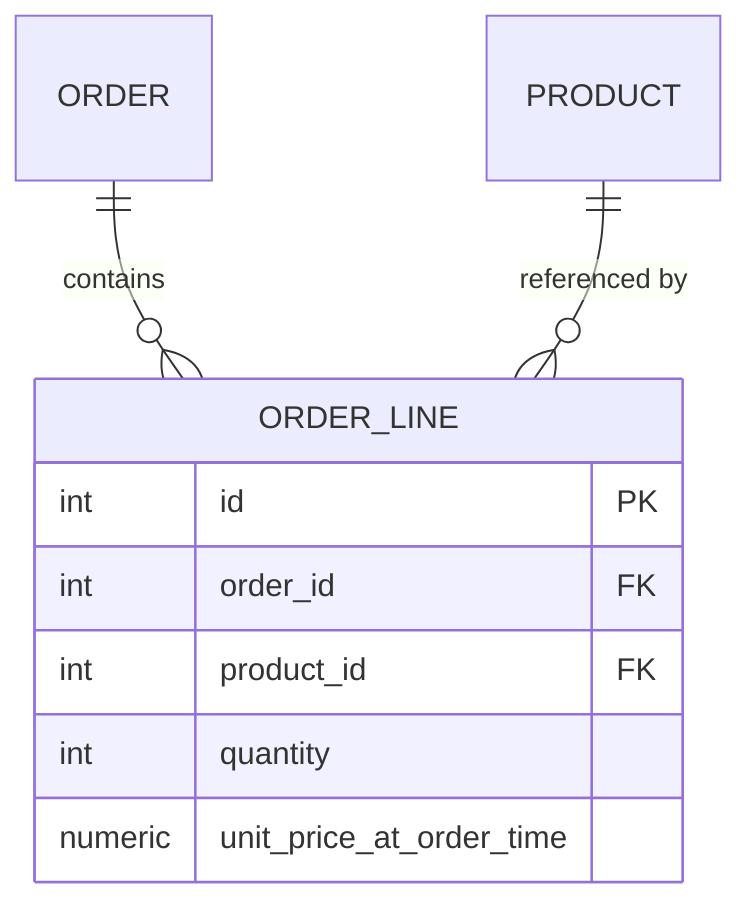

# T-605 / T-608 · Data Modelling and Explicit Join Tables

**IWI 5.20 · Advanced tier**

**Verification note:** the many-to-many demonstration in §3, including the data-integrity bug, is real executed PostgreSQL 16 output. Source: `practice/sql/week-02/many-to-many-lab.sql`; full output: `many-to-many-lab-output.txt`.

## Table of Contents

1. [The concept](#1-the-concept)
2. [Why it exists](#2-why-it-exists)
3. [The trap, demonstrated](#3-the-trap-demonstrated)
4. [How it works internally](#4-how-it-works-internally)
5. [Trade-offs](#5-trade-offs)
6. [Interview questions](#6-interview-questions)
7. [Common mistakes](#7-common-mistakes)
8. [Staff-level discussion](#8-staff-level-discussion)
9. [Summary](#9-summary)
10. [Key Takeaways](#10-key-takeaways)
11. [Cheat Sheet](#11-cheat-sheet)
12. [Flashcards](#12-flashcards)
13. [Practice Exercises](#13-practice-exercises)
14. [Additional Reading](#14-additional-reading)
15. [Official References](#15-official-references)

---

## 1. The concept

A many-to-many relationship between two entities (`Order` and `Product`) requires a third table to represent it in a relational schema. The naive version — a pure join table with just the two foreign keys — is what an unannotated JPA `@ManyToMany` generates by default. The moment the relationship itself has any attribute of its own (how many units, at what price, when, in what status), a plain join table has nowhere to put it, and the relationship needs to become its own entity — an **explicit join entity** — with its own primary key and columns.

## 2. Why it exists

The distinction matters because ORMs make the naive version the path of least resistance: annotate two fields `@ManyToMany` and the framework generates the join table silently. This is correct exactly as long as the relationship truly carries no data of its own. The moment "3 units of Widget on this order" needs to be recorded, the relationship *is* data, and modelling it as a plain join table either loses that data entirely or forces it into a schema that can't express it.



## 3. The trap, demonstrated

A naive join table has no room for quantity at all:

```sql
CREATE TABLE order_products_naive (
  order_id INT NOT NULL REFERENCES customer_orders(id),
  product_id INT NOT NULL REFERENCES products(id),
  PRIMARY KEY (order_id, product_id)
);
```
```
$ \d order_products_naive
   Column   |  Type   | Nullable
------------+---------+----------
 order_id   | integer | not null
 product_id | integer | not null
```

There is genuinely no column for "how many." The fix is an explicit join entity:

```sql
CREATE TABLE order_lines (
  id INT PRIMARY KEY,
  order_id INT NOT NULL REFERENCES customer_orders(id),
  product_id INT NOT NULL REFERENCES products(id),
  quantity INT NOT NULL CHECK (quantity > 0),
  unit_price_at_order_time NUMERIC(10,2) NOT NULL,
  UNIQUE (order_id, product_id)
);
```

**But the more important defect isn't quantity — it's price history**, and this one is a real, reproducible data-integrity bug, not just a missing feature. After inserting a `Widget` at `$9.99` into both tables and then changing the product's live price to `$12.99`:

```sql
UPDATE products SET unit_price = 12.99 WHERE id = 1;
```

The naive join table, which has to re-fetch price from the live `products` table on every read, now silently reports the **wrong historical total**:

```
Naive approach (join table, no locked price) would now report the WRONG historical total:
  name  | current_price_wrongly_used_for_history
--------+----------------------------------------
 Widget |                                  12.99
```

The explicit `order_lines` entity, which locked `unit_price_at_order_time` at insert time, still reports correctly:

```
Explicit order_lines entity still reports the CORRECT historical total:
 id |  name  | quantity | unit_price_at_order_time | line_total
----+--------+----------+---------------------------+------------
  1 | Widget |        3 |                      9.99 |      29.97
```

**This is the trigger for the explicit entity, stated precisely:** not "the relationship has attributes" in the abstract, but "any fact about the relationship needs to be true *as of the time the relationship was formed*, not as of whenever it's read." A naive join table has no concept of "as of when."

## 4. How it works internally

In JPA terms: `@ManyToMany` generates the naive join table and gives you no entity to attach fields to. The fix is to **model the join table as its own `@Entity`** (`OrderLine`), with `@ManyToOne` relationships to both `Order` and `Product`, plus whatever fields the relationship itself needs. This is a modelling decision, not a Hibernate configuration flag — there's no annotation that adds columns to a `@ManyToMany` join table; the table has to become a first-class entity.

## 5. Trade-offs

| Approach | Benefit | Cost |
|---|---|---|
| Naive `@ManyToMany` join table | Zero extra code, framework-generated | Cannot record any fact about the relationship itself — not even a timestamp |
| Explicit join entity | Full generality — any fact about the relationship has somewhere to live | An extra entity class, an extra mapper, one more join in every query touching the relationship |

## 6. Interview questions

### Q1. Model many-to-many between `Order` and `Product`. Now the relationship needs `quantity` — what changes, and why was the original `@ManyToMany` a trap?

- **Expected answer:** the join table becomes an explicit entity (`OrderLine`) with its own primary key and a `quantity` column; the "trap" is that `@ManyToMany` looks free until the relationship needs its own data.
- **Common mistakes:** trying to add a column to the framework-generated join table directly rather than promoting it to an entity.
- **Follow-up questions:** "What if the relationship needs a *history* of quantities over time, not just the current one?" *(A further modelling step — either an append-only `order_line_events` table, or accepting that `order_lines` only tracks current state and history lives elsewhere.)*
- **Senior-level expectations:** correctly proposes the explicit entity.
- **Staff-level expectations:** identifies the price-history trigger (§3) unprompted, not just the quantity case — this is the less obvious, more consequential version of the same defect.

### Q2. When is an explicit join entity mandatory rather than optional?

- **Expected answer:** whenever any fact about the relationship must be true "as of" its formation time rather than "as of" read time (§3's precise trigger).
- **Common mistakes:** saying "whenever there's an extra column" without the "as of" framing — this misses the price-history case, which has no obvious "extra column" until you think about time.
- **Follow-up questions:** "Give an example where the relationship has no extra column today but will need one later."
- **Senior-level expectations:** states a reasonable trigger condition.
- **Staff-level expectations:** states the "as of formation time" framing precisely, and can produce the price-history example unprompted.

## 7. Common mistakes

- Treating "does the relationship have an attribute" as the only test — the price-history case has no obvious attribute until you ask "what if the referenced data changes later."
- Adding a `created_at` column to a naive join table without confronting that it's now, functionally, an entity — better to make that explicit in the model.

## 8. Staff-level discussion

This modelling choice generalizes far beyond order lines: **any many-to-many relationship where one side's data can change independently of when the relationship was formed** needs an explicit join entity to avoid silently rewriting history. This shows up in permission grants (a role's permissions changing after a grant was made), pricing agreements, and versioned configuration — the order-line case is the canonical teaching example, but the underlying principle — "snapshot facts that must survive changes to their source" — is a recurring modelling decision at Staff scope.

## 9. Summary

A plain many-to-many join table can only record *that* two entities are related, not *any fact about* the relationship. The moment a fact needs to survive independent changes to either side (a quantity, and especially a price that can change later), the join table must become an explicit entity with its own key and columns. The real executed demonstration in §3 shows this isn't hypothetical: the naive table silently reports a wrong historical total the moment a referenced price changes.

## 10. Key Takeaways

- `@ManyToMany` is correct only when the relationship truly carries no data of its own.
- The real trigger for an explicit join entity is "as of formation time" vs. "as of read time," not just "has an extra column."
- A naive join table's price-history bug is real and silent — it doesn't error, it just returns the wrong number.

## 11. Cheat Sheet

| Signal | Naive join table OK | Needs explicit join entity |
|---|---|---|
| Relationship carries no data of its own | ✅ | — |
| Needs a quantity, status, or similar attribute | — | ✅ |
| Any referenced fact (price, terms) can change after the relationship formed | — | ✅ — snapshot it at formation time |

## 12. Flashcards

1. **Q: What can't a plain `@ManyToMany` join table store?** A: Any fact about the relationship itself — no columns beyond the two foreign keys.
2. **Q: What's the real trigger for an explicit join entity, precisely?** A: Any fact that must be true "as of" relationship-formation time, not "as of" read time — not just "has an extra attribute."
3. **Q: Give the canonical silent-bug example.** A: An order line's price re-fetched live from `products` reports the *current* price for old orders once the product's price changes — the naive join table has no way to lock in the historical price.

(Full week-level deck: `08-flashcards.md`.)

## 13. Practice Exercises

1. Reproduce the price-history bug yourself: `practice/sql/week-02/many-to-many-lab.sql`.
2. Take a many-to-many relationship in a system you know. Determine, using the "as of formation time" test, whether it should be an explicit entity today — even if it currently has no extra columns.

## 14. Additional Reading

- Vaughn Vernon, *Implementing Domain-Driven Design* — read alongside `03-ddd-tactical-aggregates.md`; an `OrderLine` explicit join entity is frequently also the natural aggregate-internal entity in a DDD model of the same domain.

## 15. Official References

- [Jakarta Persistence specification](https://jakarta.ee/specifications/persistence/) — `@ManyToMany` and `@ElementCollection` semantics
