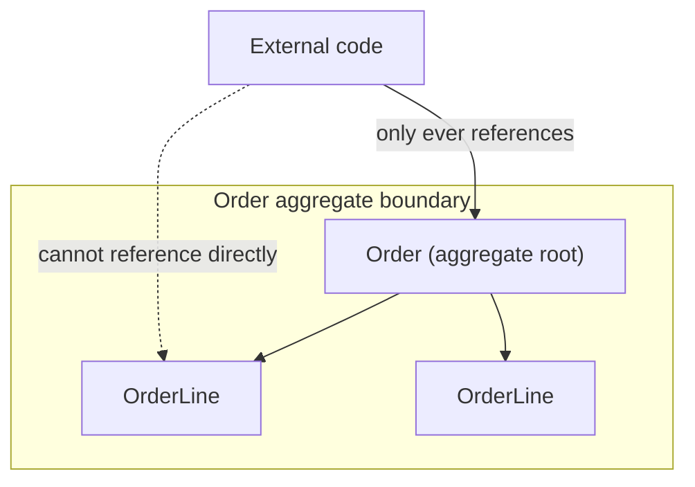

# T-903 · DDD Tactical Design — Aggregates

**IWI 7.25 (paired with T-901) · Advanced tier · Prerequisite:** T-901 (Week 1) — an aggregate's persistence-agnostic modelling depends on the domain already being free of infrastructure dependencies.

## Table of Contents

1. [The concept](#1-the-concept)
2. [Why it exists](#2-why-it-exists)
3. [How it works internally](#3-how-it-works-internally)
4. [Trade-offs](#4-trade-offs)
5. [Interview questions](#5-interview-questions)
6. [Common mistakes](#6-common-mistakes)
7. [Staff-level discussion](#7-staff-level-discussion)
8. [Summary](#8-summary)
9. [Key Takeaways](#9-key-takeaways)
10. [Cheat Sheet](#10-cheat-sheet)
11. [Flashcards](#11-flashcards)
12. [Practice Exercises](#12-practice-exercises)
13. [Additional Reading](#13-additional-reading)
14. [Official References](#14-official-references)

---

## 1. The concept

An **aggregate** is a cluster of domain objects treated as a single consistency unit — one object (the **aggregate root**) is the only entry point the outside world is allowed to reference; everything inside the boundary is only reachable through the root. `Order` is a root; its `OrderLine` entities are only ever accessed via `order.getLines()`, never loaded or modified independently.



## 2. Why it exists

Without an explicit consistency boundary, "business rule" invariants — an order's total must equal the sum of its lines, a bank account can't go negative — have no single place enforcing them, because any code anywhere can load and modify an `OrderLine` independently of its parent `Order`. The aggregate boundary is the answer to "what has to be true, all at once, for this data to be valid" — and it is deliberately also the **transaction boundary**: a single aggregate is saved atomically, in one transaction, and cross-aggregate consistency is handled through eventual consistency (events, sagas) rather than a shared database transaction.

## 3. How it works internally

**Sizing rule:** an aggregate should be as small as the true invariant requires, not as large as "everything related." `Order` and `OrderLine` are one aggregate because the order total genuinely must be consistent with its lines at all times. `Customer` is a *separate* aggregate from `Order` — an order references a customer by ID, not by object reference, because there's no invariant requiring the customer's data and a specific order's data to change atomically together.

**Repository-per-aggregate:** each aggregate root gets exactly one repository (`OrderRepository`, not `OrderLineRepository`) — this is the same port pattern from T-901, applied at aggregate granularity. `OrderLine` has no repository because nothing outside the `Order` aggregate is allowed to load or save it independently.

**Sketch — illustrates the shape, not compiled standalone:**

```java
public class Order {
    private OrderId id;
    private List<OrderLine> lines = new ArrayList<>();
    private OrderStatus status;

    public void addLine(ProductId productId, int quantity, Money unitPrice) {
        if (status != OrderStatus.DRAFT) {
            throw new IllegalStateException("cannot modify a placed order");
        }
        lines.add(new OrderLine(productId, quantity, unitPrice));
    }

    public Money total() {
        return lines.stream()
            .map(OrderLine::lineTotal)
            .reduce(Money.ZERO, Money::add);
    }

    // No public method lets external code fetch or replace `lines` directly —
    // every mutation goes through a root method that can enforce an invariant.
}
```

## 4. Trade-offs

| Benefit | Cost |
|---|---|
| Invariants are enforced in exactly one place, always | Cross-aggregate operations can't use a single ACID transaction — need sagas/eventual consistency |
| Clear repository-per-aggregate boundary simplifies persistence | Under-sizing (aggregate too small) pushes invariants outside the model; over-sizing hurts concurrency (whole aggregate locked/loaded for any change) |
| Concurrency conflicts are scoped to one aggregate instance, not the whole database | Requires real domain modelling effort — this isn't a mechanical, always-obvious decision |

## 5. Interview questions

### Q1. What is an aggregate boundary, and why is it a *transaction* boundary?

- **Expected answer:** the boundary around objects that must be consistent together, saved atomically in one transaction; anything outside is eventually consistent.
- **Common mistakes:** describing aggregates purely in terms of object composition ("things that belong together") without the invariant/consistency framing.
- **Follow-up questions:** "Two transactions need to update two different aggregates together. Now what?" *(A saga, an outbox pattern, or accepting eventual consistency — not a shared transaction across aggregates.)*
- **Senior-level expectations:** states the invariant-driven boundary correctly.
- **Staff-level expectations:** names a concrete cross-aggregate consistency mechanism (saga/outbox) when the follow-up hits, not just "eventual consistency" as a buzzword.

### Q2. What is the aggregate sizing rule, precisely?

- **Expected answer:** as small as the true invariant requires — not "everything conceptually related."
- **Common mistakes:** modelling `Customer` and all their `Order`s as one aggregate "because they're related" — this makes every order touch-lock the customer.
- **Follow-up questions:** "Give an example of an aggregate that's too large, and what breaks."
- **Senior-level expectations:** states the sizing principle and can identify an over-sized example.
- **Staff-level expectations:** connects over-sizing to a concrete concurrency cost (lock contention, larger blast radius for conflicts) rather than a purely stylistic objection.

## 6. Common mistakes

- Modelling an aggregate around object *composition* ("an order has lines, so they're one aggregate, and also has a customer, so that's included too") instead of around the actual consistency invariant.
- Giving a non-root entity (`OrderLine`) its own repository, which allows code to bypass the root's invariant-enforcing methods entirely.
- Assuming aggregates map one-to-one onto database tables — they don't; `Order` + `OrderLine` is one aggregate spanning two tables (see `02-data-modelling-join-tables.md`).

## 7. Staff-level discussion

Aggregate boundaries are, in practice, the seams along which a system can later be decomposed into services (previewing Week 5's T-907/T-908) — a well-drawn aggregate boundary today is very often the correct service boundary tomorrow, because both are answering the same underlying question: "what has to be consistent together, and what can be eventually consistent." Getting this wrong early (aggregates too large, spanning what should be separate consistency domains) is one of the most common root causes of a monolith that resists decomposition later — the coupling isn't accidental, it was modelled in from the start.

## 8. Summary

An aggregate is the smallest cluster of objects that must be consistent together, entered only through its root, and saved atomically as a transaction boundary. Sizing it correctly — no larger than the true invariant requires — is a modelling skill, not a mechanical rule, and getting it wrong shows up later as either broken invariants (too small) or crippling lock contention (too large).

## 9. Key Takeaways

- Aggregate boundary = consistency boundary = transaction boundary, all three together.
- Only the root has a repository; internal entities are reached only through the root.
- Cross-aggregate consistency is eventual, not transactional — sagas/outbox, not a shared `@Transactional`.
- Aggregate boundaries drawn well today are frequently the service boundaries of tomorrow.

## 10. Cheat Sheet

| Question to ask | If yes → same aggregate | If no → separate aggregates |
|---|---|---|
| Must these objects be consistent *right now*, together, always? | Yes | No — reference by ID, eventual consistency |
| Would a change to one require locking/loading the other anyway? | Yes | No |

## 11. Flashcards

1. **Q: What is an aggregate root?** A: The only object in an aggregate that external code is allowed to reference directly.
2. **Q: What decides aggregate boundaries?** A: The true consistency invariant — not object composition or conceptual relatedness.
3. **Q: How many repositories does an aggregate get?** A: One, for the root only.

(Full week-level deck: `08-flashcards.md`.)

## 12. Practice Exercises

1. Take `Order`/`OrderLine`/`Customer` from `02-data-modelling-join-tables.md`. Confirm: is `Customer` correctly a separate aggregate from `Order`? State the invariant test that proves it.
2. Identify one aggregate in a system you know that is arguably over-sized. Name the specific lock-contention or blast-radius cost this creates.

## 13. Additional Reading

- This chapter previews Week 5's T-907/T-908 (microservice decomposition) — the aggregate-boundary-as-service-boundary connection is worth re-reading once that week is reached.

## 14. Official References

- Vaughn Vernon, *Domain-Driven Design Distilled*, Ch. 5 "Tactical Design with Aggregates"
- Eric Evans, *Domain-Driven Design*, Ch. 6 "The Life Cycle of a Domain Object" (original aggregate definition)
